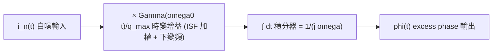

# Phase Noise 的 DSP 視角

> 先備：[stochastic_noise_basics](/02_foundations/stochastic_noise_basics) · [white_noise_to_phase_noise](/03_isf_core_theory/white_noise_to_phase_noise) ｜ 接下來：[psd_phase_noise_jitter](/02_foundations/psd_phase_noise_jitter)

前面兩頁從電路與頻域算 phase noise；這頁換一副眼鏡——**用訊號處理（DSP）的觀點重看
同一件事**：把 excess phase $\phi(t)$ 看成一個**線性系統的輸出**，輸入是 noise 電流，
中間經過兩個方塊：(1) 一個**時變增益** $\Gamma(\omega_0 t)/q_{max}$（ISF 加權），
(2) 一個**理想積分器** $\int dt$。

這個觀點的回報非常大：一旦把它畫成 block diagram，你立刻看出 phase noise 的
$-20$ dB/dec（1/f²）斜率**根本不是巧合——它就是積分器的頻率響應**。同時，這也是把
[P1] 的連續時間積分式 [P1] Eq.(11) 翻譯成「離散時間模擬程式」（lab_06）的橋。

> **物理直覺（先講大局）**：積分器把「白的東西」變成「越低頻越大的東西」。白噪輸入、
> 經過積分器，輸出的 PSD 就帶一個 $1/\omega^2$——這就是 1/f² 相位雜訊。ISF 只是在
> 積分前先幫輸入「按相位加權與下變頻」。**phase noise = ISF 加權的白噪，被積分器整形。**

## 1. 把 [P1] Eq.(11) 讀成一條訊號處理流程

[P1] 的中心式（規範第 3 節公式 4）：

$$
\phi(t)=\frac{1}{q_{max}}\int_{-\infty}^{t}\Gamma(\omega_0\tau)\,i_n(\tau)\,d\tau .
$$

DSP 拆法：先定義「ISF 加權後的等效噪流」

$$
y(\tau)\equiv\frac{\Gamma(\omega_0\tau)}{q_{max}}\,i_n(\tau),
$$

那麼 $\phi(t)=\int_{-\infty}^{t}y(\tau)\,d\tau$——**$\phi$ 就是 $y$ 的累積積分**。
畫成方塊：



- **方塊 B（ISF 加權）是 LTV（線性時變）**：增益隨時間週期變化（週期 $T$），這正是
  [P1] 強調「振盪器對 noise 是 time-variant 不是 time-invariant」（claim C1）的數學身影。
  它的作用是**頻率搬移**：把 $n\omega_0$ 附近的噪「下變頻」到 baseband（[P1] Eq.(13)、Fig. 8）。
- **方塊 C（積分器）是 LTI（線性非時變）**：它的頻率響應就是 $1/(j\omega)$。

## 2. 為什麼積分器 1/(jω) 把白噪變 1/f²（招牌斜率的由來）

一個理想積分器 $\phi(t)=\int y\,dt$，在頻域是除以 $j\omega$：

$$
\Phi(j\omega)=\frac{1}{j\omega}\,Y(j\omega)\quad\Longrightarrow\quad
|H_{\text{int}}(j\omega)|^2=\frac{1}{\omega^2}.
$$

線性系統對 PSD 的法則是 **$S_{\text{out}}=|H|^2\,S_{\text{in}}$**。若 ISF 加權後的等效輸入
$y$ 在我們關心的 offset 頻段近似為白（功率 $\propto\Gamma_{rms}^2 S_i/q_{max}^2$），則：

$$
\boxed{\ S_\phi(\Delta\omega)=|H_{\text{int}}|^2\,S_y=\frac{1}{\Delta\omega^2}\cdot\frac{\Gamma_{rms}^2}{q_{max}^2}\,S_i\ }
$$

- **dimension check**：$[1/(\text{rad/s})^2]\times[(\text{rad}^2)\cdot\text{A}^2/\text{Hz}/\text{C}^2]$。
  $\Gamma$ 無因次、$q_{max}$ 是 C、$S_i$ 是 $\text{A}^2/\text{Hz}=\text{C}^2/(\text{s}^2\cdot\text{Hz})$，
  整理後得 $\text{rad}^2/\text{Hz}$（這裡把 $1/(\text{rad/s})^2$ 的 rad² 視為相位 rad²），與 $S_\phi$ 單位一致 ✓。
- **這就是 1/f²**：$S_\phi\propto1/\Delta\omega^2$，在 log-log 圖上是 $-20$ dB/dec。
  換成 dBc/Hz（$\mathcal{L}\approx\frac12 S_\phi$）仍是 $-20$ dB/dec 的 skirt。
- **與 [P1] Eq.(21) 的對照（含著名 factor-of-2）**：用時域「白噪 × ISF → 積分」乾淨推導
  得到 $\mathcal{L}=\Gamma_{rms}^2 S_i/(2q_{max}^2\Delta\omega^2)$，而 [P1] Eq.(21) 寫成
  $/(4\Delta\omega^2)$。差的 2 倍純粹來自 SSB 記帳慣例（$\mathcal{L}\approx\frac12 S_\phi$），
  **不影響** $\Gamma_{rms}^2/q_{max}^2$ scaling 與 $-20$ dB/dec 斜率。完整討論見
  [white_noise_to_phase_noise](/03_isf_core_theory/white_noise_to_phase_noise)。
- **flicker 的延伸**：若輸入不是白的而是 1/f（[P1] Eq.(22)），經過同一個 $1/\omega^2$
  積分器，輸出就是 $1/\omega^3$——這就是 close-in 的 1/f³ phase noise（[P1] Eq.(23)）。
  DSP 觀點把「1/f² 與 1/f³」統一成「同一個積分器作用在不同顏色的輸入上」。

> **這也解釋了「為什麼相位會累積、振幅不會」**：積分器有**無限 DC 增益**（$1/\omega\to\infty$
> when $\omega\to0$），所以相位對極低頻擾動無限敏感、會 random-walk 漂移（沒有恢復力）；
> 振幅那條路則有一個 decay（恢復）極點，是高通/有限增益的，擾動被拉回。對照
> [phase_vs_amplitude_noise](/02_foundations/phase_vs_amplitude_noise)（claim C2）。

## 3. 從連續時間到離散模擬：怎麼把上式變成程式（lab_06）

要在電腦上驗證上面的理論，得把連續積分換成離散累加。採樣頻率 $f_s$、間隔
$\Delta t_s=1/f_s$，[P1] Eq.(11) 的離散版是一個**累積和（cumulative sum）**：

$$
\phi[k]=\frac{\Delta t_s}{q_{max}}\sum_{m=0}^{k}\Gamma(\omega_0\,m\,\Delta t_s)\,i_n[m].
$$

- **$\Delta t_s$ 的角色**：把「離散和」校正回「積分」的物理量綱。漏掉 $\Delta t_s$ 是離散化
  最常見的錯（單位會差一個 $f_s$）。
- **離散白噪的 PSD**：要產生單邊 PSD 為 $S_i$ 的白噪序列，每個樣本的變異數須設成
  $\sigma^2=S_i\cdot f_s/2$（單邊→雙邊的 factor-of-2 與取樣頻寬 $f_s/2$）。這個常數
  必須跟前面解析式一致，數值才會疊在理論線上。
- **`cumsum` = 積分器**：`numpy.cumsum` 就是離散積分器；它的頻率響應在低頻趨近 $1/\omega$，
  正是我們要的 1/f² 來源。

對應的核心 code（用規範第 5 節的真實函式）：

```python
import numpy as np
from simulations.common.noise_utils import white_noise, estimate_psd
from simulations.common.isf_utils import apply_isf_weighting, gamma_lc_ideal

# 0) 時間軸
t = np.arange(N) / fs

# 1) 產生白噪電流序列 i_n[m]，單邊 PSD = S_i
i_n = white_noise(n=N, psd=1e-24, fs=fs, rng=rng)          # A, white

# 2a) ISF 加權（只做時變相乘，「不」積分）：y[m] = Gamma(w0 t)/qmax * i_n
y = apply_isf_weighting(t, i_n, gamma_func=gamma_lc_ideal, qmax=1e-12, omega0=2*np.pi*5e9)

# 2b) 積分器：phi[k] = dt * cumsum(y) —— cumsum×dt 才是真正的離散積分
dt = 1.0 / fs
phi = np.cumsum(y) * dt

# 3) Welch PSD 估計，驗證 S_phi ∝ 1/f^2
f, S_phi = estimate_psd(phi, fs=fs, nperseg=4096)
```

完整 script：`simulations/lab_06_white_noise_phase_noise.py`（見
[lab_06](/04_simulation_labs/lab_06_white_noise_phase_noise)）。這是
**pedagogical toy model**（理想 LC 的 $\Gamma=-\sin\theta$、單一白噪源），非 transistor-level。

## 4. Welch PSD 估計：怎麼「量」出 S_φ(f)

你模擬出一條 $\phi[k]$ 時間序列，要怎麼還原出它的 PSD $S_\phi(f)$ 來跟理論的 1/f² 對照？
直接做一次 FFT 取模平方（periodogram，週期圖）的變異數**不會隨資料變長而下降**——
估計值會抖得很厲害。**Welch 方法**解決這件事：

1. 把長序列切成多段（每段 `nperseg` 點），段間可重疊（典型 50%）。
2. 每段先乘一個 window（窗函數，例如 Hann，抑制 spectral leakage 頻譜洩漏）。
3. 各段做 periodogram，再**平均**。平均 $K$ 段把估計變異數降約 $1/K$。

- **trade-off**：段越短 → 平均段數越多、越平滑，但**頻率解析度越差**（$\Delta f\approx f_s/\text{nperseg}$），
  低 offset 的 1/f² 細節會被抹掉。段越長 → 解析度好但更抖。要看 close-in 1/f² 就需要
  長段 + 長資料。
- **本站用 `estimate_psd(x, fs, nperseg)`**（規範第 5 節 `noise_utils`）做這件事；lab_06
  的圖把 Welch 估計（點）疊在解析 1/f² 線（實線）上，兩者吻合。


上圖（`simulations/lab_06_white_noise_phase_noise.py`，對應規範第 4 節
`white_noise_phase_noise_psd.png`）就是這條 DSP 鏈的「眼見為憑」：白噪輸入 → ISF 加權 →
`cumsum` 積分器 → Welch 估計，得到的 $S_\phi$ 在 log-log 上是漂亮的 $-20$ dB/dec，
與第 2 節的解析 $1/\Delta\omega^2$ 重合。

## 5. 取樣與 aliasing：DSP 觀點下最容易踩的坑

把連續系統搬到離散模擬，**aliasing（混疊，高於 Nyquist 的頻率折回低頻假裝成別人）**
是頭號陷阱，對 ISF 模擬尤其要小心：

- **Nyquist 鐵律**：$f_s$ 必須 $\ge2\times$ 訊號最高頻率。ISF 加權含 $\Gamma(\omega_0 t)$ 與
  其諧波 $n\omega_0$，所以你的 $f_s$ 不只要 $>2f_0$，最好 $\gg f_0$（蓋住你在乎的幾個 ISF
  諧波 $n\omega_0$），否則高次諧波下變頻會被 alias 汙染，1/f² 線會在高 offset 翹起來。
- **白噪本身就是 alias 的**：理想白噪頻寬無限，離散取樣必然把所有頻率折進 $[0,f_s/2]$。
  這沒關係——只要 $f_s$ 夠高、且我們只解讀 $\ll f_s/2$ 的 offset 區段就行。報 PSD 時
  只信任遠低於 Nyquist 的頻段。
- **積分器在 DC 的奇異性**：$1/\omega$ 在 $\omega\to0$ 發散，離散 `cumsum` 會表現成
  隨機漫步（無界漂移）。模擬時要嘛只看有限 offset 區段，要嘛對 $\phi$ 做去趨勢
  （detrend），否則 PSD 最低幾個 bin 會被漂移主導——這正是
  [stochastic_noise_basics](/02_foundations/stochastic_noise_basics) 第 5 節提到「$\phi$
  不是 stationary、要對相位差/頻率做統計」的數值版本。

## 6. 連續 ↔ 離散 對照表

| 連續時間（[P1]） | 離散模擬（lab_06） | 注意事項 |
|---|---|---|
| $\int_{-\infty}^{t}(\cdot)\,d\tau$ | `numpy.cumsum(...) * dt` | 別漏 $\Delta t_s=1/f_s$ |
| $\Gamma(\omega_0\tau)$ 時變增益 | `gamma_func(omega0 * t)` 逐點相乘 | LTV：每個樣本增益不同 |
| white PSD $S_i$（$\text{A}^2/\text{Hz}$） | 樣本變異數 $\sigma^2=S_i f_s/2$ | 單邊↔雙邊 factor-of-2 |
| $1/(j\omega)$ 積分器 → 1/f² | `cumsum` 的低頻響應 | DC 奇異 → 漂移，要去趨勢 |
| $S_\phi(f)$ 理論曲線 | `estimate_psd`（Welch） | 段長 vs 解析度 trade-off |
| 連續頻率 $\Delta\omega$ | bin 頻率 $f<f_s/2$ | 只信遠低於 Nyquist 的頻段 |

## 適用與失效條件

| 條件 | 成立時 | 失效時 |
|---|---|---|
| 線性疊加（小擾動） | $S_{\text{out}}=\lvert H\rvert^2 S_{\text{in}}$ 可用 | 大注入非線性，AM–PM，須重新建模 |
| $f_s\gg f_0$ 且蓋住關心諧波 | 1/f² 線乾淨 | alias 把高諧波折回，高 offset 翹起 |
| 只解讀 $\ll f_s/2$ 的 offset | PSD 可信 | 接近 Nyquist 的 bin 不可信 |
| Welch 段長配合關心頻段 | close-in 1/f² 解析得出 | 段太短抹掉低 offset、太長太抖 |
| $\phi$ 去趨勢/看相位差 | 避開 random-walk 漂移 | 直接 FFT $\phi$，最低 bin 被漂移主導 |

## 對應的 paper / 公式

- 相位積分式（被 DSP 拆成「ISF 加權 + 積分器」）：[P1] Eq.(11), p.182（規範公式 4）。
- LTV / 頻率搬移（ISF 諧波下變頻）：[P1] Eq.(13), Fig. 8, p.183（claim C1）。
- 白噪 → 1/f² 招牌結果：[P1] Eq.(21), p.185；factor-of-2 註記見規範第 3 節。
- flicker → 1/f³（同一積分器作用在 1/f 輸入）：[P1] Eqs.(22),(23), p.185。
- 圖：`white_noise_phase_noise_psd.png`（lab_06），對應規範第 4 節。
- DSP 工具（Welch / aliasing / window）屬標準訊號處理，**不在 5 篇 PDF 內**，以標準
  文獻補充。

## 重點回顧

- phase noise 的 DSP 模型：**白噪 $\to$ ISF 時變加權（LTV，頻率搬移）$\to$ 積分器
  $1/(j\omega)$（LTI）$\to\phi$**。
- 積分器的 $|H|^2=1/\omega^2$ **就是** 1/f²（$-20$ dB/dec）斜率的來源；1/f 輸入 → 1/f³。
- 離散化：積分 = `cumsum × dt`；白噪變異數 $=S_i f_s/2$；別漏 $\Delta t_s$。
- Welch PSD：分段 + 加窗 + 平均，降估計變異數；段長 vs 解析度要 trade-off。
- aliasing：$f_s\gg f_0$ 且蓋住關心諧波；只信 $\ll f_s/2$ 的 offset；$\phi$ 要去趨勢避免漂移主導。
- 與解析式吻合（lab_06 圖）；factor-of-2 只是 SSB 記帳，不改 scaling 與斜率。

## 延伸閱讀

- 解析版白噪 → 1/f²（含 factor-of-2 討論）：[white_noise_to_phase_noise](/03_isf_core_theory/white_noise_to_phase_noise)
- 隨機過程前置（PSD / Parseval / cyclostationary）：[stochastic_noise_basics](/02_foundations/stochastic_noise_basics)
- 把 phase noise 換成 jitter：[psd_phase_noise_jitter](/02_foundations/psd_phase_noise_jitter)
- 模擬 lab：[lab_06](/04_simulation_labs/lab_06_white_noise_phase_noise)
- 相位 vs 振幅為何一個積分、一個衰減：[phase_vs_amplitude_noise](/02_foundations/phase_vs_amplitude_noise)
