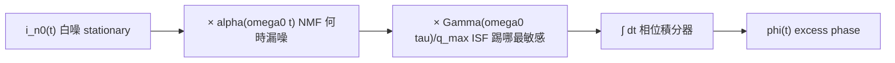

# 隨機雜訊基礎 Stochastic Noise Basics

> 先備：[lti_vs_ltv](/02_foundations/lti_vs_ltv) · [統一符號表](/00_overview/notation) ｜ 接下來：[white_noise_to_phase_noise](/03_isf_core_theory/white_noise_to_phase_noise)

這頁回答一個前置問題：**在談 ISF 之前，我們得先把「雜訊」這個隨機過程講清楚。**
振盪器裡的相位抖動，源頭是電晶體與電阻的隨機電流 $i_n(t)$。要把它丟進
[P1] Eq.(11) 的相位積分式，我們得先知道：這個隨機電流的「強度」怎麼量（PSD）、
怎麼從 PSD 算回時域功率（Parseval）、它在不同時刻是否相關（autocorrelation）、
一次量測能不能代表整個 ensemble（ergodicity），以及——對振盪器最關鍵的——
**雜訊強度本身會不會隨振盪相位週期性變化（cyclostationary）**。

最後一點是後面 [effective_isf](/03_isf_core_theory/effective_isf) 的核心：電晶體只在
「導通」那一小段時間漏噪，而那段時間落在波形的哪個相位，會決定 ISF 要用哪一段去加權。

> **物理直覺（先講大局）**：把 noise 想成「振盪器每一刻都被一隻看不見的手隨機踢一下」。
> 我們需要兩個獨立的資訊：(1) 這隻手**平均踢多大力**（強度，用 PSD 量）；(2) 這隻手
> **什麼時候踢得兇**（時間調變，用 cyclostationary / NMF 描述）。ISF 則是第三件事：
> 「**踢在波形哪個相位最會改相位**」。三者相乘積分，就是 phase noise。

## 1. white noise（白噪）

**white noise（白雜訊，功率譜在所有頻率都一樣平的隨機過程）**。名字來自白光——
所有頻率分量等強度。它的單邊 PSD（power spectral density，功率譜密度）是常數：

$$
S_i(f)=\frac{\overline{i_n^2}}{\Delta f}=\text{const}.
$$

- **單位**：電流 noise PSD 的單位是 $\text{A}^2/\text{Hz}$（每 Hz 頻寬的均方電流）。
  熱噪典型寫法 $\overline{i_n^2}/\Delta f=4kT/R$（電阻）或 $4kT\gamma g_m$（MOS 通道）。
- **dimension check**：$\overline{i_n^2}$ 是 $\text{A}^2$，除以頻寬 $\Delta f$（Hz）得 $\text{A}^2/\text{Hz}$ ✓。
- **物理來源**：thermal noise（熱雜訊，載子隨機熱運動）與 shot noise（散粒雜訊，
  載子穿越位障的離散性）在我們關心的頻段都可視為白的。
- **canonical 數值**：本站白噪源用 $S_i=10^{-24}\ \text{A}^2/\text{Hz}$（見規範例 B）。
  這對應 $\sqrt{S_i}=10^{-12}\ \text{A}/\sqrt{\text{Hz}}=1\ \text{pA}/\sqrt{\text{Hz}}$ 的電流雜訊密度。

> **為什麼振盪器在乎白噪**：白噪在所有 $n\omega_0$ 附近都有同樣強度的分量，ISF 的每個諧波
> $c_n$ 都會把對應頻段的白噪「下變頻」搬到 carrier 附近，形成 1/f²（$-20$ dB/dec）的
> phase noise skirt（裙邊）。這正是 [P1] Eq.(21) 的內容，見
> [white_noise_to_phase_noise](/03_isf_core_theory/white_noise_to_phase_noise)。

## 2. flicker (1/f) noise（閃爍雜訊）

**flicker noise（閃爍雜訊，也叫 1/f noise，功率隨頻率反比上升的低頻雜訊）**。在
MOS 元件裡主要來自載子被介面 trap（陷阱）隨機捕捉/釋放。它的 PSD 不平：

$$
S_{i,1/f}(f)=\overline{i_n^2}\cdot\frac{\omega_{1/f}}{\Delta\omega}\qquad(\Delta\omega < \omega_{1/f}),
$$

這正是 [P1] Eq.(22), p.185 的 device flicker 模型（規範第 3 節公式 13）。

- **單位**：一樣是 $\text{A}^2/\text{Hz}$。$\omega_{1/f}$ 是 device 的 **1/f corner**（角頻率，
  rad/s），就是「1/f 分量強度等於白噪底的那個頻率」。
- **dimension check**：$\overline{i_n^2}$（$\text{A}^2/\text{Hz}$）$\times\ \omega_{1/f}/\Delta\omega$
  （無因次比值）$=\text{A}^2/\text{Hz}$ ✓。
- **關鍵陷阱**：device 的 1/f corner $\omega_{1/f}$ **不等於** phase noise 的 1/f³ corner。
  後者是 $\Delta\omega_{1/f^3}=\omega_{1/f}\cdot c_0^2/(2\Gamma_{rms}^2)$（[P1] Eq.(24)），
  只透過 ISF 的 DC 係數 $c_0$ 上轉。波形對稱（小 $c_0$）能把 1/f³ corner 壓到遠低於
  device corner——見 [symmetry](/06_design_insights/symmetry)（claim C5）。

| 雜訊種類 | PSD 形狀 | 物理來源 | 在 phase noise 裡變成 |
|---|---|---|---|
| white | 平的（const $\text{A}^2/\text{Hz}$） | thermal / shot | 1/f²（$-20$ dB/dec） |
| flicker (1/f) | $\propto 1/f$ | trap 捕捉/釋放 | 1/f³（$-30$ dB/dec），只經 $c_0$ |

## 3. PSD 與 Parseval：頻域強度 ↔ 時域功率

**PSD（功率譜密度）** 告訴你「每單位頻寬有多少功率」。把它對頻率積分，得到時域的
總功率（變異數）。這就是 **Parseval 定理（時域能量 = 頻域能量）** 在隨機過程上的版本：

$$
\overline{i_n^2}=\int_0^{\infty}S_i(f)\,df\qquad(\text{單邊 PSD}).
$$

- **單位**：左式 $\text{A}^2$；右式 $(\text{A}^2/\text{Hz})\times\text{Hz}=\text{A}^2$ ✓。
- **直覺**：PSD 是「功率的密度」，積分是「把密度乘上頻寬加起來」。對 white noise，
  這個積分會發散——所以真實系統一定有 bandwidth（頻寬上限），白噪只是頻段內的近似。
- **為何重要**：phase noise 也是同一招——把 phase PSD $S_\phi(f)$ 對 offset 頻率積分，
  得到 phase variance $\sigma_\phi^2$，再換成 rms jitter。完整推導在
  [psd_phase_noise_jitter](/02_foundations/psd_phase_noise_jitter)。

> **記法**：本站用**單邊（single-sided）PSD**（只算正頻率，$0\le f<\infty$）。
> 若改用雙邊（$-\infty<f<\infty$）PSD，每個頻率的值要除以 2。這個 factor-of-2 慣例
> 跟 SSB phase noise 的 $\mathcal{L}\approx\frac12 S_\phi$ 是同一類記帳問題，
> 在 [white_noise_to_phase_noise](/03_isf_core_theory/white_noise_to_phase_noise) 會專門討論。

## 4. autocorrelation（自相關）與 white 的真正定義

**autocorrelation（自相關函數，同一隨機過程在兩個時刻的相關程度）**：

$$
R_i(\tau)=\overline{i_n(t)\,i_n(t+\tau)}.
$$

- **單位**：$\text{A}^2$（兩個電流相乘的期望值）。
- **Wiener–Khinchin 定理**：autocorrelation 與 PSD 是傅立葉對。白噪的 PSD 平坦，
  對應 autocorrelation 是一根 delta：$R_i(\tau)=\dfrac{\overline{i_n^2}}{\Delta f}\,\delta(\tau)$。
- **直覺**：白噪「現在的值」與「下一瞬間的值」**完全無關**（記憶為零）。這正是為什麼
  在 [P1] Eq.(11) 的相位積分裡，可以把不同時刻的 noise 貢獻當成獨立疊加——它讓
  phase variance 的計算變成「逐項平方相加」而不必處理交叉相關項。
- **flicker 反例**：1/f noise 的 autocorrelation 拖很長的尾巴（長記憶、強相關），
  這也是它難積分、難模擬的原因（見 DSP 頁的 aliasing 注意事項）。

## 5. ergodicity（遍歷性）

**ergodicity（遍歷性，「時間平均 = ensemble 平均」的性質）**。

- **白話**：你只有一顆振盪器、量一條很長的波形（時間平均）；理論上談的是無限多顆
  同型振盪器在同一時刻的統計（ensemble / 集合平均）。ergodicity 保證這兩者相等——
  否則「量一顆」根本無法驗證「理論預測的 ensemble 統計」。
- **適用條件**：要 stationary（統計性質不隨時間漂移）才談得上 ergodic。熱噪 OK。
- **失效警告**：振盪器的 **excess phase $\phi(t)$ 本身不是 stationary**——它是 random walk
  （隨機漫步，變異數隨時間線性增長，見 accumulated jitter $\sigma_{\Delta t}=\kappa\sqrt{\Delta t}$，
  [P2] Eq.(8)）。所以我們對「相位的時間導數（頻率）」或「相位差」做統計，而不是對
  $\phi$ 的絕對值。這個微妙之處在 [dsp_view_of_phase_noise](/02_foundations/dsp_view_of_phase_noise)
  會用「1/(jω) 積分器把白噪變 1/f²」的觀點重新講一次。

## 6. cyclostationary noise（週期穩態雜訊）— 本頁重點，直通 effective ISF

**cyclostationary noise（週期穩態雜訊，統計性質隨時間「週期性」變化的隨機過程）**。
[P1] Sec. III-D, p.186 講得很直白：

> "the channel noise of a MOS device in an oscillator is cyclostationary because the
> noise power is modulated by the gate-source overdrive which varies with time
> periodically."（[P1], p.186，cyclostationary 段落）

也就是說：**電晶體不是時時刻刻都在漏一樣多的噪。** 它只在導通（大電流、大 overdrive）
那一小段時間噪得兇；其餘時間幾乎安靜。而「導通」這件事跟振盪波形是鎖在一起的——
週期 $T$ 重複一次。這就是「週期穩態」。

[P1] 把一個 white cyclostationary 電流分解成（[P1] Eq.(25), p.186）：

$$
i_n(t)=i_{n0}(t)\cdot\alpha(\omega_0 t),
$$

其中 $i_{n0}(t)$ 是 white **stationary** 過程（強度固定），$\alpha(\omega_0 t)$ 是一個
**deterministic（確定性）、週期、normalized（最大值=1）** 的函數，描述「雜訊振幅
何時被調大調小」。本站把它叫 **NMF — noise-modulating function（雜訊調變函數）**，
符號 $\alpha(\omega_0 t)$，$0\le\alpha\le1$，無因次（見 notation 頁）。

- **單位**：$\alpha$ 無因次（它是 normalized 包絡）；$i_{n0}$ 與 $i_n$ 都是 A。
- **dimension check**：$\text{A}=\text{A}\times(\text{無因次})$ ✓。
- **$\alpha^2$ 的意義**：因為 PSD 看的是功率（$i^2$），所以雜訊的**瞬時 mean-square 功率**
  正比於 $\alpha^2(\omega_0 t)$。最大瞬時 PSD $=\overline{i_n^2}/\Delta f$，
  其餘時間被 $\alpha^2\le1$ 壓低。

### 為什麼這直通 ISF：effective ISF

把 cyclostationary 分解代進相位積分式 [P1] Eq.(11)，noise 在第 $\tau$ 時刻的貢獻
被 $\Gamma(\omega_0\tau)$ 加權，而它本身的強度又被 $\alpha(\omega_0\tau)$ 調變。兩個
週期函數**相乘**，可以打包成一個 **effective ISF（有效 ISF）**（[P1] Eq.(27), p.186）：

$$
\boxed{\ \Gamma_{eff}(\omega_0\tau)=\Gamma(\omega_0\tau)\cdot\alpha(\omega_0\tau)\ }
$$

[P1] 的原話：

> "the cyclostationary noise can be treated as a stationary noise applied to a system
> with an effective ISF."（[P1], p.186）

意思是：**只要把 $\Gamma$ 換成 $\Gamma_{eff}=\Gamma\cdot\alpha$，後面所有公式（$c_n$、
$\Gamma_{rms}$、Eq.(21)、Eq.(23)）原封不動照用。** cyclostationary 不需要一套新理論，
它只是改了你要拿去算傅立葉係數的那條曲線。

- **單位**：$\Gamma_{eff}$ 仍無因次（$\Gamma$ 無因次 × $\alpha$ 無因次）✓。
- **教學重點**：算 $c_n$、$\Gamma_{rms}$ 時要用 $\Gamma_{eff}$（即 [P1] 所說「應在後續
  所有計算中使用 effective ISF」），不能只用裸 $\Gamma$。

### LC vs ring：cyclostationary 影響差很大（[P1] 的精彩結論）

[P1], p.186 給了兩個對照例子，非常有教學價值：

| 振盪器 | 大電流（$\alpha$ 大）發生在 | 該處的 $\Gamma$ | cyclostationary 影響 |
|---|---|---|---|
| **Colpitts LC** | tank 電壓最低點（波谷） | **小**（峰/谷處 ISF 小） | $\Gamma_{eff}$ 與 $\Gamma$ **差很多**，不可忽略 |
| **ring（單端）** | transition（過零、斜率最大） | **大**（transition 處 ISF 大） | $\Gamma_{eff}\approx\Gamma$，影響小 |

[P1] 的解讀：Colpitts 的電晶體「在 ISF 小的地方才開」，等於大自然幫它把雜訊注在
不敏感的相位——所以 cyclostationary **幫了 LC**。而 ring 很不幸：最大電流剛好發生在
最敏感的 transition，雜訊與敏感度同時拉滿。[P1] 直接點名：

> "This unfortunate coincidence is one of the reasons why ring oscillators in general
> have inferior phase noise performance compared to a Colpitts LC oscillator."（[P1], p.186）

這是「為什麼 LC 比 ring 乾淨」的兩大原因之一（另一個是 ring 每週期把儲能全耗掉）。
量化討論見 [P2] 與 [lc_vs_ring](/06_design_insights/lc_vs_ring)。

> **toy model 提醒**：本站後續用 $\alpha(\omega_0 t)$ 的 toy 形狀（例如把 NMF 設成導通窗）
> 來示範 $\Gamma_{eff}=\Gamma\cdot\alpha$ 怎麼改變 $c_0$、$\Gamma_{rms}$，這些是
> pedagogical toy model，非 transistor-level；真實 $\alpha$ 要從元件 noise model
> 與 operating point 萃取（[P1] 說「$\alpha$ can be derived easily from device noise
> characteristics and operating point」）。

## 把這頁接到 ISF 的一句話

phase noise 的完整配方是三個週期/隨機量的乘積再積分：

中間兩個「乘號」就是 effective ISF $\Gamma_{eff}=\Gamma\cdot\alpha$ 的來源；最後的積分器
就是把白噪變成 1/f² 的關鍵（DSP 觀點見下一節連結）。

## 適用與失效條件

| 條件 | 成立時 | 失效時 |
|---|---|---|
| stationary（熱噪） | ergodicity 成立，量一顆即可代表 ensemble | 漂移/老化 → 要重新量 |
| white 近似 | PSD 平、autocorr 為 delta、貢獻可獨立疊加 | 進入 1/f 區要改用 flicker 模型 |
| cyclostationary 可用 $\Gamma_{eff}=\Gamma\cdot\alpha$ 打包 | 小擾動、$\alpha$ 週期且 normalized | 強非線性使 $\alpha$ 與訊號耦合時要更仔細 |
| 相位用 random walk 描述 | 對相位差/頻率做統計 | 直接對 $\phi$ 絕對值做時間平均會發散 |

## 重點回顧

- **white noise**：PSD 平（$\text{A}^2/\text{Hz}$）、autocorr 為 delta、無記憶；在 ISF 下變 1/f²。
- **flicker (1/f) noise**：$S\propto1/f$（[P1] Eq.(22)）；只經 $c_0$ 上轉成 1/f³；
  device corner $\neq$ 1/f³ corner。
- **PSD ↔ Parseval**：對 PSD 積分得時域功率（變異數）；單位自洽 $\text{A}^2/\text{Hz}\times\text{Hz}=\text{A}^2$。
- **autocorrelation**：白噪 = delta（無記憶），1/f = 長尾（強相關）。
- **ergodicity**：時間平均 = ensemble 平均；但 $\phi$ 是 random walk、非 stationary，
  要對相位差/頻率做統計。
- **cyclostationary（本頁主角）**：雜訊強度隨振盪相位週期變化（電晶體只在導通時漏噪）；
  用 NMF $\alpha(\omega_0 t)$ 描述，打包成 $\Gamma_{eff}=\Gamma\cdot\alpha$（[P1] Eq.(25)–(27)）；
  LC 受益、ring 受害。
- 來源：[P1] Sec. III-D（cyclostationary）Eqs.(25)–(27), p.186；device flicker Eq.(22), p.185；claims C9。

## 延伸閱讀

- 相位 PSD 怎麼積成 jitter：[psd_phase_noise_jitter](/02_foundations/psd_phase_noise_jitter)
- 用 DSP 觀點看相位 = 被 ISF 加權 + 積分器處理的隨機過程：[dsp_view_of_phase_noise](/02_foundations/dsp_view_of_phase_noise)
- effective ISF 完整推導與萃取：[effective_isf](/03_isf_core_theory/effective_isf)
- 白噪如何變 1/f² phase noise：[white_noise_to_phase_noise](/03_isf_core_theory/white_noise_to_phase_noise)
- ISF 傅立葉係數 $c_n$、$c_0$ 與對稱性：[fourier_series_of_isf](/03_isf_core_theory/fourier_series_of_isf)、[symmetry](/06_design_insights/symmetry)
