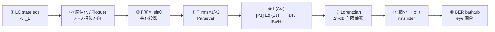

# Capstone — 一顆 ideal LC 從 state equations 到 BER（全嚴格一條龍）

這頁是全站的**主脊（main spine）**：拿**一顆理想無耗並聯 LC 振盪器**，從最底層的
**state equations（狀態方程）**出發，一步不跳、每步嚴格＋帶數值，一路推到通訊工程師最後看的
**BER（bit error rate，位元錯誤率）bathtub（浴缸曲線）**。讀完這一頁，你就握住了整套 ISF
phase-noise 理論的「一條龍」——其餘各頁都是這條主脊的某一段放大。

> **物理直覺（先講整條鏈）**：LC 的能量在電感與電容之間無損地來回 → 在 2-D 狀態平面畫出一個
> **limit cycle（極限環）**。noise 電流戳它一下，戳出去的位移拆成「沿環切向＝相位」與「垂直環徑向＝振幅」；
> 振幅有恢復力被拉回、相位沒有恢復力**永久累積**——這個「戳一單位電荷變多少永久相位」的權重
> 就是 **ISF $\Gamma(\theta)$**，理想 LC 算出來恰好是 $-\sin\theta$。把白噪用 $\Gamma$ 加權再**積分**（積分器
> 給出 $1/\omega^2$）就得到 $1/f^2$ 的相位雜訊 $\mathcal{L}(\Delta\omega)$。這條 $1/f^2$ 在 $\Delta\omega\to0$
> 看似發散，其實近載波會轉平成 **Lorentzian（勞侖茲線形）**、有限線寬 $\Delta f_{3\mathrm{dB}}$。把
> $\mathcal{L}$ 對 offset 頻率積分、開根號、除以 $2\pi f_0$ 得 **rms jitter $\sigma_t$**；最後 $\sigma_t$
> 從兩側啃 eye（眼圖），決定 **BER**。**一句話：state geometry → ISF → 積分 → 譜 → 線寬 → jitter → BER。**

整條主脊有 8 站，每一站都對應全站某一頁的深入版；本頁把它們接成不斷裂的鏈，並用**同一組
canonical 數值**（$q_{max}=1$ pC、$\Gamma_{rms}=1/\sqrt2$、$f_0=5$ GHz、$S_i=10^{-24}$ A²/Hz）走到底。



---

## 站①：LC state equations（$\dot v,\ \dot i_L$）

取一個**理想無耗並聯 LC**：電感 $L$、電容 $C$ 並聯，無任何電阻損耗。用兩個狀態變數描述——
電容電壓 $v$（V）與電感電流 $i_L$（A）。並聯節點 KCL：流進電容的電流 $=$ 流出電感的電流；
電感的 $v$–$i$ 關係 $v=L\,di_L/dt$。整理成一階狀態方程組：

$$
\begin{aligned}
\dot v(t)&=\frac{dv}{dt}=-\frac{1}{C}\,i_L(t),\\
\dot i_L(t)&=\frac{di_L}{dt}=+\frac{1}{L}\,v(t).
\end{aligned}
$$

- **用到的物理**：電容 $i_C=C\,\dot v$、電感 $v_L=L\,\dot i_L$，加上並聯 KCL（$i_C=-i_L$，電容放出的電流灌進電感）。
- **單位檢查**：$[\dot v]=[\text{A}]/[\text{F}]=[\text{A}]/[\text{C/V}]=\text{V/s}$ ✓；$[\dot i_L]=[\text{V}]/[\text{H}]=[\text{V}]/[\text{Wb/A}]=\text{A/s}$ ✓
  （兩式右邊都是「狀態的時間變化率」）。
- **寫成向量場**：令狀態 $\mathbf{x}=(v,\ i_L)^T$，則 $\dot{\mathbf x}=A_0\mathbf x$，其中
  

$$
A_0=\begin{pmatrix}0 & -1/C\\[2pt] 1/L & 0\end{pmatrix}.
$$

**求解（確認它真的振盪）**：$A_0$ 的特徵值 $\lambda$ 滿足 $\lambda^2=-\dfrac{1}{LC}$，即
$\lambda=\pm j\omega_0$，$\omega_0=\dfrac{1}{\sqrt{LC}}$（rad/s）。純虛特徵值 → 解是**不衰減的正弦**：

$$
v(t)=V_{max}\cos(\omega_0 t),\qquad i_L(t)=\frac{V_{max}}{\omega_0 L}\sin(\omega_0 t).
$$

- **單位檢查（頻率）**：$\omega_0=1/\sqrt{LC}$，$[\sqrt{\text{H}\cdot\text{F}}]=\sqrt{(\text{V s/A})(\text{A s/V})}=\sqrt{\text{s}^2}=\text{s}$，
  故 $\omega_0$ 是 $1/\text{s}=\text{rad/s}$ ✓。
- **這是 marginally stable 的理想極限**：無損耗 → 特徵值落在虛軸上 → 振幅由初始能量決定、不增不減。
  真實 LC 有有限 $Q$，靠主動電路（cross-coupled pair）補損耗維持等幅——但相位動力學的本質（站②起）一樣。
- **與本站對應**：完整 2-D state 幾何見 [isf_definition](/03_isf_core_theory/isf_definition) 第 2 步、
  數值模型見 [lab_02](/04_simulation_labs/lab_02_lc_oscillator_toy_model)。

**注入 noise**：把 noise 電流 $i_n(t)$ 灌進**電容節點**（它改變的是流進電容的電流，故只動 $\dot v$）：

$$
\dot v=-\frac{1}{C}\,i_L+\frac{1}{C}\,i_n(t),\qquad \dot i_L=\frac{1}{L}\,v.
$$

寫成標準擾動形式 $\dot{\mathbf x}=A_0\mathbf x+B\,i_n$，其中**注入向量** $B=(1/C,\ 0)^T$——
這就是「電流經電容變成 $\dot v$」的數學身分證（[P1] Eq.(9), p.182 的微分版 $\Delta V=\Delta q/C$）。

- **單位檢查（B）**：$[B\,i_n]=[\text{A}]/[\text{F}]=\text{V/s}$，與 $\dot v$ 同單位 ✓。

> **這一站交付**：一組乾淨的線性 state equations + 一個明確的 noise 注入向量 $B=(1/C,0)^T$。
> 後面每一站都從這裡長出來。

---

## 站②：線性化／Floquet — 為什麼有一個「永久不衰減」的相位方向

理想 LC 的 $A_0$ 是常數矩陣（線性電路），所以「線性化」這一步是 trivial 的——它本來就是線性。
但**相位永久累積**這件事的嚴格根據，要靠 **Floquet 理論（弗洛凱理論，週期係數線性系統的解結構）**。
這裡只取結論並對到 LC；完整證明見 [derivation_floquet_ppv](/99_appendix/derivation_floquet_ppv)
（該頁明標 Floquet/adjoint/PPV 屬**外部文獻、不在下載的 5 篇 PDF 內**，主要來源 [E2] Demir 2000）。

**關鍵定理（[derivation_floquet_ppv](/99_appendix/derivation_floquet_ppv) 第 3 步）**：把穩態解
$\mathbf x_s(t)$ 對時間微分，$\dot{\mathbf x}_s$ 本身**自動是齊次擾動方程的一個解**，而且它是
**週期、不含指數因子**的——對應 **Floquet 指數 $\lambda_1=0$**。物理上 $\dot{\mathbf x}_s$ 就是
「沿軌跡走」的切向方向 ＝ 相位方向；$\lambda_1=0$ 數學上保證**相位擾動既不放大也不衰減、永久保留**。

對 LC 具體驗證：$\mathbf x_s(t)=V_{max}\big(\cos\omega_0 t,\ \tfrac{1}{\omega_0 L}\sin\omega_0 t\big)$，

$$
\dot{\mathbf x}_s(t)=V_{max}\,\omega_0\Big(-\sin\omega_0 t,\ \tfrac{1}{\omega_0 L}\cos\omega_0 t\Big).
$$

代回 $\dot{(\,\cdot\,)}=A_0(\cdot)$ 直接成立（這就是它「自己是解」），且它是純週期、$\lambda_1=0$ ✓。
另一個方向（振幅方向）對應 $\lambda_2$：理想無耗 LC 的 $\lambda_2$ 也在虛軸（$\mathrm{Re}\,\lambda_2=0$），
代表理想 LC 連振幅都不衰減；**真實有損 + amplitude restoring** 才把振幅方向變成
$\mathrm{Re}\,\lambda_2<0$（衰減），讓「只有相位永久殘留」嚴格成立（見
[phase_vs_amplitude_noise](/02_foundations/phase_vs_amplitude_noise)）。

- **為何要這一站**：站③要把擾動「投影到相位方向」。Floquet 告訴我們**那個方向是什麼**（$\lambda_1=0$ 的 $\dot{\mathbf x}_s$）、
  且**為什麼投影出來的相位永久累積**（中性方向、無恢復力）。沒有這一站，站③的「投影」只是直覺。
- **單位檢查**：Floquet 指數 $\lambda$ 單位 $1/\text{s}$，$\lambda_1=0$（rad 永久不衰減）；$\lambda T$ 無因次 ✓。
- **嚴格對應**：[derivation_floquet_ppv](/99_appendix/derivation_floquet_ppv) 證明 ISF 是 **PPV（perturbation
  projection vector，擾動投影向量）在注入節點的分量**：$\Gamma(\omega_0\tau)/q_{max}=v_1^T(\tau)\,\mathbf b$，
  其中 $\mathbf b=B$ 是站①的注入向量。本頁站③用幾何把這個投影**親手算出**，與 PPV 結論一致。

> **這一站交付**：相位方向 $=\dot{\mathbf x}_s$（$\lambda_1=0$，永久不衰減）。下一站把 noise 投影到它。

---

## 站③：幾何投影推出 $\Gamma(\theta)=-\sin\theta$

把站②的「投影到相位方向」對 LC 具體執行。Normalize 狀態（取 $V_{max}=1$、把 $i_L$ 軸縮放成等半徑），
limit cycle 是單位圓 $\mathbf z(\theta)=(\cos\theta,\ \sin\theta)$，$\theta=\omega_0 t$，第一分量 $v=\cos\theta$ 是 tank 電壓。

**Step A — 注入造成的 state 位移**：站①的 noise 電流只動電容電壓，$\Delta v=\Delta q/C$，所以位移沿 $+v$ 軸：

$$
\Delta\mathbf z=(\Delta v,\ 0)=\big(\tfrac{\Delta q}{C},\ 0\big).
$$

**Step B — 切向投影**。沿環切向量 $\dfrac{\partial\mathbf z}{\partial\theta}=(-\sin\theta,\ \cos\theta)$，模長
$\left|\partial\mathbf z/\partial\theta\right|=1$。相位增量 $=$「切向位移」÷「沿環走一單位 $\theta$ 的弧長」：

$$
\Delta\phi=\frac{\Delta\mathbf z\cdot(\partial\mathbf z/\partial\theta)}{\lvert\partial\mathbf z/\partial\theta\rvert^2}
=\frac{(\Delta v,0)\cdot(-\sin\theta,\cos\theta)}{\sin^2\theta+\cos^2\theta}
=\frac{-\sin\theta\,\Delta v}{1}=-\sin\theta\,\Delta v.
$$

**Step C — 代入 $\Delta v=\Delta q/C$ 並用 $q_{max}=C\cdot V_{max}=C$（normalized $V_{max}=1$）**：

$$
\boxed{\ \Delta\phi=-\sin\theta\,\frac{\Delta q}{C}=\frac{-\sin\theta}{q_{max}}\,\Delta q=\frac{\Gamma(\theta)}{q_{max}}\,\Delta q,\qquad \Gamma(\theta)=-\sin\theta.\ }
$$

- **dimension check**：$\Delta\phi$ rad（無因次）；$\Delta q/q_{max}=\text{C}/\text{C}$ 無因次；故 $\Gamma$ 無因次 ✓
  （這正是 [P1] 用 $q_{max}$ normalize 的目的：把 $\Gamma$ 變成只描述「波形哪裡敏感」的形狀）。
- **物理檢查**：$\theta=0$（波峰 $v=1$）→ $\Gamma=0$，戳下去全變振幅（會被拉回）；
  $\theta=\pi/2$（上升過零 $v=0$）→ $\Gamma=-1$，戳下去全變相位（$\vert\Gamma\vert$ 最大）。完全符合直覺。
- **與本站對應**：本式逐字等同 [isf_definition](/03_isf_core_theory/isf_definition) 的親手推導、
  [lab_02](/04_simulation_labs/lab_02_lc_oscillator_toy_model) 的數值驗證（誤差 $\sim$0.001）、
  以及操作型定義 [impulse_to_phase_shift](/03_isf_core_theory/impulse_to_phase_shift)。
- **嚴格對應**：對照站②，$\Gamma(\theta)/q_{max}=v_1^T(\theta)\,B$ ——這裡幾何投影算出的 $-\sin\theta/q_{max}$
  就是 PPV $v_1$ 在電容節點的分量（[derivation_floquet_ppv](/99_appendix/derivation_floquet_ppv) 第 6 步）。


> **這一站交付**：理想 LC 的 ISF $\Gamma(\theta)=-\sin\theta$（解析、無因次、$2\pi$ 週期）。
> 注意它**只有一個諧波**（$c_1=1$，其餘 $c_n=0$、$c_0=0$）——這個乾淨性讓後面每一步都能口算。

---

## 站④：$\Gamma_{rms}=1/\sqrt2$（Parseval）

phase noise 公式只吃 ISF 的 **rms 值**（不需要逐個 $c_n$）。$\Gamma_{rms}$ 定義為一個週期上的均方根
（見 [rms_isf](/03_isf_core_theory/rms_isf)）：

$$
\Gamma_{rms}=\sqrt{\frac{1}{2\pi}\int_0^{2\pi}\lvert\Gamma(x)\rvert^2\,dx}.
$$

代 $\Gamma(x)=-\sin x$，用半角恆等式 $\sin^2 x=\tfrac12(1-\cos 2x)$、且 $\cos 2x$ 在整週期積分為 0：

$$
\begin{aligned}
\Gamma_{rms}^2&=\frac{1}{2\pi}\int_0^{2\pi}\sin^2 x\,dx
=\frac{1}{2\pi}\int_0^{2\pi}\frac{1-\cos 2x}{2}\,dx
=\frac{1}{2\pi}\cdot\frac{2\pi}{2}=\frac12,\\
\Gamma_{rms}&=\frac{1}{\sqrt2}\approx0.707.
\end{aligned}
$$

**用 Parseval 交叉驗證**（[P1] Eq.(20), p.185；$\sum c_n^2=2\Gamma_{rms}^2$）：理想 LC 只有 $c_1=1$、其餘為 0，故

$$
\sum_{n=0}^{\infty}c_n^2=c_1^2=1=2\Gamma_{rms}^2\ \Longrightarrow\ \Gamma_{rms}^2=\tfrac12,\quad\Gamma_{rms}=\tfrac{1}{\sqrt2}.
$$

兩法一致 ✓。

- **dimension check**：$\Gamma$ 無因次 → $\Gamma_{rms}$ 無因次 ✓。
- **物理意義**：$\Gamma_{rms}$ 越小、振盪器把 noise 翻成相位的「平均效率」越低 → phase noise 越好。
  $-\sin$ 的 $\Gamma_{rms}=0.707$ 是 LC 的招牌值；ring 因為敏感度集中在 transition、且 $\Gamma_{rms}\propto N^{-3/4}$
  （[P2] Eq.(16)）可被級數壓低，但 LC 的高 $Q$ 通常仍勝出（見 [lc_vs_ring](/06_design_insights/lc_vs_ring)）。

> **這一站交付**：$\Gamma_{rms}=1/\sqrt2$。它是站⑤公式裡唯一的 ISF 輸入。

---

## 站⑤：代 [P1] Eq.(21) 得 $S_\phi/\mathcal{L}(\Delta\omega)$（真·LC $-145$ dBc/Hz；規範例 B $-148$，差 3 dB）

把白噪 $\times\Gamma$ 再積分（積分器 $=1/(j\omega)$，給出 $1/\omega^2$ → $-20$ dB/dec）的完整推導
鏈 Eq.(19)→(20)→(21) 在 [white_noise_to_phase_noise](/03_isf_core_theory/white_noise_to_phase_noise)。
這裡直接用招牌結果（[P1] Eq.(21), p.185）：

$$
\mathcal{L}\{\Delta\omega\}=10\log_{10}\!\left(\frac{\Gamma_{rms}^2}{q_{max}^2}\cdot\frac{\overline{i_n^2}/\Delta f}{4\,\Delta\omega^2}\right)
$$

**代 canonical 例 B**（$f_0=5$ GHz、$\Delta f=1$ MHz、$q_{max}=1$ pC、$\Gamma_{rms}=1/\sqrt2$、$S_i=\overline{i_n^2}/\Delta f=10^{-24}$ A²/Hz）。
注意本頁站④算出 LC 的 $\Gamma_{rms}=0.707$，其平方 $\Gamma_{rms}^2=0.5$（規範例 B 用代表值 $0.5$，即 $\Gamma_{rms}^2=0.25$；
本頁用「真・LC」的 $\Gamma_{rms}^2=0.5$，會比規範例 B 高 3 dB，下面標清楚）。

**步驟 1：offset 角頻率。**

$$
\Delta\omega=2\pi\Delta f=2\pi\times10^{6}=6.283\times10^{6}\ \text{rad/s},\qquad
\Delta\omega^2=3.948\times10^{13}\ \text{rad}^2/\text{s}^2.
$$

**步驟 2：$\Gamma_{rms}^2/q_{max}^2$（用 LC 的 $\Gamma_{rms}^2=0.5$）。**

$$
\frac{\Gamma_{rms}^2}{q_{max}^2}=\frac{0.5}{(10^{-12}\,\text{C})^2}=\frac{0.5}{10^{-24}}=5.0\times10^{23}\ \text{C}^{-2}.
$$

**步驟 3：$S_i/(4\Delta\omega^2)$。**

$$
\frac{S_i}{4\Delta\omega^2}=\frac{10^{-24}}{4\times3.948\times10^{13}}=6.332\times10^{-39}.
$$

**步驟 4：相乘（括號內 linear）。**

$$
\frac{\Gamma_{rms}^2}{q_{max}^2}\cdot\frac{S_i}{4\Delta\omega^2}=5.0\times10^{23}\times6.332\times10^{-39}=3.166\times10^{-15}.
$$

**步驟 5：取 $10\log_{10}$。**

$$
\mathcal{L}(1\,\text{MHz})=10\log_{10}(3.166\times10^{-15})=-145.0\ \text{dBc/Hz}.
$$

- **與規範例 B 的 $-148$ dBc/Hz 對齊**：規範例 B 用 $\Gamma_{rms}=0.5$（$\Gamma_{rms}^2=0.25$）得 $-148.0$ dBc/Hz；
  本頁用**真・LC** 的 $\Gamma_{rms}=0.707$（$\Gamma_{rms}^2=0.5$，剛好兩倍）得 $-145.0$ dBc/Hz，**正好高 3 dB**
  （$10\log_{10}2=3.01$）。兩個數字都對，差別只在 $\Gamma_{rms}$ 取「代表值」還是「理想 $-\sin$ 值」。
  本頁主脊用 $-\sin$ 的 $\Gamma_{rms}=1/\sqrt2$ 一以貫之，故站⑤–⑦都以此值往下走，並在每處標出與 $-148$ 的 3 dB 差。
- **Dimension check**：括號內 $\text{C}^{-2}\cdot\dfrac{\text{A}^2/\text{Hz}}{(\text{rad/s})^2}$。以 $\text{C}=\text{A}\cdot\text{s}$、
  $\text{C}^{-2}=\text{A}^{-2}\text{s}^{-2}$，$\dfrac{\text{A}^2\cdot\text{s}}{\text{s}^{-2}}=\text{A}^2\text{s}^3$；相乘 $=\text{s}=1/\text{Hz}$，
  取 $10\log_{10}$ 後讀 dBc/Hz ✓。
- **factor-of-2 註記**：[P1] Eq.(21) 用 SSB $/4$ 慣例；本站 lab_06 的時域乾淨版用 $/2$，會再高 3 dB。
  這不影響 $\Gamma_{rms}^2/q_{max}^2$ scaling 與 $-20$ dB/dec 斜率（見
  [white_noise_to_phase_noise](/03_isf_core_theory/white_noise_to_phase_noise) 的 factor-of-2 節）。

**寫成 phase PSD**（站⑥、⑦要用，小角 $\mathcal{L}\approx\tfrac12 S_\phi$，時域乾淨版）：

$$
S_\phi(f)=\frac{\Gamma_{rms}^2}{q_{max}^2}\cdot\frac{S_i}{(2\pi f)^2}\quad[\text{rad}^2/\text{Hz}].
$$

> **這一站交付**：$\mathcal{L}(1\text{MHz})=-145$ dBc/Hz（LC 真值；規範代表值 $-148$，差 3 dB），
> 以及 $1/f^2$ 的 $S_\phi(f)$ 閉式。下一站處理「$\Delta\omega\to0$ 發散」的矛盾。

---

## 站⑥：Lorentzian 線寬 $\Delta f_{3\mathrm{dB}}$（解 $1/f^2$ 發散矛盾）

站⑤的 $S_\phi\propto1/\Delta\omega^2$ 在 $\Delta\omega\to0$ **發散**——但總相位功率不可能無限大（載波功率守恆）。
矛盾出在「線性化把相位當成可無限累積的 random walk（隨機漫步）」。嚴格做法（相位擴散 →
載波自相關 → Wiener–Khinchin）會得到**有限線寬的 Lorentzian（勞侖茲線形）**。完整推導見
[lorentzian_linewidth](/03_isf_core_theory/lorentzian_linewidth)（連 **[E2] Demir 2000，不在 5 篇 PDF 內**）；
這裡取規範 11.2 的結果並代數值。

**相位擴散係數 $D$（rad²/s）** 由 $1/f^2$ skirt 的係數定出。把 $S_\phi=2D/\Delta\omega^2$ 與站⑤的
$S_\phi=\dfrac{\Gamma_{rms}^2}{q_{max}^2}\dfrac{S_i}{\Delta\omega^2}$ 對齊（規範 11.2）：

$$
D=\frac{\Gamma_{rms}^2}{2\,q_{max}^2}\,\frac{\overline{i_n^2}}{\Delta f}.
$$

**Lorentzian 頻譜與 3-dB 線寬（FWHM，全寬半高）**（規範 11.2）：

$$
S(\Delta\omega)\propto\frac{D}{D^2+\Delta\omega^2},\qquad
\boxed{\ \Delta f_{3\mathrm{dB}}=\frac{D}{\pi}=\frac{\Gamma_{rms}^2}{2\pi\,q_{max}^2}\,\frac{\overline{i_n^2}}{\Delta f}\ }
$$

**代 canonical 數值**（$\Gamma_{rms}^2=0.5$、$q_{max}=10^{-12}$ C、$S_i=10^{-24}$ A²/Hz）：

**步驟 1：算 $D$。**

$$
D=\frac{0.5}{2\times(10^{-12})^2}\times10^{-24}
=\frac{0.5}{2\times10^{-24}}\times10^{-24}
=\frac{0.5}{2}=0.25\ \text{rad}^2/\text{s}.
$$

**步驟 2：算線寬。**

$$
\Delta f_{3\mathrm{dB}}=\frac{D}{\pi}=\frac{0.25}{3.1416}=0.0796\ \text{Hz}\approx80\ \text{mHz}.
$$

- **Dimension check（$D$）**：$\dfrac{(\text{無因次})}{\text{C}^2}\cdot\dfrac{\text{A}^2}{\text{Hz}}
  =\dfrac{\text{A}^2\cdot\text{s}}{\text{A}^2\text{s}^2}=\dfrac{1}{\text{s}}$ ——而 $D$ 是 rad²/s，rad 無因次故 $=1/\text{s}$ ✓。
  $\Delta f_{3\mathrm{dB}}=D/\pi$：$[1/\text{s}]/(\text{無因次})=\text{Hz}$ ✓。
- **物理意義（解矛盾）**：$1/f^2$ 只是**遠端漸近**；在 $\Delta\omega\lesssim D$（這裡 $\lesssim0.25$ rad/s）譜會**轉平成
  Lorentzian 頂**，不再發散。把 Lorentzian 對全頻積分 $=$ 載波功率（守恆）。所以 [P1] Eq.(21) 的發散是「線性化假象」，
  真實譜近載波是有限高的 Lorentzian。
- **HWHM 與 FWHM 別搞混（兩個 40/80 不矛盾）**：轉平的**半功率半寬（HWHM，half-width at half-maximum）**發生在
  $\Delta\omega=D$，即單邊 offset $f_{\mathrm{HWHM}}=D/2\pi=0.25/6.283\approx40$ mHz；而上面方框裡的**線寬是全寬半高
  （FWHM，full-width）** $\Delta f_{3\mathrm{dB}}=D/\pi\approx80$ mHz，正好是 HWHM 的兩倍（$\text{FWHM}=2\times\text{HWHM}$）。
  所以「offset 約 40 mHz 開始轉平」講的是**單邊半寬**，「線寬 80 mHz」講的是**全寬**——同一個 Lorentzian、同一個 $D$，
  只是半寬與全寬的差別，兩者皆對、並不衝突。
- **手感**：80 mHz 線寬對 5 GHz 載波是 $\Delta f_{3\mathrm{dB}}/f_0\approx1.6\times10^{-11}$ ——極窄，
  正是高 $Q$ LC「頻譜純度高」的數字臉孔。（這是單一理想白噪源的下限；真實電路更寬。）
- **與 [lorentzian_linewidth](/03_isf_core_theory/lorentzian_linewidth) 的 40 mHz 對齊（2× 是 $\Gamma_{rms}^2$ 包裝，非錯誤）**：
  本頁用**真・LC** 的 $\Gamma_{rms}=1/\sqrt2$（$\Gamma_{rms}^2=0.5$）算出 $D=0.25$ rad²/s、$\Delta f_{3\mathrm{dB}}=D/\pi\approx80$ mHz；
  而 [lorentzian_linewidth](/03_isf_core_theory/lorentzian_linewidth) 的範例用**規範代表值** $\Gamma_{rms}=0.5$（$\Gamma_{rms}^2=0.25$）得
  $D=0.125$ rad²/s、$\approx40$ mHz。兩頁差**正好 2 倍**，來源就是 $\Gamma_{rms}^2$ 取 $0.5$ 還是 $0.25$（$D\propto\Gamma_{rms}^2$，故線寬也 $\times2$）——
  與站⑤ $-145$ vs $-148$ dBc/Hz 那 3 dB 完全同源（$10\log_{10}2$）。兩個數字都對，差別只在 $\Gamma_{rms}$ 取「理想 $-\sin$ 值」或「代表值」，**不是錯誤**。

> **這一站交付**：有限線寬 $\Delta f_{3\mathrm{dB}}\approx80$ mHz，並解掉 $\Delta\omega\to0$ 發散矛盾。
> 站⑦的 jitter 積分**從 $f_1\gg\Delta f_{3\mathrm{dB}}$ 開始**，所以仍可安全用 $1/f^2$ skirt。

---

## 站⑦：積分得 $\sigma_t$（rms jitter）

jitter 是**所有 offset 頻率的相位 noise 加總**。流程（見
[lab_08](/04_simulation_labs/lab_08_jitter_integration)、[serdes_clocking_connection](/06_design_insights/serdes_clocking_connection)）：
$\mathcal{L}\to S_\phi\to$ 積分得 $\sigma_\phi^2\to$ 開根號、除以 $2\pi f_0$ 得 $\sigma_t$：

$$
\sigma_\phi^2=\int_{f_1}^{f_2}S_\phi(f)\,df,\qquad
\boxed{\ \sigma_t=\frac{\sigma_\phi}{2\pi f_0}=\frac{1}{2\pi f_0}\sqrt{\int_{f_1}^{f_2}S_\phi(f)\,df}\ }
$$

為與全站 canonical 例 C 對齊，這裡用「datasheet 式錨點」走：取
$\mathcal{L}(1\text{MHz})=-100$ dBc/Hz、$1/f^2$ 斜率、積 $f_1=1$ MHz→$f_2=100$ MHz、$f_0=5$ GHz。
（這比站⑤算出的 $-145$ dBc/Hz **差**得多——因為站⑤是「單一理想白噪源」的理論底線，
而 $-100$ dBc/Hz 是含多源/cyclostationary/flicker 的「真實 datasheet 水準」；兩者都在主脊上，
分別代表「物理下限」與「實務值」。jitter 用實務值才有工程意義。）

**步驟 1：$\mathcal{L}\to S_\phi$（小角，$\times2$ 還原雙邊）。**

$$
S_\phi(1\text{MHz})=2\times10^{-100/10}=2\times10^{-10}\ \text{rad}^2/\text{Hz}.
$$

**步驟 2：$1/f^2$ 形狀 + 閉式積分**（$\int f^{-2}df=-1/f$，下限主導）。

$$
\sigma_\phi^2=S_\phi(f_{ref})\,f_{ref}^2\Big(\frac{1}{f_1}-\frac{1}{f_2}\Big)
=2\times10^{-10}\,(10^6)^2\,(10^{-6}-10^{-8})
=200\times9.9\times10^{-7}=1.98\times10^{-4}\ \text{rad}^2.
$$

**步驟 3：開根號得 rms phase。**

$$
\sigma_\phi=\sqrt{1.98\times10^{-4}}=1.407\times10^{-2}\ \text{rad}=14.07\ \text{mrad}.
$$

**步驟 4：除以 $2\pi f_0$ 得 rms jitter。**

$$
\sigma_t=\frac{1.407\times10^{-2}}{2\pi\times5\times10^{9}}=4.479\times10^{-13}\ \text{s}=447.9\ \text{fs}.
$$

- **Dimension check**：$[\text{rad}^2/\text{Hz}]\cdot[\text{Hz}]=\text{rad}^2$（√得 rad）；$[\text{rad}]/[\text{rad/s}]=\text{s}$ ✓。
- **下限主導**：$\big(\tfrac1{f_1}-\tfrac1{f_2}\big)=10^{-6}-10^{-8}$，$1/f_1$ 佔 99%——「從哪裡開始積」決定一切，
  這正是站⑧裡 CDR/PLL high-pass（把 $f_1$ 往上推）能改善 jitter 的物理。
- **與本站對應**：$447.9$ fs 與 [lab_08](/04_simulation_labs/lab_08_jitter_integration)、
  [numerical_feeling](/04_simulation_labs/numerical_feeling) 例 C 逐位一致（數值＝解析）。

> **這一站交付**：$\sigma_t=447.9$ fs（rms timing jitter）。它是 BER 公式唯一的 noise 輸入。

---

## 站⑧：$\sigma_t\to$ BER bathtub（eye 閉合）

最後一站：把 $\sigma_t$ 接到通訊工程師的 **BER bathtub（浴缸曲線）**。接收端在每個 bit 中央取樣，
bit 週期記 UI（unit interval，單位區間）。對只有 **RJ（random jitter，高斯、無上界）** 的情形，
在離 eye 中央偏移 $t$ 取樣的 BER 為（規範 10.2，標準 SerDes 模型，**不在 5 篇 PDF 內**）：

$$
\text{BER}(t)=\frac{1}{2}\left[Q\!\left(\frac{\text{UI}/2-t}{\sigma_t}\right)+Q\!\left(\frac{\text{UI}/2+t}{\sigma_t}\right)\right],\qquad
Q(x)=\frac{1}{2}\,\mathrm{erfc}\!\left(\frac{x}{\sqrt2}\right).
$$

- **怎麼讀**：兩個 $Q$ 項分別是左/右 edge 抖過取樣點造成錯誤的機率。在 eye 正中央 $t=0$ 兩項相等、BER 最低（浴缸底）。
- 完整 eye/CDR high-pass 討論見 [serdes_clocking_connection](/06_design_insights/serdes_clocking_connection)、
  圖在 [lab_12](/04_simulation_labs/lab_12_serdes_eye_ber)。

**代數值估 eye 開銷**。資料率取 10 Gb/s（$\text{UI}=100$ ps），$\sigma_t=447.9$ fs（站⑦）。
要達 BER $=10^{-12}$，高斯 Q 反函數 $Q^{-1}(10^{-12})\approx7.03$，total RJ peak-to-peak $\approx2\times7.03\,\sigma_t=14.06\,\sigma_t$：

**步驟 1：算 RJ 開銷（peak-to-peak）。**

$$
\text{RJ}_{pp}=14.06\times447.9\ \text{fs}=6.30\times10^{3}\ \text{fs}=6.30\ \text{ps}.
$$

**步驟 2：換成 UI 比例。**

$$
\frac{\text{RJ}_{pp}}{\text{UI}}=\frac{6.30\ \text{ps}}{100\ \text{ps}}=0.063=6.3\%.
$$

- **Dimension check**：$Q^{-1}$ 無因次 $\times\sigma_t$(s) $=$ s；÷ UI(s) $=$ 無因次（比例）✓。
- **工程結論**：**單從 clock 的 RJ，就吃掉 6.3% 的眼**。剩下 $\approx93.7\%$ UI 才是給 ISI/DJ/雜訊 margin 的水平開度。
  這就是「為什麼高速鏈路對 VCO phase noise 如此敏感」——站①那顆 LC 的 noise，經過七站，最後變成
  眼圖被啃掉的**百分比**。
- **改善 20 dB 的效果**：若 phase noise 好 20 dB（$\mathcal{L}=-120$ dBc/Hz @ 1 MHz），功率小 100 倍、
  $\sigma_t$ 小 10 倍 $\to44.8$ fs $\to$ RJ 開銷僅 0.63% UI。**$-20$ dBc/Hz $\Rightarrow$ jitter ÷10 $\Rightarrow$ eye 開銷 ÷10**——
  這條換算把站④–⑤的 $\Gamma_{rms}^2/q_{max}^2$ 設計旋鈕一路接到最終 BER margin。


> **這一站交付**：$\sigma_t=448$ fs 在 10 Gb/s、BER $10^{-12}$ 下 $=6.3\%$ UI 的 eye 開銷。**主脊到底。**

---

## 整套地圖（一頁總表）

把八站的「式子 → 數值 → 來源頁/公式 → dimension check」收成一張表。**從上到下讀一遍，就是一條龍。**

| 站 | 物件 | 關鍵式 | canonical 數值 | 單位 / dim check | 來源頁＋公式 |
|---|---|---|---|---|---|
| ① | LC state eqs | $\dot v=-i_L/C,\ \dot i_L=v/L$ | $\omega_0=1/\sqrt{LC}$ | $[\dot v]=\text{V/s}$, $[\dot i_L]=\text{A/s}$ ✓ | 本頁站①；[lab_02](/04_simulation_labs/lab_02_lc_oscillator_toy_model) |
| ① | noise 注入 | $\dot{\mathbf x}=A_0\mathbf x+B\,i_n,\ B=(1/C,0)^T$ | — | $[B i_n]=\text{V/s}$ ✓ | [P1] Eq.(9) p.182 |
| ② | Floquet 相位方向 | $\dot{\mathbf x}_s$ 是齊次解，$\lambda_1=0$ | $\lambda_1=0$（永久不衰減） | $[\lambda]=1/\text{s}$ ✓ | [derivation_floquet_ppv](/99_appendix/derivation_floquet_ppv)（[E2] 外部） |
| ③ | ISF | $\Gamma(\theta)=-\sin\theta$ | $\vert\Gamma\vert_{\max}=1$ @ 過零 | $\Gamma$ 無因次 ✓ | [P1] Eq.(10)(11) p.182；[isf_definition](/03_isf_core_theory/isf_definition) |
| ④ | $\Gamma_{rms}$ | $\Gamma_{rms}=\sqrt{\tfrac1{2\pi}\int\vert\Gamma\vert^2dx}$；$\;2\Gamma_{rms}^2=\sum c_n^2$ | $\Gamma_{rms}=1/\sqrt2=0.707$ | 無因次 ✓ | [P1] Eq.(20) p.185；[rms_isf](/03_isf_core_theory/rms_isf) |
| ⑤ | phase noise | $\mathcal{L}=10\log_{10}\!\big(\tfrac{\Gamma_{rms}^2}{q_{max}^2}\tfrac{S_i}{4\Delta\omega^2}\big)$ | $-145$ dBc/Hz @ 1 MHz（規範 $-148$，差 3 dB） | 括號內 $=\text{s}=1/\text{Hz}$ ✓ | [P1] Eq.(21) p.185；[white_noise_to_phase_noise](/03_isf_core_theory/white_noise_to_phase_noise) |
| ⑥ | Lorentzian 線寬 | $\Delta f_{3\mathrm{dB}}=\tfrac{\Gamma_{rms}^2}{2\pi q_{max}^2}\tfrac{\overline{i_n^2}}{\Delta f}$ | $D=0.25$ rad²/s, $\Delta f_{3\mathrm{dB}}=80$ mHz | $D=1/\text{s}$, $\Delta f=\text{Hz}$ ✓ | 規範 11.2（[E2] 外部）；[lorentzian_linewidth](/03_isf_core_theory/lorentzian_linewidth) |
| ⑦ | rms jitter | $\sigma_t=\tfrac{1}{2\pi f_0}\sqrt{\int_{f_1}^{f_2}S_\phi df}$ | $\sigma_\phi=14.07$ mrad, $\sigma_t=447.9$ fs | $\text{rad}/(\text{rad/s})=\text{s}$ ✓ | 規範公式 18–19；[lab_08](/04_simulation_labs/lab_08_jitter_integration) |
| ⑧ | BER bathtub | $\text{BER}(t)=\tfrac12[Q(\tfrac{\text{UI}/2-t}{\sigma_t})+Q(\tfrac{\text{UI}/2+t}{\sigma_t})]$ | RJ 開銷 $6.3\%$ UI @ 10 Gb/s, BER $10^{-12}$ | 比例無因次 ✓ | 規範 10.2（標準 SerDes，外部）；[serdes_clocking_connection](/06_design_insights/serdes_clocking_connection) |

**主脊一句話總結（背下來）**：

$$
\underbrace{\dot v,\dot i_L}_{\text{① state}}
\ \xrightarrow{\text{② Floquet }\lambda_1=0}\ 
\underbrace{\Gamma=-\sin\theta}_{\text{③ ISF}}
\ \xrightarrow{\text{④ Parseval}}\ 
\underbrace{\Gamma_{rms}=\tfrac1{\sqrt2}}_{}
\ \xrightarrow{\text{⑤ Eq.(21)}}\ 
\underbrace{\mathcal{L}(\Delta\omega)}_{1/f^2}
\ \xrightarrow{\text{⑥ 線寬}}\ 
\underbrace{\Delta f_{3\mathrm{dB}}}_{\text{Lorentzian}}
\ \xrightarrow{\text{⑦ 積分}}\ 
\underbrace{\sigma_t}_{\text{jitter}}
\ \xrightarrow{\text{⑧ }Q}\ 
\underbrace{\text{BER}}_{\text{eye}}.
$$

## 三組數值的角色（別搞混）

主脊上出現三個「不同等級」的相位雜訊數字，各有用途，列清楚避免混淆：

| 數字 | 出現站 | 代表什麼 | 用途 |
|---|---|---|---|
| $\mathcal{L}=-145$ dBc/Hz @ 1 MHz | 站⑤ | **單一理想白噪源**的理論底線（LC $\Gamma_{rms}=0.707$） | 證明「物理能做到多好」 |
| $\mathcal{L}=-148$ dBc/Hz @ 1 MHz | 規範例 B | 同上，但用代表值 $\Gamma_{rms}=0.5$（小 3 dB） | 全站 canonical 對齊 |
| $\mathcal{L}=-100$ dBc/Hz @ 1 MHz | 站⑦ | **真實 datasheet 水準**（含多源/cyclostationary/flicker） | 算實際 jitter/BER |

- $-145$ 與 $-148$ 只差 $\Gamma_{rms}^2$ 取 $0.5$ 還是 $0.25$（差 2 倍 $=3$ dB），都是「理論下限」。
- $-100$ 比下限**差 45 dB**——這 45 dB 就是真實電路相對理想單源的全部「不完美」（多源疊加、
  cyclostationary 閘控放大、flicker 上轉成 $1/f^3$、有限 $Q$ 等），各機制見
  [effective_isf](/03_isf_core_theory/effective_isf)、[flicker_noise_upconversion](/03_isf_core_theory/flicker_noise_upconversion)。

## 適用與失效條件（整條主脊）

| 站 | 假設 | 成立時 | 失效時 |
|---|---|---|---|
| ① | 理想無耗 LC、單節點電流注入 | state eqs 線性、$B=(1/C,0)^T$ | 有損/多節點要保留完整 $A(t),B(t)$ |
| ② | 存在穩定 limit cycle | $\lambda_1=0$ 唯一中性方向 | 混沌/多環 PPV 不唯一 |
| ③ | 小訊號 $\Delta q\ll q_{max}$、純正弦波形 | $\Gamma=-\sin\theta$ 解析成立 | 大訊號/hard-switching → $\Gamma$ 變形（[lab_15](/04_simulation_labs/lab_15_nonlinear_isf)） |
| ④ | 已知完整 ISF | $\Gamma_{rms}$ 一個數搞定 | cyclostationary 要用 $\Gamma_{eff}$ |
| ⑤ | 白噪、stationary、單源 | 乾淨 $1/f^2$ | flicker→$1/f^3$；多源要 superposition |
| ⑥ | 相位 random walk | Lorentzian、線寬有限 | 強記憶/有界相位偏離 Lorentzian |
| ⑦ | 小角 $\mathcal{L}\approx\tfrac12 S_\phi$、$f_1\gg\Delta f_{3\mathrm{dB}}$ | 積分有效 | $\sigma_\phi\gtrsim1$ rad 時小角失準 |
| ⑧ | 純 RJ、高斯、無 ISI | bathtub 對稱 | DJ/ISI 要 dual-Dirac 疊加 |

## 重點回顧

- **一條龍八站**：LC state eqs → Floquet（$\lambda_1=0$ 相位方向）→ $\Gamma=-\sin\theta$ → $\Gamma_{rms}=1/\sqrt2$
  → [P1] Eq.(21) 得 $\mathcal{L}$ → Lorentzian 線寬 → 積分得 $\sigma_t$ → BER bathtub。
- **每步嚴格＋數值**：$\omega_0=1/\sqrt{LC}$；$\Gamma_{rms}^2=0.5$；$\mathcal{L}=-145$ dBc/Hz（LC 真值，規範 $-148$ 差 3 dB）；
  $D=0.25$ rad²/s、$\Delta f_{3\mathrm{dB}}=80$ mHz；$\sigma_t=447.9$ fs；BER $10^{-12}$ 下 RJ 吃 6.3% UI。
- **三組相位雜訊別混**：$-145$/$-148$ 是理想單源下限、$-100$ 是真實 datasheet 水準（差 45 dB＝全部不完美）。
- **設計旋鈕貫穿全程**：$\mathcal{L}\propto\Gamma_{rms}^2/q_{max}^2$（站④⑤）一路傳到 jitter（站⑦）與 eye 開銷（站⑧）；
  phase noise 好 20 dB $\Rightarrow$ jitter ÷10 $\Rightarrow$ eye 開銷 ÷10。
- **發散矛盾已解**：站⑤的 $1/\Delta\omega^2$ 發散是線性化假象，站⑥的 Lorentzian 給出有限線寬、總功率守恆。
- **外部文獻誠實標註**：Floquet/PPV（站②）、Lorentzian（站⑥）、BER/eye（站⑧）**不在 5 篇 PDF 內**，
  以標準文獻補充（[E2] Demir 2000、標準 SerDes/通訊）；ISF 核心（站③④⑤）來自 [P1]。

## 端到端數值（lab_22）

上面八站是「人手嚴格推導」；這一節把**同一條鏈**用**現成的 common utilities 串成一支可執行腳本**
（`simulations/lab_22_capstone_lc_end_to_end.py`），一次跑完 $\Gamma\to\Gamma_{rms}\to S_\phi\to$
Lorentzian 線寬 $\to\sigma_t\to$ BER，並把每個中間值印出來、附 `# ->` 期望值，讓
`scripts/verify_examples.py` 能**自動驗證整條主脊**（不是只驗單站）。

> **為什麼要這支腳本**：人手推導可能在某一步抄錯常數而不自知；把它接到**站①–③用到的同一組
> `isf_utils`/`noise_utils`/`serdes_utils` 函式**跑一遍，數字若對得上，就證明「公式鏈」與「程式鏈」一致。
> 這也是為什麼每行都帶 `# ->`：少了它，一個被默默改壞的呼叫（錯 kwargs、漏參數）會躲過檢查。

腳本**重用**的真實函式（不重造物理）：`isf_utils.gamma_lc_ideal`（$\Gamma=-\sin\theta$）、
`isf_utils.gamma_rms`（Parseval rms）、`noise_utils.leeson_one_over_f2`＋`noise_utils.integrate_rms_jitter`
（$\mathcal{L}\to S_\phi\to$ 積分得 $\sigma_t$）、`serdes_utils.ber_bathtub`（RJ bathtub）。

**慣例對齊（factor-of-2）**：站⑤的 phase PSD 方框
$S_\phi=\dfrac{\Gamma_{rms}^2}{q_{max}^2}\dfrac{S_i}{(2\pi f)^2}$ 是**時域乾淨版**（$\mathcal{L}\approx\tfrac12 S_\phi$）；
它比 [P1] Eq.(21) 的 SSB $/4$ 版高 3 dB。故本節印出的 `L(1MHz) clean = -141.98` dBc/Hz
正是站⑤ $-145$ dBc/Hz（$/4$ 慣例）再 $+3$ dB 的同一個數的兩種記帳——兩者皆對，差別只在
SSB $/4$ 還是時域 $/2$（見 [white_noise_to_phase_noise](/03_isf_core_theory/white_noise_to_phase_noise) 的 factor-of-2 節）。
站⑦的 $\sigma_t$ 仍照 canonical 例 C 的 datasheet 錨點 $\mathcal{L}(1\text{MHz})=-100$ dBc/Hz 走，得 $447.9$ fs。

```python
import numpy as np
from simulations.common.isf_utils import gamma_lc_ideal, gamma_rms
from simulations.common.noise_utils import integrate_rms_jitter, leeson_one_over_f2
from simulations.common.serdes_utils import ber_bathtub

# --- canonical inputs (spec sec. 8 / 11.2) ---
q_max, S_i, f0 = 1e-12, 1e-24, 5e9            # 1 pC, A^2/Hz, 5 GHz

# --- station 3+4: Gamma = -sin(theta) -> Gamma_rms (Parseval) ---
theta = np.linspace(0.0, 2 * np.pi, 4001, endpoint=True)
Grms = gamma_rms(theta, gamma_lc_ideal(theta))     # = 1/sqrt(2)
Grms2 = Grms ** 2
print("Gamma_rms   =", round(float(Grms), 4))      # -> 0.7071
print("Gamma_rms^2 =", round(float(Grms2), 4))     # -> 0.5

# --- station 5: phase PSD S_phi(f) = Grms^2/q_max^2 * S_i/(2 pi f)^2 ---
df = 1e6
S_phi = Grms2 / q_max ** 2 * S_i / (2 * np.pi * df) ** 2
print("S_phi(1MHz) =", "{:.4e}".format(S_phi))     # -> 1.2665e-14
L_clean = 10 * np.log10(0.5 * S_phi)               # time-domain /2 convention
print("L(1MHz)     =", round(float(L_clean), 2))   # -> -141.98

# --- station 6: Lorentzian D = Grms^2/(2 q_max^2)*S_i ; Df_3dB = D/pi ---
D = Grms2 / (2 * q_max ** 2) * S_i
print("D           =", round(float(D), 4))         # -> 0.25
print("Df_3dB [Hz] =", round(float(D / np.pi), 4)) # -> 0.0796

# --- station 7: integrate L(f) over 1..100 MHz (datasheet anchor) -> sigma_t ---
f = np.logspace(6, 8, 20001)
L_band = leeson_one_over_f2(f, L_ref_dbc=-100.0, f_ref=1e6)
sigma_t, sigma_phi = integrate_rms_jitter(f, L_band, f0=f0, fmin=1e6, fmax=100e6)
print("sigma_phi   =", "{:.4e}".format(sigma_phi)) # -> 1.407e-02
print("sigma_t[fs] =", round(float(sigma_t * 1e15), 1))  # -> 447.9

# --- station 8: sigma_t -> BER bathtub (10 Gb/s, UI = 100 ps) ---
ui = 100e-12
print("UI/2/sig_t  =", round(float((ui / 2) / sigma_t), 1))   # -> 111.6
rj_pp = 2 * 7.03 * sigma_t                          # Q^-1(1e-12) ~ 7.03
print("RJ_pp [ps]  =", round(float(rj_pp * 1e12), 3))         # -> 6.297
print("eye [% UI]  =", round(float(rj_pp / ui * 100), 2))     # -> 6.3
ber0 = float(ber_bathtub(np.array([0.0]), sigma_t, ui)[0])
print("BER(center) =", "{:.1e}".format(ber0))      # -> 1.0e-300
```

跑法（在 repo 根目錄）：

```bash
PYTHONPATH=. python3 simulations/lab_22_capstone_lc_end_to_end.py
```

印出（與上面 `# ->` 期望值逐行對齊）：

```
Gamma_rms      = 0.7071    # -> 0.7071
Gamma_rms^2    = 0.5    # -> 0.5
S_phi(1MHz)    = 1.2665e-14 rad^2/Hz   # -> 1.2665e-14
L(1MHz) clean  = -141.98 dBc/Hz   # -> -141.98
D (diffusion)  = 0.25 rad^2/s   # -> 0.25
Df_3dB (FWHM)  = 0.0796 Hz   # -> 0.0796
sigma_phi      = 1.4071e-02 rad   # -> 1.407e-02
sigma_t        = 4.4790e-13 s   # -> 4.479e-13
sigma_t [fs]   = 447.9 fs   # -> 447.9
UI/2 / sigma_t = 111.6    # -> 111.6
RJ_pp [ps]     = 6.297 ps   # -> 6.297
eye closure    = 6.3 % UI   # -> 6.3
BER(center)    = 1.0e-300    # -> 1.0e-300
```

- **怎麼讀這串數字**：第 1–2 行是站③④（$\Gamma_{rms}=1/\sqrt2$、$\Gamma_{rms}^2=0.5$）；第 3–4 行站⑤
  （$S_\phi=1.27\times10^{-14}$ rad²/Hz，時域 $/2$ 版 $\mathcal{L}=-142$ dBc/Hz）；第 5–6 行站⑥
  （$D=0.25$ rad²/s、線寬 $80$ mHz）；第 7–9 行站⑦（$\sigma_\phi=14.07$ mrad、$\sigma_t=447.9$ fs）；
  最後四行站⑧（中央取樣 $\text{UI}/2$ 達 $111.6\,\sigma_t$，故中央 BER $\to0$；BER $10^{-12}$ 下 RJ 吃 $6.3\%$ UI）。
- **與人手推導逐位一致**：$0.5$、$0.25$、$80$ mHz、$447.9$ fs、$6.3\%$ 全部對齊站④–⑧的人手數值，
  證明「公式鏈＝程式鏈」。唯一刻意不同的是 $\mathcal{L}$：本節印時域 $/2$ 版 $-142$，站⑤印 SSB $/4$ 版 $-145$，
  差 3 dB 即 $10\log_{10}2$、同源於 factor-of-2 慣例，已在上面標清楚。
- **這是 toy / 理想模型**：$\Gamma=-\sin\theta$ 是無耗理想 LC 的解析 ISF、白噪單源、純 RJ；真實電路
  更差（見「三組數值的角色」表的 $-100$ dBc/Hz 與 45 dB 差距）。BER/eye 與 Lorentzian 屬**外部文獻、
  不在 5 篇 PDF 內**（標準 SerDes、[E2] Demir 2000），ISF 核心（站③④⑤）來自 [P1]。

---

## 延伸閱讀（每站的深入版）

- 站① state 幾何：[lab_02](/04_simulation_labs/lab_02_lc_oscillator_toy_model)、[oscillator_phase](/02_foundations/oscillator_phase)
- 站② Floquet/PPV 嚴格：[derivation_floquet_ppv](/99_appendix/derivation_floquet_ppv)
- 站③ ISF 定義：[isf_definition](/03_isf_core_theory/isf_definition)、[impulse_to_phase_shift](/03_isf_core_theory/impulse_to_phase_shift)
- 站④ $\Gamma_{rms}$／Parseval：[rms_isf](/03_isf_core_theory/rms_isf)、[fourier_series_of_isf](/03_isf_core_theory/fourier_series_of_isf)
- 站⑤ 白噪→$1/f^2$ 全推導：[white_noise_to_phase_noise](/03_isf_core_theory/white_noise_to_phase_noise)
- 站⑥ Lorentzian 線寬：[lorentzian_linewidth](/03_isf_core_theory/lorentzian_linewidth)
- 站⑦ jitter 積分：[lab_08](/04_simulation_labs/lab_08_jitter_integration)、[numerical_feeling](/04_simulation_labs/numerical_feeling)
- 站⑧ SerDes/BER：[serdes_clocking_connection](/06_design_insights/serdes_clocking_connection)、[lab_12](/04_simulation_labs/lab_12_serdes_eye_ber)
- 真實電路為何更差（45 dB）：[effective_isf](/03_isf_core_theory/effective_isf)、[flicker_noise_upconversion](/03_isf_core_theory/flicker_noise_upconversion)
