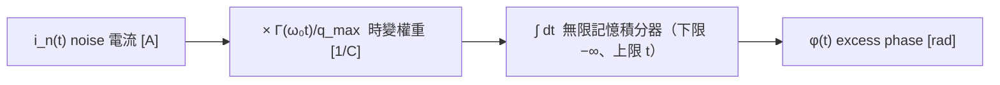

# 從單一 impulse 到任意 noise 的卷積推導

> **前置閱讀**：[isf_definition](/03_isf_core_theory/isf_definition)（$\Gamma$ 的操作型定義與單一相位 step）、[impulse_to_phase_shift](/03_isf_core_theory/impulse_to_phase_shift)（單一 impulse 的相位響應）、[oscillator_phase](/02_foundations/oscillator_phase)（excess phase 沒有恢復力、會累積）。

上一頁 [isf_definition](/03_isf_core_theory/isf_definition) 給了「**一顆** current impulse → **一個**相位 step」的定義。但真實電路的 noise 電流 $i_n(t)$ 是**連續、持續**地注入的，不是一顆一顆分開的脈衝。這頁回答：

> **連續的 noise 電流 $i_n(t)$ 造成的總 excess phase $\phi(t)$ 是多少？**

答案是 ISF 理論最核心的那條積分式（[P1] Eq.(11), p.182）：

$$
\phi(t)=\frac{1}{q_{max}}\int_{-\infty}^{t}\Gamma(\omega_0\tau)\,i_n(\tau)\,d\tau
$$

我們要做的，是把它從上一頁的「單一 step」用**疊加原理（superposition）**一步步推出來——而且要看清楚：這雖然長得像卷積，但它是 **LTV（線性時變）卷積**，不是訊號與系統課本裡那種 LTI 卷積。

> **物理直覺（先講結論）**：把 noise 電流切成無數薄片，每片是一顆迷你 impulse；每顆迷你 impulse 依當下相位 $\Gamma(\omega_0\tau)$ 給一個迷你相位 step；因為相位**沒有恢復力**，每個 step 一旦發生就**永遠留著**；所以「現在」的總相位 $\phi(t)$ ＝ **過去所有 step 的累加**。累加連續無窮多個 step，就是積分；「只累加過去」就是積分上限取到 $t$。$\Gamma$ 隨注入時刻變，所以權重隨時間變——這就是 LTV。

## 第 1 步：把 noise 切成小 impulse

任何連續電流都能近似成一串相鄰、很窄的矩形脈衝。在時刻 $\tau$、寬度 $d\tau$ 的那一片，沉積的電荷是

$$
dq(\tau)=i_n(\tau)\,d\tau .
$$

- **用到的物理**：電流定義 $i=dq/dt$，反過來 $dq=i\,d\tau$。
- **單位檢查**：$[\text{A}]\cdot[\text{s}]=[\text{C}]$ ✓。
- **為何合理**：只要每片寬度 $d\tau\ll T$（週期），每片就能當「瞬間注入一坨電荷」處理——這正是上一頁 impulse 的適用條件。

## 第 2 步：每個小電荷造成一個小 phase step

把上一頁的操作型定義用在第 $\tau$ 片電荷 $dq(\tau)$ 上：

$$
d\phi(\tau)=\frac{\Gamma(\omega_0\tau)}{q_{max}}\,dq(\tau)=\frac{\Gamma(\omega_0\tau)}{q_{max}}\,i_n(\tau)\,d\tau .
$$

- **關鍵**：權重 $\Gamma(\omega_0\tau)$ 用的是**注入那一刻的相位** $\omega_0\tau$，不是觀測時刻 $t$。同樣大的電荷，在 zero crossing（$\Gamma$ 大）注入造成大 step，在波峰（$\Gamma\approx0$）注入幾乎沒 step。
- **單位檢查**：$d\phi=\dfrac{[\text{無因次}]}{[\text{C}]}\cdot[\text{C}]=[\text{無因次}]=[\text{rad}]$ ✓。

## 第 3 步：每個 step 對「未來」永久保持

這是整條推導的靈魂，也是 oscillator 與一般 RLC filter 最不同的地方。

一個相位 step $d\phi$ 在 $\tau$ 時刻發生後，因為**相位方向沒有恢復力**（claim C2，[P1] Sec. III-A；幾何理由見 [isf_definition](/03_isf_core_theory/isf_definition) 第 2 步），它**不會衰減**，會一路保持到 $t>\tau$ 的所有未來。寫成脈衝響應就帶一個單位步階 $u(t-\tau)$（[P1] Eq.(10), p.182）：

$$
h_\phi(t,\tau)=\frac{\Gamma(\omega_0\tau)}{q_{max}}\,u(t-\tau).
$$

- $u(t-\tau)=1$（當 $t\ge\tau$）、$=0$（當 $t<\tau$）。它的物理意義是「未來才看得到、且永不消退」——相位積分器有**無限記憶**。
- **對照**：若這裡是振幅（amplitude）擾動，脈衝響應會是個**衰減**項（如 $e^{-(t-\tau)/\tau_A}u(t-\tau)$），擾動會被拉回。相位是 step、振幅是衰減指數——這就是「為什麼 phase noise 會累積、amplitude noise 不會」的數學寫照。

## 第 4 步：疊加所有過去的 step → 積分

線性（小訊號）系統下，總相位 ＝ 所有 contribution 之和。

**逐步：離散疊加 → 取極限 → 積分（不跳步）**。先把時間軸切成寬度 $\Delta\tau$ 的格子，注入時刻記為 $\tau_k=k\,\Delta\tau$（$k=\dots,-2,-1,0,1,\dots$）。

1. **第 $k$ 片的電荷**（step：把連續電流當成一串小 impulse）：

$$
\Delta q_k=i_n(\tau_k)\,\Delta\tau\quad[\text{A}\cdot\text{s}=\text{C}].
$$

2. **第 $k$ 片造成的相位 step**（step：用第 2 步的操作型定義，權重取**注入當下**相位 $\omega_0\tau_k$）：

$$
\Delta\phi_k=\frac{\Gamma(\omega_0\tau_k)}{q_{max}}\,\Delta q_k=\frac{\Gamma(\omega_0\tau_k)}{q_{max}}\,i_n(\tau_k)\,\Delta\tau.
$$

3. **step 對未來永久保持**（step：相位無恢復力）：在觀測時刻 $t$，只有 $\tau_k\le t$ 的 step 已經發生且仍留著，其貢獻乘上 $u(t-\tau_k)$（$\tau_k\le t$ 時為 1、否則為 0）。

4. **把所有過去的 step 相加**（離散疊加，superposition）：

$$
\phi(t)=\sum_{k:\ \tau_k\le t}\Delta\phi_k=\sum_{k=-\infty}^{\infty}\frac{\Gamma(\omega_0\tau_k)}{q_{max}}\,i_n(\tau_k)\,u(t-\tau_k)\,\Delta\tau.
$$

5. **取極限 $\Delta\tau\to0$**（step：黎曼和 → 黎曼積分）：當格子無限細，離散注入時刻 $\tau_k$ 變成連續變數 $\tau$、$\Delta\tau\to d\tau$、$\sum_k(\cdots)\Delta\tau\to\int(\cdots)\,d\tau$。這一步合法的前提是 $\Gamma$、$i_n$ 在每個小格內近似為常數（被積函數可積），對 noise 物理上總成立：

$$
\phi(t)=\lim_{\Delta\tau\to0}\sum_{k}\frac{\Gamma(\omega_0\tau_k)}{q_{max}}\,i_n(\tau_k)\,u(t-\tau_k)\,\Delta\tau
=\int_{-\infty}^{\infty}\frac{\Gamma(\omega_0\tau)}{q_{max}}\,u(t-\tau)\,i_n(\tau)\,d\tau .
$$

寫成 $h_\phi(t,\tau)$ 的 superposition 形式（[P1] Eq.(11)）即：

$$
\phi(t)=\int_{-\infty}^{\infty}h_\phi(t,\tau)\,i_n(\tau)\,d\tau=\int_{-\infty}^{\infty}\frac{\Gamma(\omega_0\tau)}{q_{max}}\,u(t-\tau)\,i_n(\tau)\,d\tau .
$$

- **為什麼 $u(t-\tau)$ 自然出現在「相加」那一步**：它不是人為塞進去的，而是「step 永久保持 + 只能加已發生的」這兩件事的數學記號——第 3 步的 $\tau_k\le t$ 條件，連續化後就是 $u(t-\tau)$。下面立刻看到它把積分上限切到 $t$。

那個 $u(t-\tau)$ 的作用是把積分上限「切」在 $t$：當 $\tau>t$ 時 $u(t-\tau)=0$，未來的 noise 還沒發生、不能影響現在（**causality，因果性**）。於是

$$
\boxed{\ \phi(t)=\frac{1}{q_{max}}\int_{-\infty}^{t}\Gamma(\omega_0\tau)\,i_n(\tau)\,d\tau\ }\qquad\text{[P1] Eq.(11), p.182}
$$

- **積分上限為何是 $t$**：因果性 ＋ 相位無限記憶。下限 $-\infty$ 表示「從開機到現在的所有 noise 都還記著」——這正是 long-term jitter 隨機漫步、越跑越偏的根源（見 [P2] Eq.(8) 的 $\sigma_{\Delta t}=\kappa\sqrt{\Delta t}$）。
- **單位檢查**：$\phi=\dfrac{1}{[\text{C}]}\cdot[\text{無因次}]\cdot[\text{A}]\cdot[\text{s}]=\dfrac{[\text{A}\cdot\text{s}]}{[\text{C}]}=\dfrac{[\text{C}]}{[\text{C}]}=[\text{無因次}]=[\text{rad}]$ ✓。
- **退化檢查**：若 $i_n(\tau)=\Delta q\,\delta(\tau-\tau_0)$（單一 impulse），積分挑出 $\tau_0$：$\phi(t)=\frac{\Gamma(\omega_0\tau_0)}{q_{max}}\Delta q$（$t>\tau_0$），完全回到上一頁的 $\Delta\phi=\Gamma\,\Delta q/q_{max}$ ✓。

## 為什麼這是 LTV，不是普通 LTI 卷積

訊號與系統課教的 LTI 卷積是 $y(t)=\int h(t-\tau)x(\tau)\,d\tau$——kernel **只看時間差 $t-\tau$**。這裡的 kernel 是

$$
h_\phi(t,\tau)=\frac{\Gamma(\omega_0\tau)}{q_{max}}\,u(t-\tau),
$$

它顯式依賴**絕對注入時刻 $\tau$**（透過 $\Gamma(\omega_0\tau)$），不能只寫成 $h(t-\tau)$。物理上：**同一個 impulse、注入到波形不同相位，響應不同**（claim C1，[P1] Sec. III）。

- **LTI（時不變）**：把輸入整體延後 $\Delta$，輸出也只延後 $\Delta$、形狀不變。
- **LTV（時變）**：把輸入延後 $\Delta$，因為 $\Gamma(\omega_0\tau)$ 在不同相位取值不同，輸出**形狀會變**。

不過要小心：它**仍然是線性的**（對 $i_n$ 線性、可疊加），只是**不時不變**。所以叫 LTV（Linear Time-Variant）。把 $i_n$ 切片、各自加權再疊加之所以成立，靠的就是這個「線性」；而加權隨時間變，就是「時變」。圖示對照見 [lti_vs_ltv](/02_foundations/lti_vs_ltv)。

> **一句話記法**：$\phi(t)$ 是 $i_n(t)$ 先被**週期權重 $\Gamma(\omega_0 t)/q_{max}$ 逐點相乘**、再**送進一個無限記憶的積分器**。乘法（時變權重）＋ 積分（記憶）＝ LTV 相位響應。

## Block diagram

把 Eq.(11) 畫成兩個 block：一個時變乘法器、一個積分器。



- block B（乘法）負責「時變」：權重隨波形相位 $\omega_0 t$ 週期變化，這是 LTV 的來源。
- block C（積分）負責「記憶」：把過去所有加權 noise 累加，這是相位**累積**、long-term jitter 隨機漫步的來源。

## Python numerical verification

`integrate_phase_from_noise` 就是把 block B（時變乘法）接 block C（cumulative 積分）實作出來的——對應 Eq.(11)。下面用一段**單音注入**驗證：理論上把單音 $i_n(t)=I_0\cos(\Delta\omega t)$（offset 很小、近 DC）餵進去，excess phase 應趨近 [P1] Eq.(15), p.183 的

$$
\phi(t)\approx\frac{I_0\,c_0\sin(\Delta\omega t)}{2q_{max}\,\Delta\omega}.
$$

對 ideal LC（$\Gamma=-\sin$）其 DC 係數 $c_0=0$，響應被抑制；改用帶 DC 的非對稱 ISF（$\Gamma=\cos\theta+\alpha$，此時 $c_0=2\alpha$）才會出現上式那種正比 $\sin(\Delta\omega t)$、幅度 $\propto1/\Delta\omega$ 的緩慢相位漂移。下面同時跑兩者對照：

```python
import numpy as np
from simulations.common.isf_utils import (
    gamma_lc_ideal, gamma_asymmetric, integrate_phase_from_noise,
)

# --- 設定 ---
f0      = 1.0                      # normalized carrier
w0      = 2 * np.pi * f0
fs      = 8000.0                   # 充分過取樣
t       = np.arange(0, 200.0, 1/fs)   # 跑很多個週期，看慢相位漂移
qmax    = 1.0
I0      = 1e-3
d_omega = 2 * np.pi * 0.01         # offset 0.01 Hz（近 DC、遠小於 w0）

i_n     = I0 * np.cos(d_omega * t)     # 注入單音

# --- block B×C：對兩種 ISF 各跑一次 Eq.(11) ---
phi_lc  = integrate_phase_from_noise(t, i_n, gamma_lc_ideal(w0 * t), qmax)        # c0 = 0
alpha   = 0.4
phi_asy = integrate_phase_from_noise(t, i_n, gamma_asymmetric(w0 * t, alpha), qmax)  # c0 = 2*alpha

# --- 理論 Eq.(15)：phi ~ I0 c0 sin(d_omega t)/(2 qmax d_omega) ---
c0_asy  = 2 * alpha
phi_theory = I0 * c0_asy * np.sin(d_omega * t) / (2 * qmax * d_omega)

print("LC (c0=0)   max|phi| =", np.max(np.abs(phi_lc)))      # 很小：DC 被抑制
print("asym sim    max|phi| =", np.max(np.abs(phi_asy)))
print("asym theory max|phi| =", np.max(np.abs(phi_theory)))  # 與 sim 同量級、同 1/d_omega 趨勢
```

- **怎麼解讀**：`phi_lc` 因 $c_0=0$ 幾乎不漂；`phi_asy` 出現 $\propto\sin(\Delta\omega t)$、幅度 $\propto1/\Delta\omega$ 的緩慢相位漂移，與 Eq.(15) 的解析式同量級、同趨勢。這驗證了「Eq.(11) 的時域積分 ＝ 文獻的頻域結果」。
- **為何只比量級／趨勢**：toy ISF（`gamma_asymmetric`）非 transistor-level，且數值積分有取樣與有限長度誤差；重點是 **scaling**（$\propto I_0 c_0/\Delta\omega$）對得上，不是逐點數字。
- 完整把這條積分拆成「各 ISF 諧波分別 down-convert」的版本見 [P1] Eq.(13), p.183，教學在 [fourier_series_of_isf](/03_isf_core_theory/fourier_series_of_isf)。

實作對照（`simulations/common/isf_utils.py`，逐字引用真實 code）：

```python
def integrate_phase_from_noise(t, i_noise, gamma_values, qmax):
    dt = np.mean(np.diff(t))
    return np.cumsum(gamma_values * i_noise / qmax) * dt
```

`np.cumsum(...)*dt` 就是「無限記憶積分器」（block C，累加所有過去）；`gamma_values * i_noise / qmax` 就是時變權重相乘（block B）。完整函式庫 `simulations/common/isf_utils.py`、噪聲工具 `simulations/common/noise_utils.py`。

## 數值手感（接回 single impulse）

把連續積分退化回單顆，能對上 [impulse_to_phase_shift](/03_isf_core_theory/impulse_to_phase_shift) 的例 A：$q_{max}=1$ pC、$\Delta q=1$ fC、$\Gamma=0.5$、$f_0=5$ GHz → $\Delta\phi=5\times10^{-4}$ rad → $\Delta t=15.9$ fs。連續 noise 的意義是：**每個 $d\tau$ 都這樣踢一下**，再被積分器全部記住、累加，所以 rms phase 隨時間（或隨積分頻寬下限）長大——這就是下一階段把 $i_n$ 的 PSD 接到 phase noise $\mathcal{L}(\Delta f)$ 的起點。

## Worked examples 數值例題

格式照規範第 10.4：題目 → 逐步代入（帶單位）→ 結果 → dimension check → 一行 Python 驗證。這裡刻意挑「能手算」的常數情境，把 `integrate_phase_from_noise`（Eq.(11) 的實作）拆開驗證。

### 例題 1：常數 ISF × 常數 noise 電流，數值積分 vs 手算

> **題目**：取**常數** ISF $\Gamma=0.5$、**常數** noise 電流 $i_n=I_0=2\ \mu\text{A}$、$q_{max}=1$ pC，在時窗 $[0,\,1\ \text{ns}]$ 上注入。用 Eq.(11) 求終點相位 $\phi(T)$，並與手算對照。

**逐步代入（手算）**：被積函數是常數，積分退化成乘法。

$$
\phi(T)=\frac{1}{q_{max}}\int_0^{T}\Gamma\,i_n\,d\tau=\frac{\Gamma\,I_0\,T}{q_{max}}=\frac{0.5\times(2\times10^{-6}\,\text{A})\times(1\times10^{-9}\,\text{s})}{1\times10^{-12}\,\text{C}}.
$$

先算分子：$0.5\times2\times10^{-6}\times10^{-9}=1\times10^{-15}\ \text{A}\cdot\text{s}=1\times10^{-15}\ \text{C}$。再除以 $q_{max}$：

$$
\phi(T)=\frac{1\times10^{-15}\ \text{C}}{1\times10^{-12}\ \text{C}}=1\times10^{-3}\ \text{rad}=1\ \text{mrad}.
$$

**用「電荷視角」交叉檢查**（退化回 single impulse）：總注入電荷 $\Delta q=I_0 T=2\times10^{-6}\times10^{-9}=2\times10^{-15}$ C $=2$ fC，套 $\Delta\phi=\Gamma\,\Delta q/q_{max}=0.5\times2\times10^{-15}/10^{-12}=1\times10^{-3}$ rad ✓（與積分結果一致——因為 $\Gamma$ 常數時，連續積分等於把總電荷一次注入）。

**結果**：$\phi(T)=1$ mrad，數值積分 `integrate_phase_from_noise` 得 $1.00001\times10^{-3}$ rad，與手算吻合（差異來自 `np.cumsum` 的離散累加端點效應，$\sim10^{-5}$ 相對誤差）。

**dimension check**：$\dfrac{1}{[\text{C}]}\cdot[\text{無因次}]\cdot[\text{A}]\cdot[\text{s}]=\dfrac{[\text{A}\cdot\text{s}]}{[\text{C}]}=\dfrac{[\text{C}]}{[\text{C}]}=$ 無因次（rad）✓。

```python
import numpy as np
from simulations.common.isf_utils import integrate_phase_from_noise

qmax, I0, gamma = 1e-12, 2e-6, 0.5
t  = np.linspace(0, 1e-9, 100001)          # 0 -> 1 ns
i  = np.full_like(t, I0)                    # 常數 noise 電流
gv = np.full_like(t, gamma)                 # 常數 ISF
phi = integrate_phase_from_noise(t, i, gv, qmax)
print(phi[-1], "rad")                       # -> 0.00100001 rad  (手算 = 1e-3 rad)
```

### 例題 2：時變 ISF（$\Gamma=-\sin$）× 常數 noise，半週期淨相位

> **題目**：改用真實的時變 ISF $\Gamma(\omega_0\tau)=-\sin(\omega_0\tau)$、常數 $i_n=I_0=2\ \mu\text{A}$、$q_{max}=1$ pC、$f_0=1$（normalized，故 $\omega_0=2\pi$），積分**整數個週期**。求 $\phi$。

**逐步代入（手算）**：

$$
\phi=\frac{I_0}{q_{max}}\int_0^{NT}(-\sin\omega_0\tau)\,d\tau=\frac{I_0}{q_{max}}\cdot\frac{\cos\omega_0\tau}{\omega_0}\Big|_0^{NT}.
$$

對**整數個週期** $NT$，$\cos\omega_0(NT)=\cos(2\pi N)=1=\cos0$，故積分 **= 0**：

$$
\phi(NT)=\frac{I_0}{q_{max}}\cdot\frac{1-1}{\omega_0}=0\ \text{rad}.
$$

**結果**：常數（DC）noise 在 $\Gamma=-\sin$（零 DC，$c_0=0$）下，每整週期的淨相位推移為 0——正/負半週互相抵消。這正是「對稱 ISF 抑制 DC/近 DC 注入」的時域寫照（呼應上面單音例：LC 的 $c_0=0$ 故 Eq.(15) 響應被抑制）。**若停在半週期**（$\tau=T/2$），$\cos\pi-\cos0=-2$，會留下非零的暫態相位偏移（下面 Python 印出 $\phi(T/2)\approx-636619.7$ rad）。（注意：此處 $I_0=2\ \mu\text{A}$、$q_{max}=1$ pC、半週期 $t=0.5$ s 皆為 **normalized 數值**，$I_0/q_{max}=2\times10^6$ 又除以 $\omega_0=2\pi$，故 $\phi$ 的「rad 數」極大；這純是 normalized-units 的記帳 artifact，不是物理上真有 $10^5$ rad 的相位——其實此時小訊號／線性前提（第 1 步 $d\tau\ll T$、單顆 impulse 只充電到總電荷約 10%，[P1] p.182）早已嚴重破壞。重點在「**整週期抵消、半週期不抵消**」的符號結構，不在這個 rad 數本身的大小。）

**dimension check**：同例題 1，最終 $\phi$ 無因次（rad）✓。

```python
import numpy as np
from simulations.common.isf_utils import gamma_lc_ideal, integrate_phase_from_noise

f0, w0, qmax, I0 = 1.0, 2*np.pi, 1e-12, 2e-6
t  = np.arange(0, 10.0, 1/8000.0)           # 10 個整週期
i  = np.full_like(t, I0)
gv = gamma_lc_ideal(w0 * t)                  # Γ = -sin(w0 t)
phi = integrate_phase_from_noise(t, i, gv, qmax)
assert abs(phi[-1]) < 1e-6                    # 整週期淨相位抵消（殘量 ~6e-10，僅來自 cumsum 離散化）
print(round(abs(phi[-1]), 6))                # -> 0.0  (整週期淨相位抵消)
print(round(phi[len(t)//20], 1))             # -> -636619.7  (半週期附近：非零暫態)
```

完整函式庫：`simulations/common/isf_utils.py`。

## 適用與失效條件

| 條件 | 成立時 | 失效時會怎樣 |
|---|---|---|
| 小訊號／線性 | superposition 成立，可切片疊加 | 大 noise → 非線性，$\Gamma$ 本身被改、不能簡單疊加 |
| $\Gamma$ 已知且 frequency-independent | 直接代入 Eq.(11) | $\Gamma$ 隨頻率變時要更完整模型 |
| 相位無限記憶（無相位恢復） | 積分上限取 $t$、永久累積 | 有相位牽引（如 injection locking）時要加 restoring 項，見 [P3] 廣義 Adler |
| 振幅擾動可忽略 | phase-only 模型夠用 | 強 AM–PM 要把 APF（[P4]）一起算 |

## 重點回顧

- noise 切片 → 每片電荷 $i_n d\tau$ → 每片給 step $\Gamma(\omega_0\tau)i_n d\tau/q_{max}$ → step 對未來永久保持 → 疊加所有過去 → 積分上限 $t$。
- 結果：$\phi(t)=\dfrac{1}{q_{max}}\displaystyle\int_{-\infty}^{t}\Gamma(\omega_0\tau)\,i_n(\tau)\,d\tau$（[P1] Eq.(11), p.182）。
- 這是 **LTV**：kernel 依絕對注入時刻 $\tau$（透過 $\Gamma(\omega_0\tau)$），不是只依 $t-\tau$；仍線性、但時變。
- 結構＝**時變乘法器（$\times\Gamma(\omega_0 t)/q_{max}$）＋ 無限記憶積分器（$\int dt$）**。
- `integrate_phase_from_noise` 用 `np.cumsum(gamma*i/qmax)*dt` 實作這條積分；單音注入驗證對上 Eq.(15) 的 $1/\Delta\omega$ 趨勢。

## 延伸閱讀

- 單一 impulse 的操作型定義：[impulse_to_phase_shift](/03_isf_core_theory/impulse_to_phase_shift)
- $\Gamma$ 是什麼、為何 LTV：[isf_definition](/03_isf_core_theory/isf_definition)
- LTI vs LTV 圖解：[lti_vs_ltv](/02_foundations/lti_vs_ltv)
- 把積分拆成 ISF 諧波（頻率搬移）：[fourier_series_of_isf](/03_isf_core_theory/fourier_series_of_isf)
- 白噪 → 1/f² phase noise：[white_noise_to_phase_noise](/03_isf_core_theory/white_noise_to_phase_noise)
- 數值手感速查：[numerical_feeling](/04_simulation_labs/numerical_feeling)
