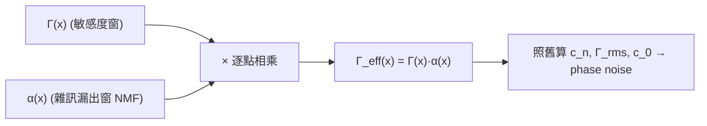

# Effective ISF 與 cyclostationary noise

> **前置閱讀**：[isf_definition](/03_isf_core_theory/isf_definition)（$\Gamma$ 的定義）、[rms_isf](/03_isf_core_theory/rms_isf)（$\Gamma_{rms}$ 與 $\sum c_n^2$）、[stochastic_noise_basics](/02_foundations/stochastic_noise_basics)（stationary vs cyclostationary noise）。

到目前為止，我們都假設 noise 源是 **stationary（穩態）**——它的統計性質（例如均方功率）
不隨時間變。電阻的熱雜訊就是這樣。但振盪器裡最大宗的雜訊源是**電晶體**，而電晶體的雜訊功率
會**隨工作點週期性地變化**：它導通電流大時雜訊強、截止時雜訊弱。這種「統計性質隨時間週期變化」
的雜訊叫 **cyclostationary noise（週期穩態雜訊）**。

這頁回答：當 device noise 是 cyclostationary 時，ISF 理論怎麼處理？答案漂亮又簡單——把週期性的
「雜訊強度調制」併進 ISF，得到 **effective ISF（有效 ISF）**：

$$
\Gamma_{eff}(x)=\Gamma(x)\,\alpha(x)
$$

之後**所有公式照舊用 $\Gamma_{eff}$ 取代 $\Gamma$ 即可**（cyclostationary 分解與 effective ISF 的出處為
[P1] Sec. II-D「Cyclostationary Noise Sources」, Eq.(25)–(27), p.186；$\Gamma_{eff}=\Gamma\cdot\alpha$ 為 Eq.(27)）。

> **物理直覺（先講結論）**：振盪器有兩個「時間之窗」在同時開合：
> (1) **ISF $\Gamma(x)$**——振盪器「此刻對雜訊有多敏感」（波形哪裡好踢）；
> (2) **NMF $\alpha(x)$**——device「此刻漏出多少雜訊」（電晶體哪時在出力）。
> 真正進到相位的，是**兩扇窗的重疊**。如果 device 剛好在「ISF 不敏感」的時刻才大漏雜訊
> （像好的 Colpitts：電流脈衝出現在波谷、ISF 很小），那雜訊大半被白白浪費掉——這就是為什麼
> 把 $\alpha$ 算進去**很重要**，光用平均雜訊功率會嚴重高估或低估。

## 第 1 步：cyclostationary 雜訊怎麼分解

[P1] Sec. II-D「Cyclostationary Noise Sources」（p.186）把一個 white cyclostationary 電流 $i_n(t)$ 分解成
（[P1] Sec. II-D, Eq.(25), p.186）：

$$
i_n(t)=i_{n0}(t)\,\alpha(\omega_0 t)
$$

其中：

- $i_{n0}(t)$ 是一個 **white stationary（白色、穩態）** 隨機過程——強度固定、好處理。
- $\alpha(\omega_0 t)$ 是一個**確定性的週期函數**，描述雜訊振幅的調制，稱為
  **noise-modulating function（NMF，雜訊調制函數）**。

[P1] 把 $\alpha$ **normalize 成最大值為 1**（$0\le\alpha\le1$、週期 $2\pi$）。這樣定義下，
瞬時的均方雜訊功率 $=\alpha^2(\omega_0 t)\cdot\overline{i_{n0}^2}$，其中 $\overline{i_{n0}^2}$ 是**最大**均方功率。

- **用到的物理**：MOS 通道雜訊 $\propto g_m$ 或 $\propto$ 過驅動電壓，這些量隨波形週期變化，
  所以雜訊功率被「閘控」——device 在某些相位才真正漏雜訊（[P1] 原文舉 MOS channel noise 為例）。
- **單位檢查**：$\alpha$ 無因次（$0$ 到 $1$）；$i_{n0}$ 與 $i_n$ 同為電流（A） ✓。

## 從 device 熱雜訊推 NMF $\alpha(t)$

上一步把 $\alpha(\omega_0 t)$ 當成「天上掉下來的週期調制」直接用。但對一個 40 年經驗的類比設計者，
真正該問的是：**$\alpha(t)$ 從哪裡來？它的形狀為什麼長那樣？** 答案完全寫在 device 的
**bias-dependent 熱雜訊（隨工作點變化的熱雜訊）** 裡。這一節把 $\alpha(t)$ 從「電晶體的瞬時偏壓」
**親手推出來**，並用一個 switching-pair（差動切換對）的 worked example 算給你看它怎麼改 $1/f^3$。

> **物理直覺（先講結論）**：transistor 的熱雜訊**不是固定強度**——它的均方雜訊電流正比於某個
> bias-dependent 的量（MOS 是 $g_m$ 或 $I_D$、BJT 是 collector 電流）。在振盪器裡，這些量**隨大訊號波形
> 週期性地起伏**：device 全導通時雜訊最強、截止時幾乎不漏雜訊。把「瞬時雜訊功率相對其最大值」開根號、
> normalize 到峰值 1，就是 NMF $\alpha(t)$。所以 **$\alpha(t)$ 不是額外假設，它就是 device 熱雜訊
> 的瞬時 envelope（包絡）**。

### 第 A 步：transistor 熱雜訊是 bias-dependent 的

先寫下 device 熱雜訊的標準式（在我們關心的 offset 頻段內視為白色）。對 MOSFET 的通道熱雜訊
（channel thermal noise，外部標準 device 模型、不在 5 篇 PDF 內）：

$$
\frac{\overline{i_{n,d}^2}}{\Delta f}=4kT\,\gamma\,g_m \qquad[\text{A}^2/\text{Hz}],
$$

其中 $\gamma$ 是 noise 係數（長通道 $\approx2/3$、短通道更大）、$g_m$ 是瞬時跨導（transconductance，
單位 S＝A/V）。關鍵在 $g_m$ **本身隨瞬時偏壓變化**——在振盪器中 device 的閘源電壓 $v_{GS}(t)$ 隨波形
擺動，所以

$$
g_m=g_m\big(v_{GS}(t)\big)\quad\Longrightarrow\quad \frac{\overline{i_{n,d}^2(t)}}{\Delta f}=4kT\gamma\,g_m\big(v_{GS}(t)\big)
$$

**也是時間的週期函數**。對工作在飽和區的方根律 MOS，$g_m=\sqrt{2\mu C_{ox}(W/L)\,I_D(t)}\propto\sqrt{I_D(t)}$；
device 截止（$v_{GS}<V_T$）時 $I_D\to0$、$g_m\to0$、雜訊熄滅。

- **用到的物理**：熱雜訊強度由**通道電導**（正比 $g_m$ 或 $I_D$）決定；振盪器的大訊號波形把這個電導
  週期性開關。對 BJT 同理：collector shot noise $\overline{i_c^2}/\Delta f=2qI_C(t)$，$I_C(t)$ 隨波形脈動。
- **單位檢查**：$4kT$ 是 $\text{J}=\text{V}\cdot\text{A}\cdot\text{s}$，乘 $g_m$（A/V）得 $\text{A}^2\cdot\text{s}=\text{A}^2/\text{Hz}$ ✓。

### 第 B 步：normalize → 得到 $\alpha(t)$

把瞬時均方雜訊功率寫成「最大值 × 一個 $[0,1]$ 的形狀」。定義最大均方功率
$\overline{i_{n0}^2}/\Delta f\equiv\max_t\big[4kT\gamma\,g_m(v_{GS}(t))\big]$（取一週期內的峰值），則

$$
\frac{\overline{i_{n,d}^2(t)}}{\Delta f}=\frac{\overline{i_{n0}^2}}{\Delta f}\cdot\underbrace{\frac{g_m\big(v_{GS}(t)\big)}{\max_t g_m}}_{\equiv\,\alpha^2(\omega_0 t)} .
$$

逐項比對 [P1] 的分解 $\overline{i_n^2(t)}=\alpha^2(\omega_0 t)\,\overline{i_{n0}^2}$（規範第 1 步），立刻讀出

$$
\boxed{\ \alpha(\omega_0 t)=\sqrt{\frac{g_m\big(v_{GS}(t)\big)}{\max_t g_m\big(v_{GS}(t)\big)}}\ }\qquad(0\le\alpha\le1).
$$

- **這就是 NMF 的微觀來源**：$\alpha(t)$ 是「瞬時跨導相對其峰值」開根號（因為 $\alpha$ 定義在**振幅**側、
  雜訊功率才是 $\alpha^2$）。device 全力導通的相位 $\alpha=1$、截止的相位 $\alpha=0$。**對「只在一小段相位
  導通」的電路（switching pair、class-C、Colpitts 的電流脈衝），$\alpha$ 是一個窄的週期 gate（閘）**。
- **單位檢查**：比值無因次、開根號仍無因次 → $\alpha$ 無因次、$0\le\alpha\le1$ ✓，與規範一致。
- **與 ISF 的接口**：代回上一步即得 $\Gamma_{eff}=\Gamma\cdot\alpha$。**$\alpha$ 的形狀完全由 device 的
  $g_m(v_{GS}(t))$ 決定——也就是由「電路拓樸 + 偏壓 + 大訊號波形」決定**，不是自由參數。

> **設計外帶（深化）**：既然 $\alpha\propto\sqrt{g_m}$、而 $g_m$ 在 device「導通與否」之間切換，那麼**讓
> device 在哪段相位導通**就是設計師手上的旋鈕。把導通窗（$\alpha$ 峰）推到 ISF 的零點（$\Gamma\approx0$），
> $\Gamma_{eff}=\Gamma\alpha$ 就被壓垮——這正是 Colpitts/class-C 低相位雜訊的物理。下面用 switching pair
> 把這件事算成數字。

## 第 2 步：把 $\alpha$ 吸進 ISF，得到 $\Gamma_{eff}$

把分解 $i_n=i_{n0}\,\alpha(\omega_0\tau)$ 代進 LTV 相位響應 [P1] Eq.(11), p.182：

$$
\phi(t)=\frac{1}{q_{max}}\int_{-\infty}^{t}\Gamma(\omega_0\tau)\,i_n(\tau)\,d\tau
=\frac{1}{q_{max}}\int_{-\infty}^{t}\underbrace{\Gamma(\omega_0\tau)\,\alpha(\omega_0\tau)}_{\equiv\,\Gamma_{eff}(\omega_0\tau)}\,i_{n0}(\tau)\,d\tau.
$$

中間那兩個週期函數相乘，定義成 **effective ISF**（代回 (11) 為 [P1] Sec. II-D, Eq.(26), p.186；
$\Gamma_{eff}=\Gamma\cdot\alpha$ 本身為 [P1] Eq.(27), p.186）：

$$
\boxed{\ \Gamma_{eff}(x)=\Gamma(x)\,\alpha(x)\ }
$$

於是式子的形狀**完全沒變**：剩下的 $i_{n0}$ 是 stationary 白噪，作用在一個 ISF 為 $\Gamma_{eff}$
的系統上。[P1] 原文說得很直白：

> 「the cyclostationary noise can be treated as a stationary noise applied to a system with an
> effective ISF」。

- **用到的數學**：把確定性週期因子 $\alpha$ 從「隨機過程那一側」搬到「系統權重那一側」——
  因為 $\alpha$ 是 deterministic，這個搬移完全合法、不改變任何統計量。
- **單位檢查**：$\Gamma$ 無因次、$\alpha$ 無因次 $\Rightarrow$ $\Gamma_{eff}$ 無因次、仍是 $2\pi$ 週期 ✓。
- **實務規則（claim C9）**：**之後所有計算都用 $\Gamma_{eff}$**——特別是傅立葉係數 $c_n$、
  $\Gamma_{rms}$、$c_0$。也就是說，前面 [white_noise_to_phase_noise](/03_isf_core_theory/white_noise_to_phase_noise)
  與 [flicker_noise_upconversion](/03_isf_core_theory/flicker_noise_upconversion) 的 Eq.(21)、(23)、(24)
  通通把 $\Gamma\to\Gamma_{eff}$、$c_0\to c_0^{eff}$、$\Gamma_{rms}\to\Gamma_{rms}^{eff}$ 即可。

## 第 3 步：為什麼這件事對設計很重要——Colpitts vs ring

$\Gamma_{eff}=\Gamma\cdot\alpha$ 是兩個週期函數的逐點乘積，**相位對齊**決定一切。[P1]（p.187，Fig. 14–15）
用兩個經典例子說明，差異巨大：

- **Colpitts LC 振盪器**：電晶體的 collector 電流是「短促的大電流脈衝 + 長時間安靜」。
  那個電流突波**剛好出現在 tank 電壓的最低點**——而那裡 **ISF $\Gamma$ 很小**（波谷不敏感）。
  於是 $\Gamma_{eff}=\Gamma\cdot\alpha$ 比單看 $\Gamma$ **小很多**：device 在最不敏感的時刻才漏雜訊，
  雜訊大半被浪費。[P1] 原文：「$\Gamma_{eff}$ is quite different from $\Gamma$, and hence the effect of
  cyclostationarity is **very significant** for the LC oscillator and cannot be neglected.」
  —— 這正是 Colpitts 相位雜訊好的一個關鍵原因。
- **ring 振盪器**：device 在 **transition（切換）時電流最大**——而那裡**正是 ISF 最大**（最敏感）。
  $\alpha$ 的峰與 $\Gamma$ 的峰**重疊**，所以 $\Gamma_{eff}\approx\Gamma$，cyclostationarity **幫不上忙**。
  [P1]：ring 的 $\Gamma_{eff}$ 與 $\Gamma$ 幾乎相同——這個「不幸的巧合」是 ring 相位雜訊通常**較差**
  的原因之一（另一個原因是 ring 每週期把儲能全耗掉）。



- **設計外帶**：想要低相位雜訊，不只要小 $\Gamma_{rms}$、大 $q_{max}$，還要**讓 device 在 ISF 不敏感的
  相位才漏雜訊**（讓 $\alpha$ 峰與 $\Gamma$ 峰**錯開**）。Colpitts 天生就做到了；這是拓樸層級的優勢。

## 第 4 步：$\Gamma_{eff}$ 也影響 flicker——別忘了用 $c_0^{eff}$

承上一頁：flicker 上轉只看 ISF 的 DC 項 $c_0$。但要看的其實是 **$\Gamma_{eff}$ 的 DC 值**，
也就是 $c_0^{eff}/2=\langle\Gamma\,\alpha\rangle$（一個週期的平均）。[P1] 在設計章節
（p.187–188，Eq.(30) 附近）明白寫道：$1/f^3$ corner 由 **(effective) ISF 的 DC 值**決定。

- **後果**：即使主訊號路徑的 $\Gamma$ 很對稱（$c_0\approx0$），若某個源的 $\alpha$ 不對稱，
  $\Gamma_{eff}=\Gamma\alpha$ 的平均仍可能不為零 $\Rightarrow$ 重新打開 flicker 閘門。
- **tail 源的惡名**（呼應 flicker 頁）：tail current source 的 ISF/NMF 組合常使 $\Gamma_{eff}$ 有**大 DC 值**，
  把 tail 的 flicker 強烈上轉。對稱化主路徑救不了它——要從 $\Gamma_{eff}$（含 $\alpha$）的角度檢查每個源。

## 數值例子（toy，建立手感）

> **toy 設定（非 transistor-level）**：理想 LC 的 $\Gamma(x)=-\sin x$。這個 toy 故意把導通窗放在
> **$|\Gamma|$ 的峰**（最敏感相位），用來示範「對齊不好」時 cyclostationary 閘控仍能省多少——
> 用一個 normalized 高斯脈衝近似 NMF：$\alpha(x)$ 在 $x=3\pi/2$（$\Gamma=-\sin(3\pi/2)=+1$，
> 即 $|\Gamma|=1$ 最敏感處）附近窄峰、峰值 1。（要看「對齊好」的 Colpitts 情形——窗落在
> $\Gamma\approx0$ 的波谷——見下面例題 2(b)。）

把 $\Gamma_{eff}=\Gamma\cdot\alpha$ 的 $\Gamma_{rms}^{eff}$ 跟原始 $\Gamma_{rms}$ 比：

- 原始 $\Gamma(x)=-\sin x$：$\Gamma_{rms}^2=\frac{1}{2\pi}\int_0^{2\pi}\sin^2x\,dx=\tfrac12
  \Rightarrow\Gamma_{rms}=0.707$。
- 加上窄的 $\alpha$（duty 約 $10\%$、且峰落在 $|\Gamma|\approx1$ 的**最敏感**相位）：$\Gamma_{eff}$ 只在那個窄窗非零，
  其能量 $\Gamma_{rms}^{eff}{}^2=\frac{1}{2\pi}\int \Gamma^2\alpha^2\,dx$ 約是原來的 duty 倍 $\to$
  $\Gamma_{rms}^{eff}\approx0.707\times\sqrt{0.1}\approx0.22$。

代進 [P1] Eq.(21)（用 $\Gamma_{rms}^{eff}$ 取代 $\Gamma_{rms}$），其餘照例 B
（$f_0=5$ GHz、$\Delta f=1$ MHz、$q_{max}=1$ pC、$S_i=10^{-24}$）：

$$
\mathcal{L}=10\log_{10}\!\left(\frac{(0.22)^2}{(10^{-12})^2}\cdot\frac{10^{-24}}{4(2\pi\times10^6)^2}\right)
=10\log_{10}\!\left(\frac{0.0484}{10^{-24}}\cdot6.332\times10^{-39}\right).
$$

$$
=10\log_{10}(3.065\times10^{-16})=-155.1\ \text{dBc/Hz}.
$$

- **手感**：這個 0.22 是從**未閘控的 $-\sin$ LC**（$\Gamma_{rms}=0.707$，$\mathcal{L}\approx-145.0$ dBc/Hz）
  閘控而來，所以要跟**同一個來源**比：把 cyclostationary 閘控算進去後改善約 **10 dB**
  （$\Gamma_{rms}^{eff}$ 從 0.707 掉到 0.22，$20\log_{10}(0.707/0.22)\approx10.1$ dB）。即使**窗落在最敏感
  相位**（壞對齊），光是「只在一小段相位漏雜訊」就省了約 10 dB——**不算 $\alpha$ 會嚴重高估雜訊**。
  （另比：相對規範例 B 的 $\Gamma_{rms}=0.5$／$-148.0$ dBc/Hz 約為 $20\log_{10}(0.5/0.22)\approx7.1$ dB；
  但 0.22 並非由 0.5 閘控而來，故以 0.707 為自洽基準。）
- **務必註明**：此處 $\alpha$ 的 duty 與相位是**示意 toy 數字**，非真實 Colpitts 萃取值；
  真實 $\alpha$ 要從 device 工作點/模擬取得。**TODO: 用實際 Colpitts 模擬萃取 $\alpha(x)$ 與
  $\Gamma_{eff}$，替換此 toy 估計。**

## 補充：PPV / adjoint method / Floquet theory（外部文獻背景）

ISF 在 [P1] 是用「物理直覺 + impulse 模擬」引入的。它背後其實有一套**嚴謹的數學基礎**，
但**這套基礎不在我們下載的 5 篇 PDF 之內**——它來自更廣的非線性振盪器/擾動理論文獻
（claim C13）。為了讓你知道整張地圖長怎樣，這裡給直覺；正式 citation 已補（見下方誠實聲明），
PPV 定義式的精確頁碼仍待補：

- **Floquet theory（弗洛凱理論）**：研究**週期係數線性微分方程**的解結構的數學框架。
  振盪器在 limit cycle 附近線性化後，正是這類系統。Floquet 給出一組隨時間週期變化的
  特徵向量（Floquet eigenvectors）與 exponents，描述擾動沿各方向的成長/衰減。
- **PPV（Perturbation Projection Vector，擾動投影向量）**：在 Floquet 的框架下，對應**零
  Floquet exponent**（中性方向，就是相位方向，因為相位沒有恢復力）的那條**第一主向量** $v_1(t)$。
  把任意擾動投影到 $v_1(t)$，得到的就是相位偏移。**PPV 本質上就是 ISF 的嚴謹版**——
  $\Gamma(\omega_0\tau)/q_{max}$ 對應 $v_1(t)$ 在注入節點上的分量。Demir 等人（2000）用 PPV 把相位
  動態寫成 $\dot{\phi}(t)=v_1^T(t)\,B(t)\,\xi(t)$ 這種一階式（見 equation_index 收錄的 reference 形式）。
- **adjoint method（伴隨法）**：實務上**如何從模擬萃取 ISF/PPV** 的標準方法。它解原系統
  Monodromy 矩陣的**伴隨（轉置）問題**的週期解，一次就能得到整條 $v_1(t)$（即整條 ISF），
  比「一個相位一個相位地打 impulse」（本站 lab_04 的暴力法）有效率得多。商用 RF 模擬器的
  PSS + Pnoise 流程內部用的就是這類方法。

> **誠實聲明**：PPV / adjoint / Floquet 屬於 **Demir–Mehrotra–Roychowdhury (2000)**、Kärtner
> 等外部文獻，**不在本站下載的 5 篇 PDF 內**，此處僅以標準文獻背景提供直覺。
> **已補正式 citation**：Demir et al. 2000（IEEE TCAS-I 47(5):655–674, DOI 10.1109/81.847872）見
> [references](/99_appendix/references) [E2]（外部文獻）。
> **TODO**：補上 PPV 定義式的精確頁碼，並核對 $v_1(t)$ 與 $\Gamma/q_{max}$ 的精確對應關係。

## Worked examples 數值例題

格式照規範第 10.4：題目 → 逐步代入（帶單位）→ 結果 → dimension check → 一行 Python 驗證。
**所有 $\alpha$ 的 duty 與相位皆為示意 toy 數字（非 transistor-level 萃取值）。**

### 例題 1：方波 gating NMF（duty $\alpha$）的 $\Gamma_{eff,rms}$

> **toy 題目**：理想 LC 的 $\Gamma(x)=-\sin x$。device 只在以 zero crossing（$x=\pi/2$，$|\Gamma|=1$ 最敏感處）為中心、寬度 duty $\alpha=0.1$（佔週期 $10\%$）的窄窗導通，其餘時間不漏雜訊。用方波 NMF $\alpha(x)\in\{0,1\}$（峰值已 normalize 到 1）。求 $\Gamma_{eff,rms}$。

**逐步代入**：方波 gating 下 $\Gamma_{eff}=\Gamma\cdot\alpha$ 只在那個窄窗 = $\Gamma$、其餘 = 0。因為窗很窄且中心在 $|\Gamma|\approx1$ 處，窗內 $\Gamma^2\approx1$，所以

$$
\Gamma_{eff,rms}^2=\frac{1}{2\pi}\int_0^{2\pi}\Gamma^2\alpha^2\,dx
\approx\underbrace{(1)}_{\text{窗內}\,\Gamma^2}\times\underbrace{0.1}_{\text{duty}}=0.1
\ \Rightarrow\ \Gamma_{eff,rms}\approx\sqrt{0.1}\approx0.316.
$$

更精確一點：把窗放在中心 $\pi/2$、半寬 $0.1\pi$，窗內 $\sin^2 x$ 平均略小於 1（約 $0.97$），故 $\Gamma_{eff,rms}\approx\sqrt{0.97\times0.1}\approx0.311$。

**結果**：$\Gamma_{eff,rms}\approx0.31$，比未閘控的 LC $\Gamma_{rms}=0.707$ 小很多。（注意：這裡 device 落在**最敏感**相位，是「壞」對齊；若像 Colpitts 落在波谷 $\Gamma\approx0$，$\Gamma_{eff,rms}$ 會更小——見例題 2。）

**dimension check**：$\Gamma$、$\alpha$、$\Gamma_{eff}$ 皆無因次 → $\Gamma_{eff,rms}$ 無因次 ✓。

```python
import numpy as np
from simulations.common.isf_utils import gamma_lc_ideal, effective_isf, gamma_rms

x = np.linspace(0.0, 2*np.pi, 200001, endpoint=True)
gamma = gamma_lc_ideal(x)                       # -sin x
center, half = np.pi/2, 0.1*np.pi               # 窗中心、半寬 (duty=0.1)
alpha = ((np.abs(((x-center+np.pi)%(2*np.pi))-np.pi)) <= half).astype(float)
g_eff = effective_isf(gamma, alpha)             # Γ_eff = Γ·α
print(gamma_rms(x, g_eff))                       # -> ~0.31
```

### 例題 2：相位對齊決定一切（Colpitts vs ring toy）＋ 相對 PN 變化

> **toy 題目**：同 duty $\alpha=0.1$ 的方波 gating，但比較兩種「對齊」：
> (a) **ring-like**：窗中心在 $x=\pi/2$（$|\Gamma|$ 最大）；(b) **Colpitts-like**：窗中心在 $x=0$（波峰，$\Gamma\approx0$）。
> 求各自 $\Gamma_{eff,rms}$，以及代進 [P1] Eq.(21) 相對「未閘控 stationary（$\Gamma_{rms}=0.707$）」的 phase-noise 變化（dB）。

**逐步代入**：相對 PN 變化只看 $\Gamma_{rms}$ 比值，因為 $\mathcal{L}\propto\Gamma_{rms}^2/q_{max}^2$，其餘參數相同：

$$
\Delta\mathcal{L}=10\log_{10}\!\left(\frac{\Gamma_{eff,rms}^2}{\Gamma_{rms}^2}\right)=20\log_{10}\!\left(\frac{\Gamma_{eff,rms}}{\Gamma_{rms}}\right).
$$

- **(a) ring-like**（窗在 $|\Gamma|\approx1$）：$\Gamma_{eff,rms}\approx0.31$（例題 1）。

$$
\Delta\mathcal{L}_{(a)}=20\log_{10}\!\left(\frac{0.31}{0.707}\right)=20\log_{10}(0.438)\approx-7.2\ \text{dB}.
$$

- **(b) Colpitts-like**（窗在 $\Gamma\approx0$）：窗內 $\sin^2 x$ 很小，半寬 $0.1\pi$ 內平均 $\approx0.032$，故 $\Gamma_{eff,rms}\approx\sqrt{0.032\times0.1}=\sqrt{3.2\times10^{-3}}\approx0.057\ll0.31$。

$$
\Delta\mathcal{L}_{(b)}=20\log_{10}\!\left(\frac{0.057}{0.707}\right)=20\log_{10}(0.081)\approx-22\ \text{dB}.
$$

**結果**：**同樣的 duty、同樣的雜訊量，只因相位對齊不同，PN 差了約 15 dB**（(b) 的 $-22$ dB vs (a) 的 $-7$ dB）。Colpitts-like（雜訊漏在不敏感的波峰）比 ring-like 好得多——這正是 cyclostationarity「不可忽略」的量化證據。（呼應正文：未閘控 $\Gamma_{rms}=0.707$ 的 $\mathcal{L}\approx-145$ dBc/Hz，Colpitts-like 再改善 $\sim22$ dB。**示意 toy 數字。**）

**dimension check**：比值無因次 → $20\log_{10}(\cdot)$ 得 dB ✓。

```python
import numpy as np
from simulations.common.isf_utils import gamma_lc_ideal, effective_isf, gamma_rms

x = np.linspace(0.0, 2*np.pi, 200001, endpoint=True)
gamma = gamma_lc_ideal(x)
half = 0.1*np.pi
def gated_rms(center):
    a = ((np.abs(((x-center+np.pi)%(2*np.pi))-np.pi)) <= half).astype(float)
    return gamma_rms(x, effective_isf(gamma, a))
g_ring     = gated_rms(np.pi/2)   # 壞對齊
g_colpitts = gated_rms(0.0)       # 好對齊
g_stat     = 0.7071               # 未閘控 LC
for name, g in [("ring-like", g_ring), ("Colpitts-like", g_colpitts)]:
    print(name, round(g,3), "rms ;", round(20*np.log10(g/g_stat),1), "dB vs stationary")
# -> ring-like 0.311, -7.1 dB ; Colpitts-like 0.057, -21.9 dB
```

### 例題 3：switching-pair 的 2-per-period gate——$\Gamma_{eff}$ 的 $c_0/c_2$ 怎麼改 $1/f^3$

這題把上面「從 device 熱雜訊推 $\alpha$」的結論用在一個**真實拓樸的骨架**上：差動 **switching pair
（切換對）**。它是 cross-coupled LC VCO、Gilbert mixer、CML 邏輯共用的核心，所以這個 $\alpha$ 的形狀
（**每週期導通兩次**）特別有代表性。我們要算 $\Gamma_{eff}=\Gamma\alpha$ 的 **$c_0$ 與 $c_2$**，並看它們
如何打開／改變 close-in 的 $1/f^3$。

> **toy 題目（gate 形狀為示意，非 transistor-level 萃取）**：差動對的兩顆 device **輪流導通**——
> 正半週左管導通、負半週右管導通。從**單一 device 的雜訊**看出去，它的 $\alpha$ 是「每週期亮一次」的窄
> 脈衝（duty $\alpha=0.1$）；但若把**差動對整體**（兩管雜訊都算）對 tank 的注入看成一個等效源，導通事件
> **每週期發生兩次**（$x=\pi/2$ 與 $x=3\pi/2$ 各一個窄 gate），所以等效 NMF 是 **2-per-period gate**
> $\alpha(x)$：在 $x=\pi/2,\,3\pi/2$ 各一個半寬 $0.1\pi$、峰值 1 的窗，其餘為 0。
> 取 ISF 為理想 LC 的 $\Gamma(x)=-\sin x$。求 $\Gamma_{eff}$ 的 $c_0^{eff}$、$c_2^{eff}$，並判斷 $1/f^3$。

**逐步代入：**

**(1) 為什麼 2-per-period gate 會生 $c_2$。** $\alpha(x)$ 每週期重複兩次（基本週期 $\pi$），所以它本身
只含**偶次**諧波（$2\omega_0,4\omega_0,\dots$）。$\Gamma=-\sin x$ 是純基頻（奇）。兩者相乘
$\Gamma_{eff}=\Gamma\cdot\alpha$ 由「奇 × 偶」混出新諧波——重點是會生出**非零的 $c_2^{eff}$**（這是單看 $\Gamma$
（$c_2=0$）時沒有的），以及可能的**非零 $c_0^{eff}$**。

**(2) 算 $c_0^{eff}$（DC 值＝一週期平均）。** $c_0^{eff}/2=\langle\Gamma\alpha\rangle$。在 $x=\pi/2$ 的窗內
$\Gamma=-\sin(\pi/2)=-1$；在 $x=3\pi/2$ 的窗內 $\Gamma=-\sin(3\pi/2)=+1$。**兩窗的 $\Gamma$ 等大反號**，
若兩窗等寬等高，平均**相消**：

$$
c_0^{eff}/2=\langle\Gamma\alpha\rangle\approx\frac{1}{2\pi}\Big[\underbrace{(-1)(0.2\pi)}_{x=\pi/2\,\text{窗}}+\underbrace{(+1)(0.2\pi)}_{x=3\pi/2\,\text{窗}}\Big]=0\ \Rightarrow\ c_0^{eff}\approx0.
$$

（每個窗寬 $2\times0.1\pi=0.2\pi$。）**對稱的 2-per-period gate → $c_0^{eff}=0$ → 理論上不開 $1/f^3$**——
這正是差動／推挽結構「close-in 乾淨」的根源（呼應 [fourier_series_of_isf](/03_isf_core_theory/fourier_series_of_isf)
第 7 步半波對稱壓偶諧波、與 [symmetry](/06_design_insights/symmetry)）。

**(3) 算 $c_2^{eff}$。** 偶諧波則**不**相消。$c_2^{eff}=\dfrac1\pi\displaystyle\int_0^{2\pi}\Gamma\alpha\cos 2x\,dx$
（連同 $\sin$ 分量取模）。在 $x=\pi/2$：$\Gamma=-1$、$\cos2x=\cos\pi=-1$，乘積 $+1$；在 $x=3\pi/2$：
$\Gamma=+1$、$\cos3\pi=-1$，乘積 $-1$——咦又相消？換看 $\sin2x$ 分量：$x=\pi/2$ 的 $\sin\pi=0$、
$x=3\pi/2$ 的 $\sin3\pi=0$ 也是 0。**故此理想對稱排列下 $c_2^{eff}$ 也很小**——理想差動對把偶諧波也壓掉了。
**真正生 $c_2^{eff}$ 的是 mismatch**：若兩管導通窗不等寬／不等高（rise/fall 不對稱、$V_T$ 失配），相消失敗，
$c_2^{eff}$ 與 $c_0^{eff}$ 一起冒出來。下面量化這個「失配開門」效應。

**(4) mismatch 開門：把右窗的高度設成 $1-\delta$（$\delta=0.2$ 失配）。** 此時兩窗不再等大，平均不再為零：

$$
c_0^{eff}/2\approx\frac{1}{2\pi}\big[(-1)(0.2\pi)+(+1)(1-\delta)(0.2\pi)\big]
=\frac{0.2\pi}{2\pi}\big[-1+(1-\delta)\big]=\frac{0.1\,(-\delta)}{1}=-0.02,
$$

故 $c_0^{eff}\approx-0.04$（取絕對值 $|c_0^{eff}|\approx0.04$）。**失配 $\delta=0.2$ 就把原本為零的 $c_0^{eff}$
撐到 $\approx0.04$——$1/f^3$ 被重新打開。**

**(5) 對 $1/f^3$ 的後果（用 [P1] Eq.(23),(24)）。** flicker 上轉的 $1/f^3$ 量正比 $c_0^{eff\,2}$（[P1] Eq.(23)）；
$1/f^3$ corner（[P1] Eq.(24)）：

$$
\Delta\omega_{1/f^3}=\omega_{1/f}\cdot\frac{c_0^{eff\,2}}{2\,\Gamma_{rms}^{eff\,2}}.
$$

$\Gamma_{rms}^{eff}$ 由 2-per-period gate 算（兩個窗、窗內 $\Gamma^2\approx1$、總 duty $0.2$）：
$\Gamma_{rms}^{eff}\approx\sqrt{0.2}\approx0.447$。代入：對稱（$c_0^{eff}=0$）→ corner $=0$（無 $1/f^3$）；
失配（$c_0^{eff}=0.04$）→

$$
\Delta\omega_{1/f^3}=\omega_{1/f}\cdot\frac{0.04^2}{2\times0.447^2}=\omega_{1/f}\cdot\frac{1.6\times10^{-3}}{0.4}=4.0\times10^{-3}\,\omega_{1/f}.
$$

**結果：** 理想對稱 switching pair：$c_0^{eff}\approx0$、$c_2^{eff}\approx0$、**無 $1/f^3$**。$20\%$ 失配：
$c_0^{eff}\approx0.04$、$1/f^3$ corner $\approx4\times10^{-3}\,\omega_{1/f}$（雖小但非零）——**device 的 bias-dependent
gating 配上 mismatch，就是 close-in $1/f^3$ 的來源；對稱性是把這扇門關上的旋鈕。**

**dimension check：** $c_0^{eff}$、$c_2^{eff}$、$\Gamma_{rms}^{eff}$ 皆無因次；corner 式中
$\omega_{1/f}$（rad/s）× 無因次比值 = rad/s ✓。

```python
import numpy as np
from simulations.common.isf_utils import gamma_lc_ideal, effective_isf, gamma_rms, compute_fourier_coefficients

x = np.linspace(0.0, 2*np.pi, 200001, endpoint=True)
gamma = gamma_lc_ideal(x)                      # -sin x
half = 0.1*np.pi

def gate_2pp(delta=0.0):                        # 每週期兩個窗：pi/2 與 3pi/2，右窗高度 1-delta
    w1 = (np.abs(((x-np.pi/2 + np.pi) % (2*np.pi)) - np.pi) <= half).astype(float)
    w2 = (np.abs(((x-3*np.pi/2 + np.pi) % (2*np.pi)) - np.pi) <= half).astype(float)
    return w1 + (1.0-delta)*w2

for delta, name in [(0.0, "對稱"), (0.2, "失配 20%")]:
    g_eff = effective_isf(gamma, gate_2pp(delta))
    a0, a, b, c, ph = compute_fourier_coefficients(x, g_eff, n_harmonics=4)
    grms = gamma_rms(x, g_eff)
    corner = (a0**2) / (2*grms**2)              # Δω_{1/f3} / ω_{1/f}
    print(name, "c0_eff=", round(abs(a0),3), "c2_eff=", round(c[2],3),
          "Grms_eff=", round(grms,3), "corner/w1f=", round(corner,4))
# -> 對稱   c0_eff≈0.000  c2_eff≈0.000  Grms_eff≈0.440  corner/w1f≈0.0
# -> 失配20% c0_eff≈0.039  c2_eff≈0.037  Grms_eff≈0.398  corner/w1f≈0.005
```

- **手感**：這題量化了正文「相位對齊決定一切」之外的**第二把旋鈕——對稱性**。switching pair 的
  2-per-period gating 本身（對稱時）把 $c_0^{eff}$ 壓到零、close-in 乾淨；一旦 device mismatch 破壞對稱，
  $c_0^{eff}$ 復活、$1/f^3$ 重開。**這就是為什麼差動 VCO 的 flicker 上轉對 layout 對稱與 $V_T$ 失配如此敏感。**
- **務必註明**：gate 的 duty、半寬、$20\%$ 失配皆為**示意 toy 數字**（非 transistor-level 萃取）。真實
  switching pair 的 $\alpha(x)$ 要從 device 工作點/PSS 模擬取得。**TODO: 用實際 cross-coupled pair 模擬
  萃取 $\alpha(x)$ 與 $\Gamma_{eff}$，替換此 toy gate。**

完整函式庫：`simulations/common/isf_utils.py`（`effective_isf`、`gamma_rms`、`compute_fourier_coefficients`）。
lab 對應 `simulations/lab_14_cyclostationary_isf.py`（產生 `cyclostationary_effective_isf.png`）。

## 適用與失效條件

| 條件 | 成立時 | 失效時會怎樣 |
|---|---|---|
| 雜訊可分解為 $i_{n0}\cdot\alpha$ | $\Gamma_{eff}=\Gamma\alpha$ 成立、計算照舊 | 強相關/非乘性調制需更完整模型 |
| $\alpha$ 為確定性週期函數 | 可從隨機側搬到系統側 | $\alpha$ 本身隨機則不適用 |
| 小擾動、相位線性 | 一階理論有效 | 大注入 → 非線性，需數值 |
| 已知 $\Gamma$ 與 $\alpha$ | 預測準 | 兩者都要靠模擬/adjoint 萃取（見上） |

## 與哪些 paper／公式對應

- cyclostationary 分解 [P1] Sec. II-D, Eq.(25), p.186；代回 (11) 重寫 $\phi$ [P1] Eq.(26), p.186；
  effective ISF 定義 $\Gamma_{eff}=\Gamma\cdot\alpha$ [P1] Eq.(27), p.186（已核實）。
- Colpitts vs ring 的 $\Gamma$、$\Gamma_{eff}$、$\alpha$ 比較 [P1] Fig. 14–15, p.187。
- $1/f^3$ corner 用 (effective) ISF 的 DC 值 [P1] Eq.(30) 附近, p.187–188。
- PPV/adjoint/Floquet：**外部文獻**（Demir et al. 2000 等），equation_index 收錄為 reference；
  claim C13。
- claim C9（ISF 自然容納 cyclostationary，$\Gamma_{eff}=\Gamma\cdot\alpha$）。

## 重點回顧

- device noise 多為 **cyclostationary**：雜訊功率被工作點週期性「閘控」。
- 分解 $i_n=i_{n0}\,\alpha(\omega_0 t)$（$\alpha$=NMF，$0\le\alpha\le1$），把 $\alpha$ 吸進 ISF：
  **$\Gamma_{eff}=\Gamma\cdot\alpha$**；之後所有公式照舊用 $\Gamma_{eff}$。
- **相位對齊決定一切**：Colpitts（$\alpha$ 峰落在 $\Gamma$ 谷）→ $\Gamma_{eff}\ll\Gamma$，雜訊被浪費（好事）；
  ring（兩峰重疊）→ $\Gamma_{eff}\approx\Gamma$，cyclostationarity 幫不上忙。
- flicker 要看 **$\Gamma_{eff}$ 的 DC 值** $c_0^{eff}$；tail 源常因 $\Gamma_{eff}$ 大 DC 而主導 $1/f^3$。
- 嚴謹基礎是 **PPV / adjoint / Floquet**（ISF = 對應零 exponent 的第一 Floquet 向量 $v_1$），
  屬 **Demir 等外部文獻、不在 5 篇 PDF**；adjoint 法可由模擬高效萃取 ISF。

## 延伸閱讀

- ISF 操作定義：[impulse_to_phase_shift](/03_isf_core_theory/impulse_to_phase_shift)
- 白噪 $1/f^2$（用 $\Gamma_{rms}^{eff}$）：[white_noise_to_phase_noise](/03_isf_core_theory/white_noise_to_phase_noise)
- flicker $1/f^3$（用 $c_0^{eff}$）：[flicker_noise_upconversion](/03_isf_core_theory/flicker_noise_upconversion)
- LC vs ring 的拓樸取捨：[lc_vs_ring](/06_design_insights/lc_vs_ring)
- 進階注入理論（同一個 ISF）：[paper_003_injection_locking_part1](/05_paper_deep_dives/paper_003_injection_locking_part1)
