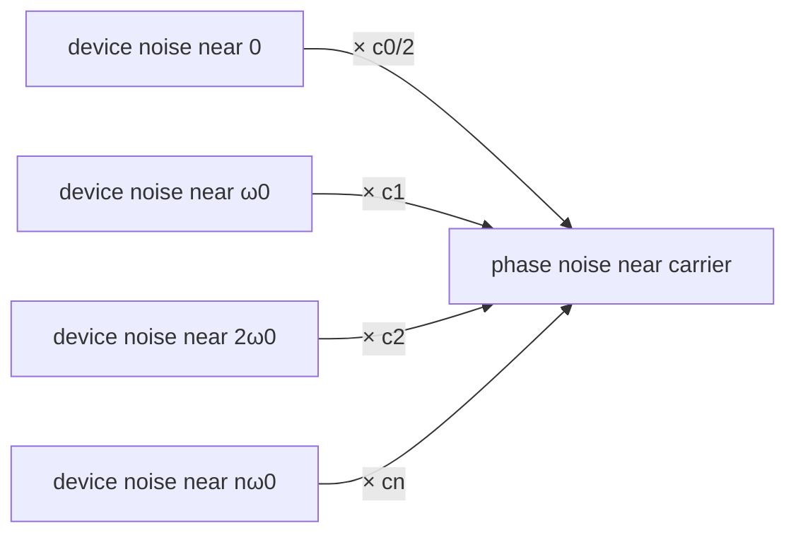

# ISF 的 Fourier series（傅立葉級數）

> **前置閱讀**：[isf_definition](/03_isf_core_theory/isf_definition)（$\Gamma$ 是無因次、$2\pi$ 週期函數）、[impulse_to_phase_shift](/03_isf_core_theory/impulse_to_phase_shift)（$\Gamma$ 的操作型定義）、[convolution_derivation](/03_isf_core_theory/convolution_derivation)（連續 noise 的相位積分式）。
>
> **動手驗證**：本頁的 Fourier 係數萃取、重建與 Parseval 數值驗證見 [lab_05](/04_simulation_labs/lab_05_isf_fourier_coefficients)。

上一章 [impulse_to_phase_shift](/03_isf_core_theory/impulse_to_phase_shift) 推出了 ISF
的操作型定義 $\Delta\phi=\Gamma(\omega_0\tau)\,\Delta q/q_{max}$，並指出 $\Gamma$ 是一個
**無因次、$2\pi$ 週期**的函數。這頁回答下一個關鍵問題：

**既然 $\Gamma$ 是週期函數，把它展成 Fourier series 之後，每一項各自代表什麼物理？**
答案是 ISF 理論最漂亮的一段——它把「振盪器把哪一段頻率的 device noise 搬到 carrier 附近」
講得清清楚楚。核心結果（[P1] Eq.(12), p.183）：

$$
\Gamma(\omega_0\tau)=\frac{c_0}{2}+\sum_{n=1}^{\infty}c_n\cos(n\omega_0\tau+\theta_n)
$$

> **物理直覺（先講結論）**：振盪器是一台**時變的混頻器（mixer）**。它對 noise 的相位敏感度
> $\Gamma$ 隨波形相位週期性變化，等於對 noise 乘上一個以 $\omega_0$ 為基頻的「週期權重」。
> 一個週期函數乘上 noise，數學上就是把 noise 頻譜搬到 $0,\ \omega_0,\ 2\omega_0,\dots$ 各處再疊加。
> 所以**落在每個 $n\omega_0$ 附近的 device noise，都會被第 $n$ 個 Fourier 係數 $c_n$ 加權、
> 然後 down-convert（下轉）到 carrier 附近**變成 phase noise。其中 $c_0$（DC 項）特別重要：
> 它把**接近 DC 的 1/f flicker noise** 直接搬上來，造成 close-in 的 $1/f^3$ phase noise。

## 第 1 步：為什麼 $\Gamma$ 可以展成 Fourier series

$\Gamma(\omega_0\tau)$ 描述「在波形的某個相位踢一下，相位被推多少」。振盪器處於**週期穩態**
（periodic steady state，輸出波形每 $T=1/f_0$ 重複一次），所以「在相位 $x$ 踢」與「在相位
$x+2\pi$ 踢」效果完全一樣。換言之 $\Gamma$ 對自變數 $x\equiv\omega_0\tau$ 是 $2\pi$ 週期：

$$
\Gamma(x+2\pi)=\Gamma(x).
$$

- **用到的數學**：任何 $2\pi$ 週期、在一個週期內平方可積（$\int_0^{2\pi}|\Gamma|^2dx<\infty$）
  的函數都能展成 Fourier series（Dirichlet 條件）。實際 ISF 是連續、分段平滑的，條件輕鬆滿足。
- **物理依據**：週期性來自振盪器的 **limit cycle（極限環）**——穩態下狀態點每週期繞環一圈，
  敏感度只跟「環上的位置（相位）」有關，與「第幾圈」無關。
- **單位檢查**：$x=\omega_0\tau$ 是 $[\text{rad/s}]\cdot[\text{s}]=[\text{rad}]$ ✓，無因次；
  $\Gamma$ 本身無因次，$c_0,c_n$ 也無因次（見 [notation](/00_overview/notation)）。

## 第 2 步：寫出標準 Fourier 展開（cos/sin 形式）

先用最熟悉的 cos/sin 實數 Fourier series 寫一遍，再合併成 [P1] 的 amplitude–phase 形式。
對 $2\pi$ 週期函數：

$$
\Gamma(x)=\frac{a_0}{2}+\sum_{n=1}^{\infty}\big[a_n\cos(nx)+b_n\sin(nx)\big],
$$

係數由一個週期上的內積（投影）取得：

$$
a_0=\frac{1}{\pi}\int_0^{2\pi}\Gamma(x)\,dx,\qquad
a_n=\frac{1}{\pi}\int_0^{2\pi}\Gamma(x)\cos(nx)\,dx,\qquad
b_n=\frac{1}{\pi}\int_0^{2\pi}\Gamma(x)\sin(nx)\,dx.
$$

- **用到的數學**：$\{\cos(nx),\sin(nx)\}$ 在 $[0,2\pi]$ 上正交，
  $\int_0^{2\pi}\cos(mx)\cos(nx)\,dx=\pi\,\delta_{mn}$（$m,n\ge1$），用這個正交性把對應分量「篩」出來。
- **注意 $1/\pi$ 與 DC 的 factor**：$a_0=\frac{1}{\pi}\int_0^{2\pi}\Gamma\,dx$，而 $\Gamma$ 的**平均值
  （DC 值）** 是 $\frac{1}{2\pi}\int_0^{2\pi}\Gamma\,dx=\frac{a_0}{2}$。所以級數第一項寫成
  $\frac{a_0}{2}$ 才等於真正的平均值。這個 $1/2$ 不是隨便加的，後面 $c_0$ 的定義會沿用它。

## 第 3 步：合併成 amplitude–phase 形式，得到 $c_n,\theta_n$

把同頻的 $a_n\cos(nx)+b_n\sin(nx)$ 用三角恆等式合成單一餘弦：

$$
a_n\cos(nx)+b_n\sin(nx)=c_n\cos(nx+\theta_n),
$$

其中

$$
c_n=\sqrt{a_n^2+b_n^2},\qquad \theta_n=\operatorname{atan2}(-b_n,\,a_n).
$$

- **用到的數學**：$c_n\cos(nx+\theta_n)=c_n\cos\theta_n\cos(nx)-c_n\sin\theta_n\sin(nx)$，
  比對係數得 $a_n=c_n\cos\theta_n$、$b_n=-c_n\sin\theta_n$，反解即上式。
- **DC 項對應**：把 $c_0\equiv a_0$（DC 係數），於是常數項 $\frac{a_0}{2}=\frac{c_0}{2}$。
  代入即得 [P1] Eq.(12)：

$$
\boxed{\ \Gamma(\omega_0\tau)=\frac{c_0}{2}+\sum_{n=1}^{\infty}c_n\cos(n\omega_0\tau+\theta_n)\ }\qquad[\text{P1] Eq.(12), p.183}
$$

- **符號陷阱（重要）**：$c_0$ 是傅立葉**係數**，而 ISF 的 DC**值**是 $c_0/2$。這個 factor
  在算 $1/f^3$ corner（Eq.(24)）時最容易出錯，後面章節會反覆提醒。本站 Python 的
  `compute_fourier_coefficients` 回傳的 `a0` 即等於這裡的 $c_0$（見第 8 步）。

## 第 4 步：$c_0$ 的物理意義——DC、控制 $1/f$ upconversion

把 ISF 的 Fourier 展開代回 LTV phase response（[P1] Eq.(11)→Eq.(13), p.183）：

$$
\phi(t)=\frac{1}{q_{max}}\!\left[\frac{c_0}{2}\!\int_{-\infty}^{t}\!i_n\,d\tau+\sum_{n=1}^{\infty}c_n\!\int_{-\infty}^{t}\!i_n\cos(n\omega_0\tau+\theta_n)\,d\tau\right]\qquad[\text{P1] Eq.(13), p.183}
$$

第一項（$c_0$ 那項）對 noise 電流**直接積分**，沒有任何 $\cos(n\omega_0\tau)$ 調變。意思是：

- $c_0$ 項對 noise 電流的 **DC / 極低頻分量**有反應——你慢慢地推節點，相位就慢慢地漂。
- 把一個**靠近 DC 的小單音** $i(t)=I_0\cos(\Delta\omega t)$（$\Delta\omega\ll\omega_0$）代入，
  只有 $c_0$ 項會響應（其他諧波被 $\cos(n\omega_0\tau)$ 平均掉），得到（[P1] Eq.(15), p.183）：

$$
\phi(t)\approx\frac{I_0\,c_0\sin(\Delta\omega t)}{2q_{max}\,\Delta\omega}.
$$

- **為何這叫 "$1/f$ upconversion（上轉）"**：device 的 **flicker / $1/f$ noise** 集中在低頻
  （DC 附近）。$c_0$ 項把這些「住在 baseband 的 noise」搬（up-convert）到 carrier 旁，
  變成 close-in phase noise。後面 [flicker_noise_upconversion](/03_isf_core_theory/flicker_noise_upconversion)
  會用它推出 $1/f^3$ skirt（[P1] Eq.(23),(24)）。
- **設計含義**：$c_0$ 越小，flicker 上轉越弱。$c_0=0$（完美對稱波形）時，理論上 close-in 不再
  有 $1/f^3$ 貢獻。這是「波形對稱性 → close-in phase noise」這條 design rule 的數學根源
  （[P2] Fig. 17, p.802 有實驗佐證）。

## 第 5 步：$c_n$ 的物理意義——把 $n\omega_0$ 附近的 noise frequency-translate 到 carrier

看 Eq.(13) 第二項的第 $n$ 個分量：它把 noise 電流乘上 $\cos(n\omega_0\tau+\theta_n)$ 再積分。
乘上 $\cos(n\omega_0\tau)$ 在頻域就是把 noise 頻譜**搬移 $\pm n\omega_0$**（調變定理）。所以：

- 落在 $n\omega_0+\Delta\omega$（與 $n\omega_0-\Delta\omega$）附近的 device noise，被 $c_n$ 加權後
  **down-convert 到 $\Delta\omega$**，成為 carrier 旁 $\Delta\omega$ 處的 phase noise。
- 把一個靠近 $n\omega_0$ 的小單音 $i(t)=I_0\cos((n\omega_0+\Delta\omega)t)$ 代入 Eq.(13)，
  只有第 $n$ 個諧波響應，得到（[P1] Eq.(16)/(17), p.183）：

$$
\phi(t)\approx\frac{I_0\,c_n\sin(\Delta\omega t)}{2q_{max}\,\Delta\omega}.
$$

#### 明算：用 $\cos A\cos B$ 把 $n\omega_0$ 附近的 noise 搬到 carrier

上面那條是「結果」；現在把**頻率搬移的代數**算給你看，不只講直覺。看 Eq.(13) 第二項的第 $n$ 個分量，
代入單音 $i_n(\tau)=I_0\cos((n\omega_0+\Delta\omega)\tau)$：

$$
\phi_n(t)=\frac{c_n}{q_{max}}\int_{-\infty}^{t}\cos(n\omega_0\tau+\theta_n)\,I_0\cos\big((n\omega_0+\Delta\omega)\tau\big)\,d\tau .
$$

**第 (i) 步：積化和差。** 兩餘弦相乘用恆等式

$$
\cos A\cos B=\tfrac12\big[\cos(A-B)+\cos(A+B)\big],
$$

取 $A=n\omega_0\tau+\theta_n$、$B=(n\omega_0+\Delta\omega)\tau$，算出差頻與和頻：

$$
A-B=\theta_n-\Delta\omega\tau\quad(\text{頻率}\approx\Delta\omega),\qquad A+B=(2n\omega_0+\Delta\omega)\tau+\theta_n\quad(\text{頻率}\approx 2n\omega_0).
$$

被積函數變兩項：

$$
\cos(n\omega_0\tau+\theta_n)\cos\big((n\omega_0+\Delta\omega)\tau\big)=\tfrac12\Big[\cos(\Delta\omega\tau-\theta_n)+\cos\big((2n\omega_0+\Delta\omega)\tau+\theta_n\big)\Big].
$$

這一行就是「頻率搬移」的核心：原本住在 $n\omega_0+\Delta\omega$ 的 noise，被 $\cos(n\omega_0\tau)$ 一乘，
**差頻**塌到了 baseband 的 $\Delta\omega$（搬下來了），**和頻**被推到 $2n\omega_0$（更高，沒用）。

**第 (ii) 步：積分器只放大慢項、平均掉快項。** $\int^t d\tau$ 是低通：

$$
\int^{t}\cos(\Delta\omega\tau-\theta_n)\,d\tau=\frac{\sin(\Delta\omega t-\theta_n)}{\Delta\omega}\ (\text{慢，分母小}\Rightarrow\text{放大存活}),
$$

$$
\int^{t}\cos\big((2n\omega_0+\Delta\omega)\tau+\theta_n\big)\,d\tau=\frac{\sin(\cdots)}{2n\omega_0+\Delta\omega}\ (\text{快，分母}\approx2n\omega_0\Rightarrow\text{壓到可忽略}).
$$

**第 (iii) 步：只留慢項。**

$$
\phi_n(t)\approx\frac{c_n}{q_{max}}\cdot\frac{I_0}{2}\cdot\frac{\sin(\Delta\omega t-\theta_n)}{\Delta\omega}=\frac{I_0\,c_n\sin(\Delta\omega t-\theta_n)}{2q_{max}\,\Delta\omega},
$$

把固定相位 $\theta_n$ 吸進原點即還原 Eq.(16/17)。**結論**：第 $n$ 個傅立葉係數 $c_n$ 真的把 $n\omega_0$ 附近的
noise「乘 $\tfrac12 c_n$、塌到 $\Delta\omega$」——這就是頻率搬移的代數證明，對應下面的 mixer 圖。
（同一段 down-conversion 積分在 [white_noise_to_phase_noise](/03_isf_core_theory/white_noise_to_phase_noise)
還會用來累加成 $1/f^2$ 求和式。）

- **這就是 [P1] Fig. 8（p.183）的圖**：noise 散布在 $0,\omega_0,2\omega_0,\dots$ 各 band，
  ISF 的 $c_0,c_1,c_2,\dots$ 像一組 mixer 增益，把每個 band 的 noise 各自折回 carrier 附近、
  全部疊加成最終的 phase-noise sideband。



- **單位/量綱檢查**：Eq.(15)/(16) 中 $\dfrac{I_0\,c_n}{2q_{max}\,\Delta\omega}$ 的量綱是
  $\dfrac{[\text{A}]\cdot(\text{無因次})}{[\text{C}]\cdot[\text{rad/s}]}
  =\dfrac{[\text{A}]}{[\text{C/s}]\cdot[\text{rad}]}=\dfrac{[\text{A}]}{[\text{A}]}\cdot\dfrac{1}{[\text{rad}]^{-1}}$
  ——化簡後 $\phi$ 是 rad（無因次），$\sin(\Delta\omega t)$ 無因次 ✓。（記住 $C=\text{A}\cdot\text{s}$。）

## 第 6 步：為何 close-in（$1/f^3$）由 $c_0$ 與低階係數主宰

把上面兩步合起來看一張「頻率地圖」：

| device noise 落在哪 | 經哪個係數 | 變成 carrier 旁的什麼 |
|---|---|---|
| DC 附近的 $1/f$ flicker | $c_0/2$ | close-in，斜率 $1/f^3$（極陡） |
| 白噪在 $\omega_0$ 附近 | $c_1$ | $1/f^2$ skirt（$-20$ dB/dec） |
| 白噪在 $2\omega_0,3\omega_0,\dots$ | $c_2,c_3,\dots$ | 也折回，併入 $1/f^2$（用 $\sum c_n^2$ 計） |

- **為何 flicker 透過 $c_0$ 變 $1/f^3$**：flicker 本身已是 $1/f$（功率譜 $\propto1/\Delta\omega$）。
  $c_0$ 項把它原封不動搬到 carrier 旁；再經相位積分器（Eq.(13) 的 $\int d\tau$）多吃一個
  $1/\Delta\omega^2$（積分在頻域是除以 $(j\Delta\omega)$，功率上是 $/\Delta\omega^2$），
  $\dfrac{1}{\Delta\omega}\times\dfrac{1}{\Delta\omega^2}=\dfrac{1}{\Delta\omega^3}$ → $1/f^3$。
- **為何高階 $c_n$ 主要餵 $1/f^2$**：白噪平坦，搬到哪都一樣平，經積分器只多 $1/\Delta\omega^2$ → $1/f^2$。
  所有諧波貢獻用一個數總結就是 $\sum_{n=0}^\infty c_n^2$，這正是下一頁
  [rms_isf](/03_isf_core_theory/rms_isf) 的 Parseval 與 $\Gamma_{rms}$。
- 完整 $1/f^3$ / $1/f^2$ 推導分別見
  [flicker_noise_upconversion](/03_isf_core_theory/flicker_noise_upconversion) 與
  [white_noise_to_phase_noise](/03_isf_core_theory/white_noise_to_phase_noise)。

## 第 7 步：波形對稱性如何讓某些係數歸零

Fourier 係數的奇偶性直接由 $\Gamma(x)$ 的對稱性決定，這給設計師一個「用波形形狀關掉某些上轉」的旋鈕：

| $\Gamma$ 的對稱性 | 數學結果 | 物理後果 |
|---|---|---|
| 偶函數 $\Gamma(-x)=\Gamma(x)$ | 所有 $b_n=0$（純 cos） | $\theta_n\in\{0,\pi\}$，相位簡單 |
| 奇函數 $\Gamma(-x)=-\Gamma(x)$ | 所有 $a_n=0$ 且 $a_0=0$ ⟹ $c_0=0$ | **無 $1/f$ 上轉**（理想 LC 的 $-\sin$ 就是此類） |
| 半波對稱 $\Gamma(x+\pi)=-\Gamma(x)$ | 偶次諧波 $c_2=c_4=\dots=0$ | $2\omega_0$ 附近 noise 不折回 |
| DC 偏移 $\cos\theta+\alpha$（toy `gamma_asymmetric`） | $c_0=2\alpha\neq0$ | 出現 $1/f^3$（close-in 變差） |

- **舉例（理想 LC）**：$\Gamma_{LC}(\theta)=-\sin\theta$ 是奇函數 ⟹ $c_0=0$。所以理想 LC 在
  first-order 下**沒有** flicker 上轉；現實中的不對稱（hard-switching、偏壓不對稱）才把 $c_0$ 撐起來。
- **舉例（半波對稱）**：差動／推挽結構讓上升、下降鏡像對稱 ⟹ $\Gamma(x+\pi)=-\Gamma(x)$ ⟹
  偶次諧波被壓掉，$2\omega_0$ 處的 noise（常含電源紋波、二次諧波失真）不會折回 carrier。
- **註（toy 模型的機制）**：上表 `gamma_asymmetric` 用的是「整條 ISF 加一個 DC 偏移」（$\cos\theta+\alpha$）這種最簡單的方式把 $c_0$ 撐起來；真實電路裡的 **rise/fall 轉態斜率不對稱** 是另一種、且更常見的機制，同樣會讓 $c_0\neq0$、開啟 $1/f$ 上轉，但波形長相不同。本頁的 toy 只是為了把「$c_0$ 旋鈕」隔離出來。
- 這正是下圖要傳達的訊息：對稱波 $c_0=0$、不對稱波 $c_0\neq0$。

## 第 8 步：如何用數值積分算係數（真實函式）

理論之外，給一段「會跑」的程式。本站的 `compute_fourier_coefficients`（Read 自
`simulations/common/isf_utils.py`）就是把第 2 步的積分用梯形法（trapezoidal rule）做掉：

```python
import numpy as np
from simulations.common.isf_utils import (
    gamma_lc_ideal, gamma_asymmetric,
    compute_fourier_coefficients, reconstruct_from_fourier, gamma_rms,
)

# theta 必須「剛好」涵蓋一個週期 [0, 2*pi]（含端點），梯形法才會給對 (1/pi)*∫ 的值
theta = np.linspace(0.0, 2 * np.pi, 4096, endpoint=True)

# 理想 LC ISF：Gamma(theta) = -sin(theta)（奇函數）
gamma = gamma_lc_ideal(theta)

# a0 即 Hajimiri 記號的 c0；a,b 為 cos/sin 係數；c_n = sqrt(a_n^2+b_n^2)
a0, a, b, c, phase = compute_fourier_coefficients(theta, gamma, n_harmonics=8)

print("c0 =", a0)            # -> ~0.0  (奇函數，無 DC，無 1/f 上轉)
print("c1 =", c[1])         # -> ~1.0  (只有基頻分量)
print("c2..c8 =", c[2:])    # -> ~0    (純單頻)

# 反推回波形，驗證 Eq.(12) 的重建
gamma_hat = reconstruct_from_fourier(theta, a0, a, b)
print("max reconstruction error =", np.max(np.abs(gamma_hat - gamma)))  # -> ~1e-15
```

- **梯形法為何夠**：被積函數是平滑週期函數，梯形法對週期函數有**指數收斂**（端點誤差互相抵消），
  幾千點就到機器精度。
- **端點要含 $2\pi$**：函式註解明寫 `theta` 要 span `[0, 2*pi]`（含端點），否則 $\frac{1}{\pi}\int$
  會少算一格。這是數值上最常見的 off-by-one 錯誤來源。
- **不對稱 toy 模型對照**：把 `gamma = gamma_asymmetric(theta, alpha=0.3)`（即 $\cos\theta+0.3$）
  代進去，會得到 $c_0\approx2\alpha=0.6$、$c_1\approx1$、其餘 $\approx0$——印證 $\alpha$ 就是
  「把 DC 撐起來、開啟 $1/f$ 上轉」的旋鈕（這是 pedagogical toy model，**非 transistor-level**）。

## 圖一：諧波越多，重建越逼近原 ISF

下圖（`lab_05` 的 `fig_reconstruction`）用一個帶多諧波的 toy ISF
（$\Gamma(\theta)=-\sin\theta+0.35\sin2\theta+0.18\cos3\theta+0.25$），分別取 $N=1,2,4$ 項重建，
展示 Eq.(12) 的部分和如何逐步收斂到原波形。


- **對應公式**：[P1] Eq.(12)（部分和 $\Gamma_N=\frac{c_0}{2}+\sum_{n=1}^{N}c_n\cos(n\omega_0\tau+\theta_n)$）。
- **怎麼解讀**：$N=1$ 只抓基頻、誤差最大；加到 $N=4$ 已幾乎重合。實務上 ISF 的能量集中在低階諧波，
  少數幾項就足以準確算 phase noise。
- **toy model 註記**：此 ISF 是教學用合成波形，**非 transistor-level**萃取結果。
- 完整 script：`simulations/lab_05_fourier_isf.py`。

## 圖二：係數頻譜 $c_n$（並驗證 Parseval）

下圖（`lab_05` 的 `fig_coefficients`，`n_harmonics=8`）把 $c_n$ 畫成 bar chart（係數頻譜），
並標出 Parseval 檢查 $\sum_{n=0}^{\infty}c_n^2=2\Gamma_{rms}^2$（[P1] Eq.(20)，下一頁詳推）。


- **對應公式**：[P1] Eq.(12) 的 $c_n$；[P1] Eq.(20) 的 $\sum c_n^2=2\Gamma_{rms}^2$。
- **怎麼解讀**：bar 的高度就是各諧波對 phase noise 的「權重」。$c_0$ 那根 bar 特別關鍵——
  它一旦非零，close-in $1/f^3$ 就出現。低階 bar 主宰，高階迅速衰減。
- 詳細的 Parseval 推導與 $\Gamma_{rms}$ 在 [rms_isf](/03_isf_core_theory/rms_isf)。

## 圖三：對稱 vs 不對稱波形的 $c_0$

下圖（`lab_05` 的 `fig_symmetric_vs_asymmetric`）對比兩個 toy ISF：對稱的
$\Gamma=\cos\theta$（$c_0=0$）與不對稱的 $\Gamma=\cos\theta+0.4$（$c_0=0.8$），凸顯**只有 $c_0\neq0$
才會把 $1/f$ noise 上轉**。


- **對應公式**：$c_0$（[P1] Eq.(12)）；其後果 [P1] Eq.(24) 的 $1/f^3$ corner。
- **怎麼解讀**：左邊對稱波平均值為 0、DC bar 不見了 → 無 $1/f^3$；右邊整條曲線被抬高、
  DC bar 跳出來 → close-in noise 變差。設計上「把波形做對稱」就是「把這根 DC bar 壓平」。
- **toy model 註記**：`gamma_symmetric`/`gamma_asymmetric` 是 pedagogical toy ISF，
  **非 transistor-level**（見 `isf_utils.py` docstring）。
- 設計面延伸：[symmetry](/06_design_insights/symmetry)。

## 數值例子（建立手感）

> 取理想 LC 的 $\Gamma(\theta)=-\sin\theta$，手算前幾個係數。

把 $-\sin x$ 看成 $\sin x$ 的 Fourier 展開：$-\sin x=c_1\cos(x+\theta_1)$，其中
$\cos(x+\theta_1)=\cos x\cos\theta_1-\sin x\sin\theta_1$，要等於 $-\sin x$ 需
$\theta_1=\pi/2$（則 $\cos(x+\pi/2)=-\sin x$），故 $c_1=1$、$\theta_1=\pi/2$。

- $c_0=\dfrac{1}{\pi}\displaystyle\int_0^{2\pi}(-\sin x)\,dx=0$（奇函數，DC 為零）。
- $c_1=1$，$c_n=0$（$n\ge2$）。
- **手感**：理想 LC 的 ISF 是「乾淨的單一基頻」——全部能量在 $c_1$。所以它把 noise 主要從
  $\omega_0$ 附近折回（$1/f^2$），而因 $c_0=0$，理想情況下沒有 $1/f^3$。下一頁會看到
  $\sum c_n^2=c_1^2=1=2\Gamma_{rms}^2$ ⟹ $\Gamma_{rms}=1/\sqrt{2}\approx0.707$。

## Worked examples 數值例題

兩題用嚴格格式：**題目 → 逐步代入（帶單位）→ 結果 → dimension check → 一行 Python 驗證**。
第一題手算 $c_0,c_1,c_2$ 再用 `compute_fourier_coefficients` 對照；第二題算某諧波對 phase noise 的貢獻。

> **例 1（手算前幾個 $c_n$ 再用程式對照）**：給定 toy ISF
> $\Gamma(\theta)=0.25-\sin\theta+0.35\sin2\theta+0.18\cos3\theta$（即 lab_05 重建圖用的合成波形），
> 手算 $c_0,c_1,c_2,c_3$。

**逐步算（直接讀係數，不必積分）：** 把 $\Gamma$ 與標準展開 $\Gamma=\dfrac{a_0}{2}+\sum_n[a_n\cos n\theta+b_n\sin n\theta]$ 逐項比對：

1. **DC**：$\Gamma$ 的常數項是 $0.25$，即平均值 $=0.25$。因 DC **值** $=a_0/2$，得 $a_0=0.5$，故 $c_0=a_0=0.5$。
2. **基頻 $n=1$**：$\Gamma$ 含 $-\sin\theta$，無 $\cos\theta$。對比得 $a_1=0$、$b_1=-1$。
   故 $c_1=\sqrt{a_1^2+b_1^2}=\sqrt{0+1}=1$，$\theta_1=\operatorname{atan2}(-b_1,a_1)=\operatorname{atan2}(1,0)=\pi/2$。
3. **二次 $n=2$**：含 $0.35\sin2\theta$，無 $\cos2\theta$。得 $a_2=0$、$b_2=0.35$，故 $c_2=0.35$。
4. **三次 $n=3$**：含 $0.18\cos3\theta$，無 $\sin3\theta$。得 $a_3=0.18$、$b_3=0$，故 $c_3=0.18$。

**結果：** $c_0=0.5,\ c_1=1,\ c_2=0.35,\ c_3=0.18$（其餘 $\approx0$）。

**Dimension check：** $\Gamma$ 無因次（[notation](/00_overview/notation)），每個 $c_n$ 都是它的傅立葉幅度，
同樣無因次；$\theta_n$ 是 rad（相位）✓。

**Parseval 對照（順手驗）：** 嚴格關係（含 DC factor）是 $\dfrac{c_0^2}{2}+\sum_{n\ge1}c_n^2=2\Gamma_{rms}^2$。
代入：$\dfrac{0.5^2}{2}+(1^2+0.35^2+0.18^2)=0.125+1.1549=1.2799$，故 $\Gamma_{rms}=\sqrt{1.2799/2}=0.800$。
（注意：[P1] Eq.(20) 寫成 $\sum_{n=0}^\infty c_n^2=2\Gamma_{rms}^2$ 是用「DC 不額外帶 $1/2$」的慣例；
對 $c_0=0$ 的對稱 ISF 兩寫法一致，$c_0\neq0$ 時要記得 DC 項的 factor，見 [rms_isf](/03_isf_core_theory/rms_isf)。）

```python
import numpy as np
from simulations.common.isf_utils import compute_fourier_coefficients, gamma_rms

theta = np.linspace(0.0, 2*np.pi, 4096, endpoint=True)
gamma = 0.25 - np.sin(theta) + 0.35*np.sin(2*theta) + 0.18*np.cos(3*theta)
a0, a, b, c, phase = compute_fourier_coefficients(theta, gamma, n_harmonics=4)
print("c0,c1,c2,c3 =", round(a0,3), round(c[1],3), round(c[2],3), round(c[3],3))
# -> c0,c1,c2,c3 = 0.5 1.0 0.35 0.18
print("Gamma_rms =", round(gamma_rms(theta, gamma),3))   # -> 0.8
```

> **例 2（某諧波對 phase noise 的貢獻）**：用例 1 的 ISF，一個幅度 $I_0=1\ \mu\text{A}$ 的小單音
> 注在 $2\omega_0+\Delta\omega$（即靠近**二次諧波**）。取 $q_{max}=1$ pC、$\Delta f=1$ MHz（$\Delta\omega=2\pi\times10^6$ rad/s）。
> 問此 noise 經 $c_2$ down-convert 後，在 carrier 旁 $\Delta\omega$ 處造成多少相位調制幅度與單邊帶相對功率。

**逐步代入：**

1. 只有第 $2$ 諧波 $c_2=0.35$ 響應（第 5 步明算：$2\omega_0$ 附近的 noise 被 $c_2$ 搬到 $\Delta\omega$）。
2. 相位調制幅度（由 Eq.(16/17)，把 $c_n\to c_2$）：

$$
\phi_p=\frac{I_0\,c_2}{2q_{max}\,\Delta\omega}=\frac{(10^{-6}\,\text{A})\times0.35}{2\times(10^{-12}\,\text{C})\times(6.283\times10^{6}\,\text{rad/s})}.
$$

3. 分母 $=2\times10^{-12}\times6.283\times10^{6}=1.257\times10^{-5}\ \text{C}\cdot\text{rad/s}$；
   分子 $=3.5\times10^{-7}\ \text{A}$。相除 $\phi_p=2.785\times10^{-2}\ \text{rad}$。
4. 單邊帶相對功率（[P1] Eq.(18)，$\left(\dfrac{I_0c_2}{4q_{max}\Delta\omega}\right)^2=(\phi_p/2)^2$）：

$$
P_{SBC}=\left(\frac{\phi_p}{2}\right)^2=\left(\frac{2.785\times10^{-2}}{2}\right)^2=1.939\times10^{-4}.
$$

**結果：** $\phi_p\approx27.9$ mrad，$P_{SBC}\approx1.94\times10^{-4}=10\log_{10}\to-37.1$ dBc。

**Dimension check：** $\phi_p$：$\dfrac{\text{A}}{\text{C}\cdot(\text{rad/s})}=\dfrac{\text{A}}{(\text{A}\cdot\text{s})\cdot\text{s}^{-1}\cdot\text{rad}}=\dfrac{\text{A}}{\text{A}\cdot\text{rad}}=\text{rad}^{-1}$...
化簡時 $\Delta\omega$ 的 rad 在分母，故 $\phi_p$ 帶 rad（$C=\text{A}\cdot\text{s}$、rad/s 的 s 與 C 的 s 相消）→ rad ✓。
$P_{SBC}=(\text{rad}/\text{rad})^2$ 無因次 ✓（功率比）。

```python
import numpy as np
I0, c2, qmax, dw = 1e-6, 0.35, 1e-12, 2*np.pi*1e6
phi_p = I0*c2/(2*qmax*dw)
P_sb  = (I0*c2/(4*qmax*dw))**2
print(round(phi_p*1e3,1), "mrad ;", round(10*np.log10(P_sb),1), "dBc")
# -> 27.9 mrad ; -37.1 dBc
```

- **手感**：同樣一根 $1\ \mu\text{A}$ 單音，若改注在基頻附近（用 $c_1=1$ 而非 $c_2=0.35$），$\phi_p$ 會大 $1/0.35\approx2.86$ 倍、
  功率大 $(1/0.35)^2\approx8.2$ 倍（$+9.1$ dB）。這就是「$c_n$ 像 mixer 增益」的數值臉孔：**係數越大的諧波，把該 band 的 noise 折回得越兇。**

（完整函式庫：`simulations/common/isf_utils.py`。）

## 適用與失效條件

| 條件 | 成立時 | 失效時會怎樣 |
|---|---|---|
| 振盪器處週期穩態 | $\Gamma$ 嚴格 $2\pi$ 週期，可展 Fourier | 啟動暫態／受 injection 拉動時 $\Gamma$ 非純週期 |
| noise 為小擾動 | Eq.(13) 線性疊加成立 | 大注入 → 諧波交互作用，單一 $c_n$ 圖像失效 |
| device noise 為 stationary | 單純按 band 分配 | cyclostationary 要改用 $\Gamma_{eff}=\Gamma\cdot\alpha$（見 [effective_isf](/03_isf_core_theory/effective_isf)） |
| $\Gamma$ 已正確萃取 | 係數可信 | 需 transient / adjoint 模擬取得 $\Gamma$ |

## 重點回顧

- $\Gamma$ 是 $2\pi$ 週期函數，可展成 $\Gamma=\dfrac{c_0}{2}+\sum_{n\ge1}c_n\cos(n\omega_0\tau+\theta_n)$（[P1] Eq.(12), p.183）。
- 振盪器像時變 mixer：第 $n$ 個係數 $c_n$ 把 $n\omega_0$ 附近的 device noise **down-convert** 到 carrier（[P1] Eq.(16), Fig. 8）。
- $c_0$（DC 係數，DC **值**$=c_0/2$）把 baseband 的 flicker noise 上轉成 close-in $1/f^3$（[P1] Eq.(15),(23),(24)）。
- 波形對稱性決定係數的奇偶：奇函數 ⟹ $c_0=0$（無 $1/f$ 上轉）；半波對稱 ⟹ 偶次諧波歸零。
- 理想 LC：$c_0=0,\ c_1=1$，其餘為 0；$\Gamma_{rms}=1/\sqrt2\approx0.707$。
- 數值上用 `compute_fourier_coefficients`（梯形法、`theta` 含 $0$ 到 $2\pi$ 端點）即可算係數。

## 延伸閱讀

- 操作型 ISF 定義（前一步）：[impulse_to_phase_shift](/03_isf_core_theory/impulse_to_phase_shift)
- Parseval 與 rms ISF（下一步）：[rms_isf](/03_isf_core_theory/rms_isf)
- $c_n$ 如何餵 $1/f^2$：[white_noise_to_phase_noise](/03_isf_core_theory/white_noise_to_phase_noise)
- $c_0$ 如何餵 $1/f^3$：[flicker_noise_upconversion](/03_isf_core_theory/flicker_noise_upconversion)
- 對稱性的設計後果：[symmetry](/06_design_insights/symmetry)
- 數值手感速查：[numerical_feeling](/04_simulation_labs/numerical_feeling)
