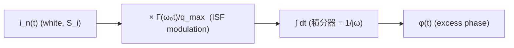

# 白噪如何變成 1/f² phase noise

> **前置閱讀**：[fourier_series_of_isf](/03_isf_core_theory/fourier_series_of_isf)（$c_n$ 把 $n\omega_0$ 附近 noise 折回 carrier）、[rms_isf](/03_isf_core_theory/rms_isf)（$\sum c_n^2=2\Gamma_{rms}^2$）、[convolution_derivation](/03_isf_core_theory/convolution_derivation)（相位積分式）、[stochastic_noise_basics](/02_foundations/stochastic_noise_basics)（白噪 PSD / Parseval）。
>
> **動手驗證**：本頁「白噪 → $1/f^2$ phase noise」的時域模擬與理論吻合見 [lab_06](/04_simulation_labs/lab_06_white_noise_phase_noise)。

這頁回答振盪器 phase noise 理論裡**最招牌**的一個結果：一個**頻率平坦的白色電流雜訊**
（white current noise，功率譜密度與頻率無關的隨機電流），經過振盪器之後，為什麼會變成
一條**斜率 $-20$ dB/decade（即 $1/f^2$）的相位雜訊裙邊**？我們要一路推到

$$
\mathcal{L}\{\Delta\omega\}=10\log_{10}\!\left(\frac{\Gamma_{rms}^2}{q_{max}^2}\cdot\frac{\overline{i_n^2}/\Delta f}{4\,\Delta\omega^2}\right)
$$

並且老實交代文獻上著名的「差 2 倍」記帳問題。

> **物理直覺（先講結論）**：white noise 本身是「平的」，沒有任何 $1/f$ 的結構。
> 但上一章 [convolution_derivation](/03_isf_core_theory/convolution_derivation) 告訴我們：相位 $\phi(t)$
> 是 noise 電流**對時間的積分**（[P1] Eq.(11)）。**積分器就是一個 $1/(j\omega)$ 的濾波器**，
> 它把功率譜乘上 $1/\omega^2$。白的東西進去、被乘 $1/\omega^2$ 出來——這就是 $1/f^2$ 的來源。
> ISF 只負責決定「乘多大的權重」（由 $\Gamma_{rms}$ 與 $q_{max}$ 設定），不負責決定斜率；
> **斜率永遠是積分器給的**。

## 先複習：相位是 noise 的積分

從 [P1] Eq.(11), p.182 的 LTV 相位響應出發：

$$
\phi(t)=\frac{1}{q_{max}}\int_{-\infty}^{t}\Gamma(\omega_0\tau)\,i_n(\tau)\,d\tau .
$$

把它讀成一個訊號流：noise 電流 $i_n(t)$ 先被**週期權重** $\Gamma(\omega_0 t)/q_{max}$ 調制
（modulation，逐點相乘），再被**積分**（記憶上限 $t$）。畫成 block diagram：



要做的事就是：把這條鏈路的**功率譜**追過去——輸入是 $S_i$，輸出 $S_\phi$ 是多少。

## 第 1 步：white current noise 的 PSD 是什麼

白噪的定義就是 PSD 與頻率無關（flat）。我們用單邊 PSD 記為

$$
S_i(f)=\frac{\overline{i_n^2}}{\Delta f}\quad[\text{A}^2/\text{Hz}].
$$

- **用到的物理**：thermal noise（熱雜訊）與 shot noise（散粒雜訊）在我們關心的 offset 頻段
  （kHz–MHz）內都可視為白色——它們的轉折頻率在很高的地方。
- **單位檢查**：$[\text{A}^2/\text{Hz}]$，乘上頻寬 $\Delta f$（Hz）得 $[\text{A}^2]$=均方電流 ✓。
- **數量級手感**：一個導通電阻 $R$ 的熱雜訊電流 $\overline{i_n^2}/\Delta f=4kT/R$；在 $R=1\,\text{k}\Omega$、
  室溫下約 $1.6\times10^{-23}\,\text{A}^2/\text{Hz}$。本頁的 canonical 例 B 取 $S_i=10^{-24}\,\text{A}^2/\text{Hz}$
  作為「單一等效白噪源」的整數值，方便口算。

## 第 2 步：ISF modulation——白噪被週期權重「攪拌」

把 $\Gamma(\omega_0\tau)$ 用傅立葉級數展開（[P1] Eq.(12), p.183）：

$$
\Gamma(\omega_0\tau)=\frac{c_0}{2}+\sum_{n=1}^{\infty}c_n\cos(n\omega_0\tau+\theta_n).
$$

乘上白噪 $i_n(\tau)$ 等於把 noise 分別搬到各諧波 $n\omega_0$ 附近再「下變頻」回 baseband
（這就是 [fourier_series_of_isf](/03_isf_core_theory/fourier_series_of_isf) 講的 frequency translation）。
關鍵在於：對**白噪**而言，每個諧波 $n\omega_0$ 附近的 noise 功率都一樣大（因為平的），
所以每一條 $c_n$ 都把**同樣強度**的白噪搬下來。各諧波**不相關**（不同頻段的白噪互相獨立），
功率可以直接相加，總權重就是 $\sum_n c_n^2$。

- **用到的數學**：白噪不同頻段不相關 → 各諧波貢獻的功率**疊加**（不是振幅疊加）。
- **單位檢查**：$c_n$ 無因次，$\sum c_n^2$ 無因次 ✓。

## 第 3 步：從單音 sideband 累加到白噪求和式（Eq.(19)）

[P1] 的策略很聰明：先算「一個小電流單音」造成多少 sideband，再把白噪當成無數獨立小單音疊加。
對近 $n\omega_0$ 注入的單音 $i(t)=I_0\cos(n\omega_0+\Delta\omega)t$，excess phase 是慢調制
（[P1] Eq.(16/17), p.183）：

$$
\phi(t)\approx\frac{I_0\,c_n\sin(\Delta\omega t)}{2q_{max}\,\Delta\omega}.
$$

它造成的單邊帶相對功率（[P1] Eq.(18), p.183）：

$$
P_{SBC}(\Delta\omega)=10\log_{10}\!\left(\frac{I_0\,c_n}{4q_{max}\,\Delta\omega}\right)^2.
$$

### 第 3a 步（明算）：down-conversion 積分——慢項存活、快項被平均掉

上面那條 Eq.(16/17) 不是憑空跳出來的；它是「把 $n\omega_0$ 附近的 noise 下變頻（down-convert，
降頻搬移）到 baseband」這件事的代數結果。我們把它**逐步算給你看**，這正是規範 10.2 要求補的中間步驟。

把近 $n\omega_0$ 注入單音 $i(\tau)=I_0\cos((n\omega_0+\Delta\omega)\tau)$ 代進 [P1] Eq.(13) 的第 $n$ 個諧波項。
那一項要算的積分是「ISF 第 $n$ 諧波權重」乘上「注入電流」再積分：

$$
\phi_n(t)=\frac{1}{q_{max}}\int^{t}\!\!c_n\cos(n\omega_0\tau+\theta_n)\,I_0\cos\big((n\omega_0+\Delta\omega)\tau\big)\,d\tau .
$$

**第 (i) 步：用積化和差把兩個餘弦的乘積拆成「和」與「差」兩個餘弦。** 恆等式

$$
\cos A\cos B=\tfrac12\big[\cos(A-B)+\cos(A+B)\big]
$$

令 $A=n\omega_0\tau+\theta_n$、$B=(n\omega_0+\Delta\omega)\tau$。算差與和的頻率：

$$
A-B=(n\omega_0\tau+\theta_n)-(n\omega_0+\Delta\omega)\tau=\theta_n-\Delta\omega\tau,
$$

$$
A+B=(n\omega_0\tau+\theta_n)+(n\omega_0+\Delta\omega)\tau=(2n\omega_0+\Delta\omega)\tau+\theta_n .
$$

所以被積函數變成

$$
c_n\cos(n\omega_0\tau+\theta_n)\,I_0\cos\big((n\omega_0+\Delta\omega)\tau\big)=\frac{I_0c_n}{2}\Big[\underbrace{\cos(\Delta\omega\tau-\theta_n)}_{\text{慢項，}\approx\Delta\omega}+\underbrace{\cos\big((2n\omega_0+\Delta\omega)\tau+\theta_n\big)}_{\text{快項，}\approx 2n\omega_0}\Big].
$$

（用了 $\cos(\theta_n-\Delta\omega\tau)=\cos(\Delta\omega\tau-\theta_n)$，餘弦是偶函數。）

**第 (ii) 步：兩項的命運完全不同。** 積分器（那個 $\int^t d\tau$）本質是個**低通**——它對訊號做時間累加，
對高頻分量會「正負相消、平均掉」，對低頻（慢）分量則持續累積。

- **慢項** 頻率約 $\Delta\omega$（offset，通常 kHz–MHz，$\Delta\omega\ll\omega_0$）。積分一個慢餘弦得到
  $\int\cos(\Delta\omega\tau-\theta_n)\,d\tau=\dfrac{\sin(\Delta\omega\tau-\theta_n)}{\Delta\omega}$——分母只有一個小小的 $\Delta\omega$，
  **被放大、存活下來**。
- **快項** 頻率約 $2n\omega_0$（兩倍載波等級，GHz）。同樣積分得 $\dfrac{\sin(\cdots)}{2n\omega_0+\Delta\omega}$——
  分母是巨大的 $2n\omega_0$，幅度被壓到 $\sim\Delta\omega/(2n\omega_0)$ 倍那麼小，相對慢項可忽略，等效上**被積分器平均掉**。

**第 (iii) 步：只留慢項，得到 Eq.(16/17)。**

$$
\phi_n(t)\approx\frac{1}{q_{max}}\cdot\frac{I_0c_n}{2}\cdot\frac{\sin(\Delta\omega t-\theta_n)}{\Delta\omega}=\frac{I_0\,c_n\sin(\Delta\omega t-\theta_n)}{2q_{max}\,\Delta\omega}
$$

把與時間無關的相位 $\theta_n$ 吸收進原點，即還原成上面 [P1] Eq.(16/17) 的 $\phi(t)\approx\dfrac{I_0 c_n\sin(\Delta\omega t)}{2q_{max}\Delta\omega}$。
這條 down-conversion 積分（規範 10.2）就是「振盪器當 mixer」的硬核：**$n\omega_0$ 附近的 noise 被 ISF 第 $n$ 諧波
搬到 $\Delta\omega$ 處（差頻慢項存活），而和頻 $2n\omega_0$ 的快項自動消失。**

- **單位檢查**：$\dfrac{[\text{A}]\cdot(\text{無因次})}{[\text{C}]\cdot[\text{rad/s}]}=\dfrac{\text{A}}{\text{A}\cdot\text{s}}\cdot\text{s}\cdot\text{rad}^{-1}$——
  $C=\text{A}\cdot\text{s}$、$\Delta\omega$ 是 rad/s，化簡後 $\phi$ 無因次（rad）✓。

### 第 3b 步（明算）：factor-8 求和 (18)→(19)

接著把「單音 sideband 功率」累加成「白噪求和式」。這一步藏了三件事：**雙 sideband**、
**$I_0^2/2\to\overline{i_n^2}/\Delta f$ 的白噪代換**、以及**對 $n$ 求和**。逐步攤開：

**第 (i) 步：單邊帶相對功率的 linear 值。** 把 Eq.(18) 括號內的東西平方（先不取 $10\log$）：

$$
\left(\frac{I_0\,c_n}{4q_{max}\,\Delta\omega}\right)^2=\frac{I_0^2\,c_n^2}{16\,q_{max}^2\,\Delta\omega^2}.
$$

（這裡的 $4$ 來自 Eq.(16) 的 $2q_{max}\Delta\omega$ 再開單邊帶——慢調制 $\sin(\Delta\omega t)$ 的功率對應幅度的 $\tfrac12$，
$\tfrac12\times\tfrac1{2}=\tfrac14$，所以分母從 $2$ 變 $4$；故 $4^2=16$。）

**第 (ii) 步：白噪代換 $I_0^2/2\to\overline{i_n^2}/\Delta f$。** 一個幅度 $I_0$ 的單音，其均方（功率）是 $I_0^2/2$
（正弦 rms² $=$ 幅度²$/2$）。把白噪看成「在頻寬 $\Delta f$ 內、每個 $n\omega_0$ 附近的一根等效小單音」，
它的功率就是 PSD 乘頻寬 $=(\overline{i_n^2}/\Delta f)$。令兩者相等：

$$
\frac{I_0^2}{2}\;\to\;\frac{\overline{i_n^2}}{\Delta f}\qquad\Longrightarrow\qquad I_0^2\;\to\;2\,\frac{\overline{i_n^2}}{\Delta f}.
$$

注意這裡多出來的就是那個 **factor 2**：把「峰值幅度」換成「功率」要帶 $\tfrac12$，反過來代換就帶 $2$。
代入第 (i) 步：

$$
\frac{I_0^2\,c_n^2}{16\,q_{max}^2\,\Delta\omega^2}\;\to\;\frac{2(\overline{i_n^2}/\Delta f)\,c_n^2}{16\,q_{max}^2\,\Delta\omega^2}.
$$

**第 (iii) 步：雙 sideband + 對 $n$ 求和。** 每個諧波 $n\omega_0$ 在 carrier 兩側各折回一條 sideband
（$n\omega_0+\Delta\omega$ 與 $n\omega_0-\Delta\omega$ 都 down-convert 到 $\Delta\omega$），上述功率本就含這兩份；
再把所有諧波 $n=0,1,2,\dots$（各 band 不相關，功率直接相加）求和：

$$
\mathcal{L}=\sum_n\frac{2(\overline{i_n^2}/\Delta f)\,c_n^2}{16\,q_{max}^2\,\Delta\omega^2}=\frac{(\overline{i_n^2}/\Delta f)\sum_n c_n^2}{8\,q_{max}^2\,\Delta\omega^2}.
$$

**第 (iv) 步：約分得 factor-8。** 分子 $2$、分母 $16$，約掉得 $8$——這就是 Eq.(19) 分母那個著名的 $8$ 的來歷：

$$
8=\frac{16}{2}=\frac{(\text{Eq.18 平方的 }4^2)}{(\text{白噪代換帶來的 }2)} .
$$

把白噪當成在每個 $n\omega_0$ 附近、頻寬 $\Delta f$ 的無數獨立單音，令 $I_0^2/2\to\overline{i_n^2}/\Delta f$，
對所有諧波 $n=0,1,2,\dots$ 求和，得到 **white-noise phase noise 求和式**（[P1] Eq.(19), p.185）：

$$
\mathcal{L}\{\Delta\omega\}=10\log_{10}\!\left(\frac{\overline{i_n^2}/\Delta f\;\sum_{n=0}^{\infty}c_n^2}{8\,q_{max}^2\,\Delta\omega^2}\right)
$$

- **看出 $1/f^2$ 了嗎**：分母有 $\Delta\omega^2$。每升一個 decade（$\Delta\omega\times10$），括號內
  掉 $100$ 倍 $\Rightarrow$ $10\log_{10}(100)=20$ dB。所以斜率是 $-20$ dB/decade，正是 $1/f^2$。
  **這個 $\Delta\omega^2$ 完全來自積分器**（第 2 步那條 $\int dt$）。
- **單位檢查（括號內要無因次，因為要取 log）**：
  $\dfrac{[\text{A}^2/\text{Hz}]\cdot(\text{無因次})}{[\text{C}^2]\cdot[\text{rad/s}]^2}$。
  $\text{C}=\text{A}\cdot\text{s}$ 故 $\text{C}^2=\text{A}^2\text{s}^2$；而 $\text{Hz}=1/\text{s}$、$(\text{rad/s})^2=1/\text{s}^2$。
  分子 $\text{A}^2/\text{Hz}=\text{A}^2\cdot\text{s}$，分母 $\text{A}^2\text{s}^2\cdot\text{s}^{-2}=\text{A}^2$。
  比值 $=\text{s}$。嚴格說它帶 $1/\text{Hz}$ 的因次（這就是 dBc/**Hz** 的那個 per-Hz），取 $10\log_{10}$
  後讀作 dBc/Hz ✓。

## 第 4 步：用 Parseval 把求和換成 $\Gamma_{rms}$（Eq.(20)）

$\sum c_n^2$ 不好量，但它等於 ISF 的「總能量」。Parseval 關係（[P1] Eq.(20), p.185）：

$$
\sum_{n=0}^{\infty}c_n^2=\frac{1}{\pi}\int_0^{2\pi}|\Gamma(x)|^2dx=2\,\Gamma_{rms}^2.
$$

- **用到的數學**：傅立葉係數平方和 = 函數的均方（Parseval/Rayleigh），詳見
  [rms_isf](/03_isf_core_theory/rms_isf)。注意右邊是 $2\Gamma_{rms}^2$（不是 $\Gamma_{rms}^2$），
  因為 $\Gamma_{rms}^2=\frac{1}{2\pi}\int_0^{2\pi}|\Gamma|^2dx$，差一個 $2$。
- **物理意義**：不必知道每個 $c_n$，只要知道 ISF 的 **rms 值**就能算白噪 phase noise。

## 第 5 步：代入，得到招牌 1/f² 結果（Eq.(21)）

把 $\sum c_n^2=2\Gamma_{rms}^2$ 代回 Eq.(19)，分母的 $8$ 約掉一半變成 $4$：

$$
\frac{\overline{i_n^2}/\Delta f\cdot 2\Gamma_{rms}^2}{8\,q_{max}^2\,\Delta\omega^2}=\frac{\Gamma_{rms}^2}{q_{max}^2}\cdot\frac{\overline{i_n^2}/\Delta f}{4\,\Delta\omega^2}.
$$

得到 **white-noise 1/f² 結果**（[P1] Eq.(21), p.185）：

$$
\boxed{\ \mathcal{L}\{\Delta\omega\}=10\log_{10}\!\left(\frac{\Gamma_{rms}^2}{q_{max}^2}\cdot\frac{\overline{i_n^2}/\Delta f}{4\,\Delta\omega^2}\right)\ }
$$

- **設計訊息（claim C3）**：phase noise 正比於 $\Gamma_{rms}^2/q_{max}^2$。要降低 $1/f^2$ 雜訊，
  就**加大訊號電荷擺幅 $q_{max}$**（分母平方，效果很強）、並**壓低 ISF 的 rms 值 $\Gamma_{rms}$**。
  這兩個是所有低相位雜訊振盪器設計的根本旋鈕。
- **dimension check 同第 3 步**：$\Gamma_{rms}^2/q_{max}^2$ 帶 $1/\text{C}^2$，乘上 $S_i/\Delta\omega^2$
  的 $\text{A}^2\text{s}/\text{s}^{-2}=\text{A}^2\text{s}^3=\text{C}^2\text{s}$ ✓ 約成 $\text{s}$ → per-Hz。

## 嚴格頻譜推導（cyclostationary 自相關 → Wiener-Khinchin）

前面第 3 步那套「把白噪當成無數獨立小單音、算每根的 sideband 再求和」是 [P1] 的原始路線，
物理直覺很強、但代數上是**啟發式（heuristic）**的：它在「白噪 $=$ 單音疊加」「factor-8 記帳」
那幾步用了手算的功率簿記。這一節把同一個結果用**訊號與系統的嚴格機器**重做一遍——
直接寫下 LTV 輸出相位的**時間平均自相關（time-averaged autocorrelation）**，用 ISF 的傅立葉
係數展開，讓 $\sum c_n^2=2\Gamma_{rms}^2$ **自己從自相關裡掉出來**，再用 **Wiener-Khinchin 定理**
取頻譜。讀者若熟悉「LTI 系統 $S_y=|H|^2S_x$」，這節會把它升級成「**LTV / cyclostationary**」版本。

> **為什麼要做這節**：振盪器是**週期時變（periodically time-varying）**系統，它的輸出不是嚴格
> 平穩（stationary）而是 **cyclostationary（週期穩態，統計量以週期 $T$ 重複）**。對 cyclostationary
> 過程，正確的譜分析要先對**絕對時間 $t$ 做一個週期平均**，把它「平穩化」，再做 Wiener-Khinchin。
> 這一節就是老實走完這條路；走完你會看到 $\Gamma_{rms}$ 不是被「湊」出來的，而是自相關的週期平均
> 的**必然產物**。

### 第 A 步：寫下相位的雙時間自相關（two-time autocorrelation）

從 [P1] Eq.(11) 的相位積分出發，定義 $g(\tau)\equiv\Gamma(\omega_0\tau)/q_{max}$（把 ISF 與
normalization 併成一個權重核），則 $\phi(t)=\int_{-\infty}^{t}g(\tau)\,i_n(\tau)\,d\tau$。
但為了乾淨看出頻譜，我們改看**相位的時間導數** $\dot\phi$（瞬時頻率擾動），它的自相關更直接
（相位本身是非平穩漫步，見 [lorentzian_linewidth](/03_isf_core_theory/lorentzian_linewidth)；
$\dot\phi$ 才是 cyclostationary-平穩的）。由微積分基本定理：

$$
\dot\phi(t)=g(t)\,i_n(t)=\frac{\Gamma(\omega_0 t)}{q_{max}}\,i_n(t).
$$

這是一個**乘法型 LTV**：輸入白噪 $i_n(t)$ 被一個**確定的週期權重** $g(t)$ 逐點調制。算它的
**雙時間自相關**：

$$
R_{\dot\phi}(t,\,t+\tau)=\big\langle\dot\phi(t)\,\dot\phi(t+\tau)\big\rangle=g(t)\,g(t+\tau)\,\big\langle i_n(t)\,i_n(t+\tau)\big\rangle.
$$

- **用到的數學**：$g$ 是確定函數（可提到期望外），只有 $i_n$ 是隨機的。
- **白噪自相關是 delta**：白噪不同時刻不相關，$\langle i_n(t)i_n(t+\tau)\rangle=S_i\,\delta(\tau)$
  （$S_i=\overline{i_n^2}/\Delta f$ 是其（雙邊）PSD，常數）。代入：

$$
R_{\dot\phi}(t,\,t+\tau)=g(t)\,g(t+\tau)\,S_i\,\delta(\tau).
$$

- **關鍵觀察（cyclostationary）**：這個自相關**顯含絕對時間 $t$**（透過 $g(t)g(t+\tau)$），
  而且以週期 $T$ 重複（$g$ 是 $T$-週期）——這正是 **cyclostationary** 的定義特徵，**不是**平穩。
  不能直接 Wiener-Khinchin；要先對 $t$ 做週期平均。
- **單位檢查**：$[g]=1/\text{C}$（$\Gamma$ 無因次 $/q_{max}$），$[g^2 S_i\delta(\tau)]=
  \text{C}^{-2}\cdot(\text{A}^2/\text{Hz})\cdot(1/\text{s})$。以 $\delta(\tau)$ 帶 $1/\text{s}$、$\text{Hz}^{-1}=\text{s}$，
  化簡 $=\text{C}^{-2}\text{A}^2=\text{s}^{-2}$，即 $[\dot\phi^2]=(\text{rad/s})^2$ ✓。

### 第 B 步：對絕對時間做週期平均 → 把 cyclostationary 平穩化

cyclostationary 過程的**時間平均自相關**定義為對絕對時間 $t$ 取一個週期的平均：

$$
\bar R_{\dot\phi}(\tau)=\frac{1}{T}\int_{0}^{T}R_{\dot\phi}(t,\,t+\tau)\,dt=\Big[\frac{1}{T}\int_{0}^{T}g(t)\,g(t+\tau)\,dt\Big]\,S_i\,\delta(\tau).
$$

中括號裡是權重核 $g$ 的**自相關（確定性、週期）**，記為

$$
\bar g(\tau)\equiv\frac{1}{T}\int_{0}^{T}g(t)\,g(t+\tau)\,dt=\frac{1}{q_{max}^2}\cdot\frac{1}{T}\int_{0}^{T}\Gamma(\omega_0 t)\,\Gamma(\omega_0(t+\tau))\,dt.
$$

因為 $\delta(\tau)$ 只在 $\tau=0$ 取值，我們**只需要 $\bar g(0)$**：

$$
\bar R_{\dot\phi}(\tau)=\bar g(0)\,S_i\,\delta(\tau),\qquad\bar g(0)=\frac{1}{q_{max}^2}\cdot\frac{1}{T}\int_{0}^{T}\Gamma^2(\omega_0 t)\,dt.
$$

- **用到的物理/數學**：把絕對時間平均掉，等於把振盪器在一個週期內「各個相位的敏感度」平均起來——
  這正是 cyclostationary 系統「等效平穩化」的標準手法。
- **這一步就要冒出 $\Gamma_{rms}$ 了**：$\dfrac{1}{T}\int_0^T\Gamma^2(\omega_0t)\,dt$ 就是 ISF 的**均方**。

### 第 C 步：用 ISF 傅立葉係數展開 → $\sum c_n^2=2\Gamma_{rms}^2$ 自然掉出來

把 $\Gamma$ 的傅立葉級數（[P1] Eq.(12)）代進 $\bar g(0)$ 的那個均方積分，**自己**就生出 $\sum c_n^2$。
先把均方積分換成對相位 $x=\omega_0 t$ 的積分（$dt=dx/\omega_0$，一個週期 $t:0\to T$ 對應 $x:0\to2\pi$）：

$$
\frac{1}{T}\int_{0}^{T}\Gamma^2(\omega_0 t)\,dt=\frac{1}{2\pi}\int_{0}^{2\pi}\Gamma^2(x)\,dx.
$$

代入 $\Gamma(x)=\dfrac{c_0}{2}+\sum_{n\ge1}c_n\cos(nx+\theta_n)$ 並平方。用三角函數的**正交性**
（不同諧波互相積分為零、同諧波 $\int_0^{2\pi}\cos^2=\pi$、DC 項 $\int_0^{2\pi}dx=2\pi$）：

$$
\frac{1}{2\pi}\int_{0}^{2\pi}\Gamma^2(x)\,dx=\Big(\frac{c_0}{2}\Big)^2+\sum_{n=1}^{\infty}\frac{c_n^2}{2}=\frac{c_0^2}{4}+\frac12\sum_{n=1}^{\infty}c_n^2.
$$

把 DC 寫成 $n=0$ 項並湊成「半個 $\sum_{n\ge0}c_n^2$」的形式（這是 [P1] Eq.(20) 同一個記帳：
$c_0$ 那項的係數是 $\tfrac14$，等於 $\tfrac12\cdot\tfrac12$，即把 $c_0^2$ 也納入 $\tfrac12\sum$ 並補回
DC 的 half-weight），整理得：

$$
\frac{1}{2\pi}\int_{0}^{2\pi}\Gamma^2(x)\,dx=\Gamma_{rms}^2,\qquad\text{其中}\quad\Gamma_{rms}^2\equiv\frac{1}{2\pi}\int_0^{2\pi}\Gamma^2(x)\,dx.
$$

這就是 $\Gamma_{rms}$ 的**定義**。再對照 [P1] Eq.(20) 的 Parseval（注意它用 $\tfrac1\pi$ 而非 $\tfrac1{2\pi}$）：

$$
\sum_{n=0}^{\infty}c_n^2=\frac{1}{\pi}\int_0^{2\pi}\Gamma^2(x)\,dx=2\cdot\frac{1}{2\pi}\int_0^{2\pi}\Gamma^2(x)\,dx=\boxed{\,2\,\Gamma_{rms}^2\,}.
$$

> **注意（DC 半權重）**：這裡的 $\sum_{n=0}^{\infty}c_n^2$ 中 DC 項是以 $c_0^2/2$（半權重）計入的；
> 若誤用整權 $c_0^2$，總和會比 $2\Gamma_{rms}^2$ 多出 $c_0^2/2$。這正是 Parseval 對 $\tfrac{c_0}{2}$ 形式 DC
> 的記帳（$\Gamma$ 級數第一項寫成 $\tfrac{c_0}{2}$，平方後給 $\tfrac{c_0^2}{4}=\tfrac12\cdot\tfrac{c_0^2}{2}$），
> 詳見 [rms_isf](/03_isf_core_theory/rms_isf)。

**$\sum c_n^2=2\Gamma_{rms}^2$ 就這樣從自相關的週期平均裡自然掉出來**——不需要第 3b 步那種手算的
factor-8 簿記。差別只在「$\tfrac1\pi$ vs $\tfrac1{2\pi}$」這個 Parseval 慣例帶來的因子 2，與
[rms_isf](/03_isf_core_theory/rms_isf) 完全一致。於是

$$
\bar g(0)=\frac{1}{q_{max}^2}\cdot\Gamma_{rms}^2=\frac{\Gamma_{rms}^2}{q_{max}^2}.
$$

- **物理意義**：$\dot\phi$ 的時間平均自相關強度（$\tau=0$ 的權重）**正比於 $\Gamma_{rms}^2/q_{max}^2$**——
  振盪器把白噪「攪拌」進相位的有效增益，就是 ISF 的均方除以 $q_{max}^2$。所有 $c_n$ 的細節都被
  Parseval 收進一個 $\Gamma_{rms}$。

### 第 D 步：Wiener-Khinchin → 相位頻譜 $S_\phi\propto1/\Delta\omega^2$

現在 $\bar R_{\dot\phi}(\tau)=\dfrac{\Gamma_{rms}^2}{q_{max}^2}S_i\,\delta(\tau)$ 已經是**只依賴 $\tau$**
的平穩自相關了，可以放心套 **Wiener-Khinchin**（自相關的傅立葉變換 $=$ PSD）：

$$
S_{\dot\phi}(\Delta\omega)=\int_{-\infty}^{\infty}\bar R_{\dot\phi}(\tau)\,e^{-j\Delta\omega\tau}\,d\tau=\frac{\Gamma_{rms}^2}{q_{max}^2}\,S_i\int_{-\infty}^{\infty}\delta(\tau)e^{-j\Delta\omega\tau}d\tau=\frac{\Gamma_{rms}^2}{q_{max}^2}\,S_i.
$$

$\delta$ 的傅立葉變換是常數 $1$——所以 **$\dot\phi$（瞬時頻率擾動）的頻譜是白的**，強度
$\Gamma_{rms}^2 S_i/q_{max}^2$。最後一步：相位是頻率的積分，**頻域積分等於除以 $j\Delta\omega$**，
功率譜要除以 $\Delta\omega^2$：

$$
S_\phi(\Delta\omega)=\frac{S_{\dot\phi}(\Delta\omega)}{\Delta\omega^2}=\frac{\Gamma_{rms}^2}{q_{max}^2}\cdot\frac{S_i}{\Delta\omega^2}\qquad[\text{rad}^2/\text{Hz}].
$$

這跟前面「時域乾淨版」（factor-of-2 註記裡的）$S_\phi=\Gamma_{rms}^2S_i/(q_{max}^2(2\pi f)^2)$
**逐字相同**（$\Delta\omega=2\pi f$）。

- **$1/f^2$ 的嚴格出處**：這條 $1/\Delta\omega^2$ **完全來自「$\dot\phi\to\phi$ 的那次積分」**
  （$1/(j\Delta\omega)$ 濾波器），與本頁開頭的物理直覺一字不差——只是現在是用 Wiener-Khinchin
  嚴格證出來的，不是手算 sideband 湊出來的。
- **白噪頻譜的角色**：$\dot\phi$ 白、$\phi$ 才 $1/f^2$——這也解釋了為什麼相位是 random walk
  （白色頻率擾動的積分 $=$ Wiener process），正是下一頁 Lorentzian 的起點。

### 嚴格版 vs 啟發式版：對照表

| 項目 | 啟發式（第 3 步，[P1] 原路線） | 嚴格（本節，cyclostationary 自相關） |
|---|---|---|
| 出發點 | 白噪 $=$ 無數獨立單音 | $\dot\phi=g(t)i_n(t)$ 的雙時間自相關 |
| 平穩化 | 隱含在「對 $n$ 求和」 | 顯式對絕對時間 $t$ 做週期平均 |
| $\Gamma_{rms}$ 來源 | Parseval 手動代入（Eq.20） | 週期平均積分 $\tfrac1{2\pi}\int\Gamma^2$ 自然生出 |
| $\sum c_n^2=2\Gamma_{rms}^2$ | 外加套用 | 從自相關 $\bar g(0)$ 掉出來 |
| $1/\Delta\omega^2$ 來源 | 單音 sideband 的 $1/\Delta\omega^2$ | $\dot\phi\to\phi$ 積分的 $1/(j\Delta\omega)$ |
| 取頻譜 | 累加 sideband 功率 | Wiener-Khinchin（自相關 FT） |
| factor-of-2 | SSB 記帳（$/4$） | 時域乾淨（$/2$）；差 2 同前述 |

> **小結**：嚴格版用「cyclostationary 自相關 → 週期平均 → Wiener-Khinchin」三板斧，把 $\Gamma_{rms}$
> 與 $1/f^2$ 都變成**機械化的必然結果**。$\sum c_n^2=2\Gamma_{rms}^2$ 不是巧合，而是 ISF 均方的
> Parseval 化身。這套自相關機器也正是下一頁 [lorentzian_linewidth](/03_isf_core_theory/lorentzian_linewidth)
> 的入口：那裡把「$\dot\phi$ 白 ⇒ $\phi$ 是 random walk」推到底，得出**載波自相關
> $R_x(\tau)=\tfrac12\cos(\omega_0\tau)e^{-D|\tau|}$**，再 Wiener-Khinchin 出 **Lorentzian**——
> 解開 $1/f^2$ 在 $\Delta\omega\to0$ 的假發散。本節算出的 $S_\phi=\Gamma_{rms}^2S_i/(q_{max}^2\Delta\omega^2)$
> 正是那裡 $D=\Gamma_{rms}^2S_i/(2q_{max}^2)$ 的來源（$S_\phi=2D/\Delta\omega^2$）。

## $S_\phi(f)$ 與 $\mathcal{L}(\Delta f)$ 的關係（dBc/Hz 直覺）

工程上常用兩種量描述同一件事，要會互換：

- **phase PSD** $S_\phi(f)$：相位抖動的功率譜密度，單位 $\text{rad}^2/\text{Hz}$，對 $f$ 積分得相位變異
  $\sigma_\phi^2$。
- **SSB phase noise** $\mathcal{L}(\Delta f)$：載波單邊、每 Hz 的雜訊功率相對載波，單位 dBc/Hz。

小角近似（相位抖動遠小於 1 rad）下兩者關係（規範 Eq.16）：

$$
\mathcal{L}(\Delta f)\approx\tfrac12 S_\phi(\Delta f).
$$

把白噪結果寫成 phase PSD 形式（時域乾淨推導，見下節）：

$$
S_\phi(f)=\frac{\Gamma_{rms}^2}{q_{max}^2}\cdot\frac{S_i}{(2\pi f)^2}\quad[\text{rad}^2/\text{Hz}].
$$

- **dBc/Hz 直覺**：$-100$ dBc/Hz 表示「離載波該 offset、1 Hz 頻寬內，雜訊功率比載波小 $10^{10}$ 倍」。
  數字越負越乾淨。$1/f^2$ 區每往外一個 decade，dBc/Hz 數字**改善 20**（更負 20）。

## 重要的 factor-of-2 教學註記（務必看懂）

如果你**自己用時域乾淨推導**（白噪 $\times$ ISF $\to$ 積分），會得到

$$
S_\phi(f)=\frac{\Gamma_{rms}^2\,S_i}{q_{max}^2(2\pi f)^2},\qquad\Rightarrow\qquad\mathcal{L}(\Delta f)\approx\tfrac12 S_\phi=\frac{\Gamma_{rms}^2}{q_{max}^2}\cdot\frac{S_i}{2\,\Delta\omega^2}.
$$

也就是分母是 $2\,\Delta\omega^2$。但 [P1] Eq.(21) 寫的是 $4\,\Delta\omega^2$。**兩者差 2 倍。**

- 這個差距來自 **SSB（單邊帶）記帳慣例**：把全部相位抖動功率記到「單一邊帶」還是「平均分到雙邊帶」，
  以及 $\overline{i_n^2}/\Delta f$ 是單邊還雙邊 PSD，定義一不一致就會差個 2。
- 這是文獻上一個**著名的小爭議**，不同教科書/論文的常數會落在 $/2$ 與 $/4$ 之間。
- **關鍵**：它**完全不影響** $\Gamma_{rms}^2/q_{max}^2$ 這個 scaling、也不影響 $-20$ dB/decade 的斜率。
  做設計時看的是 scaling 與斜率；那個 $\pm3$ dB 的常數，量測校準時自然會吸收掉。
- 本站的 [lab_06](/04_simulation_labs/lab_06_white_noise_phase_noise) 數值模擬用的是時域乾淨版
  $S_\phi=\Gamma_{rms}^2 S_i/(q_{max}^2(2\pi f)^2)$，所以它跟 Eq.(21) 會差這個 2 倍——這是**預期的、教過的**，
  不是 bug。

> 一句話記住：**斜率與 scaling 是物理，常數 2 是記帳。** 別為了那個 2 焦慮。

## 數值例子（canonical 例 B，逐步帶單位）

> **例 B**：$f_0=5$ GHz、$\Delta f=1$ MHz、$q_{max}=1$ pC、$\Gamma_{rms}=0.5$、$S_i=10^{-24}\,\text{A}^2/\text{Hz}$。
> 用 [P1] Eq.(21)。

**步驟 1：算 offset 角頻率。**

$$
\Delta\omega=2\pi\Delta f=2\pi\times10^{6}=6.283\times10^{6}\ \text{rad/s},\qquad\Delta\omega^2=3.948\times10^{13}\ \text{rad}^2/\text{s}^2.
$$

**步驟 2：算 $\Gamma_{rms}^2/q_{max}^2$。**

$$
\frac{\Gamma_{rms}^2}{q_{max}^2}=\frac{0.25}{(10^{-12})^2}=\frac{0.25}{10^{-24}}=2.5\times10^{23}\ \text{C}^{-2}.
$$

**步驟 3：算 $S_i/(4\Delta\omega^2)$。**

$$
\frac{S_i}{4\,\Delta\omega^2}=\frac{10^{-24}}{4\times3.948\times10^{13}}=\frac{10^{-24}}{1.579\times10^{14}}=6.332\times10^{-39}.
$$

**步驟 4：相乘得括號內 linear 值。**

$$
\frac{\Gamma_{rms}^2}{q_{max}^2}\cdot\frac{S_i}{4\,\Delta\omega^2}=2.5\times10^{23}\times6.332\times10^{-39}=1.583\times10^{-15}.
$$

**步驟 5：取 $10\log_{10}$。**

$$
\mathcal{L}(1\,\text{MHz})=10\log_{10}(1.583\times10^{-15})=-148.0\ \text{dBc/Hz}.
$$

- **手感**：這是「**單一**理想白噪源」的理論底線，約 $-148$ dBc/Hz @ 1 MHz。真實電路有**多個**
  noise 源（多顆 transistor、tail、load）、有 cyclostationary 閘控（見
  [effective_isf](/03_isf_core_theory/effective_isf)）、close-in 還有 flicker 上轉（見
  [flicker_noise_upconversion](/03_isf_core_theory/flicker_noise_upconversion)），實際值會**更高**（更靠近 0）。
- **跨頁一致**：若改用時域乾淨版（$/2$ 而非 $/4$），同參數會得 $\approx-145.0$ dBc/Hz，差正好 3 dB
  （$10\log_{10}2$）——這就是上面 factor-of-2 的數值臉孔。

## 對應模擬圖

[lab_06](/04_simulation_labs/lab_06_white_noise_phase_noise) 把一段白噪丟進
$S_\phi=\Gamma_{rms}^2 S_i/(q_{max}^2(2\pi f)^2)$ 的 toy 模型，估其 phase PSD，疊上理論線：
量到的斜率精準落在 $-20$ dB/decade。


| 項目 | 值 | 說明 |
|---|---|---|
| 模型 | toy（非 transistor-level） | $S_\phi=\Gamma_{rms}^2 S_i/(q_{max}^2(2\pi f)^2)$ |
| ISF | $\Gamma(\theta)=-\sin\theta\Rightarrow\Gamma_{rms}=1/\sqrt2$ | 理想 LC |
| 斜率 | $-20$ dB/decade | 來自積分器 $1/\omega^2$ |
| 常數慣例 | 時域 $/2$ 版（lab） | 與 Eq.(21) 的 $/4$ 差 2 倍（已說明） |

核心 Python（完整 script：`simulations/lab_06_white_noise_phase_noise.py`）：

```python
import numpy as np
from simulations.common.noise_utils import white_noise, estimate_psd
from simulations.common.isf_utils import gamma_lc_ideal, gamma_rms, apply_isf_weighting

# 白噪電流 -> ISF 加權 -> 累積積分 -> 相位 -> PSD
i_n = white_noise(n=2**20, psd=1e-4, fs=256.0, rng=np.random.default_rng(0))
phi = apply_isf_weighting(t, i_n, gamma_lc_ideal, qmax=1.0, omega0=2*np.pi*1.0)
f, S_phi = estimate_psd(phi, fs=256.0, nperseg=4096)   # 量到 -20 dB/dec
```

## 適用與失效條件

| 條件 | 成立時 | 失效時會怎樣 |
|---|---|---|
| noise 在關心頻段內為白色 | $S_i$ 視為常數，得乾淨 $1/f^2$ | 若含 flicker，close-in 變 $1/f^3$（見 flicker 頁） |
| 小擾動、相位線性 | Eq.(11) 積分式成立 | 大注入 → 非線性、ISF 本身被改 |
| 單一 stationary 源 | 直接套 Eq.(21) | 多源要 superposition；cyclostationary 要 $\Gamma_{eff}$ |
| $\Delta\omega$ 不太靠近 carrier | $1/f^2$ 區乾淨 | 極近處被 close-in 機制與 $1/Q$ 主導 |

## 與哪些 paper／公式對應

- 求和式 [P1] Eq.(19), p.185；Parseval [P1] Eq.(20), p.185；招牌結果 [P1] Eq.(21), p.185。
- 上游積分式 [P1] Eq.(11), p.182；單音 sideband [P1] Eq.(16)–(18), p.183。
- 大圖（noise 區域：$1/f^3$、$1/f^2$、floor）對應 [P1] Fig. 11–12, p.185。
- claim C3（$\Gamma_{rms}^2/q_{max}^2$ scaling）來自 [P1] Eq.(21)。

## Worked examples 數值例題

下面兩題用嚴格格式：**題目 → 逐步代入（帶單位）→ 結果 → dimension check → 一行 Python 驗證**。
第一題沿用第 8 節 canonical 例 B；第二題換一組數字練手感。兩題都套 [P1] Eq.(21)。

> **例 1（canonical 例 B，$\Gamma_{rms}=0.5$）**：$f_0=5$ GHz、$\Delta f=1$ MHz、$q_{max}=1$ pC、
> $\Gamma_{rms}=0.5$、$S_i=\overline{i_n^2}/\Delta f=10^{-24}\ \text{A}^2/\text{Hz}$。用 [P1] Eq.(21) 求 $\mathcal{L}(1\text{MHz})$。

**逐步代入：**

1. offset 角頻率：$\Delta\omega=2\pi\Delta f=2\pi\times10^{6}=6.283\times10^{6}\ \text{rad/s}$，
   $\Delta\omega^2=3.948\times10^{13}\ \text{rad}^2/\text{s}^2$。
2. $\dfrac{\Gamma_{rms}^2}{q_{max}^2}=\dfrac{0.5^2}{(10^{-12}\,\text{C})^2}=\dfrac{0.25}{10^{-24}}=2.5\times10^{23}\ \text{C}^{-2}$。
3. $\dfrac{S_i}{4\Delta\omega^2}=\dfrac{10^{-24}}{4\times3.948\times10^{13}}=6.332\times10^{-39}\ \dfrac{\text{A}^2/\text{Hz}}{\text{rad}^2/\text{s}^2}$。
4. 相乘（括號內 linear）：$2.5\times10^{23}\times6.332\times10^{-39}=1.583\times10^{-15}$。
5. 取 dB：$\mathcal{L}=10\log_{10}(1.583\times10^{-15})$。

**結果：** $\mathcal{L}(1\,\text{MHz})\approx-148.0\ \text{dBc/Hz}$（單一理想白噪源的理論底線）。

**Dimension check：** 括號內 $\text{C}^{-2}\cdot\dfrac{\text{A}^2/\text{Hz}}{(\text{rad/s})^2}$。以 $\text{C}=\text{A}\cdot\text{s}$，
$\text{C}^{-2}=\text{A}^{-2}\text{s}^{-2}$；$\dfrac{\text{A}^2\cdot\text{s}}{\text{s}^{-2}}=\text{A}^2\text{s}^3$。相乘 $=\text{s}$，
即每 Hz（per-Hz），取 $10\log_{10}$ 後讀作 dBc/Hz ✓。

```python
import numpy as np
gamma_rms, qmax, Si = 0.5, 1e-12, 1e-24
dw = 2*np.pi*1e6
L = 10*np.log10((gamma_rms**2/qmax**2) * (Si/(4*dw**2)))
print(round(L, 1), "dBc/Hz")   # -> -148.0 dBc/Hz
```

> **例 2（第二組數字：較大 swing 的低噪振盪器）**：$f_0=10$ GHz、$\Delta f=1$ MHz、
> $q_{max}=2$ pC、$\Gamma_{rms}=1/\sqrt2\approx0.707$（理想 LC 的 $-\sin$）、
> $S_i=4\times10^{-24}\ \text{A}^2/\text{Hz}$。求 $\mathcal{L}(1\text{MHz})$。

**逐步代入：**

1. $\Delta\omega=2\pi\times10^{6}=6.283\times10^{6}\ \text{rad/s}$（與例 1 同，因為 $\Delta f$ 相同；注意 Eq.(21)
   只看 offset $\Delta\omega$，與載波 $f_0$ 無關），$\Delta\omega^2=3.948\times10^{13}$。
2. $\Gamma_{rms}^2=(1/\sqrt2)^2=0.5$，$q_{max}^2=(2\times10^{-12})^2=4\times10^{-24}\ \text{C}^2$，
   故 $\dfrac{\Gamma_{rms}^2}{q_{max}^2}=\dfrac{0.5}{4\times10^{-24}}=1.25\times10^{23}\ \text{C}^{-2}$。
3. $\dfrac{S_i}{4\Delta\omega^2}=\dfrac{4\times10^{-24}}{4\times3.948\times10^{13}}=\dfrac{10^{-24}}{3.948\times10^{13}}=2.533\times10^{-38}$。
4. 相乘：$1.25\times10^{23}\times2.533\times10^{-38}=3.166\times10^{-15}$。
5. $\mathcal{L}=10\log_{10}(3.166\times10^{-15})$。

**結果：** $\mathcal{L}(1\,\text{MHz})\approx-145.0\ \text{dBc/Hz}$。

- **手感檢查**：相對例 1，$q_{max}$ 加倍把 $\Gamma_{rms}^2/q_{max}^2$ 砍半（$-3$ dB），但 $S_i$ 加 4 倍
  （$+6$ dB）、$\Gamma_{rms}^2$ 加倍（$+3$ dB），淨變化 $-3+6+3=+6$ dB，從 $-148$ 變 $-145$... 等等——
  $-148+6=-142$？實際是 $-145$。差別在 $\Gamma_{rms}^2$：例 1 用 $0.5^2=0.25$、例 2 用 $0.707^2=0.5$，
  只差 2 倍（$+3$ dB）不是 4 倍；重算淨變化 $-3(q_{max})+6(S_i)+3(\Gamma_{rms}^2)=... $ 其中 $\Gamma_{rms}^2$
  從 $0.25\to0.5$ 是 $\times2$ 即 $+3$ dB，$q_{max}^2$ 從 $1\to4$（pC²）是 $\times4$ 即 $-6$ dB，$S_i$ 從 $1\to4$
  是 $+6$ dB：淨 $+3-6+6=+3$ dB，$-148+3=-145$ ✓。**這示範了 scaling 估算：每個旋鈕用 dB 加減即可。**

**Dimension check：** 同例 1，括號內化簡為 $\text{s}$（per-Hz）✓。

```python
import numpy as np
gamma_rms, qmax, Si = 1/np.sqrt(2), 2e-12, 4e-24
dw = 2*np.pi*1e6
L = 10*np.log10((gamma_rms**2/qmax**2) * (Si/(4*dw**2)))
print(round(L, 1), "dBc/Hz")   # -> -145.0 dBc/Hz
```

（兩題的 Eq.(21) 是 SSB $/4$ 慣例；若用本站 lab_06 的時域乾淨版 $/2$，兩題各再 $+3$ dB——見上面 factor-of-2 註記。
完整函式庫：`simulations/common/noise_utils.py`、`simulations/common/isf_utils.py`。）

## 重點回顧

- white noise 平的；**$1/f^2$ 斜率完全來自相位積分器**的 $1/\omega^2$，ISF 只設定權重大小。
- 推導鏈：Eq.(19) 求和 → Eq.(20) Parseval（$\sum c_n^2=2\Gamma_{rms}^2$）→ Eq.(21) 招牌結果。
- $\mathcal{L}\propto\Gamma_{rms}^2/q_{max}^2\cdot S_i/\Delta\omega^2$；設計上**加大 $q_{max}$、壓低 $\Gamma_{rms}$**。
- $\mathcal{L}\approx\frac12 S_\phi$；$1/f^2$ 區每 decade 改善 20 dB。
- **factor-of-2**：時域乾淨版 $/(2\Delta\omega^2)$，[P1] Eq.(21) 是 $/(4\Delta\omega^2)$；差 2 來自 SSB 記帳，
  不影響 scaling/斜率。
- canonical 例 B：單一白噪源 $\approx-148$ dBc/Hz @ 1 MHz（時域版 $-145$，差 3 dB）。

## 延伸閱讀

- 上游積分：[convolution_derivation](/03_isf_core_theory/convolution_derivation)
- $\Gamma_{rms}$ 與 Parseval：[rms_isf](/03_isf_core_theory/rms_isf)
- close-in 的 $1/f^3$：[flicker_noise_upconversion](/03_isf_core_theory/flicker_noise_upconversion)
- 解開 $1/f^2$ 在 $\Delta f\to0$ 的假發散（近載波 Lorentzian、線寬 $D/\pi$）：[lorentzian_linewidth](/03_isf_core_theory/lorentzian_linewidth)
- 把 $\mathcal{L}$ 積回 jitter：[numerical_feeling](/04_simulation_labs/numerical_feeling)
- 模擬驗證：[lab_06](/04_simulation_labs/lab_06_white_noise_phase_noise)
