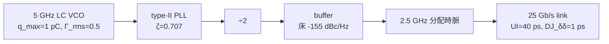

import NumericQuiz from "@site/src/components/NumericQuiz";

# 期末總測驗：5 GHz LC VCO 到 25 Gb/s SerDes 一條龍

> **先備**：[capstone_lc_end_to_end](/03_isf_core_theory/capstone_lc_end_to_end)（全站主脊一條龍）與三章成套習題——[02 基礎章](/02_foundations/exercises)、[03 核心理論章](/03_isf_core_theory/exercises)、[06 設計章](/06_design_insights/exercises)（先做完再來）｜**接下來**：無——這是最後一頁。10 題全對，你畢業了。

這不是又一份習題集。這是**一場考試**：一個設計故事、10 個關卡，從單一電荷脈衝打進
LC tank 的那一瞬間，一路走到 SerDes 鏈路在 BER $=10^{-12}$ 的 eye 開度。每一題都只考
一個「乾淨的數字」，但每個數字都得跨章調度——你需要 [P1] 的 ISF、[P2] 的 κ 與 App. B
閉式、擴散字典的換裝、時脈鏈的四條記帳規則、PLL 閉環代數、與 dual-Dirac 外插。
**建議先自己算、輸入作答，再展開解答對照。**

## 設計情境（全卷共用）

你負責一條 **25 Gb/s NRZ SerDes link**（UI $=40$ ps、目標 BER $=10^{-12}$）的時脈路徑：



| 量 | 值 | 單位 | 出處 |
|---|---|---|---|
| VCO 載波 $f_0$ | 5 | GHz | 全站 canonical |
| $q_{max}$ | 1 | pC | 例 A / 例 B |
| $\Gamma_{rms}$（代表值） | 0.5 | — | 例 B（真 LC 為 $1/\sqrt2$） |
| 白噪源 $S_i$ | $10^{-24}$ | A²/Hz | 例 B |
| 實測 $\mathcal{L}(1\,\text{MHz})$ | $-100$ | dBc/Hz | 例 C（datasheet 級） |
| PLL | $\zeta=0.707$、type-II 二階 | — | [pll_noise_budget](/06_design_insights/pll_noise_budget) |
| buffer 床 | $-155$（平坦） | dBc/Hz | [clock_chain_budget](/06_design_insights/clock_chain_budget) |
| 鏈路 DJ | $\mathrm{DJ}_{\delta\delta}=1$ | ps | 本卷題 10 給定 |

> **兩條軌的誠實聲明（考前必讀）**：本卷刻意讓兩組數字並行。
> **理想單源下限軌**（題 2、3、7）：單一白噪源、[P1] Eq.(21) 算出的
> $-148$ dBc/Hz——這是物理下限，真實電路到不了。
> **實測軌**（題 5、6、9、10）：datasheet 級的 $-100$ dBc/Hz——比理想下限高 48 dB，
> 反映多源、cyclostationary、flicker 與 buffer chain 的現實。兩軌**不能混用**；
> 每題會標明用哪一軌。
>
> **慣例旗標（全卷紀律）**：$\mathcal{L}$ 皆 SSB dBc/Hz。凡由電路雜訊**預測**者標明
> [P1] Eq.(21) 的 SSB $/4$ 慣例（時域 $/2$ 慣例整條 $+3$ dB）；凡**量測**值（$-100$ dBc/Hz）
> 依站規以小角 $\mathcal{L}=\tfrac12 S_\phi$（$/2$）記帳。1/f³ corner 標明 [P2] Eq.(57)
> vs [P1] Eq.(24) 的 2 倍差。每個 2 都要有名有姓——這正是考點之一。

---

## 第 1 幕：振盪器核心物理（題 1–4）

### 題 1 — 一顆脈衝打進 tank（impulse → Δφ）

故事開場：VCO 還在 schematic 階段。你先問最原始的問題——supply 上竄進一顆
$\Delta q=1$ fC 的電荷脈衝，注入時刻的 ISF 值 $\Gamma(\omega_0\tau)=0.5$（例 A 的代表值），
$q_{max}=1$ pC、$f_0=5$ GHz。求永久相位步階 $\Delta\phi$ 與等效 timing error $\Delta t$。

<NumericQuiz
  prompt="先自己算：這顆脈衝造成的 timing error Δt = ？（Δq = 1 fC，q_max = 1 pC，Γ = 0.5，f₀ = 5 GHz；以 fs 作答）"
  answer={15.9}
  tol={0.01}
  unit="fs"
  hint="Δφ = Γ·Δq/q_max = 0.5×10⁻¹⁵/10⁻¹² = 5×10⁻⁴ rad，再 Δt = Δφ/(2πf₀)。"
  solutionNote="Δφ = 5×10⁻⁴ rad = 0.5 mrad；Δt = 5×10⁻⁴/(2π×5×10⁹) ≈ 1.59×10⁻¹⁴ s = 15.9 fs——這就是 canonical 例 A。詳見下方解答。"
/>

<details>
<summary><strong>題 1 完整解答</strong>（impulse → Δφ → Δt）</summary>

**第 1 步（操作型 ISF 定義，規範公式 5；推導見 [impulse_to_phase_shift](/03_isf_core_theory/impulse_to_phase_shift)）**：

$$
\Delta\phi=\frac{\Gamma(\omega_0\tau)}{q_{max}}\,\Delta q=\frac{0.5\times(1\times10^{-15}\ \text{C})}{1\times10^{-12}\ \text{C}}=5\times10^{-4}\ \text{rad}=0.0286^\circ.
$$

**第 2 步（phase→time，規範公式 17）**：

$$
\Delta t=\frac{\Delta\phi}{2\pi f_0}=\frac{5\times10^{-4}}{2\pi\times5\times10^{9}}=1.59\times10^{-14}\ \text{s}=15.9\ \text{fs}.
$$

**結果**：$\Delta\phi=5\times10^{-4}$ rad、$\Delta t=15.9$ fs（canonical 例 A）。

**Dimension check**：$\Gamma$ 無因次 $\times$ C/C $=$ rad ✓；rad ÷ (rad/s) $=$ s ✓。

**故事註**：這 15.9 fs 是「單顆脈衝、一次性」的位移；振盪器沒有相位恢復力，
它**永久**留在相位裡（LTV 的核心，見 [lti_vs_ltv](/02_foundations/lti_vs_ltv)）。
接下來三題把「一顆脈衝」升級成「連續白噪」。

```python
from simulations.common.isf_utils import impulse_to_phase_step
from simulations.common.noise_utils import phase_to_time_error
dphi = impulse_to_phase_step(1e-15, 0.5, qmax=1e-12)
print(dphi, round(phase_to_time_error(dphi, 5e9)*1e15, 1))  # -> 0.0005 15.9
```

</details>

### 題 2 — 白噪打滿一整條裙邊（Eq.(21) → $\mathcal{L}$）

單一白噪源 $S_i=\overline{i_n^2}/\Delta f=10^{-24}\ \text{A}^2/\text{Hz}$ 連續打進同一顆 VCO
（$\Gamma_{rms}=0.5$、$q_{max}=1$ pC）。用 [P1] Eq.(21), p.185 求 $\mathcal{L}(1\,\text{MHz})$。

<NumericQuiz
  prompt="先自己算：L(1 MHz) = ？（Γ_rms = 0.5，q_max = 1 pC，S_i = 10⁻²⁴ A²/Hz，[P1] Eq.(21) 的 /4 慣例；以 dBc/Hz 作答，記得負號）"
  answer={-148.0}
  tol={0.01}
  unit="dBc/Hz"
  hint="L = 10·log₁₀[(Γ_rms²/q_max²)·S_i/(4Δω²)]，Δω = 2π×10⁶，Δω² ≈ 3.95×10¹³。"
  solutionNote="括號內 ≈ 1.583×10⁻¹⁵ → −148.0 dBc/Hz（canonical 例 B；時域 /2 慣例為 −145.0）。詳見下方解答。"
/>

<details>
<summary><strong>題 2 完整解答</strong>（[P1] Eq.(21)，含 /4 vs /2 慣例旗標）</summary>

**逐步代入（帶單位）**。[P1] Eq.(21), p.185（規範公式 12）：

$$
\mathcal{L}\{\Delta\omega\}=10\log_{10}\!\left(\frac{\Gamma_{rms}^2}{q_{max}^2}\cdot\frac{\overline{i_n^2}/\Delta f}{4\,\Delta\omega^2}\right)
$$

1. $\Delta\omega=2\pi\times10^6=6.283\times10^6$ rad/s，$\Delta\omega^2=3.948\times10^{13}$。
2. $\dfrac{\Gamma_{rms}^2}{q_{max}^2}=\dfrac{0.25}{(10^{-12})^2}=2.5\times10^{23}\ \text{C}^{-2}$。
3. $\dfrac{S_i}{4\Delta\omega^2}=\dfrac{10^{-24}}{1.579\times10^{14}}=6.33\times10^{-39}$。
4. 相乘 $=1.583\times10^{-15}$，$\mathcal{L}=10\log_{10}(1.583\times10^{-15})=-148.0$ dBc/Hz。

**結果**：$\mathcal{L}(1\,\text{MHz})=-148.0$ dBc/Hz（canonical 例 B——**理想單源下限軌**）。

**慣例旗標**：這是 [P1] Eq.(21) 的 **SSB $/4$ 記帳**；時域乾淨推導的 $/2$ 慣例給
$-145.0$ dBc/Hz（差 3 dB 的著名慣例之爭，見
[white_noise_to_phase_noise](/03_isf_core_theory/white_noise_to_phase_noise)）。題 3 要用
$/2$ 版本，先記住這件事。

**Dimension check**：$\text{C}^{-2}\cdot\dfrac{\text{A}^2/\text{Hz}}{(\text{rad/s})^2}$
以 $\text{C}=\text{A·s}$ 化簡為 s（per-Hz），取 $10\log_{10}$ 讀作 dBc/Hz ✓。

```python
import numpy as np
dw = 2*np.pi*1e6
print(round(10*np.log10((0.5**2/1e-24)*(1e-24/(4*dw**2))), 1))  # -> -148.0
```

</details>

### 題 3 — 換上五件衣服的第一件（$\mathcal{L}\to\kappa^2\to$ 線寬）

同一顆理想單源 VCO。系統同事問你：「這顆自由跑的載波**線寬**多少？」用
[diffusion_dictionary](/03_isf_core_theory/diffusion_dictionary) 的反向查字典：
先把題 2 的 $\mathcal{L}$ 換回 $\kappa^2$，再換成 Lorentzian 3-dB 線寬（**v5 已裁決的映射**：
$\Delta f_{3\mathrm{dB}}=\kappa^2/(2\pi)$，不是 $\kappa^2/\pi$）。

<NumericQuiz
  prompt="先自己算：這顆 VCO 自由跑的 Lorentzian 3-dB 線寬 Δf₃dB = ？（由題 2 的 L 反推 κ²，再除 2π；以 mHz 作答）"
  answer={19.9}
  tol={0.01}
  unit="mHz"
  hint="反向查字典要用 /2 慣例的數字：−148（/4）+3 dB → −145（/2）；κ² = L_lin·Δω² = 0.125 rad²/s；Δf₃dB = κ²/(2π)。"
  solutionNote="κ² = 0.125 rad²/s → Δf₃dB = 0.125/(2π) = 19.9 mHz（v5 裁決值；若誤用 D/π 配 D=0.125 會多 2 倍成 40 mHz）。詳見下方解答。"
/>

<details>
<summary><strong>題 3 完整解答</strong>（v5 映射：$\mathcal{L}\to\kappa^2\to\Delta f_{3\mathrm{dB}}$ 的 19.9 mHz 鏈）</summary>

**第 1 步（先對慣例，再換裝）**。反向查字典公式是 $\kappa^2=\mathcal{L}_{/2}\cdot\Delta\omega^2$
——它吃的是**時域 $/2$ 慣例**的 $\mathcal{L}$。題 2 的 $-148.0$ 是 $/4$ 慣例，先加 3 dB：

$$
\mathcal{L}_{/2}(1\,\text{MHz})=-145.0\ \text{dBc/Hz}\;\Rightarrow\;\mathcal{L}_{\text{lin}}=3.17\times10^{-15}\ \text{1/Hz}.
$$

**第 2 步（換回主角 $\kappa^2$）**：

$$
\kappa^2=\mathcal{L}_{/2}\cdot\Delta\omega^2=3.17\times10^{-15}\times3.948\times10^{13}=0.125\ \text{rad}^2/\text{s}.
$$

**交叉驗證**（直接用 [P2] Eq.(11)/(12), p.793 的定義，不經 $\mathcal{L}$）：

$$
\kappa^2=\frac{\Gamma_{rms}^2}{2\,q_{max}^2}\cdot\frac{\overline{i_n^2}}{\Delta f}=\frac{0.25}{2\times10^{-24}}\times10^{-24}=0.125\ \text{rad}^2/\text{s}\ \checkmark
$$

**第 3 步（穿上衣服三：線寬）**。v5 裁決的映射（lab_23 以 MC 方差斜率 $0.1252$、
線寬擬合 $20.0$ mHz 實測裁定，見 [diffusion_dictionary](/03_isf_core_theory/diffusion_dictionary) 衣服三）：

$$
\Delta f_{3\mathrm{dB}}=\frac{\kappa^2}{2\pi}=\frac{0.125}{2\pi}=1.99\times10^{-2}\ \text{Hz}=19.9\ \text{mHz}.
$$

**結果**：$\kappa^2=0.125\ \text{rad}^2/\text{s}$、$\Delta f_{3\mathrm{dB}}=19.9$ mHz
（真 LC 的 $\Gamma_{rms}=1/\sqrt2$ 給 $\kappa^2=0.25$、線寬 $39.8$ mHz）。

**慣例旗標（本題就是三個 factor-of-2 的地雷區）**：(1) $/4\to/2$ 差 3 dB——忘了換，
$\kappa^2$ 少一半；(2) $D$ 的兩種慣例：$D_{\text{甲}}=\kappa^2=0.125$（$\mathrm{Var}=D\vert t\vert$）、
$D_{\text{乙}}=\kappa^2/2=0.0625$（$\mathrm{Var}=2D\vert t\vert$）；(3) 線寬公式
$\Delta f_{3\mathrm{dB}}=\kappa^2/(2\pi)=D_{\text{乙}}/\pi$——**v3 曾把甲值塞進乙式**得 40 mHz
（大 2 倍），v5 已全站修正。1/f² 假發散在 $\Delta f\lesssim\Delta f_{3\mathrm{dB}}$ 轉平成
Lorentzian，見 [lorentzian_linewidth](/03_isf_core_theory/lorentzian_linewidth)。

**Dimension check**：$\text{1/Hz}\times(\text{rad/s})^2=\text{rad}^2/\text{s}$ ✓；
$\text{rad}^2/\text{s}\div2\pi=\text{Hz}$ ✓。

```python
import numpy as np
dw = 2*np.pi*1e6
kappa2 = 10**((-148.0 + 3.01)/10)*dw**2     # /4 -> /2 再反查
print(round(kappa2, 3), round(kappa2/(2*np.pi)*1e3, 1))  # -> 0.125 19.9
```

</details>

### 題 4 — Plan B：如果改用 ring（App. B 閉式 → 1/f³ corner）

專案審查會上有人提議：「LC 佔面積，改 5 級單端 ring 如何？」你用
[P2] Appendix B 的閉式（[asymmetric_isf_closed_form](/03_isf_core_theory/asymmetric_isf_closed_form)）
當場回答 flicker 上轉的代價：$N=5$、$\eta=1$、波形不對稱比 $A=f'_{rise}/f'_{fall}=1.5$、
device 1/f corner $f_{1/f}=1$ MHz。求頻譜的 $1/f^3$ corner（[P2] Eq.(57) 慣例）。

<NumericQuiz
  prompt="先自己算：N = 5、A = 1.5、η = 1、f₁/f = 1 MHz 的 ring，1/f³ corner = ？（[P2] Eq.(57) 慣例；以 kHz 作答）"
  answer={42.86}
  tol={0.01}
  unit="kHz"
  hint="Eq.(57)：f_corner = f₁/f · 3/(2ηN) · (1−A)²/(1−A+A²) = 10⁶ × 0.3 × 0.25/1.75。"
  solutionNote="corner = 42.86 kHz（[P2] Eq.(57)）；[P1] Eq.(24) 慣例（代 c₀=2Γdc）= 85.71 kHz，恰為 2 倍。詳見下方解答。"
/>

<details>
<summary><strong>題 4 完整解答</strong>（[P2] App. B Eq.(55)–(57)，含 2 倍慣例旗標）</summary>

**逐步代入（帶單位）**。[P2] Eq.(57), p.803：

$$
f_{1/f^3}=f_{1/f}\cdot\frac{3}{2\eta N}\cdot\frac{(1-A)^2}{1-A+A^2}
=10^6\ \text{Hz}\times\frac{3}{2\times1\times5}\times\frac{(-0.5)^2}{1-1.5+2.25}
=10^6\times0.3\times\frac{0.25}{1.75}=42.86\ \text{kHz}.
$$

順帶把中間量算全（[P2] Eq.(55)/(56)，同頁 lab_33 三重驗證）：

$$
\Gamma_{rms}^2=\frac{2\pi^2}{3\eta^3 N^3}\left[4\,\frac{1+A^3}{(1+A)^3}\right]=0.05895\;\Rightarrow\;\Gamma_{rms}=0.2428,
\qquad
c_0=2\Gamma_{dc}=2\cdot\frac{2\pi}{\eta^2N^2}\frac{1-A}{1+A}=-0.1005.
$$

**結果**：corner $=42.86$ kHz（[P2] Eq.(57) 慣例）。

**慣例旗標**：把 $c_0=2\Gamma_{dc}$ 代進 [P1] Eq.(24)
$\Delta\omega_{1/f^3}=\omega_{1/f}\,c_0^2/(2\Gamma_{rms}^2)$ 得 **85.71 kHz——恰為 2 倍**
（DC 通道記帳慣例差，兩篇論文各自自洽；scaling 與比值不受影響）。報數字必標慣例。

**設計判讀**：corner $\propto(1-A)^2/(1-A+A^2)$、$\propto1/N$——42.86 kHz 的 close-in
$1/f^3$ 對 SerDes 的 PLL（loop BW 遠大於 42.86 kHz）會被高通洗掉大半，flicker 不是
否決 ring 的理由；ring 真正的代價在白噪區 FOM（[lc_vs_ring](/06_design_insights/lc_vs_ring)）。
本卷維持 LC 方案，此題是 Plan B 的定量存檔。對稱化（$A\to1$）corner 二次趨零——
這就是 [symmetry](/06_design_insights/symmetry) 的閉式版本。

**Dimension check**：Hz $\times$ 無因次 $\times$ 無因次 $=$ Hz ✓。

```python
N, A, eta, f1f = 5, 1.5, 1.0, 1e6
print(round(f1f*3/(2*eta*N)*(1-A)**2/(1-A+A**2)/1e3, 2))  # -> 42.86
```

</details>

---

## 第 2 幕：從 datasheet 到時脈樹（題 5–7）

### 題 5 — 積分出真實時脈的 RJ（$\mathcal{L}\to\sigma_t$）

矽回來了。實測整合後的 VCO：$\mathcal{L}(1\,\text{MHz})=-100$ dBc/Hz、$1/f^2$ 斜率
（**實測軌**——比題 2 的理想單源下限高 48 dB，多源、cyclostationary、flicker 與
buffer chain 的現實）。積分頻帶 1–100 MHz。求 rms jitter $\sigma_t$。

<NumericQuiz
  prompt="先自己算：L(1 MHz) = −100 dBc/Hz、1/f² 斜率、積分 1→100 MHz、f₀ = 5 GHz 的 rms jitter σ_t = ？（以 fs 作答）"
  answer={447.9}
  tol={0.01}
  unit="fs"
  hint="S_φ = 2×10^(L/10)；1/f² 閉式 σ_φ² = S_φ(f_ref)·f_ref²·(1/f₁ − 1/f₂)；再 σ_t = σ_φ/(2πf₀)。"
  solutionNote="σ_φ² = 1.98×10⁻⁴ rad² → σ_φ = 14.07 mrad → σ_t = 447.9 fs（canonical 例 C，lab_08 數值＝解析）。詳見下方解答。"
/>

<details>
<summary><strong>題 5 完整解答</strong>（jitter 積分，canonical 例 C）</summary>

**逐步代入（帶單位；全程 [lab_08](/04_simulation_labs/lab_08_jitter_integration) 的四步鏈）**：

$$
\begin{aligned}
S_\phi(1\,\text{MHz})&=2\times10^{-100/10}=2\times10^{-10}\ \text{rad}^2/\text{Hz}
\quad(\mathcal{L}\approx\tfrac12 S_\phi\text{，小角 SSB 慣例，規範公式 16}),\\[2pt]
\sigma_\phi^2&=S_\phi(f_{ref})\,f_{ref}^2\left(\frac{1}{f_1}-\frac{1}{f_2}\right)
=2\times10^{-10}\times(10^6)^2\times(10^{-6}-10^{-8})=1.98\times10^{-4}\ \text{rad}^2,\\[2pt]
\sigma_\phi&=1.407\times10^{-2}\ \text{rad}=14.07\ \text{mrad},\\[2pt]
\sigma_t&=\frac{\sigma_\phi}{2\pi f_0}=\frac{1.407\times10^{-2}}{2\pi\times5\times10^9}=4.479\times10^{-13}\ \text{s}=447.9\ \text{fs}.
\end{aligned}
$$

**結果**：$\sigma_\phi=14.07$ mrad、$\sigma_t=447.9$ fs（canonical 例 C）。

**慣例旗標**：$-100$ 是**量測** SSB，依站規用 $\mathcal{L}=\tfrac12S_\phi$（$/2$）還原
$S_\phi$——量測值沒有 $/4$ 的事（那是從電路雜訊**預測**時才進場，見題 2/3）。

**手感**：$1/f^2$ 的積分由**下限主導**（$1/f_1$ 佔 99%）；「從哪裡開始積」由 PLL loop BW
決定——這正是題 8 的伏筆。**Dimension check**：$\text{rad}^2/\text{Hz}\times\text{Hz}=\text{rad}^2$ ✓；
rad ÷ (rad/s) $=$ s ✓。

```python
import numpy as np
from simulations.common.noise_utils import integrate_rms_jitter
f = np.logspace(6, 8, 4000)
st, sp = integrate_rms_jitter(f, -100.0 - 20*np.log10(f/1e6), 5e9, 1e6, 100e6)
print(round(sp*1e3, 2), round(st*1e15, 1))   # -> 14.07 447.9
```

</details>

### 題 6 — 同一顆時脈的 period jitter（jitter 核閉式）

數位同事只在乎相鄰 edge：「單週期的 period jitter 多少？」用
[jitter_kernels](/02_foundations/jitter_kernels) 的白噪 FM 閉式：先由實測裙邊反查
$\kappa^2$（字典衣服四的反向），再套 $\sigma_P(1)=\kappa\sqrt{T}/\omega_0$。

<NumericQuiz
  prompt="先自己算：實測 −100 dBc/Hz@1 MHz（1/f² 區）的 5 GHz 時脈，白噪 FM 閉式下的單週期 period jitter σ_P(1) = ？（以 fs 作答）"
  answer={28.3}
  tol={0.02}
  unit="fs"
  hint="κ² = 10^(−100/10)×(2π×10⁶)² ≈ 3.95×10³ rad²/s；σ_P(1) = √(κ²·T)/(2πf₀)，T = 200 ps。"
  solutionNote="σ_ΔΦ(1T) = √(3948×2×10⁻¹⁰) = 8.89×10⁻⁴ rad → σ_P(1) = 28.28 fs ≈ 28.3 fs（jitter_kernels 的封閉解；例 C3 的 27.6 fs 是同式在 10³–10¹⁰ Hz 頻帶截斷後的值）。詳見下方解答。"
/>

<details>
<summary><strong>題 6 完整解答</strong>（$4\sin^2$ 核閉式：$\sigma_{\Delta\phi}^2(N)=\kappa^2NT$）</summary>

**第 1 步（由裙邊反查 $\kappa^2$）**。$1/f^2$ 區、時域 $/2$ 慣例（量測值直接可用）：

$$
\kappa^2=\mathcal{L}_{\text{lin}}(\Delta f)\cdot\Delta\omega^2=10^{-10}\times(2\pi\times10^6)^2=3.95\times10^{3}\ \text{rad}^2/\text{s}.
$$

（這就是 [diffusion_dictionary](/03_isf_core_theory/diffusion_dictionary) 的「$-100$ dBc/Hz
錨點」行：$\kappa^2=3.95\times10^3$、線寬 628 Hz、$\kappa_t=2.0\times10^{-9}\sqrt{\text{s}}$。）

**第 2 步（白噪 FM 封閉式）**。[jitter_kernels](/02_foundations/jitter_kernels) 第 4 步：
把 $S_\phi=2\kappa^2/(2\pi f)^2$ 代入一階差分核 $4\sin^2(\pi fNT)$，積分**精確**給出
$\sigma_{\Delta\phi}^2(N)=\kappa^2NT$（正是 [P2] Eq.(8) 的 $\kappa\sqrt{\Delta t}$，一個係數都不差）。
取 $N=1$、$T=1/f_0=200$ ps：

$$
\sigma_{\Delta\phi}(1T)=\sqrt{3947.8\times2\times10^{-10}}=8.886\times10^{-4}\ \text{rad},
\qquad
\sigma_P(1)=\frac{\sigma_{\Delta\phi}}{2\pi f_0}=\frac{8.886\times10^{-4}}{3.142\times10^{10}}=28.28\ \text{fs}.
$$

**結果**：$\sigma_P(1)\approx28.3$ fs（週期的 $1.4\times10^{-4}$）。

**慣例旗標（兩個）**：(1) 反查公式吃 $/2$ 慣例的 $\mathcal{L}$——量測值直接代；
若這裡誤代 $/4$ 慣例的預測值會少 $\sqrt2$。(2) 核的前置常數在「**單邊 $S_\phi$、$\int_0^\infty$**」
慣例下是 $1/\omega_0^2$（不是 $2/\omega_0^2$——那個 2 屬雙邊譜記帳，jitter_kernels 第 0 步
對照表＋MC 已裁決）。worked_examples 例 C3 的 27.6 fs 就是本式在 $10^3$–$10^{10}$ Hz
頻帶截斷後的數字——同一個物理。

**對照題 5**：同一顆時脈，累積 jitter（TIE，1–100 MHz 頻帶）447.9 fs vs 單週期 28.3 fs
——TIE 吃低頻、period 核是一階高通把 close-in 壓掉，兩個數字都對、量的東西不同
（[psd_phase_noise_jitter](/02_foundations/psd_phase_noise_jitter)）。

**Dimension check**：$\text{rad}^2/\text{s}\times\text{s}=\text{rad}^2$ ✓；rad ÷ (rad/s) $=$ s ✓。

```python
import numpy as np
kappa2 = 10**(-100/10)*(2*np.pi*1e6)**2
print(round(kappa2, 1), round(np.sqrt(kappa2/5e9)/(2*np.pi*5e9)*1e15, 2))
# -> 3947.8 28.28
```

</details>

### 題 7 — ÷2 到 2.5 GHz、過 buffer：床什麼時候當家？

時脈樹：5 GHz 經理想 ÷2 到 2.5 GHz，再過一級床 $-155$ dBc/Hz（平坦）的輸出 buffer。
看 **10 MHz offset**（PLL out-of-band，VCO 自由跑裙邊當家）。用**理想單源下限軌**：
VCO 裙邊由題 2 的 $-148$ dBc/Hz @ 1 MHz 錨點以 $1/f^2$ 外推。求 buffer 輸出的
$\mathcal{L}(10\,\text{MHz})$。

<NumericQuiz
  prompt="先自己算：VCO 裙邊 −148 dBc/Hz@1 MHz（1/f²）外推到 10 MHz、理想 ÷2、再與 −155 dBc/Hz buffer 床功率相加後，L(10 MHz) = ？（以 dBc/Hz 作答，記得負號）"
  answer={-154.95}
  tol={0.001}
  unit="dBc/Hz"
  hint="三步：−148 − 20log₁₀(10) = −168；÷2 再 −6.02 → −174.02；與 −155 床做 10log₁₀(10^(−174.02/10)+10^(−155/10))。"
  solutionNote="訊號比床低 19 dB → 床當家：輸出 ≈ −154.95 dBc/Hz，被鉗在 buffer 床上。詳見下方解答。"
/>

<details>
<summary><strong>題 7 完整解答</strong>（clock_chain 規則 2＋4：÷N 與加成床）</summary>

**第 1 步（$1/f^2$ 外推）**：

$$
\mathcal{L}_{vco}(10\,\text{MHz})=-148-20\log_{10}\!\frac{10\,\text{MHz}}{1\,\text{MHz}}=-168.00\ \text{dBc/Hz}.
$$

**第 2 步（規則 2：理想 ÷2 是 edge-picking，$\phi_{out}=\phi_{in}/2$）**：

$$
\mathcal{L}(10\,\text{MHz})\big|_{2.5\,\text{GHz}}=-168.00-20\log_{10}2=-174.02\ \text{dBc/Hz}.
$$

**第 3 步（規則 4：buffer 床與輸入不相關，功率相加、絕不是 dB 相加）**：

$$
\mathcal{L}_{out}=10\log_{10}\!\big(10^{-174.02/10}+10^{-155/10}\big)=-154.95\ \text{dBc/Hz}.
$$

**結果**：$-154.95$ dBc/Hz——訊號比床低 19 dB，**床當家**，輸出被鉗在 buffer 床上。
再乾淨的源頭過一級吵 buffer 就毀了：這 19 dB 的 margin 全數作廢，正是
[clock_chain_budget](/06_design_insights/clock_chain_budget) 的核心教訓
（該頁 worked chain 同一組數字：$-168\to-174.02\to-154.95$）。

**慣例旗標**：$\pm20\log_{10}N$ 與功率相加都是**比值/加法運算**，$/2$ vs $/4$ 慣例在
輸入輸出間對消——唯一吃慣例的是錨點本身（$-148$＝[P1] Eq.(21) 的 $/4$；$/2$ 記帳整條
$+3$ dB，結論「床當家」不變，輸出仍 $\approx-154.9$）。另注意守恆量：理想 ÷2 讓
$\mathcal{L}$ 好 6.02 dB，但**以秒計的 $\sigma_t$ 一顆 fs 都不變**（題 9 要用）。

**Dimension check**：dB 運算全作用在無因次功率比上 ✓。

```python
import numpy as np
L_div = (-148.0 - 20*np.log10(10)) - 20*np.log10(2)
print(round(L_div, 2))                                            # -> -174.02
print(round(10*np.log10(10**(L_div/10) + 10**(-155.0/10)), 2))    # -> -154.95
```

</details>

---

## 第 3 幕：迴路與鏈路（題 8–10）

### 題 8 — PLL 的鼓包稅（type-II peaking 閉式）

VCO 進 type-II 二階 PLL（$\zeta=0.707$）。系統規格書問：jitter transfer 的 **peaking**
（峰值超出 0 dB 多少）是多少？用
[pll_noise_budget](/06_design_insights/pll_noise_budget) 的閉式解。

<NumericQuiz
  prompt="先自己算：type-II 二階 PLL、ζ = 0.707 的 |H_lp|² peaking = ？（以 dB 作答）"
  answer={2.09}
  tol={0.01}
  unit="dB"
  hint="閉式：s = √(1+8ζ²)，|H_lp|²_max = (s+1)²/[(s−1)(s+3)]；ζ = 1/√2 時 s = √5，峰值恰為黃金比例 φ = 1.618。"
  solutionNote="peaking = 10log₁₀(1.618) = 2.09 dB，位置 f_pk = 0.786 f_n。級聯 20 級就是 41.8 dB——電信規格壓 0.1 dB/級的原因。詳見下方解答。"
/>

<details>
<summary><strong>題 8 完整解答</strong>（peaking 閉式：$\zeta=0.707\to2.09$ dB @ $0.786f_n$）</summary>

**閉式（該頁補充推導的結果，純代數自含）**。令 $s=\sqrt{1+8\zeta^2}$：

$$
\lvert H_{lp}\rvert^2_{max}=\frac{(s+1)^2}{(s-1)(s+3)},\qquad f_{pk}=f_n\sqrt{\frac{2}{s+1}}.
$$

**逐步代入**（$\zeta=1/\sqrt2$，$\zeta^2=\tfrac12$）：$s=\sqrt{1+4}=\sqrt5=2.236$，

$$
\lvert H_{lp}\rvert^2_{max}=\frac{(\sqrt5+1)^2}{(\sqrt5-1)(\sqrt5+3)}=\frac{\sqrt5+1}{2}=\varphi=1.618,
\qquad
f_{pk}=f_n\sqrt{\frac{2}{\sqrt5+1}}=0.786\,f_n.
$$

$$
\text{peaking}=10\log_{10}1.618=2.09\ \text{dB}.
$$

（峰值恰是**黃金比例**——該頁的彩蛋，`pll_utils.H_lowpass_mag2` 400 萬點細掃
數值同給 $0.7862/2.0903$ dB。）

**結果**：peaking $=2.09$ dB @ $f_{pk}=0.786f_n$（phase margin $65.5^\circ$）。

**慣例旗標**：這是功率轉移的 $10\log_{10}$（數值上等於幅度的 $20\log_{10}$）——
**沒有** SSB $/2$、$/4$ 的事（那是 $S_\phi\leftrightarrow\mathcal{L}$ 換算才有）。
type-II 帶零點**必有** peaking（DC 處導數恆正），這是穩定性的代價不是設計失誤；
級聯 $M$ 級 dB 直接相加——20 級 regenerator 就是 $41.8$ dB，所以電信規格把單級
peaking 壓在 0.1 dB（需 $\zeta\approx4.32$）。對本卷：$f_{pk}$ 附近的 reference/in-band
雜訊會被多收 2.09 dB 的稅，做 jitter 預算時別漏。

**Dimension check**：$\zeta,s,x$ 全無因次；$f_{pk}=f_n\times$無因次 $=$ Hz ✓。

```python
import numpy as np
s = np.sqrt(1 + 8*0.707**2)
print(round(np.sqrt(2/(s+1)), 4), round(10*np.log10((s+1)**2/((s-1)*(s+3))), 2))
# -> 0.7862 2.09
```

</details>

### 題 9 — 這顆 2.5 GHz 時脈拿去取樣，值幾個 bit？（aperture SNR）

RX 端的監測 ADC 用最終的 2.5 GHz 時脈取樣一個滿刻度 2.5 GHz 校正單音。時脈 RJ 用
實測軌：題 5 的 $\sigma_t=447.9$ fs——理想 ÷2 **不改變以秒計的 $\sigma_t$**（題 7 的
守恆量；buffer 床在同頻帶另加約 16 fs，RSS 後 $+0.06\%$，可忽略）。求 jitter 限制的 SNR。

<NumericQuiz
  prompt="先自己算：σ_t = 447.9 fs 的時脈取樣 f_in = 2.5 GHz 滿刻度正弦，SNR_jitter = ？（以 dB 作答）"
  answer={43.05}
  tol={0.01}
  unit="dB"
  hint="SNR = −20log₁₀(2π·f_in·σ_t)；2π×2.5×10⁹×4.479×10⁻¹³ = 7.04×10⁻³ rad。"
  solutionNote="SNR = −20log₁₀(7.036×10⁻³) = 43.05 dB → ENOB = (43.05−1.76)/6.02 = 6.86 bit（adc_aperture_jitter 設計表的 2.5 GHz 列）。詳見下方解答。"
/>

<details>
<summary><strong>題 9 完整解答</strong>（aperture SNR 與 ENOB）</summary>

**逐步代入（帶單位；推導見 [adc_aperture_jitter](/06_design_insights/adc_aperture_jitter)）**。
取樣誤差 $=$ 斜率 $\times$ 時間誤差，對取樣相位與 jitter 取均方後兩個 $\tfrac12$ 對消：

$$
\sigma_{\phi,in}=2\pi f_{in}\,\sigma_t=2\pi\times2.5\times10^9\ \text{Hz}\times4.479\times10^{-13}\ \text{s}=7.036\times10^{-3}\ \text{rad},
$$

$$
\text{SNR}_{jitter}=-20\log_{10}\!\big(2\pi f_{in}\sigma_t\big)=-20\log_{10}(7.036\times10^{-3})=43.05\ \text{dB},
$$

$$
\text{ENOB}=\frac{43.05-1.76}{6.02}=6.86\ \text{bit}.
$$

**結果**：SNR $=43.05$ dB、ENOB $=6.86$ bit——與
[adc_aperture_jitter](/06_design_insights/adc_aperture_jitter) 設計表的 2.5 GHz 列
逐字一致。買 12-bit ADC 也沒用：高頻 SNR 被時脈卡死。

**慣例旗標**：公式本身**不依賴** SSB/DSB 或 $\mathcal{L}$ 慣例（$P_{sig}$ 的 $\tfrac12$ 與
$\langle\cos^2\rangle$ 的 $\tfrac12$ 對消）；慣例藏在 $\sigma_t$ 的上游——447.9 fs 是量測
$\mathcal{L}$ 用 $/2$ 小角換算積出來的（題 5），全鏈一致即無歧義。

**守恆量的使用**：$\sigma_t$（秒）過理想 ÷2 不變（[clock_chain_budget](/06_design_insights/clock_chain_budget)
第 5 步）——÷2 省的是 $\mathcal{L}$ 的 dB，不是 fs；所以 2.5 GHz 時脈直接繼承 447.9 fs。
誠實註：buffer 床貢獻 $\sqrt{447.9^2+16.0^2}=448.2$ fs（$+0.06\%$），本題忽略。

**Dimension check**：Hz $\times$ s $\times2\pi=$ rad（無因次）✓，log 引數合法；dB、bit 無因次 ✓。

```python
import numpy as np
snr = -20*np.log10(2*np.pi*2.5e9*447.9e-15)
print(round(snr, 2), round((snr - 1.76)/6.02, 2))   # -> 43.05 6.86
```

</details>

### 題 10 — 期末魔王：eye 還剩多少？（dual-Dirac TJ@$10^{-12}$）

鏈路收尾。25 Gb/s（UI $=40$ ps）、量測分解得 $\mathrm{DJ}_{\delta\delta}=1$ ps；
RJ 用實測軌時脈的 $\sigma_t=447.9$ fs。用 dual-Dirac 外插
（[dj_dual_dirac](/06_design_insights/dj_dual_dirac)）求 BER $=10^{-12}$ 的 total jitter。

<NumericQuiz
  prompt="先自己算：DJ_δδ = 1 ps、RJ σ = 447.9 fs，dual-Dirac 外插的 TJ@BER=10⁻¹² = ？（per-Gaussian 慣例 Q⁻¹ = 7.034；以 ps 作答）"
  answer={7.3}
  tol={0.01}
  unit="ps"
  hint="TJ = DJ_δδ + 2·Q⁻¹(10⁻¹²)·σ = 1 ps + 14.07×0.4479 ps。"
  solutionNote="TJ = 1 + 6.30 = 7.30 ps；eye 開度 = 40 − 7.30 = 32.7 ps = 0.82 UI。詳見下方解答——恭喜你走完全程。"
/>

<details>
<summary><strong>題 10 完整解答</strong>（dual-Dirac 外插與 eye 預算）</summary>

**逐步代入（帶單位）**。dual-Dirac 外插式（深尾單高斯主導）：

$$
\mathrm{TJ}(\mathrm{BER})=\mathrm{DJ}_{\delta\delta}+2\,Q^{-1}(\mathrm{BER})\,\sigma,
\qquad Q^{-1}(10^{-12})=7.034\ (\text{本站記 }7.03).
$$

$$
\mathrm{TJ}=1\ \text{ps}+2\times7.034\times0.4479\ \text{ps}=1\ \text{ps}+6.30\ \text{ps}=7.30\ \text{ps}.
$$

$$
\text{eye 開度}=UI-\mathrm{TJ}=40-7.30=32.7\ \text{ps}=0.82\ UI.
$$

**結果**：TJ@$10^{-12}=7.30$ ps、eye 開度 $32.7$ ps（$0.82\,UI$）——RJ 項 6.30 ps 與
[serdes_clocking_connection](/06_design_insights/serdes_clocking_connection) 的
「448 fs → RJ 吃掉 6.3 ps」一致 ✓。這條 25 Gb/s link 的時脈預算過關。

**慣例旗標**：$Q^{-1}(10^{-12})=7.034$ 是**業界 per-Gaussian 慣例**（每顆高斯尾巴 $=$ BER）；
嚴格把 Dirac 權重 ½ 與 transition density ½ 都記進去是 $Q=4\times\mathrm{BER}$ 慣例
（$Q^{-1}=6.839$），差約 $0.2\sigma$/側——比對儀器報告前先對慣例
（[dj_dual_dirac](/06_design_insights/dj_dual_dirac) 第 6 步稽核表）。另記得
$\mathrm{DJ}_{\delta\delta}\le\mathrm{DJ}_{pp}$：模型參數故意低報才讓外插準——
別拿 $\mathrm{DJ}_{pp}$ 塞進這條公式。

**Dimension check**：$[\text{s}]+[\text{無因次}]\times[\text{s}]=[\text{s}]$ ✓。

**全卷閉環**：題 1 的一顆 1 fC 脈衝（15.9 fs）→ 題 2–3 白噪裙邊與線寬 → 題 5 積分成
447.9 fs 的 RJ → 題 7 時脈樹記帳 → 題 10 在 eye 上收帳。**一顆電荷的去向，就是一條
SerDes link 的 margin。**

```python
import numpy as np
from scipy.special import erfcinv
qinv = float(np.sqrt(2)*erfcinv(2*1e-12))
tj = 1e-12 + 2*qinv*447.9e-15
print(round(qinv, 3), round(tj*1e12, 2))   # -> 7.034 7.3
```

</details>

---

## 畢業檢定：Python 附錄（一次重算全部 10 題）

在專案根目錄以 `PYTHONPATH=.` 執行；每個 `# ->` 都是實跑輸出，與各題解答逐字一致。

```python
import numpy as np
from scipy.special import erfcinv
from simulations.common.isf_utils import impulse_to_phase_step
from simulations.common.noise_utils import phase_to_time_error, integrate_rms_jitter
from simulations.common.pll_utils import H_lowpass_mag2

f0, qmax, grms, Si = 5e9, 1e-12, 0.5, 1e-24
dw = 2*np.pi*1e6                                   # 1 MHz offset [rad/s]

# --- 題 1: impulse -> Delta_phi -> Delta_t（例 A）
dphi = impulse_to_phase_step(1e-15, 0.5, qmax=qmax)
print(dphi, round(phase_to_time_error(dphi, f0)*1e15, 1))   # -> 0.0005 15.9

# --- 題 2: [P1] Eq.(21)（SSB /4 慣例）
L4 = 10*np.log10((grms**2/qmax**2)*(Si/(4*dw**2)))
print(round(L4, 1))                                # -> -148.0

# --- 題 3: /4 -> /2 -> kappa^2 -> Lorentzian 線寬
L2_lin = 10**((L4 + 3.01)/10)                      # 換回 /2 慣例（+3.01 dB）
kappa2 = L2_lin*dw**2                              # 反向查字典 kappa^2 = L_/2 * dw^2
print(round(kappa2, 3), round(grms**2*Si/(2*qmax**2), 3))   # -> 0.125 0.125
print(round(kappa2/(2*np.pi)*1e3, 1))              # -> 19.9  （mHz）

# --- 題 4: [P2] App.B Eq.(55)-(57)，N=5、A=1.5、eta=1、f_1/f=1 MHz
N, A, eta, f1f = 5, 1.5, 1.0, 1e6
corner = f1f*3/(2*eta*N)*(1-A)**2/(1-A+A**2)
print(round(corner/1e3, 2), round(2*corner/1e3, 2))  # -> 42.86 85.71（[P2]；[P1] 慣例）

# --- 題 5: 實測 -100 dBc/Hz@1MHz、1/f^2、積 1-100 MHz
f = np.logspace(6, 8, 4000)
sigma_t, sigma_phi = integrate_rms_jitter(f, -100.0 - 20*np.log10(f/1e6), f0, 1e6, 100e6)
print(round(sigma_phi*1e3, 2), round(sigma_t*1e15, 1))      # -> 14.07 447.9

# --- 題 6: 同一顆實測時脈的 period jitter（jitter_kernels 閉式）
kappa2_m = 10**(-100/10)*dw**2                     # 量測 SSB = /2 慣例
print(round(kappa2_m, 1))                          # -> 3947.8  （rad^2/s）
print(round(np.sqrt(kappa2_m/f0)/(2*np.pi*f0)*1e15, 2))     # -> 28.28  （fs）

# --- 題 7: 理想裙邊 ÷2 到 2.5 GHz + buffer 床（10 MHz offset）
L_div = (-148.0 - 20*np.log10(10)) - 20*np.log10(2)
print(round(L_div, 2))                             # -> -174.02
print(round(10*np.log10(10**(L_div/10) + 10**(-155.0/10)), 2))  # -> -154.95

# --- 題 8: type-II peaking 閉式 vs pll_utils 數值
s = np.sqrt(1 + 8*0.707**2)
print(round(np.sqrt(2/(s+1)), 4), round(10*np.log10((s+1)**2/((s-1)*(s+3))), 2))
# -> 0.7862 2.09
x = np.linspace(0.001, 5, 400001)
m2 = H_lowpass_mag2(x, 1.0, 0.707)
print(round(10*np.log10(np.max(m2)), 2))           # -> 2.09

# --- 題 9: aperture SNR（sigma_t 過理想 ÷2 守恆）
st = 447.9e-15
snr = -20*np.log10(2*np.pi*2.5e9*st)
print(round(snr, 2), round((snr - 1.76)/6.02, 2))  # -> 43.05 6.86

# --- 題 10: dual-Dirac TJ@1e-12（per-Gaussian 慣例），UI = 40 ps
qinv = float(np.sqrt(2)*erfcinv(2*1e-12))
tj = 1e-12 + 2*qinv*st
print(round(qinv, 3), round(tj*1e12, 2))           # -> 7.034 7.3
print(round((40e-12 - tj)*1e12, 1), round((40e-12 - tj)/40e-12, 2))  # -> 32.7 0.82
```

## 重點回顧（帶著走的 10 個數字）

| 題 | 考點 | 答案 | 慣例旗標 |
|---|---|---|---|
| 1 | impulse→$\Delta\phi$→$\Delta t$ | $5\times10^{-4}$ rad、15.9 fs | — |
| 2 | [P1] Eq.(21) 白噪 $\mathcal{L}$ | $-148.0$ dBc/Hz | SSB $/4$（$/2$ 為 $-145.0$） |
| 3 | $\mathcal{L}\to\kappa^2\to$ 線寬 | $\kappa^2=0.125$ rad²/s、19.9 mHz | 反查吃 $/2$；$\Delta f_{3\mathrm{dB}}=\kappa^2/2\pi$（v5） |
| 4 | App. B 1/f³ corner | 42.86 kHz | [P2] Eq.(57)；[P1] Eq.(24) $=2\times=85.71$ kHz |
| 5 | jitter 積分 1–100 MHz | 14.07 mrad、447.9 fs | 量測 SSB 用 $\mathcal{L}=\tfrac12S_\phi$ |
| 6 | period jitter 閉式 | 28.3 fs | 單邊 $S_\phi$ 核前置 $1/\omega_0^2$ |
| 7 | ÷2＋buffer 床 | $-154.95$ dBc/Hz | 規則是比值運算，慣例對消；床當家 |
| 8 | type-II peaking | 2.09 dB @ $0.786f_n$ | $10\log_{10}$ 功率，無 SSB 之事 |
| 9 | aperture SNR @ 2.5 GHz | 43.05 dB（6.86 bit） | 公式 convention-free；$\sigma_t$ 守恆過 ÷2 |
| 10 | dual-Dirac TJ@$10^{-12}$ | 7.30 ps（eye 0.82 UI） | per-Gaussian $Q^{-1}=7.034$ |

10 題全對——恭喜畢業。你已經能從一顆電荷脈衝，一路記帳到 SerDes link 的 eye margin。

## 延伸閱讀（每題的深入版）

- 題 1：[impulse_to_phase_shift](/03_isf_core_theory/impulse_to_phase_shift)
- 題 2：[white_noise_to_phase_noise](/03_isf_core_theory/white_noise_to_phase_noise)
- 題 3：[diffusion_dictionary](/03_isf_core_theory/diffusion_dictionary)、[lorentzian_linewidth](/03_isf_core_theory/lorentzian_linewidth)
- 題 4：[asymmetric_isf_closed_form](/03_isf_core_theory/asymmetric_isf_closed_form)、[symmetry](/06_design_insights/symmetry)
- 題 5：[lab_08_jitter_integration](/04_simulation_labs/lab_08_jitter_integration)
- 題 6：[jitter_kernels](/02_foundations/jitter_kernels)
- 題 7：[clock_chain_budget](/06_design_insights/clock_chain_budget)
- 題 8：[pll_noise_budget](/06_design_insights/pll_noise_budget)
- 題 9：[adc_aperture_jitter](/06_design_insights/adc_aperture_jitter)
- 題 10：[dj_dual_dirac](/06_design_insights/dj_dual_dirac)、[serdes_clocking_connection](/06_design_insights/serdes_clocking_connection)
- 全程嚴格版主脊：[capstone_lc_end_to_end](/03_isf_core_theory/capstone_lc_end_to_end)
