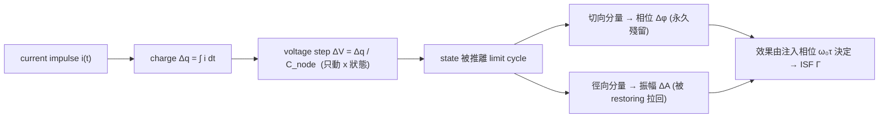

# Lab 01 — 正弦振盪器與 limit cycle 的相位/振幅幾何

這是整個 ISF（Impulse Sensitivity Function，脈衝敏感度函數；振盪器對 noise 的「相位敏感度」權重）
故事的第一個 lab。我們先**不碰任何公式裡的常數**，只用一張 2-D 平面圖建立一個會跟你
一輩子的幾何直覺：振盪器的狀態在一條封閉軌跡（**limit cycle**，極限環）上轉圈；一個
擾動把狀態點推開後，**沿著環的方向（切向）**那一份變成相位、**離開環的方向（徑向）**
那一份變成振幅；而**相位沒有恢復力、振幅有**——這就是「為什麼相位雜訊會永久累積」的根。

> **物理直覺（先講結論）**：把振盪想成一顆珠子沿著一圈軌道等速繞行。你從**側面**推它
> （切向）→ 它在軌道上的位置（相位）被永久挪動，沒有任何力把它推回原來的時刻。你從
> **外側往內**推它（徑向）→ 軌道半徑（振幅）變了，但振盪器的 AGC／device 非線性會把
> 半徑慢慢拉回穩態。所以**只有切向那一份**會變成永久的相位誤差。同一個 impulse，注在
> 波形的哪個相位，切向／徑向的分配比例不同——這就是 ISF $\Gamma(\omega_0\tau)$ 在描述的事。

## 1. 教學目標

- 在 2-D state space 看見 **limit cycle**，分清楚 **phase（相位，切向）** 與
  **amplitude（振幅，徑向）** 兩種擾動的幾何方向。
- 理解振幅擾動會被 restoring（恢復）機制拉回 limit cycle，相位擾動則**永久殘留**。
- 看懂為什麼**同樣大小**的 current impulse（電流脈衝），注在**波峰**幾乎只改振幅
  （$\Gamma\approx0$）、注在**過零點**幾乎只改相位（$|\Gamma|$ 最大）——這正是 ISF 是
  「**時變（LTV）**」而非「**時不變（LTI）**」的最直接證據。
- 為後面 [lab_02](/04_simulation_labs/lab_02_lc_oscillator_toy_model) 的
  $\Gamma(\theta)=-\sin\theta$ 與 [impulse_to_phase_shift](/03_isf_core_theory/impulse_to_phase_shift)
  的推導鋪好幾何地基。

## 2. 數學模型

我們用一個 normalized（無因次化）的 2-D 振盪器 state model。狀態
$z=(x,y)$，其中可以把 $x$ 想成電容電壓、$y$ 想成（正比於）電感電流：

$$
\begin{aligned}
\frac{dx}{dt}&=-\omega_0\,y+\mu\,(1-r^2)\,x,\\
\frac{dy}{dt}&=\;\;\omega_0\,x+\mu\,(1-r^2)\,y,\qquad r^2=x^2+y^2.
\end{aligned}
$$

- **第一項 $\pm\omega_0$ 的耦合**：是純旋轉。若 $\mu=0$，這就是**理想無耗 LC**：狀態以角速度
  $\omega_0$ 等速繞單位圓，振幅 marginally stable（不增不減），對應 $V(t)=\cos\omega_0 t$。
- **第二項 $\mu(1-r^2)z$**：是 **Van der Pol 式的振幅恢復**。當 $r>1$（被推到圓外）此項向內拉、
  $r<1$（被推到圓內）此項向外推，把軌跡**拉回 $r=1$ 的 limit cycle**。它模擬每個真實振盪器
  都必須有的 AGC／device 非線性（沒有它，振幅會發散或衰減）。
- **dimension check**：式子已 normalize，$x,y,r$ 皆無因次，$\omega_0,\mu$ 量綱為 rad/s，
  兩邊都是「無因次 ÷ 秒」✓。

**擾動如何進來**：一個注入到電容節點的 current impulse，沉積電荷
$\Delta q=\int i\,dt$，造成瞬間電壓步階 $\Delta V=\Delta q/C_{node}$（[P1] Eq.(9), p.182）：

$$
\Delta V=\frac{\Delta q}{C_{node}}.
$$

在 normalized 單位（$A=1$、$q_{max}=C_{node}\cdot A=C_{node}$）下，這就是對 $x$ 狀態加上一步
$\Delta x=\Delta q/q_{max}$。注意它**只動電容電壓 $x$、不動電感電流 $y$**（電感電流不能瞬變），
所以在 state space 裡是一個**沿 $x$ 軸的水平跳變**——這一點在
[impulse_to_phase_shift](/03_isf_core_theory/impulse_to_phase_shift) 第 2 步講得更細。

> **toy model 聲明**：這是 pedagogical toy model（教學用玩具模型），**非 transistor-level**。
> 它忠實重現「相位/振幅分解」與「相位無恢復力」這些**機制**，但不產生任何真實電路的雜訊數字。

## 3. Block diagram



## 4. Python 核心 code

以下節錄自實際 script（已對照 `simulations/lab_01_sinusoidal_oscillator.py`）。
`fig_limit_cycle` 從一個**離環的起點 $(x_0,y_0)=(1.7,0)$** 開始積分，於是你會看到軌跡
鬆弛回 limit cycle；再用兩支箭頭標出切向（相位）與徑向（振幅）方向：

```python
from oscillator_models import simulate_lc, sinusoidal_oscillator

def fig_limit_cycle():
    f0 = 1.0          # normalized
    fs = 4000.0
    # 從離環起點開始：軌跡會鬆弛回單位圓 limit cycle (mu=0.6 提供 amplitude restoration)
    t, x, y = simulate_lc(f0, t_end=3.0, fs=fs, mu=0.6, x0=1.7, y0=0.0)

    # 操作點選在 theta = pi/4
    p = np.array([np.cos(np.pi / 4), np.sin(np.pi / 4)])
    tang = np.array([-p[1], p[0]]) * 0.45   # 切向(相位)方向：垂直於半徑
    rad  = p * 0.45                          # 徑向(振幅)方向：沿著半徑
    # tang 那一份 -> 永久相位 Δφ ; rad 那一份 -> 振幅 ΔA, 會被拉回
```

第二張圖把同樣大小的 impulse 標在波峰（$\theta=0$）與過零點（$\theta=\pi/2$，即 $t=0.25T$），
凸顯「注入相位決定效果」：

```python
def fig_impulse_markers():
    f0, fs = 1.0, 4000.0
    t = np.arange(int(2.0 * fs)) / fs
    v = sinusoidal_oscillator(t, f0, amp=1.0)   # V(t)=cos(2*pi*f0*t)

    t_peak = 0.0          # 波峰 theta=0  -> 只改振幅 (Gamma ~ 0)
    t_zc   = 0.25 / f0    # 過零 theta=pi/2 -> 只改相位 (|Gamma| 最大)
```

底層的 state 積分（RK4）與 impulse 注入在 `simulate_lc()` 內，注入即
`xi += impulse_dx`，亦即對 $x$ 狀態加上 $\Delta q/q_{max}$ 的步階。

## 5. 完整 script path

`simulations/lab_01_sinusoidal_oscillator.py`
（依賴 `simulations/common/oscillator_models.py` 的 `simulate_lc`、`sinusoidal_oscillator`，
以及 `simulations/common/plot_utils.py` 的 `savefig`。）

跑法：`python scripts/run_all_sims.py`（會產生全站圖到 `static/figures/`），
或單獨 `python simulations/lab_01_sinusoidal_oscillator.py`。

## 6. 參數表

| 參數 | 程式變數 | 值 | 意義 |
|---|---|---|---|
| 振盪頻率 | `f0` | 1.0（normalized） | 本 lab 只看形狀，用無因次頻率 |
| 取樣率 | `fs` | 4000 | 每週期 4000 點，足夠平滑 |
| 振幅恢復強度 | `mu` | 0.6（limit cycle 圖）/ 1.0 | Van der Pol 係數；越大越快拉回環 |
| 起始狀態 | `x0, y0` | (1.7, 0.0) | 故意離環，展示鬆弛回 limit cycle |
| 波峰注入相位 | $\theta$ | 0 | $\Gamma\approx0$：只改振幅 |
| 過零注入相位 | $\theta$ | $\pi/2$（$t=0.25T$） | $\vert \Gamma\vert $ 最大：只改相位 |

## 7. 單位表

| 量 | 符號 | 單位 | 備註 |
|---|---|---|---|
| 時間 | $t$ | 週期數（normalized） | 圖上橫軸以週期計 |
| state $x$ | $x$ | normalized（≈ 電容電壓） | 無因次 |
| state $y$ | $y$ | normalized（≈ 電感電流） | 無因次 |
| 角頻率 | $\omega_0=2\pi f_0$ | rad/s | normalized 下 $=2\pi$ |
| 相位擾動 | $\Delta\phi$ | rad | 切向分量，永久 |
| 振幅擾動 | $\Delta A$ | normalized | 徑向分量，會衰減 |
| ISF | $\Gamma(\omega_0\tau)$ | 無因次 | 切向/徑向分配比例 |

## 8. 模擬圖

**(圖一) limit cycle 上的相位 vs 振幅擾動**


**(圖二) 同樣大小的 impulse 注入相位不同 → 效果完全不同**


## 9. 如何解讀圖

**圖一（state space）**：

- 黑色虛線單位圓是穩態 limit cycle；藍色實線是從 $(1.7,0)$ 出發、被 $\mu(1-r^2)z$
  項一圈圈**拉回**單位圓的軌跡——這就是「振幅擾動會被恢復」的眼見為憑。
- 黑點是操作點 $\theta=\pi/4$。**綠色箭頭（切向）** 是相位方向：沿著環移動，等於把珠子在
  軌道上往前/往後挪，**沒有任何力把它推回**，所以這份永久累積。
- **紅色箭頭（徑向）** 是振幅方向：把點推離/推近圓心，**會被 restoring 拉回**，不留痕跡。
- 關鍵心法：任何擾動向量都可以分解成這兩個正交分量；**只有投影到綠色切向的那一份**才會
  變成永久相位誤差。

**圖二（波形）**：

- 藍線是 $V(t)=\cos(2\pi f_0 t)$。紅色三角標在**波峰**：此處波形斜率為 0，水平的電壓跳變
  幾乎完全是徑向（改振幅），切向分量 $\approx0$，故 $\Gamma\approx0$。
- 綠色三角標在**過零點**：此處波形斜率最大，水平電壓跳變幾乎完全是切向（改相位），
  故 $|\Gamma|$ 最大。
- 把這兩點連起來看：**同樣的 $\Delta q$、不同的注入時刻 $\tau$ → 完全不同的 $\Delta\phi$**。
  系統對 impulse 的響應**依賴絕對注入相位**，這正是 LTV 的定義性特徵（對照
  [lti_vs_ltv](/02_foundations/lti_vs_ltv)）。

## 10. 對應 paper 公式／figure

- **概念來源**：[P1] Fig. 4, p.182——Hajimiri–Lee 用 LC 與 ring 的 state-space limit cycle
  示範「impulse 注在波峰（改振幅）vs 過零（改相位）」。本 lab 兩張圖是**重畫的 toy 概念圖**
  （redrawn conceptual，非 transistor-level、非從論文圖逐點複製）。
- **電荷→電壓步階**：[P1] Eq.(9), p.182，$\Delta V=\Delta q/C_{node}$。
- **ISF 與脈衝響應**（下一步會用到）：[P1] Eq.(10), p.182：

  

$$
h_\phi(t,\tau)=\frac{\Gamma(\omega_0\tau)}{q_{max}}\,u(t-\tau).
$$

  其中 unit step $u(t-\tau)$ 正是圖一「相位擾動永久殘留」的數學寫法。
- 後續：理想 LC 的 $\Gamma(\theta)=-\sin\theta$（最大值在過零、零在波峰，與圖二吻合）在
  [lab_02](/04_simulation_labs/lab_02_lc_oscillator_toy_model) 與
  [isf_definition](/03_isf_core_theory/isf_definition) 導出。

## 11. 限制與 approximation

- 這是 **pedagogical toy model，非 transistor-level**。$\mu(1-r^2)z$ 只是「有 amplitude
  restoring」的最簡寫法，**不代表任何真實 device 的恢復動力學**；真實振幅恢復時間常數、
  AM–PM 轉換都需 transistor-level / Floquet 分析。
- **小訊號假設**：把擾動投影成「切向＋徑向」是**線性化**，要求 $\Delta q\ll q_{max}$。大注入
  會非線性地改變 ISF 本身（見 [lab_02](/04_simulation_labs/lab_02_lc_oscillator_toy_model) 的線性度驗證）。
- **窄脈衝假設**：把 impulse 當成瞬間電壓跳變，要求脈衝寬度 $\ll T$；寬脈衝要回到 Eq.(11)
  的積分形式。
- 本 lab **刻意不給絕對單位數字**（用 normalized $f_0=1$）——它教的是幾何與符號方向，
  真正帶單位的 canonical 數值（$q_{max}=1$ pC、$\Delta q=1$ fC、$f_0=5$ GHz、$\Delta\phi=5\times10^{-4}$ rad、
  $\Delta t=15.9$ fs）見 [impulse_to_phase_shift](/03_isf_core_theory/impulse_to_phase_shift)
  例 A 與 [numerical_feeling](/04_simulation_labs/numerical_feeling)。

## 重點回顧

- 振盪器狀態在 limit cycle 上轉圈；擾動分解為**切向（相位，永久）**與**徑向（振幅，會被拉回）**。
- 相位**沒有恢復力**——這是相位雜訊得以無限累積（隨機漫步）的物理根源。
- 同樣大小的 impulse：注**波峰** → 改振幅（$\Gamma\approx0$）；注**過零** → 改相位（$|\Gamma|$ 最大）。
- 「效果依賴注入相位」= LTV 的本質，也是 ISF 存在的理由。
- 來源：[P1] Fig. 4 與 Eq.(9),(10)，p.182。
