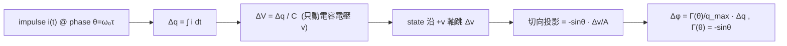

# Lab 02 — 理想 LC 振盪器 toy model：$\Gamma(\theta)=-\sin\theta$ 與電荷線性度

[lab_01](/04_simulation_labs/lab_01_sinusoidal_oscillator) 給了幾何直覺：相位＝切向、振幅＝徑向。
這個 lab 把它**算成一個具體的函數**。對一個理想無耗並聯 LC 振盪器，把 current impulse 注進
電容節點，所造成的永久相位偏移可以**完全解析地**寫出來，得到 ISF：

$$
\Gamma(\theta)=-\sin\theta,\qquad \theta=\omega_0\tau.
$$

這是全站第一個「真的有形狀」的 ISF，且它**不是 toy 假設**而是從 state geometry 推出來的。
我們會 (a) 畫出波形與其 ISF、(b) 用數值模擬驗證 small-signal 下 $\Delta\phi$ 與 $\Delta q$ 嚴格成
正比、(c) 在 state space 看過零注入如何變成「純相位跳變」。

> **物理直覺（先講結論）**：LC 的狀態 $z=(v,w)=A(\cos\theta,\sin\theta)$ 在圓上等速轉。
> current impulse 只把**電容電壓 $v$** 水平推一步 $\Delta v=\Delta q/C$。這一步有多少變成
> 相位、取決於此刻半徑（指向圓心外）與切向（垂直半徑）的夾角。在**波峰**（$\theta=0$，
> $v=A$）這一步完全沿半徑 → 全是振幅；在**過零**（$\theta=\pi/2$，$v=0$）這一步完全沿切向
> → 全是相位。把這個投影寫成相位增量，恰好是 $-\sin\theta$。

## 1. 教學目標

- **從物理導出** 理想 LC 的 ISF $\Gamma(\theta)=-\sin\theta$，不靠背、不靠假設。
- 理解 ISF 的「形狀」如何對應波形：$|\Gamma|$ 最大在過零、為零在波峰。
- 用數值模擬驗證 **small-signal 線性度**：$\Delta\phi=\Gamma\,\Delta q/q_{max}$，即在固定注入相位
  下 $\Delta\phi$ 與 $\Delta q$ 成正比（重現 [P1] Fig. 6 的結論）。
- 在 state space 看見「**過零注入＝沿切向推＝純相位跳變、軌跡半徑不變**」。
- 為 [convolution_derivation](/03_isf_core_theory/convolution_derivation) 與 ISF 的傅立葉
  分解（[lab_05](/04_simulation_labs/lab_05_isf_fourier_coefficients)）準備一個乾淨可解析的範例。

## 2. 數學模型

理想無耗並聯 LC：能量在 $L$、$C$ 之間無損地來回，狀態在 2-D 平面上等速繞圓。寫成
normalized state（$A=1$）：

$$
z(\theta)=(v,\,w)=(\cos\theta,\;\sin\theta),\qquad \theta=\omega_0 t .
$$

- $v$＝電容電壓（$\propto\cos\theta$）；$w$＝（正比於）電感電流（$\propto\sin\theta$）。
- 此處 $\mu=0$（無振幅恢復），對應「marginally stable 的理想 LC」。模擬時為了讓軌跡乾淨地
  停在環上，我們在 (a)(b) 用很小的 $\mu=0.3$（弱恢復），在 (c) 用 $\mu=0$ 看純旋轉。

**impulse → 電壓步階**（[P1] Eq.(9), p.182）：

$$
\Delta V=\frac{\Delta q}{C_{node}}.
$$

它**只動 $v$**（電感電流不能瞬變），即 state 沿 $+v$ 軸跳 $\Delta v=\Delta q/C$。

**把電壓步階投影成相位**。在 $z=(\cos\theta,\sin\theta)$ 處，切向（相位增加方向）的單位向量是
$\hat t=(-\sin\theta,\cos\theta)$。一個沿 $+v$ 軸的步階 $\Delta v\,\hat v=\Delta v\,(1,0)$，其
**切向投影**（除以半徑 $A=1$ 換成角度增量）為：

$$
\Delta\phi=\frac{\hat t\cdot(\Delta v,0)}{A}=\frac{(-\sin\theta)\,\Delta v}{A}=-\sin\theta\;\frac{\Delta v}{A}.
$$

代入 $\Delta v=\Delta q/C$ 並用 $q_{max}=C\cdot A$：

$$
\boxed{\;\Delta\phi=-\sin\theta\;\frac{\Delta q/C}{A}=\frac{-\sin\theta}{C A}\,\Delta q=\frac{\Gamma(\theta)}{q_{max}}\,\Delta q,\qquad \Gamma(\theta)=-\sin\theta.\;}
$$

- **dimension check**：$\Delta\phi$ 是 rad（無因次）；$\Delta q/q_{max}=[\text{C}]/[\text{C}]$ 無因次；
  故 $\Gamma$ 無因次 ✓。$\Gamma$ 是 $2\pi$ 週期，與 [P1] Eq.(10),(11) 的定義一致。
- **物理檢查**：$\theta=0$（波峰）→ $\Gamma=0$（只改振幅，與 lab_01 圖二紅點吻合）；
  $\theta=\pi/2$（上升過零）→ $\Gamma=-1$（$|\Gamma|$ 最大，純相位，與綠點吻合）。負號代表
  「相位被往後推」的方向慣例。

> **toy model 聲明**：理想無耗 LC + 純 2-D 旋轉 + small-signal 投影，是 pedagogical toy model，
> **非 transistor-level**。真實 LC 有有限 $Q$、harmonic、cyclostationary noise，會讓 $\Gamma$
> 偏離乾淨的 $-\sin\theta$（見 [effective_isf](/03_isf_core_theory/effective_isf)）。

## 3. Block diagram



## 4. Python 核心 code

節錄自 `simulations/lab_02_lc_toy_model.py`（已對照原始碼）。理想 LC 的 ISF 直接由
`gamma_lc_ideal`（即 $-\sin\theta$）提供；線性度則靠 `simulate_lc` 在固定過零相位注入不同
$\Delta q/q_{max}$、再用 `excess_phase` 量持續相位偏移：

```python
from oscillator_models import simulate_lc, excess_phase
from simulations.common.isf_utils import gamma_lc_ideal

f0, fs = 1.0, 8000.0
theta = np.linspace(0, 2 * np.pi, 400)

# (a) 波形 cos(theta) 與其 ISF -sin(theta)
V     = np.cos(theta)
Gamma = gamma_lc_ideal(theta)          # = -np.sin(theta)

# (b) 線性度：在過零 (theta=pi/2, ISF=-1) 注入一系列 dq/qmax，量持續 Δφ
dq_list = np.linspace(-0.05, 0.05, 11)            # dq / q_max
T = 1.0 / f0
t_inj = 4 * T + (np.pi / 2) / (2 * np.pi * f0)    # 注入時刻對應 theta=pi/2
t_ref, xr, yr = simulate_lc(f0, 10 * T, fs, mu=0.3)
phi_ref = excess_phase(t_ref, xr, yr, f0)

dphi = []
for dq in dq_list:
    t_p, xp, yp = simulate_lc(f0, 10 * T, fs, mu=0.3,
                              impulse_time=t_inj, impulse_dx=dq)
    phi_p = excess_phase(t_p, xp, yp, f0)
    m = t_p >= (10 * T - T)                        # 取最後一週期的穩定值
    dphi.append(np.mean(phi_p[m] - phi_ref[m]))
# theory: Δφ = Γ·Δq/q_max = -1 · (dq/q_max)
```

`excess_phase` 把載波旋轉 $2\pi f_0 t$ 扣掉，只留擾動造成的相位
（$\phi=\operatorname{unwrap}(\operatorname{atan2}(y,x))-2\pi f_0 t$），這正是 [P1] Eq.(1) 裡的
$\phi(t)$。

## 5. 完整 script path

`simulations/lab_02_lc_toy_model.py`
（依賴 `simulations/common/oscillator_models.py` 的 `simulate_lc`、`excess_phase`；
`simulations/common/isf_utils.py` 的 `gamma_lc_ideal`；`simulations/common/plot_utils.py` 的 `savefig`。）

跑法：`python scripts/run_all_sims.py` 或 `python simulations/lab_02_lc_toy_model.py`。

## 6. 參數表

| 參數 | 程式變數 | 值 | 意義 |
|---|---|---|---|
| 振盪頻率 | `f0` | 1.0（normalized） | 只看形狀，用無因次 |
| 取樣率 | `fs` | 8000 | 每週期 8000 點 |
| 弱振幅恢復 | `mu` | 0.3（(a)(b)）/ 0.0（(c)） | (c) 用純旋轉看相位跳變 |
| 注入電荷掃描 | `dq_list` | $[-0.05,\,0.05]$（$\Delta q/q_{max}$） | small-signal 範圍 |
| 注入相位 | $\theta$ | $\pi/2$（過零，$\Gamma=-1$） | 最大敏感度處量線性度 |
| (c) 注入量 | `impulse_dx` | 0.25 | 稍大以便在圖上看見跳變 |
| 量測窗 | — | 最後 1 個週期 | 取相位偏移的穩定值 |

## 7. 單位表

| 量 | 符號 | 單位 | 備註 |
|---|---|---|---|
| 相位 | $\theta=\omega_0\tau$ | rad | ISF 自變數 |
| ISF | $\Gamma(\theta)=-\sin\theta$ | 無因次 | $2\pi$ 週期 |
| 注入電荷（normalized） | $\Delta q/q_{max}$ | 無因次 | 圖 (b) 橫軸 |
| 持續相位偏移 | $\Delta\phi$ | rad | 圖 (b) 縱軸 |
| state $x,y$ | — | normalized | 圖 (c) 軸 |
| 最大電荷擺幅 | $q_{max}=C A$ | C | normalize 用 |

## 8. 模擬圖


（一張三聯圖：(a) 波形與 ISF；(b) $\Delta\phi$ vs $\Delta q$ 線性度；(c) state-space 過零注入。）

## 9. 如何解讀圖

**(a) 波形與 ISF**：

- 藍線 $V(\theta)=\cos\theta$（tank 電壓），紅線 $\Gamma(\theta)=-\sin\theta$（ISF）。
- 注意兩者**相位差 $90^\circ$**：$V$ 在波峰時 $\Gamma=0$、$V$ 過零時 $|\Gamma|=1$。物理上完全合理
  ——ISF 的大小由**波形斜率**決定（斜率大 = 切向分量大 = 對相位敏感），而 $\cos$ 的斜率就是
  $-\sin$。這正是「對相位最敏感的時刻是過零、最不敏感的是波峰」的圖像。

**(b) 線性度**：

- 紫色圓點是數值模擬量到的持續 $\Delta\phi$，黑色虛線是理論 $\Delta\phi=-\Delta q/q_{max}$
  （因為注入在 $\Gamma=-1$ 處）。兩者在整個 $\pm0.05$ 範圍內**幾乎重合**——這就是 small-signal
  下 $\Delta\phi$ 嚴格正比於 $\Delta q$ 的眼見為憑，重現 [P1] Fig. 6。
- 斜率為 $-1$（不是 $+1$）證實了 $\Gamma(\pi/2)=-1$ 的負號。

**(c) state space**：

- 黑虛線是未擾動的單位圓；綠線是「在過零點被沿切向踢一下」後的軌跡。關鍵觀察：軌跡
  **半徑幾乎不變**（振幅沒被改），但**繞圈的相位被永久挪了一段**——這就是「純相位跳變」。
  對照若注在波峰，會看到半徑先變大再被拉回、相位幾乎不動（讀者可自行把 `t_inj` 改到波峰試）。

## 10. 對應 paper 公式／figure

- **電荷→電壓步階**：[P1] Eq.(9), p.182：$\Delta V=\Delta q/C_{node}$。
- **ISF 脈衝響應與卷積式**：[P1] Eq.(10),(11), p.182：

  

$$
h_\phi(t,\tau)=\frac{\Gamma(\omega_0\tau)}{q_{max}}\,u(t-\tau),\qquad
  \phi(t)=\frac{1}{q_{max}}\int_{-\infty}^{t}\Gamma(\omega_0\tau)\,i_n(\tau)\,d\tau.
$$

- **概念與線性度圖**：[P1] Fig. 4（state-space limit cycle、peak vs zero-crossing 注入）、
  **Fig. 6**（$\Delta\phi$ 與 $\Delta q$ 在小電荷時線性，本 lab (b) 直接重現此結論）、
  **Fig. 7(a)**（LC 的 ISF 形狀，對應本 lab 的 $-\sin\theta$）。本 lab 三張子圖是
  **重畫的 toy 概念圖**（非從論文圖逐點複製，亦非 transistor-level）。
- **操作型 ISF 定義**：$\Delta\phi=\Gamma(\omega_0\tau)\,\Delta q/q_{max}$，完整逐步推導見
  [impulse_to_phase_shift](/03_isf_core_theory/impulse_to_phase_shift)（例 A：$q_{max}=1$ pC、
  $\Delta q=1$ fC、$\Gamma=0.5$、$f_0=5$ GHz → $\Delta\phi=5\times10^{-4}$ rad、$\Delta t=15.9$ fs）。

## 11. 限制與 approximation

- **pedagogical toy model，非 transistor-level**。$\Gamma=-\sin\theta$ 是**理想無耗 LC** 的結果；
  真實 LC 有有限 $Q$、波形含諧波、device noise 是 cyclostationary（隨工作點 gating），實際
  $\Gamma$ 會偏離乾淨的 $-\sin$，需用 transient/adjoint/Floquet 萃取（見
  [effective_isf](/03_isf_core_theory/effective_isf)，相關的 PPV/adjoint **不在下載的 5 篇 PDF
  內**，以標準文獻補充）。
- **small-signal / 線性化**：投影成切向假設 $\Delta q\ll q_{max}$。圖 (b) 只掃到 $\pm0.05\,q_{max}$；
  更大注入會出現 AM–PM、ISF 本身被改變、甚至把振盪器踢出 limit cycle。
- **單一節點、單一注入**：真實電路多節點、各有自己的 $\Gamma$ 與 $q_{max}$；多節點 ISF 討論見
  [isf_definition](/03_isf_core_theory/isf_definition)。
- **數值積分誤差**：`simulate_lc` 用固定步長 RK4，弱 $\mu=0.3$ 會讓相位量測有極小偏差；
  本 lab 取最後一週期平均以降低瞬態殘留。`extract_isf_by_injection` 用更小的
  $\Delta q/q_{max}=10^{-3}$ 掃出整條 $\Gamma(\theta)$，與 $-\sin\theta$ 最大誤差約 0.001
  （見 [lab_04](/04_simulation_labs/lab_04_impulse_injection_sweep)）。

## 重點回顧

- 理想 LC 的 ISF **可解析導出**：$\Gamma(\theta)=-\sin\theta$（由「電壓步階沿切向投影」而來）。
- $|\Gamma|$ 大小 = 波形斜率：過零最敏感（$\Gamma=-1$）、波峰不敏感（$\Gamma=0$）。
- small-signal 下 $\Delta\phi=\Gamma\,\Delta q/q_{max}$，模擬驗證**線性**且斜率 $-1$（[P1] Fig. 6）。
- 過零注入 = 純相位跳變（state 半徑不變、相位永久挪移）。
- 來源：[P1] Eq.(9),(10),(11), p.182；Fig. 4, 6, 7(a)。
