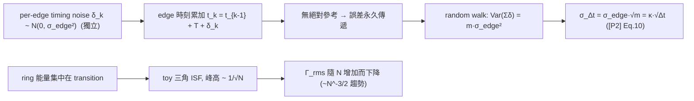

# Lab 03 — Ring 振盪器 toy model：累積 jitter 隨機漫步與 ISF 比較

[lab_02](/04_simulation_labs/lab_02_lc_oscillator_toy_model) 看的是單一 impulse 的相位跳變。
真實世界裡 noise 是**持續**踢的，於是相位誤差會**一步步累積**。Ring oscillator（環形振盪器，
由 $N$ 級反相器接成環、每級延遲 $\tau_D$）是觀察這件事最乾淨的對象，因為它**沒有絕對時間
參考**：每一個 edge（轉態）的時刻都建立在前一個 edge 之上，前面的誤差會**永久傳遞**下去。

這個 lab 做兩件事：(1) 用 edge-time 模型展示**累積 jitter 的隨機漫步**
$\sigma_{\Delta t}=\kappa\sqrt{\Delta t}$（[P2] Eq.(8), p.792；κ 由 Eq.(12), p.793）；(2) 對比 LC 平滑的
$-\sin\theta$ 與 ring「集中在 transition、隨級數 $N$ 變小」的 toy ISF，並指出
**這個 toy model 看得見什麼、看不見什麼**。

> **物理直覺（先講結論）**：每一拍（每個 edge）都被獨立的雜訊踢出一點點 timing error，
> 而且這個 error **加到累積的 edge 時刻上**、永遠不會被修正（開環、無參考）。獨立小步累加
> = **隨機漫步（random walk）**：走 $m$ 步後的位置變異數 $\propto m$，所以標準差 $\propto\sqrt{m}$，
> 也就是時間誤差 $\sigma_{\Delta t}\propto\sqrt{\Delta t}$。這跟「醉漢走路離原點的距離隨步數開根號」
> 是同一回事。

## 1. 教學目標

- 理解 ring 振盪器**沒有絕對時間參考** → 每個 edge 的誤差**持續傳遞** → 形成 random walk。
- 用模擬看 **accumulated（long-term）jitter** $\sigma_{\Delta t}=\kappa\sqrt{\Delta t}$ 的
  $\sqrt{\Delta t}$（斜率 $1/2$，log–log 上）標度（[P2] Eq.(8)）。
- 對比 LC 的平滑 ISF $-\sin\theta$（$\Gamma_{rms}=0.707$）與 ring 的 toy ISF：能量**集中在
  transition**、峰高 $\sim1/\sqrt N$、隨級數 $N$ 增加 $\Gamma_{rms}$ 下降。
- 釐清 toy model 的邊界：**看得見**機制（random walk、ISF 形狀差異），**看不見**真實常數
  （$\kappa$、$\Gamma_{rms}$ 的精確值、correlated noise 的不同標度）。

## 2. 數學模型

**(A) Edge-time 隨機漫步**。把 ring 的輸出抽象成一串轉態時刻 $\{t_k\}$。理想時每拍長度為
週期 $T=1/f_0$；實際每拍加上一個**獨立**的高斯 timing 擾動，標準差 $\sigma_{edge}$：

$$
t_{k}=t_{k-1}+T+\delta_k,\qquad \delta_k\sim\mathcal{N}(0,\sigma_{edge}^2)\ \text{i.i.d.}
$$

於是相隔 $m$ 拍的 edge 時間差 $t_{k+m}-t_k$ 的擾動部分是 $\sum_{j=1}^{m}\delta_j$。獨立相加 →
變異數相加：

$$
\operatorname{Var}\!\Big(\sum_{j=1}^{m}\delta_j\Big)=m\,\sigma_{edge}^2
\;\Longrightarrow\;
\sigma_{\Delta t}(m)=\sigma_{edge}\sqrt{m}.
$$

把步數 $m$ 換成時間 $\Delta t=mT$，即得 [P2] Eq.(8), p.792：

$$
\boxed{\;\sigma_{\Delta t}=\kappa\sqrt{\Delta t}\;},\qquad \kappa=\frac{\sigma_{edge}}{\sqrt{T}}.
$$

- **dimension check**：$[\kappa]=[\text{s}]/[\text{s}]^{1/2}=[\text{s}]^{1/2}=\sqrt{\text{s}}$，
  與 notation 表一致；$\kappa\sqrt{\Delta t}=\sqrt{\text{s}}\cdot\sqrt{\text{s}}=\text{s}$ ✓。
- **關鍵假設**：各拍擾動**互相獨立（uncorrelated）**。論文（[P2] Sec. III, p.793）明確區分：
  thermal noise 這類**不相關**源 → 變異數相加 → $\sigma\propto\sqrt{\Delta t}$（本 lab）；而
  substrate/supply/$1/f$ 這類**完全相關（correlated）**源 → **標準差**相加 →
  $\sigma\propto\Delta t$（本 toy model **不模擬**這支，見第 11 節）。

**(B) Ring vs LC ISF 形狀**。ring 的能量集中在 transition（轉態瞬間斜率最大、最敏感），ISF
不像 LC 的平滑 $-\sin$，而是在每次轉態附近有尖峰。本 lab 用一個**三角波 toy ISF** 來「示意」
這件事，峰高隨級數 $N$ 縮小：

$$
\Gamma_{ring}^{toy}(\theta)\propto\frac{1}{\sqrt N}\times(\text{每半週期一個三角脈衝}).
$$

這呼應 [P2] 主張的 $\Gamma_{rms}\propto N^{-3/4}$ 標度趨勢（越多級、每級對總相位影響越小）。

> **toy model 聲明**：兩部分都是 pedagogical toy model，**非 transistor-level**。隨機漫步用
> 抽象的 per-edge 高斯擾動（不是從 device thermal noise 算出來的）；三角 ISF 只是「能量集中在
> transition」的示意形狀，**不是萃取出來的 ring ISF**，常數待真實萃取驗證。

## 3. Block diagram



## 4. Python 核心 code

節錄自 `simulations/lab_03_ring_toy_model.py`（已對照原始碼）。累積 jitter 用
`accumulated_jitter_curve`（內部對 `n_trials` 個 trial 做 per-period 高斯增量的 `cumsum`，
即隨機漫步），ISF 比較用 `gamma_lc_ideal`、`gamma_triangular`、`gamma_rms`：

```python
from oscillator_models import accumulated_jitter_curve
from simulations.common.isf_utils import gamma_lc_ideal, gamma_triangular, gamma_rms

RNG = np.random.default_rng(12345)

def fig_accumulation():
    f0 = 5e9              # 5 GHz
    sigma_edge = 50e-15   # 每拍 50 fs rms 的獨立 timing 擾動
    # 對 2000 個 trial 做 per-period 高斯增量的 cumsum -> random walk
    lags, sigma_dt = accumulated_jitter_curve(
        f0, sigma_edge, max_lag_periods=500, n_trials=2000, rng=RNG)
    # 模擬點 vs 理論 sigma_edge*sqrt(lags)，在 log-log 上應為斜率 1/2 的直線

def fig_lc_vs_ring_isf():
    theta = np.linspace(0, 2 * np.pi, 1000, endpoint=True)
    g_lc  = gamma_lc_ideal(theta)               # -sin(theta), 平滑
    g_r5  = gamma_triangular(theta, n_stages=5)  # toy 三角, 峰高 ~ 1/sqrt(5)
    g_r15 = gamma_triangular(theta, n_stages=15) # toy 三角, 峰高 ~ 1/sqrt(15)
    # gamma_rms(theta, g_lc)=0.707, g_r5=0.258, g_r15=0.149 -> N↑ 則 rms↓
```

`accumulated_jitter_curve` 的核心就是 `walk = np.cumsum(incr, axis=1)`，再對 trial 取
`np.std`——這把「隨機漫步的變異數隨步數線性成長」直接量出來。

## 5. 完整 script path

`simulations/lab_03_ring_toy_model.py`
（依賴 `simulations/common/oscillator_models.py` 的 `accumulated_jitter_curve`（與 `ring_edge_times`）；
`simulations/common/isf_utils.py` 的 `gamma_lc_ideal`、`gamma_triangular`、`gamma_rms`；
`simulations/common/plot_utils.py` 的 `savefig`。）

跑法：`python scripts/run_all_sims.py` 或 `python simulations/lab_03_ring_toy_model.py`。

## 6. 參數表

| 參數 | 程式變數 | 值 | 意義 |
|---|---|---|---|
| 振盪頻率 | `f0` | $5\times10^{9}$ Hz（5 GHz） | 與全站 canonical $f_0$ 一致 |
| 每拍 timing 擾動 | `sigma_edge` | $50\times10^{-15}$ s（50 fs） | 單拍獨立高斯擾動 rms |
| 最大量測間隔 | `max_lag_periods` | 500 週期（$=100$ ns @ 5 GHz） | 累積到的最長 lag |
| trial 數 | `n_trials` | 2000 | Monte-Carlo 統計樣本 |
| 亂數種子 | `RNG` | 12345 | 結果可重現 |
| LC ISF | `gamma_lc_ideal` | $-\sin\theta$ | $\Gamma_{rms}=0.707$ |
| ring toy ISF（N=5） | `gamma_triangular(.,5)` | 峰高 $1/\sqrt5$ | $\Gamma_{rms}=0.258$ |
| ring toy ISF（N=15） | `gamma_triangular(.,15)` | 峰高 $1/\sqrt{15}$ | $\Gamma_{rms}=0.149$ |

## 7. 單位表

| 量 | 符號 | 單位 | 備註 |
|---|---|---|---|
| 量測間隔 | $\Delta N$（週期）／$\Delta t$（秒） | 週期 / s | $\Delta t=\Delta N\cdot T$ |
| 累積 jitter | $\sigma_{\Delta t}$ | s（圖上 fs） | rms |
| 每拍擾動 | $\sigma_{edge}$ | s | 50 fs |
| 比例常數 | $\kappa$ | $\sqrt{\text{s}}$ | $\kappa=\sigma_{edge}/\sqrt T$ |
| 相位 | $\theta$ | rad | ISF 自變數 |
| ISF | $\Gamma(\theta)$ | 無因次 | LC 與 ring 比較 |
| rms ISF | $\Gamma_{rms}$ | 無因次 | $\sqrt{\frac{1}{2\pi}\int_0^{2\pi}\Gamma^2\,d\theta}$ |
| 級數 | $N$ | 無因次 | ring 反相器級數 |

## 8. 模擬圖

**(圖一) 累積 jitter 的 √Δt 隨機漫步**


**(圖二) LC vs ring ISF 比較**


## 9. 如何解讀圖

**圖一（累積 jitter，log–log）**：

- 藍點是 2000 個 trial 模擬出的 $\sigma_{\Delta t}$，黑虛線是理論
  $\sigma_{\Delta t}=\sigma_{edge}\sqrt{\Delta N}$。兩者貼合成一條**斜率 $1/2$ 的直線**
  （log–log 上 $\sqrt{}$ 就是斜率 $1/2$）——這就是隨機漫步的指紋。
- **數值手感**：$\sigma_{edge}=50$ fs，走 1 拍 $\sigma=50$ fs；走 500 拍
  $\sigma=50\times\sqrt{500}\approx1118$ fs $\approx1.12$ ps（@ 5 GHz，500 拍 $=100$ ns）。
  量測時間拉長 100 倍（1→100 拍），jitter 只長 $\sqrt{100}=10$ 倍——這就是「為什麼開環
  振盪器越跑越偏、但偏得越來越慢」。
- 對照：若是 **PLL 鎖定**，有了絕對參考，累積會被截斷（不在本 toy 範圍）。

**圖二（ISF 比較）**：

- 藍線是 LC 的 $-\sin\theta$，平滑、$\Gamma_{rms}=0.707$。紅線（N=5）與綠線（N=15）是 ring 的
  toy 三角 ISF：**能量集中在 transition**（每半週期一個尖峰），且**峰越來越矮**。
- 讀出的 $\Gamma_{rms}$：LC $=0.707$、ring N=5 $=0.258$、ring N=15 $=0.149$。**級數 $N$ 越大、
  $\Gamma_{rms}$ 越小**——這定性地呼應 [P2] 的 $\Gamma_{rms}\propto N^{-3/4}$ 趨勢（更多級，
  每級對總相位的權重被攤薄）。因為 $1/f^2$ phase noise $\propto\Gamma_{rms}^2/q_{max}^2$
  （[P1] Eq.(21)），這解釋了「設計上 ring 的級數/功耗如何影響相位雜訊」（見
  [lc_vs_ring](/06_design_insights/lc_vs_ring)）。
- 注意：本 toy 三角的**絕對峰高與精確 $N^{-3/2}$ 係數未經真實萃取驗證**，只示意趨勢。

## 10. 對應 paper 公式／figure

- **累積 jitter（核心）**：[P2] Eq.(8), p.792：

  

$$
\sigma_{\Delta t}=\kappa\sqrt{\Delta t}.
$$

  論文 [P2] Sec. III（p.793）的敘述明確說明：因為「任何較早 transition 的不確定性會影響其後
  所有 transition，且其效應 persists indefinitely」，故 uncorrelated 源下變異數相加、
  $\sigma\propto\sqrt{\Delta t}$；本 lab 圖一直接重現此式（對照 [P2] Fig. 3、Fig. 4 的
  「rms jitter vs 量測時間 log–log」概念）。
- **相關源的另一支**：[P2] 同節指出 correlated 源（substrate/supply/$1/f$）下**標準差相加**，
  $\sigma\propto\Delta t$（斜率 1，非 1/2）。本 toy **只模擬 uncorrelated**。
- **ring 頻率**（背景）：[P2] Eq.(14), p.794：$f_0=\dfrac{1}{2N\tau_D}$。
- **$\Gamma_{rms}$ 標度**：[P2] Eq.(16), p.794：$\Gamma_{rms}\propto N^{-3/4}$（⚠️常數待查，
  本 lab 只定性呼應；對照 [P2] Fig. 8 的 $\Gamma_{rms}$ vs $N$）。本 lab 兩張圖為
  **重畫的 toy 概念圖**（非從論文圖逐點複製、非 transistor-level）。
- **與 phase noise 連結**：$\Gamma_{rms}$ 透過 [P1] Eq.(21), p.185 影響 $1/f^2$ phase noise。

## 11. 限制與 approximation — toy model 看得見/看不見什麼

**看得見（這個 toy model 教得對的機制）**：

- 開環振盪器**無絕對時間參考** → 誤差永久傳遞 → 累積 jitter 的 **random walk 本質**。
- uncorrelated noise 下 $\sigma_{\Delta t}\propto\sqrt{\Delta t}$（log–log 斜率 $1/2$）。
- ring ISF **能量集中在 transition** 的定性形狀，與 LC 平滑 $-\sin$ 的對比。
- $N$ 越大 $\Gamma_{rms}$ 越小的**趨勢方向**。

**看不見（toy model 抓不到、需 transistor-level / 真實萃取的東西）**：

- **真實的 $\kappa$、$\sigma_{edge}$**：本 lab 的 50 fs 是手放的數字，**不是**從 device thermal
  noise + $\Gamma$ + $q_{max}$ 算出來的（那要 [P1] Eq.(21) 與真實 ISF）。
- **correlated noise 的不同標度**：substrate/supply/$1/f$ 造成 $\sigma\propto\Delta t$（斜率 1），
  本模型**完全不含**這支；真實 ring 兩種趨勢都會出現（[P2] Sec. III）。
- **精確的 $\Gamma_{rms}\propto N^{-3/4}$ 常數**與真實 ring ISF 形狀：三角波只是示意，
  真實 ISF 要靠 transient/adjoint 萃取（相關的 PPV/adjoint/Floquet **不在下載的 5 篇 PDF 內**，
  以標準文獻補充，見 [effective_isf](/03_isf_core_theory/effective_isf)）。
- **flicker（$1/f$）upconversion 與 cyclostationary**：本 lab 的 per-edge 擾動是純白、對稱，
  不含 $1/f^3$ close-in 行為（見 [lab_07](/04_simulation_labs/lab_07_flicker_noise_upconversion)）。
- **small-lag 飽和**：[P2] 註腳提到更精確處理下 phase noise 在 $f_0\to0$ 不會無限成長（會變平），
  本隨機漫步在大 lag 不含此修正——但如論文所言，對本討論「無實際差別」。

## 重點回顧

- ring 無絕對時間參考 → 誤差永久傳遞 → 累積 jitter 是 **random walk**。
- uncorrelated noise：$\sigma_{\Delta t}=\kappa\sqrt{\Delta t}$（[P2] Eq.(8)）；模擬 log–log
  斜率 $1/2$，50 fs/拍 → 500 拍 ≈ 1.12 ps。
- correlated noise 則 $\sigma\propto\Delta t$（本 toy 不含）。
- ring ISF 集中在 transition、峰高 $\sim1/\sqrt N$；$\Gamma_{rms}$（LC 0.707 → ring N=5 0.258
  → N=15 0.149）隨 $N$ 下降，呼應 $\Gamma_{rms}\propto N^{-3/4}$。
- 來源：[P2] Eq.(8),(14),(16)、Sec. III、Fig. 3,4,8；連結 [P1] Eq.(21)。
