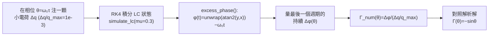

# Lab 04 — impulse injection sweep 與 LTI vs LTV

這個 lab 把 [impulse_to_phase_shift](/03_isf_core_theory/impulse_to_phase_shift) 裡那條
「操作型 ISF 定義」當成**可量測的實驗**：在波形的不同相位 $\theta=\omega_0\tau$ 注一顆很小的
電荷脈衝，量它造成的**持續**（permanent）相位偏移，把這個偏移除以注入量，就**反推**出
ISF（impulse sensitivity function，脈衝敏感度函數——振盪器在哪個相位最怕被踢）。

跑出來的數值 ISF 與理想 LC 的解析解 $\Gamma(\theta)=-\sin\theta$ 幾乎重合（最大誤差約
$7\times10^{-4}$）。同一個 lab 還用脈衝響應把 **LTI（線性非時變）vs LTV（線性時變，linear
time-variant，系統參數隨時間週期變化）** 的差別畫出來——這是整個 ISF 理論為什麼「不能用一般
LTI transfer function 處理 oscillator phase」的關鍵。

> **這個 lab 想讓你「眼見為憑」的兩件事**：(1) ISF 不是抽象定義，而是「在相位 $\theta$ 踢一下、
> 量持續相位跳變」這個動作的結果；(2) 同樣大小的一顆脈衝，在波峰踢幾乎不改相位、在零交越
> （zero crossing）踢造成最大相位跳——這個「踢的效果隨注入時刻週期變化」就是 LTV，
> 用一條只依賴 $t-\tau$ 的 LTI 脈衝響應永遠畫不出來。

## 1. 教學目標

- 把 ISF 的操作型定義 $\Delta\phi=\dfrac{\Gamma(\omega_0\tau)}{q_{max}}\,\Delta q$ 變成一個
  **數值實驗流程**：掃描注入相位 → 量持續相位 → 反推 $\Gamma$。
- 驗證理想 LC 振盪器（current 注入電容節點）的 ISF 就是 $\Gamma(\theta)=-\sin\theta$，
  並量化數值與理論的誤差（~$10^{-3}$ 量級）。
- 看懂「持續相位偏移」與「會衰減的振幅擾動」的差別——只有切向（相位）分量永久殘留。
- 用脈衝響應對照圖，建立 **LTV** 的物理圖像：階高（step height）隨注入相位週期變化。
- 對應 [P1] Eq.(10),(11) 與 Fig. 4。

## 2. 數學模型

整個 lab 站在這條 LTV 脈衝響應上（[P1] Eq.(10), p.182）：

$$
h_\phi(t,\tau)=\frac{\Gamma(\omega_0\tau)}{q_{max}}\,u(t-\tau)
$$

它的意思是：在時刻 $\tau$（對應相位 $\omega_0\tau$）注入單位電荷，會讓相位**一步跳到**
$\Gamma(\omega_0\tau)/q_{max}$，並且因為有 unit step $u(t-\tau)$ 而**永久保持**。把它對所有過去
noise 電流疊加就是中央的 LTV phase response（[P1] Eq.(11), p.182）：

$$
\phi(t)=\frac{1}{q_{max}}\int_{-\infty}^{t}\Gamma(\omega_0\tau)\,i_n(\tau)\,d\tau
$$

**反推 ISF 的單脈衝實驗**：若 $i_n$ 只是一顆位於相位 $\theta$ 的窄脈衝、總電荷 $\Delta q$，
Eq.(11) 退化成單一步階（[P1] Eq.(10) 的 step 版本，亦見 impulse_to_phase_shift 的操作型定義）：

$$
\Delta\phi(\theta)=\frac{\Gamma(\theta)}{q_{max}}\,\Delta q
\quad\Longrightarrow\quad
\Gamma(\theta)=\frac{\Delta\phi(\theta)}{\Delta q/q_{max}} .
$$

- **dimension check**：右邊 $[\text{rad}]/(\text{C}/\text{C})=[\text{rad}]$ 看似有單位，
  但 $\Delta\phi$ 是 rad（無因次），$\Delta q/q_{max}$ 無因次，所以 $\Gamma$ 無因次 ✓。
- **理論對照**：理想無損並聯 LC、電流注入電容節點時，狀態 $z=(v,w)=A(\cos\theta,\sin\theta)$，
  一顆電荷脈衝把 $v$ 推 $\Delta v=\Delta q/C$，投影到 limit cycle 切向得
  $\Delta\phi=-(\sin\theta)\,\Delta v/A$，配合 $q_{max}=CA$ 得到

$$
\boxed{\ \Gamma(\theta)=-\sin\theta\ }
$$

  在波峰 $\theta=0$ 處 $\Gamma=0$（純改振幅），在零交越 $\theta=\pi/2$ 處 $|\Gamma|$ 最大
  （純改相位）。完整幾何推導見 [isf_definition](/03_isf_core_theory/isf_definition)。

**LTV vs LTV 的數學差異**：LTI 系統的脈衝響應只依賴時間差 $h(t,\tau)=h(t-\tau)$；而
oscillator 的 phase 脈衝響應 $h_\phi(t,\tau)$ **顯式依賴絕對注入時刻 $\tau$**（透過
$\Gamma(\omega_0\tau)$ 這個 $2\pi$ 週期權重），這正是 LTV 的定義。

## 3. Block diagram



## 4. Python 核心 code

反推 ISF 的核心在 `extract_isf_by_injection`：對每個相位 $\theta$ 各跑一次注入模擬，
量「最後一個週期」相對無注入參考軌跡的平均相位差（這樣只留下永久的相位、濾掉已衰減的
振幅擾動），再除以 $\Delta q/q_{max}$。以下逐字引用真實程式碼
（`simulations/common/oscillator_models.py`）：

```python
def extract_isf_by_injection(f0, fs, n_inject_periods=6, settle_periods=4,
                             dq_over_qmax=1e-3, n_points=64, mu=0.3):
    T = 1.0 / f0
    settle = settle_periods * T
    t_end = (settle_periods + n_inject_periods) * T
    thetas = np.linspace(0.0, TWO_PI, n_points, endpoint=False)
    gamma_num = np.zeros(n_points)

    # Reference (no impulse), started from the limit cycle.
    t_ref, xr, yr = simulate_lc(f0, t_end, fs, mu=mu, x0=1.0, y0=0.0)
    phi_ref = excess_phase(t_ref, xr, yr, f0)

    for i, th in enumerate(thetas):
        t_inj = settle + th / (TWO_PI * f0)  # phase th occurs at this time
        t_p, xp, yp = simulate_lc(f0, t_end, fs, mu=mu, x0=1.0, y0=0.0,
                                  impulse_time=t_inj, impulse_dx=dq_over_qmax)
        phi_p = excess_phase(t_p, xp, yp, f0)
        # persistent phase difference measured over the last period
        m = t_p >= (t_end - T)
        dphi = np.mean(phi_p[m] - phi_ref[m])
        gamma_num[i] = dphi / dq_over_qmax

    gamma_analytic = -np.sin(thetas)
    return thetas, gamma_num, gamma_analytic
```

LTV vs LTV 對照圖的核心，把「LTI 階高固定、只平移」與「LTV 階高 $=\Gamma(\omega_0\tau)$
隨注入相位變」並排畫（`simulations/lab_04_impulse_sweep.py`）：

```python
    # LTV (oscillator phase): step of height Gamma(w0 tau)/qmax * u(t - tau).
    ax = axes[1]
    for tau, c in zip([0.0, 0.25, 0.5], ["tab:blue", "tab:orange", "tab:green"]):
        gamma = -np.sin(2 * np.pi * f0 * tau)  # ISF at injection phase
        h = gamma * (t >= tau)
        ax.plot(t, h, color=c,
                label=fr"$\tau={tau}$, $\Gamma=-\sin(2\pi\tau)={gamma:+.2f}$")
```

- **為何量「最後一個週期的平均」**：注入瞬間的暫態裡同時有振幅擾動與相位跳變；
  `mu=0.3` 的 Van der Pol 型 amplitude restoration 會把徑向（振幅）分量在幾個週期內拉回
  limit cycle，只剩切向（相位）分量永久殘留。等 `n_inject_periods` 個週期後再量，量到的
  就是乾淨的持續相位。
- **為何用 `endpoint=False`**：$\theta=0$ 與 $\theta=2\pi$ 是同一個相位，掃描時不重複。
- **為何 `dq_over_qmax=1e-3` 很小**：保持小訊號線性（$\Delta q\ll q_{max}$），否則 ISF 本身
  會被大注入改變，反推就不準。

## 5. 完整 script path

`simulations/lab_04_impulse_sweep.py`
（呼叫 `simulations/common/oscillator_models.py` 的 `simulate_lc`、`excess_phase`、
`extract_isf_by_injection`；繪圖工具 `simulations/common/plot_utils.py`）。
跑法：`python scripts/run_all_sims.py`，圖會輸出到 `static/figures/`。

## 6. 參數表

| 參數 | 程式變數 | 值 | 說明 |
|---|---|---|---|
| 振盪頻率 | `f0` | 1.0（normalized） | toy model 用無因次頻率；真實對應 5 GHz 見下表單位欄 |
| 取樣率 | `fs` | 8000（sweep）/ 2000（LTV 圖） | 每週期 $fs/f_0$ 點，足夠解析切向投影 |
| 注入電荷比 | `dq_over_qmax` | $10^{-3}$ | $\Delta q/q_{max}$，保持小訊號 |
| 掃描點數 | `n_points` | 48 | 一個週期內取 48 個注入相位 |
| 注入後觀察 | `n_inject_periods` | 6 | 注入後再跑 6 週期讓振幅擾動衰減 |
| settle 週期 | `settle_periods` | 4 | 先讓系統落到 limit cycle 再開始注入 |
| restoration 強度 | `mu` | 0.3 | Van der Pol 型振幅恢復；$\mu=0$ 為理想無損 LC |
| LTV 圖注入相位 | `tau` | 0.0, 0.25, 0.5（週期） | 對應 $\Gamma=-\sin(2\pi\tau)=0,-1,0$ |

## 7. 單位表

| 量 | 符號 | toy model 單位 | 對應物理單位 |
|---|---|---|---|
| 時間 | $t,\tau$ | 週期（normalized） | s |
| 注入相位 | $\theta=\omega_0\tau$ | rad（$2\pi$ 週期） | rad |
| 注入電荷比 | $\Delta q/q_{max}$ | 無因次 | C/C |
| 持續相位 | $\Delta\phi$ | rad | rad |
| ISF | $\Gamma(\theta)$ | 無因次 | — |
| 最大誤差 | $\max\vert \Gamma_{num}-\Gamma_{ana}\vert $ | 無因次 | — |

> **toy model 註記**：這是 pedagogical toy model（2-D Van der Pol 型 state-space），**非
> transistor-level**。它忠實重現 ISF 的*機制*（切向投影、$-\sin\theta$、LTV），但不產生真實
> 電路的數值。換算成物理手感時，套 canonical 例 A：$q_{max}=1$ pC、$\Delta q=1$ fC
> （即 $\Delta q/q_{max}=10^{-3}$）、$\Gamma=0.5$、$f_0=5$ GHz $\Rightarrow$
> $\Delta\phi=5\times10^{-4}$ rad、$\Delta t=15.9$ fs。

## 8. 模擬圖

**圖 1：相位偏移隨注入相位變化**——同一顆 $\Delta q/q_{max}=10^{-3}$ 的脈衝，在不同相位踢，
造成的持續 $\Delta\phi$ 完全不同：


**圖 2：數值反推的 ISF vs 理論 −sinθ**——把上圖縱軸除以 $\Delta q/q_{max}$ 就是 ISF 本身，
數值點（紫圈）與理論虛線幾乎重合：


**圖 3：LTI vs LTV 脈衝響應**——上圖 LTI 同形狀只平移；下圖 LTV 階高隨注入相位變：


## 9. 如何解讀圖

**圖 1（phase sweep）**：橫軸是注入相位 $\theta/2\pi$（一個週期），縱軸是持續相位偏移
$\Delta\phi$。注意它是一條 $-\sin$ 形狀的曲線：在 $\theta=0$（波峰）幾乎為零、在
$\theta\approx0.25$（上升零交越）為最大負值、$\theta\approx0.75$ 為最大正值。**這就是 LTV
的直接證據**——「踢同一下」的效果完全取決於「在波形哪裡踢」。數值藍圈緊貼黑色理論虛線。

**圖 2（recovered ISF）**：把圖 1 除以 $\Delta q/q_{max}=10^{-3}$ 後得到的就是 $\Gamma(\theta)$。
標題顯示最大絕對誤差約 $7\times10^{-4}$（標題格式化為三位小數，約 0.001）。誤差來源是 RK4
時間離散、$\theta$ 取樣（48 點）、以及量測窗只取最後一個週期的平均。這個量級足以宣稱
「數值法成功還原了理想 LC 的 $\Gamma=-\sin\theta$」。

**圖 3（LTI vs LTV）**：
- 上半（LTI）：三條曲線是同一個衰減指數脈衝響應在 $\tau=0.3,0.9,1.5$ 平移——**形狀完全相同**，
  只是起點不同。這是 LTI 的招牌：$h(t,\tau)=h(t-\tau)$。
- 下半（LTV phase）：三條都是 unit step（永久保持），但**階高不同**：$\tau=0$ 時
  $\Gamma=-\sin(0)=0$（踢在波峰，相位不動）；$\tau=0.25$ 時 $\Gamma=-\sin(\pi/2)=-1$
  （踢在零交越，相位跳最多）；$\tau=0.5$ 時 $\Gamma=-\sin(\pi)=0$。**階高隨絕對注入相位變**
  ——這就是 LTV，也是為什麼不能用單一 LTI transfer function 描述 oscillator phase 的根本原因。

## 10. 對應 paper 公式 / figure

- **[P1] Eq.(10), p.182**：$h_\phi(t,\tau)=\dfrac{\Gamma(\omega_0\tau)}{q_{max}}\,u(t-\tau)$
  ——圖 3 下半每條曲線就是這條（不同 $\tau$ 給不同階高 $\Gamma(\omega_0\tau)$）。
- **[P1] Eq.(11), p.182**：$\phi(t)=\dfrac{1}{q_{max}}\displaystyle\int_{-\infty}^{t}\Gamma(\omega_0\tau)\,i_n(\tau)\,d\tau$
  ——本 lab 是它的單脈衝特例（反推 $\Gamma$ 的基礎）。
- **[P1] Fig. 4, p.181**：caption「(a) impulse injected at the peak, (b) impulse injected at the
  zero crossing, and (c) effect of nonlinearity on amplitude and phase ... in state-space」——示範脈衝
  在波峰 vs 零交越注入的差別，以及非線性對振幅／相位的影響（state-space 圖）。本 lab 的圖 1/圖 2 是它
  在理想 LC 上的 toy-model 重現
  （TODO: 僅 Fig. 4 的精確軸刻度數值尚未逐字轉錄，請對照 [P1] p.181 原圖）。
- ISF 的 $-\sin\theta$ 幾何推導：見 [isf_definition](/03_isf_core_theory/isf_definition)；
  操作型定義與 16 fs 數值例：[impulse_to_phase_shift](/03_isf_core_theory/impulse_to_phase_shift)。

## 11. 限制與 approximation

| 限制 / 近似 | 影響 | 在哪裡成立 / 失效 |
|---|---|---|
| 2-D Van der Pol toy model（非 transistor-level） | 只重現機制，不給真實電路數值 | 教學足夠；做 design 要 transient/adjoint 萃取 $\Gamma$ |
| 小訊號 $\Delta q/q_{max}=10^{-3}$ | $\Delta\phi$ 線性正比 $\Delta q$ | 大注入 → 非線性、AM–PM、$\Gamma$ 本身被改 |
| 用 `mu=0.3` 讓振幅擾動衰減後才量 | 才能分離出純相位分量 | 若 $\mu$ 太小、振幅擾動沒衰減完，量到的 $\Delta\phi$ 會被殘留振幅污染 |
| RK4 + 有限 `fs` 離散 | 帶來 ~$10^{-3}$ 數值誤差 | 提高 `fs`/`n_points` 可再降，但本 lab 量級已足夠 |
| 理想無損 LC 的 $\Gamma=-\sin\theta$ | 只對單一電容節點注入成立 | 多節點、ring、含損耗時 ISF 形狀不同（見 [lab_05](/04_simulation_labs/lab_05_isf_fourier_coefficients) 與 ring 模型） |
| LTI 對照曲線是示意指數衰減 | 只為對比「形狀不變」 | 它不是任何真實電路的脈衝響應，純為教學對照 |

## 重點回顧

- ISF 是**可量測**的：在相位 $\theta$ 注小電荷、量持續 $\Delta\phi$、除以 $\Delta q/q_{max}$。
- 理想 LC（電容節點注入）反推出的 ISF 就是 $\Gamma(\theta)=-\sin\theta$，數值與理論最大誤差 ~$10^{-3}$。
- 波峰注入 → 純改振幅（會被拉回）；零交越注入 → 純改相位（永久殘留）。
- LTV 的本質：phase 脈衝響應 $h_\phi(t,\tau)$ 依賴**絕對注入相位**，階高 $=\Gamma(\omega_0\tau)$，不只依賴 $t-\tau$。
- 來源：[P1] Eqs.(10),(11), p.182 與 Fig. 4。

## 延伸閱讀

- 操作型定義與物理直覺：[impulse_to_phase_shift](/03_isf_core_theory/impulse_to_phase_shift)
- $-\sin\theta$ 的幾何推導：[isf_definition](/03_isf_core_theory/isf_definition)
- 把 ISF 拆成傅立葉係數：[lab_05](/04_simulation_labs/lab_05_isf_fourier_coefficients)
- 數值換算手感：[numerical_feeling](/04_simulation_labs/numerical_feeling)
