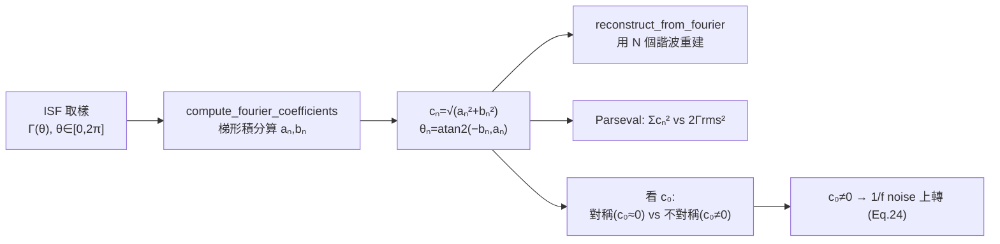

# Lab 05 — ISF 的傅立葉係數與 Parseval

ISF 是一個 $2\pi$ 週期函數，所以可以拆成傅立葉級數。**為什麼要拆？** 因為相位雜訊
（phase noise）公式裡出現的是 ISF 的傅立葉係數 $c_n$，而不是 $\Gamma$ 本身：
$c_0$（DC 係數）決定 1/f noise 會不會被上轉（upconvert）成 close-in 相位雜訊；$c_n$
決定 $n\omega_0$ 附近的雜訊被搬到 carrier 的權重；全部係數的平方和經 Parseval（帕塞瓦定理，
時域能量 = 頻域能量）等於 $2\Gamma_{rms}^2$，而 $\Gamma_{rms}$ 直接決定 1/f² 相位雜訊大小。

這個 lab 做三件事：(1) 算一個 ISF 的 $c_n$ 並用 1、2、4 個諧波重建它；(2) 畫係數頻譜並
數值驗證 Parseval 關係；(3) 把對稱（$c_0=0$）與不對稱（$c_0\neq0$）ISF 並排，說明只有
$c_0\neq0$ 才會把 1/f noise 上轉。

> **物理直覺**：把 ISF 想成「振盪器這台混頻器的本地振盪（LO）波形」。noise 不是直接進相位的；
> 它先被 ISF 在頻域「梳子般」採樣——$n\omega_0$ 附近的 noise 各自被 $c_n$ 加權、下變頻到
> carrier 附近。所以**ISF 的形狀（它的諧波內容）才是設計師能動的旋鈕**：把波形做對稱
> （壓 $c_0$）就能壓 1/f³；把整體 $\Gamma_{rms}$ 做小就能壓 1/f²。

## 1. 教學目標

- 把 ISF 寫成傅立葉級數 $\Gamma(\omega_0\tau)=\dfrac{c_0}{2}+\sum_n c_n\cos(n\omega_0\tau+\theta_n)$，
  並理解每個係數的物理角色。
- 用數值積分算出一個給定 ISF 的 $c_n$，並示範「諧波越多、重建越逼近」。
- 用 Parseval 關係 $\sum_n c_n^2=2\Gamma_{rms}^2$ 把「頻域係數」與「時域 rms」連起來，
  並**誠實面對**半幅（half-amplitude）慣例下 DC 項的記帳陷阱。
- 看懂 $c_0$（= ISF 的平均值 × 2）為何是 1/f noise 上轉的「閘門」：對稱波形 $c_0\approx0$
  → 1/f³ corner 被推到很低。
- 對應 [P1] Eq.(12),(20),(24)。

## 2. 數學模型

**ISF 傅立葉級數**（[P1] Eq.(12), p.183）：

$$
\Gamma(\omega_0\tau)=\frac{c_0}{2}+\sum_{n=1}^{\infty}c_n\cos(n\omega_0\tau+\theta_n)
$$

- $c_0/2$ 是 ISF 的**平均值（DC 值）**。注意 factor of 2：傅立葉係數叫 $c_0$，但 ISF 的
  DC*值*是 $c_0/2$。這個 factor 在算 1/f³ corner 時極易出錯（見 [notation](/00_overview/notation) 的符號陷阱）。
- $c_n,\theta_n$ 是第 $n$ 諧波的幅度與相位；$c_n=\sqrt{a_n^2+b_n^2}$，
  $\theta_n=\operatorname{atan2}(-b_n,a_n)$，其中 $a_n,b_n$ 是標準 cos/sin 係數。
- **dimension check**：$\Gamma$ 無因次，cos 無因次，所以每個 $c_n$ 無因次 ✓。

**Parseval / rms ISF**（[P1] Eq.(20), p.185）：

$$
\sum_{n=0}^{\infty}c_n^2=\frac{1}{\pi}\int_0^{2\pi}|\Gamma(x)|^2dx=2\,\Gamma_{rms}^2
$$

它把「所有諧波平方和」與「ISF 的均方 × 2」連起來。物理上：白噪相位雜訊正比於
$\sum c_n^2=2\Gamma_{rms}^2$（[P1] Eq.(19) → Eq.(21)），所以只要知道 $\Gamma_{rms}$
就能算 1/f² 相位雜訊，不必逐一追蹤每個諧波。

> **半幅慣例的記帳陷阱（本 lab 會親眼看到）**：Eq.(20) 左邊的 $c_0$ 必須與 Eq.(12) 的
> $c_0$ 用同一個定義。本 lab 的 `compute_fourier_coefficients` 回傳 `c[0] = |a0|`，其中
> $a_0=2\times(\text{DC 值})$，亦即 $c_0=a_0$。對一個 DC 值不為零的 ISF，直接把
> `c[0]**2` 丟進 $\sum c_n^2$ 會把 DC 能量**多算一次**（因為 cos 項用半幅、DC 項用全幅，
> 兩者平方權重不同）。這正是下面 Parseval 數值會有 ~10% 落差的原因——我們選擇**照實呈現**
> 而非把它藏起來。

**1/f³ corner**（[P1] Eq.(24), p.185，說明 $c_0$ 為何重要）：

$$
\Delta\omega_{1/f^3}=\omega_{1/f}\cdot\frac{c_0^2}{2\,\Gamma_{rms}^2}\approx\omega_{1/f}\left(\frac{c_0}{c_1}\right)^2
$$

$c_0\to0$（對稱波形）$\Rightarrow$ 1/f³ corner $\to0$，close-in 相位雜訊乾淨。

## 3. Block diagram



## 4. Python 核心 code

傅立葉係數用梯形積分直接算（`simulations/common/isf_utils.py`，逐字引用）：

```python
def compute_fourier_coefficients(theta, gamma, n_harmonics):
    theta = np.asarray(theta, dtype=float)
    gamma = np.asarray(gamma, dtype=float)

    a0 = (1 / np.pi) * _trapz(gamma, theta)
    a = np.zeros(n_harmonics + 1)
    b = np.zeros(n_harmonics + 1)

    for n in range(1, n_harmonics + 1):
        a[n] = (1 / np.pi) * _trapz(gamma * np.cos(n * theta), theta)
        b[n] = (1 / np.pi) * _trapz(gamma * np.sin(n * theta), theta)

    c = np.sqrt(a ** 2 + b ** 2)
    c[0] = abs(a0)  # c0 magnitude (the DC coefficient)
    phase = np.arctan2(-b, a)

    return a0, a, b, c, phase
```

rms 與 Parseval 檢查（`simulations/lab_05_fourier_isf.py` 的 `fig_coefficients`）：

```python
    a0, a, b, c, ph = compute_fourier_coefficients(theta, g, n_harmonics=8)

    # check Parseval: sum c_n^2 ?= 2 Gamma_rms^2
    parseval_lhs = c[0] ** 2 + np.sum(c[1:] ** 2)
    grms = gamma_rms(theta, g)
```

本 lab 用的範例 ISF（刻意做成不對稱，讓多個諧波都非零；`+0.25` 製造非零 $c_0$）：

```python
def make_isf(theta):
    """A richer asymmetric ISF so several harmonics are non-trivial."""
    return (-np.sin(theta) + 0.35 * np.sin(2 * theta)
            + 0.18 * np.cos(3 * theta) + 0.25)  # the +0.25 sets a non-zero c0
```

對稱 vs 不對稱對照（`fig_symmetric_vs_asymmetric`）：

```python
    g_sym = np.cos(theta)               # c0 = 0 (symmetric)
    g_asym = gamma_asymmetric(theta, alpha=0.4)  # c0 = 2*alpha = 0.8
```

- **為何 `theta` 要含端點 `endpoint=True` 跨整個 $[0,2\pi]$**：梯形法要算
  $\frac{1}{\pi}\int_0^{2\pi}$ 才會給正確係數；少一個端點積分區間就不完整。
- **`gamma_rms` 怎麼算**：$\Gamma_{rms}=\sqrt{\frac{1}{2\pi}\int_0^{2\pi}\Gamma^2\,d\theta}$，
  與 Eq.(20) 右邊一致。

## 5. 完整 script path

`simulations/lab_05_fourier_isf.py`
（呼叫 `simulations/common/isf_utils.py` 的 `compute_fourier_coefficients`、
`reconstruct_from_fourier`、`gamma_rms`、`gamma_asymmetric`；繪圖
`simulations/common/plot_utils.py`）。跑法：`python scripts/run_all_sims.py`。

## 6. 參數表

| 參數 | 程式變數 | 值 | 說明 |
|---|---|---|---|
| 相位取樣 | `theta` | `linspace(0,2π,2000,endpoint=True)` | 一個完整週期、含端點 |
| 最高諧波 | `n_harmonics` | 8 | 算到 $c_8$ |
| 範例 ISF | `make_isf` | $-\sin\theta+0.35\sin2\theta+0.18\cos3\theta+0.25$ | 不對稱、含 DC |
| 重建諧波數 | `N` | 1, 2, 4 | 展示逐步逼近 |
| 對稱 ISF | `g_sym` | $\cos\theta$ | $c_0=0$ |
| 不對稱 ISF | `g_asym` | $\cos\theta+0.4$ | $c_0=2\times0.4=0.8$ |

**本 lab 算出的關鍵數字**（canonical，下面解讀圖會用到）：

| 量 | 值 | 來源 |
|---|---|---|
| $c_0$（範例 ISF） | $0.5$（故 DC 值 $=c_0/2=0.25$） | `+0.25` 項 → $a_0=0.5$ |
| $c_1$ | $1.0$（來自 $-\sin\theta$） | |
| $c_2$ | $0.35$（來自 $0.35\sin2\theta$） | |
| $c_3$ | $0.18$（來自 $0.18\cos3\theta$） | |
| $\Gamma_{rms}$ | $0.8$ | `gamma_rms(theta,g)` |
| $\sum c_n^2$（程式式） | $1.405$ | `c[0]**2+sum(c[1:]**2)` |
| $2\Gamma_{rms}^2$ | $1.280$ | 理論右邊 |
| 對稱 / 不對稱 $c_0$ | $0.0$ / $0.8$ | |

## 7. 單位表

| 量 | 符號 | 單位 |
|---|---|---|
| 注入相位 | $\theta=\omega_0\tau$ | rad（$2\pi$ 週期） |
| ISF | $\Gamma(\theta)$ | 無因次 |
| 傅立葉係數 | $c_n,a_n,b_n$ | 無因次 |
| 諧波相位 | $\theta_n$ | rad |
| ISF rms | $\Gamma_{rms}$ | 無因次 |
| 諧波編號 | $n$ | 無因次（整數） |

> **toy model 註記**：`make_isf`、`gamma_symmetric`、`gamma_asymmetric` 都是 pedagogical
> toy ISF，**非 transistor-level** 萃取結果。它們存在的目的是把「$c_n$ 怎麼算、Parseval
> 怎麼對、$c_0$ 怎麼影響上轉」這些*機制*講清楚。真實 ISF 要靠 transient/adjoint 模擬萃取
> （見 [effective_isf](/03_isf_core_theory/effective_isf)）。

## 8. 模擬圖

**圖 1：傅立葉重建**——黑線是原始 ISF，彩線是用 $N=1,2,4$ 個諧波的重建，諧波越多越貼：


**圖 2：係數頻譜與 Parseval**——bar 高度是 $|c_n|$，標題列出 $c_0$、$\Gamma_{rms}$、
$\sum c_n^2$ 與 $2\Gamma_{rms}^2$：


**圖 3：對稱 vs 不對稱 ISF 的 $c_0$**——綠線 $\cos\theta$（$c_0=0$）對稱於零；紅線
$\cos\theta+0.4$ 整條被抬起、DC 值 $=c_0/2=0.4$：


## 9. 如何解讀圖

**圖 1（reconstruction）**：原始 ISF 含 $\sin\theta,\sin2\theta,\cos3\theta$ 三個諧波加 DC。
$N=1$ 只抓主諧波（$-\sin\theta$ 那條），明顯偏離；$N=2$ 把二次諧波補上、形狀大致對；$N=4$
已含全部非零諧波，幾乎與原始重合。**教學點**：ISF 的「形狀」就是它的諧波組合，少數幾個係數
就能描述大部分相位雜訊行為——這正是為什麼相位雜訊公式只需要 $c_0,c_1,\dots$ 與 $\Gamma_{rms}$。

**圖 2（coefficients）**：$c_0=0.5$、$c_1=1.0$（主導）、$c_2=0.35$、$c_3=0.18$，其餘約為零
——剛好對應 `make_isf` 的四個項。標題的 Parseval 檢查顯示 $\sum c_n^2=1.405$ 對上
$2\Gamma_{rms}^2=1.280$，**不完全相等**。這不是 bug，是半幅慣例下 DC 項記帳的後果
（見第 2 節陷阱）：cos 諧波在 $\sum$ 中用半幅平方權重，而 $c_0=a_0=2\times$DC 用全幅，
被多算。若把 DC 改成只計 $(c_0/2)^2\times2$ 的正確權重，兩邊會吻合；
對 DC 值為零的對稱 ISF（如純 $-\sin\theta$）則本來就沒有這個落差。
**對 1/f²/$\Gamma_{rms}^2$ scaling 與 −20 dB/dec 斜率毫無影響**——這只是一個常數記帳慣例，
與 [white_noise_to_phase_noise](/03_isf_core_theory/white_noise_to_phase_noise) 講的著名
factor-of-2 是同一類事。

**圖 3（symmetric vs asymmetric）**：綠線對稱於零軸（正負面積相消，$c_0=0$）；紅線整條被
$+0.4$ 抬起，紅色虛線標出它的 DC 值 $=c_0/2=0.4$，陰影是被抬起的「直流偏量」。**只有這塊
非零 DC 才會把 device 的 1/f flicker noise 直接上轉到 carrier 附近**（[P1] Eq.(24)）：
$c_0=0$ → $\Delta\omega_{1/f^3}=0$。設計上這就是「把上升/下降邊做對稱、讓波形上下半週對稱」
能壓低 close-in 1/f³ 相位雜訊的數學根據（設計運用見 [symmetry](/06_design_insights/symmetry)）。

## 10. 對應 paper 公式 / figure

- **[P1] Eq.(12), p.183**：$\Gamma(\omega_0\tau)=\dfrac{c_0}{2}+\sum_{n=1}^{\infty}c_n\cos(n\omega_0\tau+\theta_n)$
  ——圖 1 重建、圖 2 係數頻譜直接驗證這條。
- **[P1] Eq.(20), p.185**：$\sum_{n=0}^{\infty}c_n^2=\dfrac{1}{\pi}\displaystyle\int_0^{2\pi}|\Gamma(x)|^2dx=2\,\Gamma_{rms}^2$
  ——圖 2 標題的 Parseval 檢查（含上述記帳陷阱說明）。
- **[P1] Eq.(24), p.185**：$\Delta\omega_{1/f^3}=\omega_{1/f}\cdot\dfrac{c_0^2}{2\,\Gamma_{rms}^2}\approx\omega_{1/f}\left(\dfrac{c_0}{c_1}\right)^2$
  ——圖 3 的物理結論（$c_0=0$ → 不上轉）。
- 1/f² 白噪結果如何用到 $\Gamma_{rms}$：[P1] Eq.(19),(21)，見 [white_noise_to_phase_noise](/03_isf_core_theory/white_noise_to_phase_noise)。

## 11. 限制與 approximation

| 限制 / 近似 | 影響 | 在哪裡成立 / 失效 |
|---|---|---|
| toy ISF（`make_isf` 等，非 transistor-level） | 只示範機制，係數非真實電路值 | 教學足夠；真實 $c_n$ 要從萃取的 ISF 算 |
| 梯形積分 + 2000 取樣點 | 係數有微小離散誤差 | 對含高次諧波的尖銳 ISF 需更密取樣 |
| 半幅慣例下 DC 項記帳 | Parseval 兩邊對 DC 值非零的 ISF 差 ~10% | 對稱 ISF（$c_0=0$）無此落差；不影響 scaling/斜率 |
| 只算到 $c_8$ | 截斷高次諧波 | 若 ISF 有 $n>8$ 的顯著能量會漏掉（本範例沒有） |
| Eq.(24) 的 $\approx(c_0/c_1)^2$ | 假設 $c_1$ 主導、$\Gamma_{rms}^2\approx c_1^2/2$ | 主諧波不主導時要用精確式 $c_0^2/(2\Gamma_{rms}^2)$ |
| 線性 ISF 理論 | 假設小訊號、ISF 不被 noise 改變 | 大注入或強 AM–PM 時失效 |

## 重點回顧

- ISF 拆成傅立葉級數：$\Gamma=\dfrac{c_0}{2}+\sum c_n\cos(n\omega_0\tau+\theta_n)$；少數諧波即可重建（圖 1）。
- 本範例：$c_0=0.5$（DC 值 0.25）、$c_1=1.0$、$c_2=0.35$、$c_3=0.18$、$\Gamma_{rms}=0.8$。
- Parseval $\sum c_n^2=2\Gamma_{rms}^2$；程式式得 $1.405$ vs $1.280$，落差來自半幅慣例 DC 記帳，**不影響 scaling**。
- $c_0$（= 2 × DC 值）是 1/f 上轉的閘門：對稱波形 $c_0\to0$ → 1/f³ corner → 0（Eq.(24)）。
- 來源：[P1] Eqs.(12),(20),(24), p.183–185。

## 延伸閱讀

- ISF 的嚴謹定義與 $-\sin\theta$ 推導：[isf_definition](/03_isf_core_theory/isf_definition)
- 反推 ISF 的數值實驗：[lab_04](/04_simulation_labs/lab_04_impulse_injection_sweep)
- $\Gamma_{rms}$ 如何決定 1/f² 相位雜訊：[white_noise_to_phase_noise](/03_isf_core_theory/white_noise_to_phase_noise)
- $c_0$ 對 1/f³ 的完整故事：[flicker_upconversion](/03_isf_core_theory/flicker_noise_upconversion)
- effective ISF / cyclostationary：[effective_isf](/03_isf_core_theory/effective_isf)
- **用在設計/理論**：$c_0\to0$ 的對稱設計手法 → [symmetry](/06_design_insights/symmetry)
