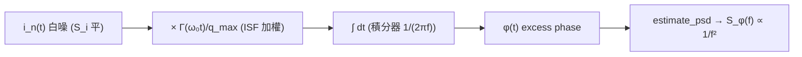

# Lab 06 — 白噪 → 1/f² 相位雜訊

這個 lab 把整條因果鏈「白噪 → ISF 加權 → 積分 → 相位」用最乾淨的數值方式跑一次，
讓你**親眼看到**一條平的（white，白色，與頻率無關）電流雜訊功率譜，怎麼被振盪器
這個「相位積分器」染成 $1/f^2$（每十倍頻 $-20$ dB）的相位雜訊。

> **物理直覺（先講結論）**：振盪器的相位沒有恢復力（restoring force，把擾動拉回的力），
> 所以每一次 noise 踢出的相位步階都**永久累加**——這就是一個**積分器**（integrator，
> 對輸入做時間積分的系統，infinite memory）。積分器的轉移函數量值是 $1/(2\pi f)$，
> 對 PSD 是 $1/(2\pi f)^2$。輸入是平的（白噪），輸出就被乘上 $1/f^2$。**白進、$1/f^2$ 出**，
> 不是因為雜訊源是 $1/f^2$，而是因為相位是被積分出來的。

## 1. 教學目標

- 用模擬驗證 [P1] 的招牌結果：白色電流雜訊在振盪器中變成 $1/f^2$ 相位雜訊。
- 看懂 $-20$ dB/decade 斜率**從哪裡來**（來自積分器，不是來自噪聲源）。
- 量化驗證理論預測式 $S_\phi(f)=\Gamma_{rms}^2 S_i/(q_{max}^2(2\pi f)^2)$。
- 理解著名的 **factor-of-2**（2 倍因子）爭議：時域乾淨推導與 [P1] Eq.(21) 差一個 2 倍，
  但 scaling 與斜率完全不受影響。

## 2. 數學模型

相位響應就是 LTV（linear time-variant，線性時變）卷積式 [P1] Eq.(11), p.182：

$$
\phi(t)=\frac{1}{q_{max}}\int_{-\infty}^{t}\Gamma(\omega_0\tau)\,i_n(\tau)\,d\tau
$$

把它拆成三個 block：先用 ISF 對 noise 做相位加權，再做積分。輸入是白色電流雜訊，
其單邊 PSD（power spectral density，功率譜密度）為常數 $S_i$（$A^2/$Hz）。

對白色輸入做積分，輸出相位 PSD 的乾淨時域結果是

$$
S_\phi(f)=\frac{\Gamma_{rms}^2\,S_i}{q_{max}^2\,(2\pi f)^2}.
$$

- **怎麼來的**：ISF 把白噪加權後，平均功率被 $\Gamma_{rms}^2$（ISF 的 rms 平方，
  見 [P1] Eq.(20)）縮放，$q_{max}^2$ 在分母（normalize）；接著積分器在頻域是
  $1/(j2\pi f)$，對 PSD 是 $1/(2\pi f)^2$。
- **Dimension check**：$\Gamma_{rms}^2$ 無因次、$S_i$ 是 $A^2/$Hz、$q_{max}^2$ 是 $C^2$、
  $(2\pi f)^2$ 是 $(\text{rad/s})^2=\text{s}^{-2}$。整體
  $=\dfrac{A^2/\text{Hz}}{C^2\cdot\text{s}^{-2}}=\dfrac{A^2\,\text{s}^2}{C^2}\cdot\dfrac{1}{\text{Hz}}$。
  因為 $C=A\cdot s$，$A^2 s^2/C^2=1$（無因次=rad²），所以 $[S_\phi]=\text{rad}^2/\text{Hz}$ ✓。

這條與 [P1] 招牌式 Eq.(21), p.185 同一個 scaling：

$$
\mathcal{L}\{\Delta\omega\}=10\log_{10}\!\left(\frac{\Gamma_{rms}^2}{q_{max}^2}\cdot\frac{\overline{i_n^2}/\Delta f}{4\,\Delta\omega^2}\right)
$$

> **factor-of-2 教學註記（務必看）**：時域「白噪 × ISF → 積分」乾淨推導得到
> $S_\phi=\Gamma_{rms}^2 S_i/(q_{max}^2(2\pi f)^2)$，對應 SSB
> $\mathcal{L}=\Gamma_{rms}^2 S_i/(2q_{max}^2\Delta\omega^2)$（分母 $2$）；
> 而 [P1] Eq.(21) 寫成分母 $4\Delta\omega^2$。差的這個 2 倍來自 **SSB（單邊帶）記帳慣例**
> ——是文獻上著名的小爭議。它**不影響** $\Gamma_{rms}^2/q_{max}^2$ 的 scaling，
> 也不影響 $-20$ dB/decade 斜率，那才是物理。本 lab 的模擬用的是乾淨時域版（分母 $(2\pi f)^2$），
> 所以模擬曲線會貼著時域理論線。詳見 [white_noise_to_phase_noise](/03_isf_core_theory/white_noise_to_phase_noise)。

## 3. Block diagram



## 4. Python 核心 code

以下逐字摘自 `simulations/lab_06_white_noise_phase_noise.py` 的 `main()`：三步驟
（生白噪 → ISF 加權 → cumsum 積分），再用 Welch 法估相位 PSD，疊上理論線。

```python
f0 = 1.0
fs = 256.0                 # 256 samples per period
n = 2 ** 20                # ~4096 periods -> good low-freq resolution
t = np.arange(n) / fs

q_max = 1.0
S_i = 1.0e-4               # one-sided white current PSD [A^2/Hz] (normalized)

# ISF and its rms
theta_grid = np.linspace(0, 2 * np.pi, 4000, endpoint=True)
Grms = gamma_rms(theta_grid, gamma_lc_ideal(theta_grid))  # = 1/sqrt(2)

# 1) white current noise
i_n = white_noise(n, psd=S_i, fs=fs, rng=RNG)
# 2) ISF weighting
g = gamma_lc_ideal(2 * np.pi * f0 * t) * i_n / q_max
# 3) integrate (cumulative) -> excess phase
dt = 1.0 / fs
phi = np.cumsum(g) * dt
phi = phi - np.mean(phi)   # remove the random-walk DC offset for PSD est.

# 4) estimate phase PSD
f, Sphi = estimate_psd(phi, fs, nperseg=2 ** 16)

# theory line
Sphi_theory = Grms ** 2 * S_i / (q_max ** 2 * (2 * np.pi * f) ** 2)
```

- 第 3 步 `np.cumsum(g) * dt` 就是把卷積式裡的 $\int d\tau$ 數值化——**累積和就是積分器**，
  也就是相位「無限記憶」的來源。
- 用的是理想 LC 的 ISF `gamma_lc_ideal`（$\Gamma(\theta)=-\sin\theta$），其
  $\Gamma_{rms}=1/\sqrt2\approx0.707$（因為 $\langle\sin^2\rangle=1/2$）。

## 5. 完整 script path

`simulations/lab_06_white_noise_phase_noise.py`
（相依模組：`simulations/common/noise_utils.py` 的 `white_noise`、`estimate_psd`；
`simulations/common/isf_utils.py` 的 `gamma_lc_ideal`、`gamma_rms`。）

執行方式：`python scripts/run_all_sims.py`（產生全部圖到 `static/figures/`）。

## 6. 參數表

| 參數 | 變數 | 值 | 說明 |
|---|---|---|---|
| 振盪頻率 | `f0` | $1.0$（normalized） | 整個 lab 用 $f_0=1$ 正規化；絕對 dBc/Hz 在 lab_08 算 |
| 取樣率 | `fs` | $256$ | 每週期 256 取樣點 |
| 樣本數 | `n` | $2^{20}=1{,}048{,}576$ | 約 4096 個週期，低頻解析度足夠 |
| 最大電荷擺幅 | `q_max` | $1.0$ | normalize 用 |
| 白噪電流 PSD | `S_i` | $1\times10^{-4}$ | 單邊、與頻率無關 |
| ISF | `gamma_lc_ideal` | $-\sin\theta$ | 理想 LC，$\Gamma_{rms}=1/\sqrt2$ |
| PSD 區段長 | `nperseg` | $2^{16}=65{,}536$ | Welch 分段，換取低頻解析度 |
| 隨機種子 | `RNG` | `default_rng(2024)` | 結果可重現 |

## 7. 單位表

| 量 | 符號 | 單位（normalized lab）|
|---|---|---|
| 時間 | $t$ | s（$f_0=1$ 時的「週期」為單位） |
| 電流雜訊 PSD | $S_i$ | A²/Hz |
| 最大電荷擺幅 | $q_{max}$ | C |
| ISF | $\Gamma(\omega_0\tau)$ | 無因次 |
| ISF rms | $\Gamma_{rms}$ | 無因次 |
| excess phase | $\phi(t)$ | rad |
| 相位 PSD | $S_\phi(f)$ | rad²/Hz |
| offset 頻率 | $f$ | Hz（normalized，$f_0=1$） |

## 8. 模擬圖


## 9. 如何解讀圖

- **藍線（simulated $S_\phi$）**：實際從模擬相位序列估出的 PSD。它在 log–log 上是一條
  斜率 $-2$ 的直線（每十倍頻下降 $20$ dB），帶有 Welch 估計的隨機起伏。
- **黑虛線（theory）**：$\Gamma_{rms}^2 S_i/(q_{max}^2(2\pi f)^2)$ 的解析線。藍線**緊貼**黑線
  ——這就是「白噪 → $1/f^2$」被數值證實。
- **紅點線（$-20$ dB/dec guide）**：純斜率參考線，確認斜率正是 $-2$。
- **重點**：輸入是**平的**（$S_i$ 與 $f$ 無關），輸出卻是 $1/f^2$。多出來的 $1/f^2$
  完全來自第 3 步那個積分器。把 ISF 換成別的形狀，只會改變 $\Gamma_{rms}$（上下平移整條線），
  斜率永遠是 $-2$。整條線的高度由 $\Gamma_{rms}^2/q_{max}^2$ 決定，所以放大 $q_{max}$（tank
  swing）是降低 $1/f^2$ 相位雜訊的主要旋鈕（設計運用見 [tank_swing](/06_design_insights/tank_swing)）。

代入本 lab 數字做一個 sanity check：$\Gamma_{rms}^2=0.5$、$S_i=10^{-4}$、$q_{max}=1$，
在 $f=0.1$（normalized）時，$2\pi f=0.6283$，$(2\pi f)^2=0.3948$，
$S_\phi=0.5\times10^{-4}/0.3948=1.27\times10^{-4}$ rad²/Hz。圖上 $f=0.1$ 處的高度應在此量級。

## 10. 對應 paper 公式/figure

- **理論線來源**：時域乾淨版 $S_\phi=\Gamma_{rms}^2 S_i/(q_{max}^2(2\pi f)^2)$，對應 [P1] Eq.(21), p.185
  的 scaling（差 factor-of-2，見上方註記）。
- **$\Gamma_{rms}$ 定義**：[P1] Eq.(20), p.185，$\sum_{n=0}^{\infty}c_n^2=\frac{1}{\pi}\int_0^{2\pi}|\Gamma(x)|^2dx=2\Gamma_{rms}^2$。
- **白噪求和式**：[P1] Eq.(19), p.185，$\mathcal{L}=10\log_{10}\big(\frac{\overline{i_n^2}/\Delta f\sum_n c_n^2}{8q_{max}^2\Delta\omega^2}\big)$，
  用 Eq.(20) 把 $\sum c_n^2$ 換成 $2\Gamma_{rms}^2$ 即得 Eq.(21)。
- **概念圖出處**：paper_001 Eq.(21)（factor-of-2 SSB 註記放在本 lab）。對應網站圖
  `white_noise_phase_noise_psd.png`。

## 11. 限制與 approximation

- 這是 **pedagogical toy model，非 transistor-level**：ISF 用解析的 $-\sin\theta$（理想 LC），
  不是從真實電路萃取。$q_{max}=1$、$f_0=1$ 為 normalized 單位，**沒有絕對 dBc/Hz**
  （絕對值請見 [lab_08](/04_simulation_labs/lab_08_jitter_integration) 與 numerical_feeling 例 B）。
- **單一白噪源、stationary（穩態）假設**：真實電路有多個源、且為 **cyclostationary**
  （週期穩態，雜訊強度隨工作點週期變化），要用 $\Gamma_{eff}=\Gamma\cdot\alpha$ 修正
  （見 [effective_isf](/03_isf_core_theory/effective_isf)）。
- **小角近似**：把相位當成可線性疊加且為小量；大相位偏移時 $\mathcal{L}\approx\frac12 S_\phi$ 失準。
- **factor-of-2**：模擬與時域理論線一致（分母 $(2\pi f)^2$），與 [P1] Eq.(21) 的 $4\Delta\omega^2$
  差一個 SSB 記帳的 2 倍，**不影響斜率與 scaling**。
- **數值限制**：低頻段受總模擬時間（$\approx4096$ 週期）與 `nperseg` 限制，最左端少數點
  統計起伏較大；圖上只畫 $f>0.02$ 的可信區段。

## 重點回顧

- 白噪（平）→ ISF 加權（縮 $\Gamma_{rms}^2/q_{max}^2$）→ 積分器（乘 $1/(2\pi f)^2$）→ $1/f^2$ 相位雜訊。
- $-20$ dB/decade 斜率來自**積分器**，與噪聲源頻譜形狀無關。
- 模擬 PSD 緊貼理論線 $\Gamma_{rms}^2 S_i/(q_{max}^2(2\pi f)^2)$。
- factor-of-2 是 SSB 記帳慣例差異，不改 scaling/斜率。

## 延伸閱讀

- 理論推導全文：[white_noise_to_phase_noise](/03_isf_core_theory/white_noise_to_phase_noise)
- 卷積/積分器來源：[convolution_derivation](/03_isf_core_theory/convolution_derivation)
- 下一個 lab（1/f 上轉）：[lab_07_flicker_noise_upconversion](/04_simulation_labs/lab_07_flicker_noise_upconversion)
- 換成絕對 jitter：[lab_08_jitter_integration](/04_simulation_labs/lab_08_jitter_integration)
- **用在設計/理論**：用 $q_{max}$（tank swing）壓 $1/f^2$ → [tank_swing](/06_design_insights/tank_swing)
