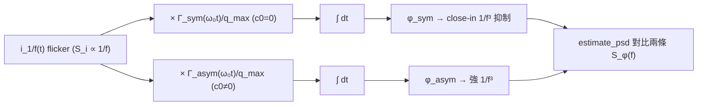

# Lab 07 — 1/f 噪聲上轉與 ISF 對稱性

這個 lab 回答一個對振盪器設計**最賺錢**的問題：**為什麼有些振盪器的近載波相位雜訊
（close-in phase noise）很糟（很陡的 $1/f^3$），有些卻乾淨？** 答案不在噪聲源，
而在波形的**對稱性**——具體說，在 ISF 的 DC 傅立葉係數 $c_0$。

> **物理直覺（先講結論）**：device 的 $1/f$（flicker，閃爍）噪聲集中在**很低頻**（近 DC）。
> 它能不能「上轉」（upconvert，被搬到載波附近變成相位雜訊），取決於 ISF 有沒有 DC 成分。
> ISF 的 DC 值就是 $c_0/2$。若波形**完全對稱**（上升、下降鏡像對稱），$c_0=0$，
> 近 DC 的 $1/f$ 噪聲乘上「平均為零」的 ISF 後被抵消，**不會上轉**；
> 若波形**不對稱**，$c_0\neq0$，近 DC 噪聲存活下來，再被積分器染成又陡又高的 $1/f^3$。
> **對稱性是免費的午餐**：把波形做對稱，等於免費砍掉 $1/f^3$ 相位雜訊。

## 1. 教學目標

- 看懂 device $1/f$ 噪聲如何「上轉」成 close-in 相位雜訊。
- 用模擬對比**對稱 ISF（$c_0=0$）** 與**不對稱 ISF（$c_0\neq0$）** 的 close-in 行為。
- 親眼確認：$c_0=0$ → close-in $1/f^3$ 被抑制；$c_0\neq0$ → 出現陡峭 $1/f^3$。
- 把這個現象連到 [P1] Eq.(23)（$1/f^3$ 表達式）與 Eq.(24)（$1/f^3$ corner）。

## 2. 數學模型

device flicker 電流噪聲的單邊 PSD 是 $1/f$ 形（[P1] Eq.(22), p.185）：

$$
\overline{i_{n,1/f}^2}=\overline{i_n^2}\cdot\frac{\omega_{1/f}}{\Delta\omega}
$$

- **意義**：$\omega_{1/f}$ 是 device 的 $1/f$ corner（轉角頻率），低於它噪聲呈 $1/f$，高於它趨白噪。
- **單位**：$\overline{i_n^2}$ 是 $A^2/$Hz；$\omega_{1/f}/\Delta\omega$ 無因次，整體仍是 $A^2/$Hz ✓。

把這個 $1/f$ 噪聲打進 ISF 的 DC 通道，再積分，得到 close-in 相位雜訊（[P1] Eq.(23), p.185）：

$$
\mathcal{L}\{\Delta\omega\}=10\log_{10}\!\left(\frac{c_0^2}{q_{max}^2}\cdot\frac{\overline{i_n^2}/\Delta f}{8\,\Delta\omega^2}\cdot\frac{\omega_{1/f}}{\Delta\omega}\right)
$$

- **斜率怎麼來**：$\frac{1}{\Delta\omega^2}$（積分器，$-20$ dB/dec）$\times\frac{1}{\Delta\omega}$（$1/f$ 噪聲源，
  $-10$ dB/dec）$=\frac{1}{\Delta\omega^3}$，也就是 **$1/f^3$（$-30$ dB/dec）**。
- **$c_0$ 是開關**：整個式子前面乘 $c_0^2$。$c_0=0$ → 這條 $1/f^3$ **消失**（被抑制），
  close-in 退回到白噪主導的 $1/f^2$；$c_0\neq0$ → $1/f^3$ 出現且高度正比 $c_0^2$。

$1/f^3$ 與 $1/f^2$ 兩段相交的轉角頻率（[P1] Eq.(24), p.185）：

$$
\Delta\omega_{1/f^3}=\omega_{1/f}\cdot\frac{c_0^2}{2\,\Gamma_{rms}^2}\approx\omega_{1/f}\left(\frac{c_0}{c_1}\right)^2
$$

- **設計含義**：把 $c_0$（波形不對稱度）壓小，corner 就往左移、close-in $1/f^3$ 區變窄。
- **符號陷阱**：$c_0$ 是傅立葉「係數」，ISF 的 DC**值**是 $c_0/2$（見 [notation](/00_overview/notation)）。

> 在本 lab 的 toy 寫法裡，不對稱 ISF 取 `gamma_asym = cos(theta) + 0.5`，DC 值 $=0.5$，
> 對應 $c_0=1.0$；對稱 ISF 取 `gamma_sym = cos(theta)`，DC 值 $=0$，$c_0=0$。
> 用 `cos` 而非 LC 的 $-\sin$ 只是讓「對稱基底 + DC 平移」的對比更直觀；兩者皆為 toy。

## 3. Block diagram



## 4. Python 核心 code

逐字摘自 `simulations/lab_07_flicker_noise.py`：同一條 flicker 噪聲分別過對稱與不對稱 ISF，
再各自積分、估 PSD。注意 `phase_from_isf` 就是「ISF 加權 → cumsum 積分」。

```python
def phase_from_isf(i_n, gamma_vals, q_max, fs):
    g = gamma_vals * i_n / q_max
    phi = np.cumsum(g) / fs
    return phi - np.mean(phi)


def main():
    f0 = 1.0
    fs = 256.0
    n = 2 ** 20
    t = np.arange(n) / fs
    q_max = 1.0

    theta = 2 * np.pi * f0 * t
    gamma_sym = np.cos(theta)            # c0 = 0
    gamma_asym = np.cos(theta) + 0.5     # c0 = 1.0 (DC = 0.5)

    i_flicker = flicker_noise(n, fs, k_flicker=1e-4, rng=RNG)

    phi_sym = phase_from_isf(i_flicker, gamma_sym, q_max, fs)
    phi_asym = phase_from_isf(i_flicker, gamma_asym, q_max, fs)

    f, S_sym = estimate_psd(phi_sym, fs, nperseg=2 ** 16)
    _, S_asym = estimate_psd(phi_asym, fs, nperseg=2 ** 16)
```

- 兩條 ISF 的**唯一差別**是那個 `+ 0.5`（DC 平移）。其他完全相同——所以兩條輸出 PSD 的差異
  **只可能**來自 $c_0$。這是把「$c_0$ 是不是 $1/f^3$ 的開關」做成一個受控實驗。

## 5. 完整 script path

`simulations/lab_07_flicker_noise.py`
（相依模組：`simulations/common/noise_utils.py` 的 `flicker_noise`、`estimate_psd`。
`flicker_noise` 以頻域整形法：白噪 → rFFT → 乘 $1/\sqrt{f}$ → irFFT 生成 $S\propto1/f$。）

執行方式：`python scripts/run_all_sims.py`。

## 6. 參數表

| 參數 | 變數 | 值 | 說明 |
|---|---|---|---|
| 振盪頻率 | `f0` | $1.0$（normalized） | $f_0=1$ 正規化 |
| 取樣率 | `fs` | $256$ | 每週期 256 點 |
| 樣本數 | `n` | $2^{20}$ | 約 4096 週期，低頻解析度足夠 |
| 最大電荷擺幅 | `q_max` | $1.0$ | normalize |
| flicker 強度 | `k_flicker` | $1\times10^{-4}$ | $S_i\approx k_{flicker}/f$ |
| 對稱 ISF | `gamma_sym` | $\cos\theta$ | $c_0=0$，DC$=0$ |
| 不對稱 ISF | `gamma_asym` | $\cos\theta+0.5$ | $c_0=1.0$，DC$=0.5$ |
| 隨機種子 | `RNG` | `default_rng(7)` | 結果可重現 |

## 7. 單位表

| 量 | 符號 | 單位 |
|---|---|---|
| flicker 電流噪聲 PSD | $\overline{i_{n,1/f}^2}$ | A²/Hz |
| device 1/f corner | $\omega_{1/f}$ | rad/s |
| ISF DC 係數 | $c_0$ | 無因次 |
| ISF 第 1 諧波 | $c_1$ | 無因次 |
| ISF rms | $\Gamma_{rms}$ | 無因次 |
| 相位 PSD | $S_\phi(f)$ | rad²/Hz |
| offset 頻率 | $f$ | Hz（normalized） |
| 1/f³ corner | $\Delta\omega_{1/f^3}$ | rad/s |

## 8. 模擬圖


## 9. 如何解讀圖

- **紅線（asymmetric，$c_0\neq0$）**：在 close-in（低 offset）區出現又高又陡的曲線，
  斜率接近 $-30$ dB/dec（$1/f^3$）。黑點線就是純 $1/f^3$ 斜率參考，紅線貼著它。
- **綠線（symmetric，$c_0=0$）**：在 close-in 區明顯**低很多**、且斜率較緩（接近 $1/f^2$，
  灰虛線參考）。$1/f^3$ 被抑制——這就是「波形對稱免費砍 close-in 噪聲」的視覺證據。
- **兩線在較高 offset 收斂**：遠離載波時，$1/f^3$ 與 $1/f^2$ 的差距縮小，因為 flicker
  噪聲本身在高頻已經很弱。
- **重點**：兩條 ISF 唯一差別是 $c_0$。紅綠之間 close-in 的巨大落差，**完全由 $c_0$ 造成**。
  $c_0\to0$，紅線就會塌向綠線。

## 10. 對應 paper 公式/figure

- **flicker 噪聲源**：[P1] Eq.(22), p.185，$\overline{i_{n,1/f}^2}=\overline{i_n^2}\cdot\omega_{1/f}/\Delta\omega$。
- **$1/f^3$ close-in**：[P1] Eq.(23), p.185，前置因子 $c_0^2$ 正是本 lab 的開關。
- **$1/f^3$ corner**：[P1] Eq.(24), p.185，$\Delta\omega_{1/f^3}=\omega_{1/f}\,c_0^2/(2\Gamma_{rms}^2)\approx\omega_{1/f}(c_0/c_1)^2$。
- **概念圖出處**：paper_001 Eqs (23),(24)；paper_002 的對稱性論述。對應網站圖
  `flicker_upconversion_symmetric_vs_asymmetric.png`。$c_0$ 的幾何意義另見
  [lab_05](/04_simulation_labs/lab_05_isf_fourier_coefficients) 的 `symmetric_vs_asymmetric_isf_c0.png`。

## 11. 限制與 approximation

- **pedagogical toy model，非 transistor-level**：兩條 ISF（`cos`、`cos+0.5`）是教學玩具，
  不是萃取自真實電路。`+0.5` 是人為設定的 $c_0$，只為做受控對比。
- **normalized 單位**：$f_0=1$、$q_{max}=1$、`k_flicker` 為任意刻度，**無絕對 dBc/Hz**。
  曲線的相對形狀（斜率、紅綠落差）才是教學重點。
- **flicker 生成是近似**：`flicker_noise` 用頻域 $1/\sqrt f$ 整形，靠 `f_low` 馴服 DC bin 發散；
  極低頻的精確度受 `f_low` 與總長度限制。
- **stationary 噪聲假設**：真實 flicker 上轉還涉及 cyclostationary 調變
  （device 只在導通時漏噪聲），完整處理要用 $\Gamma_{eff}=\Gamma\cdot\alpha$
  （見 [effective_isf](/03_isf_core_theory/effective_isf)）；本 lab 只示範 $c_0$ 這一個機制。
- **Welch 低頻起伏**：close-in 區點數少、統計起伏大，圖上只畫 $f>0.02$ 的可信段。

## 重點回顧

- device $1/f$ 噪聲集中在近 DC；能否上轉成相位雜訊由 ISF 的 DC 成分（$c_0/2$）決定。
- $c_0\neq0$ → close-in $1/f^3$（$-30$ dB/dec）；$c_0=0$ → 抑制，退回 $1/f^2$。
- $1/f^3$ 高度正比 $c_0^2$，corner $\propto c_0^2/\Gamma_{rms}^2$。
- 設計啟示：把波形做對稱（壓 $c_0$）是免費降低 close-in 相位雜訊的手段。

## 延伸閱讀

- 理論推導全文：[flicker_noise_upconversion](/03_isf_core_theory/flicker_noise_upconversion)
- $c_0$ 的傅立葉幾何：[lab_05_fourier_isf](/04_simulation_labs/lab_05_isf_fourier_coefficients)
- 上一個 lab（白噪 → 1/f²）：[lab_06_white_noise_phase_noise](/04_simulation_labs/lab_06_white_noise_phase_noise)
- **用在設計/理論**：把波形做對稱（壓 $c_0$）降 close-in $1/f^3$ → [symmetry](/06_design_insights/symmetry)
