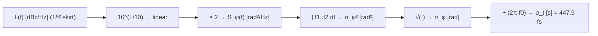

# Lab 08 — 從 L(f) 積分得 rms jitter

這個 lab 把一張 datasheet 上常見的東西——**單邊帶相位雜訊曲線** $\mathcal{L}(f)$（dBc/Hz）
——變成設計師真正在意的數字：**rms timing jitter（時間抖動均方根）** $\sigma_t$。
我們用一個 canonical 情境（$f_0=5$ GHz、$\mathcal{L}(1\text{MHz})=-100$ dBc/Hz、$1/f^2$ 斜率、
積 1→100 MHz），讓**數值積分**與**解析閉式**逐位吻合：$\sigma_t=447.9$ fs。

> **物理直覺（先講結論）**：相位雜訊是「每個 offset 頻率上有多少相位功率密度」，
> jitter 是「全部加起來、開根號、換算成時間」。所以從 $\mathcal{L}(f)$ 到 $\sigma_t$
> 就是三件事：(1) dBc/Hz 換回 linear 並乘 2 還原 $S_\phi$；(2) 對 offset 頻率積分得相位 variance；
> (3) 開根號再除以 $2\pi f_0$ 換成時間。對 $1/f^2$ 形狀，**積分被下限 $f_1$ 主導**
> ——「從哪裡開始積」比「積到多高」重要得多。

## 1. 教學目標

- 把 $\mathcal{L}(f)$（dBc/Hz）一步步換成 rms phase $\sigma_\phi$ 與 rms jitter $\sigma_t$。
- 建立 5 GHz 的換算手感：$-100$ dBc/Hz @ 1 MHz、$1/f^2$、積 1→100 MHz → **約 448 fs**。
- 驗證**數值積分 = 解析閉式**（$1/f^2$ 有 closed form）。
- 理解為何 $1/f^2$ 的 jitter 由**積分下限**主導。

## 2. 數學模型

**步驟 1：$\mathcal{L}$ → $S_\phi$。** 小角／單邊帶近似下（規範公式 16）：

$$
\mathcal{L}(\Delta f)\approx\tfrac12 S_\phi(\Delta f)\;\Rightarrow\;S_\phi(f)=2\cdot10^{\mathcal{L}(f)/10}.
$$

**步驟 2：寫出 $1/f^2$ 形狀**（以 $f_{ref}=1$ MHz 錨定，規範例 C）：

$$
S_\phi(f)=S_\phi(f_{ref})\left(\frac{f_{ref}}{f}\right)^2.
$$

**步驟 3：積分得相位 variance**（規範公式 18）：

$$
\sigma_\phi^2=\int_{f_1}^{f_2}S_\phi(f)\,df.
$$

對 $1/f^2$ 形狀，這個積分有閉式（$\int f^{-2}df=-1/f$）：

$$
\sigma_\phi^2=S_\phi(f_{ref})\,f_{ref}^2\!\int_{f_1}^{f_2}\frac{df}{f^2}=S_\phi(f_{ref})\,f_{ref}^2\left(\frac{1}{f_1}-\frac{1}{f_2}\right).
$$

**步驟 4：換成 rms jitter**（規範公式 19）：

$$
\sigma_t=\frac{\sigma_\phi}{2\pi f_0}=\frac{1}{2\pi f_0}\sqrt{\int_{f_1}^{f_2}S_\phi(f)\,df}.
$$

- **Dimension check（步驟 4）**：$\sigma_\phi$ 是 rad，$2\pi f_0$ 是 rad/s，
  $[\text{rad}]/[\text{rad/s}]=[\text{s}]$ ✓。
- **下限主導**：$\big(\tfrac1{f_1}-\tfrac1{f_2}\big)=10^{-6}-10^{-8}=9.9\times10^{-7}$，
  其中 $1/f_1=10^{-6}$ 佔 99%。所以積分結果幾乎只看 $f_1$。

逐位代入 canonical 數字（與 numerical_feeling 例 C 完全一致）：

$$
\begin{aligned}
S_\phi(1\text{MHz})&=2\times10^{-100/10}=2\times10^{-10}\ \text{rad}^2/\text{Hz},\\
\sigma_\phi^2&=2\times10^{-10}\,(10^6)^2\,(10^{-6}-10^{-8})=200\times9.9\times10^{-7}=1.98\times10^{-4}\ \text{rad}^2,\\
\sigma_\phi&=1.407\times10^{-2}\ \text{rad}=14.07\ \text{mrad},\\
\sigma_t&=\frac{1.407\times10^{-2}}{2\pi\times5\times10^{9}}=4.479\times10^{-13}\ \text{s}=447.9\ \text{fs}.
\end{aligned}
$$

## 3. Block diagram



## 4. Python 核心 code

逐字摘自 `simulations/lab_08_jitter_integration.py` 的 `main()`：先用
`leeson_one_over_f2` 造出 $1/f^2$ 曲線，再以 `integrate_rms_jitter` 做數值積分，
最後手算 $1/f^2$ 閉式對拍。

```python
import numpy as np
from simulations.common.noise_utils import leeson_one_over_f2, integrate_rms_jitter

f0 = 5e9
f_ref = 1e6
L_ref = -100.0  # dBc/Hz
f1, f2 = 1e6, 100e6

f = np.logspace(np.log10(f1), np.log10(f2), 4000)
L = leeson_one_over_f2(f, L_ref, f_ref)

# numerical integration
sigma_t, sigma_phi = integrate_rms_jitter(f, L, f0, f1, f2)

# analytic closed form (1/f^2)
L_ref_lin = 10 ** (L_ref / 10)
sigma_phi2_analytic = 2 * L_ref_lin * f_ref ** 2 * (1 / f1 - 1 / f2)
sigma_phi_analytic = np.sqrt(sigma_phi2_analytic)
sigma_t_analytic = sigma_phi_analytic / (2 * np.pi * f0)

print(round(sigma_t * 1e15, 1))    # -> 447.9   (sigma_t in fs)
print(round(sigma_phi * 1e3, 2))   # -> 14.07   (sigma_phi in mrad)
```

底層函式 `integrate_rms_jitter`（`noise_utils.py`）做的就是步驟 1、3、4：

```python
l_linear   = 10 ** (l_dbc_per_hz[mask] / 10)   # dBc/Hz -> linear
s_phi      = 2 * l_linear                       # L ~= 0.5 * S_phi
sigma_phi  = np.sqrt(_trapz(s_phi, f[mask]))    # 積分 + 開根號
sigma_t    = sigma_phi / (2 * np.pi * f0)        # 換成時間
```

- 程式印出 `sigma_phi (numeric) ≈ sigma_phi (analytic)`、`sigma_t ≈ 447.9 fs`，
  數值與解析**逐位一致**（差異只來自 logspace 取樣與梯形積分的離散誤差，可忽略）。

## 5. 完整 script path

`simulations/lab_08_jitter_integration.py`
（相依模組：`simulations/common/noise_utils.py` 的 `leeson_one_over_f2`、`integrate_rms_jitter`。）

執行方式：`python scripts/run_all_sims.py`。

## 6. 參數表

| 參數 | 變數 | 值 | 說明 |
|---|---|---|---|
| 振盪頻率 | `f0` | $5\times10^{9}$ Hz | 5 GHz carrier |
| 參考 offset | `f_ref` | $1\times10^{6}$ Hz | 1 MHz，錨定點 |
| 參考相位雜訊 | `L_ref` | $-100$ dBc/Hz | datasheet 式單一數字 |
| 積分下限 | `f1` | $1\times10^{6}$ Hz | 1 MHz（主導積分） |
| 積分上限 | `f2` | $100\times10^{6}$ Hz | 100 MHz |
| 取樣點數 | — | $4000$（logspace） | 對數均勻取樣 |
| 斜率 | — | $1/f^2$（$-20$ dB/dec） | 純 skirt |

## 7. 單位表

| 量 | 符號 | 單位 | 本 lab 結果 |
|---|---|---|---|
| 相位雜訊 | $\mathcal{L}(f)$ | dBc/Hz | $-100$ @ 1 MHz |
| 相位 PSD | $S_\phi(f)$ | rad²/Hz | $2\times10^{-10}$ @ 1 MHz |
| 相位 variance | $\sigma_\phi^2$ | rad² | $1.98\times10^{-4}$ |
| rms phase | $\sigma_\phi$ | rad | $14.07$ mrad |
| rms jitter | $\sigma_t$ | s | $447.9$ fs |
| offset 頻率 | $f$ | Hz | 1–100 MHz |
| 載波頻率 | $f_0$ | Hz | 5 GHz |

## 8. 模擬圖


## 9. 如何解讀圖

- **藍線（$L(f)$）**：在 semilog（x 軸對數）上是一條直線，因為 $1/f^2$ 在 dBc/Hz 對 log-f
  下斜率固定（$-20$ dB/dec）。紅點標出錨定點 $\mathcal{L}(1\text{MHz})=-100$ dBc/Hz。
- **藍色陰影**：示意「相位功率分布在哪個 offset 頻率」。$1/f^2$ 下，**最靠近 $f_1$ 的部分
  貢獻最多**——這正是「下限主導」的視覺呈現。
- **文字框**：列出積分結果 $\sigma_\phi=14.07$ mrad、$\sigma_t=447.9$ fs，並標註解析值
  與數值值相同，證明 closed form 與梯形積分一致。
- **怎麼用**：拿到任何 datasheet 的 $\mathcal{L}(f)$ 曲線，照藍線下的面積積分、開根號、
  除以 $2\pi f_0$，就得到 jitter。記住 5 GHz 換算點：本例 $\approx448$ fs。
  若相位雜訊好 20 dB（$-120$ dBc/Hz @ 1 MHz），功率小 100 倍、$\sigma$ 小 10 倍 → $\approx45$ fs。

## 10. 對應 paper 公式/figure

- 本 lab 用的是**標準 jitter 積分**（規範公式 16–19），屬通用 DSP/通訊實務，**不在 5 篇 PDF 內**
  以標準文獻補充；與 [P2] 的 jitter 討論（period/accumulated jitter）精神一致。
- $\mathcal{L}\approx\frac12 S_\phi$：規範公式 16（小角近似）。
- phase variance：規範公式 18，$\sigma_\phi^2=\int_{f_1}^{f_2}S_\phi df$。
- rms jitter：規範公式 19，$\sigma_t=\frac{1}{2\pi f_0}\sqrt{\int S_\phi df}$。
- 概念圖出處：standard jitter integration / SerDes practice。對應網站圖
  `phase_noise_to_jitter_integration.png`，並於 numerical_feeling 例 C、
  [psd_phase_noise_jitter](/02_foundations/psd_phase_noise_jitter)、
  [serdes_clocking_connection](/06_design_insights/serdes_clocking_connection) 重複引用。

## 11. 限制與 approximation

- **小角近似** $\mathcal{L}\approx\frac12 S_\phi$：相位偏移大時失準；本例 $\sigma_\phi=14$ mrad $\ll1$ rad，
  近似很好。
- **純 $1/f^2$ skirt 假設**：真實曲線還有 $1/f^3$（close-in，見 [lab_07](/04_simulation_labs/lab_07_flicker_noise_upconversion)）
  與遠端的 white floor（雜訊地板）。本 lab 只取單一 $1/f^2$ 段，是教學簡化。
  這部分**非 toy**（積分流程本身是真實工程做法），但 $L(f)$ 形狀是理想化的。
- **積分範圍敏感**：$1/f^2$ 由下限 $f_1$ 主導，換 $f_1$ 會明顯改 $\sigma_t$；上限影響小。
  實務上 $f_1$、$f_2$ 要依應用（PLL 環路頻寬、資料率）選定。
- **數值=解析**：兩者只差離散積分誤差（logspace + 梯形法），在本設定下可忽略。

## 重點回顧

- $\mathcal{L}$(dBc/Hz) → linear → $\times2$ 得 $S_\phi$ → 積分 → 開根號 → $\div(2\pi f_0)$ = rms jitter。
- canonical：5 GHz、$-100$ dBc/Hz @ 1 MHz、$1/f^2$、積 1→100 MHz → $\sigma_\phi=14.07$ mrad、$\sigma_t=447.9$ fs。
- $1/f^2$ 的 jitter 由**積分下限**主導（$1/f_1$ 項）。
- 數值積分與 $1/f^2$ 解析閉式逐位一致。

## 延伸閱讀

- 口算版同題：[numerical_feeling](/04_simulation_labs/numerical_feeling)（例 C）
- PSD 與 jitter 種類：[psd_phase_noise_jitter](/02_foundations/psd_phase_noise_jitter)
- close-in $1/f^3$ 來源：[lab_07_flicker_noise_upconversion](/04_simulation_labs/lab_07_flicker_noise_upconversion)
- **用在設計/理論**：rms jitter 如何決定 eye 與 BER → [serdes_clocking_connection](/06_design_insights/serdes_clocking_connection)
