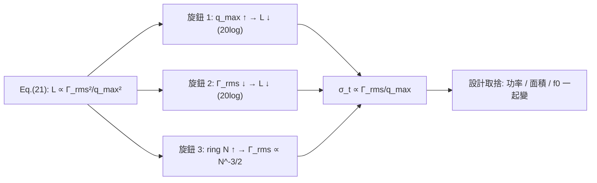

# Lab 09 — 設計取捨綜合 scaling

> **麵包屑**：[模擬實驗室](/04_simulation_labs/numerical_feeling) › 雜訊與抖動 › **本頁（設計取捨入門）**。上游：[lab_06](/04_simulation_labs/lab_06_white_noise_phase_noise)、[lab_08](/04_simulation_labs/lab_08_jitter_integration)；進階版：[lab_17](/04_simulation_labs/lab_17_design_tradeoffs)。

前面八個 lab 把每個機制各別跑通了。這個綜合 lab 不引入新模擬，而是把 [P1] Eq.(21)
這條招牌式當成**設計旋鈕地圖**：固定其他條件，分別掃 $q_{max}$、$\Gamma_{rms}$、
ring 級數 $N$，看 phase noise $\mathcal{L}$ 與 rms jitter $\sigma_t$ 怎麼動。
全程用 canonical 數值（規範第 8 節）做口算，建立「動哪個旋鈕、賺幾 dB」的反射。

> **物理直覺（先講結論）**：$1/f^2$ phase noise $\propto\Gamma_{rms}^2/q_{max}^2$。
> 想降相位雜訊只有兩條大路：**把訊號電荷 $q_{max}$ 做大**（多存能量，雜訊相對變小），
> 或**把 ISF $\Gamma_{rms}$ 做小**（讓波形對雜訊不敏感）。
> 兩者都是 **$20\log_{10}$ 的關係**：$q_{max}$ 加倍 → 相位雜訊 $-6$ dB；
> $\Gamma_{rms}$ 減半 → 也是 $-6$ dB。ring 振盪器的 $N$ 同時動兩件事，要小心淨效果。

## 1. 教學目標

- 把 [P1] Eq.(21) 讀成 scaling law，建立 $q_{max}$、$\Gamma_{rms}$、$N$ 的設計直覺。
- 用 canonical 數值算出「動一個旋鈕賺幾 dB / 幾 fs」。
- 看懂 ring 振盪器 $N$ 的雙面性（$\Gamma_{rms}\propto N^{-3/4}$，但功率/面積也漲）。
- 把 scaling 結論連到各 design insight 頁。

## 2. 數學模型

起點是 [P1] Eq.(21), p.185：

$$
\mathcal{L}\{\Delta\omega\}=10\log_{10}\!\left(\frac{\Gamma_{rms}^2}{q_{max}^2}\cdot\frac{\overline{i_n^2}/\Delta f}{4\,\Delta\omega^2}\right)
$$

把對數展開成「相加的旋鈕」（固定 $\Delta\omega$、$S_i=\overline{i_n^2}/\Delta f$）：

$$
\mathcal{L}=20\log_{10}\Gamma_{rms}-20\log_{10}q_{max}+10\log_{10}S_i-20\log_{10}(2\Delta\omega)+\text{const}.
$$

- **讀法**：每個旋鈕都是 $20\log_{10}$（電壓/電荷類）或 $10\log_{10}$（功率類）。
  $q_{max}$ 與 $\Gamma_{rms}$ 都進 $20\log_{10}$，所以「加倍/減半 = $\pm6$ dB」。

jitter 與 phase noise 同源：對 $1/f^2$ skirt，$\sigma_t=\frac{1}{2\pi f_0}\sqrt{\int S_\phi df}$
（規範公式 19），而 $S_\phi\propto\Gamma_{rms}^2/q_{max}^2$，所以

$$
\sigma_t\;\propto\;\frac{\Gamma_{rms}}{q_{max}}\qquad(\text{固定}f_0,\ S_i,\ \text{積分範圍}).
$$

- **dB 與 jitter 的橋**：$\mathcal{L}$ 降 $6$ dB（功率 $\times\frac14$）→ $\sigma_t$ 減半（$\sqrt{}$）。

ring 振盪器：[P2] 給出兩條 scaling——級數越多，每級 ISF 越尖但 rms 越小（[P2] Eq.(16), p.794）：

$$
\Gamma_{rms}\propto N^{-3/4}\quad(\text{[P2] Eq.(16), p.794，已核實}),\qquad f_0=\frac{1}{2N\tau_D}\ \text{[P2] Eq.(15)}.
$$

- 單看 phase noise，$N$ 從 5 → 15（$\times3$）：$\Gamma_{rms}$ 乘 $3^{-3/2}=0.192$，
  $\mathcal{L}$ 變化 $20\log_{10}0.192=-14.3$ dB。**但**級數多 → 功率、面積、$q_{max}$ 分配都變，
  且 $f_0$ 下降（除非縮 $\tau_D$），所以這只是「孤立看 $\Gamma_{rms}$」的 toy scaling，非淨設計結論。

## 3. Block diagram



## 4. Python 核心 code

本 lab 不產生新圖，scaling 直接用 [P1] Eq.(21) 口算。下面這段（沿用
`simulations/lab_08_jitter_integration.py` 的習慣）示範如何把旋鈕變化換成 dB 與 fs，
讓你能自己掃參數：

```python
import math

def L_dbc(Grms, qmax, Si, df):
    """Hajimiri-Lee Eq.(21): 1/f^2 SSB phase noise [dBc/Hz]."""
    dw = 2 * math.pi * df
    return 10 * math.log10((Grms**2 / qmax**2) * (Si / (4 * dw**2)))

# canonical baseline (規範例 B)
f0, df, Si = 5e9, 1e6, 1e-24
base = L_dbc(Grms=0.5, qmax=1e-12, Si=Si, df=df)   # -148.0 dBc/Hz

print("baseline           :", round(base, 1), "dBc/Hz")
print("q_max x2           :", round(L_dbc(0.5, 2e-12, Si, df) - base, 1), "dB")  # -6.0
print("Gamma_rms /2       :", round(L_dbc(0.25, 1e-12, Si, df) - base, 1), "dB") # -6.0
# ring N: Gamma_rms ~ N^-3/4 ([P2] Eq.(16), p.794, verified); show isolated scaling
for N in (5, 15, 45):
    rel = (N / 5.0) ** -1.5
    print(f"N={N:2d} Gamma_rms rel={rel:.3f}  dL={20*math.log10(rel):+.1f} dB")

# jitter scales as Gamma_rms / q_max  ->  -6 dB phase noise = sigma_t / 2
```

- `L_dbc` 與 lab_08 的 `integrate_rms_jitter` 不同：lab_08 從 $\mathcal{L}$ **積分**出 jitter；
  這裡反向用 Eq.(21) **產生** $\mathcal{L}$，再用 scaling 推 jitter。兩頁互為正反操作。

## 5. 完整 script path

本 lab 為綜合分析，**無專屬 script**。引用的計算來自：
`simulations/lab_06_white_noise_phase_noise.py`（$\Gamma_{rms}^2/q_{max}^2$ scaling 的模擬證據）、
`simulations/lab_03_ring_toy_model.py`（LC vs ring ISF 與 $N$ scaling）、
`simulations/lab_08_jitter_integration.py`（$\mathcal{L}\to\sigma_t$）。
上面的口算片段可存成獨立小腳本自行掃參數。

## 6. 參數表

| 參數 | 符號 | canonical 值 | 角色 |
|---|---|---|---|
| 載波頻率 | $f_0$ | $5$ GHz | 固定 |
| offset | $\Delta f$ | $1$ MHz | 固定（評估點） |
| 電流雜訊 PSD | $S_i$ | $1\times10^{-24}$ A²/Hz | 固定（單一白噪源） |
| 最大電荷擺幅 | $q_{max}$ | $1$ pC（基準） | **旋鈕 1**，掃 $0.5,1,2$ pC |
| ISF rms | $\Gamma_{rms}$ | $0.5$（基準） | **旋鈕 2**，掃 $0.25,0.5$ |
| ring 級數 | $N$ | $5$（基準） | **旋鈕 3**，掃 $5,15,45$ |
| 基準相位雜訊 | $\mathcal{L}$ | $-148.0$ dBc/Hz | 由 Eq.(21) 得（=規範例 B） |

## 7. 單位表

| 量 | 符號 | 單位 |
|---|---|---|
| 最大電荷擺幅 | $q_{max}$ | C |
| ISF rms | $\Gamma_{rms}$ | 無因次 |
| ring 級數 | $N$ | 無因次 |
| 相位雜訊 | $\mathcal{L}$ | dBc/Hz |
| rms jitter | $\sigma_t$ | s |
| 電流雜訊 PSD | $S_i$ | A²/Hz |

## 8. scaling 表（口算，toy scaling）

以 canonical 基準 $\mathcal{L}=-148.0$ dBc/Hz（$q_{max}=1$ pC、$\Gamma_{rms}=0.5$、
$S_i=10^{-24}$、5 GHz @ 1 MHz）為 $0$ dB 參考。$\sigma_t\propto\Gamma_{rms}/q_{max}$。

| 旋鈕變化 | $\mathcal{L}$ 變化 | $\sigma_t$ 變化 | 物理理由 |
|---|---|---|---|
| $q_{max}\times2$（$\to2$ pC） | $-6.0$ dB | $\times0.5$ | $-20\log_{10}q_{max}$；訊號電荷大、雜訊相對小 |
| $q_{max}\times0.5$（$\to0.5$ pC） | $+6.0$ dB | $\times2$ | 同上反向 |
| $\Gamma_{rms}\times0.5$（$\to0.25$） | $-6.0$ dB | $\times0.5$ | $+20\log_{10}\Gamma_{rms}$；波形對雜訊不敏感 |
| ring $N:5\to15$（$\times3$） | $-14.3$ dB | $\times0.192$ | $\Gamma_{rms}\propto N^{-3/4}$（孤立看，[P2] Eq.(16), p.794 已核實） |
| ring $N:5\to45$（$\times9$） | $-28.6$ dB | $\times0.037$ | 同上；但功率/面積/$f_0$ 也一起變 |

**口算示範**：$q_{max}$ 從 1 pC 加倍到 2 pC，$\mathcal{L}$ 改變
$20\log_{10}(1/2)=-6.0$ dB → $-154.0$ dBc/Hz；jitter 隨 $\sqrt{}$ 減半。
把 lab_08 的 $447.9$ fs（那是 $-100$ dBc/Hz 的情境）做同樣 $-6$ dB 操作，會降到 $\approx224$ fs。

## 9. 如何解讀圖（重用既有圖）

**圖一：$\Gamma_{rms}^2/q_{max}^2$ scaling 的模擬證據。** lab_06 的白噪 PSD 圖，把 ISF 換成不同
$\Gamma_{rms}$（或改 $q_{max}$）時，整條 $1/f^2$ 線只是**上下平移**，斜率不變——這就是 scaling 表
「動旋鈕 = 平移 dB」的視覺版。


**圖二：LC vs ring 的 ISF 形狀與 $N$。** lab_03 的對比圖：ring 的 ISF 敏感度集中在 transition，
$N$ 越大每級 ISF 越尖、但 rms 越小（$\Gamma_{rms}\propto N^{-3/4}$）。這解釋了 scaling 表
旋鈕 3 的來源，也提醒這是孤立 scaling。


- **怎麼用兩張圖**：圖一告訴你「$q_{max}$/$\Gamma_{rms}$ 旋鈕 = 垂直平移」；
  圖二告訴你「ring 的 $\Gamma_{rms}$ 怎麼隨 $N$ 變」。合起來就是設計地圖。

## 10. 對應 paper 公式/figure

- **主 scaling**：[P1] Eq.(21), p.185，$\mathcal{L}\propto\Gamma_{rms}^2/q_{max}^2$。
- **Parseval / $\Gamma_{rms}$**：[P1] Eq.(20), p.185。
- **ring $\Gamma_{rms}$ scaling**：[P2] Eq.(16), p.794，$\Gamma_{rms}\propto N^{-3/4}$（已核實）。
- **ring 頻率**：[P2] Eq.(15), p.794，$f_0=1/(2N\tau_D)$。
- **ring 白噪 FOM**：[P2] Eq.(23), p.796，$\mathcal{L}|_{1/f^2}\approx\frac{8}{3\eta}\,\frac{V_{DD}}{V_{char}}\,\frac{kT}{P}(\omega_0/\Delta\omega)^2$（$\eta$ 為級延遲比例常數 [P2] Eq.(14)，$\approx1$；$\gamma$ 僅透過 $V_{char}=\Delta V/\gamma$ 進入）。
- **概念圖**：重用 `white_noise_phase_noise_psd.png`（lab_06）與 `lc_vs_ring_isf_comparison.png`（lab_03）。

## 11. 限制與 approximation

- **toy scaling，非 transistor-level**：scaling 假設「只動一個旋鈕、其他完全不變」。
  真實電路裡 $q_{max}$、$\Gamma_{rms}$、$N$、功率、面積、$f_0$ 彼此**耦合**，不能孤立調。
- **ring $N$ scaling 已核實**：$\Gamma_{rms}\propto N^{-3/4}$ 的比例常數為 [P2] Eq.(16), p.794
  $\Gamma_{rms}=\sqrt{2\pi^2/(3\eta^3)}\cdot N^{-3/4}$（$\eta\approx1$，已核實）；級數變多也改
  $f_0=1/(2N\tau_D)$、功率與面積，淨 phase noise/jitter 要看完整 FOM，不能只看 $\Gamma_{rms}$。
- **單一白噪源**：忽略多源、cyclostationary（$\Gamma_{eff}=\Gamma\cdot\alpha$）、flicker 上轉
  （$1/f^3$，見 [lab_07](/04_simulation_labs/lab_07_flicker_noise_upconversion)）。close-in 區此表不適用。
- **factor-of-2**：用 Eq.(21) 的分母 $4\Delta\omega^2$；與時域版差 SSB 記帳 2 倍，
  **不影響任何 scaling 結論**（所有 dB 變化都是相對量）。
- **jitter scaling**：$\sigma_t\propto\Gamma_{rms}/q_{max}$ 假設固定積分範圍與 $1/f^2$ 形狀；
  若 close-in $1/f^3$ 主導，jitter 由 $c_0$ 與積分下限決定，需另算。

## 重點回顧

- $1/f^2$ phase noise $\propto\Gamma_{rms}^2/q_{max}^2$；jitter $\propto\Gamma_{rms}/q_{max}$。
- $q_{max}$ 加倍或 $\Gamma_{rms}$ 減半 → phase noise $-6$ dB、jitter 減半（$20\log_{10}$）。
- ring $N$ 孤立看 $\Gamma_{rms}\propto N^{-3/4}$（$N\times3\to-14.3$ dB），但 $f_0$/功率/面積同時變，是 toy scaling。
- 基準數字：$q_{max}=1$ pC、$\Gamma_{rms}=0.5$、5 GHz @ 1 MHz、$S_i=10^{-24}$ → $\mathcal{L}=-148.0$ dBc/Hz。

## 延伸閱讀

- $q_{max}$ 設計：[power_and_qmax](/06_design_insights/tank_swing)
- 對稱性砍 $1/f^3$：[symmetry_and_1overf](/06_design_insights/symmetry)
- SerDes 時脈：[serdes_clocking_connection](/06_design_insights/serdes_clocking_connection)
- **用在設計/理論**：把 $\Gamma_{rms}$、$q_{max}$、$N$ 的 scaling 落到拓樸抉擇 → [lc_vs_ring](/06_design_insights/lc_vs_ring)
- 上游模擬：[lab_06_white_noise_phase_noise](/04_simulation_labs/lab_06_white_noise_phase_noise)、
  [lab_08_jitter_integration](/04_simulation_labs/lab_08_jitter_integration)
