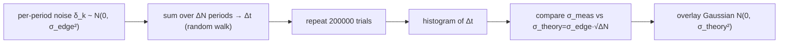

# Lab 11 — Monte-Carlo 累積 jitter：RJ 是高斯、σ 隨 √ΔN

> **麵包屑**：[模擬實驗室](/04_simulation_labs/numerical_feeling) › 雜訊與抖動 › **本頁（Monte-Carlo 累積 jitter）**。上游：[oscillator_phase](/02_foundations/oscillator_phase)、[lab_03](/04_simulation_labs/lab_03_ring_oscillator_toy_model)；下游：[lab_12](/04_simulation_labs/lab_12_serdes_eye_ber)、[lab_13](/04_simulation_labs/lab_13_pll_cdr_transfer)。

這個 lab 用最直接的方式——**Monte-Carlo（蒙地卡羅，大量隨機抽樣統計）**——證明 free-running
（自由振盪、未鎖相）振盪器累積的 **random jitter（RJ，隨機抖動，高斯、無上界）**有兩個關鍵性質：

1. 它的分布是**高斯**的；
2. 它的標準差隨累積週期數開根號成長：$\sigma_{\Delta t}=\sigma_{edge}\sqrt{\Delta N}$。

這是「統計（時域）觀點」與「頻譜觀點」的接合點，也是 [P2] Eq.(8) 那條
$\sigma_{\Delta t}=\kappa\sqrt{\Delta t}$ 的微觀起源。

> **物理直覺（先講結論）**：每個週期，振盪器的 edge（過零/翻轉時刻）都會被 noise 推一個
> 獨立的小量，平均 0、標準差 $\sigma_{edge}$。相位**沒有恢復力**（見
> [oscillator_phase](/02_foundations/oscillator_phase)），所以這些小推**不會被拉回**，
> 而是一路**累加**——這就是一維**隨機漫步（random walk）**。隨機漫步走 $\Delta N$ 步後的
> 位置：均值仍是 0，但 variance 是單步 variance 的 $\Delta N$ 倍，所以 **standard deviation
> 隨 $\sqrt{\Delta N}$ 成長**。而獨立小量相加，由中央極限定理趨於**高斯**。

## 1. 教學目標

- 用 Monte-Carlo 直接「看見」累積 jitter 的**高斯分布**。
- 驗證隨機漫步定律 $\sigma_{\Delta t}=\sigma_{edge}\sqrt{\Delta N}$：把 $\Delta N$ 加 4 倍，
  $\sigma$ 只加 2 倍。
- 把這個時域結果連到 [P2] Eq.(8) 的 $\sigma_{\Delta t}=\kappa\sqrt{\Delta t}$（$\kappa$ 比例常數）。
- 理解「為何相位/jitter 會累積」——因為相位無 restoring（與振幅不同）。

## 2. 數學模型

**單週期增量。** 第 $k$ 個週期的 edge 時刻誤差是一個獨立同分布的高斯增量：

$$
\delta_k\sim\mathcal{N}(0,\;\sigma_{edge}^2).
$$

**累積 jitter = 增量之和（隨機漫步）。** 累積 $\Delta N$ 個週期後，相對理想 edge 的時間誤差：

$$
\Delta t_{\Delta N}=\sum_{k=1}^{\Delta N}\delta_k .
$$

**統計性質（逐步推）。** 增量獨立、均值 0：

$$
\begin{aligned}
\mathbb{E}[\Delta t_{\Delta N}]&=\sum_{k=1}^{\Delta N}\mathbb{E}[\delta_k]=0,\\
\operatorname{Var}[\Delta t_{\Delta N}]&=\sum_{k=1}^{\Delta N}\operatorname{Var}[\delta_k]=\Delta N\cdot\sigma_{edge}^2,\\
\sigma_{\Delta t}&=\sqrt{\operatorname{Var}}=\sigma_{edge}\sqrt{\Delta N}.
\end{aligned}
$$

- **為什麼 variance 相加**：獨立隨機變數之和的 variance 等於各 variance 之和（協方差為 0）。
  這是「$\sqrt{\Delta N}$」的全部來源。
- **為什麼是高斯**：$\Delta N$ 個獨立增量相加，由中央極限定理趨近高斯（且每個增量本就高斯，
  高斯之和精確仍是高斯）。
- **Dimension check**：$\sigma_{edge}$ 是 s，$\sqrt{\Delta N}$ 無因次（$\Delta N$ 是週期計數），
  故 $\sigma_{\Delta t}$ 是 s ✓。

**連到 [P2] Eq.(8)。** 把累積週期數換成累積時間 $\Delta t=\Delta N\cdot T=\Delta N/f_0$：

$$
\sigma_{\Delta t}=\sigma_{edge}\sqrt{\Delta N}=\sigma_{edge}\sqrt{f_0\,\Delta t}=\underbrace{\big(\sigma_{edge}\sqrt{f_0}\big)}_{\kappa}\sqrt{\Delta t},
$$

即 [P2] Eq.(8), p.792 的 $\sigma_{\Delta t}=\kappa\sqrt{\Delta t}$，且 $\kappa=\sigma_{edge}\sqrt{f_0}$。

- **Dimension check（$\kappa$）**：$[\text{s}]\cdot[\text{Hz}]^{1/2}=[\text{s}]\cdot[\text{s}^{-1/2}]=[\text{s}^{1/2}]$，
  與規範符號表 $\kappa$ 的單位 $\sqrt{s}$ 一致 ✓。

## 3. Block diagram



## 4. Python 核心 code

逐字摘自 `simulations/lab_11_monte_carlo_jitter.py` 的 `main()`：對每個累積長度 `lag`（=$\Delta N$），
抽 `n_trials × lag` 個獨立高斯增量、沿週期軸求和得累積誤差 `acc`，量其 `std`，再疊上理論高斯。

```python
f0 = 5e9
sigma_edge = 50e-15  # 50 fs per period
n_trials = 200000
lags = [25, 100, 400]  # number of periods accumulated

for lag, c in zip(lags, colors):
    incr = sigma_edge * RNG.standard_normal((n_trials, lag))
    acc = incr.sum(axis=1)  # accumulated timing error after `lag` periods
    sigma_meas = np.std(acc)
    sigma_theory = sigma_edge * np.sqrt(lag)
    # histogram (in fs)
    ax.hist(acc / 1e-15, bins=120, density=True, alpha=0.35, color=c,
            label=fr"$\Delta N$={lag}: 量得 $\sigma$={sigma_meas/1e-15:.0f} fs "
                  fr"(理論 {sigma_theory/1e-15:.0f} fs)")
    # gaussian overlay
    xx = np.linspace(acc.min(), acc.max(), 300)
    g = np.exp(-xx ** 2 / (2 * sigma_theory ** 2)) / (sigma_theory * np.sqrt(2 * np.pi))
    ax.plot(xx / 1e-15, g * 1e-15, color=c, lw=1.6)
```

- `incr.sum(axis=1)` 就是把 `lag` 個獨立增量加起來——一維隨機漫步。
- `sigma_meas = np.std(acc)`（量測）會逐位逼近 `sigma_theory = sigma_edge*np.sqrt(lag)`（理論），
  因為 `n_trials=200000` 夠大。
- 高斯疊圖 `g` 用的是**理論** $\sigma$，貼合直方圖即證明分布為高斯。

預期數字（$\sigma_{edge}=50$ fs）：$\Delta N=25\to250$ fs、$\Delta N=100\to500$ fs、
$\Delta N=400\to1000$ fs（每 $\times4$ 步、$\sigma$ 就 $\times2$）。

## 5. 完整 script path

`simulations/lab_11_monte_carlo_jitter.py`
（相依模組：`simulations/common/plot_utils.py` 的 `savefig`。其餘用 numpy/matplotlib。）

執行方式：`python scripts/run_all_sims.py`。

## 6. 參數表

| 參數 | 變數 | 值 | 說明 |
|---|---|---|---|
| 振盪頻率 | `f0` | $5\times10^{9}$ Hz | 5 GHz（用於 $\Delta N\leftrightarrow\Delta t$ 換算） |
| 單週期 jitter | `sigma_edge` | $50\times10^{-15}$ s | 每週期 edge 的 rms 增量（50 fs） |
| Monte-Carlo 次數 | `n_trials` | $200000$ | 每個 $\Delta N$ 的試驗數 |
| 累積週期數 | `lags` | $\{25,100,400\}$ | $\Delta N$，呈 $\times4$ 等比 |
| 直方圖 bins | — | $120$ | density 直方圖 |
| 隨機種子 | `RNG` | `default_rng(11)` | 結果可重現 |

## 7. 單位表

| 量 | 符號 | 單位 | 本 lab 取值 |
|---|---|---|---|
| 單週期增量 | $\delta_k,\ \sigma_{edge}$ | s | $\sigma_{edge}=50$ fs |
| 累積週期數 | $\Delta N$ | —（計數） | 25 / 100 / 400 |
| 累積 jitter | $\Delta t,\ \sigma_{\Delta t}$ | s | 250 / 500 / 1000 fs |
| 累積時間 | $\Delta t=\Delta N/f_0$ | s | $\Delta N$ 個週期的時間 |
| 比例常數 | $\kappa=\sigma_{edge}\sqrt{f_0}$ | $\sqrt{s}$ | $\approx3.5\times10^{-12}\,\sqrt{s}$ |
| 機率密度 | — | 1/s（圖上 1/fs） | 高斯曲線 |

## 8. 模擬圖


## 9. 如何解讀圖

- **三條鐘形曲線**（藍/橘/紅對應 $\Delta N=25/100/400$）：直方圖（半透明）與理論高斯曲線
  （實線）幾乎完全重合——這就是「RJ 是高斯」的直接證據。
- **越寬代表累積越久**：$\Delta N$ 越大，鐘形越矮越寬。注意寬度（$\sigma$）只隨
  $\sqrt{\Delta N}$ 成長：$25\to100$（$\times4$）時 $\sigma$ 從 250 fs 變 500 fs（只 $\times2$）；
  $100\to400$（再 $\times4$）時 500 fs 變 1000 fs（再 $\times2$）。
- **legend 的「量得 σ vs 理論」**：兩個數字幾乎相同，定量驗證 $\sigma_{\Delta t}=\sigma_{edge}\sqrt{\Delta N}$。
- **怎麼用**：這解釋了為何 free-running 振盪器**不能**只用「單週期 jitter」描述長期穩定度
  ——jitter 會隨觀測時間長大。要止住累積，必須用 PLL/CDR 把相位鎖回參考（見
  [lab_13](/04_simulation_labs/lab_13_pll_cdr_transfer)）。

## 10. 對應 paper 公式/figure

- **核心對應**：[P2] A. Hajimiri, S. Limotyrakis, and T. H. Lee, *"Jitter and Phase Noise
  in Ring Oscillators,"* IEEE JSSC, 34(6), 1999，**Eq.(8), p.792**：
  $\sigma_{\Delta t}=\kappa\sqrt{\Delta t}$。本 lab 證明其微觀起源是 per-edge 高斯增量的隨機漫步，
  並導出 $\kappa=\sigma_{edge}\sqrt{f_0}$。
- 規範第 10.2 節「period / cycle-to-cycle jitter 核」：accumulated jitter「不含差分（低頻
  主導）」，對應這裡的純累加（無高通差分核）。
- 相位無 restoring（故累積）：[P1] 的 LTV 相位模型（規範公式 11），與
  [oscillator_phase](/02_foundations/oscillator_phase) 的幾何一致。
- 對應網站圖 `monte_carlo_jitter_histogram.png`；與 [lab_03](/04_simulation_labs/lab_03_ring_oscillator_toy_model)
  的時域累積圖 `ring_oscillator_timing_noise_accumulation.png` 互為呼應。

## 11. 限制與 approximation

- **這是 pedagogical toy model，非 transistor-level**：我們直接假設每週期一個獨立高斯增量
  $\sigma_{edge}$，沒有從 ISF + device noise 推 $\sigma_{edge}$ 的數值（那要 [P2] 的
  $\kappa$/FOM 公式，規範公式 22–23，⚠️ 常數待查）。
- **純 RJ、增量獨立**：假設週期間 noise 不相關（白噪在週期尺度上）。真實有 $1/f$
  (flicker) 會帶來**相關**增量，使長期累積偏離單純 $\sqrt{\Delta N}$（close-in $1/f^3$，見
  [lab_07](/04_simulation_labs/lab_07_flicker_noise_upconversion)）。
- **只含 accumulated/long-term jitter**：period jitter（單週期偏差）與 cycle-to-cycle
  jitter（相鄰差）是相位的一/二階差分，不在本圖範圍（規範第 10.2 節）。
- **高斯、無上界**：RJ 用 $\sigma$ 描述、尾巴延伸到無窮——這正是 SerDes BER 永遠 $>0$ 的根源
  （見 [lab_12](/04_simulation_labs/lab_12_serdes_eye_ber)）。deterministic jitter（DJ，有界）
  不在本模型內。
- **有限取樣誤差**：`sigma_meas` 與 `sigma_theory` 的微小差異來自 `n_trials` 有限，加大可收斂。

## 重點回顧

- 累積 jitter = per-edge 高斯增量的**隨機漫步**：均值 0、variance $\propto\Delta N$、分布高斯。
- $\sigma_{\Delta t}=\sigma_{edge}\sqrt{\Delta N}$：$\Delta N$ 加 4 倍、$\sigma$ 只加 2 倍。
- 換成時間即 [P2] Eq.(8) 的 $\sigma_{\Delta t}=\kappa\sqrt{\Delta t}$，$\kappa=\sigma_{edge}\sqrt{f_0}$。
- 相位無 restoring → jitter 會累積 → free-running 長期穩定度差 → 需 PLL/CDR 鎖回。

## 延伸閱讀

- 相位為何無恢復力：[oscillator_phase](/02_foundations/oscillator_phase)
- ring 振盪器的時域累積圖：[lab_03_ring_oscillator_toy_model](/04_simulation_labs/lab_03_ring_oscillator_toy_model)
- PLL/CDR 如何止住累積：[lab_13_pll_cdr_transfer](/04_simulation_labs/lab_13_pll_cdr_transfer)
- RJ → SerDes BER：[lab_12_serdes_eye_ber](/04_simulation_labs/lab_12_serdes_eye_ber)
- **用在設計/理論**：累積 jitter 如何吃掉 SerDes 時脈預算 → [serdes_clocking_connection](/06_design_insights/serdes_clocking_connection)
