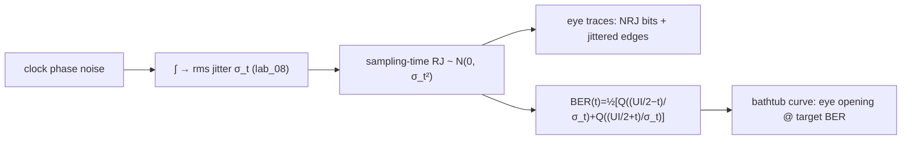

# Lab 12 — 從 jitter 到 eye 到 BER（SerDes bathtub）

> **麵包屑**：[模擬實驗室](/04_simulation_labs/numerical_feeling) › 雜訊與抖動 › **本頁（eye / BER bathtub）**。上游：[lab_08](/04_simulation_labs/lab_08_jitter_integration)、[lab_11](/04_simulation_labs/lab_11_monte_carlo_jitter)；下游：[lab_13](/04_simulation_labs/lab_13_pll_cdr_transfer)。

這個 lab 把整套 ISF 課程的「**為什麼要在意 jitter**」說到底：振盪器的相位雜訊積分成
**rms timing jitter（時間抖動均方根）** $\sigma_t$（見 [lab_08](/04_simulation_labs/lab_08_jitter_integration)）；
這個 $\sigma_t$ 就是 SerDes 取樣時鐘的 **random jitter（RJ）**；RJ 會讓**眼圖（eye diagram，
多個位元疊起來的開口）閉合**，並決定 **BER（bit-error rate，位元錯誤率）**。我們畫出眼圖與
**BER bathtub（浴缸曲線，BER 對取樣時刻的曲線形如浴缸）**。

> **物理直覺（先講結論）**：理想時鐘永遠在 UI（unit interval，一個位元的時間長度）正中央
> 取樣，離兩側 data edge 各 $UI/2$，最安全。有了 jitter，取樣時刻會隨機左右抖；只要抖到
> 越過某一側的 edge，就取錯位元。RJ 是高斯、**無上界**，所以**永遠**有一條尾巴會越過 edge
> ——BER 永遠 $>0$，只是大小由「離 edge 幾個 $\sigma$」決定。離得越多個 $\sigma$，
> 錯誤機率以 $Q(\cdot)$（高斯尾巴）指數般地掉，這就是浴缸底部又深又平的原因。

## 1. 教學目標

- 把 rms jitter $\sigma_t$ 對應到**眼圖閉合**與 **BER**。
- 寫出並理解 RJ-only 的 BER bathtub 公式（規範第 10.2 節 SerDes BER 式）。
- 看出「$\sigma_t$ 越大 → 可用取樣窗（eye opening at a target BER）越窄」。
- 把 $Q$-function（高斯尾巴）與「離 edge 幾個 $\sigma$」連起來，理解 BER 的指數敏感度。

## 2. 數學模型

**$Q$-function（高斯尾巴機率）。**

$$
Q(x)=\frac12\,\mathrm{erfc}\!\Big(\frac{x}{\sqrt2}\Big),
$$

代表標準高斯超過 $x$ 個 $\sigma$ 的機率。$x$ 越大、$Q(x)$ 越小（指數般衰減）。

**BER bathtub（RJ only）。** 在 UI 內、相對眼中心 offset $t$ 取樣，左 edge 在 $-UI/2$、
右 edge 在 $+UI/2$。取樣時刻被高斯 jitter $\sigma_t$ 抖動，越過任一 edge 就出錯
（規範第 10.2 節「SerDes BER（RJ）」）：

$$
\text{BER}(t)=\frac12\Big[\,Q\!\Big(\frac{UI/2-t}{\sigma_t}\Big)+Q\!\Big(\frac{UI/2+t}{\sigma_t}\Big)\Big].
$$

- **逐項物理**：第一項是抖過**右** edge（距離 $UI/2-t$）的機率；第二項是抖過**左** edge
  （距離 $UI/2+t$）的機率。前面的 $\tfrac12$ 是「transition 出現一半時間」的記帳（RJ-only
  一階模型）。
- **眼中心 $t=0$**：兩項對稱，$\text{BER}(0)=Q(UI/(2\sigma_t))$——離兩 edge 都是
  $UI/(2\sigma_t)$ 個 $\sigma$。**這個比值是一切**：它叫「以 $\sigma$ 計的眼半寬」。
- **Dimension check**：$Q$ 的引數 $(UI/2-t)/\sigma_t$ 是 $[\text{s}]/[\text{s}]$ 無因次 ✓；
  BER 是機率（無因次）✓。

**眼半寬（以 $\sigma$ 計）決定 BER。** 對 $UI=100$ ps：

$$
\frac{UI/2}{\sigma_t}=\frac{50\ \text{ps}}{\sigma_t}.
$$

$\sigma_t=4$ ps → $12.5\sigma$；$\sigma_t=8$ ps → $6.25\sigma$。$Q(12.5)\sim10^{-36}$（極深），
$Q(6.25)\sim2\times10^{-10}$（淺很多）——**jitter 加倍，浴缸底淺好幾十個數量級**。

## 3. Block diagram



## 4. Python 核心 code

逐字摘自 `simulations/lab_12_serdes_eye_ber.py` 的 `main()`：左圖用 `eye_traces` 疊出眼圖、
右圖用 `ber_bathtub` 對三組 $\sigma_t$ 畫浴缸曲線。

```python
ui = 100e-12       # 10 Gb/s -> 100 ps UI
sigma_t = 4e-12    # 4 ps rms RJ (e.g. from an integrated 5 GHz clock)

# (a) eye diagram
t, traces = eye_traces(sigma_t, ui, n_traces=300, rng=RNG)
for tr in traces:
    ax.plot(t, tr, color="tab:blue", alpha=0.05, lw=1.0)

# (b) BER bathtub
toff = np.linspace(-ui / 2 * 0.98, ui / 2 * 0.98, 400)
for st, c in zip([2e-12, 4e-12, 8e-12], ["tab:green", "tab:orange", "tab:red"]):
    ber = ber_bathtub(toff, st, ui)
    ax.semilogy(toff / ui, ber, color=c, label=fr"$\sigma_t$={st*1e12:.0f} ps")
ax.axhline(1e-12, color="gray", ls="--", lw=1, label="BER = $10^{-12}$")
```

底層 `ber_bathtub` 與 `Q`（`serdes_utils.py`）就是規範第 10.2 節的 BER 式逐字實現：

```python
def Q(x):
    """Gaussian tail probability Q(x) = 0.5*erfc(x/sqrt(2))."""
    return 0.5 * erfc(np.asarray(x, dtype=float) / np.sqrt(2.0))

def ber_bathtub(t_offsets, sigma_t, ui):
    t = np.asarray(t_offsets, dtype=float)
    half = ui / 2.0
    ber = 0.5 * (Q((half - t) / sigma_t) + Q((half + t) / sigma_t))
    return np.maximum(ber, 1e-300)
```

- `eye_traces` 把每個 transition 的 edge 時刻加上 $\mathcal{N}(0,\sigma_t/UI)$ 的抖動
  （UI 為單位），疊 300 條就成眼圖。
- `ber_bathtub` 直接套 $Q$-function；`np.maximum(ber, 1e-300)` 是給 log 圖一個底，避免 $\log 0$。

## 5. 完整 script path

`simulations/lab_12_serdes_eye_ber.py`
（相依模組：`simulations/common/serdes_utils.py` 的 `Q`、`ber_bathtub`、`eye_traces`；
`simulations/common/plot_utils.py` 的 `savefig`。`Q` 用 `scipy.special.erfc`。）

執行方式：`python scripts/run_all_sims.py`。

## 6. 參數表

| 參數 | 變數 | 值 | 說明 |
|---|---|---|---|
| 單位間隔 | `ui` | $100\times10^{-12}$ s | 10 Gb/s NRZ → 100 ps UI |
| 眼圖 jitter | `sigma_t` | $4\times10^{-12}$ s | 4 ps rms RJ（例：5 GHz 時鐘積分而來） |
| bathtub jitter 掃 | — | $\{2,4,8\}$ ps | 三條浴缸曲線 |
| 眼圖 trace 數 | `n_traces` | $300$ | 疊圖密度 |
| BER 取樣點 | `toff` | $400$（$\pm0.98\,UI/2$） | 浴缸曲線解析度 |
| 目標 BER | — | $10^{-12}$ | 常見 SerDes 規格線 |
| 隨機種子 | `RNG` | `default_rng(12)` | 結果可重現 |

## 7. 單位表

| 量 | 符號 | 單位 | 本 lab 取值 |
|---|---|---|---|
| 單位間隔 | $UI$ | s | 100 ps |
| rms jitter | $\sigma_t$ | s | 2 / 4 / 8 ps |
| 取樣 offset | $t$ | s（圖上以 UI 為單位） | $\pm UI/2$ |
| 眼半寬（以 σ 計） | $UI/(2\sigma_t)$ | —（無因次） | 25 / 12.5 / 6.25 |
| BER | $\text{BER}(t)$ | —（機率） | $1\sim10^{-18}$ |
| $Q$ 引數 | $(UI/2\mp t)/\sigma_t$ | —（無因次） | 距 edge 的 σ 數 |

## 8. 模擬圖


## 9. 如何解讀圖

- **左圖（eye diagram）**：300 條被 jitter 抖過的 transition 疊起來，中央留下一個菱形
  **開口（eye opening）**。jitter 把 edge 抹開，開口左右收窄；jitter 再大，開口會閉到無法
  在任何時刻安全取樣。
- **右圖（BER bathtub）**：三條浴缸曲線（綠/橘/紅 = $\sigma_t=2/4/8$ ps）。
  - **底部深度**：$\sigma_t$ 越小，浴缸底越深（BER 越低）。綠線（2 ps）底深到圖外
    （$UI/(2\sigma_t)=25\sigma$，$Q$ 極小）；紅線（8 ps）底只到 $\sim10^{-10}$ 級。
  - **左右壁**：靠近 $\pm0.5$ UI（即 edge）BER 衝到 $\sim0.5$（亂猜）。
  - **可用窗（eye opening @ BER）**：兩壁與 $10^{-12}$ 虛線的交點之間就是「在該 BER 下可安全
    取樣的時間窗」。$\sigma_t$ 越大，這個窗越窄——這就是「jitter 吃掉 timing budget」。
- **怎麼用**：給定資料率（UI）與目標 BER，反推可容忍的 $\sigma_t$；再回頭要求時鐘的相位雜訊
  積分要小於這個 $\sigma_t$（接回 [lab_08](/04_simulation_labs/lab_08_jitter_integration)）。

## 10. 對應 paper 公式/figure

- **BER 式**：規範第 10.2 節「SerDes BER（RJ）」：
  $\text{BER}(t)=\tfrac12[Q(\tfrac{UI/2-t}{\sigma_t})+Q(\tfrac{UI/2+t}{\sigma_t})]$，
  $Q(x)=\tfrac12\mathrm{erfc}(x/\sqrt2)$。屬通用通訊/SerDes 實務，**不在 5 篇 PDF 內**，
  以標準文獻補充。
- **jitter 來源**：$\sigma_t$ 由相位雜訊積分而來（規範公式 19，見
  [lab_08](/04_simulation_labs/lab_08_jitter_integration)）；其底層相位累積機制源自 [P1]
  的 ISF/LTV 模型與 [P2] 的 jitter 討論。
- **RJ 高斯、無上界**：與 [lab_11](/04_simulation_labs/lab_11_monte_carlo_jitter) 的
  Monte-Carlo 結論一致（高斯尾巴 → BER 永遠 $>0$）。
- 對應網站圖 `serdes_eye_ber_bathtub.png`；設計層面的串接見
  [serdes_clocking_connection](/06_design_insights/serdes_clocking_connection)。

## 11. 限制與 approximation

- **這是 pedagogical toy model，非 transistor-level**：眼圖用 `tanh` 平滑 edge 近似 NRZ
  transition、無真實通道/等化器；BER 用閉式 $Q$ 公式，非蒙地卡羅誤碼計數。
- **RJ-only（只含 random jitter）**：忽略 **DJ（deterministic jitter，有界，來自 ISI、
  duty-cycle distortion、串擾等）**。真實 jitter 是 dual-Dirac（RJ ⊛ DJ），浴缸壁會被 DJ
  往內推、底部出現平台。本 lab 只示範 RJ 的高斯尾巴部分。
- **無 amplitude noise / 垂直眼閉**：只看 timing（水平眼），不含電壓 noise 造成的垂直閉合。
- **理想兩位準、無 ISI**：假設前後位元乾淨切換、無碼間干擾；高速通道實務需 CTLE/DFE 等化。
- **$\tfrac12$ 記帳**：transition density 取 0.5（隨機資料平均），特定 pattern 會不同。

## 重點回顧

- 相位雜訊積分 → $\sigma_t$ → SerDes 取樣時鐘的 RJ → 眼圖閉合 → BER。
- $\text{BER}(t)=\tfrac12[Q(\tfrac{UI/2-t}{\sigma_t})+Q(\tfrac{UI/2+t}{\sigma_t})]$；眼中心
  $\text{BER}(0)=Q(UI/(2\sigma_t))$。
- 關鍵量是**以 $\sigma$ 計的眼半寬** $UI/(2\sigma_t)$：jitter 加倍、BER 淺好幾十個數量級。
- RJ 高斯無上界 → BER 永遠 $>0$；浴缸與目標 BER 線的交點界定可用取樣窗。

## 延伸閱讀

- jitter 從哪來（積分）：[lab_08_jitter_integration](/04_simulation_labs/lab_08_jitter_integration)
- RJ 為何高斯：[lab_11_monte_carlo_jitter](/04_simulation_labs/lab_11_monte_carlo_jitter)
- 用 PLL/CDR 收住 jitter：[lab_13_pll_cdr_transfer](/04_simulation_labs/lab_13_pll_cdr_transfer)
- **用在設計/理論**：把 $\sigma_t$ 規格反推回時脈相位雜訊預算 → [serdes_clocking_connection](/06_design_insights/serdes_clocking_connection)
