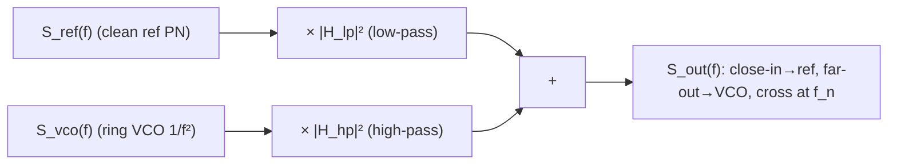

# Lab 13 — PLL/CDR 的 jitter transfer：VCO 高通、reference 低通

> **麵包屑**：[模擬實驗室](/04_simulation_labs/numerical_feeling) › 系統與進階 › **本頁（PLL/CDR jitter transfer）**。上游：[lab_11](/04_simulation_labs/lab_11_monte_carlo_jitter)；下游：[lab_12](/04_simulation_labs/lab_12_serdes_eye_ber)。

這個 lab 解釋一件實務上至關重要的事：**PLL（phase-locked loop，鎖相環）/ CDR（clock and
data recovery，時脈資料回復）如何「過濾」振盪器的相位雜訊**。關鍵結論是——對輸出相位而言，
**VCO（voltage-controlled oscillator，壓控振盪器）自己的相位雜訊被高通整形**（close-in 被
壓掉、far-out 主導），而 **reference（參考時鐘）的相位雜訊被低通整形**。這就是為什麼一個吵雜
的 ring-VCO，鎖到一個乾淨的參考上之後，仍能輸出可用的時鐘。

> **物理直覺（先講結論）**：PLL 是一個負回授環，它**追蹤**參考的相位。在環路頻寬 $f_n$ 以內
> （低 offset、慢變化），回授來得及反應，於是輸出**跟著參考**走——所以參考的低頻 noise 直接
> 傳到輸出（reference 低通），而 VCO 自己的低頻漂移會被回授**糾正掉**（VCO 高通）。在 $f_n$
> 以外（高 offset、快變化），回授來不及反應，輸出**跟著 VCO** 自由跑——VCO noise 原樣通過
> （VCO 高通的通帶）、參考的高頻 noise 被濾掉（reference 低通的止帶）。交越點就在環路頻寬 $f_n$。

## 1. 教學目標

- 理解 PLL 對相位雜訊的**兩個轉移函數**：reference→輸出是**低通** $\lvert H_{lp}\rvert^2$、
  VCO→輸出是**高通** $\lvert H_{hp}\rvert^2$，且 $H_{hp}=1-H_{lp}$。
- 用 $S_{out}=S_{ref}\lvert H_{lp}\rvert^2+S_{vco}\lvert H_{hp}\rvert^2$ 合成鎖定後輸出。
- 看出「close-in 跟 reference、far-out 跟 VCO，交越在環路頻寬 $f_n$」。
- 連到設計取捨：環路頻寬怎麼選，才能同時壓住 VCO close-in 與不放大 reference far-out。

## 2. 數學模型

**type-II 二階 PLL 的閉環轉移函數**（規範第 10.2 節「PLL（type-II 2nd order）」）。
以自然頻率 $\omega_n=2\pi f_n$、阻尼比 $\zeta$ 表示，referred to 輸出相位：

$$
\lvert H_{lp}\rvert^2=\frac{(2\zeta\omega_n\omega)^2+\omega_n^4}{(\omega_n^2-\omega^2)^2+(2\zeta\omega_n\omega)^2},
$$

$$
\lvert H_{hp}\rvert^2=\frac{\omega^4}{(\omega_n^2-\omega^2)^2+(2\zeta\omega_n\omega)^2}.
$$

其中 $\omega=2\pi f$（$f$ 為 offset 頻率）。

- **極限檢查（低頻 $\omega\to0$）**：$\lvert H_{lp}\rvert^2\to\omega_n^4/\omega_n^4=1$
  （參考全傳）、$\lvert H_{hp}\rvert^2\to0$（VCO 被壓）。✓ 符合「close-in 跟 reference」。
- **極限檢查（高頻 $\omega\to\infty$）**：$\lvert H_{lp}\rvert^2\to(2\zeta\omega_n\omega)^2/\omega^4\to0$
  （參考被濾掉）、$\lvert H_{hp}\rvert^2\to\omega^4/\omega^4=1$（VCO 全傳）。✓ 符合「far-out 跟 VCO」。
- **互補性**：可驗證在這組標準式下 $H_{hp}(s)=1-H_{lp}(s)$（時域同一誤差由兩條路徑分擔），
  故輸出相位 = 兩者之和。
- **Dimension check**：$\omega$、$\omega_n$ 同為 rad/s，分子分母同階（$\omega^4$ 或
  $\omega_n^4$），轉移函數無因次 ✓。

**輸出相位雜訊（功率疊加）。** 兩條路徑的 noise 不相關，功率相加（規範第 10.2 節）：

$$
S_{out}(f)=S_{ref}(f)\,\lvert H_{lp}\rvert^2+S_{vco}(f)\,\lvert H_{hp}\rvert^2 .
$$

- **Dimension check**：$S_{ref},S_{vco},S_{out}$ 皆 rad²/Hz，$\lvert H\rvert^2$ 無因次，
  相加單位一致 ✓。

**本 lab 的代表性輸入形狀**（anchored，非特定矽製程）：

$$
S_{vco}(f)=10^{-6}\Big(\frac{10^6}{f}\Big)^2\ \text{(ring VCO，強 }1/f^2\text{)},\qquad
S_{ref}(f)=10^{-12}+10^{-14}\Big(\frac{10^6}{f}\Big)^2\ \text{(乾淨參考)}.
$$

## 3. Block diagram



## 4. Python 核心 code

逐字摘自 `simulations/lab_13_pll_cdr_transfer.py` 的 `main()`：設定環路頻寬 `fn`、阻尼 `zeta`，
給出 VCO 與 reference 的代表性 PSD，再呼叫 `shape_output_phase_noise` 合成輸出。

```python
f = np.logspace(3, 9, 2000)  # 1 kHz .. 1 GHz offset
fn = 1e6  # loop natural frequency ~ 1 MHz
zeta = 0.707

# representative phase-noise PSDs (rad^2/Hz), anchored shapes
S_vco = 1e-6 * (1e6 / f) ** 2          # ring VCO: strong 1/f^2 close-in
S_ref = 1e-12 + 1e-14 * (1e6 / f) ** 2  # clean reference: low flat + slight 1/f^2

S_out, S_ref_sh, S_vco_sh = shape_output_phase_noise(f, S_ref, S_vco, fn, zeta)
```

底層轉移函數（`pll_utils.py`）就是規範第 10.2 節 PLL 式的逐字實現：

```python
def H_lowpass_mag2(f, fn_hz, zeta=0.707):
    """|H_lp(j2*pi*f)|^2 for a type-II 2nd-order PLL (reference -> output)."""
    w = 2 * np.pi * np.asarray(f, dtype=float)
    wn = loop_natural_freq(fn_hz)
    num = (2 * zeta * wn * w) ** 2 + wn ** 4
    den = (wn ** 2 - w ** 2) ** 2 + (2 * zeta * wn * w) ** 2
    return num / den

def H_highpass_mag2(f, fn_hz, zeta=0.707):
    """|H_hp(j2*pi*f)|^2 = |1 - H_lp|^2 for the VCO -> output path."""
    w = 2 * np.pi * np.asarray(f, dtype=float)
    wn = loop_natural_freq(fn_hz)
    num = w ** 4
    den = (wn ** 2 - w ** 2) ** 2 + (2 * zeta * wn * w) ** 2
    return num / den
```

- `shape_output_phase_noise` 內部即 `S_ref*lp + S_vco*hp`，回傳輸出與兩條 shaped 分量。
- `zeta=0.707`（Butterworth 阻尼）給平坦的閉環、無明顯 jitter peaking。

## 5. 完整 script path

`simulations/lab_13_pll_cdr_transfer.py`
（相依模組：`simulations/common/pll_utils.py` 的 `H_lowpass_mag2`、`H_highpass_mag2`、
`shape_output_phase_noise`、`loop_natural_freq`；`simulations/common/plot_utils.py` 的 `savefig`。）

執行方式：`python scripts/run_all_sims.py`。

## 6. 參數表

| 參數 | 變數 | 值 | 說明 |
|---|---|---|---|
| offset 掃描 | `f` | $10^3\sim10^9$ Hz（logspace 2000） | 1 kHz–1 GHz |
| 環路自然頻率 | `fn` | $1\times10^{6}$ Hz | 環路頻寬 $\approx$ 交越點 |
| 阻尼比 | `zeta` | $0.707$ | Butterworth，無 peaking |
| VCO PN 位準 | — | $10^{-6}\,(10^6/f)^2$ rad²/Hz | ring：強 $1/f^2$ |
| 參考 PN 位準 | — | $10^{-12}+10^{-14}(10^6/f)^2$ rad²/Hz | 乾淨：低平 + 微 $1/f^2$ |

## 7. 單位表

| 量 | 符號 | 單位 | 本 lab 取值 |
|---|---|---|---|
| offset 頻率 | $f$ | Hz | 1 kHz–1 GHz |
| 角頻率 | $\omega=2\pi f$ | rad/s | — |
| 環路自然頻率 | $\omega_n=2\pi f_n$ | rad/s | $2\pi\times10^6$ |
| 阻尼比 | $\zeta$ | —（無因次） | 0.707 |
| 功率轉移 | $\lvert H_{lp}\rvert^2,\lvert H_{hp}\rvert^2$ | —（無因次） | $0\sim1$ |
| 相位 PSD | $S_{ref},S_{vco},S_{out}$ | rad²/Hz | 見參數表 |

## 8. 模擬圖


## 9. 如何解讀圖

- **左圖（轉移函數）**：藍線 $\lvert H_{lp}\rvert^2$ 在低 offset 是 1（0 dB）、過 $f_n$ 後
  下滑（低通）；紅線 $\lvert H_{hp}\rvert^2$ 在低 offset 趨近 0、過 $f_n$ 後升到 1（高通）。
  兩條在 $f_n=1$ MHz（灰虛線）附近交越——這就是環路頻寬。
- **右圖（輸出 PN 合成）**：
  - **黑線（鎖定後輸出）**在 close-in（$<f_n$）**貼著藍色的 reference**——VCO 的強 $1/f^2$
    被高通壓掉了。
  - 在 far-out（$>f_n$）黑線**貼著紅色的 VCO**——參考的高頻被低通濾掉，VCO 原樣通過。
  - 交越（兩條輸入相當）就在 $f_n$ 附近。
- **核心訊息**：鎖相把「吵雜 VCO 的 close-in」換成「乾淨參考的 close-in」，代價是 far-out
  仍由 VCO 決定。**環路頻寬 $f_n$ 是設計旋鈕**：$f_n$ 拉高 → 壓住更多 VCO close-in，但放進
  更多 reference far-out 與可能的 jitter peaking；$f_n$ 拉低則相反。
- **CDR 視角**：把「reference」想成輸入資料的 jitter——CDR 低通追蹤低頻 input jitter（jitter
  tolerance）、高通拒斥高頻——同一套整形。

## 10. 對應 paper 公式/figure

- **PLL 轉移函數**：規範第 10.2 節「PLL（type-II 2nd order）」的 $\lvert H_{lp}\rvert^2$、
  $\lvert H_{hp}\rvert^2$ 與 $S_{out}=S_{ref}\lvert H_{lp}\rvert^2+S_{vco}\lvert H_{hp}\rvert^2$。
  屬通用 PLL/CDR 理論，**不在 5 篇 PDF 內**，以標準文獻補充。
- **被整形的 VCO noise** 本身來自 [P1]/[P2] 的 ISF 相位雜訊（ring VCO 的 $1/f^2$ 對應規範
  公式 21、[P2] 的 ring 討論）；本 lab 把那個 $S_\phi$ 餵進環路整形。
- **止住累積 jitter**：呼應 [lab_11](/04_simulation_labs/lab_11_monte_carlo_jitter)
  ——free-running 的 $\sqrt{\Delta N}$ 累積，正是被 PLL 的高通整形在 close-in 收住。
- 對應網站圖 `pll_cdr_jitter_transfer.png`；設計串接見
  [serdes_clocking_connection](/06_design_insights/serdes_clocking_connection)。

## 11. 限制與 approximation

- **這是 pedagogical toy model，非 transistor-level**：用理想 type-II 二階閉環式，沒有
  charge-pump 非理想、divider、loop-filter 寄生、reference spur 等。
- **線性、時不變、小相位假設**：相位域線性化（PLL 鎖定後的小訊號模型）；大失鎖、cycle slip
  不在範圍。
- **二階近似**：真實環路常含額外極點（三階以上）影響高頻 roll-off 與穩定度；本式只取主導二階。
- **noise 不相關假設**：$S_{out}=S_{ref}\lvert H_{lp}\rvert^2+S_{vco}\lvert H_{hp}\rvert^2$
  要求 reference 與 VCO noise 不相關（功率相加）。實務若共用偏壓/電源可能相關。
- **輸入 PSD 形狀為示意**：$S_{vco}$、$S_{ref}$ 的位準與形狀是 anchored 示例，非特定矽製程
  量測值；重點在**整形機制與交越在 $f_n$**，不是絕對 dBc/Hz。
- **無 jitter peaking 細節**：$\zeta=0.707$ 刻意選平坦；$\zeta$ 偏小會在 $f_n$ 附近出現
  peaking（輸出 PN 凸起），本圖未掃此情形。

## 重點回顧

- PLL 對輸出相位：reference 低通 $\lvert H_{lp}\rvert^2$、VCO 高通 $\lvert H_{hp}\rvert^2$，
  $H_{hp}=1-H_{lp}$。
- $S_{out}=S_{ref}\lvert H_{lp}\rvert^2+S_{vco}\lvert H_{hp}\rvert^2$；close-in 跟 reference、
  far-out 跟 VCO、交越在環路頻寬 $f_n$。
- 這就是吵雜 ring-VCO 鎖到乾淨參考後仍能給好時鐘的原因。
- 環路頻寬 $f_n$ 是核心旋鈕：拉高壓 VCO close-in、放進 reference far-out 與 peaking 風險。

## 延伸閱讀

- VCO 的 $1/f^2$ 從哪來：[white_noise_to_phase_noise](/03_isf_core_theory/white_noise_to_phase_noise)
- free-running 累積為何要鎖：[lab_11_monte_carlo_jitter](/04_simulation_labs/lab_11_monte_carlo_jitter)
- 輸出 jitter 對 BER 的影響：[lab_12_serdes_eye_ber](/04_simulation_labs/lab_12_serdes_eye_ber)
- 設計串接：[serdes_clocking_connection](/06_design_insights/serdes_clocking_connection)
- **用在設計/理論**：把各 noise 源乘上 transfer、做整顆 PLL 雜訊預算與最佳 loop BW → [pll_noise_budget](/06_design_insights/pll_noise_budget)
