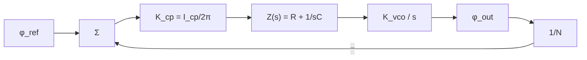
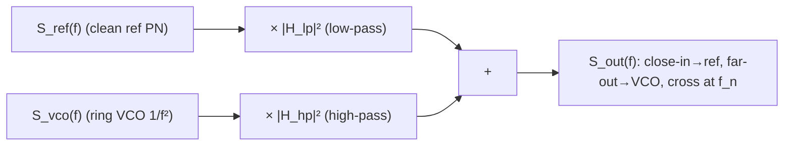

# Lab 13 — PLL/CDR 的 jitter transfer：VCO 高通、reference 低通

> **麵包屑**：[模擬實驗室](/04_simulation_labs/numerical_feeling) › 系統與進階 › **本頁（PLL/CDR jitter transfer）**。上游：[lab_11](/04_simulation_labs/lab_11_monte_carlo_jitter)；下游：[lab_12](/04_simulation_labs/lab_12_serdes_eye_ber)。

這個 lab 解釋一件實務上至關重要的事：**PLL（phase-locked loop，鎖相環）/ CDR（clock and
data recovery，時脈資料回復）如何「過濾」振盪器的相位雜訊**。關鍵結論是——對輸出相位而言，
**VCO（voltage-controlled oscillator，壓控振盪器）自己的相位雜訊被高通整形**（close-in 被
壓掉、far-out 主導），而 **reference（參考時鐘）的相位雜訊被低通整形**。這就是為什麼一個吵雜
的 ring-VCO，鎖到一個乾淨的參考上之後，仍能輸出可用的時鐘。

> **物理直覺（先講結論）**：PLL 是一個負回授環，它**追蹤**參考的相位。在環路頻寬 $f_n$ 以內
> （低 offset、慢變化），回授來得及反應，於是輸出**跟著參考**走——所以參考的低頻 noise 直接
> 傳到輸出（reference 低通），而 VCO 自己的低頻漂移會被回授**糾正掉**（VCO 高通）。在 $f_n$
> 以外（高 offset、快變化），回授來不及反應，輸出**跟著 VCO** 自由跑——VCO noise 原樣通過
> （VCO 高通的通帶）、參考的高頻 noise 被濾掉（reference 低通的止帶）。交越點就在環路頻寬 $f_n$。

## 1. 教學目標

- 理解 PLL 對相位雜訊的**兩個轉移函數**：reference→輸出是**低通** $\lvert H_{lp}\rvert^2$、
  VCO→輸出是**高通** $\lvert H_{hp}\rvert^2$，且 $H_{hp}=1-H_{lp}$。
- 用 $S_{out}=S_{ref}\lvert H_{lp}\rvert^2+S_{vco}\lvert H_{hp}\rvert^2$ 合成鎖定後輸出。
- 看出「close-in 跟 reference、far-out 跟 VCO，交越在環路頻寬 $f_n$」。
- 連到設計取捨：環路頻寬怎麼選，才能同時壓住 VCO close-in 與不放大 reference far-out。

## 2. 數學模型

**type-II 二階 PLL 的閉環轉移函數**（規範第 10.2 節「PLL（type-II 2nd order）」）。
以自然頻率 $\omega_n=2\pi f_n$、阻尼比 $\zeta$ 表示，referred to 輸出相位：

$$
\lvert H_{lp}\rvert^2=\frac{(2\zeta\omega_n\omega)^2+\omega_n^4}{(\omega_n^2-\omega^2)^2+(2\zeta\omega_n\omega)^2},
$$

$$
\lvert H_{hp}\rvert^2=\frac{\omega^4}{(\omega_n^2-\omega^2)^2+(2\zeta\omega_n\omega)^2}.
$$

其中 $\omega=2\pi f$（$f$ 為 offset 頻率）。

- **極限檢查（低頻 $\omega\to0$）**：$\lvert H_{lp}\rvert^2\to\omega_n^4/\omega_n^4=1$
  （參考全傳）、$\lvert H_{hp}\rvert^2\to0$（VCO 被壓）。✓ 符合「close-in 跟 reference」。
- **極限檢查（高頻 $\omega\to\infty$）**：$\lvert H_{lp}\rvert^2\to(2\zeta\omega_n\omega)^2/\omega^4\to0$
  （參考被濾掉）、$\lvert H_{hp}\rvert^2\to\omega^4/\omega^4=1$（VCO 全傳）。✓ 符合「far-out 跟 VCO」。
- **互補性**：可驗證在這組標準式下 $H_{hp}(s)=1-H_{lp}(s)$（時域同一誤差由兩條路徑分擔），
  故輸出相位 = 兩者之和。
- **Dimension check**：$\omega$、$\omega_n$ 同為 rad/s，分子分母同階（$\omega^4$ 或
  $\omega_n^4$），轉移函數無因次 ✓。

**輸出相位雜訊（功率疊加）。** 兩條路徑的 noise 不相關，功率相加（規範第 10.2 節）：

$$
S_{out}(f)=S_{ref}(f)\,\lvert H_{lp}\rvert^2+S_{vco}(f)\,\lvert H_{hp}\rvert^2 .
$$

- **Dimension check**：$S_{ref},S_{vco},S_{out}$ 皆 rad²/Hz，$\lvert H\rvert^2$ 無因次，
  相加單位一致 ✓。

**本 lab 的代表性輸入形狀**（anchored，非特定矽製程）：

$$
S_{vco}(f)=10^{-6}\Big(\frac{10^6}{f}\Big)^2\ \text{(ring VCO，強 }1/f^2\text{)},\qquad
S_{ref}(f)=10^{-12}+10^{-14}\Big(\frac{10^6}{f}\Big)^2\ \text{(乾淨參考)}.
$$

### 從電路到 $\omega_n$、$\zeta$：charge-pump type-II 二階環設計式

上面兩條 $\lvert H_{lp}\rvert^2$、$\lvert H_{hp}\rvert^2$ 是「標準式」——它們只認 $\omega_n$ 與
$\zeta$，不認電路。這一節把四個方塊（PFD/charge-pump、loop filter、VCO、divider）的小訊號
模型寫出來，推出開環增益 $G(s)$，證明閉環**就是**上面的標準式，並得到「給定 $f_n$、$\zeta$
要用多大的 $R$、$C$」的設計式。整條鏈屬標準 PLL 教材（外部文獻，非本站 5 篇 PDF：
F. M. Gardner, *Phaselock Techniques*, 3rd ed., Wiley, 2005；B. Razavi, *Design of CMOS
Phase-Locked Loops*, Cambridge Univ. Press, 2020），推導自含、逐步。

**四個方塊（相位域、鎖定後線性化）：**

1. **PFD + charge-pump**：相位差 $\Delta\phi$ 讓 CP 在每個參考週期導通 $\Delta\phi/2\pi$ 的比例
   時間，平均電流 $\bar i_{cp}=K_{cp}\big(\phi_{ref}-\phi_{out}/N\big)$，
   $K_{cp}=I_{cp}/2\pi$ [A/rad]（與 [sampling_pll](/06_design_insights/sampling_pll) 第 1 步
   同一個 $K_{cp}$）。
2. **Loop filter**（串聯 $R$–$C$ 接地）：$Z(s)=R+\dfrac{1}{sC}=\dfrac{1+sRC}{sC}$ [Ω]，
   $V_{ctrl}=\bar i_{cp}\,Z(s)$。電容把電流**積分**成電壓——第一個積分器。
3. **VCO**：頻率偏移 $=K_{vco}V_{ctrl}$，相位是頻率的積分：$\phi_{out}=\dfrac{K_{vco}}{s}V_{ctrl}$
   ——第二個積分器。**單位 flag（一個 $2\pi$）**：本式的 $K_{vco}$ 是 **rad/s/V**；資料手冊與本站
   [varactor_tuning_supply_pushing](/06_design_insights/varactor_tuning_supply_pushing) 慣用的
   Hz/V 要乘 $2\pi$（50 MHz/V $\to2\pi\times5\times10^{7}=3.142\times10^{8}$ rad/s/V）。
4. **Divider**：$\phi_{div}=\phi_{out}/N$（相位也被除 $N$，見
   [clock_chain_budget](/06_design_insights/clock_chain_budget) 規則 2）。


```mermaid
flowchart LR
    R["φ_ref"] --> S["Σ"]
    S --> PD["K_cp = I_cp/2π"]
    PD --> LF["Z(s) = R + 1/sC"]
    LF --> V["K_vco / s"]
    V --> O["φ_out"]
    O --> D["1/N"]
    D -->|"−"| S
```

**開環增益。** 沿環走一圈（從 $\phi_{div}$ 回到 $\phi_{div}$）：

$$
G(s)=\frac{I_{cp}}{2\pi}\Big(R+\frac{1}{sC}\Big)\frac{K_{vco}}{s}\frac{1}{N}
=\frac{I_{cp}K_{vco}}{2\pi N C}\cdot\frac{1+sRC}{s^{2}} .
$$

- **兩個 $1/s$**（電容一個、VCO 一個）→ 這就是「**type-II**」（兩個積分器）；零點
  $\omega_z=1/(RC)$ 是 $R$ 帶進來的，沒有它兩個純積分器相位恰 $-180^\circ$、不穩。
- **Dimension check**：$\dfrac{I_{cp}K_{vco}}{2\pi NC}$ 的單位 $=\dfrac{\text{A}\cdot\text{rad}\,\text{s}^{-1}\text{V}^{-1}}{\text{F}}
  =\dfrac{\text{A}}{\text{F}}\cdot\dfrac{\text{rad}}{\text{s}\,\text{V}}=\dfrac{\text{V}}{\text{s}}\cdot\dfrac{\text{rad}}{\text{s}\,\text{V}}=\text{rad/s}^2$；
  除以 $s^2$（$\text{s}^{-2}$）後 $G$ 無因次（rad 無因次）✓。這個組合的單位是「角頻率的平方」——它
  **就是** $\omega_n^2$：

$$
\boxed{\;\omega_n^{2}\equiv\frac{I_{cp}K_{vco}}{2\pi N C}\;}\qquad\Longrightarrow\qquad
G(s)=\frac{\omega_n^{2}\,(1+sRC)}{s^{2}} .
$$

**閉環（reference 路徑）。** $\phi_{out}=\dfrac{K_{cp}Z(s)K_{vco}}{s}\Big(\phi_{ref}-\dfrac{\phi_{out}}{N}\Big)
=N\,G(s)\Big(\phi_{ref}-\dfrac{\phi_{out}}{N}\Big)$，整理 $\phi_{out}(1+G)=NG\,\phi_{ref}$：

$$
\frac{\phi_{out}}{\phi_{ref}}=N\cdot\frac{G}{1+G}
=N\cdot\frac{\omega_n^{2}RC\,s+\omega_n^{2}}{s^{2}+\omega_n^{2}RC\,s+\omega_n^{2}} .
$$

跟標準式 $H_{lp}(s)=\dfrac{2\zeta\omega_n s+\omega_n^2}{s^2+2\zeta\omega_n s+\omega_n^2}$ 逐項比對，
唯一要對上的是 $s^1$ 的係數：$2\zeta\omega_n=\omega_n^2RC$，故

$$
\boxed{\;\zeta=\frac{\omega_nRC}{2}=\frac{R}{2}\sqrt{\frac{I_{cp}K_{vco}C}{2\pi N}}\;},\qquad
\omega_z=\frac{1}{RC}=\frac{\omega_n}{2\zeta}
$$

（最後一式就是 [pll_noise_budget](/06_design_insights/pll_noise_budget) peaking 一節的
$f_z=f_n/(2\zeta)$）。前面的 $N$ 是「輸出相位 $=N\times$ 參考相位」，功率 $\times N^2$——
pll_noise_budget 的 $S_{ref}N^2\lvert H_{lp}\rvert^2$ 就從這裡來；本 lab 的 $S_{ref}$ 已 referred
to 輸出（等於已含 $N^2$）。

**閉環（VCO 路徑）。** VCO 自己的相位雜訊 $\phi_{vco}$ 直接加在輸出：
$\phi_{out}=\phi_{vco}+NG\,(0-\phi_{out}/N)$ → $\phi_{out}(1+G)=\phi_{vco}$：

$$
\frac{\phi_{out}}{\phi_{vco}}=\frac{1}{1+G}=\frac{s^{2}}{s^{2}+2\zeta\omega_n s+\omega_n^{2}}=H_{hp}(s),
\qquad H_{lp}+H_{hp}=\frac{G}{1+G}+\frac{1}{1+G}=1\ ✓ .
$$

**重現頁上的 $\lvert H\rvert^2$。** 代 $s=j\omega$：分子
$\lvert 2\zeta\omega_n\,j\omega+\omega_n^2\rvert^2=(2\zeta\omega_n\omega)^2+\omega_n^4$；分母
$\lvert(\omega_n^2-\omega^2)+2\zeta\omega_n\,j\omega\rvert^2=(\omega_n^2-\omega^2)^2+(2\zeta\omega_n\omega)^2$
——正是本頁開頭的 $\lvert H_{lp}\rvert^2$；$H_{hp}$ 的分子 $\lvert(j\omega)^2\rvert^2=\omega^4$，
分母相同——正是 $\lvert H_{hp}\rvert^2$ ✓。

**charge-pump 雜訊到輸出。** 雜訊電流 $i_n$ 與 $\bar i_{cp}$ 同點注入：
$\phi_{out}=\dfrac{Z K_{vco}/s}{1+G}\,i_n=\dfrac{N}{K_{cp}}\,H_{lp}(s)\,i_n$，故

$$
S_{\phi,cp,out}(f)=\Big(\frac{2\pi N}{I_{cp}}\Big)^{2}S_{i,cp}(f)\,\lvert H_{lp}\rvert^{2}
$$

（與 [sampling_pll](/06_design_insights/sampling_pll) 第 3 步的
$S_{\phi,out}^{\text{classic}}=(2\pi N/I_{cp})^2S_i$ 同式，這裡多了環路的低通）。
**Dimension check**：$(\text{rad}/\text{A})^2\times\text{A}^2/\text{Hz}=\text{rad}^2/\text{Hz}$ ✓。
手感：lab_20 的平坦地板 $S_{cp}=5\times10^{-13}\ \text{rad}^2/\text{Hz}$ 在 $N=100$、
$I_{cp}=100\ \mu$A 下對應 $S_{i,cp}=5\times10^{-13}/(2\pi\times10^{6})^2=1.27\times10^{-26}$ A²/Hz
（$0.11$ pA/$\sqrt{\text{Hz}}$）——非常安靜；若 CP 100% 時間導通、只有 shot noise，
$2qI_{cp}=3.2\times10^{-23}$ A²/Hz 就比它大 2500 倍（真實 CP 只在相位誤差期間短暫導通，
雜訊隨導通比例縮小；lab_20 的地板是 illustrative）。

**Loop-filter 電阻的熱雜訊（pll_noise_budget 那一項「略去」的補完）。** $R$ 的熱雜訊電壓
$v_{n,R}$（PSD $4kTR$ V²/Hz）與 $R$ 串聯；CP 是電流源（高輸出阻抗），流過 $R$–$C$ 支路的電流
不變，所以 $v_{n,R}$ **原封不動加在 $V_{ctrl}$ 上**：$\phi_{out}=\dfrac{K_{vco}}{s}\cdot\dfrac{1}{1+G}\,v_{n,R}$，

$$
\boxed{\;S_{\phi,R}(f)=\frac{4kTR\,K_{vco}^{2}}{(2\pi f)^{2}}\,\lvert H_{hp}(f)\rvert^{2}\;}
\qquad[\text{rad}^2/\text{Hz}] .
$$

- **Dimension check**：$\text{V}^2/\text{Hz}\times(\text{rad}\,\text{s}^{-1}\text{V}^{-1})^2/(\text{s}^{-1})^2
  =\text{rad}^2/\text{Hz}$ ✓。
- **形狀**：低頻 $\lvert H_{hp}\rvert^2\propto f^4$ → $S_{\phi,R}\propto f^{2}$ 上升；高頻
  $\lvert H_{hp}\rvert^2\to1$ → $\propto1/f^2$ 下降——**帶通**，峰**恰在 $f=f_n$**
  （$\omega^2/[(\omega_n^2-\omega^2)^2+(2\zeta\omega_n\omega)^2]$ 在 $\omega=\omega_n$ 取極大
  $1/(2\zeta\omega_n)^2$），峰值 $S_{\phi,R}(f_n)=\dfrac{4kTR\,K_{vco}^2}{(2\zeta\omega_n)^2}$。
  這條就是 pll_noise_budget 表裡「loop filter：帶通、峰在 $f_n$」那一列的閉式。

**第三極 $C_3$（fractional-N 的必需品）。** 在 $R$–$C$ 支路上並聯 $C_3$ 接地：

$$
Z_3(s)=\Big(R+\frac{1}{sC}\Big)\Big\Vert\frac{1}{sC_3}
=\frac{1+sRC}{s\,(C+C_3)\,\big(1+s/\omega_{p3}\big)},\qquad
\omega_{p3}=\frac{C+C_3}{R\,C\,C_3}\approx\frac{1}{RC_3}\ (C_3\ll C).
$$

（推導：$Z_3=\dfrac{(1+sRC)/(sC)}{1+sC_3(R+1/sC)}$，分母 $=1+C_3/C+sRC_3=\dfrac{C+C_3}{C}\Big(1+s\dfrac{RCC_3}{C+C_3}\Big)$。）
$C_3$ 讓 $G$ 在 $f_{p3}$ 之外多掉 $-20$ dB/dec（$\lvert H_{lp}\rvert^2$ 從 $-20$ 變 $-40$ dB/dec）——
這正是 pll_noise_budget「fractional-N 第三項」toy 警告裡缺的那個極點：對 MASH-1-1-1 的
$+40$ dB/dec 斜坡，三階環只能把它**壓平**，要淨下降得再加一極（四階環）。代價是
phase margin：$f_{p3}$ 每靠近交越頻率 $f_c$ 一步就吃掉 $\arctan(f_c/f_{p3})$。常用經驗
$C_3\approx C/10$（外部慣例，Gardner／Razavi，非本站 5 篇 PDF）→
$\omega_{p3}=11/(RC)=11\,\omega_z$，且 $\omega_n$ 因 $C\to C+C_3$ 略降 $\sqrt{1/1.1}$。

> **worked example（本 lab 的 $f_n=1$ MHz、$\zeta=0.707$ 環）**：$N=100$、
> $K_{vco}=50$ MHz/V、$I_{cp}=100\ \mu$A。求 $C$、$R$，數值驗證 $f_n$ 與 $\lvert H\rvert^2$，
> 再算 loop-filter 電阻雜訊與 $C_3=C/10$ 的第三極。

**逐步代入：**

1. $K_{vco}=2\pi\times5\times10^{7}=3.1416\times10^{8}$ rad/s/V；$\omega_n=2\pi\times10^{6}=6.2832\times10^{6}$ rad/s，
   $\omega_n^2=3.9478\times10^{13}$ s⁻²。
2. $C=\dfrac{I_{cp}K_{vco}}{2\pi N\omega_n^2}=\dfrac{10^{-4}\times3.1416\times10^{8}}{628.32\times3.9478\times10^{13}}
   =\dfrac{3.1416\times10^{4}}{2.4805\times10^{16}}=1.2665\times10^{-12}$ F $=\mathbf{1.27\ pF}$。
3. $R=\dfrac{2\zeta}{\omega_nC}=\dfrac{1.414}{6.2832\times10^{6}\times1.2665\times10^{-12}}=\dfrac{1.414}{7.958\times10^{-6}}
   =1.777\times10^{5}\ \Omega=\mathbf{178\ k\Omega}$。
4. **驗證**：$f_n=\dfrac{1}{2\pi}\sqrt{\dfrac{I_{cp}K_{vco}}{2\pi NC}}=1.000$ MHz、
   $\zeta=(R/2)\sqrt{I_{cp}K_{vco}C/(2\pi N)}=0.707$、$f_z=1/(2\pi RC)=707$ kHz $=f_n/(2\zeta)$ ✓。
   從電路 $G(j\omega)$ 直接算 $\lvert G/(1+G)\rvert^2$ 在 1 MHz $=1.5002$，`pll_utils.H_lowpass_mag2`
   給 $1.5002$（$+1.76$ dB，pll_noise_budget 第 3 步的數字）；$\lvert1/(1+G)\rvert^2=0.5002$ 對
   `H_highpass_mag2` 的 $0.5002$ ✓。
5. **電阻雜訊**：$4kTR=4\times1.381\times10^{-23}\times300\times1.777\times10^{5}=2.94\times10^{-15}$ V²/Hz
   （$54$ nV/$\sqrt{\text{Hz}}$）。在 $f=f_n$：$K_{vco}^2/\omega_n^2=(3.1416\times10^{8}/6.2832\times10^{6})^2=2500$、
   $\lvert H_{hp}\rvert^2=1/(4\zeta^2)=0.500$ → $S_{\phi,R}(1\ \text{MHz})=2.94\times10^{-15}\times2500\times0.5
   =3.68\times10^{-12}\ \text{rad}^2/\text{Hz}$，$\mathcal{L}=10\log_{10}(\tfrac12\times3.68\times10^{-12})=-117.4$ dBc/Hz
   （SSB $=\tfrac12S_\phi$，規範 Eq.16）。
   **對照 lab_20 的預算**：in-band 地板 $1.5\times10^{-12}$（$-121.2$ dBc/Hz）——電阻項在 $f_n$
   比它**高 2.5 倍**，「略去」在 $I_{cp}=100\ \mu$A 這種小電流（大 $R$）設計下**不成立**；但比
   ring VCO 在 $f_n$ 的 $2\times10^{-10}\times0.5=10^{-10}$ 低 27 倍，所以總 jitter 仍由 VCO 主宰。
   單獨積分 1 kHz–1 GHz（$f_0=5$ GHz）：$\sigma_{t,R}=91$ fs（對照 lab_20 最佳點 259 fs——不可忽略、
   但非主角）。
6. **設計旋鈕**：固定 $f_n,\zeta$ 時 $C\propto I_{cp}$、$R\propto1/I_{cp}$ → $S_{\phi,R}\propto R\propto1/I_{cp}$，
   而 CP 雜訊項 $(2\pi N/I_{cp})^2S_{i,cp}$ 也隨 $I_{cp}$ 下降——**加大 charge-pump 電流同時壓兩項**，
   代價是功率與 $C$ 的面積（$I_{cp}$ 100 µA → 1 mA：$R=17.8$ kΩ、$C=12.7$ pF、$S_{\phi,R}$ 降 10 dB）。
7. **第三極**：$C_3=C/10=0.127$ pF → $f_{p3}=\dfrac{C+C_3}{2\pi RCC_3}=7.78$ MHz $=11f_z$。
   二階環交越 $f_c=f_n\sqrt{2\zeta^2+\sqrt{4\zeta^4+1}}=1.554$ MHz、PM $=65.5^\circ$；加 $C_3$ 後
   數值解 $f_c=1.414$ MHz、PM $=53.1^\circ$——掉了 $12.4^\circ$（粗估 $\arctan(1.554/7.78)=11.3^\circ$，
   差值來自 $\omega_n$ 被 $C+C_3$ 拉低）。

**Dimension check（設計式）：** $C=\dfrac{[\text{A}][\text{rad/s/V}]}{[\text{rad/s}]^2}=\dfrac{\text{A}}{\text{V/s}}=\dfrac{\text{A}\cdot\text{s}}{\text{V}}=\text{F}$ ✓；
$R=\dfrac{1}{[\text{rad/s}][\text{F}]}=\dfrac{\text{s}}{\text{F}}=\Omega$ ✓。

```python
import numpy as np
from simulations.common.pll_utils import design_type2, H_lowpass_mag2, H_highpass_mag2

fn, zeta, N, Kvco, Icp = 1e6, 0.707, 100, 50e6, 100e-6   # Hz, -, -, Hz/V, A
R, C = design_type2(fn, zeta, N, Kvco, Icp)
print(round(C*1e12, 3), "pF", round(R/1e3, 1), "kohm")
# -> 1.267 pF 177.7 kohm
kv = 2*np.pi*Kvco                                          # rad/s/V
wn = np.sqrt(Icp*kv/(2*np.pi*N*C)); z = (R/2)*np.sqrt(Icp*kv*C/(2*np.pi*N))
print(round(wn/2/np.pi/1e6, 3), "MHz", round(z, 3), round(1/(2*np.pi*R*C)/1e3, 1), "kHz")
# -> 1.0 MHz 0.707 707.2 kHz
def G(f, C3=0.0):                                          # open loop straight from the circuit
    s = 1j*2*np.pi*f
    Z = (R + 1/(s*C)) / (1 + s*C3*(R + 1/(s*C)))          # C3=0 -> plain series R-C
    return (Icp/(2*np.pi)) * Z * (kv/s) / N
g = G(1e6)
print(round(abs(g/(1+g))**2, 4), round(H_lowpass_mag2(np.array([1e6]), fn, zeta)[0], 4),
      round(abs(1/(1+g))**2, 4), round(H_highpass_mag2(np.array([1e6]), fn, zeta)[0], 4))
# -> 1.5002 1.5002 0.5002 0.5002
```

```python
import numpy as np
from simulations.common.pll_utils import design_type2, H_highpass_mag2

fn, zeta, N, Kvco, Icp, f0 = 1e6, 0.707, 100, 50e6, 100e-6, 5e9
R, C = design_type2(fn, zeta, N, Kvco, Icp)
kv = 2*np.pi*Kvco
Sv = 4*1.380649e-23*300*R                                  # V^2/Hz
f = np.logspace(3, 9, 200001)
S_R = Sv*kv**2/(2*np.pi*f)**2 * H_highpass_mag2(f, fn, zeta)   # rad^2/Hz
i = np.argmin(abs(f - 1e6))
print(f"{Sv:.3e}", f"{S_R[i]:.3e}", round(10*np.log10(0.5*S_R[i]), 1), round(f[np.argmax(S_R)]/1e6, 2))
# -> 2.944e-15 3.681e-12 -117.4 1.0
sig_R = np.sqrt(np.trapezoid(S_R, f))/(2*np.pi*f0)
print(round(sig_R*1e15, 1), round(S_R[i]/1.5e-12, 2), round(2e-10*0.5/S_R[i], 1))
# -> 91.0 2.45 27.2
R2, C2 = design_type2(fn, zeta, N, Kvco, 1e-3)             # Icp x10
print(round(R2/1e3, 1), round(C2*1e12, 1), round(10*np.log10(R2/R), 1))
# -> 17.8 12.7 -10.0
```

```python
import numpy as np
from simulations.common.pll_utils import design_type2

fn, zeta, N, Kvco, Icp = 1e6, 0.707, 100, 50e6, 100e-6
R, C = design_type2(fn, zeta, N, Kvco, Icp); kv = 2*np.pi*Kvco
C3 = C/10
fp3 = (C + C3)/(R*C*C3)/(2*np.pi)
print(round(fp3/1e6, 2), round(fp3*2*np.pi*R*C, 1))
# -> 7.78 11.0
def G(f, C3=0.0):
    s = 1j*2*np.pi*f
    Z = (R + 1/(s*C)) / (1 + s*C3*(R + 1/(s*C)))
    return (Icp/(2*np.pi)) * Z * (kv/s) / N
for c3 in (0.0, C3):                                       # 2nd-order vs 3rd-order loop
    ff = np.logspace(5, 7.5, 400001); g = G(ff, c3); j = np.argmin(abs(abs(g) - 1))
    print(round(ff[j]/1e6, 3), "MHz", round(180 + np.degrees(np.angle(g[j])), 1), "deg")
# -> 1.554 MHz 65.5 deg
# -> 1.414 MHz 53.1 deg
```

**適用與失效（設計式）：** 只在鎖定後的線性相位域成立（$\Delta\phi$ 小到 CP 平均電流線性）；
理想 CP（無 up/down mismatch、leakage、dead-zone）、divider 無延遲、VCO $K_{vco}$ 線性且無
額外極點。$f_n$ 必須遠低於 $f_{ref}$（經驗 $f_n\lesssim f_{ref}/10$，外部慣例）——否則
「平均電流」的連續時間近似失效，離散時間效應（取樣、額外相位延遲）會吃掉 PM。

## 3. Block diagram


```mermaid
flowchart LR
    A["S_ref(f) (clean ref PN)"] --> B["× |H_lp|² (low-pass)"]
    C["S_vco(f) (ring VCO 1/f²)"] --> D["× |H_hp|² (high-pass)"]
    B --> E["+"]
    D --> E
    E --> F["S_out(f): close-in→ref, far-out→VCO, cross at f_n"]
```

## 4. Python 核心 code

逐字摘自 `simulations/lab_13_pll_cdr_transfer.py` 的 `main()`：設定環路頻寬 `fn`、阻尼 `zeta`，
給出 VCO 與 reference 的代表性 PSD，再呼叫 `shape_output_phase_noise` 合成輸出。

```python
f = np.logspace(3, 9, 2000)  # 1 kHz .. 1 GHz offset
fn = 1e6  # loop natural frequency ~ 1 MHz
zeta = 0.707

# representative phase-noise PSDs (rad^2/Hz), anchored shapes
S_vco = 1e-6 * (1e6 / f) ** 2          # ring VCO: strong 1/f^2 close-in
S_ref = 1e-12 + 1e-14 * (1e6 / f) ** 2  # clean reference: low flat + slight 1/f^2

S_out, S_ref_sh, S_vco_sh = shape_output_phase_noise(f, S_ref, S_vco, fn, zeta)
```

底層轉移函數（`pll_utils.py`）就是規範第 10.2 節 PLL 式的逐字實現：

```python
def H_lowpass_mag2(f, fn_hz, zeta=0.707):
    """|H_lp(j2*pi*f)|^2 for a type-II 2nd-order PLL (reference -> output)."""
    w = 2 * np.pi * np.asarray(f, dtype=float)
    wn = loop_natural_freq(fn_hz)
    num = (2 * zeta * wn * w) ** 2 + wn ** 4
    den = (wn ** 2 - w ** 2) ** 2 + (2 * zeta * wn * w) ** 2
    return num / den

def H_highpass_mag2(f, fn_hz, zeta=0.707):
    """|H_hp(j2*pi*f)|^2 = |1 - H_lp|^2 for the VCO -> output path."""
    w = 2 * np.pi * np.asarray(f, dtype=float)
    wn = loop_natural_freq(fn_hz)
    num = w ** 4
    den = (wn ** 2 - w ** 2) ** 2 + (2 * zeta * wn * w) ** 2
    return num / den
```

- `shape_output_phase_noise` 內部即 `S_ref*lp + S_vco*hp`，回傳輸出與兩條 shaped 分量。
- `zeta=0.707`（Butterworth 阻尼）給平坦的閉環、無明顯 jitter peaking。

## 5. 完整 script path

`simulations/lab_13_pll_cdr_transfer.py`
（相依模組：`simulations/common/pll_utils.py` 的 `H_lowpass_mag2`、`H_highpass_mag2`、
`shape_output_phase_noise`、`loop_natural_freq`；§2 設計式的 `design_type2(fn, zeta, N, Kvco, Icp)`→`(R, C)`
也在同一檔；`simulations/common/plot_utils.py` 的 `savefig`。）

執行方式：`python scripts/run_all_sims.py`。

## 6. 參數表

| 參數 | 變數 | 值 | 說明 |
|---|---|---|---|
| offset 掃描 | `f` | $10^3\sim10^9$ Hz（logspace 2000） | 1 kHz–1 GHz |
| 環路自然頻率 | `fn` | $1\times10^{6}$ Hz | 環路頻寬 $\approx$ 交越點 |
| 阻尼比 | `zeta` | $0.707$ | Butterworth，無 peaking |
| VCO PN 位準 | — | $10^{-6}\,(10^6/f)^2$ rad²/Hz | ring：強 $1/f^2$ |
| 參考 PN 位準 | — | $10^{-12}+10^{-14}(10^6/f)^2$ rad²/Hz | 乾淨：低平 + 微 $1/f^2$ |

## 7. 單位表

| 量 | 符號 | 單位 | 本 lab 取值 |
|---|---|---|---|
| offset 頻率 | $f$ | Hz | 1 kHz–1 GHz |
| 角頻率 | $\omega=2\pi f$ | rad/s | — |
| 環路自然頻率 | $\omega_n=2\pi f_n$ | rad/s | $2\pi\times10^6$ |
| 阻尼比 | $\zeta$ | —（無因次） | 0.707 |
| 功率轉移 | $\lvert H_{lp}\rvert^2,\lvert H_{hp}\rvert^2$ | —（無因次） | $0\sim1$ |
| 相位 PSD | $S_{ref},S_{vco},S_{out}$ | rad²/Hz | 見參數表 |

## 8. 模擬圖


## 9. 如何解讀圖

- **左圖（轉移函數）**：藍線 $\lvert H_{lp}\rvert^2$ 在低 offset 是 1（0 dB）、過 $f_n$ 後
  下滑（低通）；紅線 $\lvert H_{hp}\rvert^2$ 在低 offset 趨近 0、過 $f_n$ 後升到 1（高通）。
  兩條在 $f_n=1$ MHz（灰虛線）附近交越——這就是環路頻寬。
- **右圖（輸出 PN 合成）**：
  - **黑線（鎖定後輸出）**在 close-in（$<f_n$）**貼著藍色的 reference**——VCO 的強 $1/f^2$
    被高通壓掉了。
  - 在 far-out（$>f_n$）黑線**貼著紅色的 VCO**——參考的高頻被低通濾掉，VCO 原樣通過。
  - 交越（兩條輸入相當）就在 $f_n$ 附近。
- **核心訊息**：鎖相把「吵雜 VCO 的 close-in」換成「乾淨參考的 close-in」，代價是 far-out
  仍由 VCO 決定。**環路頻寬 $f_n$ 是設計旋鈕**：$f_n$ 拉高 → 壓住更多 VCO close-in，但放進
  更多 reference far-out 與可能的 jitter peaking；$f_n$ 拉低則相反。
- **CDR 視角**：把「reference」想成輸入資料的 jitter——CDR 低通追蹤低頻 input jitter（jitter
  tolerance）、高通拒斥高頻——同一套整形。

## 10. 對應 paper 公式/figure

- **PLL 轉移函數**：規範第 10.2 節「PLL（type-II 2nd order）」的 $\lvert H_{lp}\rvert^2$、
  $\lvert H_{hp}\rvert^2$ 與 $S_{out}=S_{ref}\lvert H_{lp}\rvert^2+S_{vco}\lvert H_{hp}\rvert^2$。
  屬通用 PLL/CDR 理論，**不在 5 篇 PDF 內**，以標準文獻補充。
- **被整形的 VCO noise** 本身來自 [P1]/[P2] 的 ISF 相位雜訊（ring VCO 的 $1/f^2$ 對應規範
  公式 21、[P2] 的 ring 討論）；本 lab 把那個 $S_\phi$ 餵進環路整形。
- **止住累積 jitter**：呼應 [lab_11](/04_simulation_labs/lab_11_monte_carlo_jitter)
  ——free-running 的 $\sqrt{\Delta N}$ 累積，正是被 PLL 的高通整形在 close-in 收住。
- 對應網站圖 `pll_cdr_jitter_transfer.png`；設計串接見
  [serdes_clocking_connection](/06_design_insights/serdes_clocking_connection)。

## 11. 限制與 approximation

- **這是 pedagogical toy model，非 transistor-level**：用理想 type-II 二階閉環式（§2 的設計式
  已把 charge-pump、$R$–$C$、VCO、divider 四個方塊接起來，但仍是理想 CP），沒有 CP up/down
  mismatch、leakage、dead-zone、divider 延遲、reference spur 等。
- **線性、時不變、小相位假設**：相位域線性化（PLL 鎖定後的小訊號模型）；大失鎖、cycle slip
  不在範圍。
- **二階近似**：真實環路常含額外極點（三階以上）影響高頻 roll-off 與穩定度；本式只取主導二階
  （§2 已給第三極 $C_3$ 的位置 $f_{p3}$ 與 PM 代價，但圖仍用二階式）。
- **noise 不相關假設**：$S_{out}=S_{ref}\lvert H_{lp}\rvert^2+S_{vco}\lvert H_{hp}\rvert^2$
  要求 reference 與 VCO noise 不相關（功率相加）。實務若共用偏壓/電源可能相關。
- **輸入 PSD 形狀為示意**：$S_{vco}$、$S_{ref}$ 的位準與形狀是 anchored 示例，非特定矽製程
  量測值；重點在**整形機制與交越在 $f_n$**，不是絕對 dBc/Hz。
- **無 jitter peaking 細節**：$\zeta=0.707$ 刻意選平坦；$\zeta$ 偏小會在 $f_n$ 附近出現
  peaking（輸出 PN 凸起），本圖未掃此情形。

## 重點回顧

- PLL 對輸出相位：reference 低通 $\lvert H_{lp}\rvert^2$、VCO 高通 $\lvert H_{hp}\rvert^2$，
  $H_{hp}=1-H_{lp}$。
- $S_{out}=S_{ref}\lvert H_{lp}\rvert^2+S_{vco}\lvert H_{hp}\rvert^2$；close-in 跟 reference、
  far-out 跟 VCO、交越在環路頻寬 $f_n$。
- 這就是吵雜 ring-VCO 鎖到乾淨參考後仍能給好時鐘的原因。
- 環路頻寬 $f_n$ 是核心旋鈕：拉高壓 VCO close-in、放進 reference far-out 與 peaking 風險。
- **設計式**（charge-pump type-II）：$G(s)=\frac{I_{cp}}{2\pi}(R+\frac{1}{sC})\frac{K_{vco}}{s}\frac{1}{N}$，
  $\omega_n=\sqrt{I_{cp}K_{vco}/(2\pi NC)}$、$\zeta=\frac{R}{2}\sqrt{I_{cp}K_{vco}C/(2\pi N)}$（$K_{vco}$ 用 rad/s/V）；
  $f_n=1$ MHz、$\zeta=0.707$、$N=100$、$K_{vco}=50$ MHz/V、$I_{cp}=100\ \mu$A → $C=1.27$ pF、$R=178$ kΩ。
- loop-filter 電阻項 $S_{\phi,R}=4kTR\,K_{vco}^2/(2\pi f)^2\cdot\lvert H_{hp}\rvert^2$ 帶通、峰在 $f_n$（本例 $-117.4$ dBc/Hz
  @1 MHz、$\sigma_{t,R}=91$ fs）；$C_3\approx C/10$ 給第三極 $f_{p3}=7.78$ MHz，PM $65.5^\circ\to53.1^\circ$。

## 延伸閱讀

- VCO 的 $1/f^2$ 從哪來：[white_noise_to_phase_noise](/03_isf_core_theory/white_noise_to_phase_noise)
- free-running 累積為何要鎖：[lab_11_monte_carlo_jitter](/04_simulation_labs/lab_11_monte_carlo_jitter)
- 輸出 jitter 對 BER 的影響：[lab_12_serdes_eye_ber](/04_simulation_labs/lab_12_serdes_eye_ber)
- 設計串接：[serdes_clocking_connection](/06_design_insights/serdes_clocking_connection)
- $K_{cp}=I_{cp}/2\pi$ 與 CP 雜訊 $(2\pi N/I_{cp})^2S_i$ 的另一個用法（sub-sampling 為何免 $\times N^2$）：[sampling_pll](/06_design_insights/sampling_pll)
- $K_{vco}$（Hz/V 慣例）與 tune-line 雜訊：[varactor_tuning_supply_pushing](/06_design_insights/varactor_tuning_supply_pushing)
- **用在設計/理論**：把各 noise 源乘上 transfer、做整顆 PLL 雜訊預算與最佳 loop BW → [pll_noise_budget](/06_design_insights/pll_noise_budget)
