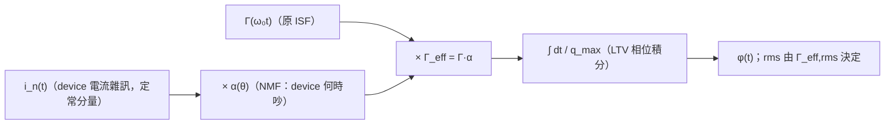

# Lab 14 — Cyclostationary noise 與 effective ISF

> **麵包屑**：[模擬實驗室](/04_simulation_labs/numerical_feeling) › 系統與進階 › **本頁（cyclostationary／effective ISF）**。上游：[lab_06](/04_simulation_labs/lab_06_white_noise_phase_noise)、[effective_isf](/03_isf_core_theory/effective_isf)；相關：[lab_09](/04_simulation_labs/lab_09_design_tradeoffs)。

前面幾個 lab 都假設 noise 源「整個週期都一樣吵」（stationary，定常）。真實電路不是這樣：
一顆 tail current（尾電流源）或 switching transistor（切換電晶體）**只在週期的某一段才導通、
才注入 noise**。這種「noise 強度本身隨振盪相位週期性變化」的 noise 叫
**cyclostationary noise（週期穩態雜訊）**。這個 lab 用一個介於 0、1 之間的
**noise-modulating function（NMF，雜訊調變函數）** $\alpha(\theta)$ 把「device 何時吵」
畫出來，然後說明真正決定 phase noise 的不是原始 ISF，而是 **effective ISF（有效 ISF）**
$\Gamma_{eff}=\Gamma\cdot\alpha$。

> **物理直覺（先講結論）**：phase noise 不只看 device 多吵（$\overline{i_n^2}$），也看
> **它在波形的哪個相位吵**。同一顆 device，若它最吵的時段剛好落在 ISF 很大的地方
> （例如 zero crossing），它的破壞力就大；若落在 ISF≈0 的波峰，破壞力就小。把
> 「何時吵」$\alpha(\theta)$ 乘進 ISF，得到 $\Gamma_{eff}=\Gamma\alpha$，再對 $\Gamma_{eff}$
> 取 rms，才是這顆 cyclostationary 源真正的有效敏感度 $\Gamma_{eff,rms}$。

## 1. 教學目標

- 理解 stationary（定常）與 cyclostationary（週期穩態）noise 的差別。
- 用 NMF $\alpha(\theta)\in[0,1]$ 模型化「device 只在週期的某段吵」。
- 推出 effective ISF $\Gamma_{eff}(\theta)=\Gamma(\theta)\,\alpha(\theta)$，並用它取代 $\Gamma$ 算 rms。
- 看懂：**同一顆 device、同樣 noise 量**，只因「注入相位」不同，$\Gamma_{eff,rms}$ 可以差好幾倍。

## 2. 數學模型

從 [P1] Eq.(21), p.185 的白噪 phase-noise 律出發：

$$
\mathcal{L}\{\Delta\omega\}=10\log_{10}\!\left(\frac{\Gamma_{rms}^2}{q_{max}^2}\cdot\frac{\overline{i_n^2}/\Delta f}{4\,\Delta\omega^2}\right)
$$

這條假設 $\overline{i_n^2}/\Delta f$ 是常數（stationary）。若 noise 是 cyclostationary，
其瞬時 PSD 可寫成「定常分量乘上一個週期 gate」：

$$
\overline{i_n^2(\theta)}/\Delta f=\big(\overline{i_n^2}/\Delta f\big)\cdot\alpha^2(\theta),\qquad \alpha(\theta)\in[0,1].
$$

把這個相位相依塞回 [P1] Eq.(11), p.182 的 ISF 積分核 $\Gamma(\omega_0\tau)\,i_n(\tau)$，
等效於把 noise 的「$\alpha$」併進 ISF。定義 **effective ISF**（規範第 10 節）：

$$
\Gamma_{eff}(\theta)=\Gamma(\theta)\,\alpha(\theta).
$$

於是 cyclostationary 源的 phase noise 就用 $\Gamma_{eff,rms}$ 取代 $\Gamma_{rms}$：

$$
\Gamma_{eff,rms}=\sqrt{\frac{1}{2\pi}\int_0^{2\pi}\big[\Gamma(\theta)\,\alpha(\theta)\big]^2\,d\theta},
$$

並用它代入 [P1] Eq.(21)：$\mathcal{L}\propto\Gamma_{eff,rms}^2/q_{max}^2$。

- **為何乘法是對的**：$\alpha$ 描述「noise 振幅相對被 gate 的比例」，ISF 描述「該相位的
  noise 轉成相位的效率」。兩者都作用在「同一時刻的注入」上，效果相乘。
- **Dimension check**：$\Gamma$ 無因次、$\alpha$ 無因次（$\in[0,1]$）⇒ $\Gamma_{eff}$ 無因次 ✓，
  和原 ISF 同單位，可直接代進 Eq.(21)。

本 lab 用理想 LC 的 $\Gamma(\theta)=-\sin\theta$（[P1] 推導，最大 $\vert\Gamma\vert$ 在
zero crossing $\theta=\pi/2$、$\Gamma\approx0$ 在波峰 $\theta=0$），配兩個寬度同為 $\pi$ 的
平滑 gate：一個 gate 在 zero crossing（壞），一個在波峰（好）。

## 3. Block diagram



## 4. Python 核心 code

下面是 `simulations/lab_14_cyclostationary_isf.py` 的核心：用 `gamma_lc_ideal`（$-\sin$）
當 ISF，用平滑週期窗 `nmf_window` 當 $\alpha(\theta)$，再用 `effective_isf`（即 $\Gamma\cdot\alpha$）
與 `gamma_rms` 算各自的 rms。

```python
import numpy as np
from simulations.common.isf_utils import gamma_lc_ideal, gamma_rms, effective_isf


def nmf_window(theta, center, width):
    """Smooth periodic gate in [0,1], centered at `center`, of given width (rad)."""
    d = np.angle(np.exp(1j * (theta - center)))  # wrapped distance
    return 0.5 * (1 + np.cos(np.pi * np.clip(d / (width / 2), -1, 1)))


theta = np.linspace(0, 2 * np.pi, 2000, endpoint=True)
gamma = gamma_lc_ideal(theta)                 # -sin(theta)

# case 1: device noisy near the ZERO CROSSING (where |Gamma| is max) -> bad
a_bad = nmf_window(theta, center=np.pi / 2, width=np.pi)
# case 2: device noisy near the PEAK (where |Gamma|~0) -> good
a_good = nmf_window(theta, center=0.0, width=np.pi)

g_bad = effective_isf(gamma, a_bad)           # Gamma * alpha
g_good = effective_isf(gamma, a_good)

grms = gamma_rms(theta, gamma)                # stationary reference
grms_bad = gamma_rms(theta, g_bad)
grms_good = gamma_rms(theta, g_good)
# -> stationary=0.707, bad=0.395, good=0.177
```

`effective_isf(gamma_values, alpha_values)` 就是逐點相乘（見 `simulations/common/isf_utils.py`），
`gamma_rms(theta, gamma)` 是 $\sqrt{\frac{1}{2\pi}\int_0^{2\pi}\Gamma^2\,d\theta}$，對應 [P1] Eq.(20)。

## 5. 完整 script path

`simulations/lab_14_cyclostationary_isf.py`（`main()` 產生圖；NMF 用 `nmf_window`，
effective ISF 與 rms 用 `simulations/common/isf_utils.py` 的 `effective_isf`、`gamma_rms`、
`gamma_lc_ideal`）。重跑：`python scripts/run_all_sims.py`。

## 6. 參數表

| 參數 | 符號 | 值 | 角色 |
|---|---|---|---|
| ISF（理想 LC） | $\Gamma(\theta)$ | $-\sin\theta$ | 固定（physically derived） |
| 相位取樣點數 | — | 2000 | 一個週期 $[0,2\pi]$（含端點） |
| 壞 gate 中心 | $\theta_{c,\text{bad}}$ | $\pi/2$ | noise 落在 zero crossing（$\vert\Gamma\vert$ 最大） |
| 好 gate 中心 | $\theta_{c,\text{good}}$ | $0$ | noise 落在波峰（$\Gamma\approx0$） |
| gate 寬度 | width | $\pi$ | 兩 case 相同（半個週期） |
| NMF 上下界 | $\alpha$ | $[0,1]$ | 平滑 raised-cosine 窗 |

## 7. 單位表

| 量 | 符號 | 單位 |
|---|---|---|
| 振盪相位 | $\theta=\omega_0\tau$ | rad |
| ISF | $\Gamma$ | 無因次 |
| NMF | $\alpha$ | 無因次（$\in[0,1]$） |
| effective ISF | $\Gamma_{eff}=\Gamma\alpha$ | 無因次 |
| rms ISF | $\Gamma_{rms},\Gamma_{eff,rms}$ | 無因次 |

## 8. 模擬圖


## 9. 如何解讀圖

- **左圖 (a)**：黑線是 ISF $\Gamma=-\sin\theta$（在 $\theta/2\pi=0.25$、$0.75$ 即 zero crossing
  處 $\vert\Gamma\vert$ 最大；在 $0$、$0.5$ 即波峰處 $\Gamma=0$）。紅虛線 $\alpha$ 把 device 的吵
  時段放在 zero crossing（$\theta/2\pi\approx0.25$）；綠虛線 $\alpha$ 放在波峰（$\theta/2\pi\approx0$）。
  兩個 gate 形狀、寬度完全一樣，**只差相位**。
- **右圖 (b)**：把左圖相乘得 $\Gamma_{eff}=\Gamma\alpha$。紅線（壞）在 zero crossing 撞上 ISF 的
  大值，留下一個又深又寬的 lobe，$\Gamma_{eff,rms}=0.395$；綠線（好）落在波峰，ISF 幾乎為 0，
  只剩兩側殘餘小 lobe，$\Gamma_{eff,rms}=0.177$。
- **關鍵讀法**：stationary 參考 $\Gamma_{rms}=0.707$（=$1/\sqrt2$，$-\sin$ 整週的 rms）。
  一旦 gate 只開半週，rms 一定下降；但**下降多少完全看 gate 對到 ISF 的哪裡**：壞 case
  仍有 $0.395$，好 case 砍到 $0.177$，差約 $2.2$ 倍。
  phase noise 差 $20\log_{10}(0.395/0.177)\approx7$ dB。**同一顆 device、同樣 noise 量，只改注入相位就賺 7 dB。**

## 10. 對應 paper 公式/figure

- **白噪 phase noise（用 $\Gamma_{eff,rms}$ 取代 $\Gamma_{rms}$）**：[P1] Eq.(21), p.185。
- **ISF 積分核（$\Gamma\cdot i_n$，$\alpha$ 併入處）**：[P1] Eq.(11), p.182。
- **Parseval / rms**：[P1] Eq.(20), p.185，$\sum_n c_n^2=2\Gamma_{rms}^2$。
- **cyclostationary noise 概念**：[P1] Sec. II-D「Cyclostationary Noise Sources」，
  Eq.(25)–(27), p.186。其中 $i_n(t)=i_{n0}(t)\,\alpha(\omega_0 t)$ 為 Eq.(25)、代回積分為 Eq.(26)，
  而 effective ISF $\Gamma_{eff}(x)=\Gamma(x)\cdot\alpha(x)$ 即 Eq.(27)；本 lab 是其 toy 視覺化。
- **概念延伸**：device 的 $\alpha$ 從哪來、如何 mapping，見
  [device_noise_mapping](/06_design_insights/device_noise_mapping) 與
  [effective_isf](/03_isf_core_theory/effective_isf)。

## 11. 限制與 approximation

- **toy model，非 transistor-level**：$\alpha(\theta)$ 用人工 raised-cosine 窗，不是從電晶體
  $g_m$／導通區間萃取的真實 NMF；ISF 用理想 LC 的 $-\sin$。真實 device 的 $\alpha$ 與 $\Gamma$
  都要靠 PSS／transient 模擬萃取。
- **$\Gamma_{eff}=\Gamma\alpha$ 是一階近似**：假設 noise 振幅被 gate 線性調變、且 $\alpha$ 與相位
  響應相互獨立；忽略 noise 自身的 AM–PM 與 $\alpha$、$\Gamma$ 間的耦合。
- **只示意 rms，未跑 PSD**：本 lab 用 $\Gamma_{eff,rms}$ 說明 scaling，沒有把 cyclostationary
  源實際丟進 [P1] Eq.(11) 積分跑出 PSD（那會是 lab_06 的延伸）。
- **單一源**：真實電路多個 cyclostationary 源各有自己的 $\alpha$，要分別算 $\Gamma_{eff,rms}$
  再對功率求和。
- **factor-of-2**：沿用 Eq.(21) 的 $4\Delta\omega^2$ 慣例；SSB 記帳的 2 倍差異不影響此處所有
  相對（dB）比較。

## 重點回顧

- cyclostationary noise：noise 強度隨振盪相位週期變化，用 $\alpha(\theta)\in[0,1]$ 描述。
- effective ISF：$\Gamma_{eff}=\Gamma\cdot\alpha$；phase noise 用 $\Gamma_{eff,rms}$ 取代 $\Gamma_{rms}$ 代入 [P1] Eq.(21)。
- 本 lab 數字：stationary $\Gamma_{rms}=0.707$；noise 在 zero crossing → $0.395$（壞）；在波峰 → $0.177$（好）。
- 設計含義：把吵的 device 安排在 ISF 小的相位（波峰）注入，可省可觀 phase noise。

## 延伸閱讀

- effective ISF 理論：[effective_isf](/03_isf_core_theory/effective_isf)
- 白噪 → phase noise（stationary 版）：[lab_06_white_noise_phase_noise](/04_simulation_labs/lab_06_white_noise_phase_noise)
- 設計取捨總整理：[lab_09_design_tradeoffs](/04_simulation_labs/lab_09_design_tradeoffs)
- **用在設計/理論**：device 的 $\alpha(\theta)$ 從 bias/導通區間怎麼 mapping 出來 → [device_noise_mapping](/06_design_insights/device_noise_mapping)
