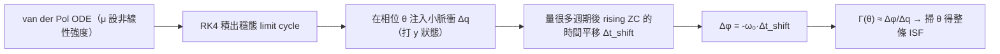

# Lab 15 — 非線性振盪器的 ISF（van der Pol）

> **麵包屑**：[模擬實驗室](/04_simulation_labs/numerical_feeling) › 系統與進階 › **本頁（非線性 ISF）**。上游：[isf_definition](/03_isf_core_theory/isf_definition)、[lab_04](/04_simulation_labs/lab_04_impulse_injection_sweep)；相關：[lab_03](/04_simulation_labs/lab_03_ring_oscillator_toy_model)。

前面用理想 LC 推出 $\Gamma(\theta)=-\sin\theta$，很乾淨，但那是**弱非線性、近正弦波形**的
特例。本 lab 要破除一個常見誤解：**ISF 並不是永遠的 $-\sin$**。ISF 是由振盪器的
**大訊號穩態波形（large-signal steady-state waveform）** 決定的——波形長什麼樣，ISF 就長
什麼樣。我們用經典的 **van der Pol（范德波）振盪器**，靠一個非線性強度旋鈕 $\mu$ 把波形
從「近正弦」連續調到「relaxation（弛張）振盪、有尖銳 transition」，看 ISF 怎麼跟著變形。

> **物理直覺（先講結論）**：ISF 量的是「在波形的哪個相位踢一下、相位被推得最多」。
> 對近正弦波（小 $\mu$），最敏感的點在 zero crossing、最不敏感在波峰，所以 ISF 接近
> $\pm\sin$。但當 $\mu$ 變大、波形出現又快又陡的 transition，敏感度就**集中、偏斜**到那些
> 陡邊上——ISF 不再是對稱的正弦，而是被波形「捏」成不對稱的形狀。**波形決定 ISF**，
> 這正是為什麼 ring（方波般、陡邊）和 LC（近正弦）的 ISF 形狀差很多。

## 1. 教學目標

- 認識 van der Pol 振盪器與非線性強度 $\mu$：小 $\mu$ → 近正弦，大 $\mu$ → relaxation。
- 體會「ISF 由大訊號波形決定」，**非恆為 $-\sin$**。
- 學會用**數值法萃取 ISF**：在不同相位注入小擾動，量穩態的持續時間平移 $\Rightarrow\Delta\phi$。
- 連到 LC vs ring 的 ISF 形狀差異（[lab_03](/04_simulation_labs/lab_03_ring_oscillator_toy_model)）。

## 2. 數學模型

van der Pol 振盪器的二階 ODE（無因次形式）：

$$
\ddot{x}-\mu\,(1-x^2)\,\dot{x}+x=0.
$$

寫成一階狀態空間（$y=\dot{x}$）：

$$
\dot{x}=y,\qquad \dot{y}=\mu\,(1-x^2)\,y-x.
$$

- **非線性項 $\mu(1-x^2)\dot{x}$ 的物理**：當 $\vert x\vert<1$ 時 $(1-x^2)>0$ → **負阻尼**（注入能量、
  把小振盪養大）；當 $\vert x\vert>1$ 時 $(1-x^2)<0$ → 正阻尼（耗能、把大振盪壓回）。
  兩者平衡形成穩定 **limit cycle（極限環）**。
- **$\mu$ 的角色**：$\mu\to0$ 退化成簡諧振盪 $\ddot x+x=0$（純正弦，$\omega=1$）；$\mu$ 大時
  能量注入／耗散很猛，波形變成 relaxation：緩慢充電 + 急速翻轉的陡邊。
- **單位**：本式為無因次（normalized）；時間、$x$ 都已 normalize，$\omega\approx1$（小 $\mu$）。

**數值萃取 ISF 的原理**（操作型定義，對應 [P1] Eq.(10)）：在某個注入相位 $\theta$ 對速度
狀態 $y$ 打一個小脈衝 $\Delta q$，振盪器穩態會被**永久平移**一個時間 $\Delta t_{shift}$。把時間
平移換成相位：

$$
\Delta\phi=-\omega_0\,\Delta t_{shift},\qquad \Gamma(\theta)\approx\frac{\Delta\phi}{\Delta q}=-\,\frac{\omega_0\,\Delta t_{shift}}{\Delta q}.
$$

- **為何量「持續的時間平移」**：相位擾動沒有恢復力（永久保留），振幅擾動會衰減（[P1] 假設）；
  所以等暫態散掉、只剩穩態的 edge 時刻偏移，就純粹是相位。程式量的是注入後**很多週期之後**
  rising zero crossing 相對 reference 的偏移，並 wrap 到 $[-T/2,T/2]$。
- **Dimension check**：$[\text{rad/s}]\times[\text{s}]=[\text{rad}]$；除以 $\Delta q$ 後得 ISF
  （此處已 normalize 到 $\max\vert\Gamma\vert=1$ 做形狀比較）✓。

## 3. Block diagram



## 4. Python 核心 code

`simulations/lab_15_nonlinear_isf.py` 用 RK4 積 van der Pol，並用 rising zero crossing 的
持續平移萃取 ISF。核心積分器與萃取器：

```python
import numpy as np


def simulate_vdp(mu, t_end, fs, x0=2.0, y0=0.0, impulse_time=None, impulse_dy=0.0):
    dt = 1.0 / fs
    n = int(round(t_end * fs))
    x = np.empty(n); y = np.empty(n)
    xi, yi = float(x0), float(y0)
    imp = int(round(impulse_time * fs)) if impulse_time is not None else -1

    def deriv(xx, yy):
        return yy, mu * (1 - xx * xx) * yy - xx          # van der Pol RHS

    for k in range(n):
        x[k] = xi; y[k] = yi
        if k == imp:
            yi += impulse_dy                              # inject small impulse on velocity
        k1x, k1y = deriv(xi, yi)
        k2x, k2y = deriv(xi + 0.5 * dt * k1x, yi + 0.5 * dt * k1y)
        k3x, k3y = deriv(xi + 0.5 * dt * k2x, yi + 0.5 * dt * k2y)
        k4x, k4y = deriv(xi + dt * k3x, yi + dt * k3y)
        xi += dt / 6 * (k1x + 2 * k2x + 2 * k3x + k4x)
        yi += dt / 6 * (k1y + 2 * k2y + 2 * k3y + k4y)
    return np.arange(n) * dt, x, y


def extract_vdp_isf(mu, fs=400.0, n_points=36, dq=0.02):
    T, _ = measure_period(mu, fs, t_end=220.0, t_settle=80.0)
    t_settle = max(60.0, 10 * T); t_late = t_settle + 6 * T; t_end = t_late + 4 * T
    w0 = 2 * np.pi / T
    t_ref, xr, _ = simulate_vdp(mu, t_end, fs)            # reference (no impulse)
    zr = rising_zero_crossings(t_ref, xr)
    t0 = zr[zr > t_settle][0]; zr_late = zr[zr > t_late][0]
    thetas = np.linspace(0, 2 * np.pi, n_points, endpoint=False)
    isf = np.zeros(n_points)
    for i, th in enumerate(thetas):
        t_inj = t0 + (th / (2 * np.pi)) * T + T            # inject at phase th
        t_p, xp, yp = simulate_vdp(mu, t_end, fs, impulse_time=t_inj, impulse_dy=dq)
        zp = rising_zero_crossings(t_p, xp); zp = zp[zp > t_late]
        dt_shift = (zp[0] - zr_late + T / 2) % T - T / 2    # wrap to [-T/2, T/2]
        isf[i] = -w0 * dt_shift / dq                        # Gamma(theta) ~ Dphi/Dq
    return thetas, isf, T
```

（`rising_zero_crossings` 用線性內插找 $x$ 由負轉正的時刻；`measure_period` 取 zero crossing
間距的中位數當週期 $T$。完整、可執行版本見下方 script path——上面為說明用節錄。）

## 5. 完整 script path

`simulations/lab_15_nonlinear_isf.py`（`main()` 畫 (a) 波形、(b) 萃取 ISF；
`simulate_vdp` RK4 積分、`extract_vdp_isf` 數值萃取 ISF、`rising_zero_crossings` 找 edge）。
重跑：`python scripts/run_all_sims.py`。

## 6. 參數表

| 參數 | 符號 | 值 | 角色 |
|---|---|---|---|
| 非線性強度 | $\mu$ | $0.1,\ 1.0,\ 3.0$ | 主旋鈕：小=近正弦、大=relaxation |
| 取樣率 | $f_s$ | 400（無因次） | 積分步長 $dt=1/f_s$ |
| 萃取相位點數 | $n_{points}$ | 36 | 一週掃 36 個注入相位 |
| 注入擾動 | $\Delta q$ | 0.02 | 打在速度狀態 $y$ 上（小擾動） |
| settle 時間 | $t_{settle}$ | $\max(60,10T)$ | 等暫態散掉再量 |
| 初值 | $(x_0,y_0)$ | $(2.0,0.0)$ | 起點（會收斂到 limit cycle） |

## 7. 單位表

本 lab 為無因次（normalized）模型，無物理單位；對照表如下：

| 量 | 符號 | 單位 |
|---|---|---|
| 狀態變數 | $x,\ y=\dot x$ | 無因次 |
| 時間 / 週期 | $t,\ T$ | 無因次 |
| 角頻率 | $\omega_0=2\pi/T$ | 無因次（rad/「時間」） |
| 非線性強度 | $\mu$ | 無因次 |
| ISF（已正規化） | $\Gamma(\theta)$ | 無因次（圖中除以 $\max\vert\Gamma\vert$） |

## 8. 模擬圖


## 9. 如何解讀圖

- **左圖 (a) 波形**：$\mu=0.1$（藍）幾乎是正弦；$\mu=1$（橘）已可見不對稱；$\mu=3$（紅）是
  典型 relaxation——上升段被推得又快又陡、頂部變平、下降也急。**$\mu$ 越大，波形越偏離正弦。**
- **右圖 (b) 萃取 ISF**：$\mu=0.1$（藍）量出來的 ISF 幾乎貼合正弦參考（黑虛線），驗證「弱非線性
  ≈ $\pm\sin$」；$\mu=3$（紅）的 ISF 明顯**變形且不對稱**——峰值偏移、上升/下降斜率不對等，
  反映 (a) 裡那條陡邊。**ISF 隨大訊號波形改變，非恆為 $-\sin$。**
- **關鍵讀法**：圖 (b) 故意把每條 ISF 都 normalize 到峰值 1，只比**形狀**。重點不是幅度，
  而是「形狀不再是乾淨正弦」。波形越非線性，ISF 的諧波越豐富（$c_n$ 不只 $c_1$），其
  $\Gamma_{rms}$、$c_0$（決定 $1/f^3$）也跟著被波形決定。
- **與 ring 的連結**：ring 的方波般陡邊把 ISF 能量集中在 transition、形狀接近三角脈衝
  （[lab_03](/04_simulation_labs/lab_03_ring_oscillator_toy_model)），正是「大訊號波形決定 ISF」
  的另一個例子。

## 10. 對應 paper 公式/figure

- **ISF 操作型定義（impulse → 持續相位步階）**：[P1] Eq.(10), p.182，$h_\phi(t,\tau)=\Gamma(\omega_0\tau)/q_{max}\cdot u(t-\tau)$。
- **「ISF 由波形決定」**：[P1] Fig. 7, p.183（LC vs ring 的波形與對應 ISF）；本 lab 用 van der Pol
  把「波形→ISF」的因果連續展示。
- **excess phase vs 注入電荷的線性（小擾動）**：[P1] Fig. 6, p.182。
- **ISF 傅立葉級數（變形 ISF → 更多 $c_n$）**：[P1] Eq.(12), p.183。
- van der Pol 振盪器與 ISF 數值萃取法**不在下載的 5 篇 PDF 內**，以標準非線性振盪／oscillator
  perturbation 文獻補充（教學用 toy）。`TODO: 如需正式 citation 可補 van der Pol (1927) 與 adjoint/PSS ISF 萃取法。`

## 11. 限制與 approximation

- **toy model，非 transistor-level**：van der Pol 是教學用無因次非線性振盪器，不對應任何
  特定電路；$x$、時間皆 normalize，沒有 V/A/s 等物理單位。
- **數值萃取的近似**：用單一小脈衝量持續時間平移，假設 (i) $\Delta q$ 夠小、響應線性，
  (ii) 暫態（振幅擾動）已在 $t_{late}$ 前衰減乾淨，(iii) RK4 步長與 zero-crossing 內插誤差可忽略。
  $\mu$ 很大時陡邊處時間解析較吃力，ISF 在 transition 附近數值較敏感。
- **相位定義**：以 rising zero crossing 當相位參考；非正弦波的「相位」定義本身有選擇性，
  不同參考點會平移 ISF 的橫軸。
- **只追相位、不追振幅**：沿用 [P1] 一階假設（振幅擾動衰減）；強非線性下的 AM–PM 沒有完整捕捉。
- **正規化幅度**：圖中 ISF 除以峰值只為比較形狀；真實 $\Gamma_{rms}$、$c_0$ 的絕對值需保留
  $q_{max}$ 正規化才能代入 [P1] Eq.(21)/(24)。

## 重點回顧

- **ISF 由大訊號波形決定，不是永遠的 $-\sin$**：近正弦振盪器才接近 $\pm\sin$。
- van der Pol：$\mu$ 小 → 近正弦、ISF 近正弦；$\mu$ 大 → relaxation、ISF 變形且不對稱。
- 數值萃取：注入小脈衝、量穩態持續時間平移 $\Delta t_{shift}$，$\Delta\phi=-\omega_0\Delta t_{shift}$，$\Gamma\approx\Delta\phi/\Delta q$。
- 波形越非線性 → ISF 諧波越多 → 影響 $\Gamma_{rms}$ 與 $c_0$（後者決定 $1/f^3$ 上轉）。

## 延伸閱讀

- ISF 嚴謹定義：[isf_definition](/03_isf_core_theory/isf_definition)
- 從 impulse 到 phase shift：[impulse_to_phase_shift](/03_isf_core_theory/impulse_to_phase_shift)
- ISF 傅立葉係數（變形 ISF 的 $c_n$）：[lab_05_isf_fourier_coefficients](/04_simulation_labs/lab_05_isf_fourier_coefficients)
- LC vs ring 的 ISF 形狀：[lab_03_ring_oscillator_toy_model](/04_simulation_labs/lab_03_ring_oscillator_toy_model)
- **用在設計/理論**：波形斜率／transition 陡度如何塑形 ISF 與 $\Gamma_{rms}$ → [waveform_slope](/06_design_insights/waveform_slope)
