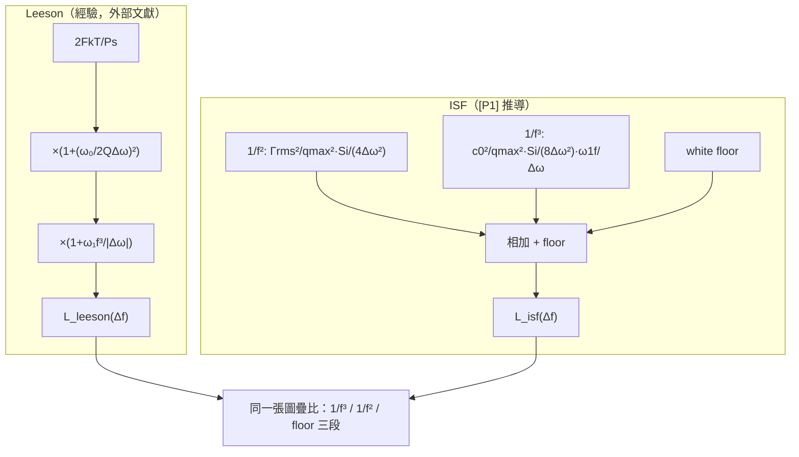

# Lab 16 — Leeson 模型 vs ISF 模型（三段對照）

> **麵包屑**：[模擬實驗室](/04_simulation_labs/numerical_feeling) › 系統與進階 › **本頁（Leeson vs ISF）**。上游：[lab_06](/04_simulation_labs/lab_06_white_noise_phase_noise)、[lab_07](/04_simulation_labs/lab_07_flicker_noise_upconversion)；相關：[lab_09](/04_simulation_labs/lab_09_design_tradeoffs)。

設計師最常看到的 phase-noise 模型其實有兩套血統。一套是 **Leeson（1966）** 的經驗式：
它把量測曲線**事後**配成 $1/f^3$、$1/f^2$、平坦 floor 三段，參數（品質因數 $Q$、雜訊指數 $F$、
flicker corner）多半靠擬合。另一套是本網站主線的 **ISF 模型**：從 [P1] Hajimiri–Lee 的 LTV
理論**從頭推**出同樣三段，而且每個參數都有物理來源（$\Gamma_{rms}$、$q_{max}$、$c_0$）。
這個 lab 把兩條曲線疊在同一張圖，讓你看清：**它們是同一座山的兩張地圖**——Leeson 描述
「長什麼樣」，ISF 解釋「為什麼長這樣」。

> **外部文獻聲明**：Leeson 模型**不在下載的 5 篇 PDF 內**，以標準文獻補充
> （D. B. Leeson, *"A simple model of feedback oscillator noise spectrum,"* Proc. IEEE, 1966）。
> 本網站把它當作對照基準與歷史脈絡，**ISF 模型才是主線**。Leeson 的逐步推導與逐項對照
> 見附錄 [derivation_leeson](/99_appendix/derivation_leeson)。

> **物理直覺（先講結論）**：所有自由振盪器的 phase noise 由近到遠都長一樣——靠近載波是
> $1/f^3$（flicker 上轉，最陡 $-30$ dB/dec）、中段是 $1/f^2$（白噪，$-20$ dB/dec）、最遠是
> 平坦的量測/buffer floor。Leeson 用 $Q$ 和 corner 把三段拼出來；ISF 告訴你 $1/f^2$ 段的高度
> 是 $\Gamma_{rms}^2/q_{max}^2$、$1/f^3$ 段是 $c_0^2$ 決定，corner 不等於 device 的 $1/f$ corner。

## 1. 教學目標

- 認識 Leeson 經驗模型的三段結構與其擬合參數（$F,Q,$ flicker corner）。
- 把 ISF 模型（[P1] Eq.(21) + Eq.(23) + floor）寫成同樣三段，疊圖對照。
- 看懂兩模型在 $1/f^3$、$1/f^2$、floor 三區的對應與差異。
- 理解 ISF 如何**賦予 Leeson 參數物理意義**（並誠實標明 Leeson 為外部文獻）。

## 2. 數學模型

**Leeson 模型**（外部文獻，非 5 篇 PDF；規範第 10.2 節逐字）：

$$
\mathcal{L}(\Delta\omega)=10\log_{10}\!\left[\frac{2FkT}{P_s}\left(1+\Big(\frac{\omega_0}{2Q\Delta\omega}\Big)^2\right)\left(1+\frac{\omega_{1/f^3}}{\lvert\Delta\omega\rvert}\right)\right]
$$

- 第一個括號 $\big(1+(\omega_0/2Q\Delta\omega)^2\big)$：大 offset 趨近 $1$（floor）、小 offset 給
  $1/\Delta\omega^2$ 的 $1/f^2$ 段；轉折由 $Q$（tank 品質因數）決定。
- 第二個括號 $\big(1+\omega_{1/f^3}/\vert\Delta\omega\vert\big)$：在 corner 以內再乘一個
  $1/\vert\Delta\omega\vert$，把 $1/f^2$ 抬成 $1/f^3$。
- $F$ 是雜訊指數、$P_s$ 是訊號功率、$kT$ 是熱雜訊——這些在 Leeson 裡多半是**擬合/估計**值。

**ISF 模型**（從 [P1] 推導 + 一個白噪 floor）：把 $1/f^2$（[P1] Eq.(21)）與 $1/f^3$
（[P1] Eq.(23)）兩段在 linear 尺度相加，再加 floor：

$$
\mathcal{L}(\Delta\omega)=10\log_{10}\!\left[\underbrace{\frac{\Gamma_{rms}^2}{q_{max}^2}\frac{\overline{i_n^2}/\Delta f}{4\,\Delta\omega^2}}_{1/f^2,\ \text{Eq.(21)}}+\underbrace{\frac{c_0^2}{q_{max}^2}\frac{\overline{i_n^2}/\Delta f}{8\,\Delta\omega^2}\frac{\omega_{1/f}}{\Delta\omega}}_{1/f^3,\ \text{Eq.(23)}}+\underbrace{\text{floor}}_{\text{平坦}}\right]
$$

- **物理對應**：ISF 的 $1/f^2$ 段高度 $=\Gamma_{rms}^2/q_{max}^2$（Leeson 的 $2FkT/P_s$ 對應之），
  $1/f^3$ 段強度由 **$c_0^2$**（ISF 的 DC 係數、波形不對稱度）決定。
- **corner 不同源**：ISF 的 $1/f^3$ corner（[P1] Eq.(24)）是
  $\Delta\omega_{1/f^3}=\omega_{1/f}\,c_0^2/(2\Gamma_{rms}^2)$，**不等於** device 的 $\omega_{1/f}$；
  Leeson 直接把 corner 當擬合參數 $\omega_{1/f^3}$ 塞進去。
- **Dimension check**：兩段括號內都是無因次功率比（dBc/Hz 取 $10\log_{10}$ 前），相加合法 ✓；
  $1/f^2$ 項 $\propto1/\Delta\omega^2$、$1/f^3$ 項多一個 $1/\Delta\omega$ ✓。

本 lab 的數值（教學用，刻意調到兩線在中段重合）：$f_0=5$ GHz、$Q=10$、$F=5$、
$P_s=1$ mW、flicker corner $f_c=100$ kHz；ISF 側 $q_{max}=1$ pC、$\Gamma_{rms}=0.5$、$c_0=0.2$、
$\overline{i_n^2}/\Delta f=10^{-20}$ A²/Hz、floor $=-160$ dBc/Hz。

## 3. Block diagram



## 4. Python 核心 code

`simulations/lab_16_leeson_vs_isf.py` 的核心：兩個模型各自算出 dBc/Hz，疊在 semilogx 上。

```python
import numpy as np

k = 1.380649e-23
T = 300.0

f = np.logspace(3, 8, 2000)          # 1 kHz .. 100 MHz offset
dw = 2 * np.pi * f
f0 = 5e9
w0 = 2 * np.pi * f0

# --- Leeson (empirical; external literature) ---
F = 5.0; Ps = 1e-3; Q = 10.0; fc = 1e5            # flicker corner 100 kHz
leeson = (2 * F * k * T / Ps) * (1 + (w0 / (2 * Q * dw)) ** 2) * (1 + 2 * np.pi * fc / dw)
L_leeson = 10 * np.log10(leeson)

# --- ISF model ([P1] Eq.(21) 1/f^2 + Eq.(23) 1/f^3 + white floor) ---
qmax = 1e-12
in2_df = 1e-20
Grms = 0.5
c0 = 0.2
w1f = 2 * np.pi * fc
floor = 10 ** (-160 / 10)
isf = (Grms ** 2 / qmax ** 2) * in2_df / (4 * dw ** 2) \
    + (c0 ** 2 / qmax ** 2) * in2_df / (8 * dw ** 2) * (w1f / dw) \
    + floor
L_isf = 10 * np.log10(isf)
```

- **讀法**：Leeson 把三段相乘（floor → $\times1/f^2$ 因子 → $\times1/f^3$ 因子）；ISF 把三段
  在 linear 功率域**相加**。兩種記帳都會在 log 圖上呈現三段折線。
- **常數說明**：ISF 側的 $\Gamma_{rms},c_0,$ floor 是刻意挑來讓兩線在中段重合做教學疊圖，
  **非從某特定電路萃取**。

## 5. 完整 script path

`simulations/lab_16_leeson_vs_isf.py`（`main()` 算兩模型並 semilogx 疊圖、標 $1/f^3$ corner）。
重跑：`python scripts/run_all_sims.py`。

## 6. 參數表

| 參數 | 符號 | 值 | 屬於 | 角色 |
|---|---|---|---|---|
| 載波頻率 | $f_0$ | $5$ GHz | 共用 | $\omega_0=2\pi f_0$ |
| offset 範圍 | $\Delta f$ | $1$ kHz–$100$ MHz | 共用 | 橫軸 |
| 品質因數 | $Q$ | $10$ | Leeson | 決定 $1/f^2$ 轉折 |
| 雜訊指數 | $F$ | $5$ | Leeson | floor 高度 |
| 訊號功率 | $P_s$ | $1$ mW | Leeson | $2FkT/P_s$ |
| flicker corner | $f_c$ | $100$ kHz | 共用 | $1/f^3$ corner（圖中虛線） |
| 最大電荷擺幅 | $q_{max}$ | $1$ pC | ISF | $\Gamma_{rms}^2/q_{max}^2$ |
| ISF rms | $\Gamma_{rms}$ | $0.5$ | ISF | $1/f^2$ 高度 |
| ISF DC 係數 | $c_0$ | $0.2$ | ISF | $1/f^3$ 強度 |
| 電流雜訊 PSD | $\overline{i_n^2}/\Delta f$ | $10^{-20}$ A²/Hz | ISF | 雜訊量 |
| 雜訊地板 | floor | $-160$ dBc/Hz | ISF | 平坦段 |

## 7. 單位表

| 量 | 符號 | 單位 |
|---|---|---|
| offset 頻率 | $\Delta f,\ \Delta\omega$ | Hz, rad/s |
| 相位雜訊 | $\mathcal{L}$ | dBc/Hz |
| 品質因數 / 雜訊指數 | $Q,\ F$ | 無因次 |
| 功率 | $P_s$ | W |
| 電荷 | $q_{max}$ | C |
| ISF rms / DC 係數 | $\Gamma_{rms},\ c_0$ | 無因次 |
| 電流雜訊 PSD | $\overline{i_n^2}/\Delta f$ | A²/Hz |
| $kT$ | — | J |

## 8. 模擬圖


## 9. 如何解讀圖

- **三段折線**：兩條曲線從左（近載波）到右（遠 offset）都呈現
  $1/f^3$（最陡）→ $1/f^2$（中段）→ 平坦 floor。灰色點線是 $1/f^3$ corner（$f_c=100$ kHz）：
  在它左側兩線更陡（$-30$ dB/dec），右側轉為 $-20$ dB/dec。
- **中段重合、兩端分岔**：本 lab 刻意把參數調到兩線在 $1/f^2$ 段近乎重合（教學疊圖）。注意
  右端（大 offset）兩線分開：Leeson 因子 $(1+\ldots)$ 已趨近常數 floor 而轉平/下彎，ISF 模型
  的 floor 設在 $-160$ dBc/Hz 較低，於是紅線在高 offset 仍沿 $1/f^2$ 多走一段才碰地板。
  **這差異不是 bug，是兩模型 floor 記帳不同**——提醒「曲線形狀對、絕對值要看各自參數」。
- **關鍵讀法**：Leeson 的 $Q$ 決定中段轉折、$F/P_s$ 決定地板；ISF 的 $\Gamma_{rms}/q_{max}$ 決定
  中段高度、$c_0$ 決定 $1/f^3$ 強度。**同一條曲線，兩套語言**：要降中段就降 $\Gamma_{rms}$／提
  $q_{max}$（=提 $Q$、提 $P_s$）；要降 close-in 就壓 $c_0$（=讓波形對稱）。

## 10. 對應 paper 公式/figure

- **ISF $1/f^2$ 段**：[P1] Eq.(21), p.185，$\mathcal{L}\propto\Gamma_{rms}^2/q_{max}^2/\Delta\omega^2$。
- **ISF $1/f^3$ 段**：[P1] Eq.(23), p.185，$\propto c_0^2\cdot\omega_{1/f}/\Delta\omega^3$。
- **$1/f^3$ corner（物理意義，與 device corner 不同）**：[P1] Eq.(24), p.185。
- **三段全貌圖**：[P1] Fig. 11 / Fig. 12, p.185（$1/f^3$、$1/f^2$、floor 與 corner 定義）。
- **Leeson 模型**：D. B. Leeson, Proc. IEEE, 1966，**不在 5 篇 PDF 內**，外部文獻補充；
  逐步推導與逐項對照見 [derivation_leeson](/99_appendix/derivation_leeson)。

## 11. 限制與 approximation

- **Leeson 為經驗模型（外部文獻）**：$F$、$Q$、corner 多為事後擬合，不像 ISF 由電路量
  （$\Gamma_{rms},q_{max},c_0$）導出；本圖的 Leeson 參數是示意值。
- **參數刻意 co-tuned**：ISF 側 $\Gamma_{rms}=0.5,c_0=0.2,$ floor$=-160$ dBc/Hz 是為讓兩線
  中段重合而選，**非某特定振盪器的萃取值**；勿把絕對 dBc/Hz 當作真實器件規格。
- **floor 記帳不同**：Leeson 的 floor 內建在 $(1+\ldots)$ 因子裡，ISF 模型用外加常數 floor；
  故高 offset 兩線分岔（見圖解讀），屬模型結構差異而非物理差異。
- **單一白噪源、線性疊段**：ISF 模型把 $1/f^2$ 與 $1/f^3$ 在 linear 功率域直接相加，忽略多源、
  cyclostationary（見 [lab_14](/04_simulation_labs/lab_14_cyclostationary_isf)）與 AM–PM。
- **factor-of-2**：$1/f^2$ 用 Eq.(21) 的 $4\Delta\omega^2$、$1/f^3$ 用 Eq.(23) 的 $8\Delta\omega^2$；
  SSB 記帳的 2 倍小爭議不影響三段斜率與對照結論。
- **$Q=10$ 偏低**：示意用；真實 LC tank 常 $Q\gtrsim$ 數十，Leeson 中段轉折會更靠近載波。

## 重點回顧

- 自由振盪器 phase noise 三段：$1/f^3$（close-in）→ $1/f^2$（白噪）→ 平坦 floor。
- Leeson（經驗、外部文獻）與 ISF（[P1] 推導）描述同樣三段；ISF 給 Leeson 參數物理意義。
- $1/f^2$ 高度 $=\Gamma_{rms}^2/q_{max}^2$（↔ Leeson 的 $2FkT/P_s$ 與 $Q$）；$1/f^3$ 強度 $=c_0^2$。
- ISF 的 $1/f^3$ corner（[P1] Eq.(24)）由 $c_0^2/\Gamma_{rms}^2$ 縮放，**不等於** device $1/f$ corner。

## 延伸閱讀

- 白噪 → $1/f^2$：[lab_06_white_noise_phase_noise](/04_simulation_labs/lab_06_white_noise_phase_noise)、[white_noise_to_phase_noise](/03_isf_core_theory/white_noise_to_phase_noise)
- flicker 上轉 → $1/f^3$ 與 $c_0$：[lab_07_flicker_noise_upconversion](/04_simulation_labs/lab_07_flicker_noise_upconversion)、[flicker_noise_upconversion](/03_isf_core_theory/flicker_noise_upconversion)
- 設計取捨：[lab_09_design_tradeoffs](/04_simulation_labs/lab_09_design_tradeoffs)
- **用在設計/理論**：Leeson 逐步推導與「$Q,F,1/f^3$ corner」逐項對照 ISF → [derivation_leeson](/99_appendix/derivation_leeson)
