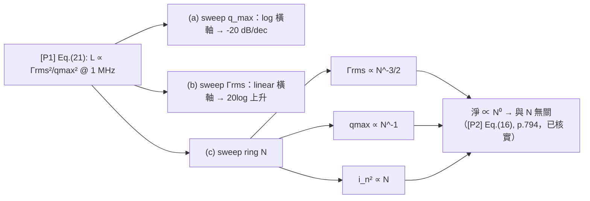

# Lab 17 — 設計掃描：swing / Γrms / N 三條設計曲線

> **麵包屑**：[模擬實驗室](/04_simulation_labs/numerical_feeling) › 系統與進階 › **本頁（設計掃描進階）**。口算入門版：[lab_09](/04_simulation_labs/lab_09_design_tradeoffs)；上游：[lab_06](/04_simulation_labs/lab_06_white_noise_phase_noise)、[lab_08](/04_simulation_labs/lab_08_jitter_integration)。

[lab_09](/04_simulation_labs/lab_09_design_tradeoffs) 用口算把 [P1] Eq.(21) 讀成 scaling law。
這個 lab 把同一條式子**真的掃出來、畫成三條曲線**：固定其他條件，分別掃節點電荷擺幅
$q_{max}$（swing）、ISF rms $\Gamma_{rms}$、ring 級數 $N$，看 $1$ MHz offset 的 phase noise
$\mathcal{L}$ 怎麼動。圖上你會親眼看到「$-20$ dB/decade」的直線斜率、「$2\times$ swing $\to-6$ dB」
的箭頭，以及 ring 振盪器那條**幾乎水平**的 $N$ 曲線（著名的 $N$-無關性）。

> **物理直覺（先講結論）**：$1/f^2$ phase noise $\propto\Gamma_{rms}^2/q_{max}^2$。
> 兩個旋鈕都進 $20\log_{10}$：$q_{max}$ 加倍 → $-6$ dB；$\Gamma_{rms}$ 減半 → $-6$ dB。
> ring 的 $N$ 比較陰險：增級雖讓 $\Gamma_{rms}\propto N^{-3/4}$ 變小，但每節 $q_{max}$ 變小、
> 吵的 device 變多，**三者在固定 $f_0$／功率下大致抵消**，淨 phase noise 幾乎與 $N$ 無關。

## 1. 教學目標

- 把 [P1] Eq.(21) 的 $\mathcal{L}\propto\Gamma_{rms}^2/q_{max}^2$ 畫成三條設計曲線。
- 在 $q_{max}$ 曲線上量化「$-20$ dB/decade」與「$2\times$ swing $\to-6$ dB」。
- 在 $\Gamma_{rms}$ 曲線上看「對稱波形／低 $\Gamma_{rms}\to$ PN↓」。
- 在 ring $N$ 曲線上看 $N$-無關性的由來（[P2] Eq.(16), p.794，已核實）。
- 把曲線連回 [lab_09](/04_simulation_labs/lab_09_design_tradeoffs) 與第 06 章 design insight 頁。

## 2. 數學模型

起點同樣是 [P1] Eq.(21), p.185（$1/f^2$ 區、固定 offset）：

$$
\mathcal{L}\{\Delta\omega\}=10\log_{10}\!\left(\frac{\Gamma_{rms}^2}{q_{max}^2}\cdot\frac{\overline{i_n^2}/\Delta f}{4\,\Delta\omega^2}\right)
$$

把對數展開，看出每個旋鈕各自的斜率：

$$
\mathcal{L}=20\log_{10}\Gamma_{rms}-20\log_{10}q_{max}+10\log_{10}\!\big(\overline{i_n^2}/\Delta f\big)-20\log_{10}(2\Delta\omega)+\text{const}.
$$

- **旋鈕 1（$q_{max}$）**：$-20\log_{10}q_{max}$ → 對 $q_{max}$ 取 $\log$ 橫軸是斜率 $-20$ dB/decade
  的直線；$q_{max}\times2\Rightarrow20\log_{10}2=6.02$ dB → **$-6$ dB**。
- **旋鈕 2（$\Gamma_{rms}$）**：$+20\log_{10}\Gamma_{rms}$ → $\Gamma_{rms}$ 減半 → $-6$ dB；
  本 lab 用 linear 橫軸，曲線是 $20\log_{10}\Gamma_{rms}$ 的對數型上升。

**ring 的 $N$**（[P2] Eq.(16), p.794，已核實）：增級同時動三件事，三者在固定 $f_0$／功率下相互抵消：

$$
\Gamma_{rms}\propto N^{-3/4}\ \text{[P2] Eq.(16)},\qquad q_{max}\propto N^{-1}\ (\text{每節擺幅變小}),\qquad \overline{i_n^2}\propto N\ (\text{device 變多}).
$$

代入 $\Gamma_{rms}^2/q_{max}^2\cdot\overline{i_n^2}$：

$$
\frac{(N^{-3/2})^2}{(N^{-1})^2}\cdot N=\frac{N^{-3}}{N^{-2}}\cdot N=N^{-1}\cdot N=N^{0}=\text{const}.
$$

- **結論**：在這組 toy scaling 下淨效果 $\propto N^0$ → **phase noise 與 $N$ 無關**（[P2] 的招牌結論）。
- **Dimension check**：$\Gamma_{rms}^2/q_{max}^2\cdot(\text{A}^2/\text{Hz})/(\text{rad/s})^2$ →
  括號內無因次（取 $10\log_{10}$ 前），合法 ✓；$N$ 全程無因次 ✓。

本 lab 的數值：在 $\Delta f=1$ MHz 評估，$\overline{i_n^2}/\Delta f=10^{-22}$ A²/Hz；基準
$q_{max}=1$ pC、$\Gamma_{rms}=0.5$ 給 $\mathcal{L}=-128.0$ dBc/Hz。

## 3. Block diagram



## 4. Python 核心 code

`simulations/lab_17_design_sweep.py` 用一個共用的 `L_dbc` 把 [P1] Eq.(21) 算成 dBc/Hz，
再對三個旋鈕各掃一條曲線：

```python
import numpy as np


def L_dbc(Grms, qmax, in2_df, dw):
    return 10 * np.log10(Grms ** 2 / qmax ** 2 * in2_df / (4 * dw ** 2))


dw = 2 * np.pi * 1e6        # evaluate at 1 MHz offset
in2_df = 1e-22

# (a) sweep q_max: 0.1 pC .. 10 pC  -> slope -20 dB/decade, 2x -> -6 dB
q = np.logspace(-13, -11, 50)
L_q = L_dbc(0.5, q, in2_df, dw)                # baseline qmax=1pC -> -128 dBc/Hz

# (b) sweep Gamma_rms: low Grms -> lower PN
g = np.linspace(0.1, 1.5, 50)
L_g = L_dbc(g, 1e-12, in2_df, dw)

# (c) ring N: Gamma_rms ~ N^-3/2, per-node qmax ~ 1/N, more noisy devices ~ N
N = np.arange(3, 31)
Grms_N = 0.5 * (5.0 / N) ** 1.5                # scaling (illustrative; [P2])
qmax_N = 1e-12 * (5.0 / N)                      # lower per-node swing as N grows
noise_N = in2_df * (N / 5.0)                    # more noisy devices
L_N = 10 * np.log10(Grms_N ** 2 / qmax_N ** 2 * noise_N / (4 * dw ** 2))
print(round(L_N[0], 1), round(L_N[-1], 1))
# -> -128.0 -128.0  (essentially flat for all N: the famous N-independence)
```

- **`L_dbc` 與 lab_08 的差別**：lab_08 從量到的 $\mathcal{L}$ **積分**出 jitter；這裡反向用
  Eq.(21) **產生** $\mathcal{L}$ 再掃旋鈕。兩頁互為正反操作（同 lab_09 的說明）。
- **(c) 的三個 scaling 是 illustrative**：$\Gamma_{rms}\propto N^{-3/4}$ 的常數與每節 $q_{max}$、
  device 數的指數都是 toy 假設，目的是把「為何 $N$ 大致抵消」具體畫出來。

## 5. 完整 script path

`simulations/lab_17_design_sweep.py`（`main()` 畫三個子圖；`L_dbc` 為 [P1] Eq.(21) 的 dBc/Hz
封裝；(c) 用 $\Gamma_{rms}\propto N^{-3/4}$、$q_{max}\propto N^{-1}$、$\overline{i_n^2}\propto N$ 的
toy scaling）。重跑：`python scripts/run_all_sims.py`。

> 註：此頁檔名為 `lab_17_design_tradeoffs.md`（對齊 sidebar 命名慣例），對應的 script 是
> `lab_17_design_sweep.py`，圖檔 `design_tradeoff_sweeps.png`。

## 6. 參數表

| 參數 | 符號 | 值 / 掃描範圍 | 角色 |
|---|---|---|---|
| offset（評估點） | $\Delta f$ | $1$ MHz | 固定 |
| 電流雜訊 PSD | $\overline{i_n^2}/\Delta f$ | $10^{-22}$ A²/Hz | 固定（基準）；(c) 隨 $N$ 變 |
| 最大電荷擺幅 | $q_{max}$ | (a) $0.1$–$10$ pC；基準 $1$ pC | **旋鈕 1** |
| ISF rms | $\Gamma_{rms}$ | (b) $0.1$–$1.5$；基準 $0.5$ | **旋鈕 2** |
| ring 級數 | $N$ | (c) $3$–$30$；基準 $5$ | **旋鈕 3** |
| 基準相位雜訊 | $\mathcal{L}$ | $-128.0$ dBc/Hz | 由 Eq.(21) 得（$q_{max}=1$ pC、$\Gamma_{rms}=0.5$） |

## 7. 單位表

| 量 | 符號 | 單位 |
|---|---|---|
| 最大電荷擺幅 | $q_{max}$ | C |
| ISF rms | $\Gamma_{rms}$ | 無因次 |
| ring 級數 | $N$ | 無因次 |
| offset 頻率 | $\Delta f,\ \Delta\omega$ | Hz, rad/s |
| 相位雜訊 | $\mathcal{L}$ | dBc/Hz |
| 電流雜訊 PSD | $\overline{i_n^2}/\Delta f$ | A²/Hz |

## 8. 模擬圖


## 9. 如何解讀圖

- **(a) swing 掃描（藍）**：log 橫軸 $q_{max}$（0.1–10 pC）對 $\mathcal{L}$ 是一條直線，斜率
  **$-20$ dB/decade**——$q_{max}$ 從 0.1 → 10 pC（兩個 decade）$\mathcal{L}$ 從 $-108$ → $-148$ dBc/Hz
  剛好降 $40$ dB。紅箭頭標出「$2\times$ swing $\to-6$ dB」（$1\to2$ pC，$-128\to-134$ dBc/Hz）。
  **記憶點：swing 加倍，phase noise 賺 6 dB。**
- **(b) $\Gamma_{rms}$ 掃描（綠）**：linear 橫軸，$\mathcal{L}=20\log_{10}\Gamma_{rms}+$const 的對數型
  曲線——$\Gamma_{rms}$ 越小 phase noise 越低，且在小 $\Gamma_{rms}$ 端下降最陡（$\Gamma_{rms}$
  從 0.5 減半到 0.25 → $-6$ dB）。這就是「對稱波形／低敏感度」的回報。
- **(c) ring $N$ 掃描（紫）**：一條**幾乎完全水平**的線（$\approx-128$ dBc/Hz，與 $N$ 無關）。
  這不是巧合，是第 2 節算出的 $N^0$：增級讓 $\Gamma_{rms}$ 小（好）、但 $q_{max}$ 也小、device 也
  多（壞），三者在固定 $f_0$／功率下抵消。**ring 多加級數不會白白改善 phase noise**（[P2]）。
- **怎麼合起來用**：(a)(b) 是「真正能賺 dB 的旋鈕」（提 swing、壓 $\Gamma_{rms}$）；(c) 是
  「看似能調、其實抵消」的旋鈕——選 $N$ 要看 $f_0$、功率、面積、相位數需求，不是為了 phase noise。

## 10. 對應 paper 公式/figure

- **主 scaling**：[P1] Eq.(21), p.185，$\mathcal{L}\propto\Gamma_{rms}^2/q_{max}^2$。
- **Parseval / $\Gamma_{rms}$**：[P1] Eq.(20), p.185。
- **ring $\Gamma_{rms}$ scaling**：[P2] Eq.(16), p.794，$\Gamma_{rms}\propto N^{-3/4}$
  （[P2] Eq.(16), p.794，已核實）。
- **ring 頻率**：[P2] Eq.(14), p.794，$f_0=1/(2N\tau_D)$。
- **ring 白噪 FOM / $N$-無關性**：[P2], p.795，$\mathcal{L}\vert_{1/f^2}\approx\frac{8}{3\eta}\,\frac{V_{DD}}{V_{char}}\,\frac{kT}{P}(\omega_0/\Delta\omega)^2$
  （[P2] Eq.(23), p.796 的前置係數是 $8/(3\eta)$（$\eta$ 為級延遲比例常數 Eq.14，$\approx1$）；$\gamma$ 僅透過 $V_{char}=\Delta V/\gamma$ 進入。v2 曾誤改為 $8/(3\gamma)$ 並誤標『逐字核實』，v3 已對照原始 PDF p.796 更正）。

## 11. 限制與 approximation

- **toy scaling，非 transistor-level**：(a)(b) 假設「只動一個旋鈕、其他完全不變」；真實電路
  $q_{max}$、$\Gamma_{rms}$、$N$、功率、面積、$f_0$ 彼此耦合，不能孤立調。
- **ring (c) 的三個指數是 illustrative**：$\Gamma_{rms}\propto N^{-3/4}$、$q_{max}\propto N^{-1}$、
  $\overline{i_n^2}\propto N$ 都是 toy 假設以演示抵消；確切常數標 `TODO: manual verification
  needed from [P2] page 794–796`。$N$ 改變也改 $f_0=1/(2N\tau_D)$（除非縮 $\tau_D$），本圖未一併呈現。
- **只看 $1/f^2$ 區、固定 offset**：在 $1$ MHz 評估；close-in $1/f^3$ 由 $c_0$ 與積分下限主導，
  此三圖不適用（見 [lab_07](/04_simulation_labs/lab_07_flicker_noise_upconversion)）。
- **單一白噪源**：忽略多源、cyclostationary（$\Gamma_{eff}=\Gamma\alpha$，
  [lab_14](/04_simulation_labs/lab_14_cyclostationary_isf)）與 AM–PM。
- **factor-of-2**：用 Eq.(21) 的 $4\Delta\omega^2$ 慣例；SSB 記帳 2 倍差不影響任何相對（dB）斜率。
- **jitter 推論**：$\sigma_t\propto\Gamma_{rms}/q_{max}$（$-6$ dB phase noise = jitter 減半）需固定
  積分範圍與 $1/f^2$ 形狀；見 [lab_08](/04_simulation_labs/lab_08_jitter_integration)、[lab_09](/04_simulation_labs/lab_09_design_tradeoffs)。

## 重點回顧

- $q_{max}$ 曲線：$-20$ dB/decade；**$2\times$ swing $\to-6$ dB**（基準 $-128$ → $-134$ dBc/Hz）。
- $\Gamma_{rms}$ 曲線：$20\log_{10}\Gamma_{rms}$，減半 $\to-6$ dB；對稱波形／低敏感度有回報。
- ring $N$ 曲線：幾乎水平——$\Gamma_{rms}^2/q_{max}^2\cdot\overline{i_n^2}\propto N^0$，**phase noise 與 $N$ 無關**（[P2] Eq.(16), p.794，已核實）。
- 基準：$q_{max}=1$ pC、$\Gamma_{rms}=0.5$、$\overline{i_n^2}/\Delta f=10^{-22}$、$1$ MHz $\to\mathcal{L}=-128.0$ dBc/Hz。

## 延伸閱讀

- 口算版設計取捨：[lab_09_design_tradeoffs](/04_simulation_labs/lab_09_design_tradeoffs)
- swing / $q_{max}$ 設計：[tank_swing](/06_design_insights/tank_swing)
- 波形斜率與 $\Gamma_{rms}$：[waveform_slope](/06_design_insights/waveform_slope)
- 對稱性砍 $1/f^3$：[symmetry](/06_design_insights/symmetry)
- 上游模擬：[lab_06_white_noise_phase_noise](/04_simulation_labs/lab_06_white_noise_phase_noise)、[lab_08_jitter_integration](/04_simulation_labs/lab_08_jitter_integration)
- **用在設計/理論**：三條 scaling 曲線（swing／$\Gamma_{rms}$／$N$-無關性）落到 LC vs ring 拓樸抉擇 → [lc_vs_ring](/06_design_insights/lc_vs_ring)
