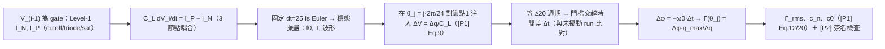

# Lab 32 — MOS Level-1 方程級 ring：從電晶體方程萃取 ISF

> **麵包屑**：[模擬實驗室](/04_simulation_labs/numerical_feeling) › 系統與進階 › **本頁（MOS Level-1 方程級 ring ISF）**。上游：[lab_03](/04_simulation_labs/lab_03_ring_oscillator_toy_model)（toy 三角 ISF）、[lab_04](/04_simulation_labs/lab_04_impulse_injection_sweep)（打脈衝萃取法）；相關：[waveform_slope](/06_design_insights/waveform_slope)、[real_oscillator_topologies](/06_design_insights/real_oscillator_topologies)。

本站到目前為止的 ring ISF 都是**手放的形狀**：[lab_03](/04_simulation_labs/lab_03_ring_oscillator_toy_model)
的三角波只是「能量集中在 transition」的示意，高度、寬度、正負號都不是算出來的。這一頁跨出
誠實的一步：**把每一級反相器用 MOS Level-1（Shichman-Hodges）平方律方程建模**——
cutoff／triode／saturation 三區、真實的 $k'$、$V_t$、$W/L$、$C_L$——在 numpy 裡用固定小步長
積分出穩態振盪，然後**什麼都不假設**，直接用 [P1] 的打脈衝法（impulse method）把節點 1 的
$\Gamma(\theta)$ 一個相位一個相位**量**出來。

> **模型層級聲明（全頁適用）**：本 lab 是 **MOS Level-1 方程級（Shichman-Hodges），非
> SPICE/BSIM/PDK**。它比 toy model 誠實一層（電流真的來自 device 方程、ISF 真的是量的），
> 但仍不是 transistor-level sign-off：沒有 velocity saturation、subthreshold、寄生 RC、
> 也**沒有建雜訊源**（見第 11 節）。環境沒有安裝 ngspice，這正是「不用 SPICE 還能多誠實」
> 的上限示範。

> **物理直覺（先講結論）**：ring 的節點只有在**自己（或驅動它的 gate）正在切換**時才怕被踢。
> 貼在 rail 上時，驅動級的低輸出阻抗會把注入的電荷在幾十 ps 內吃掉（$\tau\approx C_L/g$），
> 相位不留痕跡；正在轉態時，$\Delta V=\Delta q/C_L$ 直接平移 edge 的時間，而這個平移**永久
> 傳遞**下去。所以量出來的 $\Gamma(\theta)$ 是**雙葉（dual-lobe）**：繞著上升緣一個正葉
> （提前）、繞著下降緣一個負葉（延後）——這正是 [P2] Fig. 5／Fig. 6（p.793）的簽名。

三層模型階梯，本頁站在中間那層：

| 層級 | 電流從哪來 | ISF 從哪來 | 本站對應 |
|---|---|---|---|
| toy model | 沒有電流，直接畫波形 | 手放的形狀（$-\sin$、三角） | lab_02、lab_03 |
| **方程級（本頁）** | **Level-1 平方律 device 方程** | **打脈衝法量出來** | **lab_32** |
| SPICE + PDK | BSIM4/PSP + 萃取的寄生 | transient/PSS+adjoint 量出來 | 本站沒有（誠實聲明） |

SPICE/PDK 那層會再加上：velocity saturation 與 mobility degradation（短通道 $I_D$ 不再
$\propto V_{ov}^2$）、subthreshold 導通（$V_{GS}$ 低於 $V_t$ 時指數尾巴）、channel-length
modulation（$\lambda$）、gate 電容 $C_{gs}/C_{gd}$（Miller 耦合）、layout 寄生 RC、
corner/mismatch，以及**雜訊模型**（thermal + flicker）。這些都會改變數字，但**不改變**
本頁要教的機制：ISF 是可以從 device 方程直接量出來的物理量。

## 1. 教學目標

- 把 MOS Level-1（Shichman-Hodges）三區 IV 方程寫成可積分的 node equation，
  積出 3 級 ring 的**穩態振盪**（$f_0=1.2252$ GHz，量的不是算的）。
- 用 [P1] 打脈衝法萃取節點 1 的 $\Gamma(\theta)$：24 個注入相位、$\Delta q=0.5$ fC、
  等 $\ge20$ 週期後用**門檻交越時間比對**讀出永久相位移。
- 驗證 [P2] 簽名：雙葉形狀、能量集中在自身 transition 附近、貼 rail 時敏感度趨近 0。
- 對照 [P2] Fig. 6（p.793）的三角近似與 Eq.(16)（p.794）的 $\Gamma_{rms}$——
  哪些對、哪些在 $N=3$ 時失真。
- 誠實界定：這一層**只**萃取 deterministic ISF；要到 phase noise 還需要雜訊源
  （[P1] Eq.(21)，見 [device_noise_mapping](/06_design_insights/device_noise_mapping)）。

## 2. 數學模型

### 2.1 Device：MOS Level-1（Shichman-Hodges）平方律

NMOS（$\lambda=0$，$V_{DS}\ge0$）：

$$
I_{D,N}=\begin{cases}
0, & V_{GS}\le V_{tn}\quad(\text{cutoff})\\[4pt]
k_n'\dfrac{W}{L}\Big[(V_{GS}-V_{tn})V_{DS}-\dfrac{V_{DS}^2}{2}\Big], & V_{DS}<V_{GS}-V_{tn}\quad(\text{triode})\\[4pt]
\dfrac{k_n'}{2}\dfrac{W}{L}(V_{GS}-V_{tn})^2, & V_{DS}\ge V_{GS}-V_{tn}\quad(\text{saturation})
\end{cases}
$$

PMOS 完全鏡像（把 $V_{GS},V_{DS},V_{tn}$ 換成 $V_{SG},V_{SD},\lvert V_{tp}\rvert$）。

- **單位檢查**：$[k']=\text{A/V}^2$（$=\mu C_{ox}$），$W/L$ 無因次，
  $\text{A/V}^2\times\text{V}\times\text{V}=\text{A}$ ✓。
- 參數選成**對稱反相器**：$k_n'(W/L)_n=200\times2=400\ \mu\text{A/V}^2$ 與
  $k_p'(W/L)_p=100\times4=400\ \mu\text{A/V}^2$ 相等，
  $V_{tn}=0.4$ V、$V_{tp}=-0.4$ V——上升／下降對稱，所以預期 $c_0\approx0$
  （[P1] 對稱性論證；量出來 $c_0=0.0014$，見第 9 節）。
- 這就是 SPICE 的「Level 1」模型（外部文獻，非本站 5 篇 PDF）：H. Shichman and
  D. A. Hodges, *"Modeling and simulation of insulated-gate field-effect transistor
  switching circuits,"* IEEE J. Solid-State Circuits, vol. 3, no. 3, pp. 285–289, Sep. 1968。
- 程式裡三區用一條夾住（clamp）的式子實作：$V_{ov}=\max(V_{GS}-V_t,0)$、
  $V_{DE}=\min(V_{DS},V_{ov})$、$I_D=\beta\,(V_{ov}-V_{DE}/2)\,V_{DE}$——與上面的分段定義
  **逐點相等**（cutoff 時 $V_{ov}=0$、saturation 時 $V_{DE}=V_{ov}$ 代入即得）。
  若注入把節點推到 $V>V_{DD}$，程式把 source/drain 對調處理反向導通，維持物理。

### 2.2 電路：3 級單端反相器 ring 的 node equation

第 $i$ 級輸入是節點 $i-1$（mod 3），輸出節點 $i$，每個節點掛 $C_L$：

$$
C_L\frac{dV_i}{dt}=I_P\big(V_{i-1},V_i\big)-I_N\big(V_{i-1},V_i\big),\qquad i=1,2,3.
$$

- **單位檢查**：$\text{A}/\text{F}=\text{V/s}$ ✓。
- 積分：固定步長前向 Euler，$dt=25$ fs。最快的節點時間常數
  $\tau\approx C_L/g\approx10\ \text{fF}/240\ \mu\text{S}\approx42$ ps，
  $dt/\tau\approx6\times10^{-4}$，穩定裕度極大；$dt\to dt/2$ 時 $f_0$ 只變
  $1.22\times10^{-5}$（相對值，實跑驗證）。
- 奇數級單端反相器環沒有穩定 DC 點，從不對稱初值（0.9, 0.1, 0.5 V）積分 11 ns
  即進入穩態 limit cycle；量到的週期 spread 只有 $10^{-8}$ ps 等級（deterministic，無雜訊源）。

### 2.3 ISF 萃取：打脈衝＋門檻交越比對

對節點 1 在相位 $\theta_j=j\cdot2\pi/24$ 注入 $\Delta q=0.5$ fC，等效電壓步階
（[P1] Eq.(9), p.182）：

$$
\Delta V=\frac{\Delta q}{C_L}=\frac{0.5\ \text{fC}}{10\ \text{fF}}=0.05\ \text{V}.
$$

等 $\ge20$ 個週期（振幅偏差早已被驅動級的耗散吃掉，只剩相位移），把擾動 run 與**同一個積分器、
同一初值**的未擾動 run 比對節點 1 上升緣過 $V_{DD}/2$ 的時刻，時間差 $\Delta t$ 摺回
$[-T/2,T/2)$，再換算：

$$
\Delta\phi=-\omega_0\,\Delta t,\qquad
\Gamma(\theta_j)=\frac{\Delta\phi}{\Delta q/q_{max}},\qquad
q_{max}=C_L V_{DD}=10\ \text{fC}.
$$

這正是 [P1] Eq.(10)–(11)（p.182）的操作型定義（同 [lab_04](/04_simulation_labs/lab_04_impulse_injection_sweep)
在正弦振盪器上做過的事，換成方程級電路）。**數值手感**（用實測峰值）：
$\Gamma=1.1734$、$\Delta q/q_{max}=0.05$ ⇒ $\Delta\phi=0.0587$ rad；
$\Delta t=\Delta\phi/\omega_0=0.0587/(2\pi\times1.2252\times10^9)=7.62$ ps——
對 $T=816$ ps 的週期是 0.9% 的永久平移，門檻交越（線性內插）解析度綽綽有餘。

- **單位檢查**：$\text{rad}/(\text{rad/s})=\text{s}$ ✓；$\Gamma$ 無因次 ✓。
- **線性前提**（[P1] Fig. 6, p.182）：$\Delta q$ 減半時 $\Gamma$ 只變 0.1%
  （1.1284 vs 1.1295，實跑驗證），確認在線性小訊號區。
- 注入時刻量化到 $dt=25$ fs，相位誤差 $\le0.011^\circ$，可忽略。

## 3. Block diagram



## 4. Python 核心 code

節錄自 `simulations/lab_32_mos_level1_ring.py`（已對照原始碼）。Device 三區一條式子、
ring 導數、與萃取主迴圈：

```python
def _sq_v(vgs, vds, beta, vt):
    """Level-1 平方律（vds>=0）：cutoff/triode/saturation 一條 clamp 式。"""
    vov = np.maximum(vgs - vt, 0.0)      # cutoff -> vov = 0
    vde = np.minimum(vds, vov)           # saturation -> vde = vov
    return beta * (vov - 0.5 * vde) * vde

def ring_dvdt_v(v):
    """dV/dt [V/s]；v shape (..., 3)，第 i 級輸入 = 節點 i-1（np.roll）。"""
    vin = np.roll(v, 1, axis=-1)
    i_n = (_sq_v(vin, np.maximum(v, 0.0), BETA_N, VTN)
           - _sq_v(vin - v, np.maximum(-v, 0.0), BETA_N, VTN))      # 反向項
    i_p = (_sq_v(VDD - vin, np.maximum(VDD - v, 0.0), BETA_P, VTP_ABS)
           - _sq_v(v - vin, np.maximum(v - VDD, 0.0), BETA_P, VTP_ABS))
    return (i_p - i_n) / CL

# 26 條 ring 同步跑：run 0 = 未擾動參考，run 1..24 = 24 個相位，run 25 = 線性檢查
for k in range(n):
    r = inj.get(k)
    if r is not None:
        V[r + 1, 0] += DV                # dV = dq/CL（[P1] Eq.(9)）
    V += dt * ring_dvdt_v(V)             # 固定小步長 Euler
    rec[k + 1] = V[:, 0]                 # 記錄節點 1 給門檻交越比對

tc = first_after(rising_crossings(x[:, r], dt), t_late)   # >= 20 週期之後
dts = (tc - tc_ref + 0.5 * T) % T - 0.5 * T               # 摺回 [-T/2, T/2)
gamma = -w0 * dts * QMAX / DQ                             # Δφ·q_max/Δq
```

參考 run 與擾動 run 共用同一個積分器與初值，Euler 的（一階）週期偏差**完全對消**——
與 [derivation_floquet_ppv](/99_appendix/derivation_floquet_ppv) 數值驗證（lab_25）
所用的差分量測技巧同款。

## 5. 完整 script path

`simulations/lab_32_mos_level1_ring.py`
（依賴 `simulations/common/isf_utils.py` 的 `compute_fourier_coefficients`、`gamma_rms`、
`gamma_triangular`；`simulations/common/plot_utils.py` 的 `savefig`。）

跑法：`PYTHONPATH=. python simulations/lab_32_mos_level1_ring.py`（單機約 10 s，
無亂數、結果完全可重現）。

## 6. 參數表

| 參數 | 程式變數 | 值 | 意義 |
|---|---|---|---|
| 電源 | `VDD` | 1.0 V | supply |
| NMOS 門檻 | `VTN` | 0.4 V | $V_{tn}$ |
| PMOS 門檻 | `VTP_ABS` | 0.4 V | $\lvert V_{tp}\rvert$（$V_{tp}=-0.4$ V） |
| NMOS 製程常數 | `KPN` | $200\ \mu\text{A/V}^2$ | $k_n'=\mu_nC_{ox}$ |
| PMOS 製程常數 | `KPP` | $100\ \mu\text{A/V}^2$ | $k_p'=\mu_pC_{ox}$ |
| 尺寸比 | `WLN` / `WLP` | 2 / 4 | $(W/L)_n$、$(W/L)_p$（補償 $k_n'/k_p'=2$） |
| 等效強度 | `BETA_N` = `BETA_P` | $400\ \mu\text{A/V}^2$ | 對稱反相器 ⇒ $c_0\approx0$ |
| 節點負載 | `CL` | 10 fF | 每節點集總電容 |
| 級數 | `N_STAGES` | 3 | 單端反相器 ring |
| 積分步長 | `DT` | 25 fs | $dt/\tau\approx6\times10^{-4}$ |
| 注入電荷 | `DQ` | 0.5 fC | $\Delta V=0.05$ V |
| 最大電荷 | `QMAX` | 10 fC | $q_{max}=C_LV_{DD}$ |
| 注入相位數 | `N_PHASES` | 24 | 每 $15^\circ$ 一點 |
| 等待時間 | — | 22 $T$ | 注入後 $\ge20$ 週期才量測 |

## 7. 單位表

| 量 | 符號 | 單位 | 備註 |
|---|---|---|---|
| 節點電壓 | $V_i$ | V | 0 到 $V_{DD}$（實測 0.0038–0.9962 V） |
| 汲極電流 | $I_{D}$ | A | Level-1 三區 |
| 製程常數 | $k'$ | A/V² | $\mu C_{ox}$ |
| 週期／頻率 | $T$／$f_0$ | s／Hz | 816.186 ps／1.2252 GHz |
| 級延遲 | $\tau_D$ | s | $T/(2N)=136.03$ ps（[P2] Eq.(15)） |
| 注入電荷 | $\Delta q$ | C | 0.5 fC |
| 相位移 | $\Delta\phi$ | rad | $-\omega_0\Delta t$ |
| ISF | $\Gamma(\theta)$ | 無因次 | 量出來的，非假設 |
| 傅立葉係數 | $c_n$ | 無因次 | [P1] Eq.(12) |

## 8. 模擬圖


## 9. 如何解讀圖

**(a) 波形（一週期）**：三個節點彼此相隔 $T/6=136$ ps 交替翻轉（3 級 ring 每半週期
3 個 edge）。$f_0=1.2252$ GHz、$T=816.186$ ps 是**量出來**的；由 [P2] Eq.(15)
反推每級延遲 $\tau_D=136.03$ ps。注意 $N=3$ 時波形**遠非方波**——每個 transition
的 10%–90% 窗大約佔週期兩成，rail 上的平頂反而不長。

**(b) 萃取的 $\Gamma(\theta)$（本頁主角）**：24 個紫點是 24 次獨立打脈衝實驗。讀出來的結構：

| $\theta$ | $0^\circ$ | $45^\circ$ | $75^\circ$ | $90^\circ$ | $135^\circ$ | $180^\circ$ | $225^\circ$ | $255^\circ$ | $315^\circ$ |
|---|---|---|---|---|---|---|---|---|---|
| $\Gamma$ | $+1.128$ | $+0.786$ | $+0.038$ | $-0.356$ | $-1.155$ | $-1.132$ | $-0.844$ | $-0.059$ | $+1.173$ |

- **雙葉、對號入座**：正葉繞著節點 1 自己的上升緣（$\theta=0$，$\Gamma=+1.128$），
  負葉繞著自己的下降緣（$\theta=180^\circ$，$\Gamma=-1.132$）。正電荷在上升緣**提前**
  相位、在下降緣**延後**相位——符號不是規定的，是量出來的。
- **峰值在 transition 起步處**：$\max\lvert\Gamma\rvert=1.1734$ 出現在 $\theta=315^\circ$，
  即**上升緣前 $45^\circ$**；負葉最深點 $-1.1555$ 在 $135^\circ$，即**下降緣前 $45^\circ$**，
  鏡像對稱。物理：驅動 gate（節點 3）開始翻轉、把持住 rail 的電晶體正在放手，這時注入的
  電荷既不被吃掉、又直接平移即將發生的 edge——最傷。
- **能量集中在 transition**：10%–90% 轉態窗（著色區）佔週期 40.7%，卻含 58.7% 的
  $\Gamma^2$ 能量。$N=3$ 時集中度看起來「不夠戲劇化」，原因誠實說：**每 $T/6$ 就有一級在
  切換、且每個 transition 佔 $\approx0.2T$**，環裡幾乎沒有安靜的時刻，最安靜的相位
  （$\Gamma$ 過零）在 $75^\circ/255^\circ$（$+0.038/-0.059$）。[P2] 的圖像是：$N$ 越大、
  transition 佔比越小，lobe 越窄、quiet zone 越寬——單一 $N$ 的本 lab 只能展示機制，
  不能驗證標度（見下）。
- **與 lab_03 toy 三角對照（黑虛線）**：toy 猜對了「集中在 transition」的方向，但
  (i) 峰高 $1/\sqrt3=0.577$，比實測 $1.17$ 小一半；(ii) toy 在兩個 edge 都放**正**峰，
  實測是**一正一負**；(iii) $N=3$ 的實測 lobe 是寬平頂，不是尖三角。
  這就是「手放形狀」與「量出來」的差距。
- 與 [waveform_slope](/06_design_insights/waveform_slope) 的 $\Gamma\propto1/\dot V$ 對照：
  lobe 內 $\Gamma(0)=1.128$ 對應 $\dot V=\omega_0V_{DD}/\Gamma\approx6.8\times10^9$ V/s，
  與波形斜率一致；但**貼 rail 時斜率趨近 0、$\Gamma$ 卻也趨近 0**——因為那條反比關係假設
  擾動留在軌道上，而 rail 上的驅動級是低阻抗終端，直接把電荷吃掉。兩頁互補，不矛盾。

**(c) $\lvert c_n\rvert$ stems**：$c_1=1.3047$ 獨大、$c_3=0.1633$ 次之、偶次諧波幾乎為 0
——寬平頂的奇對稱雙葉本來就以奇諧波為主。最重要的一根是幾乎看不見的：
$c_0=0.0014\approx0$。因為上升／下降由 $\beta_n=\beta_p$ 設計成對稱，flicker 上轉
（$1/f^3$，[P1] Eq.(23)(24)，$\propto c_0^2$）會被壓到極低——**如果**有建 flicker 源的話
（本 lab 沒有，見第 11 節）。Parseval（[P1] Eq.(20)）：$\sum c_n^2=1.7308$ vs
$2\Gamma_{rms}^2=1.7309$，吻合。

**量測品質三檢**（實跑印出）：$dt$ 減半 $f_0$ 只動 $1.22\times10^{-5}$；$\Delta q$ 減半
$\Gamma$ 只動 0.1%；週期 spread $10^{-8}$ ps。數字可信。

## 10. 對應 paper 公式／figure

- **操作型 ISF 定義**：[P1] Eq.(10)–(11), p.182 與 $\Delta V=\Delta q/C$（Eq.(9), p.182）
  ——本 lab 的萃取程序就是把這兩式當量測儀器用。
- **線性前提**：[P1] Fig. 6, p.182（$\Delta\phi\propto\Delta q$ 小電荷線性；本 lab 用
  $\Delta q$ 減半驗證，差 0.1%）。
- **ring ISF 形狀**：[P2] Fig. 5, p.793（模擬萃取的 ring ISF，能量集中在 transition）、
  Fig. 6, p.793（近似波形＋**三角近似 ISF**）。本 lab 的 $N=3$ 實測：雙葉、峰在
  transition 起步處 ✓；但 lobe 是寬平頂而非窄三角——三角近似在大 $N$（transition 佔比小）
  時才漸趨準確。
- **頻率**：[P2] Eq.(15), p.794：$f_0=1/(2N\tau_D)$，本 lab 反推 $\tau_D=136.03$ ps。
- **$\Gamma_{rms}$**：實測 $\Gamma_{rms}=0.9303$；[P2] Eq.(16), p.794 取 $\eta=1$、$N=3$
  給 $1.1253$——同數量級（差 $-17\%$，$\eta$ 未擬合本電路）。**單一 $N$ 無法驗證
  $\Gamma_{rms}\propto N^{-3/4}$ 標度**；要驗證得掃 $N=3,5,7,\dots$ 重跑（本 script 的
  向量化導數支援任意級數，掃 $N$ 留作延伸練習）。
- **往 phase noise 的下一步**（本 lab 沒做）：把量到的 $\Gamma_{rms}$、$c_0$ 代入
  [P1] Eq.(21)（$1/f^2$）與 Eq.(23)(24)（$1/f^3$）還需要 device 雜訊 PSD
  $\overline{i_n^2}/\Delta f$ 與 cyclostationary 加權（[effective_isf](/03_isf_core_theory/effective_isf)）。

## 11. 限制與 approximation — 這層誠實到哪裡為止

**比 toy model 多看見的**：$f_0$、波形、$\Gamma(\theta)$ 的形狀／符號／大小全部從 device
方程量出來；對稱設計 ⇒ $c_0\approx0$ 可以被「做」出來而不是宣告出來。

**仍然看不見（需要 SPICE/BSIM/PDK 或更多建模）**：

- **Level-1 的物理缺口**：無 velocity saturation／mobility degradation（先進製程
  $I_D\propto V_{ov}$ 而非 $V_{ov}^2$，會改變 transition 斜率與 lobe 形狀）；無
  subthreshold 導通（真實 device 在 $V_{GS}$ 低於 $V_t$ 仍有指數尾電流，lobe 邊緣會更軟）；
  $\lambda=0$（無 channel-length modulation）。
- **只有集總 $C_L$**：沒有 $C_{gs}/C_{gd}$（Miller 耦合會讓 edge 互相牽動）、沒有
  layout 寄生 RC。$q_{max}=C_LV_{DD}=10$ fC 用名目值（實測擺幅 99.2% $V_{DD}$，差 0.8%）。
- **完全沒有雜訊模型**：本 lab 是 deterministic 的——它萃取 **ISF 本身**，不產生
  phase noise。thermal（$4kT\gamma g_m$）與 flicker 源、以及它們的 cyclostationary
  調變都不在此層。
- **單一 $N$、單一 corner**：不驗證 $N^{-3/4}$、不看 PVT。
- **數值**：固定步長一階 Euler（收斂性已實測 $1.22\times10^{-5}$）；注入相位量化
  $\le0.011^\circ$；門檻交越用線性內插。

## 重點回顧

- MOS Level-1（Shichman-Hodges）方程級 3 級 ring：$f_0=1.2252$ GHz、$T=816.186$ ps、
  $\tau_D=136.03$ ps（[P2] Eq.(15)）——非 SPICE/BSIM/PDK。
- 打脈衝法（$\Delta q=0.5$ fC、24 相位、等 $\ge20$ 週期、門檻交越比對）量出雙葉 ISF：
  正葉繞上升緣（$+1.128$）、負葉繞下降緣（$-1.132$）、峰值 $1.1734$ 在**上升緣前 $45^\circ$**。
- [P2] 簽名成立：58.7% 的 $\Gamma^2$ 能量在 40.7% 的 transition 窗內；$N=3$ 的 lobe
  是寬平頂，三角近似（[P2] Fig. 6）要大 $N$ 才漸準。
- $\Gamma_{rms}=0.9303$（[P2] Eq.(16) $\eta=1$ 給 1.1253，同數量級）；$c_0=0.0014\approx0$
  來自 $\beta_n=\beta_p$ 的對稱設計 ⇒ $1/f^3$ 上轉弱（[P1] Eq.(23)(24)）。
- 這層萃取的是 **ISF 本身**；到 phase noise 還缺雜訊源與 cyclostationary 加權。

## 延伸閱讀

- [lab_03 — ring toy model](/04_simulation_labs/lab_03_ring_oscillator_toy_model)：本頁取代掉的手放三角 ISF 從哪來。
- [lab_04 — 打脈衝萃取法](/04_simulation_labs/lab_04_impulse_injection_sweep)：同一套量測儀器在正弦振盪器上的首次登場。
- [waveform_slope — 波形斜率與敏感度](/06_design_insights/waveform_slope)：lobe 內 $\Gamma\propto1/\dot V$、rail 上失效的原因。
- [real_oscillator_topologies — 真實拓樸](/06_design_insights/real_oscillator_topologies)：cross-coupled LC／Colpitts／CMOS ring stage 的 ISF 從哪裡來。
- [device_noise_mapping](/06_design_insights/device_noise_mapping)：補上本頁刻意沒做的那一步——device 雜訊 PSD × ISF → phase noise。
