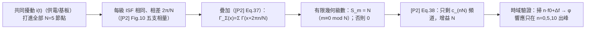

# Lab 34 — 相關供電/基板雜訊的 N·f0 選擇律

> **先備**：[lab_03](/04_simulation_labs/lab_03_ring_oscillator_toy_model)（ring toy 與累積 jitter）、[lab_05](/04_simulation_labs/lab_05_isf_fourier_coefficients)（$c_n$ 的數值萃取）、[fourier_series_of_isf](/03_isf_core_theory/fourier_series_of_isf)（$c_n$ 是「接收頻道」）｜**接下來**：[varactor_tuning_supply_pushing](/06_design_insights/varactor_tuning_supply_pushing)（供電雜訊的準靜態 $K_{push}$ 門）、[device_noise_mapping](/06_design_insights/device_noise_mapping)（諧波＝頻道的整張地圖）

到目前為止的 phase noise 計算都有一個沒明說的前提：**每個雜訊源只打進一個節點、且各節點的源彼此獨立（uncorrelated，不相關）**。device 的 thermal / flicker 雜訊確實如此——[P2] p.792 明講：各節點源不相關時，$N$ 個源的總 phase noise 就是單源結果（[P2] Eq.(6)）的 $N$ 倍（差動 ring 為 $2N$ 倍），**功率直接相加，沒有任何頻率選擇**。

但**供電（supply）與基板（substrate）雜訊不是這樣**。[P2] Sec. VI（p.797）指出它們與 device 內部雜訊有兩個關鍵差異：

1. 其 PSD 通常**非白**，且常在特定頻率有強尖峰（例如開關穩壓器、數位區塊的開關諧波）；
2. **同一條供電線/同一塊基板打到 ring 的每一個節點，擾動幾乎完全相同**——各節點看到的是**強相關**（幾乎 identical）的雜訊。

這一頁把第 2 點變成一條可以量出來的**選擇律（selection rule）**：相關雜訊的有效 ISF 是 $N$ 個相移 $2\pi/N$ 的每級 ISF 之**和**，其傅立葉分量除了 $n\equiv0\ (\mathrm{mod}\ N)$ 全部**相量抵銷**——所以**相關雜訊只有 DC 附近與 $k\cdot N\cdot f_0$ 附近的頻帶會轉成相位**。

> **物理直覺（先講結論）**：把 $N$ 級 ring 想成 $N$ 支指向不同方向的天線——每級的 ISF 形狀相同、只差一個 $2\pi/N$ 的相位（[P2] Fig. 10 把它們畫成 $e^{j2\pi n/5}$ 的五支相量）。同一個擾動打進全部 $N$ 支時，第 $m$ 個諧波頻道收到的是 $N$ 支相量之和：只有當 $m$ 是 $N$ 的整數倍，五支相量才**同相疊加**（增益 $N$）；否則它們在複數平面繞一整圈，**向量和恰為零**。這不是近似，是有限幾何級數的恆等式——本 lab 會把它算到機器精度給你看。

> **模型層級聲明**：本 lab 的每級 ISF 是 **pedagogical toy model（雙葉三角、刻意上升/下降不對稱），非 transistor-level**（要看「量出來」的 ring ISF 去 [lab_32](/04_simulation_labs/lab_32_mos_level1_ring)）。選擇律本身**不依賴 ISF 形狀**——推導對任何 $2\pi$ 週期的 $\Gamma$ 都成立，這正是它強大的原因。相位模型是線性 LTV（[P1] Eq.(11)），沒有振幅動態；真實振盪器的振幅響應會留下殘餘 sideband（[P2] Fig. 11 實測有看到，見第 11 節）。

## 1. 教學目標

- 逐字轉錄並解釋 [P2] Eq.(37)–(38)（p.797）：相同雜訊源打進全部 $N$ 節點時，總相位是 $N$ 個相移 ISF 的疊加。
- 用**有限幾何級數**一步不跳地證明：疊加後的 ISF 只剩 $n\equiv0\ (\mathrm{mod}\ N)$ 的傅立葉分量，且倖存分量放大 $N$ 倍。
- $N=5$ toy ring 數值驗證（頻域）：summed ISF 的 $\lvert c_n\rvert$ 梳只剩 $n=0,5,10,15$，禁止分量掉到數值底噪（選擇比 165.8 dB）。
- 時域驗證（仿 [P2] Fig. 11 的 10 µA 實驗）：共同正弦擾動掃 $n f_0+\Delta f$，相位響應只在 $n=0,5,10$ 出峰（選擇比 66 dB、同調增益 $4.998\approx N$、與 [P1] Eq.(15)/(16) 理論吻合到 $10^{-5}$ 相對誤差）。
- 把結果翻成設計語言：**$N\cdot f_0$ 選擇律**——供電尖峰要避開 $k\cdot N\cdot f_0$；上升/下降對稱關 DC 門；級間失配會讓抵銷不完全。

## 2. 數學模型

### 2.1 從單源到 N 個相同源 —— [P2] Eq.(37)（p.797，逐字轉錄）

單一節點的 LTV 相位響應是 [P1] Eq.(11)（p.182）：$\phi(t)=\frac{1}{q_{max}}\int_{-\infty}^{t}\Gamma(\omega_0\tau)\,i(\tau)\,d\tau$（[P2] 稱之為其 Eq.(5)）。若所有反相器相同，第 $n$ 個節點的 ISF 與第 0 個**形狀相同、只差相位 $2\pi n/N$**（一個週期內 $N$ 級輪流切換，相鄰級的事件錯開 $T/N$……嚴格說單端反相器 ring 相鄰級差 $\pi/N$ 加反相；[P2] 把「全部 $N$ 個節點」的 ISF 集合寫成間隔 $2\pi/N$ 的相移族，Fig. 10 的五支相量）。同一個 $i(\tau)$ 打進全部 $N$ 個節點，由疊加原理：

$$
\phi(t)=\frac{1}{q_{max}}\sum_{n=0}^{N-1}\int_{-\infty}^{t}i(\tau)\,\Gamma\!\left(\omega_0\tau+\frac{2\pi n}{N}\right)d\tau
=\frac{1}{q_{max}}\int_{-\infty}^{t}i(\tau)\left[\sum_{n=0}^{N-1}\Gamma\!\left(\omega_0\tau+\frac{2\pi n}{N}\right)\right]d\tau
$$

（[P2] Eq.(37), p.797。）第二個等號只是把「對 $n$ 求和」與「對 $\tau$ 積分」交換（有限和，永遠合法）。**中括號那團就是本頁的主角**：

$$
\Gamma_\Sigma(x)\equiv\sum_{n=0}^{N-1}\Gamma\!\left(x+\frac{2\pi n}{N}\right)
$$

——相關雜訊看到的**有效 ISF**。單位檢查：$\Gamma$ 無因次，$N$ 個無因次相加仍無因次 ✓；$\phi=[\text{A}\cdot\text{s}/\text{C}]=[\text{C}/\text{C}]=$ 無因次（rad）✓。

### 2.2 有限幾何級數 —— 為什麼只剩 $n\equiv0\ (\mathrm{mod}\ N)$

[P2] 只說「Expanding the term in brackets in a Fourier series, we can show that it is zero except at dc and multiples of $N\omega_0$」（p.797）。我們把「can show」補齊，一步不跳。

**第 1 步（複數傅立葉展開）**：$\Gamma$ 是 $2\pi$ 週期、實值，寫成

$$
\Gamma(x)=\sum_{m=-\infty}^{\infty}\gamma_m\,e^{jmx},\qquad \gamma_{-m}=\gamma_m^{*}
$$

（$\gamma_m$ 無因次；與 [P1] Eq.(12) 實係數形式的對應是 $c_m=2\lvert\gamma_m\rvert$、$m\ge1$，而 DC 值 $=\gamma_0=c_0/2$。）

**第 2 步（把相移代進去）**：相移 $x\to x+2\pi n/N$ 在第 $m$ 個分量上只是乘一個相位因子 $e^{jm\cdot2\pi n/N}$：

$$
\Gamma_\Sigma(x)=\sum_{m=-\infty}^{\infty}\gamma_m\,e^{jmx}\underbrace{\sum_{n=0}^{N-1}e^{j2\pi mn/N}}_{\equiv S_m}
$$

**第 3 步（算 $S_m$：有限幾何級數）**：令 $r=e^{j2\pi m/N}$，則 $S_m=\sum_{n=0}^{N-1}r^{\,n}$。分兩種情形：

- **情形 A：$m\equiv0\ (\mathrm{mod}\ N)$**。此時 $r=e^{j2\pi(m/N)}=1$（$m/N$ 是整數），每一項都是 1：

$$
S_m=\underbrace{1+1+\cdots+1}_{N\ \text{項}}=N
$$

- **情形 B：$m\not\equiv0\ (\mathrm{mod}\ N)$**。此時 $r\neq1$，套幾何級數和公式：

$$
S_m=\frac{1-r^{N}}{1-r}=\frac{1-e^{j2\pi m}}{1-r}=\frac{1-1}{1-r}=0
$$

因為 $r^{N}=e^{j2\pi m}=1$（$m$ 是整數），而分母 $1-r\neq0$。**恰好為零，不是近似**。這就是物理直覺裡「五支相量繞一圈、向量和為零」的代數版；本 lab 實跑印出 $\lvert S_m\rvert$：$m=0,5,10$ 得 5.000，$m=1\dots4,6\dots9$ 全部在 $10^{-16}\sim10^{-15}$（機器精度）。

**第 4 步（結論）**：

$$
\Gamma_\Sigma(x)=N\sum_{m\equiv0\ (\mathrm{mod}\ N)}\gamma_m\,e^{jmx}
\qquad\Longleftrightarrow\qquad
c_{\Sigma,m}=\begin{cases}N\,c_m, & m\equiv0\ (\mathrm{mod}\ N)\\[2pt] 0, & \text{其他}\end{cases}
$$

倖存的頻道**振幅放大 $N$ 倍**（功率 $N^2$ 倍），其他頻道**全滅**。把這個結果代回 Eq.(37)，就是論文的緊湊形式：

$$
\phi(t)=\frac{N}{q_{max}}\sum_{n=0}^{\infty}c_{(nN)}\int_{-\infty}^{t}i(\tau)\cos\left(nN\omega_0\tau\right)d\tau
$$

（[P2] Eq.(38), p.797；「where $c_i$ is the $i$th Fourier coefficient of the ISF」，$c_{(nN)}$ 是**單級** ISF 的第 $nN$ 個傅立葉係數，$N$ 倍增益已提到最前面。）論文原式把各諧波的相位 $\theta_{nN}$ 省略（緊湊寫法；數值驗證時我們保留完整相位）。**DC 項的 ½ 記帳（flag）**：以 [P1] Eq.(12) 的慣例（DC 項寫成 $c_0/2$），Eq.(38) 的 $n=0$ 項應讀作 $N\,(c_0/2)\int i\,d\tau/q_{max}$——即有效 DC 增益是 $\Gamma_{\Sigma,dc}=N c_0/2$。這個 2 是**傅立葉級數 DC 項的記帳**（$\cos$ 頻道在 $n\ge1$ 收上下兩個 sideband、DC 只收一邊），與 SSB 的 2/4 慣例無關。本 lab 的 $n=0$ 時域驗證用 $\Gamma_{\Sigma,dc}=Nc_0/2$ 算，理論/量測吻合到 1.000012。

[P2] 的一句話結論（p.797，逐字）：「for identical sources, only noise in the vicinity of integer multiples of $N\omega_0$ affects the phase.」

### 2.3 頻域後果 —— 只有 DC 與 $k\cdot N\cdot f_0$ 附近的頻帶會轉成相位

對 $\Gamma_\Sigma$ 套 [P1] Eq.(15)/(16)（p.183）的單音注入結果：$i(\tau)=I_0\cos((m\omega_0+\Delta\omega)\tau)$ 時

$$
\phi(t)\approx\frac{I_0\,c_{\Sigma,m}\,\sin(\Delta\omega t)}{2\,q_{max}\,\Delta\omega}
$$

（振幅裡的 2 來自**積化和差** $\cos A\cos B=\tfrac12[\cos(A-B)+\cos(A+B)]$ 的慢項係數，也**不是** SSB 記帳的 2。）於是：

- **相關雜訊**：$c_{\Sigma,m}=0$ 除非 $m\equiv0\ (\mathrm{mod}\ N)$ ⇒ 只有 **DC 附近**（經 $\Gamma_{\Sigma,dc}=Nc_0/2$，上轉成 close-in）與 **$k\cdot N\cdot f_0$ 附近**（下轉）的雜訊會變相位；每個倖存頻帶內仍是 $1/\Delta\omega$ 的積分器行為 ⇒ sideband 隨 offset 以 $-20$ dB/dec 下降（[P2] Fig. 11 實測到這個斜率）。
- **不相關雜訊（對照組）**：各節點源獨立 ⇒ 功率相加，總 phase noise 是單源的 $N$ 倍（[P2] p.792，Eq.(6) 的 $N$ 倍），**每個諧波頻道都開著**，沒有選擇律。
- **兩者在倖存頻帶的差**：相關源振幅增益 $N$ ⇒ 功率 $N^2$；不相關 $N$ 個源功率 $N$ ⇒ 相關比不相關**還糟 $10\log_{10}N$ dB**（$N=5$：7.0 dB）——同調疊加是雙面刃：在禁止頻帶救你（全滅），在倖存頻帶懲罰你（$N^2$）。

### 2.4 DC 門與上升/下降不對稱 —— 為什麼低頻供電雜訊最危險

供電雜訊的功率恰恰**集中在低頻**（穩壓器 ripple、負載瞬變、$1/f$）——正好對準 $\Gamma_{\Sigma}$ 的 **DC 頻道**。這個頻道開多大由單級 ISF 的 $c_0$ 決定，而 $c_0$ 由**上升/下降不對稱**決定（[P2] App. B，p.803）：Eq.(53) 定義 $A=f_{rise}'/f_{fall}'$（上升/下降斜率比），Eq.(56) 給出

$$
\Gamma_{dc}=\frac{2\pi}{\eta^2N^2}\cdot\frac{1-A}{1+A}
$$

——**完美對稱（$A=1$）時 DC 門關死**；不對稱越大門越開，並經 Eq.(57) 抬高 $1/f^3$ corner。本 lab 的 toy ISF 刻意取不對稱雙葉（正葉峰 1.0、負葉峰 0.6），讓 $c_0\neq0$、DC 頻道打開，你才能在圖上同時看到「DC 門」與「$N f_0$ 梳」兩件事。

**設計語言（$N\cdot f_0$ 選擇律）**：對相關的供電/基板雜訊，ring 是一個**梳狀接收機**——只聽 DC 與 $k\cdot N\cdot f_0$。所以：(i) 已知供電有開關尖峰 $f_{sw}$ 及其諧波時，選 $N$、$f_0$ 讓 $k\cdot N\cdot f_0$ **避開**尖峰（或反過來選 $f_{sw}$）；(ii) $N$ 越大，第一個高頻敏感帶 $N f_0$ 越高，而封裝/去耦在高頻通常衰減更多；(iii) 上升/下降對稱（$A\to1$）把 DC 門關小——這與 device flicker 的 $c_0$ 對策（[symmetry](/06_design_insights/symmetry)）是同一顆鈕；(iv) 級間失配會讓相量抵銷不完全，禁止頻帶漏進殘餘（見第 11 節）。

## 3. Block diagram



## 4. Python 核心 code

節錄自 `simulations/lab_34_correlated_supply.py`（已對照原始碼）。toy 每級 ISF、summed ISF、與時域注入量測：

```python
def gamma_stage(theta):
    """每級 toy ring ISF：+1.0 三角葉在上升緣（θ=0）、−0.6 三角葉在下降緣（θ=π）。
    刻意不對稱（1.0 vs 0.6）→ c0 ≠ 0（[P2] App.B：A≠1 ⇒ Γdc≠0）。"""
    th = wrap_phase(theta)
    d_rise = np.minimum(th, 2 * np.pi - th)
    d_fall = np.abs(th - np.pi)
    return H_RISE * _tri(d_rise, W_LOBE) - H_FALL * _tri(d_fall, W_LOBE)

def gamma_summed(theta):
    """N 個相移 2π/N 的每級 ISF 之和（[P2] Eq.(37) 的中括號）。"""
    acc = np.zeros_like(np.asarray(theta, dtype=float))
    for n in range(N_STAGES):
        acc += gamma_stage(theta + 2 * np.pi * n / N_STAGES)
    return acc

def response(n_h, g_t):
    """共同注入 i(t)=I0·cos(2π(n_h·f0+Δf)t)，回傳 φ 在 Δf 的振幅 [rad]。"""
    i_inj = I0 * np.cos(2 * np.pi * (n_h * F0 + DF) * t)
    phi = np.cumsum(i_inj * g_t) * dt / QMAX      # [P1] Eq.(11) 的離散版
    return 2.0 * np.abs(np.mean(phi * proj))      # 投影到 Δf bin（整數個慢週期）
```

頻域部分用 `compute_fourier_coefficients`（lab_05 同一把尺）對單級與 summed ISF 各算 $c_0\dots c_{15}$；相量恆等式直接算 $\lvert S_m\rvert=\lvert\sum_n e^{j2\pi mn/5}\rvert$。

## 5. 完整 script path

`simulations/lab_34_correlated_supply.py`
（依賴 `simulations/common/isf_utils.py` 的 `compute_fourier_coefficients`、`wrap_phase`；`simulations/common/plot_utils.py` 的 `savefig`。）

跑法：`PYTHONPATH=. python simulations/lab_34_correlated_supply.py`（單機數秒，無亂數、完全可重現）。

## 6. 參數表

| 參數 | 程式變數 | 值 | 意義 |
|---|---|---|---|
| 級數 | `N_STAGES` | 5 | ring 級數（[P2] Fig. 11 同為 5 級） |
| 振盪頻率 | `F0` | 5 GHz | 全站 canonical |
| 最大電荷 | `QMAX` | 1 pC | 全站 canonical $q_{max}$ |
| 注入振幅 | `I0` | 10 µA | 與 [P2] Fig. 11 實驗相同 |
| offset | `DF` | 10 MHz | 注入頻率 $=n f_0+\Delta f$ |
| 正葉峰/負葉峰 | `H_RISE` / `H_FALL` | 1.0 / 0.6 | 上升/下降不對稱 ⇒ $c_0\neq0$ |
| 葉半寬 | `W_LOBE` | 0.5 rad | 三角葉半寬 |
| 諧波數 | `N_HARM` | 15 | $\lvert c_n\rvert$ 梳顯示範圍 |
| 掃描上限 | `N_INJ_MAX` | 12 | 注入掃 $n=0\dots12$ |
| 取樣率 | `fs` | $256\,f_0$ | 時域積分取樣 |
| 時長 | — | $4/\Delta f=400$ ns | 4 個慢週期（2000 個載波週期） |

## 7. 單位表

| 量 | 符號 | 單位 | 備註 |
|---|---|---|---|
| 每級/總和 ISF | $\Gamma$、$\Gamma_\Sigma$ | 無因次 | $\Gamma_\Sigma=\sum_n\Gamma(x+2\pi n/N)$ |
| 傅立葉係數 | $c_n$、$c_{\Sigma,n}$ | 無因次 | $c_{\Sigma,n}=N c_n$ 或 0 |
| 相量和 | $S_m$ | 無因次 | $N$ 或 0（機器精度） |
| 注入電流 | $i(t)$ | A | $I_0=10$ µA 單音 |
| 相位響應 | $\phi$ | rad | 在 $\Delta f$ 的振幅 |
| 理論振幅 | $I_0 c_{\Sigma,n}/(2q_{max}\Delta\omega)$ | $\frac{\text{A}}{\text{C}\cdot\text{rad/s}}=$ rad | dimension check ✓ |
| 選擇比 | — | dB | $20\log_{10}$（振幅比） |

## 8. 模擬圖


## 9. 如何解讀圖

**(a) 五支天線與它們的和**：灰線是 5 個相移 $2\pi/5$ 的每級 toy ISF（各自一正一負兩葉）；紅線是 $\Gamma_\Sigma$——注意它變成 **$2\pi/5$ 週期**（每 $T/5$ 就有一級在切換，對共同擾動而言五級不分彼此），這正是「只剩 $n\equiv0\ (\mathrm{mod}\ 5)$ 諧波」的時域面貌。藍虛線是它的平均值 $\Gamma_{\Sigma,dc}=Nc_0/2=0.1592$——DC 門沒關（toy 刻意不對稱），低頻共同雜訊會從這裡上轉。

**(b) $\lvert c_n\rvert$ 梳（頻域驗證）**：灰點是單級 ISF 的 $c_n$——每個頻道都開（$c_0=0.063662$、$c_1=0.249387$、$c_5=0.146770$、$c_{10}=0.003648$）。紅菱形是 summed ISF：只剩 $n=0,5,10,15$，且逐一驗證 $c_{\Sigma,n}/c_n=5.000000$（$n=0,5$）、$4.999999$（$n=10,15$）——增益恰為 $N$。禁止分量最大只剩 $3.766\times10^{-9}$（trapezoid 求積的數值底噪），選擇比

$$
20\log_{10}\frac{c_{\Sigma,5}}{\max_{n\not\equiv0}\lvert c_{\Sigma,n}\rvert}=165.8\ \text{dB}.
$$

**(c) 時域注入掃描（仿 [P2] Fig. 11）**：共同單音 $I_0=10$ µA 打進全部 5 個節點，頻率掃 $n f_0+\Delta f$（$\Delta f=10$ MHz），量 $\phi$ 在 $\Delta f$ 的振幅（實跑印出）：

| $n$ | 0 | 1 | 4 | **5** | 6 | **10** | 11 |
|---|---|---|---|---|---|---|---|
| 相關（5 節點）[rad] | $2.533\times10^{-2}$ | $1.80\times10^{-5}$ | $4.50\times10^{-6}$ | $\mathbf{5.840\times10^{-2}}$ | $9.7\times10^{-7}$ | $\mathbf{1.452\times10^{-3}}$ | $2.93\times10^{-5}$ |
| 單節點 [rad] | $5.07\times10^{-3}$ | $1.99\times10^{-2}$ | $3.59\times10^{-3}$ | $1.17\times10^{-2}$ | $2.24\times10^{-3}$ | $2.93\times10^{-4}$ | $4.01\times10^{-4}$ |
| 理論 $I_0c_{\Sigma,n}/(2q_{max}\Delta\omega)$ | $2.533\times10^{-2}$ | $\approx0$ | $\approx0$ | $5.840\times10^{-2}$ | $\approx0$ | $1.452\times10^{-3}$ | $\approx0$ |

- **選擇律成立**：相關注入只在 $n=0,5,10$ 出峰；禁止 $n$ 的殘餘（$10^{-6}\sim10^{-5}$ rad）是離散取樣/洩漏的數值底噪，選擇比 $20\log_{10}[\text{amp}(5)/\max_{\text{禁止}}]=66.0$ dB。
- **對照組沒有選擇**：單節點注入（灰）在每個 $n$ 都有響應，大小跟著單級 $c_n$ 走——選擇律是**相關性**的結果，不是 ISF 形狀的結果。
- **同調增益**：$\text{amp}_{corr}(5)/\text{amp}_{single}(5)=4.9978\approx N=5$ ✓（功率 $N^2$；對照 $N$ 個**不相關**源只有功率 $N$——見 2.3 的 7.0 dB 註記）。
- **理論吻合**：$n=5$ 量測/理論 $=1.000034$、$n=0$（用 $\Gamma_{\Sigma,dc}=Nc_0/2$）$=1.000012$——[P1] Eq.(15)/(16) 加上選擇律就是全部的物理。
- [P2] Fig. 11 的實測版本（10 µA、5 節點、真實振盪器）看到同樣的結構：只有低頻與第 5 諧波附近被積分、$-20$ dB/dec 斜率；但非 $N$ 倍諧波處**不是零**而是明顯較小——論文把殘餘歸因於**振幅響應**（amplitude response），我們的純相位 toy 沒有這條路，殘餘只剩數值底噪（見第 11 節）。

## Worked example（帶單位 + dimension check）

> **例（供電尖峰撞上 $N f_0$）**：$N=5$、$f_0=5$ GHz 的 ring，供電上有一根開關諧波尖峰恰好落在 $5f_0+10\ \text{MHz}=25.01$ GHz，等效共同注入電流振幅 $I_0=10$ µA，$q_{max}=1$ pC。問載波旁 $\pm10$ MHz 的 spur 多大？

**步驟 1（頻道增益）**：$5f_0$ 是 $N f_0$ 的整數倍 ⇒ 頻道開，增益 $c_{\Sigma,5}=N c_5=5\times0.146770=0.733852$（本 lab 實測）。

**步驟 2（相位振幅，[P1] Eq.(15)/(16) 套 $\Gamma_\Sigma$）**：$\Delta\omega=2\pi\times10^7=6.283\times10^{7}$ rad/s，

$$
\phi_p=\frac{I_0\,c_{\Sigma,5}}{2\,q_{max}\,\Delta\omega}=\frac{10^{-5}\times0.733852}{2\times10^{-12}\times6.283\times10^{7}}=5.840\times10^{-2}\ \text{rad}.
$$

（分母的 2 = 積化和差的慢項係數，非 SSB 記帳。）**dimension check**：$\dfrac{\text{A}}{\text{C}\cdot\text{rad/s}}=\dfrac{\text{A}\cdot\text{s}}{\text{C}}=\dfrac{\text{C}}{\text{C}}=$ 無因次（rad）✓。

**步驟 3（PM sideband → spur 位準）**：小角 PM 的單邊 sideband 振幅是載波的 $\phi_p/2$（這個 2 是窄帶 PM 的 sideband 拆分，與 $\mathcal{L}\approx\tfrac12S_\phi$ 同源、但這裡是 deterministic spur 不是雜訊密度）：

$$
20\log_{10}\frac{\phi_p}{2}=20\log_{10}(2.920\times10^{-2})=-30.7\ \text{dBc}.
$$

一根 $-30.7$ dBc 的 spur 對任何頻率合成器都是災難級——**這就是為什麼 $k\cdot N\cdot f_0$ 要避開已知供電尖峰**。若同一根尖峰落在 $4f_0+10$ MHz（禁止頻道），理想相同級的響應是零（本 lab 量到的殘餘比 $n=5$ 低 66 dB，且那還只是數值底噪；真實電路的殘餘由失配與振幅響應決定）。

```python
I0, c5, qmax, dw = 10e-6, 0.146770, 1e-12, 2*3.141592653589793*10e6
phi_p = I0*5*c5/(2*qmax*dw); print(phi_p, 20*__import__('math').log10(phi_p/2))
# -> 0.0583979274939937 -30.69265122236508（與 lab 實跑 5.8400e-02、-30.7 dBc 一致）
```

順帶一提：若把這 10 µA 當成**不相關**的 device 雜訊處理（每級獨立、功率相加），你會把 $n=1\dots4$ 的頻道也全部打開、卻把 $n=5$ 的功率低估 $N^2/N=5$ 倍（7.0 dB）——相關性搞錯，兩邊都錯。

## 10. 對應 paper 公式／figure

- **[P2] Eq.(37), p.797**：相同源打進全部 $N$ 節點的疊加（本頁 2.1 逐字轉錄；上游是 [P2] Eq.(5) = [P1] Eq.(11) 的 LTV 相位積分）。
- **[P2] Eq.(38), p.797**：傅立葉展開後只剩 dc 與 $N\omega_0$ 整數倍（本頁 2.2 補齊幾何級數證明；DC 項 ½ 記帳見 2.2 的 flag）。
- **[P2] Fig. 10, p.797**：五支 $e^{j2\pi n/5}$ 相量——本頁「天線陣列」直覺的原圖。
- **[P2] Fig. 11, p.797**：10 µA 正弦注入全部五節點、掃 $n f_0+f_m$ 的實測 sideband——只有低頻與第 5 諧波附近被積分、$-20$ dB/dec；非整數倍處的殘餘來自振幅響應。本 lab 的 (c) 是它的線性相位模型複刻。
- **[P2] p.792（Sec. II 末）**：不相關情形的基準——$N$ 個獨立源 ⇒ phase noise 是 Eq.(6) 的 $N$ 倍（差動 $2N$ 倍）。注意 [P2] Eq.(6) 的分母 $8\pi^2f_{off}^2=2\Delta\omega^2$ 是**時域 /2 慣例**，比 [P1] Eq.(21) 的 $/4\Delta\omega^2$（SSB 記帳）大 2 倍——同一件著名的 factor-of-2，全站在 [white_noise_to_phase_noise](/03_isf_core_theory/white_noise_to_phase_noise) 有專節；canonical 數值（$\Gamma_{rms}=0.5$、$S_i=10^{-24}$ A²/Hz、1 MHz）對應 $-148$（/4）vs $-145$（/2）dBc/Hz。
- **[P2] App. B Eq.(53)/(56)/(57), p.803**：$A=f_{rise}'/f_{fall}'$、$\Gamma_{dc}=\frac{2\pi}{\eta^2N^2}\frac{1-A}{1+A}$、$1/f^3$ corner——本頁 DC 門的來源。
- **[P1] Eq.(15)/(16), p.183**：單音注入的相位振幅 $I_0c_n/(2q_{max}\Delta\omega)$——本 lab 時域理論值的公式（套 $c_{\Sigma,n}$）。
- 相關的選擇律近親：**[P2] p.796（Sec. V-B）**指出差動 ring 的 tail-current 雜訊只有**低頻與偶數倍 $f_0$ 附近**影響 phase noise——同一種「對稱性 ⇒ 頻道選擇」邏輯，只是對稱群不同（tail 節點看到的是半週期對稱）。

## 11. 限制與 approximation

- **純相位線性 LTV**：本 lab 只有 [P1] Eq.(11) 的相位積分，沒有振幅動態。[P2] Fig. 11 實測在非 $N$ 倍諧波處看到**振幅響應造成的殘餘 sideband**——那條路徑（AM，及經 AM-PM 轉回相位）在本模型裡不存在；我們的禁止頻帶殘餘（$-66$ dB）純屬數值底噪（取樣洩漏），不要拿去預測真實電路的禁止頻帶深度。
- **完全相同的級（identical stages）**：抵銷恰為零依賴每級 ISF 形狀相同、間隔精確 $2\pi/N$。實際失配（負載、驅動強度、佈局）讓相量和殘留 $\propto$ 失配量——一階近似下，$\varepsilon$ 的相對失配讓禁止頻道漏進 $\sim\varepsilon$ 的振幅（$20\log_{10}\varepsilon$ dB）。1% 失配 ⇒ 禁止頻帶只壓 40 dB，不是無限深。
- **「完全相關、等強度、同號」的注入**：真實供電/基板耦合到各節點的係數不完全相等（IR drop、佈局距離），介於「完全相關」與「不相關」之間；本頁兩個極端給出上下界。
- **toy ISF**：雙葉三角是手放的（[lab_03](/04_simulation_labs/lab_03_ring_oscillator_toy_model) 同款思路、加上不對稱）；真實單端 ring 的 ISF 形狀見 [lab_32](/04_simulation_labs/lab_32_mos_level1_ring)。**但選擇律不依賴形狀**——2.2 的證明對任何 $2\pi$ 週期 $\Gamma$ 成立，換 ISF 只改各頻道的 $c_n$ 值、不改「哪些頻道存在」。
- **供電雜訊這裡被模型化為節點電流注入**：低頻供電雜訊還有一條**準靜態 FM 路徑**（$K_{push}$，經工作點改 $f_0$）——那是 [varactor_tuning_supply_pushing](/06_design_insights/varactor_tuning_supply_pushing) 的主題；兩條路徑並存，低 offset 時 $K_{push}$ 門通常主導，$k N f_0$ 梳則是**高頻**供電尖峰的專屬入口。
- **cyclostationary 加權未含**：嚴格說各級注入還要乘 NMF $\alpha(\omega_0t)$（[effective_isf](/03_isf_core_theory/effective_isf)）；相同級時 $\alpha$ 也是同族相移函數，選擇律對 $\Gamma_{eff}=\Gamma\alpha$ 照樣成立（乘積仍 $2\pi$ 週期）。

## 重點回顧

- 供電/基板雜訊與 device 雜訊的本質差異：**非白 PSD（有尖峰）＋跨節點強相關**（[P2] Sec. VI, p.797）。
- 相關源的有效 ISF 是 $N$ 個相移 $2\pi/N$ 的每級 ISF 之**和**（[P2] Eq.(37)）；有限幾何級數 $S_m=N$（$m\equiv0\ \mathrm{mod}\ N$）或 $0$（其他）⇒ **只剩 $n\equiv0\ (\mathrm{mod}\ N)$ 的頻道，增益 $N$**（[P2] Eq.(38)）。
- 數值驗證（$N=5$ toy）：$\lvert S_m\rvert$ 到機器精度；$c_{\Sigma,n}/c_n=5.000000$；頻域選擇比 165.8 dB；時域掃描只在 $n=0,5,10$ 出峰（66.0 dB、同調增益 4.9978、理論吻合 $10^{-5}$）。
- **$N\cdot f_0$ 選擇律**：相關雜訊只從 **DC**（門大小 $=Nc_0/2$，由上升/下降不對稱 $A$ 決定，[P2] Eq.(56)）與 **$k\cdot N\cdot f_0$ 附近**進來。設計上：讓 $kNf_0$ 避開供電尖峰、對稱化關 DC 門、注意失配讓抵銷不完全。
- 倖存頻帶上相關比不相關**糟 $10\log_{10}N$ dB**（同調 $N^2$ vs 功率 $N$）；禁止頻帶上相關**好到只剩失配/振幅殘餘**。相關性判斷錯，兩邊都算錯。

## 延伸閱讀

- [varactor_tuning_supply_pushing](/06_design_insights/varactor_tuning_supply_pushing)：供電雜訊的另一條門——準靜態 $K_{push}$ FM 路徑（低頻主導；本頁的梳是高頻入口）。
- [device_noise_mapping](/06_design_insights/device_noise_mapping)：「諧波＝接收頻道」的整張地圖——本頁等於在地圖上為相關源把 $N-1$ 個頻道全部關掉。
- [fourier_series_of_isf](/03_isf_core_theory/fourier_series_of_isf)：$c_n$ 與 [P1] Eq.(12)/(13) 的頻道結構。
- [lab_05](/04_simulation_labs/lab_05_isf_fourier_coefficients)：$c_n$ 數值萃取（本 lab 的頻域尺）。
- [lab_32](/04_simulation_labs/lab_32_mos_level1_ring)：不想用手放 ISF？從 MOS Level-1 方程把 ring ISF 量出來。
- [paper_002 deep dive](/05_paper_deep_dives/paper_002_jitter_phase_noise_ring)：[P2] 全文導讀（Sec. VI 在其中的位置）。
