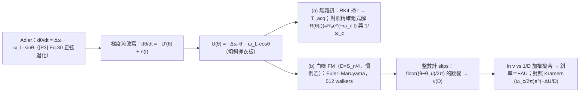

# Lab 36 — 鎖定捕獲暫態與 noise-induced cycle slips

> **先備**：[injection_locking_noise](/06_design_insights/injection_locking_noise)（[P3] 廣義 Adler 退化成 $\dot\theta=\Delta\omega-\omega_L\sin\theta$、鎖內雜訊整形 lab_26、鎖外 pulling lab_27）、[paper_003](/05_paper_deep_dives/paper_003_injection_locking_part1)（lock characteristic 的來源）、[diffusion_dictionary](/03_isf_core_theory/diffusion_dictionary)（$D$ 的慣例對帳）｜**接下來**：[paper_004](/05_paper_deep_dives/paper_004_injection_locking_part2)（暫態 pull-in 的原始出處 [P4] Sec. V）、[quadrature_and_coupled_oscillators](/06_design_insights/quadrature_and_coupled_oscillators)。

[injection_locking_noise](/06_design_insights/injection_locking_noise) 已經回答了「鎖定**之後**」
（雜訊整形）與「鎖**不住**」（pulling 梳）兩個穩態問題。這一頁補上中間缺的兩塊**暫態**拼圖：

> **這頁要回答什麼**：
> 1. 打開注入的那一刻，相位要花**多久**才爬進鎖定點？settle 率是多少？為什麼靠近
>    lock range 邊緣時「鎖得上、但鎖得極慢」？（Part a：**捕獲暫態**）
> 2. 鎖住之後，雜訊偶爾把相位**整圈踢過去**（cycle slip，相位一次滑掉 $2\pi$）的
>    機率有多大？它跟失諧、跟雜訊強度是什麼函數關係？canonical 數字下多久滑一次？（Part b）

> **物理直覺（先講結論）**：把 Adler 方程改寫成「過阻尼粒子滾進**傾斜搓衣板**
> （tilted washboard）位能」就一目了然。**捕獲**＝粒子從坡上滾進最近的凹槽：
> 凹槽附近的位能曲率是 $\omega_c=\sqrt{\omega_L^2-\Delta\omega^2}$，所以 settle 是速率
> $\omega_c$ 的指數收斂；失諧 $r=\Delta\omega/\omega_L\to1$ 時凹槽與鞍點合併、曲率歸零，
> 捕獲時間以 $1/\sqrt{1-r}$ 發散（臨界慢化）。**cycle slip**＝熱雜訊把粒子踢過凹槽旁
> $\Delta U$ 高的坎、往下滑一格（$2\pi$）：速率是 Arrhenius 型 $e^{-\Delta U/D}$，
> 而「嘗試頻率」又是同一個 $\omega_c/2\pi$——**這是那個畢氏根號的第三次登場**
> （第一次：settle 率；第二次：lab_26 的雜訊整形 corner；鎖外它變身拍頻 $\omega_b$）。

> **本頁定位**：進階 lab 頁，理論在頁上完整推導。相位方程本體與 pull-in 頻率是
> [P3]/[P4] 的原生結果（[P3] Eq.(38)–(40), p.2115；[P4] Eq.(31)–(32) 與 Table I, p.2130，
> 皆已對照原始 PDF 核實）；**把雜訊踢過障壁的逃逸率（Kramers／MFPT）是標準隨機過程理論，
> 不在本站 5 篇 PDF 內**（外部文獻：Kramers 1940、Risken 1989、Ambegaokar–Halperin 1969，
> 見文末），本頁誠實推導障壁本身、引用逃逸率公式、再用 SDE 模擬逐項對數。

## 1. 教學目標

- 對 $\dot\theta=\Delta\omega-\omega_L\sin\theta$（$\lvert\Delta\omega\rvert\le\omega_L$）用分離變數＋
  tan 半角**精確解出**捕獲軌跡：settle 率不只在線性化下、而是**全域**等於
  [P3] Eq.(40) 的 pull-in 頻率 $\omega_c=\sqrt{\omega_L^2-\Delta\omega^2}$。
- 展示**臨界慢化**：掃 $r=\Delta\omega/\omega_L$ 到 0.99，捕獲時間 $\propto1/\omega_c$ 發散
  （RK4 量測 vs 精確閉式解，比值 1.0000）。
- 把 Adler 方程改寫成傾斜搓衣板位能 $U(\theta)=-\Delta\omega\,\theta-\omega_L\cos\theta$，
  **逐步導出**前向障壁 $\Delta U=2\omega_L[\sqrt{1-r^2}-r\arccos r]$ 與兩個極限
  （$r=0$：$2\omega_L$；$r\to1$：$\propto(1-r)^{3/2}$）。
- 用 Kramers 逃逸率（外部文獻）預測 slip 率 $\nu\approx(\omega_c/2\pi)e^{-\Delta U/D}$，
  以 512-walker Euler–Maruyama 驗證：log-linear 斜率＝障壁（擬合/理論 = 0.993），
  前置係數誠實對帳（0.88）。
- 換回 canonical 數字（$f_L=5$ MHz、true-LC $S_n=0.5$ rad²/s）：$r=0.8$ 時 slip 率
  $\sim10^{-1.86\times10^7}$ ——**永遠不會發生**；要到離鎖定邊緣 $10^{-5}$ 之內才變成每秒一次
  ——thermal slips 是「懸崖」不是「斜坡」。

## 2. 數學模型（理論在此頁推導）

### 2.0 出發點與符號（一行回顧）

本站已核實的 [P3] 廣義 Adler（Eq.(30), p.2113）對正弦注入＋ideal-LC ISF 退化成經典 Adler
（完整推導與符號對映見 [injection_locking_noise](/06_design_insights/injection_locking_noise) 第 0 步）：

$$
\frac{d\theta}{dt}=\Delta\omega-\omega_L\sin\theta,\qquad
\Delta\omega\equiv\omega_0-\omega_{inj}\ [\text{rad/s}],\quad
\omega_L=\frac{I_{inj}}{2q_{max}}\ [\text{rad/s}].
$$

（[P3] 自己把它寫成 $d\theta/dt=-\Delta\omega_{[P3]}+\Omega(\theta)$，Eq.(38), p.2115，
$\Delta\omega_{[P3]}=\omega_{inj}-\omega_0$——差一個整體正負號，本頁結果只依賴
$\Delta\omega^2$ 與 $r\equiv\Delta\omega/\omega_L$，不受影響。）本頁全程取
$0\le r\le1$（$\Delta\omega\ge0$），並常用無因次時間 $\tau=\omega_L t$——Adler 動力學
只依賴 $r$ 與（Part b 的）$D/\omega_L$，換算回實際單位只要除以 $\omega_L$。

### 2.1 Part (a)：捕獲暫態——精確解與臨界慢化

**第 1 步：鎖定點與線性化（[P3] 的原生結果）。** 穩態 $\sin\theta_{ss}=r$，穩定分支
$\theta_{ss}=\arcsin r$（$\cos\theta_{ss}\gt0$）、不穩定解 $\theta_u=\pi-\arcsin r$
（[P3] Eq.(38)–(39), p.2115 的穩定性判準：$\Omega'(\theta_0)\lt0$）。在 $\theta_{ss}$ 附近
一階 Taylor 展開（$\sin\theta\approx r+\cos\theta_{ss}\,\delta\theta$）：

$$
\frac{d(\delta\theta)}{dt}=-\omega_c\,\delta\theta,\qquad
\omega_c\equiv\omega_L\cos\theta_{ss}=\sqrt{\omega_L^2-\Delta\omega^2}.
$$

這正是 [P3] Eq.(40), p.2115 定義的 **pull-in frequency**
$\omega_p:=-\Omega'(\theta_0)=1/\tau_p$，[P3] 明寫解為指數收斂
$\hat\theta(t)\propto e^{-t/\tau_p}$。**單位檢查**：$[\omega_c]=$ rad/s ✓；
$\delta\theta$ [rad] ÷ s ＝ rad/s ✓。

**第 2 步：不線性化，直接精確解（分離變數＋tan 半角）。** 把時間分離出來：

$$
t=\int\frac{d\theta}{\Delta\omega-\omega_L\sin\theta}.
$$

用 Weierstrass 半角代換 $u=\tan(\theta/2)$（$\sin\theta=\dfrac{2u}{1+u^2}$、
$d\theta=\dfrac{2\,du}{1+u^2}$）——**與 [injection_locking_noise](/06_design_insights/injection_locking_noise) Part B
推拍頻時完全同一步**——分母變成同一個二次式：

$$
t=\int\frac{2\,du}{\Delta\omega\,u^2-2\omega_L u+\Delta\omega}.
$$

差別只在判別式的**正負號**：鎖外（$\Delta\omega\gt\omega_L$）判別式為負，配方後是
$\arctan$ → 週期解（拍頻 $\omega_b$）；**鎖內（$\Delta\omega\lt\omega_L$）判別式
$4(\omega_L^2-\Delta\omega^2)\gt0$，二次式有兩個實根**：

$$
u_\pm=\frac{\omega_L\pm\omega_c}{\Delta\omega},\qquad
u_+u_-=\frac{\omega_L^2-\omega_c^2}{\Delta\omega^2}=1 .
$$

這兩個根不是別人，正是兩個平衡點的半角正切——用半角公式與
$\Delta\omega^2=(\omega_L+\omega_c)(\omega_L-\omega_c)$（末步有理化）：

$$
\tan\frac{\theta_{ss}}{2}=\frac{\sin\theta_{ss}}{1+\cos\theta_{ss}}
=\frac{\Delta\omega}{\omega_L+\omega_c}=\frac{\omega_L-\omega_c}{\Delta\omega}=u_-\ (\text{穩定}),
\qquad u_+=\tan\frac{\theta_u}{2}\ (\text{不穩定});
$$

而 $u_+u_-=1$ 即 $\tan\frac{\theta_{ss}}{2}\tan\frac{\theta_u}{2}=1\Leftrightarrow\theta_{ss}+\theta_u=\pi$ ✓（自洽）。
部分分式（$u_+-u_-=2\omega_c/\Delta\omega$）：

$$
\frac{2}{\Delta\omega(u-u_+)(u-u_-)}
=\frac{1}{\omega_c}\left[\frac{1}{u-u_+}-\frac{1}{u-u_-}\right]
\quad\Longrightarrow\quad
t=\frac{1}{\omega_c}\ln\left\lvert\frac{u-u_+}{u-u_-}\right\rvert+C.
$$

整理成最乾淨的形式——定義軌跡座標 $R$，它**嚴格指數衰減**：

$$
\boxed{\ R(\theta)\equiv\frac{\tan\frac{\theta}{2}-\tan\frac{\theta_{ss}}{2}}{\tan\frac{\theta}{2}-\tan\frac{\theta_u}{2}},
\qquad R\big(\theta(t)\big)=R(\theta_0)\,e^{-\omega_c t}\ }
$$

**單位檢查**：$u$、$R$ 無因次；指數 $\omega_c t=$ (rad/s)(s) ＝ rad（無因次）✓。
**讀出三件事**：

1. **settle 率全域就是 $\omega_c$**——不是只有線性化才對：整條軌跡在 $R$ 座標下以
   $e^{-\omega_c t}$ 收斂；靠近鎖定點時 $u-u_-\propto e^{-\omega_c t}$，回到第 1 步 ✓。
2. **精確捕獲時間**（從 $\theta_0$ 到 $\theta_{ss}-\varepsilon$）：
   $T_{acq}=\dfrac{1}{\omega_c}\ln\dfrac{R(\theta_0)}{R(\theta_{ss}-\varepsilon)}$——
   $1/\omega_c$ 是主角，起點與門檻只進對數。
3. **與 [P4] Eq.(31), p.2130 等價**。[P4] 把同一個解寫成
   $\tan(N\tilde\theta/2)=\tan(N\tilde\theta_0/2)\tanh\!\big((\omega_p t+\phi_0)/2\big)$
   （其座標把 lock characteristic 移成偶函數，於是不穩定點恰在 $-\tilde\theta_0$）。用恆等式
   $x=x_0\tanh z\Leftrightarrow\dfrac{x-x_0}{x+x_0}=-e^{-2z}$ 即化成上框的 $R$ 形式；
   $\tanh$ 引數裡的 **$/2$ 與 $e^{-2z}$ 的 2 相消**，衰減率仍是 $\omega_p$（＝我們的
   $\omega_c$；[P4] Eq.(32)：$\omega_p=N\sqrt{\omega_L^2-\Delta\omega^2}$，取 $N=1$）——
   這個 2 是 tanh 半角記帳，不是物理。誠實註記：$\tanh$ 只掃 $(-1,1)$，所以 [P4] 那個
   寫法涵蓋「起點落在兩平衡點之間弧段」的初值；起點在弧段外時同一族解取 $\coth$ 分支，
   衰減率相同——$R$ 形式（$R(\theta_0)$ 任意實數）兩支都包含。
   [P4] Table I, p.2130 用電路模擬驗證了這個指數 pull-in：$\tau_p/T_{inj}$ 模擬
   6／1.87／16.9 對理論 5.95／1.79／17.4。

**第 3 步：臨界慢化（lock range 邊緣的代價）。** 令 $r=1-\delta$、$\delta\ll1$：

$$
\omega_c=\omega_L\sqrt{1-r^2}=\omega_L\sqrt{\delta(2-\delta)}\approx\sqrt{2}\,\omega_L\sqrt{1-r}\ \to\ 0,
$$

$$
T_{acq}\approx\frac{1}{\omega_c}\Big[\ln\frac{1}{\varepsilon}+O(1)\Big]\ \propto\ \frac{1}{\sqrt{1-r}}\ \to\ \infty .
$$

物理：$r\to1$ 時穩定點 $\arcsin r$ 與不穩定點 $\pi-\arcsin r$ 在 $\pi/2$ **合併**
（saddle-node 分岔），恢復力斜率歸零——「鎖得上」與「鎖得快」是兩回事。
（saddle-node 臨界慢化是標準非線性動力學結果——外部文獻，非本站 5 篇 PDF，
如 S. H. Strogatz, *Nonlinear Dynamics and Chaos*, 2nd ed., Westview, 2015——但上面的
推導自足，不需引用即可驗證。）這與 [injection_locking_noise](/06_design_insights/injection_locking_noise)
的兩個穩態結論互相呼應：邊緣處雜訊抑制 corner $\omega_c\to0$（Part A）、鎖外拍頻
$\omega_b\to0$（Part B）——**同一個根號、三種慢化**。

> **例（捕獲時間，canonical 尺度）**：$f_L=\omega_L/2\pi=5$ MHz、$r=0.5$、
> $\theta_0=0$、$\varepsilon=0.01$ rad。模擬（第 8 節）量到 $\omega_L T_{acq}=4.435$，
> 換回實際單位 $T_{acq}=4.435/(2\pi\times5\times10^6)=141.2$ ns——對 $f_0=5$ GHz
> 的載波是 706 個週期。**dimension check**：無因次 ÷ (rad/s) ＝ s ✓。
> 同法 $r=0.99$：$\omega_L T_{acq}=22.913\Rightarrow729.3$ ns（3647 週期）——
> 失諧從一半推到邊緣，捕獲慢了 5.2 倍，而且還會繼續以 $1/\sqrt{1-r}$ 惡化。

### 2.2 Part (b)：傾斜搓衣板、障壁、與 Kramers 逃逸

**第 1 步：把雜訊放回來，改寫成梯度流。** 振盪器自身白噪經 ISF 平均後等效白色 FM 驅動
$n(t)$（單邊 PSD $S_n=\Gamma_{rms}^2\,\overline{i_n^2}/\Delta f\,/q_{max}^2$ [rad²/s]，
推導見 [injection_locking_noise](/06_design_insights/injection_locking_noise) 第 2 步）：

$$
\frac{d\theta}{dt}=\Delta\omega-\omega_L\sin\theta+n(t)
=-\frac{\partial U}{\partial\theta}+n(t),\qquad
\boxed{\ U(\theta)=-\Delta\omega\,\theta-\omega_L\cos\theta\ }
$$

（驗證：$-\partial_\theta U=\Delta\omega-\omega_L\sin\theta$ ✓。）這是**傾斜搓衣板**：
平均斜率 $-\Delta\omega$（失諧把整條位能面往下傾）、疊上振幅 $\omega_L$ 的波紋（注入的
恢復力）。**單位**：$[\Delta\omega\,\theta]=$ (rad/s)(rad)，$[\omega_L\cos\theta]=$ rad/s——
rad 無因次（全站慣例），兩項同為 $\text{rad}^2/\text{s}$ 等效 $1/\text{s}$ ✓；
$U'$ 是 rad/s、與 $\dot\theta$ 同單位 ✓。

**慣例 flag（$D$ 的 2 與 4，照 [diffusion_dictionary](/03_isf_core_theory/diffusion_dictionary) 對帳）**：
Kramers 文獻把雜訊寫成 $\langle n(t)n(t')\rangle=2D\,\delta(t-t')$——這是**慣例乙**
（$\mathrm{Var}[\Delta\phi]=2D\lvert t\rvert$）。單邊 PSD $S_n$ 的自相關是
$(S_n/2)\delta$（這個 2＝單邊↔雙邊 Wiener–Khinchin），對上 $2D\delta$ 再吃掉第二個 2
（慣例乙定義），所以

$$
D=\frac{S_n}{4}=\frac{\kappa^2}{2}=\frac{\Gamma_{rms}^2}{4q_{max}^2}\frac{\overline{i_n^2}}{\Delta f}\quad[\text{rad}^2/\text{s}].
$$

Canonical：true LC（$\Gamma_{rms}=1/\sqrt2$、$S_i=10^{-24}$ A²/Hz、$q_{max}=1$ pC）
$S_n=0.5\Rightarrow D=0.125$ rad²/s；代表值 $\Gamma_{rms}=0.5$ 則 $S_n=0.25\Rightarrow D=0.0625$ rad²/s。
（同一組代表值數字在自由跑振盪器上對應 $\mathcal{L}(1\text{MHz})=-148.0$ dBc/Hz——
[P1] Eq.(21) 的 SSB $/4$ 慣例；時域 $/2$ 慣例則為 $-145.0$ dBc/Hz。每個 2/4 的身分
見 [diffusion_dictionary](/03_isf_core_theory/diffusion_dictionary)。）

**第 2 步：障壁 $\Delta U$——老老實實算。** 極值：$U'(\theta)=0\Leftrightarrow\sin\theta=r$。
凹槽底 $\theta_{ss}=\arcsin r$（$U''=\omega_L\cos\theta_{ss}=+\omega_c\gt0$）、
坎頂 $\theta_u=\pi-\arcsin r$（$U''=-\omega_c$）——**又是同一對平衡點、同一個 $\omega_c$**。
往前滑（順著傾斜方向、$\theta$ 增加）要翻過的高度：

$$
\begin{aligned}
\Delta U_+&=U(\theta_u)-U(\theta_{ss})\\
&=\big[-\Delta\omega(\pi-\arcsin r)+\omega_L\sqrt{1-r^2}\big]
 -\big[-\Delta\omega\arcsin r-\omega_L\sqrt{1-r^2}\big]\\
&=2\omega_L\sqrt{1-r^2}-\Delta\omega\big(\pi-2\arcsin r\big)\\
&=2\omega_L\Big[\sqrt{1-r^2}-r\Big(\tfrac{\pi}{2}-\arcsin r\Big)\Big]
\end{aligned}
$$

用 $\tfrac{\pi}{2}-\arcsin r=\arccos r$：

$$
\boxed{\ \Delta U_+(r)=2\,\omega_L\Big[\sqrt{1-r^2}-r\arccos r\Big]\ }
$$

（這裡的 **2 是幾何的**——max 減 min 各貢獻一份 $\omega_L\sqrt{1-r^2}$——不是記帳慣例。）
**三個檢查**：

- **單位**：$\omega_L$ [rad/s] × 無因次 ＝ rad²/s（rad≡1 記帳同上）；指數
  $\Delta U/D=$ (rad²/s)/(rad²/s) 無因次 ✓。
- **$r=0$**：$\Delta U_+=2\omega_L$——未傾斜搓衣板 $-\omega_L\cos\theta$ 的谷到峰 ✓；
  此時前後對稱，slips 兩方向等率、淨漂移為零。
- **$r\to1$**（$r=1-\delta$）：$\sqrt{1-r^2}\approx\sqrt{2\delta}(1-\delta/4)$、
  $\arccos r\approx\sqrt{2\delta}(1+\delta/12)$，相減後首階
  $\Delta U_+\approx\dfrac{4\sqrt2}{3}\,\omega_L(1-r)^{3/2}\to0$——標準 saddle-node
  障壁標度。$r=0.8$ 代入漸近式得 $0.169\,\omega_L$，對精確值 $0.1704\,\omega_L$ 只差 1%。

**反向障壁**：往回滑要翻 $\theta_u-2\pi$ 那座坎，多爬一整格傾斜量：
$\Delta U_-=\Delta U_++2\pi\Delta\omega$（每格位能淨落差
$U(\theta-2\pi)-U(\theta)=2\pi\Delta\omega$）。$r=0.8$ 時反向率被多壓
$e^{-2\pi r\,\omega_L/D}$——本頁參數下徹底可忽略，slips 實質單向（往失諧方向）。

**第 3 步：逃逸率（Kramers——外部文獻，誠實標註）。** 對過阻尼 SDE
$\dot x=-U'(x)+n$、$\langle nn'\rangle=2D\delta$、障壁 $\Delta U\gg D$，平均逃逸率為

$$
\nu=\frac{\sqrt{U''(\theta_{ss})\,\lvert U''(\theta_u)\rvert}}{2\pi}\,e^{-\Delta U/D}
\qquad\text{（Kramers 1940；Risken 1989, Ch. 11——外部文獻，非本站 5 篇 PDF）}
$$

本問題 $U''(\theta_{ss})=\lvert U''(\theta_u)\rvert=\omega_c$，所以

$$
\boxed{\ \nu_{slip}\approx\frac{\omega_c}{2\pi}\,e^{-\Delta U_+/D}\ }
\qquad\Big[\frac{1}{\text{s}}\Big]
$$

**dimension check**：$\omega_c/2\pi$＝rad/s ÷ rad ＝ 1/s（嘗試頻率，Hz）✓、指數無因次 ✓。
$\omega_c$ 的**第三次登場**：鎖內 settle 率、雜訊整形 corner（lab_26）、現在是逃逸的
attempt rate——全部是 lock characteristic 在鎖定點的斜率。相同的傾斜搓衣板＋熱逃逸
數學也統治 Josephson junction 的 RSJ 模型與過阻尼單擺（Ambegaokar–Halperin 1969，
外部文獻）——Adler 方程只是它的振盪器化身。誠實界線：Kramers 式是 $\Delta U/D\gg1$ 的
漸近結果，中等障壁有 $O(D/\Delta U)$ 修正——所以第 8 節用**斜率**（障壁）當主要驗證、
前置係數誠實報告偏差。

> **例（slip 率，canonical 數字）**：$f_L=5$ MHz、$r=0.8$。
> $\Delta U_+=0.1704\,\omega_L=0.1704\times2\pi\times5\times10^6=5.353\times10^6$ rad²/s；
> $\omega_c=0.6\,\omega_L$（3–4–5 三角形）、嘗試頻率 $\omega_c/2\pi=3.0$ MHz。
> true-LC 熱雜訊 $D=0.125$ rad²/s：$\Delta U/D=4.283\times10^7$，
> $\log_{10}\nu\approx6.5-4.283\times10^7\times0.4343=-1.86\times10^7$——
> slip 率是 $10^{-18{,}600{,}000}$ 每秒。宇宙年齡才 $4\times10^{17}$ s：**永遠不會發生**。
> 反過來問「多靠近邊緣才會每秒滑一次」：解 $\nu(r^\*)=1$ 得 $1-r^\*=7.6\times10^{-6}$
> （true LC；代表值 $D=0.0625$ 給 $4.7\times10^{-6}$）——要把失諧推到離 lock range
> 邊緣**百萬分之七**以內。結論：對乾淨注入＋thermal noise，cycle slip 不是漸進退化、
> 是**懸崖**；實務上看到的 slips 幾乎都來自暫態、干擾源、或等效 $D$ 大得多的迴路
> （低 SNR CDR、bang-bang PLL），而懸崖邊上 $\omega_c$ 也早已塌掉
> （$r^\*$ 處雜訊整形 corner 只剩 19.5 kHz——先髒、再滑）。
> 一次 slip 的代價：相位一口氣多走 $\pm2\pi$＝**整整一個載波週期**——forwarded-clock
> SerDes 直接掉一個 bit、計數型 PLL 直接錯一拍，所以它是「率」要壓到指數小、
> 不是「幅」可以平均掉的雜訊。

### 2.3 適用與失效條件

| 條件 | 成立時 | 失效時會怎樣 |
|---|---|---|
| 弱注入 $I_{inj}\ll I_{max}=\omega_0q_{max}$（[P3] Eq.(36)–(37), p.2115） | Adler／lock characteristic 線性於 $i_{inj}$ | 強注入：要 [P4] 的 APF/AM 修正（[paper_004](/05_paper_deep_dives/paper_004_injection_locking_part2)） |
| $\theta$ 慢變（一週期內近似常數） | time-averaged 方程（[P3] Eq.(30)）成立 | 捕獲初期若 $\dot\theta\sim\omega_{inj}$ 平均失效（本頁 $\omega_c\ll\omega_{inj}$ 沒問題） |
| 正弦注入＋ideal-LC ISF | $-\omega_L\sin\theta$ 閉式、$u_\pm$ 實根公式 | 任意波形/拓樸：回到 $\Omega(\theta)$，settle 率一般化為 $-\Omega'(\theta_{ss})$（[P3] Eq.(40)），障壁改為 $\int[\Omega(\theta)-\Delta\omega]d\theta$ 的對應面積，無簡單閉式 |
| 純相位模型（忽略振幅動態） | 本頁全部 | 大暫態／強注入 LC：振幅也在動，[P4] Sec. V 的 APF 修正（Table I 第三欄即為 APF 案例） |
| $\Delta U\gg D$（高障壁） | Kramers 率＋前置係數 $\omega_c/2\pi$ | 中低障壁：指數斜率仍近似、前置係數偏差變大（第 8 節實測 0.77–0.94）；$\Delta U\lesssim D$ 時完全失效、回到 pulling 連續滑動 |
| 白噪 FM 驅動 | $D=S_n/4$ 常數 | flicker FM：$D$ 不再是常數，逃逸統計非 Poisson（本頁不涵蓋） |

## 3. Block diagram



## 4. Python 核心 code

節錄自 `simulations/lab_36_lock_acquisition.py`（已對照原始碼）。精確閉式解、障壁、
與 slip 計數主迴圈：

```python
def barrier(r):                        # ΔU/ω_L = 2(√(1−r²) − r·arccos r)
    return 2.0 * (np.sqrt(1.0 - r**2) - r * np.arccos(r))

def acquisition_exact(r, theta0=0.0, eps=0.01):
    wc = np.sqrt(1.0 - r**2)           # ω_c/ω_L（無因次 pull-in 率）
    um = (1.0 - wc) / r                # tan(θ_ss/2)（穩定根）
    up = (1.0 + wc) / r                # tan(θ_u/2) （不穩定根；um·up = 1）
    R = lambda u: (u - um) / (u - up)  # R(θ(t)) = R(θ₀)·e^(−ω_c t)
    u0, uthr = np.tan(theta0 / 2), np.tan((np.arcsin(r) - eps) / 2)
    return (1.0 / wc) * np.log(R(u0) / R(uthr))   # 精確捕獲時間 [1/ω_L]

# --- slips：Euler–Maruyama（無因次 τ=ω_L t；n 由站上 white_noise 供給） ---
# white_noise 單邊 PSD = 4D ⇒ 增量方差 2·D·dτ（慣例乙 ⟨nn'⟩=2Dδ）[已核對]
nz = white_noise(nb * m, 4.0 * D, 1.0 / dtau, rng).reshape(nb, m)
for i in range(nb):
    theta += (r - np.sin(theta) + nz[i]) * dtau
# 整數計 slips：floor((θ−θ_u)/2π) 在同一格凹槽內恆定、slip 時 ±1
slips = int(np.sum(np.floor((th_end - th_u) / (2*np.pi))
                   - np.floor((th_start - th_u) / (2*np.pi))))
```

跑出來的核對數字（`PYTHONPATH=. python3 simulations/lab_36_lock_acquisition.py`）：

```python
print(ratio_min, ratio_max)     # -> 1.0000 1.0000 RK4 捕獲時間 / 精確閉式解（12 個 r 全對上）
print(T_r050)                   # -> 4.435 ω_L·T_acq @ r=0.5（ε=0.01 rad, θ₀=0）
print(T_r090)                   # -> 9.202 ω_L·T_acq @ r=0.9
print(T_r099)                   # -> 22.913 ω_L·T_acq @ r=0.99（臨界慢化）
print(wc_T_range)               # -> 2.30 .. 4.10 ω_c·T_acq 全程幾乎不動（發散全在 1/ω_c）
print(max_traj_dev)             # -> 2.90e-14 rad，閉式解 vs RK4 整條軌跡最大偏差（r=0.8）
print(T_r05_real)               # -> 141.2 ns（=706 個 5 GHz 載波週期；f_L=5 MHz）
print(dU_over_wL)               # -> 0.1704 障壁 ΔU/ω_L @ r=0.8
print(slips_x6, ratio_x6)       # -> 1350, 0.93 slips 與 (量測/Kramers) @ ΔU/D=6
print(dU_fit_over_theory)       # -> 0.993 擬合障壁 / 理論障壁（log-linear 斜率）
print(prefac_fit_over_kramers)  # -> 0.88 擬合前置係數 / (ω_c/2π)（Kramers 漸近）
print(dt_halving)               # -> 1.053 dτ 減半後 slip 率比值（步長偏差 ~5%）
print(log10_nu_canonical)       # -> -1.860e7 log10(ν·s) @ true-LC D=0.125, r=0.8
print(one_minus_rstar)          # -> 7.573e-06 1−r*：ν=1 slip/s 需要的邊緣距離（true LC）
```

## 5. 完整 script path

`simulations/lab_36_lock_acquisition.py`
（依賴 `simulations/common/noise_utils.py` 的 `white_noise`、
`simulations/common/plot_utils.py` 的 `savefig`；`scipy.optimize.brentq` 解 $r^\*$。）

跑法：`PYTHONPATH=. python3 simulations/lab_36_lock_acquisition.py`（單機約 27 s；
seed 固定 `default_rng(36)`，結果可重現）。

## 6. 參數表

| 參數 | 程式變數 | 值 | 意義 |
|---|---|---|---|
| 半 lock range | `F_LOCK` | 5.0 MHz | $f_L=\omega_L/2\pi$（換算實際單位用） |
| 載波 | `F0` | 5 GHz | canonical $f_0$（只用於週期數換算） |
| 失諧掃描 | `r_arr` | 0.10–0.99（12 點） | Part (a)：$r=\Delta\omega/\omega_L$ |
| settle 門檻 | `EPS` | 0.01 rad | $\theta_{ss}-\varepsilon$ 判定捕獲完成 |
| RK4 步長 | `dtau` | 0.002 | 無因次 $\tau=\omega_L t$；門檻線性內插 |
| slip 失諧 | `R_SLIP` | 0.8 | Part (b) 固定（$\omega_c=0.6\,\omega_L$，3–4–5） |
| 障壁/雜訊比 | `x_list` | 4–9（6 點） | $\Delta U/D$；$D=\Delta U/x$ 反解 |
| walkers | `M` | 512 | 平行 SDE 樣本 |
| EM 步數/步長 | `NSTEPS`/`DTAU` | $6\times10^5$ / 0.02 | 每 walker $\tau_{tot}=12000$；總 $\tau=6.1\times10^6$ |
| 雜訊 | `white_noise(…,4D,1/dτ)` | — | 慣例乙 $\langle nn'\rangle=2D\delta$（增量方差 $2D\,d\tau$） |
| canonical $D$ | `D_TRUE_LC`/`D_REPR` | 0.125／0.0625 rad²/s | $S_n/4$（true LC／代表值） |

## 7. 單位表

| 量 | 符號 | 單位 | 備註 |
|---|---|---|---|
| 相位差 | $\theta$ | rad | 振盪器相位相對注入 |
| 失諧／半 lock range | $\Delta\omega$、$\omega_L$ | rad/s | $r=\Delta\omega/\omega_L$ 無因次 |
| pull-in 率 | $\omega_c=\sqrt{\omega_L^2-\Delta\omega^2}$ | rad/s | [P3] Eq.(40) 的 $\omega_p$ |
| 捕獲時間 | $T_{acq}$ | s | 頁圖用無因次 $\omega_L T_{acq}$ |
| 搓衣板位能 | $U(\theta)$ | rad²/s | rad 無因次，等效 $1/\text{s}$ |
| 障壁 | $\Delta U_+$ | rad²/s | $=2\omega_L[\sqrt{1-r^2}-r\arccos r]$ |
| 白噪 FM 驅動 | $n(t)$、$S_n$ | rad/s、rad²/s | 單邊 PSD |
| 擴散常數（慣例乙） | $D=S_n/4$ | rad²/s | $\langle nn'\rangle=2D\delta$ |
| slip 率 | $\nu$ | 1/s | 無因次版 $\nu/\omega_L$（每單位 $\omega_L t$） |

## 8. 模擬圖


## 9. 如何解讀圖

**(a) 捕獲時間（左）**：藍線是精確閉式解 $T_{acq}=\omega_c^{-1}\ln[R(\theta_0)/R(\theta_{ss}-\varepsilon)]$、
紅圈是 RK4 直接積分量到的第一次穿越時間——12 個 $r$ 全部比值 1.0000（整條軌跡
最大偏差 $2.9\times10^{-14}$ rad，機器精度等級：閉式解就是解）。灰虛線是純
$1/\omega_c$ 標度（錨在 $r=0.99$）：$r\gtrsim0.5$ 之後量測點完全騎上去——
發散的每一分都來自 $\omega_c\to0$，起點與門檻只進對數（$\omega_c T_{acq}$ 全程只在
2.30–4.10 之間動，而 $T_{acq}$ 本身跨了一個數量級）。設計上的讀法：**捕獲頻寬與
雜訊抑制頻寬是同一個數**——把失諧從邊緣（$r=0.99$）拉回中線（$r=0.5$），
不只雜訊平台掉下來（lab_26 的 $1/\cos^2\theta_{ss}$ 帳），捕獲也快 5.2 倍。

**(b) slip 率（右）**：log-linear 軸上量測點躺成直線——Arrhenius 型 $e^{-\Delta U/D}$
的招牌。加權擬合斜率給 $\Delta U_{fit}=0.993\,\Delta U_{theory}$：**障壁高度由模擬
自己量出來**，與 $2\omega_L[\sqrt{1-r^2}-r\arccos r]=0.1704\,\omega_L$ 對上。前置係數
誠實對帳：擬合值是 Kramers $\omega_c/2\pi$ 的 0.88 倍，逐點比值 0.77–0.94——來源有三：
Kramers 是 $\Delta U/D\gg1$ 漸近（$x=4$ 只有中等障壁）、Euler 步長偏差（$d\tau$ 減半
slip 率動 5.3%，`dt_halving = 1.053`）、與 $x=9$ 只有 56 個事件的統計（誤差棒 ±13%）。
**指數（物理）準到 0.7%，前置係數（漸近＋數值）差一成**——這正是 Kramers 理論該有的
樣子。內嵌小圖是單一 walker 在 $\Delta U/D=5$ 的 $\theta/2\pi$：長平台（凹槽內抖動）
＋整數階梯（一次滑一格 $2\pi$）——slip 是離散事件、不是連續漂移；平台長度指數分布，
這也是為什麼計數用 $\mathrm{floor}((\theta-\theta_u)/2\pi)$ 的整數跳變最乾淨（凹槽內
恆定、翻坎 ±1，零分數雜訊）。

## 10. 對應 paper 公式／figure

- **穩定性與 pull-in（linearized settle）**：[P3] Eq.(38), p.2115（$d\theta/dt=-\Delta\omega+\Omega(\theta)$）、
  Eq.(39)（$d\hat\theta/dt=\Omega'(\theta_0)\hat\theta$）、Eq.(40)
  （$1/\tau_p\equiv\omega_p:=-\Omega'(\theta_0)$，指數收斂 $\hat\theta\propto e^{-t/\tau_p}$）；
  Fig. 8, p.2115（ISF 諧波 → $\omega_p$ 的分解）、Fig. 9, p.2115（回授方塊圖）。
  本頁 $\omega_c$＝該 $\omega_p$ 在正弦＋ideal-LC 的特例 $\sqrt{\omega_L^2-\Delta\omega^2}$。
- **精確 pull-in 閉式解**：[P4] Sec. V-A "Pull-In Process", Eq.(31), p.2130（tanh 形式；
  本頁第 2.1 節第 2 步的 $R$ 形式與之等價、並涵蓋 coth 分支）、Eq.(32), p.2130
  （$\omega_p=N\sqrt{\omega_L^2-\Delta\omega^2}$——與鎖外 Eq.(34) 的 $\omega_b$ 是同一個
  根號的畢氏兩側）；Table I, p.2130（電路模擬 $\tau_p/T_{inj}$ 對理論 6/5.95、1.87/1.79、
  16.9/17.4——指數 pull-in 的原始驗證）。
- **弱注入線性化界線**：[P3] Eq.(36)–(37), p.2115（$I_{inj}\ll I_{max}:=\omega_0q_{max}$）。
- **雜訊那一步的歸屬**：[P4] p.2130 明言 free-running 與 injection-locked 的 noise 分析
  见其參考文獻 [29, Ch. 7]（Hong 博士論文）——**把 $n(t)$ 掛上 Adler、用 Kramers 讀出
  slip 率不在本站 5 篇 PDF 內**，本頁自行推導障壁、引用標準逃逸率（外部文獻）並以模擬對數。
- **上游機器**：$S_n=\Gamma_{rms}^2 S_i/q_{max}^2$ 來自 [P1] Eq.(11)/(21) 的時域推導
  （[white_noise_to_phase_noise](/03_isf_core_theory/white_noise_to_phase_noise)）；
  $D=S_n/4$ 的慣例對帳見 [diffusion_dictionary](/03_isf_core_theory/diffusion_dictionary)
  （[P2] Eq.(11)/(12) 的 $\kappa^2=2D$）。

## 11. 限制與 approximation

- **相位域 toy model**：積分的是 time-averaged Adler 方程（[P3] Eq.(30) 的正弦退化），
  不是電晶體級電路——沒有振幅動態（APF）、沒有諧波、沒有 cyclostationary 加權
  （後者已吸進 $S_n$ 的 $\Gamma_{rms}$，見 [effective_isf](/03_isf_core_theory/effective_isf)）。
- **Kramers 漸近**：$\nu=(\omega_c/2\pi)e^{-\Delta U/D}$ 只在 $\Delta U\gg D$ 成立；
  本 lab 掃 $\Delta U/D=4$–$9$ 屬中高障壁，指數斜率準（0.993）、前置係數偏 12%。
  更精確可用 MFPT 雙重積分閉式（Risken Ch. 11），本頁不展開。
- **Euler–Maruyama 一階弱收斂**：$d\tau=0.02$ 下 slip 率步長偏差 ~5%（實測
  `dt_halving = 1.053`）；障壁擬合對此不敏感（斜率是比值間的差）。
- **計數假設單向**：$r=0.8$ 時反向障壁多 $2\pi r\,\omega_L$，反向率壓低
  $e^{-2\pi r\omega_L/D}$（本頁參數 $\lesssim e^{-100}$）；小 $r$ 或大 $D$ 時要分開計前後向。
- **白噪假設**：flicker FM 下 $D$ 非常數、slips 非 Poisson；量測上長時間 gate 的
  slip 統計會偏離指數分布。
- **$T_{acq}$ 依賴起點**：$\theta_0=0$ 是代表性選擇；改起點只動對數因子
  （$\omega_c T$ 的 2.30–4.10 區間），$1/\omega_c$ 發散不變。起點恰在 $\theta_u$
  （測度零）理論上永不捕獲。

## 重點回顧

- 鎖內 Adler 有**精確閉式解**：$R(\theta)\equiv\dfrac{\tan\frac{\theta}{2}-\tan\frac{\theta_{ss}}{2}}{\tan\frac{\theta}{2}-\tan\frac{\theta_u}{2}}$
  嚴格照 $e^{-\omega_c t}$ 衰減，settle 率**全域**＝pull-in 頻率
  $\omega_c=\sqrt{\omega_L^2-\Delta\omega^2}$（[P3] Eq.(40)；[P4] Eq.(31)–(32) 的 tanh 形式等價）。
- **臨界慢化**：$r\to1$ 時兩平衡點 saddle-node 合併，$T_{acq}\propto(1-r)^{-1/2}$；
  模擬：$\omega_L T_{acq}$ 從 4.435（$r=0.5$）長到 22.913（$r=0.99$），全部躺在
  $1/\omega_c$ 線上（RK4/閉式比值 1.0000）。canonical 尺度：141.2 ns → 729.3 ns。
- 加白噪 FM 後 Adler＝過阻尼粒子在**傾斜搓衣板** $U=-\Delta\omega\theta-\omega_L\cos\theta$；
  前向障壁 $\Delta U_+=2\omega_L[\sqrt{1-r^2}-r\arccos r]$（$r{=}0.8$：$0.1704\,\omega_L$；
  $r\to1$：$\propto(1-r)^{3/2}$）。
- **Kramers slip 率** $\nu\approx(\omega_c/2\pi)e^{-\Delta U_+/D}$（外部文獻）、$D=S_n/4$
  （慣例乙）：模擬 log-linear 直線斜率＝障壁的 0.993 倍、前置係數 0.88（漸近＋Euler 誠實帳）。
- canonical 數字（$f_L=5$ MHz、true-LC $D=0.125$ rad²/s、$r=0.8$）：
  $\log_{10}\nu\approx-1.86\times10^7$——thermal slips **永不發生**；要每秒一滑得把失諧
  推到 $1-r=7.6\times10^{-6}$ 的懸崖邊。一次 slip＝一整個載波週期，是掉 bit 級的事件。
- 同一個根號 $\sqrt{\lvert\omega_L^2-\Delta\omega^2\rvert}$ 的**四重身分**：鎖內 settle 率
  ＝雜訊整形 corner＝Kramers 嘗試頻率；鎖外＝拍頻 $\omega_b$。

## 延伸閱讀

- [injection_locking_noise](/06_design_insights/injection_locking_noise)：本頁的穩態前篇——鎖內雜訊整形（lab_26）、鎖外 pulling 梳（lab_27）、同一個 $\omega_c$。
- [paper_003](/05_paper_deep_dives/paper_003_injection_locking_part1)：廣義 Adler、lock characteristic、穩定性（[P3] Eq.(26)–(40)）。
- [paper_004](/05_paper_deep_dives/paper_004_injection_locking_part2)：暫態 pull-in 與拍頻的原始出處（[P4] Sec. V, Eq.(31)–(34), Table I）。
- [diffusion_dictionary](/03_isf_core_theory/diffusion_dictionary)：$\kappa^2$、$D$ 兩慣例、線寬——本頁 $D=S_n/4$ 的對帳依據。
- [lorentzian_linewidth](/03_isf_core_theory/lorentzian_linewidth)：自由跑振盪器的相位擴散——沒有搓衣板時 $D$ 直接變線寬。
- [lab_13](/04_simulation_labs/lab_13_pll_cdr_transfer)：二階迴路的捕獲/追蹤——PLL 版的同一組問題。

### 外部文獻（不在下載的 5 篇 PDF 內）

- **[E-Kramers]** H. A. Kramers, *"Brownian motion in a field of force and the diffusion
  model of chemical reactions,"* Physica, vol. 7, no. 4, pp. 284–304, 1940.
  （過阻尼逃逸率 $\propto e^{-\Delta U/D}$ 與曲率前置係數的原始出處。）
- **[E-Risken]** H. Risken, *The Fokker–Planck Equation: Methods of Solution and
  Applications*, 2nd ed., Springer, 1989, Ch. 11.（傾斜週期位能的完整 MFPT 理論。）
- **[E-AH]** V. Ambegaokar and B. I. Halperin, *"Voltage due to thermal noise in the dc
  Josephson effect,"* Phys. Rev. Lett., vol. 22, no. 25, pp. 1364–1366, 1969.
  （同一條傾斜搓衣板＋熱逃逸數學在 Josephson junction 的經典應用。）
- **[E-Strogatz]** S. H. Strogatz, *Nonlinear Dynamics and Chaos*, 2nd ed., Westview,
  2015.（saddle-node 分岔與臨界慢化 $\propto1/\sqrt{\text{距離}}$ 的標準教科書。）
- **[E-Adler]** R. Adler, *"A Study of Locking Phenomena in Oscillators,"* Proc. IRE,
  vol. 34, no. 6, pp. 351–357, Jun. 1946.（經典 Adler 方程。）
