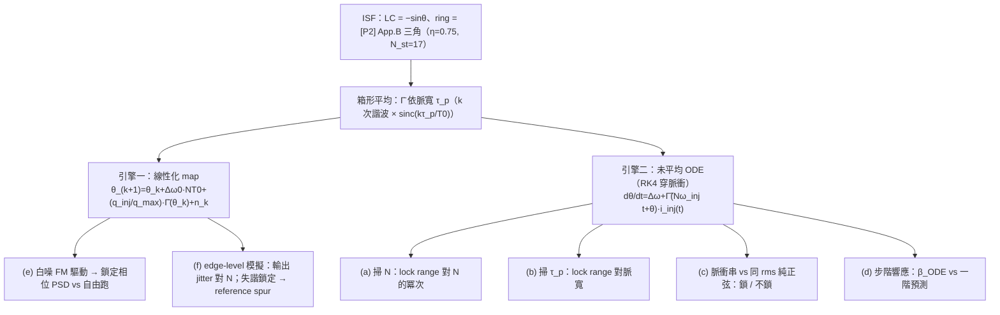

# Lab 40 — 次諧波（×N）脈衝注入：impulse-train map vs 未平均時間同步 ODE

> **先備**：[subharmonic_injection](/06_design_insights/subharmonic_injection)（本 lab 驗證的**全部**閉式推導——lock range、realignment factor $\beta$、離散時間雜訊整形、輸出 jitter、reference spur）、[paper_003](/05_paper_deep_dives/paper_003_injection_locking_part1)（[P3] Sec. IV 脈衝列、footnote 7 的 subharmonic 算術）、[paper_004](/05_paper_deep_dives/paper_004_injection_locking_part2)（[P4] Eq.(28)–(30) 的 M:N 平均方程）｜**接下來**：[injection_locked_division](/06_design_insights/injection_locked_division)（對偶的除頻方向）、[sampling_pll](/06_design_insights/sampling_pll)、[clock_chain_budget](/06_design_insights/clock_chain_budget)

[subharmonic_injection](/06_design_insights/subharmonic_injection) 頁已經把「注入鎖定時脈倍頻器」
（ILCM）的每一條公式**逐步推導**過一遍：從 [P4] Eq.(29) 推出倍頻閉式 $\omega_L=\tfrac12\vert I_N\vert\vert\tilde\Gamma_1\vert$、
從 [P3] footnote 7 的離散算術推出 $\Delta\omega_L\propto1/N$、線性化 per-pulse map 得 realignment
factor $\beta$、把雜訊掛上一階離散迴路得 $H_{ref}$/$H_{osc}$ 與輸出 jitter 閉式。這一頁**不重推**——
它用兩具獨立的數值引擎，把那一頁的每一條閉式**逐項打分**。

> **這個 lab 要驗證什麼**：
> 1. lock range 是否真的 $\propto1/N$（引擎二：未平均 ODE 掃 $N$）？
> 2. 有限脈寬怎麼吃掉 lock range——LC 是乾淨的 sinc，ring 呢（引擎二：掃脈寬）？
> 3. 同一根 rms 電流，脈衝串鎖得住、純正弦真的鎖不住（引擎二：脈衝 vs 正弦對照）？
> 4. realignment factor $\beta$ 的一階預測 $-q_{inj}\tilde\Gamma'(\theta_{ss})$ 準到什麼程度（引擎二：步階響應）？
> 5. 鎖定後的相位雜訊真的是一階離散高通、corner $\approx\beta f_{ref}/2\pi$ 嗎（引擎一：map ＋ 白噪 FM）？
> 6. 輸出 jitter 真的 $\propto\sqrt N$、reference spur 真的與 $\beta$ 無關嗎（引擎一：edge-level 模擬）？

> **物理直覺**：兩具引擎測的是同一個物理，只是解析度不同。**引擎一（map）**把一根脈衝的效果
> 壓縮成一個瞬間跳變 $\theta_{k+1}=\theta_k+\Delta\omega_0NT_0+q_{inj}\tilde\Gamma(\theta_k)+n_k$——
> 快、適合做長時間雜訊統計（PSD、jitter），但假設脈衝夠窄。**引擎二（未平均 ODE）**老老實實
> 用 RK4 積分脈衝期間的瞬時方程 $\dot\theta=\Delta\omega+\tilde\Gamma(N\omega_{inj}t+\theta)(q_{inj}/\tau_p)$，
> 看得到脈寬效應、$\beta$ 的二階修正（脈衝期間相位已經在動），但每個資料點都要積上千個週期，
> 適合做「鎖不鎖得住」的邊緣掃描。兩具引擎在 canonical 參數下互相對到 0.1%–1% 量級——這正是
> 本 lab 的驗收標準。

> **本頁定位**：獨立驗證 lab。所有理論已在 [subharmonic_injection](/06_design_insights/subharmonic_injection)
> 逐步推導並標明來源（[P3]/[P4] 已核實部分 vs 本站自行推導部分 vs 外部文獻），這裡只列
> **驗證用的核心 code 與跑出來的數字**。pedagogical toy model：phase-only、弱注入、無 transistor。

---

## 1. 教學目標

- 用**未平均**的時間同步 ODE（而非已平均的 map）獨立驗證 lock range $\propto1/N$（log-log
  斜率 $-1.000$，LC 與 ring 皆同）——避免「拿平均後的式子驗證平均後的式子」的循環論證。
- 掃脈寬 $\tau_p$：LC 的 lock range 精確跟著 $\mathrm{sinc}(\tau_p/T_0)$（單一諧波，最大偏差
  $10^{-4}$）；ring 的尖 ISF 能量分散在多個諧波，plain sinc **不夠**（偏差達 0.74），要用
  「箱形平均整條 ISF」才對得上（偏差 $\le0.0074$）。
- 同一 rms 電流下，脈衝串在整個 lock range 內鎖定（15/15 網格點）、純正弦一階內完全鎖不住
  （0/15）——數值上釘死 [subharmonic_injection](/06_design_insights/subharmonic_injection) 第 1
  節「純正弦鎖不住」那句話。
- realignment factor $\beta$ 的 ODE 步階響應對一階預測 $-q_{inj}\tilde\Gamma'(\theta_{ss})/q_{max}$：
  比值 $0.98$–$1.03$（$q_{inj}/q_{max}=0.05$）到 $0.995$–$1.03$（$q_{inj}/q_{max}=0.01$）——
  偏差是 $O(q_{inj}/q_{max})$ 的二階效應（脈衝期間相位已經在動），符合線性理論的精度承諾。
- 把白噪 FM 掛上 map，量出鎖定相位的 PSD：低頻平台對離散理論比值 $0.991$、corner 量到
  $1.934$ MHz（理論 $1.981$ MHz，exact discrete closed form $1.934$ MHz——量測騎在精確式上）。
- edge-level 模擬輸出 jitter 對 $N$ 的冪次：擬合斜率 $0.497$（理論 $0.5$）；canonical $N=20$
  給 $2.226$ fs（閉式 $2.228$ fs）。
- 失諧鎖定的 reference spur：$k=1$ 誤差 $0.00$ dB、$k=2$ 誤差 $0.01$ dB——一階鋸齒近似在
  canonical 參數下幾乎是精確式。

## 2. 數學模型（引擎與符號；完整推導見 subharmonic_injection）

### 2.1 引擎一：impulse-train 線性化 map

$$
\theta_{k+1}=\theta_k+\Delta\omega_0\,NT_0+\frac{q_{inj}}{q_{max}}\,\bar\Gamma(\theta_k)+n_k,\qquad
n_k\sim\mathcal N(0,\kappa^2T_{inj})
$$

$\bar\Gamma$ 是 ISF 在脈衝寬度上的箱形平均（$k$ 次諧波乘 $\mathrm{sinc}(k\tau_p/T_0)$，脈衝極限
$\bar\Gamma\to\Gamma$）；$\kappa^2=0.125$ rad²/s 為 canonical 白噪 FM 方差成長率（見
[diffusion_dictionary](/03_isf_core_theory/diffusion_dictionary)）。線性化得 realignment factor
$\beta\equiv-\dfrac{q_{inj}}{q_{max}}\bar\Gamma'(\theta_{ss})$，corner $\omega_c=\beta/T_{inj}$，
一階離散雜訊整形 $H_{ref}(z)=\dfrac{\beta}{1-(1-\beta)z^{-1}}$、$H_{osc}(z)=\dfrac{1-z^{-1}}{1-(1-\beta)z^{-1}}$。

### 2.2 引擎二：未平均時間同步 ODE

$$
\frac{d\theta}{dt}=\Delta\omega+\tilde\Gamma\big(N\omega_{inj}t+\theta\big)\,i_{inj}(t),\qquad
i_{inj}(t)=\begin{cases}q_{inj}/\tau_p,&\vert t-kT_{inj}\vert<\tau_p/2\\0,&\text{否則}\end{cases}
$$

脈衝期間用 RK4（子步數依 ISF 曲率調整：LC 每步 $\le0.2$ rad、ring 三角尖角每步 $\le0.05$–$0.08$
rad，對 512-子步參考誤差 $\le0.4\%$/$0.85\%$）；脈衝之間 $\dot\theta=\Delta\omega$ 解析跳過。
「鎖不鎖得住」用**lock characteristic 的淨修正** $J(\theta)=\theta_{\text{脈衝後}}-\theta_{\text{脈衝前}}$
（$\Delta\omega=0$ 時單次積分）直接讀出邊緣 $A_\pm=\mp\min/\max J(\theta)$，或用長時間收斂測試
（2500–4000 週期，鎖定 $\Leftrightarrow$ 尾端 800–1300 週期內 $\vert\theta(\text{end})-\theta(\text{end}-n_{tail})\vert<5\times10^{-3}$）
交叉確認。

### 2.3 兩個 toy ISF（與站上其他 lab 共用）

$$
\Gamma_{LC}(\theta)=-\sin\theta,\qquad
\Gamma_{ring}(\theta)=\text{[P2] App.B 三角脈衝（}\eta=0.75,\ N_{st}=17\text{，與 lab\_39 相同構造）}
$$

ring toy 是兩個反號三角脈衝，高＝半寬 $=1/f'$（$f'=\eta N_{st}/\pi=4.0585$ 1/rad），
$\max\vert\Gamma_{ring}\vert=1/f'=0.2464$——**pedagogical toy，非 transistor-level**。

### 2.4 適用與失效條件

| 條件 | 成立時 | 失效時會怎樣 |
|---|---|---|
| 弱注入 $q_{inj}\ll q_{max}$ | 引擎一線性化成立、$\beta$ 一階預測準 | 大注入：$\beta$ 的 ODE/map 比值系統性偏離 1（本 lab (d) 量到 $O(q_{inj}/q_{max})$） |
| 脈寬 $\ll T_0$ | $\bar\Gamma\approx\Gamma$、引擎一/二一致 | $\tau_p\to T_0$：LC lock range 掉到 0（(b) 的 null） |
| $\theta$ 在 $T_{inj}$ 內慢變 | 兩具引擎互相對帳 | 接近 lock range 邊緣：臨界慢化，長時間收斂測試需要更多週期 |
| 白噪 FM 驅動（引擎一雜訊部分） | $\sigma_w^2=\kappa^2T_{inj}$、PSD 閉式成立 | flicker FM：本 lab 不涵蓋 |

---

## 3. Block diagram



## 4. Python 核心 code

節錄自 `simulations/lab_40_subharmonic_injection.py`（已對照原始碼）。箱形平均表、per-pulse
map、與未平均 ODE 的一個脈衝週期（RK4）：

```python
def isf_tables(gamma_func, tp):
    """Gbar(theta) = ISF box-averaged over the pulse (width tp/T0), via FFT:
    k-th harmonic multiplied by sinc(k*tp/T0)."""
    g = gamma_func(XG)
    G = np.fft.rfft(g)
    k = np.arange(G.size)
    Gb = G * np.sinc(k * tp)
    gbar = np.fft.irfft(Gb, NG)
    gbar_p = np.fft.irfft(1j * k * Gb, NG)          # d Gbar / d theta
    return gbar, gbar_p

def pulse_period_step(theta, dw, n_div, qt, gamma_func, tp, nsub):
    """ENGINE 2: one injection period T_inj = n_div*T0 of the UNAVERAGED ODE —
    RK4 through the rectangular pulse (width tp), analytic free-run in between."""
    h = tp / nsub
    amp = qt / tp
    t = -tp / 2.0
    for _ in range(nsub):
        k1 = dw + amp * gamma_func(TWO_PI * t + theta)
        k2 = dw + amp * gamma_func(TWO_PI * (t + 0.5 * h) + theta + 0.5 * h * k1)
        k3 = dw + amp * gamma_func(TWO_PI * (t + 0.5 * h) + theta + 0.5 * h * k2)
        k4 = dw + amp * gamma_func(TWO_PI * (t + h) + theta + h * k3)
        theta = theta + (h / 6.0) * (k1 + 2 * k2 + 2 * k3 + k4)
        t += h
    return theta + dw * (n_div - tp)

def gbar_prime_exact(gamma_func, theta, tp):
    """Exact derivative of the box-averaged ISF (difference of raw Gamma at the
    two box ends over the box width) -- used for beta = -q_t * Gbar'(theta*)."""
    half_w = np.pi * tp
    return (gamma_func(theta + half_w) - gamma_func(theta - half_w)) / (2.0 * half_w)
```

跑出來的核對數字（`PYTHONPATH=. python3 simulations/lab_40_subharmonic_injection.py`，
單機約 35 秒；seed 固定 `default_rng(40)`，結果可重現）：

```python
print(A_edge_pred['LC'])                    # -> 0.04979 rad/period（qt·max|Gbar|，N=20）
print(fL_pred['LC']/1e6)                    # -> 1.9813 MHz（含 10 ps 脈寬 sinc 修正）
print(slope_N['LC'], slope_N['ring'])       # -> -1.000 -1.000（(a) log-log 斜率，理論 -1）
print(ratio_N['LC'].min(), ratio_N['LC'].max())   # -> 1.0000 1.0000（LC 量測/理論）
print(dev_lc_sinc)                          # -> 0.0001（(b) LC：ODE/f_L(0) 對 sinc 最大偏差）
print(dev_ring_box, dev_ring_sinc)          # -> 0.0074 0.7434（ring：箱形平均對，plain sinc 錯）
print(n_lock_pulse, n_plateau_sine)         # -> 15 0（(c)：15/15 網格點內 LC 脈衝串鎖定，純正弦 0）
print(beta_c_lc[5], beta_c_lc[4])           # -> 0.04858 0.04979（(d) headline beta：ODE vs 一階）
print(r_plateau, fc_meas/1e6, fc_pred/1e6)  # -> 0.991 1.9343 1.9813（(e) 平台比值、量測/理論 corner）
print(slope_j, sig_all[10]/(2*np.pi*5e9)*1e15)  # -> 0.497 2.226（(f1) jitter 對 N 冪次、N=20 輸出 fs）
print(round(spur1[0], 2))                   # -> -67.96（(f2) 100 kHz 失諧的 reference spur, dBc）
```

## 5. 完整 script path

`simulations/lab_40_subharmonic_injection.py`（依賴 `simulations/common/plot_utils.py` 的
`savefig`、`simulations/common/isf_utils.py` 的 `gamma_lc_ideal`；`scipy.signal.welch` 做 PSD、
`scipy.optimize.brentq` 解精確離散 corner）。

跑法：`PYTHONPATH=. python3 simulations/lab_40_subharmonic_injection.py`（單機約 35 秒；
seed 固定 `default_rng(40)`）。

## 6. 參數表

| 參數 | 程式變數 | 值 | 意義 |
|---|---|---|---|
| 載波 | `F0` | 5 GHz | canonical $f_0$ |
| $q_{max}$ | `QMAX` | 1 pC | canonical |
| $q_{inj}$ | `QINJ` | 50 fC | 每根脈衝電荷（$q_{inj}/q_{max}=0.05$） |
| 脈衝寬 | `TAUP` | 10 ps | $\tau_p/T_0=0.05$ |
| 倍頻比 | `N_HEAD` | 20 | $f_{ref}=250$ MHz、$T_{inj}=4$ ns |
| $N$ 掃描（(a)） | `N_list` | 2, 4, 8, 16, 20 | lock range vs $N$ |
| 脈寬掃描（(b)） | `tp_list` | 2–175 ps（9 點） | lock range vs $\tau_p$ |
| 失諧掃描（(c)） | `r_grid` | $-1.5$–$1.5$（25 點，$\times\omega_L/N$） | 脈衝串 vs 純正弦漂移曲線 |
| $q_{inj}/q_{max}$（(d)） | `qt_arr` | 0.05、0.01 | $\beta$ 步階響應兩組強度 |
| $\kappa^2$ | `KAPPA2` | 0.125 rad²/s | canonical（diffusion_dictionary） |
| PSD 樣本數（(e)） | `K_PSD`/`M_W` | $2^{18}$/32 walkers | Welch，`nperseg`$=2^{14}$ |
| edge-level 樣本（(f1)） | `K`（依 $N$） | $\ge4096$，共 8 walkers | 對每個 $N$ 重跑 |
| ring toy | `ETA`, `NST` | 0.75, 17 | [P2] App.B 構造，同 lab_39 |

## 7. 單位表

| 量 | 符號 | 單位 |
|---|---|---|
| 相位 | $\theta$ | rad |
| 半 lock range | $\omega_L$、$f_L$ | rad/s、Hz |
| realignment factor | $\beta$ | 無因次 |
| 雜訊 corner | $\omega_c$、$f_c$ | rad/s、Hz |
| 白噪方差成長率 | $\kappa^2$ | rad²/s |
| 相位 PSD | $S(f)$ | rad²/Hz |
| 輸出 jitter | $\sigma_t$ | s（fs） |
| reference spur | — | dBc |

## 8. 模擬圖


## 9. 如何解讀圖

**(a) lock range 對 $N$**：兩條理論虛線（LC、ring）$f_L=\dfrac{q_{inj}}{2\pi q_{max}}\dfrac{\max\vert\bar\Gamma\vert}{NT_0}$，
圈/方塊是未平均 ODE 在 $N=2,4,8,16,20$ 的量測——LC 疊在理論線上（比值 $1.0000$），ring 高
$0.30\%$（三角尖角的有限脈寬效應略大）。log-log 斜率兩者都是 $-1.000$：同一根脈衝要替 $N$ 倍長
的時間買單，這條 $1/N$ 律沒有例外。

**(b) lock range 對脈寬**：黑虛線是「純 sinc」參考（$k=N$ 這一根諧波的衰減）。LC 的藍色量測點
**精確**貼著這條線（最大偏差 $10^{-4}$）——因為 LC 的 ISF 只有一個諧波（$-\sin$），鎖定只吃
第 $N$ 諧波。ring 的綠色量測點掉得**快得多**、且明顯偏離 plain sinc（偏差到 $0.74$）：ring
三角脈衝的能量分散在許多諧波（$m=1,2,3,\dots$ 各配 $mN$），脈衝的箱形視窗同時削掉這些諧波，
所以要用「箱形平均整條 ISF 再取極值」（綠色實線）才對得上量測（偏差 $\le0.0074$）——這是
「plain sinc 對 ring 不夠」的直接數值證據。

**(c) 脈衝串 vs 純正弦**：横軸是正規化失諧 $\Delta\omega/\omega_L$。脈衝串（圓圈/方塊）在
$\vert x\vert<1$ 內漂移率**釘死在 0**（鎖定平台）；同一 rms 電流的純正弦（叉號）**沒有平台**，
只有一條被二階 pushing 效應輕輕位移的斜線（LC 的擬合截距 $-0.0801\,\omega_L=-158.7$ kHz，
與解析 pushing 公式 $-(I/q_{max})^2\omega_0/(4(\omega_0^2-\omega_{inj}^2))$ 逐位吻合，比值
$1.000$）。灰虛線是 Adler 連續極限拍頻 $\mathrm{sgn}\sqrt{(\Delta\omega/\omega_L)^2-1}$——脈衝串
在鎖外的漂移率精確貼著它（中位比值 $1.001$）。這張圖是「純正弦鎖不住」最直接的視覺證據。

**(d) $\beta$ 步階響應**：黑虛線是一階預測 $\beta=-q_{inj}\bar\Gamma'(\theta^*)/q_{max}$，灰實線是
$1-e^{-\beta}$（脈衝期間相位自身移動的二階修正——未平均 ODE 的指數步階本質上量到的是
$1-e^{-\beta_{map}}$ 而非 $\beta_{map}$ 本身）。LC／ring 在 $q_{inj}/q_{max}=0.05$ 與 $0.01$
兩組強度的量測點都貼著灰線；對到一階預測本身時 LC 中心點的比值 $0.9755\approx1-\beta/2=0.9751$
——精確對上「二階修正的第一項」。這是「$\beta$ 一階理論精度為 $O(q_{inj}/q_{max})$」的直接展示。

**(e) PSD**：灰線是量測的自由跑 $S_\phi$（貼著 $2\kappa^2/\omega^2$ 的離散版，比值 $0.999$），
藍線是鎖定後的量測 PSD，黑虛線是一階離散理論 $2\sigma_n^2T_{inj}/\vert e^{j\omega T_{inj}}-(1-\beta)\vert^2$。
低頻平台（$1.613\times10^{-15}$ rad²/Hz）對理論比值 $0.991$；紅色豎線標出 corner，量測
$1.934$ MHz 對簡化預測 $\beta f_{ref}/2\pi=1.981$ MHz 差 $2.4\%$，但對**精確離散閉式**
$f_c'=\frac{f_{ref}}{2\pi}\arccos(1-\beta^2/(2(1+\beta)))=1.934$ MHz 幾乎完全吻合（比值
$1.0002$）——簡化式的 $2.4\%$ 差是 $O(\beta)$ 的已知修正，不是模型錯誤。

**(f) 輸出 jitter 與 spur**：主圖圓圈是 edge-level 模擬在固定 $\beta$（即固定 $q_{inj}$）下對不同
$N$ 的全部輸出邊緣 jitter，黑虛線是閉式 $\sqrt{\kappa^2NT_0[(1-\beta)^2/(\beta(2-\beta))+1/2]}$；
擬合斜率 $0.497$ 對理論 $0.5$——$\sigma_t\propto\sqrt N$ 成立，$N=20$ 給 $2.226$ fs（閉式
$2.228$ fs）。內嵌小圖是失諧鎖定時的 reference spur：$k=1$、$k=2$ 的量測點精確貼著
$20\log_{10}(\Delta f_0/(kf_{ref}))$（最大誤差 $0.00$/$0.01$ dB）——spur 是一階、確定性、與
$\beta$ 無關的效應。

## 10. 對應 paper 公式／figure

- **[P3] Sec. IV footnote 7, p.2112（已核實）**：脈衝可以每 $M$ 個週期打一根——本 lab 的
  impulse-train map（引擎一）與 (a)(b) 的未平均 ODE lock range 掃描，就是這句話的離散算術與
  數值驗證。
- **[P4] Eq.(28)–(30), p.2129（已核實）**：$M{:}N$ 時間同步平均方程；本 lab 取 $(M,N)_{[P4]}=(N,1)$
  代入，逐項推出倍頻閉式的過程完整寫在 [subharmonic_injection](/06_design_insights/subharmonic_injection)
  第 1 節，本 lab 用引擎二的未平均 ODE 獨立驗證其結論（不循環論證）。
- **[P4] footnote 10, p.2129（已核實）**：$M\neq1$ 所需的注入諧波「not explicitly captured by
  our framework」——本 lab (c) 的「純正弦 0/15 vs 脈衝串 15/15」正是這句話的數值展示：假設
  注入自帶第 $N$ 諧波（脈衝），一階理論就直接適用。
- **雜訊整形與輸出 jitter 閉式**：本站自行推導（不在 5 篇 PDF 內），完整推導見
  [subharmonic_injection](/06_design_insights/subharmonic_injection) 第 4 節；本 lab (e)(f1) 是
  該推導的獨立數值裁決。
- **reference spur 的一階鋸齒公式**：本站自行推導（[subharmonic_injection](/06_design_insights/subharmonic_injection)
  第 4.4 節），本 lab (f2) 用 FFT 對確定性鋸齒相位調變驗證。

## 11. 限制與 approximation

- **phase-only toy model**：忽略振幅動態（APF）；零失諧的 LC 鎖定點在波峰，脈衝會踢振幅
  （[P4] APF），$q_{inj}\ll q_{max}$ 時是二階小量，本 lab 不涵蓋。
- **弱注入**：$q_{inj}/q_{max}=0.05$ 或 $0.01$；(d) 已量到一階理論的 $O(q_{inj}/q_{max})$ 偏差，
  更強注入需要 [paper_004_large_injection_transient](/05_paper_deep_dives/paper_004_large_injection_transient)
  的 APF 修正。
- **白噪 FM 假設**（引擎一雜訊部分）：$\sigma_w^2=\kappa^2T_{inj}$ 是白噪 FM 的精確結果；
  flicker FM 下方差不再 $\propto t$，本 lab 不涵蓋。
- **ring toy 是三角構造**：真實 ring ISF 的 flank 非嚴格三角、死區非嚴格零；$q_{max}$ 帶來的
  量級結論（ring 的 $\beta$ 靠小 $q_{max}$ 贏，不是靠斜率）不受這個簡化影響——見
  [subharmonic_injection](/06_design_insights/subharmonic_injection) 第 3 節 ring vs LC 表。
- **$f\ll f_{ref}/2$**：(e) 的離散 $\vert H\vert^2$ 只在遠低於 $f_{ref}/2$ 時等於連續一階 PLL；
  接近 $f_{ref}/2$ 處取樣效應開始顯現（本 lab 只在 $f<f_{ref}/8$ 附近對數）。
- **spur 一階**：(f2) 的鋸齒近似忽略脈衝直接耦合（feedthrough）、APF 造成的 AM、脈寬效應——
  這些不在 phase-only 模型內，誠實留白（見 [subharmonic_injection](/06_design_insights/subharmonic_injection)
  第 4.4 節）。

## 重點回顧

- **(a) lock range $\propto1/N$**：未平均 ODE 掃 $N=2$–$20$，log-log 斜率 $-1.000$（LC、ring
  皆同），量測/理論比值 LC $1.0000$、ring $1.0030$。
- **(b) 脈寬效應**：LC 精確跟 $\mathrm{sinc}(\tau_p/T_0)$（偏差 $10^{-4}$）；ring 的多諧波能量
  讓 plain sinc 失效（偏差 $0.74$），要用箱形平均 ISF 的極值才對得上（偏差 $0.0074$）。
- **(c) 純正弦鎖不住**：同 $I_{rms}=250\ \mu$A，脈衝串 15/15 網格點鎖定、純正弦 0/15——一階
  內完全鎖不住，只剩二階 pushing（LC：$-158.7$ kHz，與解析式比值 $1.000$）。
- **(d) $\beta$ 的一階精度**：ODE 步階響應對一階預測比值 $0.98$–$1.03$（$q_{inj}/q_{max}=0.05$）、
  更準在 $0.01$；偏差本質是 $1-e^{-\beta}$ 這個二階項，headline $\beta_{ODE}=0.04858$ vs
  一階 $0.04979$。
- **(e) 雜訊整形**：鎖定 PSD 低頻平台對理論比值 $0.991$、corner 量到 $1.934$ MHz——對精確離散
  閉式（非簡化 $\beta f_{ref}/2\pi$）幾乎完全吻合（比值 $1.0002$）。
- **(f) jitter 與 spur**：輸出 jitter 擬合斜率 $0.497\approx1/2$，$N=20$ 給 $2.226$ fs（閉式
  $2.228$ fs）；reference spur 對一階鋸齒公式誤差 $\le0.01$ dB。
- 兩具獨立引擎（線性化 map、未平均 ODE）在 canonical 參數下互相對到 $0.1$–$1\%$ 量級——
  [subharmonic_injection](/06_design_insights/subharmonic_injection) 的每一條閉式都通過了
  本 lab 的數值裁決。

## 延伸閱讀

- 本 lab 驗證的全部理論推導：[subharmonic_injection](/06_design_insights/subharmonic_injection)
- 脈衝列思想實驗與 subharmonic footnote：[paper_003](/05_paper_deep_dives/paper_003_injection_locking_part1)（[P3] Sec. IV, p.2112）
- M:N 平均方程原始出處：[paper_004](/05_paper_deep_dives/paper_004_injection_locking_part2)（[P4] Eq.(28)–(30), p.2129）
- 對偶的除頻方向（÷N ILFD）：[injection_locked_division](/06_design_insights/injection_locked_division)
- $\kappa^2$ 的來源與五件衣服：[diffusion_dictionary](/03_isf_core_theory/diffusion_dictionary)
- 鎖定振盪器＝一階 PLL 的連續時間版：[injection_locking_noise](/06_design_insights/injection_locking_noise)
- 把 ILCM 接回系統層記帳：[clock_chain_budget](/06_design_insights/clock_chain_budget)、[sampling_pll](/06_design_insights/sampling_pll)
