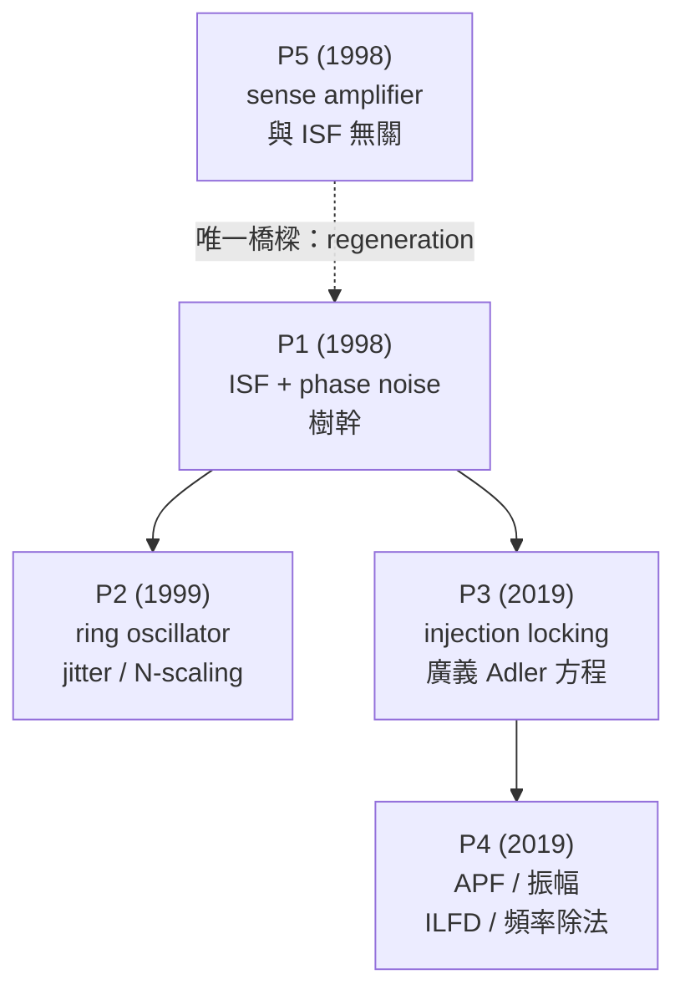

# 逐篇精讀導覽 Paper Deep Dives

> **先備知識（建議先讀）**：核心觀念的逐步推導在 [03_isf_core_theory](/03_isf_core_theory/isf_definition)（從 [isf_definition](/03_isf_core_theory/isf_definition) 開始）；基礎幾何與訊號背景在 [02_foundations](/02_foundations/oscillator_phase)。這個資料夾是「站在論文高度」回看，先有核心觀念再讀會更順。

這個資料夾把 5 篇來源 PDF **逐篇精讀**：每頁照同一個模板（Citation → 一句話貢獻 →
為何重要 → 主要假設 → key equations 逐步推導 → key figures → design insights →
limitations → 與其他 paper 關係 → what to remember）。核心理論的細節推導在
[03_isf_core_theory](/03_isf_core_theory/isf_definition)，這裡則是「站在論文的高度」回看。

> **怎麼用這個資料夾**：先讀 [P1] 那頁——它是整個課程的地基，其他四頁都建立在它之上。
> 想動手算就回 [simulation labs](/04_simulation_labs/numerical_feeling)；想看一條公式
> 屬於哪篇、在哪頁推導，查 [equation_index](/01_paper_map/equation_index)。

## 五篇論文一覽

| # | 論文 | 年 | 與 ISF 的關係 | 難度 | 精讀頁 |
|---|---|---|---|---|---|
| **[P1]** | A General Theory of Phase Noise in Electrical Oscillators | 1998 | **ISF 核心基礎**（定義、推導、設計法則） | 核心 | [paper_001](/05_paper_deep_dives/paper_001_general_theory_phase_noise) |
| **[P2]** | Jitter and Phase Noise in Ring Oscillators | 1999 | ISF 套到 ring：jitter、$N$-scaling、symmetry | 核心延伸 | [paper_002](/05_paper_deep_dives/paper_002_jitter_phase_noise_ring) |
| **[P3]** | Injection Locking & Pulling—Part I（time-synchronous） | 2019 | 同一個 ISF 推出**廣義 Adler 方程**、lock range | 進階 | [paper_003](/05_paper_deep_dives/paper_003_injection_locking_part1) |
| **[P4]** | Injection Locking & Pulling—Part II（APF / 頻率除法） | 2019 | 引入 **APF**（振幅版 ISF）、ILFD | 進階 | [paper_004](/05_paper_deep_dives/paper_004_injection_locking_part2) |
| **[P5]** | Design Issues in Cross-Coupled Inverter Sense Amplifier | 1998 | **與 ISF／phase noise 無關**（見下） | 邊角 | [paper_005](/05_paper_deep_dives/paper_005_cross_coupled_sense_amp) |

## 標準引用字串（請逐字使用）

- **[P1]** A. Hajimiri and T. H. Lee, *"A General Theory of Phase Noise in Electrical
  Oscillators,"* IEEE J. Solid-State Circuits, vol. 33, no. 2, pp. 179–194, Feb. 1998.
- **[P2]** A. Hajimiri, S. Limotyrakis, and T. H. Lee, *"Jitter and Phase Noise in Ring
  Oscillators,"* IEEE J. Solid-State Circuits, vol. 34, no. 6, pp. 790–804, Jun. 1999.
- **[P3]** B. Hong and A. Hajimiri, *"A General Theory of Injection Locking and Pulling in
  Electrical Oscillators—Part I: Time-Synchronous Modeling and Injection Waveform Design,"*
  IEEE J. Solid-State Circuits, vol. 54, no. 8, pp. 2109–2121, Aug. 2019.
- **[P4]** B. Hong and A. Hajimiri, *"...Part II: Amplitude Modulation in LC Oscillators,
  Transient Behavior, and Frequency Division,"* IEEE JSSC, vol. 54, no. 8, pp. 2122–2139,
  Aug. 2019.
- **[P5]** A. Hajimiri and R. Heald, *"Design Issues in Cross-Coupled Inverter Sense
  Amplifier,"* Proc. IEEE ISCAS, 1998.

## 它們在課程中的角色

把這四篇相關論文想成「一棵樹」：[P1] 是樹幹（ISF 與 phase noise），[P2] 是把樹幹
套到 ring oscillator 的一支主枝，[P3]/[P4] 則是 2019 年 Hong–Hajimiri 把**同一個
ISF**從「自由振盪的 phase noise」延伸到「被外部訊號注入時的 locking／pulling」的兩支
新枝。一條主線貫穿全部：

> **「振盪器對任何擾動的相位反應 = ISF $\Gamma(\omega_0\tau)$ 加權後再積分。」**

phase noise（[P1][P2]）把擾動換成隨機 noise 電流；injection locking（[P3][P4]）把擾動換成
一個**確定的、週期性的注入電流**。數學骨架一樣，只是輸入不同。

## 建議閱讀順序

1. **先讀 [P1]**（[paper_001](/05_paper_deep_dives/paper_001_general_theory_phase_noise)）。
   它定義 ISF、推出 1/f²（Eq.(21)）與 1/f³（Eq.(23)–(24)）phase noise、給出三條設計法則
   （拉大 $q_{max}$、壓小 $\Gamma_{rms}$、靠 symmetry 壓 $c_0$）。沒讀懂它，後面都讀不動。
2. **再讀 [P2]**（[paper_002](/05_paper_deep_dives/paper_002_jitter_phase_noise_ring)）。
   把 [P1] 套到 ring：accumulated jitter $\sigma_{\Delta t}=\kappa\sqrt{\Delta t}$、
   $\Gamma_{rms}\propto N^{-3/4}$、以及「固定功率與頻率下 ring phase noise 幾乎與 $N$ 無關」
   的結論（已核實）。
3. **想懂 injection 再讀 [P3]→[P4]**。[P3] 是 phase-only 的廣義 Adler 方程；[P4] 補上振幅
   （APF）與 frequency division。這兩篇是**進階**，公式多處標 `TODO` 待對照原文。
4. **[P5] 最後、且只當趣聞**。見下。

## 誠實聲明：[P5] 與 ISF 無關

來源資料夾共 5 個 PDF，但其中 **`Hajimiri_ISCS_98.pdf`（[P5]）並不是 oscillator
phase noise／ISF 論文**，而是一篇談 **cross-coupled inverter sense amplifier
（交叉耦合反相器感測放大器）** 設計的 ISCAS 1998 短文（4 頁）。它討論的是
regeneration（再生）速度、mismatch（元件失配）造成的 offset（失調電壓）、以及一個
offset 的 figure of merit——**完全不在** ISF／phase noise／jitter 的範圍內。

它會出現在這份清單，純粹因為它**在來源資料夾裡、且共用作者 Hajimiri**。我們不假裝它與
ISF 有關。它與本課程**唯一**的概念橋樑是：sense amp 的核心是 cross-coupled pair 的
**正回授／regeneration**，而這個正回授機制也正是 latch-based 與 LC 振盪器能「自己起振、
維持極限環」的基礎。除此之外，請把 [P5] 當邊角註解。詳見
[paper_005](/05_paper_deep_dives/paper_005_cross_coupled_sense_amp)（claim C12）。

## 不在這 5 篇 PDF 內的外部文獻（標準補充）

ISF 的嚴謹數學地基——**PPV（perturbation projection vector，擾動投影向量）／adjoint
method（伴隨法）／Floquet theory（Floquet 理論）**——來自更廣的文獻（如
Demir–Mehrotra–Roychowdhury 2000、Kaertner），**不在下載的 5 篇 PDF 內**，本站以標準
文獻補充並明確標示為外部，見 [effective_isf](/03_isf_core_theory/effective_isf)（claim C13）。

## 延伸閱讀 / 對應教學頁

每篇 deep-dive 都在頁尾列出它對應的核心理論／lab／設計頁。這裡先給一張**輕量總表**，讓你從論文直接跳到「動手推導」的那一頁：

| 論文 | 精讀頁 | 主要對應教學頁 |
|---|---|---|
| **[P1]** | [paper_001](/05_paper_deep_dives/paper_001_general_theory_phase_noise) | [isf_definition](/03_isf_core_theory/isf_definition)、[convolution_derivation](/03_isf_core_theory/convolution_derivation)、[white_noise_to_phase_noise](/03_isf_core_theory/white_noise_to_phase_noise)、[flicker_noise_upconversion](/03_isf_core_theory/flicker_noise_upconversion)、[symmetry](/06_design_insights/symmetry) |
| **[P2]** | [paper_002](/05_paper_deep_dives/paper_002_jitter_phase_noise_ring) | [lc_vs_ring](/06_design_insights/lc_vs_ring)、[lab_03_ring_oscillator_toy_model](/04_simulation_labs/lab_03_ring_oscillator_toy_model)、[symmetry](/06_design_insights/symmetry) |
| **[P3]** | [paper_003](/05_paper_deep_dives/paper_003_injection_locking_part1) | [quadrature_and_coupled_oscillators](/06_design_insights/quadrature_and_coupled_oscillators)（進階；injection locking） |
| **[P4]** | [paper_004](/05_paper_deep_dives/paper_004_injection_locking_part2) | [effective_isf](/03_isf_core_theory/effective_isf)、[lab_14_cyclostationary_isf](/04_simulation_labs/lab_14_cyclostationary_isf)、[quadrature_and_coupled_oscillators](/06_design_insights/quadrature_and_coupled_oscillators) |
| **[P5]** | [paper_005](/05_paper_deep_dives/paper_005_cross_coupled_sense_amp) | **無 ISF 對應頁**；唯一橋樑是 regeneration／正回授（見該頁） |

> **怎麼用這張表**：想「把論文裡的某條公式推到底」就點對應教學頁；想「看論文整體故事」就留在 deep-dive。動手算的 lab 全在 [04_simulation_labs](/04_simulation_labs/numerical_feeling)，設計法則整理在 [06_design_insights](/06_design_insights/lc_vs_ring)。

## 重點回顧

- 四篇相關論文一條主線：**相位反應 = ISF 加權後積分**；phase noise 與 injection 只是輸入不同。
- 閱讀順序：[P1] → [P2] →（進階）[P3] → [P4]；[P5] 只當趣聞。
- [P5] 是 sense amplifier 論文，**與 ISF 無關**，唯一橋樑是 regeneration／正回授。
- PPV／adjoint／Floquet 是 ISF 的嚴謹地基，但**不在這 5 篇 PDF**，屬外部文獻。
