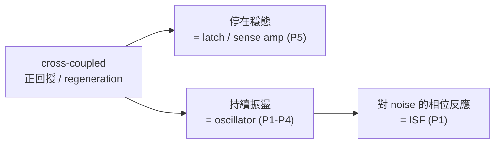

# Design Issues in Cross-Coupled Inverter Sense Amplifier

> **先備知識（建議先讀）**：本頁**不是** ISF 的先修。它與本課程的唯一連結是 cross-coupled pair 的 **regeneration／正回授**；要看這個機制怎麼變成「振盪器起振」，先讀 [oscillator_phase](/02_foundations/oscillator_phase)（limit cycle 起振）與 [tank_Q_and_energy_restoration](/02_foundations/tank_Q_and_energy_restoration)（負電阻補損耗）。想學 ISF 本體請直接回 [paper_001](/05_paper_deep_dives/paper_001_general_theory_phase_noise)。

**先把話講清楚：這篇與 ISF／phase noise／jitter 完全無關。** 它是一篇談 **cross-coupled
inverter sense amplifier（交叉耦合反相器感測放大器）** 設計的 ISCAS 1998 短文（4 頁），主題是
regeneration（再生）速度、mismatch（元件失配）造成的 offset（失調電壓）、以及一個 offset 的
figure of merit。它會出現在這份清單，純粹因為它**在來源資料夾裡、且共用作者 Hajimiri**。本頁
誠實標註這個 mismatch（claim C12），並只提供**一個概念橋樑**。

> **為什麼還是寫一頁**：作者規範第 9 節要求「[P5] 一律誠實說明它是 sense amplifier 論文、與
> ISF 無關」。我們不假裝它跟 ISF 有關，也不硬湊公式；只把它的真實內容講清楚，並指出它與本課程
> **唯一**的合理連結。

## Citation

> **[P5]** A. Hajimiri and R. Heald, *"Design Issues in Cross-Coupled Inverter Sense
> Amplifier,"* Proc. IEEE International Symposium on Circuits and Systems (ISCAS), 1998.
> （檔案 `Hajimiri_ISCS_98.pdf`，paper_005，4 頁）

## One-sentence contribution

對 CMOS cross-coupled-inverter sense amplifier 做解析設計：分析 equilibrating（平衡）電晶體與
tail current source（尾電流源）對 sensing 速度的影響、mismatch 造成的 offset，並提出一個 offset
的 figure of merit——**與振盪器 phase noise／ISF 無關**（claim C12）。

## Why this paper matters（對本課程而言：基本上不重要）

對 **ISF 課程**而言，這篇的重要性≈**零**。它解決的是記憶體與資料路徑裡的問題：sense amplifier
要在 bitline（位元線）上極小的電壓差出現時，**快速、可靠地**把它放大成滿擺幅的數位 0/1。它在意
的是：

- **regeneration 速度**：cross-coupled pair 靠正回授，從 metastable（亞穩）點指數式拉開兩個
  節點電壓——拉得越快，sensing 越快。
- **offset（失調）**：兩邊電晶體不可能完全一樣（mismatch），這個不對稱會讓 sense amp 在輸入差
  為 0 時也偏向一邊，造成讀取錯誤。論文分析各種 mismatch 來源並給 figure of merit。
- equilibrating device 與 tail current source 的**漸進開關**如何劣化上述性能。

這些都是 digital/memory circuit 的議題，**沒有** limit cycle、沒有 excess phase、沒有 ISF、
沒有 phase noise spectrum。

## Main assumptions

照 paper_metadata（paper_005.assumptions）：

- 圍繞 metastable（亞穩）點的小訊號 regeneration 分析；基於 mismatch 的 offset 模型。
- （論文自述）電流已流經電晶體夠久、equilibrating device 可當理想開關——這兩個簡化假設在後續
  各節被逐一挑戰。

## Key equations（不轉錄；非本課程範圍）

照 paper_metadata（paper_005.important_equations）：本論文的方程式（regeneration 時間常數、
offset 電壓式）**不在 ISF 課程範圍內，故不逐字轉錄**。

> ⚠️ **TODO**：equations not transcribed because this PDF is unrelated to ISF/phase noise.

不過，為了把**唯一的概念橋樑**講清楚，這裡只點出它的核心機制（regeneration），用一個最簡化的
小訊號模型說明「正回授如何指數放大」——這個機制同時也是振盪器能起振的根本：

**Cross-coupled pair 的 regeneration（簡化小訊號）**：兩個互相回授的反相器，差動電壓
$v_d=v_1-v_2$ 在亞穩點附近滿足

$$
C\frac{dv_d}{dt}=(G_m-G_0)\,v_d\quad\Rightarrow\quad v_d(t)=v_d(0)\,e^{\,t/\tau_{regen}},\quad \tau_{regen}=\frac{C}{G_m-G_0}.
$$

- **Meaning**：只要等效跨導 $G_m$ 超過節點泄漏電導 $G_0$，差動電壓就**指數成長**（正回授），把
  微小輸入差迅速放大成滿擺幅——這就是 regeneration。$\tau_{regen}$ 越小，sensing 越快。
- **Dimension check**：$[\text{F}]/[\text{S}]=[\text{C/V}]/[\text{A/V}]=[\text{C/A}]=[\text{s}]$ ✓。
- 這條來自論文 Sec. 2 的 cross-coupled pair 微分方程對（$dv_1/dt$、$dv_2/dt$）化簡；**這是我們
  為了講橋樑而寫的最簡形式，論文的完整式（含 equilibrating／tail 效應）更複雜，且不在本課程範圍**。

## Key figures

論文有 sense amp 電路圖與小訊號等效圖（Fig. 1 等），但**與 ISF 課程無關，本站不引用、不重畫**
（paper_metadata：important_figures 為空）。

## Design insights（對 sense amp，不對 ISF）

- 在 regenerative 節點，**設計目標是最小化時間常數 $\tau_{regen}$**，而不是一味放大初始電壓差
  （論文明確點出這個取捨）。
- 完整的 offset 分析必須同時考慮 cell 與 bitline 結構，不能只看 cross-coupled pair 本身。
- equilibrating device 與 tail current source 的漸進開關會顯著劣化速度與 offset，需納入分析。

這些對 SRAM／sense amp 設計者很有用，但**對 ISF／phase noise 沒有可遷移的設計法則**。

## Limitations（對本課程而言）

照 paper_metadata（paper_005.limitations）：

- **完全在 ISF／phase noise／jitter 範圍之外。** 本站把它當邊角 deep-dive，誠實說明 mislabeled，
  只提供「regeneration → oscillation」這個概念橋樑。

## Relationship to other papers（唯一的橋樑）

[P5] 與 [P1]–[P4] **沒有理論上的延續關係**。唯一合理的連結是一個**機制**：

> **cross-coupled pair 的 regeneration（正回授）也是 latch-based 與 LC 振盪器能「自己起振、
> 維持極限環」的基礎。**

- 在 **sense amp**：正回授把微小輸入差**一次性**放大到滿擺幅，然後停在某個穩態（latch 鎖住）。
- 在 **振盪器**：同樣的負電阻／正回授提供能量補償 tank 的損耗，讓振盪**持續**而不衰減——這正是
  存在穩定 limit cycle（[P1] 假設 2）的物理來源。差動 LC-VCO 的 $-G_m$ 對、latch-based ring 的
  cross-coupled 級，起振機制與這篇的 cross-coupled pair 同源。

所以你可以這樣記：**同一個 cross-coupled 正回授，停下來就是 latch/sense amp，停不下來（持續
振盪）就是 oscillator。** 但一旦進到「振盪器對 noise 的相位反應」，就是 ISF 的地盤，與本篇無關。

詳細的 oscillator 起振與 limit cycle 幾何見
[oscillator_phase](/02_foundations/oscillator_phase)；ISF 本體見
[paper_001](/05_paper_deep_dives/paper_001_general_theory_phase_noise)。

## 延伸閱讀 / 對應教學頁

[P5] 與 ISF 無關，所以這裡**只有一個橋樑**，不假裝有更多：

| 本頁的哪一塊 | 對應教學頁 | 為什麼是這個連結 |
|---|---|---|
| cross-coupled pair 的 regeneration／正回授（唯一橋樑） | [paper_001](/05_paper_deep_dives/paper_001_general_theory_phase_noise) 與 [逐篇精讀導覽](/05_paper_deep_dives) | 同一個正回授「停下來＝latch／sense amp，停不下來＝oscillator」；振盪器的 limit cycle 起振由它而來，ISF 才接著上場（claim C12） |

> **誠實聲明**：本頁不連向任何 ISF 核心理論頁或設計頁，因為[P5] 不在 ISF／phase noise 的範圍內（見上方 mismatch 說明）。要學 ISF，請回 [paper_001](/05_paper_deep_dives/paper_001_general_theory_phase_noise)；五篇論文的角色全圖見 [逐篇精讀導覽](/05_paper_deep_dives)。

## What to remember

- **[P5] 是 sense amplifier 論文，與 ISF／phase noise／jitter 無關**（claim C12）——別把它當
  ISF 文獻引用。
- 它在清單裡只因為**在來源資料夾、且共用作者**；本站誠實標註 mislabeled。
- **唯一概念橋樑**：cross-coupled pair 的 regeneration／正回授，也是 latch 與 LC 振盪器起振的
  基礎（停下來＝latch，停不下來＝oscillator）。
- 想學 ISF，請回 [P1]（[paper_001](/05_paper_deep_dives/paper_001_general_theory_phase_noise)）。
