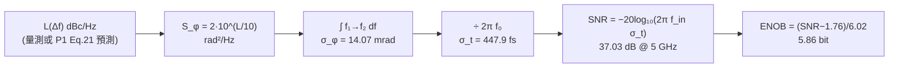

import NumericQuiz from "@site/src/components/NumericQuiz";

# ADC aperture jitter：時脈 jitter 如何吃掉 SNR 與 ENOB

> 先備：[psd_phase_noise_jitter](/02_foundations/psd_phase_noise_jitter)（$\mathcal{L}\to S_\phi\to\sigma_\phi\to\sigma_t$ 四步鏈）、[lab_08_jitter_integration](/04_simulation_labs/lab_08_jitter_integration)（447.9 fs 怎麼積出來）｜接下來：[serdes_clocking_connection](/06_design_insights/serdes_clocking_connection)、[exercises](/06_design_insights/exercises)

## 問題：為什麼換了 12-bit ADC，高頻 SNR 卻一點都沒變好？

一個高速 ADC（analog-to-digital converter，類比數位轉換器）在**取樣瞬間**把輸入電壓「凍結」下來。
但取樣瞬間本身不是理想的：取樣時脈有 jitter，取樣開關的觸發時刻還有自己的隨機不確定性——
兩者合起來叫 **aperture jitter（孔徑抖動，取樣時刻的 rms 隨機誤差 $\sigma_t$，單位 s）**。
輸入訊號頻率一高，波形斜率變陡，同樣的時間誤差就被「斜率」放大成越來越大的**電壓誤差**——
到某個輸入頻率之後，SNR 完全被時脈品質卡死，跟你買幾 bit 的 ADC 無關。

這頁做四件事：

1. 從第一原理逐步推導招牌公式 $\text{SNR}_{jitter}=-20\log_{10}(2\pi f_{in}\sigma_t)$；
2. 推導 ENOB（effective number of bits，有效位元數）換算 $\text{ENOB}=(\text{SNR}-1.76)/6.02$；
3. 用本站 canonical 例 C 的 $\sigma_t=447.9$ fs 算一張誠實的設計表（1 / 2.5 / 5 / 10 GHz），
   並反推「10 ENOB @ 5 GHz 需要多乾淨的時脈」；
4. 把它接回本站主線：$\mathcal{L}(\Delta f)\to$ 積分 $\to\sigma_t\to$ SNR——**振盪器的 phase
   noise 圖直接決定資料轉換器的有效位元數**。

> **外部文獻聲明**：aperture-jitter SNR 公式是資料轉換器的標準教科書結果
> （外部文獻，非本站 5 篇 PDF）；例如 W. Kester, *"MT-007: Aperture Time, Aperture Jitter,
> Aperture Delay Time—Removing the Confusion,"* Analog Devices Tutorial MT-007, 2008；
> R. H. Walden, *"Analog-to-digital converter survey and analysis,"* IEEE J. Sel. Areas
> Commun., vol. 17, no. 4, pp. 539–550, Apr. 1999。本頁的輸入數字 $\sigma_t=447.9$ fs
> 則是**本站自己驗證過的** canonical 例 C（[lab_08](/04_simulation_labs/lab_08_jitter_integration)）。

> **物理直覺（先講結論）**：取樣誤差 = **斜率 × 時間誤差**。正弦波最陡的斜率是
> $A\cdot2\pi f_{in}$（V/s），所以同一顆時脈（同一個 $\sigma_t$）打在 2 倍頻率的輸入上，
> 電壓誤差就大 2 倍、雜訊功率大 4 倍——**SNR 每倍頻掉 6 dB，等於每個 octave 掉 1 bit**。
> 這就是為什麼 RF 直接取樣（direct RF sampling）的系統，最貴的往往不是 ADC 本身，
> 而是那顆餵它的低雜訊時脈。

## 第 1 步：jittered sampling 的電壓誤差（error = slope × timing error）

**寫下訊號與取樣時刻。** 讓 ADC 取樣一個滿刻度正弦（full-scale sine）：

$$
V(t)=A\sin(2\pi f_{in}t),
$$

其中 $A$ 是振幅（V）、$f_{in}$ 是輸入頻率（Hz）。理想取樣時刻是 $t_n=nT_s$（$T_s=1/f_s$，s）；
實際取樣時刻多了一個隨機誤差 $\delta t_n$（s）：

$$
\hat V_n=V(nT_s+\delta t_n)=A\sin\big(2\pi f_{in}(nT_s+\delta t_n)\big).
$$

**用一階 Taylor 展開取出誤差。** 因為 $\delta t_n$ 極小（fs 等級），把 $V$ 在 $t_n$ 附近展開，
只留一階：

$$
\hat V_n\approx V(nT_s)+\left.\frac{dV}{dt}\right|_{t=nT_s}\!\cdot\delta t_n
\quad\Longrightarrow\quad
e_n\equiv\hat V_n-V(nT_s)=A\,2\pi f_{in}\cos(2\pi f_{in}nT_s)\,\delta t_n.
$$

- **用到的數學**：$\frac{d}{dt}A\sin(2\pi f_{in}t)=A\cdot2\pi f_{in}\cos(2\pi f_{in}t)$。
- **單位檢查（逐項）**：$A$（V）$\times\,2\pi f_{in}$（rad/s）$\times\,\delta t_n$（s）
  $=$ V·rad；rad 無因次，所以 $e_n$ 是 V ✓。斜率 $A\cdot2\pi f_{in}$ 的單位是 V/s——
  「每秒變化多少伏」，乘上「差了幾秒」自然是伏。
- **一階近似的成立條件**：Taylor 二階項相對一階是 $O(2\pi f_{in}\delta t_n)$，所以需要
  $2\pi f_{in}\sigma_t\ll1$ rad。本頁最壞情況（10 GHz、447.9 fs）是
  $2\pi\times10^{10}\times4.479\times10^{-13}=2.81\times10^{-2}$ rad ✓，遠小於 1。
- **物理意義**：這一步就是整頁的核心——**時間誤差被波形斜率放大成電壓誤差**。
  斜率正比於 $f_{in}$，所以傷害正比於 $f_{in}$。這跟
  [waveform_slope](/06_design_insights/waveform_slope) 講振盪器內部「斜率越陡、
  對雜訊越不敏感」是同一個物理量的兩面：在振盪器**裡面**，陡斜率是好事（電壓雜訊
  換相位雜訊時被斜率除掉）；在取樣**介面**上，陡斜率是壞事（時間誤差被斜率乘上去）。

## 第 2 步：對 jitter 與取樣相位取均方 → 雜訊功率

現在把單一樣本的誤差 $e_n$ 變成統計上的**雜訊功率**。假設（下面第 5 節會逐條檢討）：

- $\delta t_n$ 是零均值高斯、樣本間獨立（白色 RJ），方差 $\mathrm{E}[\delta t_n^2]=\sigma_t^2$（s²）；
- $\delta t_n$ 與訊號相位無關（jitter 不知道現在波形走到哪）。

對 $e_n^2$ 取期望值，因為 $\delta t_n$ 與 $\cos(\cdot)$ 獨立，期望值拆開：

$$
\mathrm{E}[e_n^2]=A^2(2\pi f_{in})^2\,\underbrace{\mathrm{E}\big[\cos^2(2\pi f_{in}nT_s)\big]}_{=\ 1/2}\;\underbrace{\mathrm{E}[\delta t_n^2]}_{=\ \sigma_t^2}.
$$

**那個 $\tfrac12$ 從哪來**：取樣相位 $2\pi f_{in}nT_s$ 均勻掃過整個週期（coherent sampling
取滿整數個週期，或相位視為均勻分布），$\cos^2$ 的平均是 $\tfrac12$——跟「正弦功率是振幅
平方的一半」是同一件事。所以雜訊功率（V²）：

$$
P_e=\frac{A^2(2\pi f_{in})^2\sigma_t^2}{2}\quad[\mathrm{V}^2].
$$

- **dimension check**：$\mathrm{V}^2\times(\mathrm{rad/s})^2\times\mathrm{s}^2=\mathrm{V}^2$
  （rad 無因次）✓。
- **物理意義**：誤差最大的地方在**過零點**（斜率最陡、$\cos^2=1$），在波峰（斜率為零、
  $\cos^2=0$）jitter 完全無害——這正是 [P1] 的 LTV 敏感度思想在取樣介面上的翻版：
  **「何時被打」決定傷害多大**（對照 [lab_02](/04_simulation_labs/lab_02_lc_oscillator_toy_model)
  的 LC ISF：振盪器在過零點對電荷擾動最敏感，同一個 $\cos$/$\sin$ 幾何）。$\tfrac12$
  就是把「有時打在陡處、有時打在平處」平均起來的結果。

## 第 3 步：SNR——招牌公式

正弦訊號本身的功率是

$$
P_{sig}=\frac{A^2}{2}\quad[\mathrm{V}^2].
$$

SNR（signal-to-noise ratio，訊號雜訊比）就是兩者相除。注意 $A^2$ 與兩個 $\tfrac12$
**都對消**：

$$
\text{SNR}=\frac{P_{sig}}{P_e}=\frac{A^2/2}{A^2(2\pi f_{in})^2\sigma_t^2/2}=\frac{1}{(2\pi f_{in}\sigma_t)^2}.
$$

取 dB（$10\log_{10}$ 的功率比，平方提出來變 20）：

$$
\boxed{\ \text{SNR}_{jitter}=-20\log_{10}\!\big(2\pi f_{in}\,\sigma_t\big)\ \ [\mathrm{dB}]\ }
$$

- **dimension check**：$2\pi f_{in}\sigma_t=$（rad/s）×（s）$=$ rad，無因次 ✓——
  log 的引數必須無因次，這裡自動滿足。SNR 本身是功率比，無因次 ✓。
- **物理解讀（最重要的一句）**：$2\pi f_{in}\sigma_t$ 就是「**時間 jitter 換算到輸入正弦上
  的等效 rms 相位誤差**」$\sigma_{\phi,in}$（rad）。所以這條公式其實在說：
  $\text{SNR}=1/\sigma_{\phi,in}^2$——**取樣一個正弦，SNR 就是等效相位抖動的倒數平方**。
- **與本站主線的漂亮接點**：時脈本身在 $f_0$ 的 rms 相位是 $\sigma_\phi=2\pi f_0\sigma_t$；
  打在輸入頻率 $f_{in}$ 上，等效相位被縮放為
  $\sigma_{\phi,in}=2\pi f_{in}\sigma_t=(f_{in}/f_0)\,\sigma_\phi$。當 $f_{in}=f_0=5$ GHz 時，
  SNR 就直接是 $-20\log_{10}(\sigma_\phi)=-20\log_{10}(0.01407)=37.0$ dB——
  **例 C 的 14.07 mrad 原封不動變成 ADC 的 SNR**。
- **適用/失效**：只在 $2\pi f_{in}\sigma_t\ll1$ rad（第 1 步的一階 Taylor）且雜訊只有
  jitter 一項時成立；完整條件見第 5 節。

## 第 4 步：ENOB——換算成「有效位元數」

要把 SNR 講成 ADC 設計師的語言，得先推導理想 N-bit 量化器的 SNR（外部標準結果：
W. R. Bennett, *"Spectra of quantized signals,"* Bell Syst. Tech. J., vol. 27,
pp. 446–472, Jul. 1948（外部文獻，非本站 5 篇 PDF）；此處自含推導）。

**（a）量化雜訊功率 $q^2/12$。** 設 LSB（least significant bit，最小量化階）為 $q$（V）。
量化誤差 $e$ 在 $[-q/2,+q/2]$ 內近似均勻分布，其功率（變異數）：

$$
\mathrm{E}[e^2]=\int_{-q/2}^{q/2}e^2\,\frac{de}{q}=\frac{1}{q}\cdot\frac{e^3}{3}\Big|_{-q/2}^{q/2}=\frac{1}{q}\cdot\frac{2(q/2)^3}{3}=\frac{q^2}{12}\quad[\mathrm{V}^2].
$$

**（b）滿刻度正弦功率。** N-bit 的滿刻度範圍是 $2^N q$（V），正弦振幅
$A=2^N q/2=2^{N-1}q$，功率：

$$
P_{sig}=\frac{A^2}{2}=\frac{2^{2N-2}q^2}{2}=\frac{2^{2N}q^2}{8}\quad[\mathrm{V}^2].
$$

**（c）相除、取 dB。**

$$
\text{SNR}_q=\frac{2^{2N}q^2/8}{q^2/12}=\frac{12}{8}\,2^{2N}=\frac{3}{2}\cdot2^{2N}
$$

$$
\text{SNR}_q[\mathrm{dB}]=10\log_{10}\!\tfrac32+2N\cdot10\log_{10}2=1.76+6.02\,N.
$$

- **dimension check**：$q^2$ 上下對消，SNR 無因次 ✓；$N$ 是 bit 數（無因次）。

**（d）反轉定義 ENOB。** 把任何來源的 SNR（此處是 jitter 造成的）塞回這條式子反解 $N$，
就是「這顆 ADC **等效於**幾 bit 的理想量化器」：

$$
\boxed{\ \text{ENOB}=\frac{\text{SNR}[\mathrm{dB}]-1.76}{6.02}\ \ [\mathrm{bit}]\ }
$$

- **適用/失效**：$q^2/12$ 假設量化誤差均勻、與訊號無關（busy signal 才成立；
  對極小或直流輸入會變成 deterministic 誤差，需要 dither）；ENOB 定義以滿刻度正弦為準，
  輸入 backoff 幾 dB，SNR 就掉幾 dB。
- **合成規則**：實際 ADC 的 jitter、量化、熱雜訊**功率相加**：
  $\text{SNR}_{tot}=-10\log_{10}\big(10^{-\text{SNR}_j/10}+10^{-\text{SNR}_q/10}+10^{-\text{SNR}_{th}/10}\big)$。
  低頻時量化/熱雜訊主導、SNR 對 $f_{in}$ 平坦；高頻時 jitter 項以 $-20$ dB/dec 壓過來，
  交叉點就是「這顆時脈值得配幾 bit ADC」的分界。

## 第 5 步：factor-of-2 記帳檢查（本站慣例對照）

本站對每個 2 都要問「哪來的、什麼慣例」。這條公式有三個地方要檢查：

1. **公式本身沒有藏 2。** 分子 $P_{sig}=A^2/2$ 的 $\tfrac12$（正弦功率）與分母
   $\langle\cos^2\rangle=\tfrac12$（取樣相位平均）**互相對消**；$2\pi$ 是貨真價實的角頻率
   換算（Hz→rad/s），不是記帳慣例。所以 $\text{SNR}=1/(2\pi f_{in}\sigma_t)^2$
   **不依賴 SSB/DSB 或 $\mathcal{L}$ 的任何慣例**。
2. **慣例藏在 $\sigma_t$ 的上游。** 本站 $\sigma_t=447.9$ fs 是從**量測值**
   $\mathcal{L}(1\,\mathrm{MHz})=-100$ dBc/Hz 用 $S_\phi=2\cdot10^{\mathcal{L}/10}$
   （$\mathcal{L}\approx\tfrac12S_\phi$ 小角 SSB 慣例）積出來的
   （[psd_phase_noise_jitter](/02_foundations/psd_phase_noise_jitter) 第 2 步）。
   只要 $\mathcal{L}$ 是量到的，這條換算全站一致、無歧義。
3. **若 $\mathcal{L}$ 是從電路雜訊「預測」的，/2-vs-/4 就進場了。** 本站例 B
   （$f_0=5$ GHz、$\Gamma_{rms}=0.5$、$q_{max}=1$ pC、$S_i=10^{-24}$ A²/Hz）用
   [P1] Eq. (21), p.185（SSB、$/4\Delta\omega^2$ 慣例）得 $\mathcal{L}(1\,\mathrm{MHz})=-148.0$
   dBc/Hz；用時域 $/2\Delta\omega^2$ 記帳則是 $-145.0$ dBc/Hz（詳見
   [white_noise_to_phase_noise](/03_isf_core_theory/white_noise_to_phase_noise)）。
   **數值交叉檢查**：3 dB 的 $\mathcal{L}$ 差 → $\sigma_t\propto10^{\mathcal{L}/20}$ 差
   $10^{3/20}=1.41\approx\sqrt2$ 倍 → $\text{SNR}_{jitter}$ 差 $20\log_{10}\sqrt2=3.0$ dB。
   慣例差多少 dB，就原封不動傳到 SNR 差多少 dB——選定慣例、全鏈一致，數字才有意義。

## 假設與失效條件（誠實清單）

| 假設 | 為什麼需要 | 失效時會怎樣 |
|---|---|---|
| RJ 白色（$\delta t_n$ i.i.d. 高斯） | 雜訊功率均勻鋪滿 Nyquist 頻帶（FFT 上是平的 floor） | 自由振盪時脈的 jitter 是有色的（$1/f^2$ skirt、$\sigma_{\Delta t}=\kappa\sqrt{\Delta t}$ 累積，[P2] Eq. (8), p.792）：**總** SNR 公式仍對（只要 $\sigma_t$ 是同一積分頻寬的總 rms），但雜訊會集中成訊號旁的 skirt 而非平坦 floor；哪些 close-in 成分「算數」取決於系統會不會追掉它（見 design knobs） |
| 一階 Taylor（$2\pi f_{in}\sigma_t\ll1$ rad） | 誤差與 $\delta t$ 線性 | 高階項出現、載波功率以 $e^{-\sigma_{\phi,in}^2}$ 流失；447.9 fs 要到 $f_{in}\sim35$ GHz 才達 $\sigma_{\phi,in}=0.1$ rad |
| jitter 與訊號獨立 | 期望值可拆開 | 若時脈與訊號同源（clock 派生訊號），部分 jitter 是共模、會對消，實測 SNR 反而更好 |
| 滿刻度正弦、coherent 取樣 | SNR/ENOB 的標準定義基準 | 輸入 backoff x dB → SNR 掉 x dB；非 coherent FFT 需加窗，洩漏另計 |
| 無量化/熱雜訊（純 jitter） | 分離單一機制 | 真實 ADC 用第 4 步（d）的功率相加合成 |
| $\sigma_t$＝時脈 RJ＋ADC 內部 aperture jitter 的 RSS | 兩個獨立高斯來源方差相加 | 只算時脈、忘了 ADC 內部貢獻（datasheet 的 aperture jitter 項）會高估 SNR |

## 設計表：447.9 fs 的時脈，打在不同 $f_{in}$ 上

用本站 canonical 例 C 的 $\sigma_t=447.9$ fs（5 GHz、$-100$ dBc/Hz @ 1 MHz、$1/f^2$、
積 1→100 MHz；[lab_08](/04_simulation_labs/lab_08_jitter_integration)）。下表由
`simulations/lab_30_aperture_jitter.py` 印出（模擬驗證見下節）：

| $f_{in}$ | $\sigma_{\phi,in}=2\pi f_{in}\sigma_t$ [rad] | $\text{SNR}_{jitter}$ [dB] | ENOB [bit] |
|---|---|---|---|
| 1 GHz | $2.814\times10^{-3}$ | 51.01 | 8.18 |
| 2.5 GHz | $7.036\times10^{-3}$ | 43.05 | 6.86 |
| 5 GHz | $1.407\times10^{-2}$ | 37.03 | 5.86 |
| 10 GHz | $2.814\times10^{-2}$ | 31.01 | 4.86 |

**逐步手算一列（5 GHz）當 worked example**：

$$
2\pi f_{in}\sigma_t=2\pi\times5\times10^{9}\ \mathrm{Hz}\times4.479\times10^{-13}\ \mathrm{s}
=3.1416\times10^{10}\times4.479\times10^{-13}=1.407\times10^{-2}\ \mathrm{rad}.
$$

$$
\text{SNR}=-20\log_{10}(1.407\times10^{-2})=-20\times(-1.8517)=37.03\ \mathrm{dB},
$$

$$
\text{ENOB}=\frac{37.03-1.76}{6.02}=\frac{35.27}{6.02}=5.86\ \mathrm{bit}.
$$

- **dimension check**：Hz×s＝無因次（配上 $2\pi$ 成 rad）✓；dB、bit 皆無因次 ✓。
- **一行 Python 驗證**：

```python
import numpy as np
print(-20*np.log10(2*np.pi*5e9*447.9e-15))            # -> 37.03
print((-20*np.log10(2*np.pi*5e9*447.9e-15)-1.76)/6.02) # -> 5.86
```

<NumericQuiz
  prompt="先自己算：f_in = 5 GHz、σ_t = 447.9 fs 時 SNR_jitter = ？（以 dB 作答）"
  answer={37.03}
  tol={0.01}
  unit="dB"
  hint="SNR = −20·log₁₀(2π f_in σ_t)；先算 2π f_in σ_t ≈ 1.407×10⁻² rad。"
  solutionNote="2π×5×10⁹×4.479×10⁻¹³ ≈ 1.407×10⁻² rad → SNR = −20×log₁₀(1.407×10⁻²) ≈ 37.03 dB（對應 ENOB ≈ 5.86 bit）。"
/>

**scaling 手感（把表讀成一條直線）**：

- $f_{in}$ 每**倍頻**（octave）：SNR $-6.02$ dB、ENOB $-1$ bit——表中 5→10 GHz 正好
  $37.03\to31.01$（差 6.02 dB）、$5.86\to4.86$（差 1.00 bit）✓。
- 1→10 GHz 是 $\log_2 10=3.32$ 個 octave：$8.18-3.32=4.86$ bit ✓，完全自洽。
- $\sigma_t$ 每好 10 倍：SNR $+20$ dB、ENOB $+3.32$ bit。**時脈與輸入頻率是完全對偶的
  兩個旋鈕**（都是 $-20\log_{10}$ 進來的）。
- **手感對照（例 B 的理想極限）**：若時脈換成例 B 那顆「單一白噪源理想 LC」
  （$\mathcal{L}(1\,\mathrm{MHz})=-148$ dBc/Hz，[P1] Eq. (21) SSB /4 慣例），同積分頻寬下
  $\sigma_t$ 縮 $10^{48/20}=251$ 倍 → 約 1.8 fs → 5 GHz 輸入 SNR $=37.0+48=85.0$ dB、
  ENOB $=13.8$ bit（用 /2 慣例 $-145$ dBc/Hz 則 82.0 dB、13.3 bit——又見第 5 節的 3 dB）。
  真實振盪器有多個雜訊源、flicker 與 buffer chain，達不到這個理想值。

## 反推設計：要 10 ENOB @ 5 GHz，時脈得多乾淨？

> **題目**：系統要在 $f_{in}=5$ GHz 的輸入上保住 10 bit 有效位元（只考慮 jitter 一項），
> 問 aperture jitter 上限 $\sigma_t$。

**步驟 1（ENOB→SNR）**：

$$
\text{SNR}_{req}=6.02\times10+1.76=61.96\ \mathrm{dB}.
$$

**步驟 2（反解公式）**：由 $\text{SNR}=-20\log_{10}(2\pi f_{in}\sigma_t)$，

$$
2\pi f_{in}\sigma_t=10^{-\text{SNR}/20}
\quad\Longrightarrow\quad
\sigma_t=\frac{10^{-61.96/20}}{2\pi\times5\times10^{9}}=\frac{7.98\times10^{-4}}{3.1416\times10^{10}}\ \mathrm{s}.
$$

**步驟 3（算出來）**：

$$
\boxed{\ \sigma_t=2.540\times10^{-14}\ \mathrm{s}=25.4\ \mathrm{fs}\ }
$$

- **dimension check**：分子無因次（rad）、分母 rad/s → 商是 s ✓。
- **一行 Python 驗證**：

```python
import numpy as np
print(10**(-(6.02*10+1.76)/20)/(2*np.pi*5e9)*1e15)   # -> 25.40
```

**把需求翻譯回 phase noise 的語言**（這才是跟振盪器設計者溝通的方式）：$\sigma_t$ 要從
447.9 fs 壓到 25.4 fs，是 $447.9/25.4=17.6$ 倍，相當於整條 $1/f^2$ skirt 平移
$20\log_{10}17.6=24.9$ dB——即同樣積分頻寬（1→100 MHz）下需要

$$
\mathcal{L}(1\,\mathrm{MHz})\ \le\ -100-24.9=-124.9\ \mathrm{dBc/Hz}.
$$

以 [P1] Eq. (21), p.185 的 scaling $\mathcal{L}\propto\Gamma_{rms}^2S_i/q_{max}^2$ 來讀：
24.9 dB $=310$ 倍的功率比，得靠 $q_{max}$（swing×電容，見
[tank_swing](/06_design_insights/tank_swing)）、$\Gamma_{rms}$（波形對稱性/拓樸，見
[lc_vs_ring](/06_design_insights/lc_vs_ring)）與雜訊源 $S_i$ 三個旋鈕一起湊，或改用
PLL 把 close-in 濾掉（見 design knobs）。**誠實註記**：25.4 fs 已是「極好的」時脈——
以量級而言，最好的商用 RF-sampling 時脈鏈整合 jitter 大約落在數十 fs 這一帶
（量級說法，非精確引用），所以「10 ENOB @ 5 GHz」是貼著現實極限的規格。

## 整條鏈：從 phase noise 圖到 ENOB



前四格就是 [psd_phase_noise_jitter](/02_foundations/psd_phase_noise_jitter) 的四步鏈
（例 C），本頁只是接上最後兩格。整條鏈一行 Python 走完（重用 lab_08 的函式庫）：

```python
import numpy as np
from simulations.common.noise_utils import leeson_one_over_f2, integrate_rms_jitter

f = np.logspace(6, 8, 4000)                             # 1 MHz -> 100 MHz
L = leeson_one_over_f2(f, L_ref_dbc=-100, f_ref=1e6)    # 1/f^2 skirt（例 C）
sigma_t, _ = integrate_rms_jitter(f, L, f0=5e9, fmin=1e6, fmax=100e6)
print(sigma_t*1e15)                                     # -> 447.9
print(-20*np.log10(2*np.pi*5e9*sigma_t))                # -> 37.03
```

**積分頻寬的誠實警告**（承 psd 頁「下限主導」）：例 C 的 447.9 fs 是「積 1→100 MHz」的
數字。對 ADC 而言，「哪段 offset 頻率算 jitter」取決於觀測長度與系統架構：FFT 一筆
紀錄長 $T_{rec}$，比 $1/T_{rec}$ 慢的相位漂移看起來像頻率偏移而非 noise floor；時脈若經
PLL 清理，close-in 被 reference 接管。**換積分頻寬，$\sigma_t$ 就變，SNR 跟著變**——
報 jitter-limited SNR 時，$\sigma_t$ 的積分頻寬必須一起報。

## 模擬驗證：lab_30（Monte-Carlo 取樣 + FFT）

理論要用「不知道答案的方法」對打過才算數。`simulations/lab_30_aperture_jitter.py`
直接做這個實驗：對單位正弦在 $t_n=n/f_s+\delta t_n$（$\delta t_n$ 為白色高斯，
$\sigma_t=447.9$ fs）取樣，rectangular window coherent FFT（訊號放在奇數 bin，
與 $2^{14}$ 點互質、每個樣本相位都不同），量測

$$
\text{SNR}_{meas}=\frac{P(\text{signal bin})}{\sum P(\text{其他所有 bin，扣 DC})},
$$

再跟 $-20\log_{10}(2\pi f_{in}\sigma_t)$ 疊圖。


**怎麼讀這張圖**：

- **(a)**：藍實線是公式（$\sigma_t=447.9$ fs）、藍圈是 FFT 量測——10 個掃頻點全部落在線上；
  綠虛線/綠方塊是 $\sigma_t=25.4$ fs 的同一組實驗，紅星是「10 ENOB @ 5 GHz（61.96 dB）」
  的規格點，**正好落在綠線上**——反推設計閉環驗證。右軸直接以 ENOB 刻度：
  $-6$ dB/octave 讀成「每倍頻掉 1 bit」。
- **(b)**：$f_{in}=5$ GHz 單筆頻譜。jitter 雜訊是**平坦 floor**（白 RJ 假設的視覺證據），
  高度約 $-76$ dBc/bin ——即總雜訊 $-37$ dBc 攤到 $N_{FFT}/2=8192$ 個 bin
  （$-37-10\log_{10}8192=-76$）✓。若 jitter 有色（真實自由振盪時脈），這個 floor
  會變成訊號旁的 skirt，總功率不變。

實際輸出（跑 `PYTHONPATH=. python3 simulations/lab_30_aperture_jitter.py`）：

```text
Monte-Carlo vs formula (same actual coherent f_in):
  f_in =  1.0016 GHz : measured  51.00 dB, formula  51.00 dB, diff -0.00 dB
  f_in =  5.0016 GHz : measured  37.03 dB, formula  37.03 dB, diff +0.00 dB
```

核心程式碼（完整 script 見 `simulations/lab_30_aperture_jitter.py`）：

```python
m = int(round(f_in_target * n / fs))
if m % 2 == 0:
    m += 1                                      # 奇數 bin -> coherent 且與 2^14 互質
f_in = m * fs / n
dt = rng.standard_normal(n) * sigma_t           # 白色高斯 RJ [s]
x = np.sin(2*np.pi*f_in*(np.arange(n)/fs + dt)) # jittered sampling
p = np.abs(np.fft.rfft(x)/n)**2
snr_db = 10*np.log10(p[m] / (p[1:].sum() - p[m]))
```

| 參數 | 值 | 單位 | 說明 |
|---|---|---|---|
| $\sigma_t$ | 447.9（另一組 25.4） | fs | canonical 例 C；反推規格點 |
| $f_s$ | 25.6 | GS/s | Nyquist 12.8 GHz 蓋住 $f_{in}\le10$ GHz |
| $N_{FFT}$ | $2^{14}=16384$ | 樣本 | coherent 紀錄長度 |
| $f_{in}$ | 0.5–10（掃 10 點） | GHz | 放在奇數 bin |
| 平均次數 | 10–20 | 筆 | 壓 noise-power 估計的統計誤差至 \~0.02 dB |
| $A$ | 1 | V（normalized） | 滿刻度正弦；SNR 與 $A$ 無關 |

**模擬的限制（誠實聲明）**：這是 pedagogical 模型——無量化器（bit 數無限）、無熱雜訊、
jitter 為白色 i.i.d.（真實時脈是有色的；總 SNR 不變、頻譜形狀會變）、取樣為理想
瞬時（無 track-and-hold 頻寬 roll-off）。它驗證的是**公式本身**，不是某顆真實 ADC。
另外模擬取樣的是 $\sin$ 的精確值（非一階 Taylor），所以「量測=公式到 0.01 dB」同時
驗證了一階近似在 $\sigma_{\phi,in}\le0.028$ rad 的合法性。

## Design knobs：jitter-limited 系統的可調旋鈕

1. **時脈源本身**：$\mathcal{L}\propto\Gamma_{rms}^2S_i/q_{max}^2$（[P1] Eq. (21), p.185）——
   拉高 $q_{max}$（swing、tank 電容）、選對稱波形壓 $\Gamma_{rms}$、LC 取代 ring
   （代表值 $\Gamma_{rms}=0.5$；true LC $1/\sqrt2$；ring 更差，見
   [lc_vs_ring](/06_design_insights/lc_vs_ring)）。
2. **PLL loop bandwidth**：loop 內 close-in noise 被 reference 接管、loop 外留給 VCO——
   最佳頻寬使積分 jitter 最小（[pll_noise_budget](/06_design_insights/pll_noise_budget)）。
3. **時脈鏈的每一級**：buffer、divider、distribution 都往 RSS 裡加 jitter；
   ADC datasheet 的內部 aperture jitter 也是一項。預算要從 $\sigma_{t,tot}^2=\sum\sigma_{t,i}^2$
   分下去。
4. **降低取樣介面看到的 $f_{in}$**：mixer 先降頻再取樣（IF sampling）就是拿混頻器的
   複雜度去換時脈規格——每降一個 octave 賺 1 bit。
5. **Oversampling + 數位濾波**：白色 jitter 雜訊平鋪 Nyquist 頻帶，濾掉頻帶外可賺
   $10\log_{10}(\mathrm{OSR})$ 的 processing gain；但**有色**（close-in skirt）jitter
   貼著訊號、濾不掉——又一個「白/有色假設決定答案」的例子。
6. **波形斜率**：把時脈邊緣做陡（限幅、buffer）能壓時脈鏈自己的加性雜訊轉 jitter
   （[waveform_slope](/06_design_insights/waveform_slope)），但對「已經是 $\sigma_t$」的
   相位雜訊無能為力——斜率旋鈕只對加性電壓雜訊有效。

## 與 SerDes 的關聯：同一個 $\sigma_t$、兩個消費者

[serdes_clocking_connection](/06_design_insights/serdes_clocking_connection) 用同一個
447.9 fs 去算 eye 閉合與 BER（$Q^{-1}(10^{-12})=7.03$，吃掉 $\pm7.03\sigma_t=\pm3.1$ ps
的眼寬）；本頁用它算 SNR/ENOB。兩者都是「**振盪器 phase noise 的時域帳單**」：

- SerDes 在意的是**尾巴機率**（$7\sigma$ 事件造成 bit error）；
- ADC 在意的是**均方功率**（$\sigma^2$ 直接進 SNR）。

同一顆時脈、同一條 $\mathcal{L}(\Delta f)$ 曲線，從 [P1] 的 $\Gamma_{rms}/q_{max}$ 出發，
一路決定通訊系統兩端（取樣器與收發器）的規格上限。

## 重點回顧

- **招牌公式**：$\text{SNR}_{jitter}=-20\log_{10}(2\pi f_{in}\sigma_t)$；推導核心是
  「誤差 = 斜率 × 時間誤差」，兩個 $\tfrac12$（正弦功率、$\cos^2$ 平均）對消，公式
  不含任何 SSB 記帳慣例。
- $2\pi f_{in}\sigma_t=\sigma_{\phi,in}$：SNR 就是等效輸入相位抖動的 $-20\log_{10}$；
  $f_{in}=f_0$ 時直接回收例 C 的 $\sigma_\phi=14.07$ mrad → 37.0 dB。
- **ENOB $=(\text{SNR}-1.76)/6.02$**：由 $q^2/12$ 與滿刻度正弦功率推得
  $\text{SNR}_q=6.02N+1.76$ 後反解。
- **設計表（$\sigma_t=447.9$ fs）**：1 / 2.5 / 5 / 10 GHz → 51.0 / 43.1 / 37.0 / 31.0 dB
  → 8.18 / 6.86 / 5.86 / 4.86 bit；**每 octave 掉 6.02 dB＝1 bit**。
- **反推**：10 ENOB @ 5 GHz → SNR $\ge61.96$ dB → $\sigma_t\le25.4$ fs
  （比 447.9 fs 乾淨 17.6 倍＝skirt 全線 $-24.9$ dB → $\mathcal{L}(1\,\mathrm{MHz})\le-124.9$ dBc/Hz）。
- **慣例紀律**：$\sigma_t$ 上游若用 [P1] Eq. (21) 的 /4（SSB）vs 時域 /2 記帳，
  $\mathcal{L}$ 差 3 dB → $\sigma_t$ 差 $\sqrt2$ → SNR 差 3 dB，全鏈一致才有意義；
  報 jitter-limited SNR 必附 $\sigma_t$ 的積分頻寬。
- **模擬驗證（lab_30）**：Monte-Carlo 取樣 + FFT 與公式在 1 GHz、5 GHz 皆吻合到
  0.01 dB 內；白 RJ 的雜訊是平坦 floor（$-76$ dBc/bin @ $N_{FFT}=16384$）。

## 延伸閱讀

- $\mathcal{L}\to\sigma_t$ 四步鏈與四種 jitter 方言：[psd_phase_noise_jitter](/02_foundations/psd_phase_noise_jitter)
- 447.9 fs 的出處（積分實作）：[lab_08_jitter_integration](/04_simulation_labs/lab_08_jitter_integration)
- 同一個 $\sigma_t$ 的另一個消費者（eye/BER）：[serdes_clocking_connection](/06_design_insights/serdes_clocking_connection)
- 時脈源頭的設計旋鈕：[tank_swing](/06_design_insights/tank_swing)、[lc_vs_ring](/06_design_insights/lc_vs_ring)、[pll_noise_budget](/06_design_insights/pll_noise_budget)
- $\mathcal{L}$ 預測的 /2-vs-/4 慣例：[white_noise_to_phase_noise](/03_isf_core_theory/white_noise_to_phase_noise)
- 外部文獻（非本站 5 篇 PDF）：
  - W. Kester, *"MT-007: Aperture Time, Aperture Jitter, Aperture Delay Time—Removing the Confusion,"* Analog Devices Tutorial MT-007, 2008.
  - R. H. Walden, *"Analog-to-digital converter survey and analysis,"* IEEE J. Sel. Areas Commun., vol. 17, no. 4, pp. 539–550, Apr. 1999.
  - W. R. Bennett, *"Spectra of quantized signals,"* Bell Syst. Tech. J., vol. 27, pp. 446–472, Jul. 1948.
  - B. Razavi, *Principles of Data Conversion System Design*, IEEE Press, 1995.
