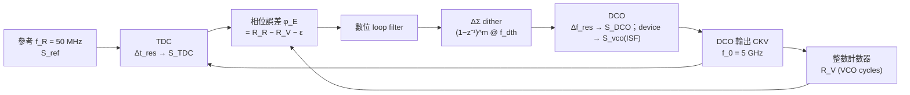

# 全數位 PLL：TDC 與 DCO 的量化雜訊也是同一條 ISF 記帳

> **先備**：[pll_noise_budget](/06_design_insights/pll_noise_budget)（五源預算、in-band 地板 $S_{ref}N^2+S_{cp}$、fractional-N ΔΣ 第三項的四步推導）、[varactor_tuning_supply_pushing](/06_design_insights/varactor_tuning_supply_pushing)（電壓→頻率→積分成相位的 $K_{VCO}^2S_v/\Delta f^2$ 管線）、[sampling_pll](/06_design_insights/sampling_pll)（把 divider 踢出迴路的另一條路）｜ **接下來**：[clock_chain_budget](/06_design_insights/clock_chain_budget)、[serdes_clocking_connection](/06_design_insights/serdes_clocking_connection)、[exercises](/06_design_insights/exercises)

## 這頁要回答什麼

[pll_noise_budget](/06_design_insights/pll_noise_budget) 的預算表裡有五個**類比**雜訊源：
reference、PFD/charge-pump、divider、loop filter、VCO。近二十年的主流卻越來越多是
**ADPLL（all-digital PLL，全數位鎖相環）**：把「PFD＋charge-pump＋類比 loop filter」換成
「**TDC（time-to-digital converter，時間數位轉換器，把兩個邊緣的時間差量成一個整數）**＋
數位 loop filter」，把 VCO 換成 **DCO（digitally controlled oscillator，數位控制振盪器，用一組
開關電容而不是連續的 varactor 電壓來調頻）**。這頁要回答：

1. **TDC 的有限時間解析度 $\Delta t_{res}$ 變成多少 in-band 相位雜訊？** 它是 charge-pump
   $S_{cp}$ 的數位替身，出現在預算表的同一個位置，但量級由「量化」而不是「電子雜訊」決定。
2. **DCO 的有限頻率解析度 $\Delta f_{res}$ 變成多少 out-of-band 相位雜訊？** 它是 VCO 的
   數位替身，走的是 [varactor 頁](/06_design_insights/varactor_tuning_supply_pushing) 那條
   「頻率誤差 → 積分成相位 → $1/\Delta f^2$」的管線。
3. **ΔΣ dithering 怎麼把 DCO 的 LSB 整形掉？** 這是
   [pll_noise_budget](/06_design_insights/pll_noise_budget) 已推過的 $(1-z^{-1})^m$ 整形，
   換一個地方再用一次。
4. **預算式怎麼改寫**：$S_{out}=(S_{ref}N^2+S_{TDC})\lvert H_{lp}\rvert^2+(S_{DCO}+S_{vco})\lvert H_{hp}\rvert^2$，
   以及為什麼 10 ps 的 TDC 會讓整個 in-band 預算輸給一顆普通的 charge-pump。

> **外部文獻聲明**：ADPLL 架構、TDC 與 DCO 量化雜訊的兩條標準公式**不在本站下載的 5 篇
> PDF 之內**（外部文獻，非本站 5 篇 PDF）。經典出處：R. B. Staszewski, J. L. Wallberg,
> S. Rezeq, C.-M. Hung, O. E. Eliezer, S. K. Vemulapalli, C. Fernando, K. Maggio,
> R. Staszewski, N. Barton, M.-C. Lee, P. Cruise, M. Entezari, K. Muhammad, and D. Leipold,
> *"All-Digital PLL and Transmitter for Mobile Phones,"* IEEE J. Solid-State Circuits,
> vol. 39, no. 12, pp. 2278–2291, Dec. 2004；R. B. Staszewski and P. T. Balsara,
> *All-Digital Frequency Synthesizer in Deep-Submicron CMOS*, Wiley, 2006（兩處式號待查證）。
> 本頁的推導**完全自含**：兩條公式都由「均勻量化誤差 → 白化 → 進同一台積分器」逐步推出，
> 與本站既有的 ΔΣ 四步、varactor 管線一字不差；數值全部標示意（illustrative）。

> **物理直覺（先講結論）**：TDC 把相位誤差「四捨五入」到最近的 $\Delta t_{res}$，每個參考
> 週期丟一次骰子——這就是一個**取樣率 $f_R$ 的白噪相位誤差源**，直接坐在 PFD 的位子上，
> 被環路**低通**、跟 reference 一樣是 in-band 的地板；它的量級只看 $\Delta t_{res}/T_V$
> （量化步佔一個輸出週期的比例），**跟 $N$ 無關**。DCO 把控制字四捨五入到最近的
> $\Delta f_{res}$——這是一個**白噪頻率誤差源**，坐在 VCO 的位子上，被環路**高通**；而頻率誤差
> 要積分一次才變相位，所以它長得像 VCO 的 $1/f^2$ 裙邊、但由「量化步」而不是 device
> 雜訊決定。兩個新來的源都不是「電子雜訊」——它們是**設計者選的位元數**。ISF 理論負責的
> 那一項（DCO 自己的 device 雜訊 $\Gamma_{rms}^2/q_{max}^2$）完全沒變，只是旁邊多了兩個
> 量化的鄰居。

## 第 1 步：ADPLL 方塊圖與三個雜訊入口



三件事先講清楚，因為後面的「不乘 $N^2$」全靠它：

- **相位在 ADPLL 裡以「VCO cycle」為單位計數。** 參考每個週期把「應該累積的 cycle 數」
  $R_R$（frequency command word 的累加，可帶小數）加上去；計數器數 DCO 實際跑了幾圈 $R_V$
  （整數）；TDC 補上不足一圈的小數部分 $\varepsilon=\Delta t/T_V$（$\Delta t$ 是參考邊緣到下一個
  CKV 邊緣的時間差，$T_V=1/f_0$ 是 DCO 週期）。相位誤差 $\phi_E=R_R-R_V-\varepsilon$ 的單位是
  **輸出 cycle**，乘 $2\pi$ 就是輸出相位的 rad——這跟
  [pll_noise_budget](/06_design_insights/pll_noise_budget) 的 ΔΣ 第三項「誤差本來就以 VCO cycle
  計數」是**同一件事**，所以 TDC 雜訊也**不乘 $N^2$**。
- **沒有 charge-pump、沒有類比 loop filter。** $S_{cp}$、$S_{lf}$ 兩項消失，取而代之的是 TDC
  的量化 $S_{TDC}$。數位 loop filter 本身不加雜訊（有限字長效應另計）。
- **DCO 由一組開關電容（unit capacitor）控制。** 最細那一檔的頻率步 $\Delta f_{res}$ 就是
  「量化步」；DCO 的 device 雜訊（tank 損耗、主動元件）與 VCO 完全一樣，仍由 ISF 決定
  $S_{vco}\propto\Gamma_{rms}^2/q_{max}^2\cdot S_i/f^2$。

## 第 2 步：TDC 量化 → in-band 地板（四步，完全比照 ΔΣ 第三項）

TDC 用一串延遲單元（典型是 inverter chain）把 $\Delta t$ 量成整數個 $\Delta t_{res}$。
只要相位誤差夠「忙碌」（fractional-N、或有 dither），量化誤差就可以當白噪處理。逐步：

**（i）均勻量化誤差。** 量化誤差 $e_t$ 均勻分布於 $\pm\Delta t_{res}/2$：

$$
\sigma_{t}^2=\frac{\Delta t_{res}^2}{12}\qquad[\text{s}^2].
$$

（與 ΔΣ 第三項的 $\sigma_e^2=\Delta^2/12$ 同一條均勻分布公式，只是那裡的 $\Delta$ 是「cycle」，
這裡是「秒」。）

**（ii）時間誤差 → 輸出相位。** 一個輸出週期 $T_V$ 對應 $2\pi$ rad，所以

$$
\phi_{TDC}=2\pi\,\frac{e_t}{T_V}\quad\Longrightarrow\quad
\sigma_\phi^2=\frac{(2\pi)^2}{12}\Big(\frac{\Delta t_{res}}{T_V}\Big)^2\qquad[\text{rad}^2].
$$

這一步就是「**不乘 $N^2$**」的所在：$T_V$ 是**輸出**週期，$\phi_{TDC}$ 已經是輸出相位的
rad。若你堅持把它 referred to 參考端（用 $T_R=NT_V$ 去除），得到 $\phi/N$，到輸出還要 $\times N$、
功率 $\times N^2$，恰好對消——新手預算表最常見的錯就是替它多乘一次 $N^2$（與
[pll_noise_budget](/06_design_insights/pll_noise_budget) ΔΣ 節的第（iv）步同一個陷阱）。

**（iii）白化於 $f_R$。** TDC 每個參考週期出一個樣本，白序列的功率 $\sigma_\phi^2$ 平鋪在
$\pm f_R/2$（雙邊記帳）→ 每 Hz 密度 $\sigma_\phi^2/f_R$：

$$
\mathcal{L}_{TDC}=\frac{(2\pi)^2}{12}\Big(\frac{\Delta t_{res}}{T_V}\Big)^2\frac{1}{f_R},\qquad
S_{TDC}=2\,\mathcal{L}_{TDC}=\frac{(2\pi)^2}{6}\Big(\frac{\Delta t_{res}}{T_V}\Big)^2\frac{1}{f_R}
$$

（$S_{TDC}$ 單位 $\text{rad}^2/\text{Hz}$，單邊，referred to 輸出、尚未經環路）。
**factor-of-2 記帳 flag（每次都標）**：文獻慣用的 $1/12$ 版本是**雙邊**記帳，數值上剛好等於
SSB 的 $\mathcal{L}$（$\mathcal{L}\approx\tfrac12S_\phi$ 的 $\tfrac12$ 抵銷單邊化的 $\times2$）；
嚴格的本站**單邊** $S_\phi$ 慣例要 $\times2$（變 $1/6$）。這與 [P1] Eq.(21) 的 /4（SSB
記帳）vs 時域乾淨版 /2、與 ΔΣ 第三項的 $1/12$ vs $1/6$ 是同一類 factor-of-2 問題。

**（iv）進環路。** 它坐在 PFD 的位子上，與 $S_{ref}N^2$ 同路徑、被同一個
$\lvert H_{lp}\rvert^2$ 低通；在 $f\ll f_n$ 是一片**平坦地板**（白噪、沒有整形），一直平到
$f_R/2$。所以 TDC 是 ADPLL 的「in-band 地板決定者」——正如 charge-pump 之於類比 PLL。

**Dimension check**：$(2\pi)^2$ [rad²] $\times(\Delta t_{res}/T_V)^2$ [s²/s²＝無因次]
$\times1/f_R$ [s＝1/Hz] $=\text{rad}^2/\text{Hz}$ ✓。

### Worked example（例 1：10 ps 與 20 ps 的 TDC vs charge-pump 地板）

> **例 1**：$f_0=5$ GHz（$T_V=200$ ps）、$f_R=50$ MHz（$N=100$，同
> [pll_noise_budget](/06_design_insights/pll_noise_budget) 例 3）。求 $\Delta t_{res}=10$ ps 與
> 20 ps 的 $\mathcal{L}_{TDC}$，與該頁 in-band 地板 $-121.2$ dBc/Hz 相比；再反推「TDC 要多細
> 才打平 charge-pump」。

**逐步代入（10 ps）：**

1. 量化步佔週期的比例：$\Delta t_{res}/T_V=10/200=0.05$；平方 $2.5\times10^{-3}$（無因次）。
2. 前置因子：$(2\pi)^2/12=39.478/12=3.290$ [rad²]。
3. 相位方差：$3.290\times2.5\times10^{-3}=8.225\times10^{-3}\ \text{rad}^2$
   （$\sigma_\phi=90.7$ mrad，即 $\sigma_t=\Delta t_{res}/\sqrt{12}=2.887$ ps rms）。
4. 攤到 $f_R$：$8.225\times10^{-3}/(5\times10^7)=1.645\times10^{-10}$ →
   $\mathcal{L}_{TDC}=10\log_{10}(1.645\times10^{-10})=-97.8$ dBc/Hz。
5. 20 ps：$(\Delta t_{res}/T_V)^2$ 變 4 倍（$+6.02$ dB）→ $-91.8$ dBc/Hz。

**結果與解讀：** 10 ps 的 TDC 給出 $-97.8$ dBc/Hz 的平坦 in-band 地板，比類比 PLL 的
$-121.2$ dBc/Hz（reference$\times N^2$＋CP）**高 23.4 dB**。反推：要讓 $\mathcal{L}_{TDC}$ 等於
$7.5\times10^{-13}$（即 $-121.2$ dBc/Hz），需要
$\Delta t_{res}=T_V\sqrt{12\,\mathcal{L}\,f_R}/(2\pi)=0.675$ ps——比先進製程單級 inverter 的
延遲（數 ps 級）還細，靠單純的 inverter chain 做不到。**這就是 ADPLL 文獻近十年的主戰場**：(a) 用內插／Vernier／GRO（gated ring
oscillator）等技巧把 $\Delta t_{res}$ 做到 ps 以下；(b) **DTC 輔助**（digital-to-time converter，
先把參考邊緣依「預測的小數相位」平移，讓 TDC 只需量很小的殘差 → 可以用短、細、線性的
TDC）；(c) 乾脆用 **bang-bang PD（1-bit TDC）**——量化誤差不再是均勻白噪，而由輸入
jitter 線性化（本站 SerDes 章 bang-bang CDR 的 $K_{bb}$ 就是這個機制）。三條路的共同目標
都是把上面這條 $(\Delta t_{res}/T_V)^2$ 壓到跟 $S_{ref}N^2$ 同量級。

**Dimension check**：見上；$10\log_{10}$ 後讀 dBc/Hz ✓；反推式
$\text{s}\times\sqrt{[1/\text{Hz}]\cdot[\text{Hz}]}=\text{s}$ ✓。

```python
import numpy as np
f0, fR = 5e9, 50e6
T_V = 1/f0
for dt_res in (10e-12, 20e-12):
    L_tdc = (2*np.pi)**2/12*(dt_res/T_V)**2/fR
    print(round(dt_res*1e12), "ps", f"{L_tdc:.4e}", round(10*np.log10(L_tdc), 2))
# -> 10 ps 1.6449e-10 -97.84
# -> 20 ps 6.5797e-10 -91.82
sigma_t = 10e-12/np.sqrt(12); sigma_phi = 2*np.pi*sigma_t/T_V
print(round(sigma_t*1e12, 3), round(sigma_phi*1e3, 2), f"{sigma_phi**2/fR:.4e}")
# -> 2.887 90.69 1.6449e-10（σ_t ps、σ_φ mrad、σ_φ²/f_R = L_TDC）
L_cp = 0.5*1.5e-12
dt_eq = T_V*np.sqrt(12*L_cp*fR)/(2*np.pi)
print(round(10*np.log10(L_cp), 1), round(dt_eq*1e12, 3), round(10*np.log10(1.6449e-10/L_cp), 1))
# -> -121.2 0.675 23.4（類比 in-band 地板 ref×N²＋CP，dBc/Hz、打平所需 Δt_res ps、10 ps 高出 dB）
```

## 第 3 步：DCO 頻率量化 → $1/\Delta f^2$ 裙邊（重用 varactor 管線＋ZOH）

DCO 的控制字每個參考週期更新一次，最細一檔是 $\Delta f_{res}$。環路想要的頻率落在兩檔之間，
DCO 只能取最近的一檔——**頻率**量化誤差 $e_f$ 均勻分布於 $\pm\Delta f_{res}/2$。
接下來完全走 [varactor 頁](/06_design_insights/varactor_tuning_supply_pushing) 第 2 步的管線，
只是入口從「$K_{VCO}v_n$」換成「$e_f$」：

**（i）均勻頻率誤差。** $\sigma_f^2=\Delta f_{res}^2/12$ [Hz²]。

**（ii）ZOH（zero-order hold，零階保持）白化於 $f_R$。** 控制字在一個參考週期內不變
（保持 $T_R=1/f_R$），所以 $e_f(t)$ 是一個「取樣率 $f_R$ 的白序列經 ZOH」：功率 $\sigma_f^2$
平鋪在 $\pm f_R/2$（雙邊）給密度 $\sigma_f^2/f_R$，ZOH 的頻率響應大小平方是
$\mathrm{sinc}^2(f/f_R)$（$\mathrm{sinc}(x)=\sin(\pi x)/(\pi x)$）：

$$
S_{\Delta f}(f)=\frac{\Delta f_{res}^2}{12}\,\frac{1}{f_R}\,\mathrm{sinc}^2\Big(\frac{f}{f_R}\Big)\qquad[\text{Hz}^2/\text{Hz}].
$$

**（iii）頻率 → 相位：同一台積分器。** $\phi(t)=2\pi\int^t e_f\,dt'$，功率域乘
$(2\pi)^2/\Delta\omega^2=1/\Delta f^2$（varactor 頁第 2.3 步，$2\pi$ 上下約掉）：

$$
\mathcal{L}_{DCO}(\Delta f)=\frac{1}{12}\Big(\frac{\Delta f_{res}}{\Delta f}\Big)^2\frac{1}{f_R}\,\mathrm{sinc}^2\Big(\frac{\Delta f}{f_R}\Big),\qquad
S_{DCO}=2\,\mathcal{L}_{DCO}
$$

（同樣的 factor-of-2 flag：$1/12$ 是雙邊讀法＝SSB 數值，本站單邊 $S_\phi$ 要 $\times2$。）

**（iv）進環路。** 它坐在 VCO 的位子上，被 $\lvert H_{hp}\rvert^2$ **高通**——環路在 $f_n$ 內
會把它糾正掉（就像糾正 VCO 的 close-in 漂移），在 $f_n$ 外原樣漏出。形狀：$\Delta f\ll f_R$ 時
$\mathrm{sinc}^2\approx1$，$\mathcal{L}_{DCO}\propto1/\Delta f^2$——**每十倍頻降 20 dB**，跟
VCO 的白噪 $1/f^2$ 裙邊同斜率；靠近 $f_R/2$ 時 $\mathrm{sinc}^2$ 再多壓一點。

**Dimension check**：$(\Delta f_{res}/\Delta f)^2$ [Hz²/Hz²＝無因次] $\times1/f_R$ [1/Hz]
$\times\mathrm{sinc}^2$ [無因次] $=1/\text{Hz}$，相位無因次（rad）故讀作 $\text{rad}^2/\text{Hz}$ ✓
（與 varactor 頁 $K_{VCO}^2S_v/\Delta f^2$ 的單位論證相同）。

**與 ISF 的分工（跟 varactor 頁同一句話）**：$\Gamma$ 管「電流脈衝 $\Delta q$ 在哪個相位
打進 tank → 多少相位」；$\Delta f_{res}$ 管「準靜態的頻率步 → 積分成多少相位」。兩條路匯到
同一個 $1/\Delta\omega^2$ 積分器，這是本頁標題「同一條記帳」的意思。ISF 在 DCO 裡另有兩個
出場點：DCO 自己的 device 雜訊 $S_{vco}$（$\Gamma_{rms}^2/q_{max}^2$，完全不變）；以及切換
unit capacitor 時注入 tank 的電荷 kickback $\Delta q$——它打在哪個相位（$\Gamma(\omega_0\tau)$）
決定 dither 造成多少相位跳動與 spur（[P1] 操作型定義 $\Delta\phi=\Gamma\Delta q/q_{max}$）。

### Worked example（例 2：$\Delta f_{res}=10$ kHz 的 DCO）

> **例 2**：$f_0=5$ GHz、$f_R=50$ MHz、$\Delta f_{res}=10$ kHz（2 ppm）。求 $\Delta f=0.1$、1、
> 10 MHz 的 $\mathcal{L}_{DCO}$；換算最細 unit capacitor 的 $\Delta C$（tank $C=1$ pF）。

**逐步代入（1 MHz）：**

1. $(\Delta f_{res}/\Delta f)^2=(10^4/10^6)^2=10^{-4}$（無因次）。
2. $\times1/12=8.333\times10^{-6}$；$\times1/f_R=8.333\times10^{-6}/(5\times10^7)=1.667\times10^{-13}$。
3. ZOH：$\mathrm{sinc}^2(10^6/5\times10^7)=\mathrm{sinc}^2(0.02)=0.9987$（$-0.006$ dB，可忽略）。
4. $\mathcal{L}_{DCO}(1\text{ MHz})=10\log_{10}(1.665\times10^{-13})=-127.8$ dBc/Hz。
5. 0.1 MHz：$\times100$ → $-107.8$；10 MHz：$\times1/100$ 再乘 $\mathrm{sinc}^2(0.2)=0.875$
   （$-0.58$ dB）→ $-148.4$ dBc/Hz。每十倍頻 $-20$ dB（$\Delta f\to f_R/2$ 時 sinc 再加碼）。
6. unit capacitor：$f_0\propto1/\sqrt{LC}$ → $\Delta f_0/f_0=-\tfrac12\Delta C/C$ →
   $\Delta C=2C\,\Delta f_{res}/f_0=2\times10^{-12}\times10^4/(5\times10^9)=4.0$ aF。

**結果與解讀：** $-127.8$ dBc/Hz @ 1 MHz 比 lab_20 那顆 ring VCO 的 $-100$ dBc/Hz 低 27.8 dB
——ring-DCO 完全不在乎；但比本站 canonical 的 LC 值 $-148$ dBc/Hz（例 B）**高 20 dB**：
一顆好 LC-DCO 會被自己的量化雜訊淹沒。而 4 aF 的 unit capacitor 在物理上做不出來
（寄生電容都比它大兩個量級）——**所以 DCO 一定要 ΔΣ dithering**（第 4 步）：用做得出來的
較粗 unit cell（數十 aF～fF 級）在高速時脈下抖動，換取「平均」的細解析度。

**Dimension check**：$\Delta C=[\text{F}]\times[\text{Hz}]/[\text{Hz}]=\text{F}$ ✓。

```python
import numpy as np
f0, fR, df_res, C = 5e9, 50e6, 10e3, 1e-12
for df in (1e5, 1e6, 1e7):
    L_dco = (1/12)*(df_res/df)**2/fR*np.sinc(df/fR)**2
    print(round(df/1e6, 1), f"{L_dco:.4e}", round(10*np.log10(L_dco), 2), round(10*np.log10(np.sinc(df/fR)**2), 2))
# -> 0.1 1.6666e-11 -107.78 -0.0
# -> 1.0 1.6645e-13 -127.79 -0.01
# -> 10.0 1.4586e-15 -148.36 -0.58（MHz、線性、dBc/Hz、sinc² 修正 dB）
print(f"{2*C*df_res/f0*1e18:.1f}")
# -> 4.0（最細 unit capacitor，aF）
```

## 第 4 步：ΔΣ dithering——把 DCO 的 LSB 整形到高頻

做法：取一個比 $f_R$ 快得多的 dither 時脈 $f_{dth}$（通常由 CKV 除頻而來，例如 $f_0/8$），
用 $m$ 階 ΔΣ 調變器把「想要的分數頻率」轉成最細 unit cell 的 0/1 序列。與
[pll_noise_budget](/06_design_insights/pll_noise_budget) ΔΣ 第三項完全同一套代數，只是
被整形的是**頻率**、取樣率是 $f_{dth}$：

$$
e_f\ \to\ (1-z^{-1})^m e_f\quad\Longrightarrow\quad
S_{\Delta f}(f)=\frac{\Delta f_{res}^2}{12}\,\frac{1}{f_{dth}}\Big[2\sin\Big(\frac{\pi f}{f_{dth}}\Big)\Big]^{2m}\mathrm{sinc}^2\Big(\frac{f}{f_{dth}}\Big),
$$

再過第 3 步的 $1/\Delta f^2$ 積分器：

$$
\mathcal{L}_{DCO,\Delta\Sigma}(\Delta f)=\frac{1}{12}\Big(\frac{\Delta f_{res}}{\Delta f}\Big)^2\frac{1}{f_{dth}}\Big[2\sin\Big(\frac{\pi\Delta f}{f_{dth}}\Big)\Big]^{2m}\mathrm{sinc}^2\Big(\frac{\Delta f}{f_{dth}}\Big).
$$

三個效應疊在一起（$\Delta f\ll f_{dth}$ 時 $2\sin(\pi\Delta f/f_{dth})\approx2\pi\Delta f/f_{dth}$）：

- **$m=0$（只是抖快、不整形）**：功率 $\Delta f_{res}^2/12$ 攤到更寬的 $\pm f_{dth}/2$，賺
  $10\log_{10}(f_{dth}/f_R)$。
- **$m=1$**：整形 $+20$ dB/dec 恰好抵銷積分器的 $-20$ dB/dec → $\mathcal{L}$ 在 in-band
  變**平坦**、量級 $\propto(\Delta f_{res}/f_{dth})^2/f_{dth}$，遠低於未整形版。
- **$m=2$**：淨 $+20$ dB/dec 上爬——低頻更低、高頻要靠 $\lvert H_{hp}\rvert^2$？**不對**：DCO
  雜訊是**高通**進輸出的，環路在高頻**不會**幫你砍；高階整形的高頻 hump 會原樣漏出，只能靠
  sinc 與後級濾波。這是 DCO dither 與 fractional-N divider dither 的**關鍵不同**——後者是低通
  路徑、環路會砍高頻；前者是高通路徑、環路不砍。因此 DCO 端通常只用一階或二階、並把
  $f_{dth}$ 開高。

**Dimension check**：與第 3 步相同，多出的 $[2\sin(\cdot)]^{2m}$ 無因次 ✓。

### Worked example（例 3：一階 dither @ $f_0/8$）

> **例 3**：承例 2，$f_{dth}=f_0/8=625$ MHz，求 $\Delta f=1$ MHz 處 $m=0,1,2$ 的
> $\mathcal{L}_{DCO,\Delta\Sigma}$。

**逐步代入：**

1. 攤寬：$f_{dth}/f_R=12.5$ → $+10.97$ dB；$m=0$：$-127.8-10.97=-138.8$ dBc/Hz。
2. 整形因子：$2\sin(\pi\times10^6/6.25\times10^8)=2\sin(5.027\times10^{-3})=1.0053\times10^{-2}$；
   平方 $1.011\times10^{-4}$（$-40.0$ dB）→ $m=1$：$-178.7$ dBc/Hz。
3. $m=2$：再 $-40$ dB → $-218.7$ dBc/Hz（已遠低於任何物理地板，實際被 DCO device 雜訊、
   dither 時脈自己的 jitter 與 kickback spur 蓋住——公式只說「量化」這一份）。

**結果與解讀：** 一階 dither 就把 $-127.8$ 壓到 $-178.7$ dBc/Hz（$-50.9$ dB），LC-DCO 的
$-148$ 重新成為主角。代價：unit cell 每 1.6 ns 切換一次，每次切換都是一個 $\Delta q$ 打進
tank——ISF 說它打在哪個相位決定相位跳多少（$\Delta\phi=\Gamma(\omega_0\tau)\Delta q/q_{max}$），
$f_{dth}$ 與 $f_0$ 同步時這些跳動在固定相位重複，是 spur 的來源之一。

```python
import numpy as np
f0, df_res, df = 5e9, 10e3, 1e6
f_dth = f0/8
for m in (0, 1, 2):
    L = (1/12)*(df_res/df)**2/f_dth*(2*np.sin(np.pi*df/f_dth))**(2*m)*np.sinc(df/f_dth)**2
    print(m, f"{L:.4e}", round(10*np.log10(L), 1))
# -> 0 1.3333e-14 -138.8
# -> 1 1.3475e-18 -178.7
# -> 2 1.3618e-22 -218.7（m、線性、dBc/Hz @ 1 MHz）
print(round(f_dth/1e6, 1), round(10*np.log10(f_dth/50e6), 2))
# -> 625.0 10.97（f_dth MHz、攤寬紅利 dB）
```

## 第 5 步：ADPLL 預算式與 worked example

把兩個新源放進 [pll_noise_budget](/06_design_insights/pll_noise_budget) 的框架：

$$
S_{out}(f)=\big(S_{ref}N^2+S_{TDC}\big)\lvert H_{lp}\rvert^2+\big(S_{DCO}+S_{vco}\big)\lvert H_{hp}\rvert^2 .
$$

- $S_{TDC}$ 取代 $S_{cp}$（同位子、同低通、同「不乘 $N^2$」），$S_{DCO}$ 與 $S_{vco}$ 並列
  （同位子、同高通）。fractional-N 的 ΔΣ 第三項在 ADPLL 裡**不存在**——分數頻率由
  $R_R$ 的小數累加直接處理，沒有 divider 抖動；但 TDC 的**非線性**會把 $R_R$ 小數的週期
  pattern 變成 fractional spur（見適用與失效）。
- $\lvert H_{lp}\rvert^2,\lvert H_{hp}\rvert^2$ 沿用規範 10.2 的 type-II 二階閉環（數位 loop
  filter 的 $z$ 域實作在 $f\ll f_R$ 時與其連續時間近似一致）。

> **例 4**：用 [pll_noise_budget](/06_design_insights/pll_noise_budget) lab_20 的 $S_{ref}$、
> $S_{vco}$（ring toy，$\mathcal{L}_{vco}(1\text{ MHz})=-100$ dBc/Hz）、$N=100$、$\zeta=0.707$，
> 加上例 1 的 $S_{TDC}$（10 ps 與 1 ps）與例 2 的 $S_{DCO}$（未 dither）。(a) $f_n=1$ MHz 時
> $\Delta f=1$ MHz 的 spot 值；(b) $f_n=6.9$ MHz（類比版最佳點）的積分 jitter（1 kHz–1 GHz）；
> (c) ADPLL 自己的最佳 $f_n$。

**逐步（spot，10 ps）：**

1. in-band 項：$S_{ref}N^2=10^{-12}$、$S_{TDC}=2\times1.645\times10^{-10}=3.29\times10^{-10}$
   （單邊）；$\lvert H_{lp}(1\text{ MHz})\rvert^2=1.50$（peaking）→ $4.95\times10^{-10}$。
2. out-of-band 項：$S_{DCO}=2\times1.665\times10^{-13}=3.33\times10^{-13}$、$S_{vco}=2\times10^{-10}$；
   $\lvert H_{hp}\rvert^2=0.50$ → $1.00\times10^{-10}$。
3. 合計 $5.95\times10^{-10}$ → $\mathcal{L}=10\log_{10}(\tfrac12\times5.95\times10^{-10})=-95.3$ dBc/Hz。
   **TDC 一項就佔 83%**——連 ring VCO 都被它蓋過。
4. 1 ps：$S_{TDC}$ 降 100 倍 → in-band $6.4\times10^{-12}$，合計由 VCO 主宰 → $-102.7$ dBc/Hz。

**結果（積分 jitter）：**

| 架構 | $f_n$ | $\sigma_t$ | 解讀 |
|---|---|---|---|
| 類比 CP-PLL（$S_{cp}=5\times10^{-13}$） | 6.9 MHz | 259 fs | pll_noise_budget 最佳點 |
| ADPLL、$\Delta t_{res}=10$ ps | 6.9 MHz | 2773 fs | TDC 地板被寬 BW 全部搬出 |
| ADPLL、$\Delta t_{res}=10$ ps | 0.47 MHz（自己的最佳） | 1001 fs | 只能收窄 BW，VCO 又漏出：$3.9\times$ 類比版 |
| ADPLL、$\Delta t_{res}=1$ ps | 6.9 MHz | 363 fs | 接近類比版 |
| ADPLL、$\Delta t_{res}=1$ ps | 3.84 MHz（自己的最佳） | 338 fs | 最佳 BW 略窄（TDC 地板仍比類比 in-band 地板 $-121.2$ 高 3.4 dB） |

**解讀：** 這就是「為什麼 ADPLL 需要細 TDC／DTC 輔助／BB-PD」的數字版。10 ps 的 TDC 把
最佳 jitter 從 259 fs 推到 1 ps，而且逼你把 BW 收窄 15 倍——對吵的 ring-DCO 是災難；
1 ps 的 TDC 才回到同一個量級。反過來，$S_{DCO}$（未 dither）在這顆 ring toy 裡完全看不見
（低 28 dB）；只有換成 LC-DCO 時它才浮出來，那時就要第 4 步的 dither。

**Dimension check**：$\int S_{out}\,df$ [rad²] → $\sigma_\phi/(2\pi f_0)$：rad/(rad/s)＝s ✓。

```python
import numpy as np
from simulations.common.pll_utils import H_lowpass_mag2, H_highpass_mag2
f0, fR, N = 5e9, 50e6, 100
T_V = 1/f0
f = np.logspace(3, 9, 3000)
S_ref = 1e-16 + 1e-18*(1e6/f)                       # 同 pll_noise_budget 表
S_vco = 2e-10*(1e6/f)**2                            # ring toy, L(1 MHz) = -100 dBc/Hz
S_dco = 2*(1/12)*(1e4/f)**2/fR*np.sinc(f/fR)**2     # 單邊 = 2 L_DCO
def S_tdc(dt_res):
    return 2*(2*np.pi)**2/12*(dt_res/T_V)**2/fR     # 單邊 = 2 L_TDC
def sigma_t(S_out):
    return np.sqrt(np.trapezoid(S_out, f))/(2*np.pi*f0)
fn = 1e6
lp1, hp1 = H_lowpass_mag2(np.array([1e6]), fn)[0], H_highpass_mag2(np.array([1e6]), fn)[0]
for dt in (10e-12, 1e-12):
    inb = (1e-12 + S_tdc(dt))*lp1
    outb = (S_dco[np.argmin(abs(f-1e6))] + 2e-10)*hp1
    print(round(dt*1e12), f"{inb:.3e}", f"{outb:.3e}", round(10*np.log10(0.5*(inb + outb)), 1))
# -> 10 4.950e-10 1.002e-10 -95.3
# -> 1 6.435e-12 1.002e-10 -102.7（Δt_res ps、in-band、out-of-band rad²/Hz、L dBc/Hz）
fn = 6.9e6
lp, hp = H_lowpass_mag2(f, fn), H_highpass_mag2(f, fn)
print(round(sigma_t((S_ref*N**2 + 5e-13)*lp + S_vco*hp)*1e15))
# -> 259（類比 CP-PLL，fs）
for dt in (10e-12, 1e-12):
    print(round(dt*1e12), round(sigma_t((S_ref*N**2 + S_tdc(dt))*lp + (S_dco + S_vco)*hp)*1e15))
# -> 10 2773
# -> 1 363（ADPLL @ f_n = 6.9 MHz，fs）
fns = np.logspace(4.5, 7.5, 60)
for dt in (10e-12, 1e-12):
    jit = [sigma_t((S_ref*N**2 + S_tdc(dt))*H_lowpass_mag2(f, x) + (S_dco + S_vco)*H_highpass_mag2(f, x)) for x in fns]
    k = int(np.argmin(jit))
    print(round(dt*1e12), round(fns[k]/1e6, 2), round(jit[k]*1e15))
# -> 10 0.47 1001
# -> 1 3.84 338（ADPLL 自己的最佳 f_n MHz、σ_t fs）
```

## Design knobs 清單

| 旋鈕 | 影響 | 怎麼調 |
|---|---|---|
| TDC 解析度 $\Delta t_{res}$ | in-band 地板 $\propto(\Delta t_{res}/T_V)^2$（$-6$ dB／減半） | 內插、Vernier、GRO；DTC 輔助讓 TDC 只量殘差；或改 BB-PD |
| 輸出週期 $T_V$ | 同一顆 TDC 在高 $f_0$ 更吃虧（$\Delta t_{res}/T_V$ 變大） | 高頻輸出更需要細 TDC；或在低頻 DCO 後接倍頻（見 clock_chain_budget） |
| 參考頻率 $f_R$ | $\mathcal{L}_{TDC}\propto1/f_R$、$\mathcal{L}_{DCO}\propto1/f_R$（各 $-3$ dB／加倍） | 開高 $f_R$ 兩邊都賺；同時 $N$ 變小、$S_{ref}N^2$ 也降 |
| DCO 解析度 $\Delta f_{res}$ | out-of-band $\propto\Delta f_{res}^2/\Delta f^2$ | 細 unit cell（受寄生限制）→ 必配 ΔΣ dither |
| dither 時脈 $f_{dth}$、階數 $m$ | $m=0$ 賺 $10\log(f_{dth}/f_R)$；$m=1$ 再賺 $[2\sin]^2$ 且 in-band 變平 | $f_{dth}$ 開高（$f_0/2^k$）；$m$ 通常 1–2（高通路徑，環路不砍高頻 hump） |
| loop BW $f_n$ | TDC 地板 vs DCO/VCO 漏出的 U 形（同類比版） | 粗 TDC 逼你收窄 BW（例 4：$0.47$ MHz）；細 TDC 才能開寬 |
| DCO device $\Gamma_{rms}/q_{max}$ | $S_{vco}$（ISF！） | 與 VCO 完全相同：加大 swing、壓 $\Gamma_{rms}$、LC 取代 ring |
| TDC 線性度（DNL/INL） | fractional spur、雜訊摺回 in-band | 校準、DTC 輔助縮小 TDC 動態範圍 |

## 與 SerDes 的關聯

ADPLL 輸出的 $\sigma_t$（例 4）跟類比 PLL 一樣直接餵進
[serdes_clocking_connection](/06_design_insights/serdes_clocking_connection) 的眼圖與 BER。
兩個 ADPLL 特有的提醒：(1) TDC 地板是**平的白噪**、一路平到 $f_R/2$，在寬 BW 下它對積分
jitter 的貢獻 $\propto f_n$ 線性成長（比 $1/f^2$ 源更「不怕」收窄 BW、更怕開寬）；(2) 數位
迴路帶來的 **latency**（TDC 轉換、數位濾波各佔幾個參考週期）會壓低相位裕度、抬高 peaking
——[pll_noise_budget](/06_design_insights/pll_noise_budget) 的「級聯 0.1 dB」法則在 ADPLL 裡
要把 latency 算進去（外部文獻，超出本頁）。SerDes 裡的 bang-bang CDR 其實就是一顆
「1-bit TDC」的 ADPLL：例 1 提到的 BB-PD 線性化增益 $K_{bb}$ 就是那條路。

## 適用與失效條件

| 條件 | 成立時 | 失效時 |
|---|---|---|
| TDC 量化誤差白、均勻 | 相位誤差「忙碌」（fractional、或 dither）→ 上面的平坦地板 | **integer-N 且鎖定**：TDC 輸入幾乎不變 → 誤差是常數／短週期 pattern，不是白噪（dead-zone 式行為、limit cycle）；需注入 dither |
| TDC 線性（DNL/INL 小） | 只有量化這一份 | 非線性把 $R_R$ 小數的週期 pattern 變 fractional spur、高頻雜訊摺回 in-band |
| TDC 動態範圍 $\ge T_V$ | 一級 TDC 就夠（$T_V/\Delta t_{res}=20$ 級 @ 10 ps） | 範圍不足 → 靠 DTC 先平移參考邊緣，或 coarse/fine 兩級 |
| DCO 量化誤差白 | 控制字「忙碌」（有 dither 或 fractional） | 靜止控制字 → 沒有雜訊也沒有平均：頻率停在一格上（靜態頻率誤差 $\le\Delta f_{res}/2$ 由環路積分器吸收） |
| dither 為高通路徑 | $m\le2$、$f_{dth}$ 高 → 高頻 hump 被 sinc 壓住 | 高階 $m$ 或低 $f_{dth}$ → hump 原樣漏出（環路**不**砍）；dither 時脈的 jitter 與 kickback spur 另計 |
| 線性小訊號迴路、$f_n\ll f_R$ | type-II 連續時間 $\lvert H\rvert^2$ 近似成立 | $f_n$ 接近 $f_R/10$ 以上或數位 latency 大 → $z$ 域分析、peaking 抬高 |
| 示意數值 | 結構性結論（TDC 決定 in-band、DCO 走 $1/f^2$、不乘 $N^2$）可信 | 絕對 dB 值**不可**拿去對標任何實際製程／論文量測 |

## 重點回顧

- ADPLL 用 TDC 取代 PFD/CP、DCO 取代 VCO；相位以 VCO cycle 計數，$\phi_E=R_R-R_V-\varepsilon$。
- **TDC 量化 = in-band 白噪地板**（PFD 位子、低通、**不乘 $N^2$**）：
  $\mathcal{L}_{TDC}=\dfrac{(2\pi)^2}{12}\Big(\dfrac{\Delta t_{res}}{T_V}\Big)^2\dfrac{1}{f_R}$
  （雙邊讀法＝SSB 數值；本站單邊 $S_\phi$ 要 $\times2$）。$f_0=5$ GHz、$f_R=50$ MHz：
  10 ps → $-97.8$、20 ps → $-91.8$ dBc/Hz；打平類比 in-band 地板 $-121.2$（ref×N²＋CP）要 $0.675$ ps。
- **DCO 量化 = 頻率白噪經 ZOH → 積分 → $1/\Delta f^2$ 裙邊**（VCO 位子、高通）：
  $\mathcal{L}_{DCO}=\dfrac{1}{12}\Big(\dfrac{\Delta f_{res}}{\Delta f}\Big)^2\dfrac{1}{f_R}\mathrm{sinc}^2\Big(\dfrac{\Delta f}{f_R}\Big)$；
  10 kHz @ 1 MHz → $-127.8$ dBc/Hz、每十倍頻 $-20$ dB；對應 $\Delta C=4$ aF（做不出來→dither）。
- **ΔΣ dither**：同一套 $(1-z^{-1})^m$、取樣率換 $f_{dth}$；$m=1$ 讓整形 $+20$ 抵銷積分 $-20$
  → in-band 平坦；例：$f_0/8$、$m=1$ → $-178.7$ dBc/Hz（$-50.9$ dB）。**DCO 路徑是高通，
  環路不砍高頻 hump**——與 fractional-N divider dither 的關鍵不同。
- 預算：$S_{out}=(S_{ref}N^2+S_{TDC})\lvert H_{lp}\rvert^2+(S_{DCO}+S_{vco})\lvert H_{hp}\rvert^2$；
  例 4：10 ps TDC 把最佳 $\sigma_t$ 從 259 fs 推到 1001 fs、BW 收窄到 0.47 MHz；1 ps 才回到
  338 fs——這就是細 TDC／DTC 輔助／BB-PD 的存在理由。
- ISF 那一項（$S_{vco}\propto\Gamma_{rms}^2/q_{max}^2$）在 DCO 裡**一字不變**；ISF 另外決定
  dither 切換的 kickback $\Delta q$ 打在哪個相位造成多少 spur。
- 每次寫 $1/12$ 都要標：那是雙邊記帳＝SSB 數值，本站單邊 $S_\phi$ 是 $1/6$。

## 延伸閱讀

- 五源預算、最佳 BW、ΔΣ 四步與「不乘 $N^2$」的原版：[pll_noise_budget](/06_design_insights/pll_noise_budget)
- 「頻率誤差 → 積分 → $1/\Delta f^2$」管線的原版：[varactor_tuning_supply_pushing](/06_design_insights/varactor_tuning_supply_pushing)
- 另一條把 divider/CP 踢出迴路的路：[sampling_pll](/06_design_insights/sampling_pll)
- ×N/÷N 的相位記帳（為什麼 $T_V$ 是輸出週期就不乘 $N^2$）：[clock_chain_budget](/06_design_insights/clock_chain_budget)
- DCO device 雜訊那一項從哪來：[white_noise_to_phase_noise](/03_isf_core_theory/white_noise_to_phase_noise)、[lc_vs_ring](/06_design_insights/lc_vs_ring)
- 把 $\sigma_t$ 餵進 eye/BER：[serdes_clocking_connection](/06_design_insights/serdes_clocking_connection)
- spur vs 隨機 PN：[measurement_and_spurs](/06_design_insights/measurement_and_spurs)

## 外部文獻（不在下載的 5 篇 PDF 內）

- R. B. Staszewski, J. L. Wallberg, S. Rezeq, C.-M. Hung, O. E. Eliezer, S. K. Vemulapalli,
  C. Fernando, K. Maggio, R. Staszewski, N. Barton, M.-C. Lee, P. Cruise, M. Entezari,
  K. Muhammad, and D. Leipold, *"All-Digital PLL and Transmitter for Mobile Phones,"*
  IEEE J. Solid-State Circuits, vol. 39, no. 12, pp. 2278–2291, Dec. 2004.（TDC 與 DCO
  量化雜訊公式的原始出處；式號待查證）
- R. B. Staszewski and P. T. Balsara, *All-Digital Frequency Synthesizer in Deep-Submicron
  CMOS*, Wiley, 2006.（ADPLL 教科書；章節與式號待查證）
- T. A. D. Riley, M. A. Copeland, and T. A. Kwasniewski, "Delta-Sigma Modulation in
  Fractional-N Frequency Synthesis," IEEE J. Solid-State Circuits, vol. 28, no. 5,
  pp. 553–559, May 1993.（$(1-z^{-1})^m$ 整形的經典出處，pll_noise_budget 已引）
- DTC 輔助、GRO-TDC、bang-bang ADPLL 等後續發展：待查證（本頁只用到其結構性結論，不引具體數字）。
