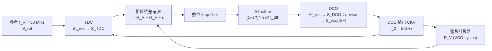

# 全數位 PLL：TDC 與 DCO 的量化雜訊也是同一條 ISF 記帳

> **先備**：[pll_noise_budget](/06_design_insights/pll_noise_budget)（五源預算、in-band 地板 $S_{ref}N^2+S_{cp}$、fractional-N ΔΣ 第三項的四步推導）、[varactor_tuning_supply_pushing](/06_design_insights/varactor_tuning_supply_pushing)（電壓→頻率→積分成相位的 $K_{VCO}^2S_v/\Delta f^2$ 管線）、[sampling_pll](/06_design_insights/sampling_pll)（把 divider 踢出迴路的另一條路）｜ **接下來**：[clock_chain_budget](/06_design_insights/clock_chain_budget)、[serdes_clocking_connection](/06_design_insights/serdes_clocking_connection)、[exercises](/06_design_insights/exercises)

## 這頁要回答什麼

[pll_noise_budget](/06_design_insights/pll_noise_budget) 的預算表裡有五個**類比**雜訊源：
reference、PFD/charge-pump、divider、loop filter、VCO。近二十年的主流卻越來越多是
**ADPLL（all-digital PLL，全數位鎖相環）**：把「PFD＋charge-pump＋類比 loop filter」換成
「**TDC（time-to-digital converter，時間數位轉換器，把兩個邊緣的時間差量成一個整數）**＋
數位 loop filter」，把 VCO 換成 **DCO（digitally controlled oscillator，數位控制振盪器，用一組
開關電容而不是連續的 varactor 電壓來調頻）**。這頁要回答：

1. **TDC 的有限時間解析度 $\Delta t_{res}$ 變成多少 in-band 相位雜訊？** 它是 charge-pump
   $S_{cp}$ 的數位替身，出現在預算表的同一個位置，但量級由「量化」而不是「電子雜訊」決定。
2. **DCO 的有限頻率解析度 $\Delta f_{res}$ 變成多少 out-of-band 相位雜訊？** 它是 VCO 的
   數位替身，走的是 [varactor 頁](/06_design_insights/varactor_tuning_supply_pushing) 那條
   「頻率誤差 → 積分成相位 → $1/\Delta f^2$」的管線。
3. **ΔΣ dithering 怎麼把 DCO 的 LSB 整形掉？** 這是
   [pll_noise_budget](/06_design_insights/pll_noise_budget) 已推過的 $(1-z^{-1})^m$ 整形，
   換一個地方再用一次。
4. **預算式怎麼改寫**：$S_{out}=(S_{ref}N^2+S_{TDC})\lvert H_{lp}\rvert^2+(S_{DCO}+S_{vco})\lvert H_{hp}\rvert^2$，
   以及為什麼 10 ps 的 TDC 會讓整個 in-band 預算輸給一顆普通的 charge-pump。

> **外部文獻聲明**：ADPLL 架構、TDC 與 DCO 量化雜訊的兩條標準公式**不在本站下載的 5 篇
> PDF 之內**（外部文獻，非本站 5 篇 PDF）。經典出處：R. B. Staszewski, J. L. Wallberg,
> S. Rezeq, C.-M. Hung, O. E. Eliezer, S. K. Vemulapalli, C. Fernando, K. Maggio,
> R. Staszewski, N. Barton, M.-C. Lee, P. Cruise, M. Entezari, K. Muhammad, and D. Leipold,
> *"All-Digital PLL and Transmitter for Mobile Phones,"* IEEE J. Solid-State Circuits,
> vol. 40, no. 12, pp. 2469–2482, Dec. 2005, doi:10.1109/JSSC.2005.857417；R. B. Staszewski and P. T. Balsara,
> *All-Digital Frequency Synthesizer in Deep-Submicron CMOS*, Wiley, 2006（兩處式號待查證）。
> 本頁的推導**完全自含**：兩條公式都由「均勻量化誤差 → 白化 → 進同一台積分器」逐步推出，
> 與本站既有的 ΔΣ 四步、varactor 管線一字不差；數值全部標示意（illustrative）。

> **物理直覺（先講結論）**：TDC 把相位誤差「四捨五入」到最近的 $\Delta t_{res}$，每個參考
> 週期丟一次骰子——這就是一個**取樣率 $f_R$ 的白噪相位誤差源**，直接坐在 PFD 的位子上，
> 被環路**低通**、跟 reference 一樣是 in-band 的地板；它的量級只看 $\Delta t_{res}/T_V$
> （量化步佔一個輸出週期的比例），**跟 $N$ 無關**。DCO 把控制字四捨五入到最近的
> $\Delta f_{res}$——這是一個**白噪頻率誤差源**，坐在 VCO 的位子上，被環路**高通**；而頻率誤差
> 要積分一次才變相位，所以它長得像 VCO 的 $1/f^2$ 裙邊、但由「量化步」而不是 device
> 雜訊決定。兩個新來的源都不是「電子雜訊」——它們是**設計者選的位元數**。ISF 理論負責的
> 那一項（DCO 自己的 device 雜訊 $\Gamma_{rms}^2/q_{max}^2$）完全沒變，只是旁邊多了兩個
> 量化的鄰居。

## 第 1 步：ADPLL 方塊圖與三個雜訊入口


```mermaid
flowchart LR
  REF["參考 f_R = 50 MHz<br/>S_ref"] --> TDC["TDC<br/>Δt_res → S_TDC"]
  CKV["DCO 輸出 CKV<br/>f_0 = 5 GHz"] --> TDC
  CKV --> CNT["整數計數器<br/>R_V (VCO cycles)"]
  TDC --> PD["相位誤差 φ_E<br/>= R_R − R_V − ε"]
  CNT --> PD
  PD --> DLF["數位 loop filter"]
  DLF --> DSM["ΔΣ dither<br/>(1−z⁻¹)^m @ f_dth"]
  DSM --> DCO["DCO<br/>Δf_res → S_DCO；device → S_vco(ISF)"]
  DCO --> CKV
```

三件事先講清楚，因為後面的「不乘 $N^2$」全靠它：

- **相位在 ADPLL 裡以「VCO cycle」為單位計數。** 參考每個週期把「應該累積的 cycle 數」
  $R_R$（frequency command word 的累加，可帶小數）加上去；計數器數 DCO 實際跑了幾圈 $R_V$
  （整數）；TDC 補上不足一圈的小數部分 $\varepsilon=\Delta t/T_V$（$\Delta t$ 是參考邊緣到下一個
  CKV 邊緣的時間差，$T_V=1/f_0$ 是 DCO 週期）。相位誤差 $\phi_E=R_R-R_V-\varepsilon$ 的單位是
  **輸出 cycle**，乘 $2\pi$ 就是輸出相位的 rad——這跟
  [pll_noise_budget](/06_design_insights/pll_noise_budget) 的 ΔΣ 第三項「誤差本來就以 VCO cycle
  計數」是**同一件事**，所以 TDC 雜訊也**不乘 $N^2$**。
- **沒有 charge-pump、沒有類比 loop filter。** $S_{cp}$、$S_{lf}$ 兩項消失，取而代之的是 TDC
  的量化 $S_{TDC}$。數位 loop filter 本身不加雜訊（有限字長效應另計）。
- **DCO 由一組開關電容（unit capacitor）控制。** 最細那一檔的頻率步 $\Delta f_{res}$ 就是
  「量化步」；DCO 的 device 雜訊（tank 損耗、主動元件）與 VCO 完全一樣，仍由 ISF 決定
  $S_{vco}\propto\Gamma_{rms}^2/q_{max}^2\cdot S_i/f^2$。

## 第 2 步：TDC 量化 → in-band 地板（四步，完全比照 ΔΣ 第三項）

TDC 用一串延遲單元（典型是 inverter chain）把 $\Delta t$ 量成整數個 $\Delta t_{res}$。
只要相位誤差夠「忙碌」（fractional-N、或有 dither），量化誤差就可以當白噪處理（「夠忙碌」的
具體門檻與不成立時的樣子，見後面的「數值驗證」一節）。逐步：

**（i）均勻量化誤差。** 量化誤差 $e_t$ 均勻分布於 $\pm\Delta t_{res}/2$：

$$
\sigma_{t}^2=\frac{\Delta t_{res}^2}{12}\qquad[\text{s}^2].
$$

（與 ΔΣ 第三項的 $\sigma_e^2=\Delta^2/12$ 同一條均勻分布公式，只是那裡的 $\Delta$ 是「cycle」，
這裡是「秒」。）

**（ii）時間誤差 → 輸出相位。** 一個輸出週期 $T_V$ 對應 $2\pi$ rad，所以

$$
\phi_{TDC}=2\pi\,\frac{e_t}{T_V}\quad\Longrightarrow\quad
\sigma_\phi^2=\frac{(2\pi)^2}{12}\Big(\frac{\Delta t_{res}}{T_V}\Big)^2\qquad[\text{rad}^2].
$$

這一步就是「**不乘 $N^2$**」的所在：$T_V$ 是**輸出**週期，$\phi_{TDC}$ 已經是輸出相位的
rad。若你堅持把它 referred to 參考端（用 $T_R=NT_V$ 去除），得到 $\phi/N$，到輸出還要 $\times N$、
功率 $\times N^2$，恰好對消——新手預算表最常見的錯就是替它多乘一次 $N^2$（與
[pll_noise_budget](/06_design_insights/pll_noise_budget) ΔΣ 節的第（iv）步同一個陷阱）。

**（iii）白化於 $f_R$。** TDC 每個參考週期出一個樣本，白序列的功率 $\sigma_\phi^2$ 平鋪在
$\pm f_R/2$（雙邊記帳）→ 每 Hz 密度 $\sigma_\phi^2/f_R$：

$$
\mathcal{L}_{TDC}=\frac{(2\pi)^2}{12}\Big(\frac{\Delta t_{res}}{T_V}\Big)^2\frac{1}{f_R},\qquad
S_{TDC}=2\,\mathcal{L}_{TDC}=\frac{(2\pi)^2}{6}\Big(\frac{\Delta t_{res}}{T_V}\Big)^2\frac{1}{f_R}
$$

（$S_{TDC}$ 單位 $\text{rad}^2/\text{Hz}$，單邊，referred to 輸出、尚未經環路）。
**factor-of-2 記帳 flag（每次都標）**：文獻慣用的 $1/12$ 版本是**雙邊**記帳，數值上剛好等於
SSB 的 $\mathcal{L}$（$\mathcal{L}\approx\tfrac12S_\phi$ 的 $\tfrac12$ 抵銷單邊化的 $\times2$）；
嚴格的本站**單邊** $S_\phi$ 慣例要 $\times2$（變 $1/6$）。這與 [P1] Eq.(21) 的 /4（SSB
記帳）vs 時域乾淨版 /2、與 ΔΣ 第三項的 $1/12$ vs $1/6$ 是同一類 factor-of-2 問題。

**（iv）進環路。** 它坐在 PFD 的位子上，與 $S_{ref}N^2$ 同路徑、被同一個
$\lvert H_{lp}\rvert^2$ 低通；在 $f\ll f_n$ 是一片**平坦地板**（白噪、沒有整形），一直平到
$f_R/2$。所以 TDC 是 ADPLL 的「in-band 地板決定者」——正如 charge-pump 之於類比 PLL。

**Dimension check**：$(2\pi)^2$ [rad²] $\times(\Delta t_{res}/T_V)^2$ [s²/s²＝無因次]
$\times1/f_R$ [s＝1/Hz] $=\text{rad}^2/\text{Hz}$ ✓。

### Worked example（例 1：10 ps 與 20 ps 的 TDC vs charge-pump 地板）

> **例 1**：$f_0=5$ GHz（$T_V=200$ ps）、$f_R=50$ MHz（$N=100$，同
> [pll_noise_budget](/06_design_insights/pll_noise_budget) 例 3）。求 $\Delta t_{res}=10$ ps 與
> 20 ps 的 $\mathcal{L}_{TDC}$，與該頁 in-band 地板 $-121.2$ dBc/Hz 相比；再反推「TDC 要多細
> 才打平 charge-pump」。

**逐步代入（10 ps）：**

1. 量化步佔週期的比例：$\Delta t_{res}/T_V=10/200=0.05$；平方 $2.5\times10^{-3}$（無因次）。
2. 前置因子：$(2\pi)^2/12=39.478/12=3.290$ [rad²]。
3. 相位方差：$3.290\times2.5\times10^{-3}=8.225\times10^{-3}\ \text{rad}^2$
   （$\sigma_\phi=90.7$ mrad，即 $\sigma_t=\Delta t_{res}/\sqrt{12}=2.887$ ps rms）。
4. 攤到 $f_R$：$8.225\times10^{-3}/(5\times10^7)=1.645\times10^{-10}$ →
   $\mathcal{L}_{TDC}=10\log_{10}(1.645\times10^{-10})=-97.8$ dBc/Hz。
5. 20 ps：$(\Delta t_{res}/T_V)^2$ 變 4 倍（$+6.02$ dB）→ $-91.8$ dBc/Hz。

**結果與解讀：** 10 ps 的 TDC 給出 $-97.8$ dBc/Hz 的平坦 in-band 地板，比類比 PLL 的
$-121.2$ dBc/Hz（reference$\times N^2$＋CP）**高 23.4 dB**。反推：要讓 $\mathcal{L}_{TDC}$ 等於
$7.5\times10^{-13}$（即 $-121.2$ dBc/Hz），需要
$\Delta t_{res}=T_V\sqrt{12\,\mathcal{L}\,f_R}/(2\pi)=0.675$ ps——比先進製程單級 inverter 的
延遲（數 ps 級）還細，靠單純的 inverter chain 做不到。**這就是 ADPLL 文獻近十年的主戰場**：(a) 用內插／Vernier／GRO（gated ring
oscillator）等技巧把 $\Delta t_{res}$ 做到 ps 以下；(b) **DTC 輔助**（digital-to-time converter，
先把參考邊緣依「預測的小數相位」平移，讓 TDC 只需量很小的殘差 → 可以用短、細、線性的
TDC）；(c) 乾脆用 **bang-bang PD（1-bit TDC）**——量化誤差不再是均勻白噪，而由輸入
jitter 線性化（本站 SerDes 章 bang-bang CDR 的 $K_{bb}$ 就是這個機制）。三條路的共同目標
都是把上面這條 $(\Delta t_{res}/T_V)^2$ 壓到跟 $S_{ref}N^2$ 同量級。

**Dimension check**：見上；$10\log_{10}$ 後讀 dBc/Hz ✓；反推式
$\text{s}\times\sqrt{[1/\text{Hz}]\cdot[\text{Hz}]}=\text{s}$ ✓。

```python
import numpy as np
f0, fR = 5e9, 50e6
T_V = 1/f0
for dt_res in (10e-12, 20e-12):
    L_tdc = (2*np.pi)**2/12*(dt_res/T_V)**2/fR
    print(round(dt_res*1e12), "ps", f"{L_tdc:.4e}", round(10*np.log10(L_tdc), 2))
# -> 10 ps 1.6449e-10 -97.84
# -> 20 ps 6.5797e-10 -91.82
sigma_t = 10e-12/np.sqrt(12); sigma_phi = 2*np.pi*sigma_t/T_V
print(round(sigma_t*1e12, 3), round(sigma_phi*1e3, 2), f"{sigma_phi**2/fR:.4e}")
# -> 2.887 90.69 1.6449e-10（σ_t ps、σ_φ mrad、σ_φ²/f_R = L_TDC）
L_cp = 0.5*1.5e-12
dt_eq = T_V*np.sqrt(12*L_cp*fR)/(2*np.pi)
print(round(10*np.log10(L_cp), 1), round(dt_eq*1e12, 3), round(10*np.log10(1.6449e-10/L_cp), 1))
# -> -121.2 0.675 23.4（類比 in-band 地板 ref×N²＋CP，dBc/Hz、打平所需 Δt_res ps、10 ps 高出 dB）
```

## 第 3 步：DCO 頻率量化 → $1/\Delta f^2$ 裙邊（重用 varactor 管線＋ZOH）

DCO 的控制字每個參考週期更新一次，最細一檔是 $\Delta f_{res}$。環路想要的頻率落在兩檔之間，
DCO 只能取最近的一檔——**頻率**量化誤差 $e_f$ 均勻分布於 $\pm\Delta f_{res}/2$。
接下來完全走 [varactor 頁](/06_design_insights/varactor_tuning_supply_pushing) 第 2 步的管線，
只是入口從「$K_{VCO}v_n$」換成「$e_f$」：

**（i）均勻頻率誤差。** $\sigma_f^2=\Delta f_{res}^2/12$ [Hz²]。

**（ii）ZOH（zero-order hold，零階保持）白化於 $f_R$。** 控制字在一個參考週期內不變
（保持 $T_R=1/f_R$），所以 $e_f(t)$ 是一個「取樣率 $f_R$ 的白序列經 ZOH」：功率 $\sigma_f^2$
平鋪在 $\pm f_R/2$（雙邊）給密度 $\sigma_f^2/f_R$，ZOH 的頻率響應大小平方是
$\mathrm{sinc}^2(f/f_R)$（$\mathrm{sinc}(x)=\sin(\pi x)/(\pi x)$）：

$$
S_{\Delta f}(f)=\frac{\Delta f_{res}^2}{12}\,\frac{1}{f_R}\,\mathrm{sinc}^2\Big(\frac{f}{f_R}\Big)\qquad[\text{Hz}^2/\text{Hz}].
$$

**（iii）頻率 → 相位：同一台積分器。** $\phi(t)=2\pi\int^t e_f\,dt'$，功率域乘
$(2\pi)^2/\Delta\omega^2=1/\Delta f^2$（varactor 頁第 2.3 步，$2\pi$ 上下約掉）：

$$
\mathcal{L}_{DCO}(\Delta f)=\frac{1}{12}\Big(\frac{\Delta f_{res}}{\Delta f}\Big)^2\frac{1}{f_R}\,\mathrm{sinc}^2\Big(\frac{\Delta f}{f_R}\Big),\qquad
S_{DCO}=2\,\mathcal{L}_{DCO}
$$

（同樣的 factor-of-2 flag：$1/12$ 是雙邊讀法＝SSB 數值，本站單邊 $S_\phi$ 要 $\times2$。）

**（iv）進環路。** 它坐在 VCO 的位子上，被 $\lvert H_{hp}\rvert^2$ **高通**——環路在 $f_n$ 內
會把它糾正掉（就像糾正 VCO 的 close-in 漂移），在 $f_n$ 外原樣漏出。形狀：$\Delta f\ll f_R$ 時
$\mathrm{sinc}^2\approx1$，$\mathcal{L}_{DCO}\propto1/\Delta f^2$——**每十倍頻降 20 dB**，跟
VCO 的白噪 $1/f^2$ 裙邊同斜率；靠近 $f_R/2$ 時 $\mathrm{sinc}^2$ 再多壓一點。

**Dimension check**：$(\Delta f_{res}/\Delta f)^2$ [Hz²/Hz²＝無因次] $\times1/f_R$ [1/Hz]
$\times\mathrm{sinc}^2$ [無因次] $=1/\text{Hz}$，相位無因次（rad）故讀作 $\text{rad}^2/\text{Hz}$ ✓
（與 varactor 頁 $K_{VCO}^2S_v/\Delta f^2$ 的單位論證相同）。

**與 ISF 的分工（跟 varactor 頁同一句話）**：$\Gamma$ 管「電流脈衝 $\Delta q$ 在哪個相位
打進 tank → 多少相位」；$\Delta f_{res}$ 管「準靜態的頻率步 → 積分成多少相位」。兩條路匯到
同一個 $1/\Delta\omega^2$ 積分器，這是本頁標題「同一條記帳」的意思。ISF 在 DCO 裡另有兩個
出場點：DCO 自己的 device 雜訊 $S_{vco}$（$\Gamma_{rms}^2/q_{max}^2$，完全不變）；以及切換
unit capacitor 時注入 tank 的電荷 kickback $\Delta q$——它打在哪個相位（$\Gamma(\omega_0\tau)$）
決定 dither 造成多少相位跳動與 spur（[P1] 操作型定義 $\Delta\phi=\Gamma\Delta q/q_{max}$）。

### Worked example（例 2：$\Delta f_{res}=10$ kHz 的 DCO）

> **例 2**：$f_0=5$ GHz、$f_R=50$ MHz、$\Delta f_{res}=10$ kHz（2 ppm）。求 $\Delta f=0.1$、1、
> 10 MHz 的 $\mathcal{L}_{DCO}$；換算最細 unit capacitor 的 $\Delta C$（tank $C=1$ pF）。

**逐步代入（1 MHz）：**

1. $(\Delta f_{res}/\Delta f)^2=(10^4/10^6)^2=10^{-4}$（無因次）。
2. $\times1/12=8.333\times10^{-6}$；$\times1/f_R=8.333\times10^{-6}/(5\times10^7)=1.667\times10^{-13}$。
3. ZOH：$\mathrm{sinc}^2(10^6/5\times10^7)=\mathrm{sinc}^2(0.02)=0.9987$（$-0.006$ dB，可忽略）。
4. $\mathcal{L}_{DCO}(1\text{ MHz})=10\log_{10}(1.665\times10^{-13})=-127.8$ dBc/Hz。
5. 0.1 MHz：$\times100$ → $-107.8$；10 MHz：$\times1/100$ 再乘 $\mathrm{sinc}^2(0.2)=0.875$
   （$-0.58$ dB）→ $-148.4$ dBc/Hz。每十倍頻 $-20$ dB（$\Delta f\to f_R/2$ 時 sinc 再加碼）。
6. unit capacitor：$f_0\propto1/\sqrt{LC}$ → $\Delta f_0/f_0=-\tfrac12\Delta C/C$ →
   $\Delta C=2C\,\Delta f_{res}/f_0=2\times10^{-12}\times10^4/(5\times10^9)=4.0$ aF。

**結果與解讀：** $-127.8$ dBc/Hz @ 1 MHz 比 lab_20 那顆 ring VCO 的 $-100$ dBc/Hz 低 27.8 dB
——ring-DCO 完全不在乎；但比本站 canonical 的 LC 值 $-148$ dBc/Hz（例 B）**高 20 dB**：
一顆好 LC-DCO 會被自己的量化雜訊淹沒。而 4 aF 的 unit capacitor 在物理上做不出來
（寄生電容都比它大兩個量級）——**所以 DCO 一定要 ΔΣ dithering**（第 4 步）：用做得出來的
較粗 unit cell（數十 aF～fF 級）在高速時脈下抖動，換取「平均」的細解析度。

**Dimension check**：$\Delta C=[\text{F}]\times[\text{Hz}]/[\text{Hz}]=\text{F}$ ✓。

```python
import numpy as np
f0, fR, df_res, C = 5e9, 50e6, 10e3, 1e-12
for df in (1e5, 1e6, 1e7):
    L_dco = (1/12)*(df_res/df)**2/fR*np.sinc(df/fR)**2
    print(round(df/1e6, 1), f"{L_dco:.4e}", round(10*np.log10(L_dco), 2), round(10*np.log10(np.sinc(df/fR)**2), 2))
# -> 0.1 1.6666e-11 -107.78 -0.0
# -> 1.0 1.6645e-13 -127.79 -0.01
# -> 10.0 1.4586e-15 -148.36 -0.58（MHz、線性、dBc/Hz、sinc² 修正 dB）
print(f"{2*C*df_res/f0*1e18:.1f}")
# -> 4.0（最細 unit capacitor，aF）
```

## 第 4 步：ΔΣ dithering——把 DCO 的 LSB 整形到高頻

做法：取一個比 $f_R$ 快得多的 dither 時脈 $f_{dth}$（通常由 CKV 除頻而來，例如 $f_0/8$），
用 $m$ 階 ΔΣ 調變器把「想要的分數頻率」轉成**一顆實體 unit cell** 的開／關序列。
先把兩個容易混在一起的「解析度」分開：

- **unit cell 步距 $\Delta f_u$**：被抖動的那顆實體電容切換一次，頻率跳多少。用例 2 的換算
  $\Delta f_u=f_0\,\Delta C_u/(2C)$ [Hz]。這是調變器**輸出**的一格。
- **平均（等效）解析度 $\Delta f_{eff}=\Delta f_u/2^{W}$**：$W$ 位元的分數控制字讓 unit cell 的
  **duty** 可以細調，長時間平均的頻率因此能放在 $\Delta f_u/2^W$ 的格點上。它只決定
  「平均頻率能放得多準」（靜態頻率誤差），**不進雜訊公式**。

整形後的雜訊功率由**調變器輸出的步距**決定，也就是 $\Delta f_u$——不是平均後的 $\Delta f_{eff}$。
理由很直接：unit cell 在任何一拍不是全開就是全關，瞬時頻率誤差的大小是 $\Delta f_u$ 的量級；
ΔΣ 沒有把這個誤差變小，只是把它的頻譜**搬到高頻**。

**逐步推導（外部文獻，非本站 5 篇 PDF；代數與
[pll_noise_budget](/06_design_insights/pll_noise_budget) ΔΣ 第三項相同，只是被整形的是頻率、
取樣率是 $f_{dth}$）：**

**（i）調變器輸出與誤差。** 輸入 $x[k]$ 是想要的分數（單位：cell，$0\le x\lt1$），輸出 $v[k]$ 是
整數個 cell。$m$ 階調變器滿足 $v=x+(1-z^{-1})^m e$，其中 $e$ 是量化器的誤差，在白噪模型下
均勻分布於 $\pm\tfrac12$ cell：$\sigma_e^2=1/12$ [cell²]。

**（ii）換成頻率。** 每個 cell 值 $\Delta f_u$ [Hz/cell]，頻率誤差的方差
$\sigma_f^2=\Delta f_u^2/12$ [Hz²]。

**（iii）白化於 $f_{dth}$、整形、ZOH。** 每個 dither 週期出一個樣本，功率平鋪在
$\pm f_{dth}/2$（雙邊）→ 密度 $\sigma_f^2/f_{dth}$；$(1-z^{-1})^m$ 的大小平方是
$\lvert1-e^{-j2\pi f/f_{dth}}\rvert^{2m}=[2\sin(\pi f/f_{dth})]^{2m}$（無因次）；cell 的狀態保持
$1/f_{dth}$（ZOH）再乘 $\mathrm{sinc}^2(f/f_{dth})$：

$$
S_{\Delta f}(f)=\frac{\Delta f_{u}^2}{12}\,\frac{1}{f_{dth}}\Big[2\sin\Big(\frac{\pi f}{f_{dth}}\Big)\Big]^{2m}\mathrm{sinc}^2\Big(\frac{f}{f_{dth}}\Big)\qquad[\text{Hz}^2/\text{Hz}].
$$

**（iv）頻率 → 相位。** 過第 3 步的同一台 $1/\Delta f^2$ 積分器：

$$
\mathcal{L}_{DCO,\Delta\Sigma}(\Delta f)=\frac{1}{12}\Big(\frac{\Delta f_{u}}{\Delta f}\Big)^2\frac{1}{f_{dth}}\Big[2\sin\Big(\frac{\pi\Delta f}{f_{dth}}\Big)\Big]^{2m}\mathrm{sinc}^2\Big(\frac{\Delta f}{f_{dth}}\Big).
$$

（同樣的 factor-of-2 flag：$1/12$ 是雙邊讀法＝SSB 數值，本站單邊 $S_\phi$ 要 $\times2$。）

**（v）低 offset 近似。** $\Delta f\ll f_{dth}$ 時 $2\sin(\pi\Delta f/f_{dth})\approx2\pi\Delta f/f_{dth}$、
$\mathrm{sinc}^2\approx1$：

$$
\mathcal{L}_{DCO,\Delta\Sigma}\approx\frac{(2\pi)^{2m}}{12}\,\frac{\Delta f_u^{2}\,\Delta f^{\,2m-2}}{f_{dth}^{\,2m+1}},\qquad
m=1:\ \ \mathcal{L}\approx\frac{\pi^2}{3}\,\frac{\Delta f_u^2}{f_{dth}^3}\ \ (\text{與 }\Delta f\text{ 無關}).
$$

三個效應疊在一起：

- **$m=0$（只是抖快、不整形）**：功率 $\Delta f_{u}^2/12$ 攤到 $\pm f_{dth}/2$，仍是 $1/\Delta f^2$
  裙邊，只是比「同一步距、每 $1/f_R$ 更新一次」低 $10\log_{10}(f_{dth}/f_R)$。
- **$m=1$**：整形 $+20$ dB/dec 恰好抵銷積分器的 $-20$ dB/dec → $\mathcal{L}$ 變成一片**平坦
  地板** $\propto\Delta f_u^2/f_{dth}^3$：unit cell 每縮一半 $-6$ dB、$f_{dth}$ 每加倍 $-9$ dB。
  平坦地板對上 DCO 熱雜訊的 $1/\Delta f^2$ 裙邊，**一定在某個 offset 以外反超**，所以要看的是
  「交叉點落在哪」。
- **$m=2$**：淨 $+20$ dB/dec 上爬——低 offset 比 $m=1$ 更低，高 offset 的 hump 更高。DCO 量化
  雜訊走的是**高通**路徑，$f_n$ 以外環路完全不衰減，hump 原樣出現在輸出，只剩 $f_{dth}$ 處的
  sinc 零點與後級濾波能壓。這是 DCO dither 與 fractional-N divider dither 的**關鍵不同**——
  後者是低通路徑、環路會砍高頻。二階（例如 MASH 1-1）的輸出跨 4 個準位，要同時抖 3 顆
  unit cell；公式裡的步距仍是單顆的 $\Delta f_u$。因此 DCO 端通常只用一階或二階、並把
  $f_{dth}$ 開高。

**Dimension check**：$\Delta f_u^2/\Delta f^2$ [無因次] $\times1/f_{dth}$ [1/Hz]，其餘因子無因次
→ $\text{rad}^2/\text{Hz}$ ✓；近似式 $\text{Hz}^2\cdot\text{Hz}^{2m-2}/\text{Hz}^{2m+1}=1/\text{Hz}$ ✓。

**白噪模型的但書**：$e$ 是白噪只在調變器輸入「忙碌」或加了 dither 時成立。一階調變器吃
**靜止**的輸入會產生 idle tone（離散尖刺），總功率不變但不是平坦地板（見數值驗證 D3）。

### Worked example（例 3：40 aF 與 1 fF 的 unit cell，dither @ $f_0/8$）

> **例 3**：承例 2 的 tank（$f_0=5$ GHz、$C=1$ pF）。兩顆做得出來的 unit cell：
> $\Delta C_u=40$ aF 與 $1$ fF。$f_{dth}=f_0/8=625$ MHz。求 $\Delta f=1$ MHz 與 10 MHz 處
> $m=0,1,2$ 的 $\mathcal{L}_{DCO,\Delta\Sigma}$，與 LC-DCO 的熱雜訊裙邊（例 B：1 MHz 處
> $-148.0$ dBc/Hz、$1/\Delta f^2$）相比。

**逐步代入：**

1. unit cell 步距：$\Delta f_u=f_0\Delta C_u/(2C)$。40 aF →
   $5\times10^9\times40\times10^{-18}/(2\times10^{-12})=100$ kHz；1 fF → $2.5$ MHz。
   （例 2 的 10 kHz 在這裡**不出現**：它只是平均解析度的目標，$W=4$ 位元的 40 aF cell 給
   $100/2^4=6.25$ kHz、$W=8$ 位元的 1 fF cell 給 $2500/2^8=9.77$ kHz，都達得到。）
2. $m=0$、1 MHz、40 aF：$(10^5/10^6)^2/12/(6.25\times10^8)=1.333\times10^{-12}$ → $-118.8$ dBc/Hz。
   1 fF 的步距大 25 倍（$+27.96$ dB）→ $-90.8$ dBc/Hz。
3. 整形因子：$2\sin(\pi\times10^6/6.25\times10^8)=2\sin(5.027\times10^{-3})=1.0053\times10^{-2}$；
   平方 $1.011\times10^{-4}$（$-40.0$ dB）。$m=1$：40 aF → $-158.7$、1 fF → $-130.7$ dBc/Hz。
   用近似式核對：$(\pi^2/3)(10^5)^2/(6.25\times10^8)^3=1.347\times10^{-16}$ → $-158.7$ ✓。
4. $m=2$：再乘一次整形因子。1 MHz：40 aF → $-198.7$、1 fF → $-170.7$；10 MHz（整形因子
   $+20$ dB）：40 aF → $-178.7$、1 fF → $-150.7$ dBc/Hz。
5. LC-DCO 熱雜訊（例 B）：1 MHz $-148.0$、10 MHz $-168.0$ dBc/Hz。**記帳族別 flag**：這是
   [P1] Eq.(21) 的 $/4$（SSB 記帳）族；$/2$ 族（[P2] Eq.(6) 那一族）是 $-145.0$。下表用較嚴的
   $-148.0$；換成 $/2$ 族，所有差值往有利方向移 3 dB，結論不變。

**結果（量化雜訊 − 熱雜訊，正值＝量化雜訊較高）：**

| unit cell（$\Delta f_u$） | $m$ | 1 MHz | 對 $-148.0$ | 10 MHz | 對 $-168.0$ | 與熱雜訊的交叉點 |
|---|---|---|---|---|---|---|
| 40 aF（100 kHz） | 1 | $-158.7$ | $-10.7$ dB | $-158.7$ | $+9.3$ dB | 3.43 MHz 以外反超 |
| 40 aF（100 kHz） | 2 | $-198.7$ | $-50.7$ dB | $-178.7$ | $-10.7$ dB | 18.5 MHz 以外反超 |
| 1 fF（2.5 MHz） | 1 | $-130.7$ | $+17.3$ dB | $-130.8$ | $+37.3$ dB | 0.14 MHz 以外反超 |
| 1 fF（2.5 MHz） | 2 | $-170.7$ | $-22.7$ dB | $-150.7$ | $+17.3$ dB | 3.69 MHz 以外反超 |

**解讀（誠實版）：**

- **一階 dither 夠不夠，取決於 unit cell 多大。** 40 aF 的 cell 在 1 MHz 比 LC 熱雜訊低
  10.7 dB；1 fF 的 cell 則**高 17.3 dB**——一階 dither 救不了一顆 1 fF 的 cell，LC-DCO 的
  $-148$ 會被自己的量化雜訊蓋掉。
- **要多小才夠？** 以「比熱雜訊低 10 dB」為準：$f_0/8$、$m=1$ 在 1 MHz 需要
  $\Delta f_u\le108$ kHz（$\Delta C_u\le43$ aF）；若 10 MHz 也要守住，需要 $\Delta f_u\le10.8$ kHz
  （4.3 aF）——又回到做不出來的尺寸。
- **1 fF 的 cell 要怎麼救？** 階數和 dither 頻率一起上：$m=2$、$f_{dth}=f_0/2=2.5$ GHz 給
  1 MHz $-200.8$、10 MHz $-180.8$ dBc/Hz（對 $-168.0$ 低 12.8 dB；同條件下 cell 上限
  1.38 fF）。只升階不升頻（$m=2$、$f_0/8$）在 3.69 MHz 以外就反超；只升頻不升階
  （$m=1$、$f_0/2$）是平坦的 $-148.8$ dBc/Hz，在 1 MHz 剛好跟熱雜訊打平。
- **40 aF 的 cell**：$m=1$、$f_0/2$ 把 10 MHz 守住的上限放寬到 35 aF（差一點）；$m=2$、$f_0/8$
  在 10 MHz 低 10.7 dB，交叉點 18.5 MHz。
- **代價**：unit cell 每 1.6 ns（$f_0/8$）切換一次，每次切換都是一個 $\Delta q$ 打進 tank——ISF
  說它打在哪個相位決定相位跳多少（$\Delta\phi=\Gamma(\omega_0\tau)\Delta q/q_{max}$），$f_{dth}$
  與 $f_0$ 同步時這些跳動在固定相位重複，是 spur 的來源之一。公式只說「量化」這一份；
  dither 時脈自己的 jitter、kickback spur、cell 之間的 mismatch 另計。

**Dimension check**：$\Delta f_u=[\text{Hz}]\times[\text{F}]/[\text{F}]=\text{Hz}$ ✓；其餘同上。

```python
import numpy as np
f0, C = 5e9, 1e-12
f_dth = f0/8
def L_q(df_u, df, m, fd=f_dth):
    return (1/12)*(df_u/df)**2/fd*(2*np.sin(np.pi*df/fd))**(2*m)*np.sinc(df/fd)**2
def L_th(df):
    return 0.25/1e-12**2*1e-24/(4*(2*np.pi*df)**2)       # [P1] Eq.(21), /4 family
dB = lambda x: round(float(10*np.log10(x)), 1)
print(dB(L_th(1e6)), dB(L_th(1e7)), dB(2*L_th(1e6)))
# -> -148.0 -168.0 -145.0（熱雜訊 1 MHz、10 MHz；/2 族的 1 MHz）
for dC in (40e-18, 1e-15):
    df_u = f0*dC/(2*C)
    print(round(dC*1e18), round(df_u/1e3), [dB(L_q(df_u, 1e6, m)) for m in (0, 1, 2)],
          [dB(L_q(df_u, 1e7, m)) for m in (1, 2)])
    print([dB(L_q(df_u, d, m)/L_th(d)) for m in (1, 2) for d in (1e6, 1e7)])
# -> 40 100 [-118.8, -158.7, -198.7] [-158.7, -178.7]
# -> [-10.7, 9.3, -50.7, -10.7]
# -> 1000 2500 [-90.8, -130.7, -170.7] [-130.8, -150.7]
# -> [17.3, 37.3, -22.7, 17.3]（aF、kHz、1 MHz 的 m=0,1,2、10 MHz 的 m=1,2；下一行為對熱雜訊的差 dB）
print(dB(np.pi**2/3*1e5**2/f_dth**3), dB(4), dB(8))
# -> -158.7 6.0 9.0（m=1 近似式；cell 減半、f_dth 加倍各賺的 dB）
for fd, m, d in ((f0/8, 1, 1e6), (f0/8, 1, 1e7), (f0/2, 1, 1e7), (f0/2, 2, 1e7)):
    df_u = 1e5*np.sqrt(0.1*L_th(d)/L_q(1e5, d, m, fd))   # 10 dB below thermal
    print(round(fd/1e6), m, round(d/1e6), round(df_u/1e3, 1), round(2*C*df_u/f0*1e18, 1))
# -> 625 1 1 108.4 43.4
# -> 625 1 10 10.8 4.3
# -> 2500 1 10 86.7 34.7
# -> 2500 2 10 3450.4 1380.2（f_dth MHz、m、offset MHz、步距上限 kHz、cell 上限 aF）
print(dB(L_q(2.5e6, 1e6, 2, f0/2)), dB(L_q(2.5e6, 1e7, 2, f0/2)), dB(L_q(2.5e6, 1e6, 1, f0/2)))
# -> -200.8 -180.8 -148.8（1 fF：m=2 @ f0/2 的 1、10 MHz；m=1 @ f0/2）
print([round(x) for x in (1e5/2**4, 2.5e6/2**8)])
# -> [6250, 9766]（平均解析度 Hz：40 aF 配 4 位元、1 fF 配 8 位元）
from scipy.optimize import brentq
print([round(brentq(lambda d: np.log(L_q(u, d, m)/L_th(d)), 1e4, 2e8)/1e6, 2)
       for u, m in ((1e5, 1), (1e5, 2), (2.5e6, 1), (2.5e6, 2))])
# -> [3.43, 18.5, 0.14, 3.69]（與熱雜訊裙邊的交叉 offset，MHz）
```

## 第 5 步：ADPLL 預算式與 worked example

把兩個新源放進 [pll_noise_budget](/06_design_insights/pll_noise_budget) 的框架：

$$
S_{out}(f)=\big(S_{ref}N^2+S_{TDC}\big)\lvert H_{lp}\rvert^2+\big(S_{DCO}+S_{vco}\big)\lvert H_{hp}\rvert^2 .
$$

- $S_{TDC}$ 取代 $S_{cp}$（同位子、同低通、同「不乘 $N^2$」），$S_{DCO}$ 與 $S_{vco}$ 並列
  （同位子、同高通）。fractional-N 的 ΔΣ 第三項在 ADPLL 裡**不存在**——分數頻率由
  $R_R$ 的小數累加直接處理，沒有 divider 抖動；但 TDC 的**非線性**會把 $R_R$ 小數的週期
  pattern 變成 fractional spur（見適用與失效）。
- $\lvert H_{lp}\rvert^2,\lvert H_{hp}\rvert^2$ 沿用 [pll_noise_budget](/06_design_insights/pll_noise_budget) 的 type-II 二階閉環（數位 loop
  filter 的 $z$ 域實作在 $f\ll f_R$ 時與其連續時間近似一致）。

> **例 4**：用 [pll_noise_budget](/06_design_insights/pll_noise_budget) lab_20 的 $S_{ref}$、
> $S_{vco}$（ring toy，$\mathcal{L}_{vco}(1\text{ MHz})=-100$ dBc/Hz）、$N=100$、$\zeta=0.707$，
> 加上例 1 的 $S_{TDC}$（10 ps 與 1 ps）與例 2 的 $S_{DCO}$（未 dither）。(a) $f_n=1$ MHz 時
> $\Delta f=1$ MHz 的 spot 值；(b) $f_n=6.9$ MHz（類比版最佳點）的積分 jitter（1 kHz–1 GHz）；
> (c) ADPLL 自己的最佳 $f_n$。

**逐步（spot，10 ps）：**

1. in-band 項：$S_{ref}N^2=10^{-12}$、$S_{TDC}=2\times1.645\times10^{-10}=3.29\times10^{-10}$
   （單邊）；$\lvert H_{lp}(1\text{ MHz})\rvert^2=1.50$（peaking）→ $4.95\times10^{-10}$。
2. out-of-band 項：$S_{DCO}=2\times1.665\times10^{-13}=3.33\times10^{-13}$、$S_{vco}=2\times10^{-10}$；
   $\lvert H_{hp}\rvert^2=0.50$ → $1.00\times10^{-10}$。
3. 合計 $5.95\times10^{-10}$ → $\mathcal{L}=10\log_{10}(\tfrac12\times5.95\times10^{-10})=-95.3$ dBc/Hz。
   **TDC 一項就佔 83%**——連 ring VCO 都被它蓋過。
4. 1 ps：$S_{TDC}$ 降 100 倍 → in-band $6.4\times10^{-12}$，合計由 VCO 主宰 → $-102.7$ dBc/Hz。

**結果（積分 jitter）：**

| 架構 | $f_n$ | $\sigma_t$ | 解讀 |
|---|---|---|---|
| 類比 CP-PLL（$S_{cp}=5\times10^{-13}$） | 6.9 MHz | 259 fs | pll_noise_budget 最佳點 |
| ADPLL、$\Delta t_{res}=10$ ps | 6.9 MHz | 2773 fs | TDC 地板被寬 BW 全部搬出 |
| ADPLL、$\Delta t_{res}=10$ ps | 0.47 MHz（自己的最佳） | 1001 fs | 只能收窄 BW，VCO 又漏出：$3.9\times$ 類比版 |
| ADPLL、$\Delta t_{res}=1$ ps | 6.9 MHz | 363 fs | 接近類比版 |
| ADPLL、$\Delta t_{res}=1$ ps | 3.84 MHz（自己的最佳） | 338 fs | 最佳 BW 略窄（TDC 地板仍比類比 in-band 地板 $-121.2$ 高 3.4 dB） |

**解讀：** 這就是「為什麼 ADPLL 需要細 TDC／DTC 輔助／BB-PD」的數字版。10 ps 的 TDC 把
最佳 jitter 從 259 fs 推到 1 ps，而且逼你把 BW 收窄 15 倍——對吵的 ring-DCO 是災難；
1 ps 的 TDC 才回到同一個量級。反過來，$S_{DCO}$（未 dither）在這顆 ring toy 裡完全看不見
（低 28 dB）；只有換成 LC-DCO 時它才浮出來，那時就要第 4 步的 dither——而且 unit cell 要夠小
（例 3；LC-DCO 版的預算見下一節的數值驗證）。

**Dimension check**：$\int S_{out}\,df$ [rad²] → $\sigma_\phi/(2\pi f_0)$：rad/(rad/s)＝s ✓。

```python
import numpy as np
from simulations.common.pll_utils import H_lowpass_mag2, H_highpass_mag2
f0, fR, N = 5e9, 50e6, 100
T_V = 1/f0
f = np.logspace(3, 9, 3000)
S_ref = 1e-16 + 1e-18*(1e6/f)                       # 同 pll_noise_budget 表
S_vco = 2e-10*(1e6/f)**2                            # ring toy, L(1 MHz) = -100 dBc/Hz
S_dco = 2*(1/12)*(1e4/f)**2/fR*np.sinc(f/fR)**2     # 單邊 = 2 L_DCO
def S_tdc(dt_res):
    return 2*(2*np.pi)**2/12*(dt_res/T_V)**2/fR     # 單邊 = 2 L_TDC
def sigma_t(S_out):
    return np.sqrt(np.trapezoid(S_out, f))/(2*np.pi*f0)
fn = 1e6
lp1, hp1 = H_lowpass_mag2(np.array([1e6]), fn)[0], H_highpass_mag2(np.array([1e6]), fn)[0]
for dt in (10e-12, 1e-12):
    inb = (1e-12 + S_tdc(dt))*lp1
    outb = (S_dco[np.argmin(abs(f-1e6))] + 2e-10)*hp1
    print(round(dt*1e12), f"{inb:.3e}", f"{outb:.3e}", round(10*np.log10(0.5*(inb + outb)), 1))
# -> 10 4.950e-10 1.002e-10 -95.3
# -> 1 6.435e-12 1.002e-10 -102.7（Δt_res ps、in-band、out-of-band rad²/Hz、L dBc/Hz）
fn = 6.9e6
lp, hp = H_lowpass_mag2(f, fn), H_highpass_mag2(f, fn)
print(round(sigma_t((S_ref*N**2 + 5e-13)*lp + S_vco*hp)*1e15))
# -> 259（類比 CP-PLL，fs）
for dt in (10e-12, 1e-12):
    print(round(dt*1e12), round(sigma_t((S_ref*N**2 + S_tdc(dt))*lp + (S_dco + S_vco)*hp)*1e15))
# -> 10 2773
# -> 1 363（ADPLL @ f_n = 6.9 MHz，fs）
fns = np.logspace(4.5, 7.5, 60)
for dt in (10e-12, 1e-12):
    jit = [sigma_t((S_ref*N**2 + S_tdc(dt))*H_lowpass_mag2(f, x) + (S_dco + S_vco)*H_highpass_mag2(f, x)) for x in fns]
    k = int(np.argmin(jit))
    print(round(dt*1e12), round(fns[k]/1e6, 2), round(jit[k]*1e15))
# -> 10 0.47 1001
# -> 1 3.84 338（ADPLL 自己的最佳 f_n MHz、σ_t fs）
```

## 數值驗證（lab_44：量化雜訊的時域模擬）

前面兩條量化雜訊公式都建立在「誤差是白噪」這個模型上。
`simulations/lab_44_adpll_quantization.py` 直接在時域產生量化誤差序列、估 PSD，再跟公式比；
同時把例 3 的 unit cell 放進一顆 **LC-DCO** 的預算（例 4 用的是 ring toy，看不到 DCO 量化）。


**模擬設定（全部是 open-loop、phase-domain 的 toy）：**

| 實驗 | 做法 | 取樣率／長度 |
|---|---|---|
| T1 | TDC 輸入＝分數斜坡（小數 0.381966）＋ rms $=\Delta t_{res}/2$ 的隨機 jitter，均勻量化（$\Delta t_{res}=10$ ps） | $f_R=50$ MHz、$2^{20}$ 點 |
| T2 | 同上但**沒有** jitter（小數 $6257/16384$，純確定性斜坡） | 同上 |
| T3 | integer-N：靜態偏移 $0.3\,\Delta t_{res}$＋rms $0.02\,\Delta t_{res}$ 的 jitter | 同上 |
| D1 | 一階 ΔΣ、輸入每拍均勻擾動滿一個 cell（白噪模型嚴格成立的理想化），只取誤差 $v-x$ 積分成相位 | $f_{dth}=625$ MHz、$2^{22}$ 點 |
| D2 | 二階 MASH 1-1、**靜止**輸入（0.381966） | 同上 |
| D3 | 一階、**靜止**輸入（$1565/4096$）、不加 dither | 同上 |
| D4 | 一階、靜止輸入＋量化器前加 1 cell 寬的均勻 dither | 同上 |

**結果：**

| 項目 | 公式 | 模擬 | 模擬／公式 |
|---|---|---|---|
| T1：TDC 地板 | $-97.84$ dBc/Hz | $-97.83$ dBc/Hz | 1.00 |
| D1：40 aF、$m=1$ @ 1 MHz | $-158.70$ | $-158.68$ | 1.01 |
| D2：40 aF、$m=2$ @ 1 MHz | $-198.66$ | $-198.63$ | 1.01 |
| D1：1 fF、$m=1$ @ 1 MHz | $-130.75$ | $-130.72$ | 1.01 |
| D2：1 fF、$m=2$ @ 1 MHz | $-170.70$ | $-170.67$ | 1.01 |
| D4：$m=1$＋量化器 dither | 同 D1 | 高 3.0 dB | 1.99 |

- **公式在白噪模型成立時準到 1% 以內**，而且代進去的步距確實是 unit cell 的 $\Delta f_u$
  （100 kHz、2.5 MHz）——圖 (b) 的兩組曲線相差 $20\log_{10}25=28$ dB，正是步距比的平方。
- **白噪假設不成立的三種樣子：**
  - **T2（無雜訊的分數斜坡）**：誤差的 rms 仍是 $\Delta t_{res}/\sqrt{12}$（比值 1.00），但它是一條
    週期鋸齒，**94% 的功率集中在 10 根線上**，最強的一根在迴路濾波前是 $-26.0$ dBc
    （鋸齒基波：相位峰值 $2\Delta t_{res}/T_V=0.1$ rad）。這就是 fractional spur——即使 TDC 完全
    線性也會有；「平坦地板」要靠輸入裡有與 $\Delta t_{res}$ 可比的隨機成分或 dither 才成立。
  - **T3（integer-N、靜態偏移、jitter 遠小於一格）**：TDC 輸出碼只有 **1 個值**——沒有量化
    「雜訊」，TDC 根本看不見相位在動（dead zone）；實際迴路會漂到格線上變成 bang-bang
    式的 limit cycle，那已經不是這條公式描述的東西。
  - **D3（一階 ΔΣ、靜止輸入）**：相位方差與白噪模型相同（比值 1.00），但 94% 集中在 idle
    tone；最強一根是 $20\log_{10}(\Delta f_u/f_{dth})$：1 fF → $-48.0$ dBc、40 aF → $-75.9$ dBc。
- **D4 的教訓**：在量化器前加 1 cell 寬的 dither 能把 tone 打散成白噪，但 dither 本身也被當成
  誤差一起整形，功率變兩倍（$1/12\to1/6$，$+3$ dB）。二階（D2）即使輸入靜止也已經夠白。

**LC-DCO 預算（圖 (c)）。** 把 $S_{vco}$ 換成 site canonical 的 LC 熱雜訊（1 MHz 處
$-148.0$ dBc/Hz、$/4$ 族、$1/f^2$），其餘同例 4（$S_{ref}$、$N=100$、$\zeta=0.707$、積分
1 kHz–1 GHz），對每一列各自找最佳 $f_n$：

| 架構 | DCO 量化 | 最佳 $f_n$ | $\sigma_t$ | 其中量化單獨貢獻 |
|---|---|---|---|---|
| 類比 CP-PLL（$S_{cp}=5\times10^{-13}$） | — | 25 kHz | 17.8 fs | — |
| ADPLL、1 ps TDC | 無（理想 DCO） | 15 kHz | 22.2 fs | — |
| ADPLL、1 ps TDC | 40 aF、$m=1$、$f_0/8$ | 15 kHz | 23.5 fs | 7.5 fs |
| ADPLL、1 ps TDC | 40 aF、$m=2$、$f_0/8$ | 15 kHz | 24.1 fs | 9.2 fs |
| ADPLL、1 ps TDC | 1 fF、$m=1$、$f_0/8$ | 16 kHz | 189.8 fs | 188.5 fs |
| ADPLL、1 ps TDC | 1 fF、$m=2$、$f_0/8$ | 15 kHz | 231.8 fs | 230.7 fs |
| ADPLL、1 ps TDC | 1 fF、$m=1$、$f_0/2$ | 15 kHz | 49.4 fs | 44.2 fs |
| ADPLL、1 ps TDC | 1 fF、$m=2$、$f_0/2$ | 15 kHz | 53.0 fs | 48.1 fs |

- 40 aF 的 cell 幾乎不傷（22.2 → 23.5 fs），ADPLL 與類比版（17.8 fs）的差距來自 1 ps TDC
  地板（$-117.8$）比類比 in-band 地板（$-121.2$）高 3.4 dB。
- 1 fF 的 cell 讓積分 jitter 變成 190 fs 級——**整顆 PLL 由 DCO 量化決定**。
- **spot 值與積分值會給出不同的排名**：1 fF 的 cell 升到 $m=2$ 在 1 MHz 好了 40 dB，積分
  jitter 卻從 188.5 變 230.7 fs——高頻 hump 走高通路徑、環路不砍，一路積到 1 GHz。要壓積分
  jitter，有效的是縮小 unit cell（$\sigma_t\propto\Delta f_u$）與提高 $f_{dth}$，不是升階。
- 10 ps 的 TDC 配這顆 LC-DCO：最佳 $f_n$ 落在掃描下限 1 kHz（等於積分下限），$\sigma_t=58.7$ fs
  ——地板太高，環路寧可幾乎不鎖；這一列只當定性參考。

```python
import numpy as np
from simulations.lab_44_adpll_quantization import tdc_experiment, dco_experiment, budget_experiment
dB = lambda x: round(float(10*np.log10(x)), 2)
tdc = tdc_experiment()
print(dB(tdc["theory"]), dB(tdc["T1"]["L_band"]), round(tdc["T1"]["ratio"], 2))
# -> -97.84 -97.83 1.0（L_TDC 公式、T1 模擬 dBc/Hz、模擬／公式）
print(round(tdc["T2"]["rms_ratio"], 2), round(100*tdc["T2"]["frac_top10"]), round(tdc["T2"]["spur_dbc"], 1), tdc["T3"]["codes"])
# -> 1.0 94 -26.0 1（T2 rms 比、前 10 根線佔的功率 %、最強 spur dBc；T3 的 TDC 輸出碼個數）
dco = dco_experiment()
for tag in ("40aF", "1fF"):
    d = dco[tag]
    print(tag, [dB(d[k]["L_1M"]) for k in ("D1", "D2")], [round(d[k]["ratio"], 2) for k in ("D1", "D2", "D4")], round(d["D3"]["spur_dbc"], 1))
# -> 40aF [-158.68, -198.63] [1.01, 1.01, 1.99] -75.9
# -> 1fF [-130.72, -170.67] [1.01, 1.01, 1.99] -48.0（m=1、m=2 模擬 dBc/Hz @ 1 MHz；D1、D2、D4 的模擬／公式；D3 idle tone dBc）
bud = budget_experiment()
print([(round(fn/1e3), round(float(j)*1e15, 1)) for kind, dt, name, fn, j in bud["rows"] if dt != 10e-12])
# -> [(25, 17.8), (15, 22.2), (15, 23.5), (16, 189.8), (15, 231.8), (15, 53.0), (15, 49.4), (15, 24.1)]
print([round(float(j)*1e15, 1) for _, j in bud["q_only"]])
# -> [7.5, 188.5, 230.7, 48.1, 44.2, 9.2]
print([(round(fn/1e3), round(float(j)*1e15, 1)) for kind, dt, name, fn, j in bud["rows"] if dt == 10e-12][:1])
# -> [(1, 58.7)]
```

三個列表的順序：第一個是（最佳 $f_n$ kHz、$\sigma_t$ fs），依序為類比、理想 DCO、40 aF $m=1$ @
$f_0/8$、1 fF $m=1$ @ $f_0/8$、1 fF $m=2$ @ $f_0/8$、1 fF $m=2$ @ $f_0/2$、1 fF $m=1$ @ $f_0/2$、
40 aF $m=2$ @ $f_0/8$；第二個是量化單獨的 $\sigma_t$（fs，同順序、去掉前兩項）；第三個是
10 ps TDC＋理想 DCO。

**限制（誠實聲明）：**

- 模擬是 **open-loop** 的誤差序列，不是閉迴路 ADPLL 的時域模擬；圖 (c) 與上表是把解析公式
  代進 type-II 連續時間 $\lvert H\rvert^2$ 的結果，沒有數位 latency、沒有 $z$ 域效應。
- 量化器理想（無 DNL/INL、無 metastability）；unit cell 理想（無 mismatch、無切換 kickback、
  dither 時脈無 jitter）。這些在實際電路裡常常比「量化」這一份更早成為限制。
- 圖 (b) 的模擬曲線在 100 MHz 以上偏離公式：模擬估的是以 $f_{dth}$ **取樣**的相位，含摺疊；
  公式是連續時間頻譜。比值只在 0.5–2 MHz 的頻帶內取。
- 積分到 1 GHz 而且沒有放輸出 buffer 的遠端白噪地板；真實 LC 振盪器的 $1/f^2$ 裙邊不會一路
  降到 $-200$ dBc/Hz，所以表中 20 fs 級的絕對值偏樂觀，**排名與量級差**才是可信的部分。
- 熱雜訊用 $/4$ 族的 $-148.0$；換 $/2$ 族（$-145.0$）熱雜訊一項的 $\sigma_t$ 乘 $\sqrt2$，量化那
  幾列不變。

## Design knobs 清單

| 旋鈕 | 影響 | 怎麼調 |
|---|---|---|
| TDC 解析度 $\Delta t_{res}$ | in-band 地板 $\propto(\Delta t_{res}/T_V)^2$（$-6$ dB／減半） | 內插、Vernier、GRO；DTC 輔助讓 TDC 只量殘差；或改 BB-PD |
| 輸出週期 $T_V$ | 同一顆 TDC 在高 $f_0$ 更吃虧（$\Delta t_{res}/T_V$ 變大） | 高頻輸出更需要細 TDC；或在低頻 DCO 後接倍頻（見 clock_chain_budget） |
| 參考頻率 $f_R$ | $\mathcal{L}_{TDC}\propto1/f_R$、$\mathcal{L}_{DCO}\propto1/f_R$（各 $-3$ dB／加倍） | 開高 $f_R$ 兩邊都賺；同時 $N$ 變小、$S_{ref}N^2$ 也降 |
| DCO 解析度 $\Delta f_{res}$（不 dither） | out-of-band $\propto\Delta f_{res}^2/\Delta f^2$；10 kHz 級要 4 aF 的 cell，做不出來 | 必配 ΔΣ dither；dither 後這個數字只是「平均解析度」$\Delta f_u/2^W$，不進雜訊式 |
| 被抖動的 unit cell 步距 $\Delta f_u=f_0\Delta C_u/(2C)$ | 整形後量化雜訊 $\propto\Delta f_u^2$（$-6$ dB／減半）；例 3：40 aF → 100 kHz、1 fF → 2.5 MHz | 縮小 unit cell（受寄生與匹配限制）；$f_0/8$、$m=1$ 要在 1 MHz 比 LC 的 $-148$ 低 10 dB 需 $\Delta C_u\le43$ aF |
| dither 時脈 $f_{dth}$、階數 $m$ | $m=1$：平坦地板 $\propto\Delta f_u^2/f_{dth}^3$（$-9$ dB／$f_{dth}$ 加倍）；$m=2$：低 offset 更低、高 offset hump 更高 | $f_{dth}$ 開高（$f_0/2^k$）；$m$ 通常 1–2（高通路徑，環路不砍高頻 hump）。1 fF 的 cell 要 $m=2$ 且 $f_0/2$ 才在 1–10 MHz 低於熱雜訊 10 dB；積分 jitter 看 cell 大小與 $f_{dth}$，升階無益 |
| loop BW $f_n$ | TDC 地板 vs DCO/VCO 漏出的 U 形（同類比版） | 粗 TDC 逼你收窄 BW（例 4：$0.47$ MHz）；細 TDC 才能開寬 |
| DCO device $\Gamma_{rms}/q_{max}$ | $S_{vco}$（ISF！） | 與 VCO 完全相同：加大 swing、壓 $\Gamma_{rms}$、LC 取代 ring |
| TDC 線性度（DNL/INL） | fractional spur、雜訊摺回 in-band | 校準、DTC 輔助縮小 TDC 動態範圍 |

## 與 SerDes 的關聯

ADPLL 輸出的 $\sigma_t$（例 4）跟類比 PLL 一樣直接餵進
[serdes_clocking_connection](/06_design_insights/serdes_clocking_connection) 的眼圖與 BER。
兩個 ADPLL 特有的提醒：(1) TDC 地板是**平的白噪**、一路平到 $f_R/2$，在寬 BW 下它對積分
jitter 的貢獻 $\propto f_n$ 線性成長（比 $1/f^2$ 源更「不怕」收窄 BW、更怕開寬）；(2) 數位
迴路帶來的 **latency**（TDC 轉換、數位濾波各佔幾個參考週期）會壓低相位裕度、抬高 peaking
——[pll_noise_budget](/06_design_insights/pll_noise_budget) 的「級聯 0.1 dB」法則在 ADPLL 裡
要把 latency 算進去（外部文獻，超出本頁）。SerDes 裡的 bang-bang CDR 其實就是一顆
「1-bit TDC」的 ADPLL：例 1 提到的 BB-PD 線性化增益 $K_{bb}$ 就是那條路。

## 適用與失效條件

| 條件 | 成立時 | 失效時 |
|---|---|---|
| TDC 量化誤差白、均勻 | 相位誤差「忙碌」：輸入帶有與 $\Delta t_{res}$ 可比的隨機成分（數值驗證 T1 用 rms $=\Delta t_{res}/2$）或有 dither → 上面的平坦地板 | **integer-N 且鎖定**：TDC 輸入幾乎不變 → 輸出碼不動（dead zone）、limit cycle；**無雜訊的分數斜坡**：總功率仍是 $\Delta t_{res}^2/12$，但集中成 fractional spur（T2）；都需注入 dither |
| TDC 線性（DNL/INL 小） | 只有量化這一份 | 非線性把 $R_R$ 小數的週期 pattern 變 fractional spur、高頻雜訊摺回 in-band |
| TDC 動態範圍 $\ge T_V$ | 一級 TDC 就夠（$T_V/\Delta t_{res}=20$ 級 @ 10 ps） | 範圍不足 → 靠 DTC 先平移參考邊緣，或 coarse/fine 兩級 |
| DCO 量化誤差白 | 控制字「忙碌」（有 dither 或 fractional） | 靜止控制字、不 dither → 沒有雜訊也沒有平均：頻率停在一格上（靜態頻率誤差 $\le\Delta f_{res}/2$ 由環路積分器吸收）；一階 ΔΣ 吃靜止輸入 → idle tone 而不是平坦地板（D3） |
| dither 為高通路徑 | $m\le2$、$f_{dth}$ 高、unit cell 小 → 整形雜訊在關心的 offset 內低於 DCO 熱雜訊 | 大 unit cell、高階 $m$ 或低 $f_{dth}$ → 平坦地板／hump 原樣漏出（環路**不**砍）：例 3 的 1 fF、$m=2$、$f_0/8$ 在 3.69 MHz 以外反超 LC 熱雜訊；dither 時脈的 jitter 與 kickback spur 另計 |
| 線性小訊號迴路、$f_n\ll f_R$ | type-II 連續時間 $\lvert H\rvert^2$ 近似成立 | $f_n$ 接近 $f_R/10$ 以上或數位 latency 大 → $z$ 域分析、peaking 抬高 |
| 示意數值 | 結構性結論（TDC 決定 in-band、DCO 走 $1/f^2$、不乘 $N^2$）可信 | 絕對 dB 值**不可**拿去對標任何實際製程／論文量測 |

## 重點回顧

- ADPLL 用 TDC 取代 PFD/CP、DCO 取代 VCO；相位以 VCO cycle 計數，$\phi_E=R_R-R_V-\varepsilon$。
- **TDC 量化 = in-band 白噪地板**（PFD 位子、低通、**不乘 $N^2$**）：
  $\mathcal{L}_{TDC}=\dfrac{(2\pi)^2}{12}\Big(\dfrac{\Delta t_{res}}{T_V}\Big)^2\dfrac{1}{f_R}$
  （雙邊讀法＝SSB 數值；本站單邊 $S_\phi$ 要 $\times2$）。$f_0=5$ GHz、$f_R=50$ MHz：
  10 ps → $-97.8$、20 ps → $-91.8$ dBc/Hz；打平類比 in-band 地板 $-121.2$（ref×N²＋CP）要 $0.675$ ps。
- **DCO 量化 = 頻率白噪經 ZOH → 積分 → $1/\Delta f^2$ 裙邊**（VCO 位子、高通）：
  $\mathcal{L}_{DCO}=\dfrac{1}{12}\Big(\dfrac{\Delta f_{res}}{\Delta f}\Big)^2\dfrac{1}{f_R}\mathrm{sinc}^2\Big(\dfrac{\Delta f}{f_R}\Big)$；
  10 kHz @ 1 MHz → $-127.8$ dBc/Hz、每十倍頻 $-20$ dB；對應 $\Delta C=4$ aF（做不出來→dither）。
- **ΔΣ dither**：同一套 $(1-z^{-1})^m$、取樣率換 $f_{dth}$，**代進公式的步距是被抖動的實體
  unit cell 的 $\Delta f_u=f_0\Delta C_u/(2C)$**，不是平均後的解析度。$m=1$ 讓整形 $+20$ 抵銷積分
  $-20$ → 平坦地板 $\propto\Delta f_u^2/f_{dth}^3$；例：$f_0/8$、$m=1$ @ 1 MHz，40 aF（100 kHz）→
  $-158.7$、1 fF（2.5 MHz）→ $-130.7$ dBc/Hz——後者比 LC-DCO 的 $-148.0$（$/4$ 族）**高 17.3 dB**，
  一階不夠；1 fF 要 $m=2$ 且 $f_{dth}=f_0/2$（$-200.8$／$-180.8$ @ 1／10 MHz），或把 cell 縮到
  43 aF 以下。**DCO 路徑是高通，環路不砍高頻 hump**——與 fractional-N divider dither 的關鍵
  不同；升階改善 spot 值、卻可能讓積分 jitter 變差（188.5 → 230.7 fs）。
- 數值驗證（lab_44）：白噪模型成立時公式準到 1%；無雜訊分數斜坡與一階 ΔΣ 的靜止輸入給的是
  spur／idle tone（94% 功率在 10 根線上），不是平坦地板。
- 預算：$S_{out}=(S_{ref}N^2+S_{TDC})\lvert H_{lp}\rvert^2+(S_{DCO}+S_{vco})\lvert H_{hp}\rvert^2$；
  例 4：10 ps TDC 把最佳 $\sigma_t$ 從 259 fs 推到 1001 fs、BW 收窄到 0.47 MHz；1 ps 才回到
  338 fs——這就是細 TDC／DTC 輔助／BB-PD 的存在理由。
- ISF 那一項（$S_{vco}\propto\Gamma_{rms}^2/q_{max}^2$）在 DCO 裡**一字不變**；ISF 另外決定
  dither 切換的 kickback $\Delta q$ 打在哪個相位造成多少 spur。
- 每次寫 $1/12$ 都要標：那是雙邊記帳＝SSB 數值，本站單邊 $S_\phi$ 是 $1/6$。

## 延伸閱讀

- 五源預算、最佳 BW、ΔΣ 四步與「不乘 $N^2$」的原版：[pll_noise_budget](/06_design_insights/pll_noise_budget)
- 「頻率誤差 → 積分 → $1/\Delta f^2$」管線的原版：[varactor_tuning_supply_pushing](/06_design_insights/varactor_tuning_supply_pushing)
- 另一條把 divider/CP 踢出迴路的路：[sampling_pll](/06_design_insights/sampling_pll)
- ×N/÷N 的相位記帳（為什麼 $T_V$ 是輸出週期就不乘 $N^2$）：[clock_chain_budget](/06_design_insights/clock_chain_budget)
- DCO device 雜訊那一項從哪來：[white_noise_to_phase_noise](/03_isf_core_theory/white_noise_to_phase_noise)、[lc_vs_ring](/06_design_insights/lc_vs_ring)
- 把 $\sigma_t$ 餵進 eye/BER：[serdes_clocking_connection](/06_design_insights/serdes_clocking_connection)
- spur vs 隨機 PN：[measurement_and_spurs](/06_design_insights/measurement_and_spurs)

## 外部文獻（不在下載的 5 篇 PDF 內）

- R. B. Staszewski, J. L. Wallberg, S. Rezeq, C.-M. Hung, O. E. Eliezer, S. K. Vemulapalli,
  C. Fernando, K. Maggio, R. Staszewski, N. Barton, M.-C. Lee, P. Cruise, M. Entezari,
  K. Muhammad, and D. Leipold, *"All-Digital PLL and Transmitter for Mobile Phones,"*
  IEEE J. Solid-State Circuits, vol. 40, no. 12, pp. 2469–2482, Dec. 2005,
  doi:10.1109/JSSC.2005.857417.（TDC 與 DCO
  量化雜訊公式的原始出處；式號待查證）
- R. B. Staszewski and P. T. Balsara, *All-Digital Frequency Synthesizer in Deep-Submicron
  CMOS*, Wiley, 2006.（ADPLL 教科書；章節與式號待查證）
- T. A. D. Riley, M. A. Copeland, and T. A. Kwasniewski, "Delta-Sigma Modulation in
  Fractional-N Frequency Synthesis," IEEE J. Solid-State Circuits, vol. 28, no. 5,
  pp. 553–559, May 1993.（$(1-z^{-1})^m$ 整形的經典出處，pll_noise_budget 已引）
- DTC 輔助、GRO-TDC、bang-bang ADPLL 等後續發展：待查證（本頁只用到其結構性結論，不引具體數字）。
