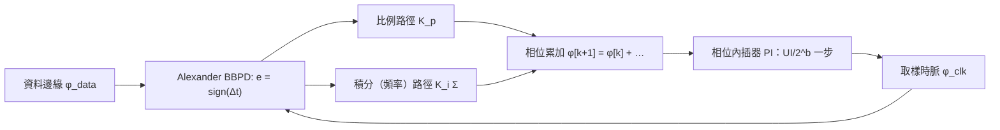

# Bang-bang CDR：把 ISF 的 σ_t 變成 K_bb、JTOL 與 SSC 追蹤

> **先備**：[serdes_clocking_connection](/06_design_insights/serdes_clocking_connection)（§6 的 loop high-pass 直覺、UI/eye/BER）、[pll_noise_budget](/06_design_insights/pll_noise_budget)（$\lvert H_{lp}\rvert^2,\lvert H_{hp}\rvert^2$、jitter transfer vs jitter tolerance 的區分與 JTOL worked example——本頁直接沿用）、[dj_dual_dirac](/06_design_insights/dj_dual_dirac)（$Q^{-1}(10^{-12})=7.03$、TJ@BER）｜ **接下來**：[exercises](/06_design_insights/exercises)、[lab_13_pll_cdr_transfer](/04_simulation_labs/lab_13_pll_cdr_transfer)

[serdes_clocking_connection](/06_design_insights/serdes_clocking_connection) 把 CDR（clock and data
recovery，時脈資料回復）畫成一個「對 VCO noise 高通、對輸入 jitter 低通」的黑盒子。真實的 SerDes
接收端幾乎都不是這種線性 PLL：它是一個 **bang-bang（二元、只輸出「早／晚」）** 的數位迴路，
相位偵測器（phase detector, PD）只吐出 $\pm1$，時脈相位由**相位內插器（phase interpolator, PI）**
以 $\text{UI}/2^b$ 的離散步伐移動。這一頁回答三個設計者天天遇到、但前面各頁都沒回答的問題：

1. bang-bang PD 沒有「增益」這回事，那 loop bandwidth 由誰決定？——答案是**由 jitter 的 rms 值決定**，
   而 jitter 的 rms 值正是本站一路算到的 $\sigma_t$。ISF 在這裡不只決定雜訊，還決定迴路動態。
2. 規格書上的 **jitter tolerance mask（JTOL）** 那條「低頻 $-40$ dB/dec、中間 $-20$ dB/dec、高頻平台」
   的折線從哪裡來？
3. **SSC（spread-spectrum clocking，展頻時脈）** 是 CDR 必須追的一個**巨大的、確定性的**低頻相位擺動；
   多大、為什麼一階迴路追不上。

> **物理直覺（先講結論）**：bang-bang PD 是一個 comparator，$\text{sign}(\Delta t)$ 對 $\Delta t$ 的斜率在
> 0 點是無限大——但在**有雜訊**時，輸出的期望值 $E[\text{sign}(\Delta t+n)]$ 被雜訊「抹平」成一條
> 誤差函數，斜率變成有限的 $\sqrt{2/\pi}/\sigma_j$。雜訊越大、增益越小、迴路越慢：**這是一個
> 「頻寬隨 jitter 自動縮放」的迴路**。JTOL 則是「眼圖剩下多少裕度」除以「迴路追不上的比例
> $\lvert1-H\rvert$」；SSC 的三角 FM 積分後是幾百 UI 的拋物線相位，只有帶頻率積分器的 type-II
> 迴路才能把它追到剩零點幾 UI。

## 第 1 步：Alexander（bang-bang）相位偵測器輸出的是 sign(Δt)

**Alexander PD**（外部文獻，非本站 5 篇 PDF：J. D. H. Alexander, *Electron. Lett.*, vol. 11, no. 22,
pp. 541–542, Oct. 1975）用三個取樣點判斷時脈相對資料邊緣是早還是晚：資料位元中心的兩個取樣
$D_{k-1}, D_k$ 與兩者之間、對準資料邊緣的取樣 $E_k$。若 $E_k=D_{k-1}\ne D_k$，邊緣取樣「像前一個
位元」→ 時脈**晚**；若 $E_k=D_k\ne D_{k-1}$ → 時脈**早**；$D_{k-1}=D_k$（沒有邊緣）→ 不輸出。
用時脈邊緣相對資料邊緣的時間誤差 $\Delta t$（時脈早為正）表示：

$$
e_k=\begin{cases}\text{sign}(\Delta t_k), & \text{有資料轉態（transition）}\\ 0, & \text{無轉態}\end{cases}
$$

三個要點：

- **輸出只有 $\pm1$（與 0）**：沒有「誤差有多大」的資訊，只有方向。所以它沒有傳統意義的 PD 增益
  $K_{PD}$（V/rad 或 1/s）——這正是第 2 步要解決的事。
- **只在轉態時更新**：隨機 NRZ 資料的轉態密度（transition density）$\rho_T\approx0.5$；長串 0 或 1
  時迴路「失明」，這是規格要求 8b/10b、64b/66b 或 scrambling 限制 run length 的原因之一。
- **它同時是資料取樣器**：$D_k$ 就是恢復出的資料。所以 CDR 鎖定的目標「時脈對準資料邊緣」
  自動等於「資料取樣點在眼圖中央」——和第 4 步 JTOL 的裕度 $\text{UI}-\text{TJ}_{eye}$ 直接對接。



## 第 2 步：線性化——高斯 jitter 把 sign 抹成 erf，增益 K_bb = √(2/π)/σ_j

**設定**：真實的 $\Delta t$ 不是常數，而是「名義誤差 $\Delta t$ ＋ 一個零均值高斯隨機項 $n$」，
$n\sim\mathcal N(0,\sigma_j^2)$。這個 $\sigma_j$ 是**資料邊緣與取樣時脈之間**的總 rms jitter：
輸入資料的 RJ、恢復時脈自己的 jitter（VCO 經迴路整形後的 $\sigma_t$、第 3 步的 hunting）都算在內。
PD 的**期望輸出**是：

$$
\begin{aligned}
\langle e\rangle(\Delta t)&=E\big[\text{sign}(\Delta t+n)\big]=P(n>-\Delta t)-P(n<-\Delta t)
=2\Phi\!\left(\frac{\Delta t}{\sigma_j}\right)-1 \\[4pt]
&=\operatorname{erf}\!\left(\frac{\Delta t}{\sqrt2\,\sigma_j}\right),
\qquad \Phi(x)=\tfrac12\Big[1+\operatorname{erf}\big(x/\sqrt2\big)\Big].
\end{aligned}
$$

**逐步**：(i) sign 的期望值 $=(+1)\cdot P(\text{正})+(-1)\cdot P(\text{負})$；(ii) $n>-\Delta t$ 的機率是
高斯 CDF $\Phi(\Delta t/\sigma_j)$；(iii) 用 $\Phi$ 與 erf 的標準關係整理。**線性化增益**是這條曲線在
$\Delta t=0$ 的斜率：

$$
\boxed{\ K_{bb}\equiv\frac{\partial\langle e\rangle}{\partial\Delta t}\bigg|_{\Delta t=0}
=\frac{2}{\sqrt\pi}\cdot\frac{1}{\sqrt2\,\sigma_j}=\sqrt{\frac{2}{\pi}}\,\frac{1}{\sigma_j}\ }
$$

（用 $\frac{d}{dx}\operatorname{erf}(x)=\frac{2}{\sqrt\pi}e^{-x^2}$，在 $x=0$ 取值 $2/\sqrt\pi$，再乘
內層 $1/(\sqrt2\sigma_j)$。）

- **Dimension check**：$\langle e\rangle$ 無因次、$\Delta t$ 是秒 → $K_{bb}$ 單位 $\text{s}^{-1}$ ✓。
  乘上 UI 得「每 UI 誤差輸出多少」的無因次增益 $K_{bb}\cdot\text{UI}$。
- **物理意義**：$\sigma_j$ 越大，erf 越平緩、增益越小。**bang-bang 迴路的增益是 jitter 的倒數**——
  這是 Lee–Kundert–Razavi 的核心結論（外部文獻，非本站 5 篇 PDF：J. Lee, K. S. Kundert, and B. Razavi,
  "Analysis and Modeling of Bang-Bang Clock and Data Recovery Circuits," *IEEE J. Solid-State Circuits*,
  vol. 39, no. 9, pp. 1571–1580, Sep. 2004）。
- **線性區**：erf 在 $\lvert\Delta t\rvert\lesssim\sigma_j$ 才近似直線（$\langle e\rangle(\sigma_j)=0.683$、
  $\langle e\rangle(2\sigma_j)=0.954$ 已飽和）；切線與 $\pm1$ 相交於 $\Delta t=\pm\sigma_j\sqrt{\pi/2}$。
  更大的誤差進入 **slew-limited（斜率受限）** 區——第 4 步 JTOL 的 $-20$ dB/dec 段就住在這裡。
- **轉態密度**：只有轉態才更新，平均增益再乘 $\rho_T$（隨機資料 $\approx0.5$）。

> **worked example（站台值）**：資料邊緣與時脈之間的 rms jitter 取本站 canonical 例 C 的
> $\sigma_t=447.9$ fs（free-running 5 GHz VCO、$-100$ dBc/Hz @ 1 MHz、積 1→100 MHz；這裡當作
> $\sigma_j$ 的代表值），UI $=40$ ps（25 Gb/s NRZ，同 [final_exam](/04_simulation_labs/final_exam) 題 10）。

$$
K_{bb}=\sqrt{\frac{2}{\pi}}\cdot\frac{1}{447.9\times10^{-15}\ \text{s}}
=\frac{0.7979}{4.479\times10^{-13}\ \text{s}}=1.78\times10^{12}\ \text{s}^{-1},
\qquad K_{bb}\cdot\text{UI}=1.78\times10^{12}\times40\times10^{-12}=71.3\ \text{(per UI)}.
$$

也就是說 PD 的期望輸出在時脈偏離 $1/71.3\ \text{UI}=0.014$ UI $=0.56$ ps 時就打到 $\pm1$——
線性區只有半個 ps 寬。**ISF 算出來的 $\sigma_t$ 越小（VCO 越乾淨），$K_{bb}$ 越大、迴路越快，
但線性區也越窄**：這是 bang-bang 與線性 PLL 最不一樣的地方。

```python
import numpy as np
from scipy.special import erf
sigma_t = 447.9e-15   # s, canonical example C (free-running VCO, 1-100 MHz)
UI = 40e-12           # s, 25 Gb/s NRZ
K_bb = np.sqrt(2/np.pi)/sigma_t
print(f"{K_bb:.3e}", round(K_bb*UI, 1))
# -> 1.781e+12 71.3
d = 1e-18             # numerical derivative of erf(dt/(sqrt2 sigma)) at 0
slope = (erf(d/(np.sqrt(2)*sigma_t)) - erf(-d/(np.sqrt(2)*sigma_t)))/(2*d)
print(f"{slope:.3e}", round(sigma_t*np.sqrt(np.pi/2)*1e12, 3))
# -> 1.781e+12 0.561
```

## 第 3 步：PI 迴路——φ[k+1] = φ[k] + K_p·sign(e)、UI/2^b 量化、hunting 極限環

現代 SerDes CDR 多半沒有 VCO 在迴路裡：一顆共用的 PLL 產生固定頻率的多相位時脈，CDR 用
**相位內插器（PI）** 在這些相位之間內插出取樣時脈；PI 由一個 $b$ 位元的相位碼控制，一個 UI
分成 $2^b$ 步：

$$
\Delta\phi_{PI}=\frac{\text{UI}}{2^b}\qquad(b=6:\ \frac{40\ \text{ps}}{64}=0.625\ \text{ps}=0.0156\ \text{UI}).
$$

最簡單的**一階 bang-bang 迴路**每隔一個更新週期 $T_u=N_{dec}\cdot\text{UI}$（$N_{dec}$ 是 PD 輸出的
降頻／投票倍數）把相位碼往 PD 說的方向推一步：

$$
\phi[k+1]=\phi[k]+K_p\,\text{sign}(e[k]),\qquad K_p=m\cdot\Delta\phi_{PI}\ (m\ \text{個 LSB}).
$$

**三個離散化後果**（外部文獻，非本站 5 篇 PDF：R. C. Walker, "Designing Bang-Bang PLLs for Clock and
Data Recovery in Serial Data Transmission Systems," in *Phase-Locking in High-Performance Systems*,
B. Razavi, Ed., IEEE Press, 2003）：

1. **Hunting（極限環）**：鎖定後 PD 仍然只會說「早」或「晚」，相位碼在最佳點兩側來回跳，形成
   峰峰 $K_p$ 的確定性抖動；若迴路有 $D$ 個更新週期的延遲（判斷到執行之間的 pipeline），
   相位在反向前會多走 $D$ 步，極限環放大成 **峰峰 $(2D+1)K_p$**（下方 Python 用無雜訊模型直接數）。
   這是一個 **DJ**：進 TJ 預算時用 $\text{DJ}_{pp}$ 直接相加，不隨 BER 放大（見
   [dj_dual_dirac](/06_design_insights/dj_dual_dirac)）。
2. **量化雜訊**：若把 PI 的相位誤差視為均勻分布，rms $=\Delta\phi_{PI}/\sqrt{12}=0.18$ ps——
   與 $\sigma_t=0.45$ ps 同量級，不能忽略。
3. **線性化頻寬**：把第 2 步的 $K_{bb}$ 代進去，每次更新的相位修正 $\approx K_p K_{bb}\rho_T\,\Delta t$，
   連續時間近似得一階迴路

$$
\frac{d\phi_{clk}}{dt}\approx\frac{K_pK_{bb}\rho_T}{T_u}\,(\phi_{data}-\phi_{clk})
\ \Rightarrow\ f_{BW}\approx\frac{K_pK_{bb}\rho_T f_u}{2\pi},\qquad f_u=\frac{1}{T_u}.
$$

- **Dimension check**：$K_p$ [s] $\times K_{bb}$ [1/s] $\times f_u$ [1/s] $=$ [1/s] ✓；
  $K_pK_{bb}$ 是「每次更新的迴路增益」（無因次），離散迴路要 $K_pK_{bb}\rho_T\lt2$ 才穩定、
  且線性化本身只在 $K_p\lesssim\sigma_j$（步伐小於雜訊）時成立。
- **worked（站台值）**：$K_p=1$ LSB $=0.625$ ps、$K_{bb}=1.78\times10^{12}$ s$^{-1}$、$\rho_T=0.5$。
  $N_{dec}=1$（每 UI 更新）：$K_pK_{bb}=1.11$ 每次更新——已超出線性化能描述的範圍（步伐
  $0.625$ ps 大於 $\sigma_j=0.448$ ps），名義 $f_{BW}=2.2$ GHz 無意義；$N_{dec}=16$
  （$f_u=1.5625$ GHz）：$f_{BW}\approx0.5\times0.625\text{ ps}\times1.78\times10^{12}\text{ s}^{-1}
  \times1.5625\times10^9\text{ s}^{-1}/2\pi=138$ MHz，是常見的 CDR 頻寬量級。誠實聲明：
  這裡 $K_p\approx\sigma_j$，hunting 會把有效 $\sigma_j$ 再推高、$K_{bb}$ 再拉低，精確值要
  Monte-Carlo（v12 的 lab 再做）；本頁只給量級。
- **比例路徑的追頻能力（slew）**：每秒最多移動 $(K_p/\text{UI})\,f_u$ 個 UI，換算成可追的頻率偏移
  $(K_p/\text{UI})\,f_u/f_b$：$N_{dec}=1$ 為 $1/64=15\,625$ ppm、$N_{dec}=16$ 為 $977$ ppm。
  第 5 步會拿它對照 SSC 的 5000 ppm。

```python
import numpy as np
fb, UI, b = 25e9, 40e-12, 6
Kp = UI/2**b
print(round(Kp*1e12, 3), round(Kp/UI, 4), round(Kp/np.sqrt(12)*1e12, 3))
# -> 0.625 0.0156 0.18
K_bb = np.sqrt(2/np.pi)/447.9e-15
for Ndec in (1, 16):
    fu = fb/Ndec
    f_bw = 0.5*Kp*K_bb*fu/(2*np.pi)     # rho_T = 0.5 (random data); one sign per update, no voting
    print(Ndec, f"{f_bw:.3e}", f"{(Kp/UI)*fu/fb*1e6:.0f}")
# -> 1 2.215e+09 15625
# -> 16 1.384e+08 977
def hunting_pp(D, n=400):               # noise-free limit cycle, latency D updates, units of Kp
    phi, q, hist = 0.3, [0.0]*D, []
    for k in range(n):
        q.append(-np.sign(phi) if phi != 0 else 1.0)
        phi += q.pop(0)
        hist.append(phi)
    h = np.array(hist[n//2:])
    return float(h.max() - h.min())
print([hunting_pp(D) for D in (0, 1, 2, 4)])
# -> [1.0, 3.0, 5.0, 9.0]
```

> **側欄：DLL 為什麼「不累積」jitter**（外部文獻，非本站 5 篇 PDF：J. G. Maneatis, "Low-Jitter
> Process-Independent DLL and PLL Based on Self-Biased Techniques," *IEEE J. Solid-State Circuits*,
> vol. 31, no. 11, pp. 1723–1732, Nov. 1996）。上面的 PI 架構其實是 DLL（delay-locked loop）思維：
> 迴路裡**沒有振盪器**，只有「對參考時脈的延遲」。振盪器的相位是頻率的積分，白噪 → 相位
> random walk → $\sigma_{\Delta t}=\kappa\sqrt{\Delta t}$（[P2] Eq.(8), p.792，見 [lc_vs_ring](/06_design_insights/lc_vs_ring)）；
> 延遲線的誤差**每個週期都被參考邊緣重新歸零**，噪聲只加一次、不累積。代價是輸出 jitter
> 直接繼承參考時脈的 jitter（沒有 high-pass 去濾它），而且沒有頻率自由度——所以 PI-CDR 的
> 「追頻」全靠第 5 步的積分路徑在數位域累加相位碼。

## 第 4 步：JTOL(f) = (UI − TJ_eye)/|1 − H(f)| 與 mask 的 −40／−20 dB/dec 段

[pll_noise_budget](/06_design_insights/pll_noise_budget) 已經把 **jitter transfer**（$\lvert H_{lp}\rvert^2$）
與 **jitter tolerance**（由誤差轉移 $1-H_{lp}=H_{hp}$ 決定）分清楚：CDR 追不上的那部分輸入 jitter
$\phi_{err}=(1-H)\phi_{data}$ 才吃眼圖。給定眼圖裕度 $\text{UI}-\text{TJ}_{eye}$，可容忍的單頻正弦
輸入 jitter 是

$$
\boxed{\ \text{JTOL}_{pp}(f)=\frac{\text{UI}-\text{TJ}_{eye}}{\lvert1-H(f)\rvert}\ }
$$

> ⚠️ **慣例旗標（peak vs peak-to-peak，差 2×）**：業界 JTOL mask 以**峰峰**（UI pp）標示。取樣點在
> 眼中央、可左右各偏 $(\text{UI}-\text{TJ}_{eye})/2$，正弦誤差的峰值 $\le(\text{UI}-\text{TJ}_{eye})/2$
> ⇔ 峰峰 $\le\text{UI}-\text{TJ}_{eye}$——所以上式讀成 **peak-to-peak** 才與 mask 對得上；
> [pll_noise_budget](/06_design_insights/pll_noise_budget) 的同一式把它稱為 peak 幅度，數值相同、
> 讀法差 2×，引用時要說清楚是哪一種。

**mask 的三段從哪裡來**——把 type-II 二階環 $1-H_{lp}=H_{hp}(s)=\dfrac{s^2}{s^2+2\zeta\omega_ns+\omega_n^2}$
分段近似：

| 頻段 | $\lvert H_{hp}\rvert$ 近似 | JTOL 斜率 | 物理 |
|---|---|---|---|
| $f\ll f_z=f_n/(2\zeta)$ | $(f/f_n)^2$ | $-40$ dB/dec | 頻率積分器＋相位積分器：兩個積分追蹤慢擺動 |
| $f_z\ll f\ll2\zeta f_n$（$\zeta$ 大才明顯） | $f/(2\zeta f_n)$ | $-20$ dB/dec | 迴路零點：只剩比例路徑在追 |
| $f\gg f_n$ | $\to1$ | 平台 $\text{UI}-\text{TJ}_{eye}$ | 完全追不上，只剩靜態眼圖裕度 |

bang-bang 迴路還多一條 **slew-limited 的 $-20$ dB/dec 線**：峰峰 $A_{pp}$、頻率 $f$ 的正弦相位，
最大斜率是 $\pi A_{pp}f$；比例路徑每秒最多追 $(K_p/\text{UI})f_u$ UI，所以

$$
A_{pp}\le\frac{(K_p/\text{UI})\,f_u}{\pi f}\qquad(-20\ \text{dB/dec；Walker 2003、Lee–Kundert–Razavi 2004}).
$$

實際 mask 取三者的下界（min）。這就是為什麼規格書的 JTOL 折線長那樣：**低頻 $-40$、中頻 $-20$、
高頻平台**——每一段對應迴路裡一個不同的機制。

> **worked example（站台值，與 pll_noise_budget 同一組數）**：UI $=40$ ps、$\sigma_t=447.9$ fs、
> $\text{TJ}_{eye}=2Q^{-1}(10^{-12})\sigma_t=2\times7.03\times0.4479$ ps $=6.30$ ps $=0.157$ UI，
> 裕度 $0.843$ UI；type-II、$f_n=1$ MHz、$\zeta=0.707$。

$$
\begin{aligned}
\text{JTOL}(10\ \text{kHz})&=\frac{0.843}{(10^4/10^6)^2}=\frac{0.843}{10^{-4}}=8.4\times10^{3}\ \text{UI},\\
\text{JTOL}(30\ \text{kHz})&=\frac{0.843}{9.0\times10^{-4}}=936\ \text{UI},\quad
\text{JTOL}(100\ \text{kHz})=84\ \text{UI},\quad
\text{JTOL}(1\ \text{MHz})=\frac{0.843}{0.707}=1.19\ \text{UI},\quad
\text{JTOL}(10\ \text{MHz})=0.84\ \text{UI}.
\end{aligned}
$$

10 kHz→100 kHz 恰好 $-40$ dB/dec（$8426\to84.3$，$100\times$）；$\zeta=0.707$ 時零點 $f_z=707$ kHz
幾乎貼著 $f_n$，$-20$ 段看不見；把 $\zeta$ 拉到 4（$f_z=125$ kHz）100 kHz→1 MHz 的斜率就變成
$-24$ dB/dec——這就是規格書中段 $-20$ dB/dec 的來源之一。

```python
import numpy as np
from simulations.common.pll_utils import H_highpass_mag2
UI, sigma_t, qinv = 40e-12, 447.9e-15, 7.03
TJ_eye = 2*qinv*sigma_t
margin_UI = 1 - TJ_eye/UI
print(round(TJ_eye*1e12, 2), round(TJ_eye/UI, 3), round(margin_UI, 3))
# -> 6.3 0.157 0.843
fn, zeta = 1e6, 0.707
for f in [1e4, 3e4, 1e5, 1e6, 1e7]:
    H_hp = np.sqrt(H_highpass_mag2(np.array([f]), fn, zeta)[0])   # amplitude |1-H_lp|
    print(f"{f:.0e}", f"{H_hp:.3e}", round(margin_UI/H_hp, 2))
# -> 1e+04 1.000e-04 8425.63
# -> 3e+04 9.000e-04 936.18
# -> 1e+05 1.000e-02 84.26
# -> 1e+06 7.072e-01 1.19
# -> 1e+07 1.000e+00 0.84
def jtol_slope(zeta, fa, fb):           # dB per decade of JTOL between fa and fb = 10 fa
    Ha, Hb = (np.sqrt(H_highpass_mag2(np.array([x]), fn, zeta)[0]) for x in (fa, fb))
    return float(20*np.log10((margin_UI/Hb)/(margin_UI/Ha)))
for zeta in (0.707, 4.0):
    print(zeta, [round(jtol_slope(zeta, fa, 10*fa), 1) for fa in (1e4, 1e5, 1e6)])
# -> 0.707 [-40.0, -37.0, -3.0]
# -> 4.0 [-37.9, -24.0, -16.0]
```

**Dimension check**：$\text{UI}-\text{TJ}_{eye}$ [UI] ÷ 無因次幅度轉移 $=$ [UI] ✓；slew 線
$[\text{UI/s}]/[\text{1/s}]=[\text{UI}]$ ✓。

## 第 5 步：SSC——CDR 必須追的三角 FM，521 UI 峰峰相位

**展頻時脈（SSC）** 為了把 EMI 能量攤開，故意把發送端時脈頻率以 $f_m\approx30$–$33$ kHz 的**三角波**
從名義值往下掃到 $-\delta$（down-spread，PCIe-style $\delta=0.5\%$；PCIe Base Spec，版本待查；外部
文獻，非本站 5 篇 PDF）。對接收端 CDR 而言這不是雜訊，是**一個必須追蹤的確定性 FM**——當 RX
的參考時脈沒有跟著展頻（separate-reference 架構）時尤其如此。

**逐步推導峰峰相位**。設位元率 $f_b$，頻率偏移相對中心值是振幅 $\pm\delta f_b/2$、週期 $T_m=1/f_m$
的三角波。相位（以 UI 計）是頻率偏移的積分；三角波在正半週的面積 $=\tfrac12\cdot\tfrac{T_m}{2}\cdot\tfrac{\delta f_b}{2}=\dfrac{\delta f_bT_m}{8}$，
這就是相位的峰峰值：

$$
\boxed{\ \Delta\phi_{pp}=\frac{\delta\,f_b\,T_m}{8}\ \text{UI}
=\frac{1}{4}\,T_m\,\Delta f_{pk}\ \text{cycles}\ }\qquad(\Delta f_{pk}=\delta f_{clk}/2\ \text{為時脈的峰值頻偏}).
$$

代入 $f_b=25$ Gb/s（半速率時脈 $f_{clk}=12.5$ GHz）、$\delta=0.005$、$f_m=30$ kHz（$T_m=33.3$ µs）：

$$
\Delta f_{pk}=\frac{0.005\times12.5\ \text{GHz}}{2}=31.25\ \text{MHz},\quad
\Delta\phi_{pp}=\tfrac14\times33.3\ \mu\text{s}\times31.25\ \text{MHz}=260\ \text{週期}
=260\times80\ \text{ps}=20.8\ \text{ns}=521\ \text{UI}.
$$

- **Dimension check**：$[\text{s}]\times[\text{1/s}]=$ 無因次（週期數）✓；一個 12.5 GHz 週期 $=2$ UI ✓。
- **這是五百多個 UI 的相位擺動**，比任何 RJ 大四個量級。第 4 步的 mask 必須在 30 kHz 給出
  $\text{JTOL}\gt521$ UI：type-II、$f_n=1$ MHz 給 $936$ UI ✓（10 kHz 給 $8.4\times10^3$ UI）。
- **殘餘誤差有多大**：三角 FM 的每一段是**頻率斜坡**＝相位拋物線 $\phi_{in}=\tfrac12at^2$，
  $a=\delta f_b/(T_m/2)=7.5\times10^{12}$ UI/s²。對 type-II 二階環，$E(s)=H_{hp}(s)\cdot a/s^3$ 的終值
  $e_{ss}=a/\omega_n^2=7.5\times10^{12}/(2\pi\times10^6)^2=0.19$ UI——斜坡每 $T_m/2$ 換一次方向，
  誤差是 $\pm0.19$ UI 的方波（峰峰 0.38 UI）。頻域交叉檢查：逐段拋物線的**基頻**峰峰值不是 521 UI，
  而是 $521\times32/\pi^3=538$ UI（三角波基頻 $8/\pi^2$ 再積分一次），乘上
  $\lvert H_{hp}(30\ \text{kHz})\rvert=9.0\times10^{-4}$ 得 $0.48$ UI pp $=0.38\times4/\pi$，正是方波的基頻 ✓。這 0.19 UI 要從
  0.843 UI 的裕度裡扣——**SSC 是 CDR 預算裡一項不小的 DJ**。
- **一階迴路（type-I）不行**：同樣 1 MHz 頻寬的一階環 $\lvert1-H\rvert=f/\sqrt{f^2+f_{BW}^2}=0.030$
  @30 kHz → JTOL 只有 $28$ UI $\ll521$；更根本的是 type-I 對 5000 ppm 的頻率偏移有**靜態相位誤差**
  $\Delta f/(2\pi f_{BW})=0.005\times25\times10^9/(2\pi\times10^6)=19.9$ UI，直接失鎖。
- **在 bang-bang PI 迴路裡誰來追**：第 3 步算過比例路徑的追頻上限 $977$ ppm（$N_{dec}=16$）
  $\lt5000$ ppm——比例路徑追不動 SSC；**追 SSC 是積分（頻率）路徑的工作**：
  $\phi[k+1]=\phi[k]+K_p\text{sign}(e)+\omega[k]$、$\omega[k+1]=\omega[k]+K_i\text{sign}(e)$，
  頻率暫存器 $\omega$ 把「每次更新該走幾分之一個 LSB」記住，讓 PD 回到只處理 jitter。這就是
  數位 CDR 幾乎都是 type-II 的原因。

```python
import numpy as np
from simulations.common.pll_utils import H_highpass_mag2
fb, UI = 25e9, 40e-12         # bit rate, UI
delta, fm = 0.005, 30e3       # -0.5 % down-spread, 30 kHz triangle (PCIe-style)
Tm = 1/fm
pp_cycles = 0.25*Tm*(delta*12.5e9/2)   # half-rate 12.5 GHz clock: +-31.25 MHz around centre
pp_UI = delta*fb*Tm/8
print(round(pp_cycles, 1), round(pp_UI, 1))
# -> 260.4 520.8
fn, zeta = 1e6, 0.707
margin_UI = 1 - 2*7.03*447.9e-15/UI    # 0.843 UI eye margin (Step 4)
a = (delta*fb)/(Tm/2)                  # phase acceleration during each ramp, UI/s^2
e_ss = a/(2*np.pi*fn)**2
H30 = np.sqrt(H_highpass_mag2(np.array([fm]), fn, zeta)[0])
pp_fund = pp_UI*32/np.pi**3            # fundamental (pp) of the piecewise-parabolic phase, not its pp
print(round(pp_fund, 1), f"{a:.2e}", round(e_ss, 3), round(pp_fund*H30, 3), round(margin_UI/H30, 1))
# -> 537.5 7.50e+12 0.19 0.484 936.2
fbw1 = 1e6                             # first-order (type-I) loop with the same bandwidth
H1 = fm/np.sqrt(fm**2 + fbw1**2)
print(round(margin_UI/H1, 1), round(delta*fb/(2*np.pi*fbw1), 1))
# -> 28.1 19.9
```

## 設計旋鈕清單

| 旋鈕 | 影響 | 取捨 |
|---|---|---|
| VCO/參考的 $\sigma_t$（ISF：$\Gamma_{rms}/q_{max}$） | $K_{bb}=\sqrt{2/\pi}/\sigma_j$ → 迴路增益與 $f_{BW}$ | 越乾淨迴路越快、線性區越窄；$\sigma_j\lesssim K_p$ 時進入 hunting 主導 |
| PI 位元數 $b$ | $\Delta\phi_{PI}=\text{UI}/2^b$：hunting DJ $(2D+1)K_p$、量化 rms $/\sqrt{12}$ | $b\uparrow$ 步小、DJ 小，但每步能追的頻偏也小，PI 線性度變難 |
| 更新率 $f_u=f_b/N_{dec}$ | $f_{BW}\propto f_u$、slew $\propto f_u$ | $N_{dec}\uparrow$ 省功率／降延遲負擔，犧牲頻寬與追頻 |
| 迴路延遲 $D$ | hunting 峰峰 $(2D+1)K_p$ | pipeline 深度 vs 時序收斂 |
| 積分路徑 $K_i$ | 追 SSC／頻偏、決定 $-40$ dB/dec 段 | 太大 → peaking、穩定裕度差 |
| $\zeta$（零點位置 $f_z=f_n/2\zeta$） | $-20$ dB/dec 段長度、jitter peaking | 級聯多顆 CDR 時 peaking dB 相加（見 pll_noise_budget） |

## 適用與失效條件

| 條件 | 成立時 | 失效時 |
|---|---|---|
| 高斯 $\sigma_j$、線性化 $K_{bb}$ | $K_p\lesssim\sigma_j$、誤差 $\lesssim\sigma_j$ | $K_p\gg\sigma_j$：hunting 主導、頻寬由 $K_p f_u$ 決定；大誤差進入 slew-limited |
| 連續時間迴路近似 | $f_{BW}\ll f_u$（$K_pK_{bb}\rho_T\ll1$） | 每次更新增益 $\gtrsim1$：要用離散模型（$N_{dec}=1$ 的例子） |
| JTOL 用幅度轉移 $\lvert1-H\rvert$ | 單頻正弦、小訊號線性迴路 | slew-limited 區改用 $A_{pp}\le(K_p/\text{UI})f_u/(\pi f)$；峰峰 vs 峰值讀法差 2× |
| $\text{TJ}_{eye}$ 只含 RJ | 無 ISI/DJ 的乾淨眼 | 真實鏈路要把 ISI、DCD、SSC 殘餘 0.19 UI、hunting $(2D+1)K_p$ 都放進 $\text{TJ}_{eye}$ |
| SSC 需由 CDR 追 | separate-reference 架構 | common-clock 架構 RX PLL 同步展頻，CDR 只看殘餘 |
| $\rho_T=0.5$ | scrambled／編碼資料 | 長 run length：PD 失明、有效 $f_{BW}$ 下降 |

## 重點回顧

- Alexander PD 只輸出 $\text{sign}(\Delta t)$（有轉態時）；高斯 jitter 把它抹成
  $\langle e\rangle=\operatorname{erf}(\Delta t/\sqrt2\sigma_j)$，線性化增益 $K_{bb}=\sqrt{2/\pi}/\sigma_j$。
- 站台值：$\sigma_t=447.9$ fs → $K_{bb}=1.78\times10^{12}$ s$^{-1}=71.3$/UI；線性區僅 $\pm0.56$ ps。
  **ISF 算出的 $\sigma_t$ 決定 bang-bang CDR 的增益與頻寬。**
- PI：$\text{UI}/2^b$（6-bit → 0.625 ps）；一階 BB 更新 $\phi[k+1]=\phi[k]+K_p\text{sign}(e)$；
  hunting 峰峰 $(2D+1)K_p$ 是 DJ；線性化 $f_{BW}=K_pK_{bb}\rho_Tf_u/2\pi$（$N_{dec}=16$ → 138 MHz 量級）。
- $\text{JTOL}_{pp}(f)=(\text{UI}-\text{TJ}_{eye})/\lvert1-H(f)\rvert$：$-40$（雙積分）／$-20$
  （零點或 slew：$A_{pp}\le(K_p/\text{UI})f_u/\pi f$）／平台。站台值：$6.30$ ps $=0.157$ UI →
  $84/1.19/0.84$ UI @ 100 kHz/1 MHz/10 MHz。
- SSC（$-0.5\%$、30 kHz、25 Gb/s）：$\Delta\phi_{pp}=\delta f_bT_m/8=521$ UI（12.5 GHz 時脈 260 週）；
  type-II $f_n=1$ MHz 殘餘 $\pm0.19$ UI、JTOL(30 kHz)$=936$ UI ✓；一階環 28 UI、靜態誤差 19.9 UI ✗。
- DLL/PI 沒有振盪器 → jitter 不累積（Maneatis 1996），但也不濾參考、不追頻——追頻靠積分路徑。

## 延伸閱讀

- CDR 黑盒子直覺與 UI/eye/BER：[serdes_clocking_connection](/06_design_insights/serdes_clocking_connection)
- transfer vs tolerance、JTOL worked example 原出處：[pll_noise_budget](/06_design_insights/pll_noise_budget)
- 兩條轉移函數：[lab_13_pll_cdr_transfer](/04_simulation_labs/lab_13_pll_cdr_transfer)
- TJ@BER 與 DJ 記帳：[dj_dual_dirac](/06_design_insights/dj_dual_dirac)
- 累積 jitter $\kappa\sqrt{\Delta t}$（DLL 側欄的對照）：[lc_vs_ring](/06_design_insights/lc_vs_ring)
- 外部文獻（非本站 5 篇 PDF）：J. D. H. Alexander, "Clock Recovery from Random Binary Signals,"
  *Electron. Lett.*, vol. 11, no. 22, pp. 541–542, Oct. 1975；J. Lee, K. S. Kundert, and B. Razavi,
  "Analysis and Modeling of Bang-Bang Clock and Data Recovery Circuits," *IEEE J. Solid-State Circuits*,
  vol. 39, no. 9, pp. 1571–1580, Sep. 2004；R. C. Walker, "Designing Bang-Bang PLLs for Clock and Data
  Recovery in Serial Data Transmission Systems," in *Phase-Locking in High-Performance Systems*,
  B. Razavi, Ed., IEEE Press, 2003；J. G. Maneatis, *IEEE J. Solid-State Circuits*, vol. 31, no. 11,
  pp. 1723–1732, Nov. 1996；PCI Express Base Specification（SSC 30–33 kHz、$-0.5\%$ down-spread；版本待查）。
- Monte-Carlo 驗證 $K_{bb}$、hunting 與 JTOL 的 lab 與互動 widget：v12 再補。
