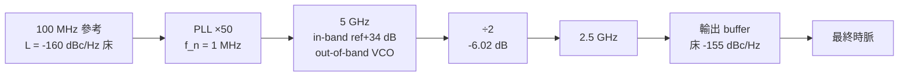

import NumericQuiz from "@site/src/components/NumericQuiz";

# 時脈鏈雜訊記帳：×N、÷N、PLL、buffer 一頁查表

> **先備**：[psd_phase_noise_jitter](/02_foundations/psd_phase_noise_jitter)（$S_\phi$、$\mathcal{L}$、phase↔time 換算）、[pll_noise_budget](/06_design_insights/pll_noise_budget)（$\lvert H_{lp}\rvert^2,\lvert H_{hp}\rvert^2$ 與五源預算——本頁直接沿用、**不重推**）、[white_noise_to_phase_noise](/03_isf_core_theory/white_noise_to_phase_noise)（VCO 那條 $-148$ dBc/Hz 從哪來）｜ **接下來**：[serdes_clocking_connection](/06_design_insights/serdes_clocking_connection)、[exercises](/06_design_insights/exercises)

真實系統裡沒有「一顆振盪器直接用」這回事：參考晶體被 PLL 倍頻上去、再被除頻器分下來、
一路又過好幾級 buffer 才到取樣器。系統工程師每天的問題是：**給我源頭的 $\mathcal{L}(f)$，
時脈樹（clock tree）每一個節點的 $\mathcal{L}(f)$ 是多少？最後那個 clock 的積分 jitter 是多少？**
好消息是：整條鏈的記帳只需要**五條規則**。這頁把五條規則各自**逐步推導**（不跳步、帶單位、
給失效條件），然後用一條完整的 worked chain 把它們串起來算到底。

> **物理直覺（先講結論）**：時脈鏈上發生在相位身上的事，只有兩種——
> **(1) 確定性的相位縮放**：×N 把相位乘 $N$（$+20\log_{10}N$ dB）、÷N 把相位除 $N$
> （$-20\log_{10}N$ dB）、PLL 在 in-band 對 reference 做 ×N 並低通、對 VCO 高通。
> 縮放作用在**整條曲線**上，offset 軸不動。
> **(2) 加成的獨立雜訊**：buffer 與 divider 自己的雜訊床（floor），與輸入相位不相關，
> **功率相加**（絕不是 dB 相加）。
> 另外有一個漂亮的**守恆量**：理想 ×N/÷N 下，**以秒計的時間抖動 $\sigma_t$ 完全不變**——
> 變的只是「同一個秒數誤差佔一個週期的角度比例」。

## 第 0 步：一頁查表（先給結論，推導在後）

| 元件 | 相位關係 | $\mathcal{L}(f)$ 記帳 | 主要失效條件 |
|---|---|---|---|
| 理想 ×N 倍頻 | $\phi_{out}=N\,\phi_{in}$ | $\mathcal{L}+20\log_{10}N$（整條曲線平移） | 小角近似（$\sigma_\phi\times N$ 變大）、offset 接近 $f_{ref}/2$ |
| 理想 ÷N 除頻 | $\phi_{out}=\phi_{in}/N$ | $\mathcal{L}-20\log_{10}N$ | 取樣摺疊（offset 接近 $f_{out}/2$）、divider 自身床 |
| 過 PLL（×N） | in-band 跟 ref、out-of-band 跟 VCO | $N^2S_{ref}\lvert H_{lp}\rvert^2+S_{vco}\lvert H_{hp}\rvert^2$ | 純二階 loop 的 ref 尾巴（本頁第 6 步實算） |
| buffer / divider 床 | $\phi_{out}=\phi_{in}+\phi_{add}$ | $10\log_{10}\big(10^{\mathcal{L}_{in}/10}+10^{\mathcal{L}_{buf}/10}\big)$ | 相關雜訊（共 supply/bias）時不能直接功率相加 |
| DLL 延遲線（規則 5） | 每個參考 edge 獨立穿越一次，非積分器 | $\sigma_{t,out}^2=\sigma_{ref}^2+N\sigma_{stage}^2$（有界、不隨 $\Delta t$ 累積） | 鎖定範圍僅一個參考週期；tap 被接成環形會變回振盪器 |
| PI 相位內插量化（規則 5） | 均勻量化，非相位縮放 | $\mathrm{DJ}_{pp}=UI/2^b$（確定性，不吃 $Q^{-1}(\mathrm{BER})$） | 真實 DNL/線性度使實際 DJ 大於理論值 |

**慣例聲明（factor-of-2 紀律，全頁一致）**：本頁所有 $\mathcal{L}$ 都是 **SSB（單邊帶）dBc/Hz**，
與 $S_\phi$ 的換算用小角近似 $\mathcal{L}=\tfrac12 S_\phi$（規範公式 16；`noise_utils` 同一慣例）。
worked chain 的 VCO 錨點 $-148$ dBc/Hz @ 1 MHz 是站內 canonical 例 B，用 [P1] Eq.(21), p.185 的
**「/4」SSB 記帳**；乾淨時域推導的「/2」版本會給 $-145$（差 3 dB 的著名慣例之爭，見
[white_noise_to_phase_noise](/03_isf_core_theory/white_noise_to_phase_noise)）。本頁四條規則本身
（$\pm20\log_{10}N$、功率相加）都是**比值運算**：只要輸入輸出用同一個慣例，/2 或 /4 都會對消，
規則的數字不受慣例影響——這是為什麼記帳規則可以放心查表。

## 規則 1：理想 ×N 倍頻 —— 為什麼是 $+20\log_{10}N$

**第 1 步（把訊號寫成相位的函數）。** 用 [P1] Eq.(1), p.180 的分解，取正弦波形：

$$
V_{in}(t)=\cos\big(\Phi_{in}(t)\big),\qquad \Phi_{in}(t)=\omega_{ref}\,t+\phi_{in}(t)
$$

$\Phi_{in}$ 是**總相位**（rad），$\phi_{in}$ 是 excess phase（rad），$\omega_{ref}=2\pi f_{ref}$（rad/s）。

**第 2 步（理想倍頻器＝無記憶非線性＋帶通）。** 任何無記憶非線性 $g(\cdot)$ 作用在
$\cos\Phi$ 上，因為 $g(\cos\Phi)$ 對 $\Phi$ 是 $2\pi$ 週期函數，可展開成對 $\Phi$ 的傅立葉級數：

$$
g\big(\cos\Phi(t)\big)=\sum_{k=0}^{\infty}a_k\cos\big(k\,\Phi(t)+\theta_k\big)
$$

關鍵在引數：每一項都是「**瞬時總相位的整數倍** $k\Phi(t)$」——無記憶元件沒有時間概念，
只能對「當下的相位」動作，所以 excess phase 被**原封不動**地帶著走。

**第 3 步（帶通取第 $N$ 諧波）。** 以 $N f_{ref}$ 為中心的帶通濾波器取 $k=N$ 那一項：

$$
V_{out}(t)\propto\cos\big(N\Phi_{in}(t)\big)=\cos\big(N\omega_{ref}\,t+N\phi_{in}(t)\big)
\quad\Longrightarrow\quad \boxed{\ \phi_{out}(t)=N\,\phi_{in}(t)\ }
$$

這是**逐時刻**成立的恆等式——$\phi_{in}$ 的每一個頻率成分都被乘 $N$，沒有任何頻率選擇性。

**第 4 步（換成 PSD 與 dB）。** 相位乘 $N$（幅度），功率譜密度乘 $N^2$：

$$
S_{\phi,out}(f)=N^2\,S_{\phi,in}(f)\ \ [\text{rad}^2/\text{Hz}],\qquad
\mathcal{L}_{out}(f)=\mathcal{L}_{in}(f)+20\log_{10}N\ \ [\text{dBc/Hz}]
$$

第二式用了 $\mathcal{L}=\tfrac12 S_\phi$——輸入輸出**同一慣例**，$\tfrac12$ 對消，所以
$+20\log_{10}N$ 與 /2-vs-/4 慣例無關。$N=50$ 時 $+20\log_{10}50=+33.98$ dB $\approx+34$ dB。

- **物理意義**：倍頻**不創造雜訊**。它把「同一個絕對時間抖動」放大成 $N$ 倍的**角度**——
  輸出一個週期只有輸入的 $1/N$ 長，同樣的秒數誤差佔輸出週期的比例是 $N$ 倍。
- **offset 軸不動（常見錯誤）**：被乘 $N$ 的是**相位幅度**，不是相位起伏的節奏。
  $\mathcal{L}$ 曲線整條**垂直上移** $20\log_{10}N$，水平軸（offset $f$）完全不變。
- **Dimension check**：$N$ 無因次、$\phi$ 為 rad、$S_\phi$ 為 rad²/Hz、$20\log_{10}N$ 為 dB ✓。
- **時間抖動守恆**：$\Delta t_{out}=\dfrac{\phi_{out}}{2\pi N f_{ref}}=\dfrac{N\phi_{in}}{2\pi N f_{ref}}
  =\dfrac{\phi_{in}}{2\pi f_{ref}}=\Delta t_{in}$——以秒計的 edge 誤差**不變**（後面第 5 步用數值驗證）。

**失效條件**：(1) **小角近似**——$\sigma_{\phi,out}=N\sigma_{\phi,in}$，$N$ 大時（例如
$N=1000$，$+60$ dB）可能逼近 1 rad，$\mathcal{L}\approx\tfrac12 S_\phi$ 崩潰，載波能量重新分佈
成 Lorentzian（線寬擴散常數 $D$ 放大 $N^2$ 倍，見
[lorentzian_linewidth](/03_isf_core_theory/lorentzian_linewidth)）；(2) **邊帶重疊**——offset 接近
$f_{ref}/2$ 時第 $N\pm1$ 諧波的裙帶混進帶通；(3) 真實倍頻器有自己的加成床（規則 4）。

> **ILCM 補充**：本規則假設「無記憶非線性＋帶通」——這種倍頻器**不創造雜訊**，只把輸入的
> excess phase 原封不動放大 $N$ 倍。真實的 injection-locked clock multiplier（ILCM，注入鎖定
> 倍頻器）不是這種機器：它是**一顆被鎖定的振盪器**，載波路徑仍是確定性的 $\phi_{out}\approx N\phi_{in}$
> （in-band 參考雜訊照樣吃 $N^2S_{ref}$、$+20\log_{10}N$，與本規則一致），但**它自己的自由跑
> 相位雜訊被一階離散時間迴路高通整形**（corner $\approx\beta f_{ref}/2\pi$，$\beta$=每根參考
> 脈衝的 realignment factor）取代了本規則「乾淨常數移位」的假設——offset 越過 corner，輸出
> 雜訊由 ILCM 自己的振盪器品質決定，不再是 $+20\log_{10}N$ 能描述的。完整推導見
> [subharmonic_injection](/06_design_insights/subharmonic_injection)。

## 規則 2：理想 ÷N 除頻 —— $-20\log_{10}N$ 的嚴格出處

[quadrature_and_coupled_oscillators](/06_design_insights/quadrature_and_coupled_oscillators) 頁在
÷2 產生 I/Q 那節直接引用了 $\mathcal{L}_{out}=\mathcal{L}_{in}-20\log_{10}N$；**這裡是那條式子的
嚴格推導之家**，兩頁數字一致（÷2 即 $-6.02$ dB）。

**第 1 步（輸入 edge 的時刻）。** 輸入第 $k$ 個上升過零點 $t_k$ 由總相位定義：
$\Phi_{in}(t_k)=2\pi k$。代入 $\Phi_{in}=\omega_{ref}t+\phi_{in}(t)$ 解出：

$$
t_k=k\,T_{ref}-\frac{\phi_{in}(t_k)}{\omega_{ref}}
\qquad\Longrightarrow\qquad
\delta t_k=-\frac{\phi_{in}(kT_{ref})}{\omega_{ref}}
$$

第二式用了「$\phi$ 慢變」（offset $\ll f_{ref}$）把 $\phi_{in}(t_k)$ 換成 $\phi_{in}(kT_{ref})$。
**Dimension check**：$[\text{rad}]/[\text{rad/s}]=[\text{s}]$ ✓。

**第 2 步（除頻器只丟 edge、不搬 edge）。** 理想 ÷N 是個 edge-picking 機器：每 $N$ 個輸入
edge 輸出一個，而且輸出 edge 的時刻**就是**被選中的那個輸入 edge 的時刻。所以絕對時間誤差
$\delta t$ **原封不動**傳到輸出：

$$
\delta t^{(out)}_m=\delta t_{mN}
$$

**第 3 步（把時間誤差摺回輸出載波的相位）。** 輸出載波 $\omega_{out}=\omega_{ref}/N$。輸出的
excess phase 由同一條相位定義反推（$\Phi_{out}(t'_m)=2\pi m$，$t'_m=mT_{out}+\delta t_m$）：

$$
\phi_{out}=-\,\omega_{out}\,\delta t^{(out)}
=\frac{\omega_{out}}{\omega_{ref}}\,\phi_{in}
\qquad\Longrightarrow\qquad
\boxed{\ \phi_{out}=\frac{\phi_{in}}{N}\ }
$$

**第 4 步（PSD 與 dB）。**

$$
S_{\phi,out}(f)=\frac{S_{\phi,in}(f)}{N^2},\qquad
\mathcal{L}_{out}(f)=\mathcal{L}_{in}(f)-20\log_{10}N
$$

÷2 即 $-20\log_{10}2=-6.02$ dB。**物理意義**：同一個秒數的抖動，攤在 $N$ 倍長的週期上，
角度小 $N$ 倍。與規則 1 完全對稱：×N 再 ÷N，$\mathcal{L}$ 回到原點，$\sigma_t$（秒）全程不變。

<NumericQuiz
  prompt="先自己算：理想 ÷4 除頻（不是本節例子用的 ÷2）對 L(f) 的改變量 = ？（以 dB 作答，含負號）"
  answer={-12.04}
  tol={0.01}
  unit="dB"
  hint="ΔL = −20·log₁₀N，這裡 N=4。"
  solutionNote="−20·log₁₀(4) ≈ −12.04 dB（= 2×(−6.02) dB，因為 log₁₀4=2log₁₀2；仍與規則 1 的 +20log₁₀N 完全對稱）。"
/>

**失效條件（兩個都重要）**：

1. **取樣摺疊（aliasing）**：$\phi_{out}$ 只在輸出 edge 的時刻有定義——這是一個以 $\sim f_{out}$
   取樣的系統。輸入相位雜訊中 offset 高於 $\sim f_{out}/2$ 的成分會**摺回**輸出頻帶；對平坦的
   寬頻 noise floor，除頻**賺不滿** $20\log_{10}N$（摺疊把功率疊回來）。乾淨的 $-20\log_{10}N$
   只對 offset $\ll f_{out}$ 的 close-in 雜訊成立。（外部文獻，非本站 5 篇 PDF；標準除頻器
   雜訊模型見本頁末 Egan。）
2. **divider 自身的床**：真實除頻器（CML latch、TSPC）有自己的加成床（規則 4），常常比
   「被除乾淨的訊號」高——除頻之後**輸出永遠不會好過 divider 自己的床**。

> **與 [P4] 的關係**：注入鎖定除頻器（ILFD）用 ISF 的第 2 諧波把 $2f_0$ 鎖到 $f_0$ 實作 ÷2
> （[P4]，Part II 的 frequency division，見
> [paper_004](/05_paper_deep_dives/paper_004_injection_locking_part2)）。÷N 的相位記帳
> （$\phi/N$）對 ILFD 的載波路徑同樣成立；但 ILFD 靠近 lock range 邊緣時有自己的雜訊行為，
> 不在本頁的理想記帳內。

## 規則 3：過 PLL —— reference 走「×N＋低通」、VCO 走「高通」

PLL 是規則 1 的**閉迴路實作**：divider 把輸出拉回 $f_{ref}$ 比相，等於強迫「輸出相位
$=N\times$ 參考相位」——所以 reference 雜訊先吃 $+20\log_{10}N$（規則 1），**再**被閉環
低通 $\lvert H_{lp}\rvert^2$ 整形；VCO 自己的雜訊被高通 $\lvert H_{hp}\rvert^2$ 整形：

$$
S_{out}(f)=N^2\,S_{ref}(f)\,\lvert H_{lp}(f)\rvert^2+S_{vco}(f)\,\lvert H_{hp}(f)\rvert^2
\qquad[\text{rad}^2/\text{Hz}]
$$

兩條轉移函數（type-II 二階，$\omega_n,\zeta$）與完整五源預算已在
[pll_noise_budget](/06_design_insights/pll_noise_budget) 逐步推導並驗證，本頁**直接沿用不重推**
（該頁也含 charge-pump 床 $S_{cp}\lvert H_{lp}\rvert^2$；本頁 worked chain 為了聚焦四條規則，
把 CP 床併入「in-band 床」概念、數值上略去，標 illustrative）。查表用的 **brick-wall（磚牆）
記帳**是它的漸近版本：

- **in-band（$f\ll f_n$）**：$\lvert H_{lp}\rvert^2\to1$、$\lvert H_{hp}\rvert^2\to0$ ⇒
  $\mathcal{L}_{out}\approx\mathcal{L}_{ref}+20\log_{10}N$。
- **out-of-band（$f\gg f_n$）**：$\lvert H_{lp}\rvert^2\to0$、$\lvert H_{hp}\rvert^2\to1$ ⇒
  $\mathcal{L}_{out}\approx\mathcal{L}_{vco}$（VCO 自由跑的裙邊）。
- 切換點取 loop bandwidth $f_n$。

**Dimension check**：$S$ 皆 rad²/Hz、$N^2$ 與 $\lvert H\rvert^2$ 無因次 ✓。
brick-wall 版本好用但有一個著名的坑——**純二階 loop 的 reference 尾巴**，第 6 步用數值攤開。

## 規則 4：buffer / divider 的加成床 —— 功率相加，絕不是 dB 相加

**第 1 步（buffer 為什麼是「加成」）。** buffer 對 edge 做再生（regeneration）：輸入波形穿過
切換門檻的瞬間，buffer 內部 device 的雜訊電壓 $v_n$（V）疊在門檻上，把輸出 edge 推移

$$
\Delta t_{add}=\frac{v_n(t_k)}{SR}\qquad
\Big[\frac{\text{V}}{\text{V/s}}=\text{s}\Big]\ \checkmark
$$

（$SR$＝穿越門檻處的 slew rate，V/s。這與
[waveform_slope](/06_design_insights/waveform_slope) 的「斜率小處最敏感」是同一件事。）
$v_n$ 來自 buffer 自己的 device，與輸入時脈的相位**不相關**。

**第 2 步（不相關 ⇒ PSD 相加）。** 相位上這是純加法：

$$
\phi_{out}=\phi_{in}+\phi_{add}
\qquad\Longrightarrow\qquad
S_{\phi,out}(f)=S_{\phi,in}(f)+S_{buf}(f)
$$

（交叉項 $\langle\phi_{in}\phi_{add}\rangle=0$。）換成 dBc/Hz 就得到查表式——注意必須
**先轉線性、相加、再轉回 dB**：

$$
\boxed{\ \mathcal{L}_{out}(f)=10\log_{10}\Big(10^{\mathcal{L}_{in}(f)/10}+10^{\mathcal{L}_{buf}(f)/10}\Big)\ }
$$

兩個 $\mathcal{L}$ 都是同載波、同慣例的 SSB，$\mathcal{L}=\tfrac12 S_\phi$ 的 $\tfrac12$
在等式兩邊對消——所以直接用 $\mathcal{L}$ 記帳合法，與 /2-vs-/4 慣例無關。

**第 3 步（乘法 vs 加法——本頁最重要的分類）。**
規則 1–3 是**乘法**：把「進來的」相位整條縮放/整形，源頭乾淨、輸出就乾淨。
規則 4 是**加法**：buffer 加進**新的、獨立的**雜訊，**輸出永遠不會好過 buffer 自己的床**——
再乾淨的源頭過一級吵 buffer 就毀了。這就是「floor dominates」的意思。

**第 4 步（什麼時候床當家——dB 加法表）。** 設訊號比床高 $\Delta$ dB，代價是
$10\log_{10}(1+10^{-\Delta/10})$：

| $\Delta=\mathcal{L}_{in}-\mathcal{L}_{buf}$ | 輸出比 $\mathcal{L}_{in}$ 高 | 誰當家 |
|---|---|---|
| $+20$ dB（訊號高很多） | $+0.04$ dB | 床完全隱形 |
| $+10$ dB | $+0.41$ dB | 床開始可見 |
| $+6$ dB | $+0.97$ dB | — |
| $+3$ dB | $+1.76$ dB | — |
| $0$ dB（一樣高） | $+3.01$ dB | 各半 |
| $-10$ dB（訊號低於床） | 輸出 $\approx\mathcal{L}_{buf}+0.41$ | **床當家，輸出被鉗住** |

**第 5 步（平坦床 ⇒ 白 phase noise ⇒ 一條好記的 jitter 公式）。** 平坦的
$\mathcal{L}_{buf}$ 就是白相位雜訊，積分頻寬 $B$（Hz）內它自己貢獻的 rms jitter：

$$
\sigma_{t,add}=\frac{1}{2\pi f_0}\sqrt{2\cdot10^{\mathcal{L}_{buf}/10}\cdot B}
$$

（$2\times$ 是 $\mathcal{L}\to S_\phi$ 的小角換算，規範公式 16；再用規範公式 19 積分。）
數值：$\mathcal{L}_{buf}=-155$ dBc/Hz、$B\approx100$ MHz、$f_0=2.5$ GHz：
$\sigma_{t,add}=\sqrt{2\times3.16\times10^{-16}\times10^8}\,/(2\pi\times2.5\times10^9)
=2.51\times10^{-4}/1.571\times10^{10}=16.0$ fs。
**Dimension check**：$\sqrt{[\text{rad}^2/\text{Hz}]\cdot[\text{Hz}]}=[\text{rad}]$，
$[\text{rad}]/[\text{rad/s}]=[\text{s}]$ ✓。（這個 16.0 fs 等下會在 worked chain 的分解裡
原封不動出現。）

<NumericQuiz
  prompt="先自己算：同一顆 buffer（L_buf=−155 dBc/Hz、f₀=2.5 GHz），若積分頻寬改成 B=200 MHz（上面例子的兩倍）時 σ_t,add = ？（以 fs 作答）"
  answer={22.6}
  tol={0.02}
  unit="fs"
  hint="套同一條公式 σ_t,add = √(2·10^(L_buf/10)·B) / (2π f₀)，只把 B 換成 200 MHz。"
  solutionNote="√(2×3.16×10⁻¹⁶×2×10⁸)/(2π×2.5×10⁹) ≈ 22.6 fs（＝上例 16.0 fs 的 √2 倍，因為 σ_t,add∝√B）。"
/>

四條規則的常數先用一個可核對的 Python 塊釘死（`# ->` 後面就是實跑輸出）：

```python
import numpy as np
print(round(20*np.log10(50), 2))   # -> 33.98
print(round(20*np.log10(2), 2))    # -> 6.02
print(round(10*np.log10(1 + 10**(-20/10)), 2))  # -> 0.04
print(round(10*np.log10(1 + 10**(-10/10)), 2))  # -> 0.41
print(round(10*np.log10(1 + 10**(-6/10)), 2))   # -> 0.97
print(round(10*np.log10(1 + 10**(-3/10)), 2))   # -> 1.76
print(round(10*np.log10(1 + 10**(0/10)), 2))    # -> 3.01
```

## 規則 5：DLL——沒有振盪器就沒有 random walk

**問題**：規則 1–4 涵蓋了「倍頻／除頻／PLL／buffer」，但時脈鏈裡還有一種常見元件本頁還沒
記帳——**DLL（delay-locked loop，延遲鎖定迴路）**，以及緊接在它後面、把粗解析度再切細的
**相位內插器（PI，phase interpolator）**。DLL 常被直覺誤認為「便宜版 PLL」，但它的雜訊行為
和 PLL／自由跑 VCO **有本質差異**：不是慢一點的 random walk，而是**完全沒有 random walk**。
這條規則把差異講清楚，並補上 PI 量化這個實務上常被忽略的 DJ（確定性抖動）來源。

**第 1 步（DLL 為什麼沒有振盪器）。** PLL 裡的 VCO 是一個**積分器**：控制電壓的擾動
$\delta v$ 先變成頻率擾動 $\delta\omega=K_{VCO}\delta v$，頻率**對時間積分**才變成相位——
一次擾動之後，只要沒被迴路修正，相位誤差就**永遠留在那裡、繼續往後累積**（[P2] Eq.(8),
p.792 的 $\sigma_{\Delta t}=\kappa\sqrt{\Delta t}$ 正是這個積分＋隨機踢擊的直接後果）。
DLL 裡的**延遲線**不是振盪器——它是一個**直通（feedforward）元件**：控制電壓直接決定
「這一個 edge 要被延遲多久」，不涉及對時間的積分。今天量到的延遲誤差**不會傳給明天**，
因為每一個輸出 edge 對應的是**一個全新的參考 edge** 穿過延遲線一次，不是同一個內部相位
狀態不斷往前滾。這就是「沒有振盪器就沒有 random walk」的物理根源。

**第 2 步（單次穿越：$N$ 級延遲線的加性 jitter，正交相加）。** 延遲線由 $N$ 級組成
（每級名目延遲 $T_{ref}/N$）。和規則 4 第 1 步同一個機制——每級切換臨界點附近，device
雜訊電壓 $v_n$ 把該級輸出 edge 推移 $\Delta t_{stage}=v_n/SR$（單位 s）——第 $i$ 級的加性
jitter $\sigma_{stage}$ 彼此**不相關**（不同 device、不同雜訊源）。一個參考 edge 走完 $N$
級，累積的延遲線雜訊是 $N$ 個獨立貢獻的功率和（同規則 4 第 2 步的「PSD 相加」邏輯）：

$$
\sigma_{t,DLL}^2=N\,\sigma_{stage}^2
\qquad\Longrightarrow\qquad
\sigma_{t,DLL}=\sqrt{N}\,\sigma_{stage}
$$

**Dimension check**：$\sqrt{N}$ 無因次、$[\text{s}]\times[-]=[\text{s}]$ ✓。

**第 3 步（加上參考本身的 jitter，且對每個參考 edge 重新歸零）。** 輸出 edge 的總時間誤差
是「這個參考 edge 自己帶的誤差 $\sigma_{ref}$」加上「這一次穿越延遲線撿到的 $N$ 級雜訊」，
兩者不相關（來源不同）：

$$
\boxed{\ \sigma_{t,out}^2=\sigma_{ref}^2+N\,\sigma_{stage}^2\ }
$$

**關鍵**：下一個參考 edge 進來時，延遲線的 $N$ 級雜訊是**重新獨立抽樣**一次（device 熱雜訊
在下一個切換瞬間與這一次無記憶關聯），$\sigma_{ref}$ 也是下一個（不同的）參考週期自己的
誤差——輸出 jitter **不會因為多算幾個週期就長大**，$\sigma_{t,out}$ 對任何一個輸出 edge 都
是同一個式子，與「這是第幾個週期」、「距上一個量測點多久」**無關**。對照 PLL／自由 VCO 的
$\sigma_{\Delta t}=\kappa\sqrt{\Delta t}$：那裡的 $\Delta t$ 出現在根號裡，量測間隔越長、
誤差越大，因為**同一個振盪器的相位狀態被一路積分帶著走**；DLL 這裡沒有 $\Delta t$，因為
根本沒有「被積分帶著走」的相位狀態可言——**有界**（bounded），這是本規則的核心對照。

**第 4 步（鎖相迴路的一階整形，不改變「無累積」這個事實）。** DLL 仍然是個負回授迴路——
相位偵測器比較「延遲線輸出 edge」與「參考 edge」，驅動延遲線的控制電壓，把總延遲鎖定在
$T_{ref}$（Maneatis 1996 的 self-biased DLL 正是這種拓樸）。這個回授迴路本身通常是**一階**
（單一積分器/電容，無 VCO 那種二階動態），閉迴路轉移函數

$$
H_{DLL}(s)=\frac{\omega_{DLL}}{s+\omega_{DLL}}
$$

對**參考雜訊**是低通——迴路頻寬內，輸出 edge 忠實跟著參考的慢速相位漂移走（這本來就是 DLL
的工作：把參考「原封不動」搬到輸出，只是加了固定延遲）；對**延遲線自己的雜訊/漂移**是高通
$1-H_{DLL}(s)=s/(s+\omega_{DLL})$——低頻的延遲線漂移（PVT、偏壓慢變）被迴路量到、修正掉，
只有迴路頻寬以上、迴路來不及反應的快速延遲線雜訊才會漏到輸出。**但這個高通/低通整形跟第
2–3 步的「有沒有 1/f² 累積」是兩件事**：即使把 $H_{DLL}$ 整個拿掉（開回路），第 2–3 步的
$\sigma_{ref}^2+N\sigma_{stage}^2$ 依然有界、依然不隨時間累積——迴路只決定「延遲線雜訊的
哪個頻段能漏出來」，不會**製造**一個 $\kappa\sqrt{\Delta t}$ 項，因為延遲線從頭到尾就不是
積分器。這與 PLL 的高通 $\lvert H_{hp}\rvert^2$（規則 3）形成鮮明對比：PLL 的高通是為了
**截斷** VCO 本來就會發散的 $1/f^2$ 尾巴；DLL 的高通只是決定延遲線本來就有界的雜訊有多少能
穿透，**沒有東西可截斷發散，因為延遲線從不發散**。

> **與 [cdr_bang_bang_jtol](/06_design_insights/cdr_bang_bang_jtol) 的關係**：該頁「側欄：
> DLL 為什麼不累積 jitter」講的是最精簡的 PI-CDR——相位碼直接由數位累加器驅動，**沒有**
> 本節的類比迴路濾波器，所以連「低通參考噪」都沒做，jitter 直接繼承參考時脈（見該頁第 3
> 步）。本節多講的 $H_{DLL}(s)$ 是完整的類比 DLL（如 Maneatis 1996）多出來的一層濾波，
> 「無 1/f² 累積」這個核心結論兩邊完全一致，只是完整 DLL 多了一個可調的濾波頻寬。

**Worked（4 級延遲線 vs 規則 4 的 buffer 床）：**

```python
import numpy as np
N, sigma_stage = 4, 50e-15
sigma_dll = np.sqrt(N) * sigma_stage
print(round(sigma_dll * 1e15, 1))   # -> 100.0
```

$N=4$、$\sigma_{stage}=50$ fs（illustrative）$\Rightarrow\sigma_{t,DLL}=\sqrt4\times50=100.0$ fs——
這是**單次穿越、與時間無關**的加性數字，和規則 4 第 5 步算出的 buffer 床 $16.0$ fs（:262，
同一種「加性、不累積」物理，只是規則 4 是 1 級 buffer、這裡是 4 級延遲線）同一量級、同一
類別：兩者都是**功率相加、有界**，可以直接用規則 4 第 4 步的「dB 加法表」合併記帳。

**對照自由跑 VCO 的 random walk（同一站內 canonical $\kappa^2=0.125\ \text{rad}^2/\text{s}$，
[P2] Eq.(8)/(12), p.792–793）：**

```python
import numpy as np
kappa2, f0 = 0.125, 5e9
for dt in (1e-6, 1e-3):
    sigma_phi = np.sqrt(kappa2 * dt)
    sigma_t = sigma_phi / (2*np.pi*f0)
    print(dt, round(sigma_t * 1e15, 1))
# -> 1e-06 11.3
# -> 0.001 355.9
```

自由跑 VCO 在 $\Delta t=1\ \mu\text{s}$ 只有 $11.3$ fs（比 DLL 的 $100$ fs 加性數字還小！），
但到 $\Delta t=1$ ms 已經長到 $355.9$ fs——因為 $\sigma_{\Delta t}\propto\sqrt{\Delta t}$
沒有上界，量測窗越長、數字越大；DLL 的 $100$ fs **不管 $\Delta t$ 多長都是同一個數字**。
這正是規則 5 要傳達的設計訊息：**DLL/delay-line-based 時脈分配對長時間尺度的抖動有天生
優勢**，代價是它不能像 PLL 一樣做頻率合成（只能延遲、不能倍頻），且鎖定範圍受限於一個
參考週期。

**第 5 步（相位內插器的量化：另一種「有界」，但是確定性的 DJ，不是隨機的 RJ）。** DLL 產生
的是**離散的** $N$ 個相位 tap（間距 $T_{ref}/N$）。要在 tap 之間插出更細的相位（例如 CDR 的
取樣相位、或更高解析度的輸出時脈），標準做法是**相位內插器（PI）**：用 $b$ 個位元把相鄰兩個
tap 之間的區間（視為一個 UI 寬）切成 $2^b$ 格，取樣/輸出相位只能落在格點上：

$$
\Delta_{PI}=\frac{UI}{2^{b}}\qquad[\text{s}]
$$

這是**量化誤差**，不是雜訊——同一個 code 每次都給同一個延遲，**確定性**、**有界**（最多差
$\pm\Delta_{PI}/2$），且分布是**均勻**的（掃過所有可能的目標相位時，落點誤差在
$\pm\Delta_{PI}/2$ 之間等機率）。用本站 DJ 的語言（見
[dj_dual_dirac](/06_design_insights/dj_dual_dirac) 第 2 步的 DJ 分類表）：PI 量化是
peak-to-peak 記帳的 DJ，**不吃** $Q^{-1}(\text{BER})$：

$$
\boxed{\ \mathrm{DJ}_{pp,PI}=\Delta_{PI}=\frac{UI}{2^{b}}\ }
$$

**Worked（$UI=40$ ps、6-bit PI）：**

```python
UI, b = 40e-12, 6
step = UI / 2**b
print(round(step * 1e12, 3))     # -> 0.625
print(round(step / UI, 4))       # -> 0.0156
```

$6$-bit 把 $40$ ps 的 UI 切成 $64$ 格，一格 $=0.625$ ps $\approx0.0156\ UI$（約 $0.016\ UI$）。
**Dimension check**：$[\text{s}]/[-]=[\text{s}]$ ✓。**設計含意**：多加 1 bit 解析度減半量化
DJ（$2^{b+1}$ 格），但 PI 電路本身的差分非線性（DNL）與線性度會吃掉理論解析度的一部分——
$UI/2^b$ 是**下限**，不是實際值；真實 PI 的 DJ 通常比它大。這一列已同步補進
[dj_dual_dirac](/06_design_insights/dj_dual_dirac) 的 DJ 來源表。

**失效條件（規則 5 專屬）**：(1) DLL 的鎖定範圍只有**一個參考週期**——輸入邊沿位置必須落在
延遲線可調範圍內，超出範圍會**失鎖**，這是 DLL 無法像 PLL 那樣做整數倍頻的根本原因；
(2) 第 2–3 步的「有界、不累積」假設**每個參考 edge 都是獨立穿越延遲線一次**——若同一批
延遲線 tap 被拿去做**環形**用途（tap 首尾相接自己形成振盪），就變回一個振盪器、重新獲得
$\kappa\sqrt{\Delta t}$ 累積，規則 5 的「無累積」不再成立；(3) PI 量化的均勻分布假設目標
相位在格點間**任意**分布（例如做時脈相位掃描/校準）；若目標相位固定鎖在少數幾個 code 附近
抖動，實際 DJ 統計會偏離理想均勻分布。

## 第 5 步：守恆量——理想 ×N/÷N 下 $\sigma_t$（秒）不變

把規則 1 與 2 的結論並排看：×N 時 $\phi\times N$ 而載波 $f_0\times N$；÷N 時 $\phi/N$ 而
$f_0/N$。代進 $\Delta t=\phi/(2\pi f_0)$（規範公式 17），兩個 $N$ 對消：

$$
\sigma_{t,out}=\frac{\sigma_{\phi,out}}{2\pi f_{0,out}}
=\frac{N^{\pm1}\,\sigma_{\phi,in}}{2\pi\,N^{\pm1} f_{0,in}}=\sigma_{t,in}
$$

**以秒計的時間抖動是理想倍頻／除頻的不變量。** 變差（或變好）的 $\mathcal{L}$ 只是
「同一個秒數誤差換算成角度」的匯率變了。這給你一個超好用的 sanity check：鏈上任何一段
「純 ×N/÷N、沒有加成床」的路徑，頭尾用**同一積分頻帶**算出來的 $\sigma_t$ 必須一樣。
用 worked chain 的數字驗證（5 GHz 那級 vs 理想 ÷2 後的 2.5 GHz，都不含 buffer）：

```python
import numpy as np
from simulations.common.noise_utils import integrate_rms_jitter
f = np.logspace(4, 8, 20001)
L5G = np.where(f <= 1e6, -126.02, -148.0 - 20*np.log10(f/1e6))
st5, _ = integrate_rms_jitter(f, L5G, f0=5e9, fmin=1e4, fmax=1e8)
st25, _ = integrate_rms_jitter(f, L5G - 6.02, f0=2.5e9, fmin=1e4, fmax=1e8)
print(round(st5*1e15, 1))    # -> 22.5
print(round(st25*1e15, 1))   # -> 22.5
```

兩個 22.5 fs 一模一樣——÷2 讓 $\mathcal{L}$ 好了 6 dB，卻**一顆 fs 都沒省**。
對 SerDes 這其實是壞消息的另一面：換算成 UI 時，$\sigma_t$ 不變而 UI 變長，
所以除頻後「佔 UI 的比例」確實變小——省的是**比例**，不是秒數。

## 第 6 步：worked chain——100 MHz → ×50 PLL → 5 GHz → ÷2 → 2.5 GHz → buffer

現在把四條規則串成一條真實形狀的鏈。所有數值是 representative／illustrative
（非特定矽製程），但與站內 canonical 完全一致。



**參數表：**

| 量 | 值 | 單位 | 說明 |
|---|---|---|---|
| $f_{ref}$ | 100 | MHz | 參考頻率 |
| $\mathcal{L}_{ref}$ | $-160$（平坦床） | dBc/Hz | 乾淨參考的 far-out 床（illustrative；真實晶體 close-in 會翹，本頁只看 $\ge10$ kHz） |
| $N$ | 50 | — | $100\ \text{MHz}\to5\ \text{GHz}$ |
| $f_n,\ \zeta$ | 1 MHz、0.707 | Hz、— | type-II 二階 loop（沿用 [pll_noise_budget](/06_design_insights/pll_noise_budget)） |
| VCO | $\mathcal{L}(1\,\text{MHz})=-148$、$1/f^2$ | dBc/Hz | 站內 canonical 例 B（[P1] Eq.(21), p.185，/4 SSB 慣例） |
| ÷N | 2 | — | $5\to2.5$ GHz |
| $\mathcal{L}_{buf}$ | $-155$（平坦床） | dBc/Hz | 輸出 buffer 的加成床 |
| 積分頻帶 | $10^4$–$10^8$ | Hz | 最終 jitter 積分 |

### 6.1 每級的 $\mathcal{L}$：in-band 看 100 kHz、out-of-band 看 10 MHz

逐步手算（brick-wall 記帳）：

1. **參考**：平坦床 ⇒ 兩個 offset 都是 $-160.00$。
2. **PLL 輸出（5 GHz）**：
   - in-band（$100\ \text{kHz}\ll f_n$）：規則 3 ⇒ $-160+20\log_{10}50=-160+33.98=-126.02$。
   - out-of-band（$10\ \text{MHz}\gg f_n$）：VCO 自由跑，$1/f^2$ 由 1 MHz 錨點外推：
     $-148-20\log_{10}(10)= -168.00$。
3. **÷2（2.5 GHz）**：規則 2，整條 $-6.02$ dB ⇒ $-132.04$ 與 $-174.02$。
4. **輸出 buffer**：規則 4，與 $-155$ 床做功率相加：
   - 100 kHz：訊號 $-132.04$ 比床**高** 22.96 dB ⇒ 代價 $\approx0.02$ dB ⇒ $-132.02$（床隱形）。
   - 10 MHz：訊號 $-174.02$ 比床**低** 19 dB ⇒ **床當家** ⇒ $-154.95$（被鉗在 $-155$ 附近）。

| 節點 | 載波 | $\mathcal{L}$(100 kHz) [dBc/Hz] | $\mathcal{L}$(10 MHz) [dBc/Hz] | 當家的規則 |
|---|---|---|---|---|
| 參考 | 100 MHz | $-160.00$ | $-160.00$ | — |
| PLL ×50 輸出 | 5 GHz | $-126.02$ | $-168.00$ | 規則 3（in-band ref+34；out-of-band VCO） |
| ÷2 之後 | 2.5 GHz | $-132.04$ | $-174.02$ | 規則 2（$-6.02$） |
| ＋buffer（最終） | 2.5 GHz | $-132.02$ | $-154.95$ | 規則 4（10 MHz 處床當家） |

同一張表用可核對的 Python 釘死：

```python
import numpy as np
L_ref = -160.0
L_in = L_ref + 20*np.log10(50)               # 規則 1/3：in-band = ref + 20logN
print(round(L_in, 2))                        # -> -126.02
L_vco_10M = -148.0 - 20*np.log10(10e6/1e6)   # VCO 1/f²：由 1 MHz 錨點外推到 10 MHz
print(round(L_vco_10M, 2))                   # -> -168.0
div = -20*np.log10(2)                        # 規則 2
print(round(L_in + div, 2))                  # -> -132.04
print(round(L_vco_10M + div, 2))             # -> -174.02
def padd(*Ls): return 10*np.log10(sum(10**(L/10) for L in Ls))
print(round(padd(L_in + div, -155.0), 2))    # -> -132.02
print(round(padd(L_vco_10M + div, -155.0), 2))  # -> -154.95
```

### 6.2 最終 2.5 GHz 時脈的積分 jitter（10 kHz–100 MHz）

最終曲線的 brick-wall 模型：in-band 床 $-132.04$（到 $f_n=1$ MHz）、之後接被 ÷2 的 VCO 裙邊
（1 MHz 錨點 $-148-6.02=-154.02$、$1/f^2$），全程再與 $-155$ buffer 床功率相加。
用規範公式 18/19 手積（$\mathcal{L}\to S_\phi=2\times10^{\mathcal{L}/10}$）：

$$
\begin{aligned}
\text{in-band 床:}\quad
\sigma_{\phi,1}^2&=2\times10^{-13.204}\times(10^6-10^4)=1.250\times10^{-13}\times9.9\times10^5
=1.238\times10^{-7}\ \text{rad}^2,\\[2pt]
\text{VCO 裙邊:}\quad
\sigma_{\phi,2}^2&=2\times10^{-15.402}\,(10^6)^2\!\left(\frac{1}{10^6}-\frac{1}{10^8}\right)
=7.9\times10^{-10}\ \text{rad}^2,\\[2pt]
\text{buffer 床:}\quad
\sigma_{\phi,3}^2&=2\times10^{-15.5}\times(10^8-10^4)=6.32\times10^{-8}\ \text{rad}^2,\\[4pt]
\sigma_\phi&=\sqrt{1.238\times10^{-7}+7.9\times10^{-10}+6.32\times10^{-8}}
=4.33\times10^{-4}\ \text{rad},\\[2pt]
\sigma_t&=\frac{\sigma_\phi}{2\pi\times2.5\times10^9}=27.6\ \text{fs}.
\end{aligned}
$$

**Dimension check**：$[\text{rad}^2/\text{Hz}]\times[\text{Hz}]=[\text{rad}^2]$ ✓；
$[\text{rad}]/[\text{rad/s}]=[\text{s}]$ ✓。用 `noise_utils` 驗證（同一慣例 $S_\phi=2\mathcal{L}$）：

```python
import numpy as np
from simulations.common.noise_utils import integrate_rms_jitter
f = np.logspace(4, 8, 20001)
L_core = np.where(f <= 1e6, -132.04, -154.02 - 20*np.log10(f/1e6))
L_tot = 10*np.log10(10**(L_core/10) + 10**(-155.0/10))
st, sp = integrate_rms_jitter(f, L_tot, f0=2.5e9, fmin=1e4, fmax=1e8)
print(round(st*1e15, 1))   # -> 27.6
print(round(sp*1e6, 1))    # -> 433.4
```

**誰貢獻了這 27.6 fs？**（`simulations/fig_clock_chain.py` 實跑分解，功率比）

| 來源 | 單獨 $\sigma_t$ | 佔 $\sigma_\phi^2$ 比例 |
|---|---|---|
| in-band 床（reference $\times N^2$） | 22.4 fs | 65.9 % |
| buffer 床 | 16.0 fs | 33.7 % |
| VCO 裙邊 | 1.78 fs | 0.42 % |
| **RSS 總和** | **27.6 fs** | 100 % |

> **這張表是本頁最重要的設計訊息**：這條鏈的 jitter 由「被 $\times N^2$ 抬高的 in-band 床」
> 與「不起眼的 buffer 床」平分天下；那顆漂亮的 $-148$ dBc/Hz VCO 幾乎**隱形**（0.42 %）。
> 花力氣再改善 VCO 是白工——記帳先做，力氣才花得對地方。
> （buffer 的 16.0 fs 正是規則 4 第 5 步那條公式的數字。）

### 6.3 對應模擬圖

**完整 script：`simulations/fig_clock_chain.py`**（跑法：專案根目錄下
`PYTHONPATH=. python3 simulations/fig_clock_chain.py`，會列印本頁所有 `# ->` 數字並產圖）。


**如何解讀**：左圖藍線是 5 GHz 的 brick-wall（in-band $-126$ 平台＋1 MHz 後的 VCO 裙邊）、
綠線整條下移 6.02 dB（÷2）、橘點線是 $-155$ buffer 床、黑粗線是最終輸出——100 kHz 處
$-132.0$、10 MHz 處被床鉗在 $-154.9$。右圖是「從 10 kHz 積到 $f$」的累積 jitter：
in-band 床在 1 MHz 前就累積了 22 fs，之後 buffer 床慢慢把總數推到 27.6 fs；
紅虛線（完整 type-II 整形）在 $f_n$ 附近與之後持續高於 brick-wall——這就是下一步要攤開的坑。

## 第 7 步：誠實對照——brick-wall 查表 vs 完整 type-II 整形

brick-wall 是查表級近似。用
[pll_noise_budget](/06_design_insights/pll_noise_budget) 的 $\lvert H_{lp}\rvert^2$ 實際算
（`pll_utils`，$f_n=1$ MHz、$\zeta=0.707$），兩個 offset 的差異一目了然：

- **in-band（100 kHz）**：整形版 $-131.9$ vs brick-wall $-132.0$——只差 0.1 dB
  （$\lvert H_{lp}\rvert^2$ 在 $f_n/10$ 處的輕微 peaking）。查表**可靠** ✓。
- **out-of-band（10 MHz）**：整形版 $-148.0$ vs brick-wall $-154.9$——**差 7 dB**！

原因是 type-II 二階閉環的零點讓 $\lvert H_{lp}\rvert^2$ 在 $f\gg f_n$ 只以 $-20$ dB/dec 滾降
（$\lvert H_{lp}\rvert^2\approx(2\zeta f_n/f)^2$），所以被 $\times N^2$ 抬高的 reference 床有一條
**$-20$ dB/dec 的尾巴**漏到 out-of-band；而 VCO 裙邊**也是** $-20$ dB/dec——兩條線平行，
**差距是常數、永遠追不上**：

```python
import numpy as np
from simulations.common.pll_utils import H_lowpass_mag2
S_refN2 = 2 * 10**(-126.02/10)          # N²·S_ref（in-band 床的 S_phi）[rad²/Hz]
lp = H_lowpass_mag2(10e6, 1e6)          # |H_lp|² @ 10 MHz, fn = 1 MHz
L_refpath = 10*np.log10(0.5 * S_refN2 * lp)
print(round(L_refpath, 1))              # -> -143.0
print(round(L_refpath - (-168.0), 1))   # -> 25.0
```

reference 尾巴在 10 MHz 是 $-143.0$ dBc/Hz（5 GHz 載波），比 VCO 的 $-168$ **高 25 dB**——
且因兩者同斜率，這 25 dB 在**所有** out-of-band offset 都成立。查表那格
「out-of-band ＝ VCO」對純二階 loop 而言**根本到不了**。對積分 jitter 的後果
（`fig_clock_chain.py` 實跑）：

| 模型 | 最終 $\sigma_t$（10 kHz–100 MHz） |
|---|---|
| brick-wall 查表 | 27.6 fs |
| type-II 二階完整整形 | 44.0 fs（$+59\%$） |
| 二階＋第 3 極點 @ 3 MHz（illustrative） | 38.6 fs |

**怎麼修**：真實合成器正是為此在 loop filter 加**第三極點**（以及更高階的 post-filter），
把 ref 尾巴改成 $-40$ dB/dec 以上；上表第三列示範一顆 3 MHz 極點就把傷害砍掉三分之一
（極點位置與 loop 穩定性的取捨屬標準 PLL 文獻，外部文獻，非本站 5 篇 PDF）。

**再誠實一層**：這條鏈的 $f_n=1$ MHz 本來就**不是** jitter 最佳解——in-band 床（$-126$）與
VCO 裙邊的交叉點在 $79.6$ kHz，遠低於 1 MHz。用
[pll_noise_budget](/06_design_insights/pll_noise_budget) 的 U 形曲線方法對本鏈掃 $f_n$
（整形模型、第 3 極點跟隨在 $3f_n$）：最低點在 $f_n^\*\approx53$ kHz、$\sigma_t\approx19.6$ fs。
**查表記帳（本頁）告訴你每一級的帳；最佳化 loop（該頁）告訴你帳該怎麼改**——兩件事，別混。

## design knobs 清單

| 旋鈕 | 作用在哪條規則 | 怎麼調 |
|---|---|---|
| 除頻比 $N$（參考頻率） | 規則 1/3：in-band 床 $\propto N^2$ | 本鏈 65.9% 的 jitter 功率來自 ref$\times N^2$；用更高 $f_{ref}$ 降 $N$ 最有效 |
| buffer 床 $\mathcal{L}_{buf}$ | 規則 4 | 33.7% 來自一級 $-155$ 床；加大 buffer 電流/斜率（$\Delta t=v_n/SR$）壓床；級數越少越好 |
| ÷N 放哪裡 | 規則 2＋4 | ÷N 只除「它上游」的雜訊；放在吵源**之後**才享受 $-20\log_{10}N$，其下游 buffer 床照原值相加 |
| loop BW $f_n$ | 規則 3 | 本鏈最佳 $f_n^\*\approx53$ kHz（非 1 MHz）；交叉點 79.6 kHz 是第一手感 |
| loop 階數（第 3 極點） | 規則 3 | 純二階的 ref 尾巴與 VCO 平行（本例恆 $+25$ dB）；加高階極點才能讓 out-of-band 真的交給 VCO |
| VCO $\Gamma_{rms}/q_{max}$ | 規則 3 的 $S_{vco}$ | 本鏈 VCO 僅 0.42%——**先看記帳再決定要不要動它**（ISF 旋鈕見 [tank_swing](/06_design_insights/tank_swing)、[lc_vs_ring](/06_design_insights/lc_vs_ring)） |
| DLL 級數 $N$／每級 $\sigma_{stage}$ | 規則 5 | $\sigma_{t,DLL}=\sqrt N\sigma_{stage}$；級數少、每級雜訊小最省，且**不像規則 3/4 那樣隨時間變糟**（有界） |
| PI 位元數 $b$ | 規則 5 | 量化 DJ $=UI/2^b$，每加 1 bit 砍半；受限於電路 DNL，不是免費升級 |

## 與 SerDes 的關聯

最終 2.5 GHz 時脈的 $\sigma_t=27.6$ fs 直接餵進
[serdes_clocking_connection](/06_design_insights/serdes_clocking_connection) 的 eye/BER 機器：
若這顆 clock 打 5 Gb/s 的 half-rate link（UI $=200$ ps），BER $=10^{-12}$（$Q^{-1}\approx7.03$，
站內 canonical）的 RJ 開銷是 $2\times7.03\times27.6\ \text{fs}=0.39$ ps $=0.19\%$ UI——很健康；
但注意時脈樹每多一級 buffer 就多一份規則 4 的床（功率相加），fan-out 大的樹光是 buffer
就能把預算吃光。free-running 段的累積 jitter（[P2] Eq.(8), p.792 的
$\sigma_{\Delta t}=\kappa\sqrt{\Delta t}$）一旦進入 PLL/CDR 的 loop 就被高通截斷——
這條鏈裡「誰 free-run、誰被鎖」決定哪些雜訊要積、哪些不用（同頁第 6 步）。

## 適用與失效條件

| 條件 | 成立時 | 失效時 |
|---|---|---|
| 小角近似（$\sigma_\phi\ll1$ rad） | $\mathcal{L}=\tfrac12 S_\phi$、$\pm20\log_{10}N$ 查表成立 | 大 $N$ 倍頻後 $\sigma_\phi\times N$ 變大 → Lorentzian 重分佈（[lorentzian_linewidth](/03_isf_core_theory/lorentzian_linewidth)） |
| offset $\ll f_{ref}/2$（×N）、$\ll f_{out}/2$（÷N） | 乾淨的 $\pm20\log_{10}N$ | 邊帶重疊／取樣摺疊，平坦床賺不滿 $-20\log_{10}N$ |
| 各級雜訊不相關 | 規則 4 功率相加 | 共用 supply/bias 的相關雜訊（如 PSIJ）要含交叉項，可能同相疊加 |
| brick-wall PLL 記帳 | in-band 查表誤差 $\sim0.1$ dB | 純二階 loop：ref 尾巴與 VCO 平行（本例恆差 25 dB），out-of-band 那格可錯 7 dB、$\sigma_t$ 低估 59% |
| 理想 edge-picking divider | $-20\log_{10}N$ | 真實 divider 自身床（規則 4）先當家；ILFD 近 lock-range 邊緣另計（[P4]） |
| DLL「無振盪器」假設（規則 5） | 延遲線為 feedforward、$N$ 級 tap 未接成環 | 若 tap 首尾相接自建振盪，重新獲得 $\kappa\sqrt{\Delta t}$ 累積；輸入邊沿超出一個參考週期的可調範圍會失鎖 |
| PI 均勻量化假設（規則 5） | 目標相位在格點間任意分布 | 鎖定在少數 code 附近時偏離均勻分布；真實 DNL 使 DJ 大於 $UI/2^b$ |

## 重點回顧

- 五條規則：**×N 加 $20\log_{10}N$**（$\phi_{out}=N\phi_{in}$，offset 軸不動）；
  **÷N 減 $20\log_{10}N$**（edge-picking，時間誤差原封不動、角度除 $N$）；
  **PLL**＝reference 走 $N^2\lvert H_{lp}\rvert^2$、VCO 走 $\lvert H_{hp}\rvert^2$
  （轉移函數沿用 [pll_noise_budget](/06_design_insights/pll_noise_budget)）；
  **buffer/divider 床＝功率相加**，$\mathcal{L}_{out}=10\log_{10}(10^{\mathcal{L}_{in}/10}+10^{\mathcal{L}_{buf}/10})$；
  **DLL＝沒有振盪器就沒有 random walk**，$\sigma_{t,out}^2=\sigma_{ref}^2+N\sigma_{stage}^2$
  （有界，4 級 $\sigma_{stage}=50$ fs → 100.0 fs，不隨 $\Delta t$ 成長；對照自由 VCO
  $\kappa^2=0.125\ \text{rad}^2/\text{s}$ 在 $1\ \mu\text{s}$ 只有 $11.3$ fs、但 $1$ ms 已
  $355.9$ fs），PI 相位內插器量化 $\mathrm{DJ}_{pp}=UI/2^b$（$UI=40$ ps、6-bit → $0.625$ ps
  $\approx0.0156\ UI$，均勻分布 DJ、不吃 BER）。
- 守恆量：理想 ×N/÷N 下 **$\sigma_t$（秒）不變**（本例兩端都是 22.5 fs）；÷N 省的是「佔 UI 的比例」，不是秒。
- worked chain（100 MHz→×50→5 GHz→÷2→2.5 GHz→buffer）：100 kHz 處 $-160\to-126.02\to-132.04\to-132.02$；
  10 MHz 處 $-160\to-168.00\to-174.02\to-154.95$（床當家）。
- 最終積分 jitter（10 kHz–100 MHz）＝**27.6 fs**；分解＝ref$\times N^2$ 床 65.9%＋buffer 床 33.7%＋VCO 0.42%——
  **記帳先行，別盲目升級 VCO**。
- 誠實對照：純 type-II 二階 loop 的 ref 尾巴與 VCO 裙邊**平行**（本例恆 $+25$ dB），
  整形後 $\sigma_t=44.0$ fs（比查表高 59%）；加第 3 極點（3 MHz）→ 38.6 fs；
  本鏈 jitter 最佳 loop BW 其實是 $f_n^\*\approx53$ kHz（$\sigma_t\approx19.6$ fs）。
- 慣例紀律：規則全是比值/加法運算，/2-vs-/4 對消；唯一吃慣例的是 VCO 錨點
  （$-148$＝[P1] Eq.(21) 的 /4 SSB；時域 /2 給 $-145$）。

## 延伸閱讀

- PLL 轉移函數與五源預算（本頁規則 3 的完整推導處）：[pll_noise_budget](/06_design_insights/pll_noise_budget)、[lab_13_pll_cdr_transfer](/04_simulation_labs/lab_13_pll_cdr_transfer)
- ÷2 產生 quadrature 與 ILFD（引用本頁規則 2）：[quadrature_and_coupled_oscillators](/06_design_insights/quadrature_and_coupled_oscillators)、[paper_004](/05_paper_deep_dives/paper_004_injection_locking_part2)
- 把 $\sigma_t$ 接到 eye/BER：[serdes_clocking_connection](/06_design_insights/serdes_clocking_connection)
- 大 $N$ 倍頻後小角近似崩潰的去處：[lorentzian_linewidth](/03_isf_core_theory/lorentzian_linewidth)
- VCO 錨點 $-148$ dBc/Hz 的來源與 /2-vs-/4：[white_noise_to_phase_noise](/03_isf_core_theory/white_noise_to_phase_noise)
- DLL/PI 的另一個實例（bang-bang CDR 側欄）與 PI 量化的 hunting 效應：[cdr_bang_bang_jtol](/06_design_insights/cdr_bang_bang_jtol)
- PI 量化 DJ 併入 dual-Dirac 的 DJ 來源表：[dj_dual_dirac](/06_design_insights/dj_dual_dirac)
- 本頁模擬 script：`simulations/fig_clock_chain.py`

## 外部文獻（不在下載的 5 篇 PDF 內）

- **×N/÷N 的 $\pm20\log_{10}N$、divider 取樣摺疊、加成床**：標準頻率合成記帳
  （外部文獻，非本站 5 篇 PDF；任何 frequency-synthesis 教材皆有）。標準參考：
  W. F. Egan, *Frequency Synthesis by Phase Lock*, 2nd ed., Wiley, New York, 2000；
  B. Razavi, *RF Microelectronics*, 2nd ed., Prentice Hall, Upper Saddle River, NJ, 2012。
- **DLL 為什麼沒有振盪器就不累積 jitter（規則 5）**（外部文獻，非本站 5 篇 PDF）：
  J. G. Maneatis, "Low-Jitter Process-Independent DLL and PLL Based on Self-Biased
  Techniques," *IEEE J. Solid-State Circuits*, vol. 31, no. 11, pp. 1723–1732, Nov. 1996。
- 本站 5 篇 PDF 提供的是鏈上「源」的物理：[P1]（VCO 的 $\mathcal{L}$ 與 ISF）、
  [P2]（ring 的 $\kappa\sqrt{\Delta t}$ 累積）、[P3]/[P4]（注入鎖定與 ILFD 除頻機制）。
