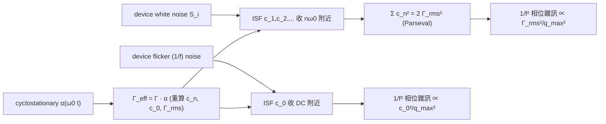

# Device noise → ISF harmonics 的映射

> **先備**：[white_noise_to_phase_noise](/03_isf_core_theory/white_noise_to_phase_noise)（white → 1/f²）、[flicker_noise_upconversion](/03_isf_core_theory/flicker_noise_upconversion)（flicker → 1/f³）、[fourier_series_of_isf](/03_isf_core_theory/fourier_series_of_isf)（$c_0$、$c_n$）｜ **接下來**：[symmetry](/06_design_insights/symmetry)、[tank_swing](/06_design_insights/tank_swing)、[serdes_clocking_connection](/06_design_insights/serdes_clocking_connection)

這頁把前面零散的設計直覺**收成一張地圖**：一顆 transistor 的雜訊（white 與 flicker）
是怎麼一路變成 oscillator 的 phase noise 的？關鍵是兩件事——**哪一段頻率的 device noise
被哪一個 ISF 諧波接收**，以及 **device 不是整個週期都在漏雜訊（cyclostationary，週期穩態）**，
所以真正起作用的是 **effective ISF $\Gamma_{eff}=\Gamma\cdot\alpha$**。

> **物理直覺（先講結論）**：把 ISF 想成一台**多頻道收音機**。它的傅立葉係數 $c_n$ 是各頻道
> 的天線增益：$c_0$ 收「DC 附近」的 device flicker（上轉成 1/f³）；$c_1$ 收「$\omega_0$ 附近」、
> $c_2$ 收「$2\omega_0$ 附近」……的 device white noise（下轉成 1/f²）。而 device 只在**波形某些相位**
> 才真的在導通、才真的在漏雜訊——這個「何時漏」的開關函數 $\alpha(\omega_0 t)$ 要先乘進 $\Gamma$，
> 變成 effective ISF，才是收音機真正的天線。

## 第 1 步：device noise 的兩種「頻段」

一顆 MOS device 的汲極電流雜訊（折算到注入節點）大致分兩段（[P1] Eqs.(19),(22), p.185）：

$$
S_i(f)=\underbrace{\frac{\overline{i_n^2}}{\Delta f}}_{\text{white（平的）}}\;+\;\underbrace{\frac{\overline{i_n^2}}{\Delta f}\cdot\frac{\omega_{1/f}}{2\pi f}}_{\text{flicker（1/f）}}
$$

- **white noise**：thermal（熱雜訊，$4kT\gamma g_m$ 之類）+ shot，**頻率平坦**，能量散布在所有頻率，
  包含 $\omega_0,2\omega_0,\dots$ 附近。
- **flicker（1/f）noise**：通道捕捉/釋放電荷的慢過程，能量**集中在低頻**（$\Delta\omega\ll\omega_0$），
  在 device 1/f corner $\omega_{1/f}$ 以下才顯著。
- **單位**：兩段都是 A²/Hz。

## 第 2 步：ISF 諧波是「接收頻道」——誰接誰

把 ISF 傅立葉展開（[P1] Eq.(12)）代進 phase response（[P1] Eq.(13)），每個 $c_n$ 項都是一個
把「$n\omega_0$ 附近 noise」**搬到 baseband 相位**的 mixer：

| ISF 諧波 | 接收的 device noise 頻段 | 搬到哪 | 造成的 phase noise 區 |
|---|---|---|---|
| $c_0$（DC 項，值 $c_0/2$） | **低頻 flicker**（DC 附近） | 純積分、不搬移 | close-in **1/f³**（[P1] Eq.(23)） |
| $c_1$ | $\omega_0\pm\Delta\omega$ 的 white | 下轉到 $\Delta\omega$ | **1/f²** 主要貢獻 |
| $c_2,c_3,\dots$ | $n\omega_0\pm\Delta\omega$ 的 white | 下轉到 $\Delta\omega$ | 同樣進 **1/f²**（透過 $\sum c_n^2$） |

- **white noise → 1/f²**：所有 $c_n$（$n\ge0$ 的 white 部分）一起貢獻，透過 Parseval 收成
  $\sum_{n=0}^{\infty}c_n^2=2\Gamma_{rms}^2$（[P1] Eq.(20), p.185），結果是
  $\mathcal{L}\propto\Gamma_{rms}^2/q_{max}^2$（[P1] Eq.(21)）。**所以 1/f² 由 $\Gamma_{rms}$ 決定。**
- **flicker → 1/f³**：只有 $c_0$ 那個無載波通道接收，結果 $\mathcal{L}\propto c_0^2/q_{max}^2$
  （[P1] Eq.(23)）。**所以 1/f³ 由 $c_0$ 決定。**
- 一句話對照：**$\Gamma_{rms}$ 管 white（1/f²）；$c_0$ 管 flicker（1/f³）。** 這是整張地圖的骨架。

把這個「多頻道收音機」畫成一張圖看最清楚：上半是 device 的電流雜訊 PSD $S_i(f)$（近 DC 的
flicker 隆起 + 平坦的 white 高原），三個陰影帶標出 ISF 真正「收聽」的頻段（DC、$f_0$、$2f_0$）；
下半是同一個 ISF 的傅立葉係數 $|c_n|$ stem，對齊在上面的頻段下方，箭頭表示每個頻段折回載波、
權重正是該諧波的 $c_n$——$c_0$ 把近 DC 的 flicker **上轉**成 close-in 1/f³，$c_1,c_2$ 把 $f_0,2f_0$
附近的 white **下轉**成 1/f²。


> 圖的 $|c_n|$ 由 `simulations/fig_device_noise_bands.py` 用 `compute_fourier_coefficients`
> 對一個 toy 不對稱 ISF（$\Gamma=-\sin\theta+0.35\sin2\theta+0.25$）算出，得 $c_0=0.50$、
> $c_1=1.00$、$c_2=0.35$。這是 **pedagogical toy model（非 transistor-level）**：只為展示「諧波=頻道」
> 的映射結構，$S_i(f)$ 的縱軸為 arb. 單位。對應 [P1] Eq.(12),(13)（傅立葉展開 → 分諧波 phase response）
> 與 Eq.(19),(23)（white/flicker 的求和）。

把這張地圖的「收音機增益」寫成可代數字的式子（本頁此前公式偏少，這裡補齊三條核心關係，
全部來自 [P1] 並與本站公式表一致）：

**(M1) white → 1/f² phase noise**（[P1] Eq.(21), p.185；分子是 $\Gamma_{rms}$）：

$$
\mathcal{L}_{1/f^2}\{\Delta\omega\}=10\log_{10}\!\left(\frac{\Gamma_{rms}^2}{q_{max}^2}\cdot\frac{\overline{i_n^2}/\Delta f}{4\,\Delta\omega^2}\right)
$$

**(M2) flicker → 1/f³ phase noise**（[P1] Eq.(23), p.185；分子是 $c_0$）：

$$
\mathcal{L}_{1/f^3}\{\Delta\omega\}=10\log_{10}\!\left(\frac{c_0^2}{q_{max}^2}\cdot\frac{\overline{i_n^2}/\Delta f}{8\,\Delta\omega^2}\cdot\frac{\omega_{1/f}}{\Delta\omega}\right)
$$

**(M3) 兩區的相對高度（同一 offset，把 (M2) 除以 (M1) 的線性括號）**：

$$
\frac{\mathcal{L}_{1/f^3}}{\mathcal{L}_{1/f^2}}\bigg|_{\text{linear}}
=\frac{c_0^2/(8\,\Delta\omega^2)}{\Gamma_{rms}^2/(4\,\Delta\omega^2)}\cdot\frac{\omega_{1/f}}{\Delta\omega}
=\frac{c_0^2}{2\,\Gamma_{rms}^2}\cdot\frac{\omega_{1/f}}{\Delta\omega}
$$

- **(M3) 的用途**：在任一 offset 上，這個比值 $> 1$ 代表 flicker（1/f³）主導、$< 1$ 代表 white（1/f²）主導；
  令它 $=1$ 就解出 1/f³ corner $\Delta\omega_{1/f^3}=\omega_{1/f}\cdot c_0^2/(2\Gamma_{rms}^2)$（[P1] Eq.(24)，
  推導見 [symmetry](/06_design_insights/symmetry)）。
- **dimension check**：(M3) 右邊 $\dfrac{\text{無因次}^2}{\text{無因次}^2}\cdot\dfrac{[\text{rad/s}]}{[\text{rad/s}]}$ = 無因次 ✓
  （一個純比值，正確）。

## 第 3 步：cyclostationary——device 不是一直在漏雜訊

上面的 $\Gamma$ 是「裸 ISF」——它假設 noise 任何時刻都一樣大。但真實 device 的雜訊強度是
**週期變化的（cyclostationary，週期穩態）**：例如尾電流源只在某半週導通、switching pair 只在
transition 時 $g_m$ 最大。Hajimiri–Lee 用一個 **noise-modulating function（NMF，雜訊調變函數）**
$\alpha(\omega_0 t)$（$0\le\alpha\le1$，週期）描述「device 何時在漏雜訊」，把它折進 ISF
（[P1] Sec. II-D, Eq.(25)–(27), p.186；$i_n(t)=i_{n0}(t)\cdot\alpha(\omega_0 t)$ 為 Eq.(25)，
$\Gamma_{eff}=\Gamma\cdot\alpha$ 為 Eq.(27)）：

$$
\boxed{\ \Gamma_{eff}(\omega_0\tau)=\Gamma(\omega_0\tau)\cdot\alpha(\omega_0\tau)\ }
$$

- **意義**：真正進到 phase noise 公式的不是 $\Gamma$，而是 $\Gamma_{eff}$。所有 $c_n$、$c_0$、$\Gamma_{rms}$
  都要用 $\Gamma_{eff}$ 重算。
- **設計上極關鍵的後果**：就算波形對稱讓裸 $\Gamma$ 的 $c_0=0$，如果 device 只在半週漏雜訊
  （$\alpha$ 不對稱），$\Gamma_{eff}=\Gamma\cdot\alpha$ 可能**重新長出一個非零 $c_0$** → flicker 又上轉了。
  反之，把 device 的「導通窗口 $\alpha$」對準裸 $\Gamma$ 的低值相位，可以**同時降 $c_0$ 與 $\Gamma_{rms}$**。
- 更嚴格的數學基礎（PPV / adjoint / Floquet）**不在下載的 5 篇 PDF 內，以標準文獻補充**
  （Demir–Mehrotra–Roychowdhury 2000 等），見 [effective_isf](/03_isf_core_theory/effective_isf)。

可用內建函式做 toy 計算（**pedagogical toy model，非 transistor-level**）：

```python
import numpy as np
from simulations.common.isf_utils import (
    gamma_lc_ideal, effective_isf, compute_fourier_coefficients, gamma_rms)

theta = np.linspace(0, 2*np.pi, 2048, endpoint=False)
gamma = gamma_lc_ideal(theta)            # 裸 ISF = -sin(theta)，c0 = 0
# 不對稱 NMF：device 只在前半週導通（α=1 於 θ<π，否則 0）
alpha = np.where(theta < np.pi, 1.0, 0.0)
gamma_eff = effective_isf(gamma, alpha)       # 乘上 NMF（positional：gamma_values, alpha_values）
a0, a, b, c, ph = compute_fourier_coefficients(theta, gamma_eff, n_harmonics=8)
print("c0 =", a0, " Gamma_rms =", gamma_rms(theta, gamma_eff))
# -> c0 ≈ -0.637（裸 Γ 的 c0=0，被不對稱 α 重新長出來）、Gamma_rms ≈ 0.500
```

（完整 API 見 `simulations/common/isf_utils.py`；`effective_isf` 與 `gamma_rms` 為真實函式。）

## 第 4 步：兩個獨立槓桿——哪些 knob 改 $\Gamma_{rms}$、哪些改 $q_{max}$

phase noise 的核心比值是 $\dfrac{\Gamma_{rms}^2}{q_{max}^2}$（白噪，[P1] Eq.(21)）與 $\dfrac{c_0^2}{q_{max}^2}$
（flicker，[P1] Eq.(23)）。分子（ISF 形狀）與分母（電荷擺幅）是**兩個彼此獨立**的旋鈕。把所有
design knob 按「動哪個量」分類：

| 改 **$\Gamma_{rms}$ / $c_0$**（ISF 形狀） | 改 **$q_{max}$**（電荷擺幅） |
|---|---|
| 波形對稱（rise/fall 匹配）→ 降 $c_0$ | 加大 voltage swing $V_{max}$ |
| 快 transition（陡邊緣）→ 降 $\Gamma_{rms}$ | 提高 tank $Q$／$R_p$（同電流更大 swing） |
| ring 級數 $N\uparrow$ → $\Gamma_{rms}\propto N^{-3/4}$（見下） | 加大節點電容 $C$（會綁 $f_0$，慎用） |
| 對稱負載、差動 → 降偶次諧波、降 $c_0$ | differential → 有效 swing ×2 |
| 把 device 導通窗 $\alpha$ 對準低 $\Gamma$ 相位（cyclostationary）→ 降 effective $\Gamma_{rms}$、$c_0$ | 把 bias 推到 headroom 上限（current/voltage limited） |
| 降 device $\omega_{1/f}$（大面積、PMOS）→ 降 1/f³ 高度（不改 $c_0$） | — |

> ring 的 $\Gamma_{rms}\propto N^{-3/4}$ 來自 [P2] Eq.(16), p.794（已核實）：
> $\Gamma_{rms}=\sqrt{\dfrac{2\pi^2}{3\eta^3}}\cdot N^{-3/4}$（$\eta\approx1$ 為級延遲比例常數），且在固定 $f_0$、固定功率下 ring phase noise 大致
> **與 $N$ 無關**（device 數目隨 $N$ 增加抵銷了 $\Gamma_{rms}$ 下降）——見 [lc_vs_ring](/06_design_insights/lc_vs_ring)。

## 數值例子（建立手感）

> 把一顆 device 的兩段 noise 分別映到兩個 phase noise 區。

取 canonical：$f_0=5$ GHz、$q_{max}=1$ pC、$\Gamma_{rms}=0.5$、$S_i=10^{-24}$ A²/Hz、
不對稱 $c_0=0.4$、device $f_{1/f}=1$ MHz。

- **white → 1/f²**（@ $\Delta f=1$ MHz，[P1] Eq.(21)）：如例 B，$\mathcal{L}=-148.0$ dBc/Hz。
- **flicker → 1/f³**（@ $\Delta f=1$ MHz，[P1] Eq.(23)）：相對 1/f² 多一個
  $\dfrac{c_0^2}{2\Gamma_{rms}^2}\cdot\dfrac{\omega_{1/f}}{\Delta\omega}$ 的因子。
  在 $\Delta f=1$ MHz $=f_{1/f}$ 處兩區交會（$\omega_{1/f}/\Delta\omega=1$），1/f³ 相對 1/f² 高
  $10\log_{10}(c_0^2/(2\Gamma_{rms}^2))=10\log_{10}(0.32)=-4.9$ dB——亦即此 offset 上 flicker 貢獻
  還略低於 white；交會點（1/f³ corner）落在 $f_{1/f^3}=f_{1/f}\cdot c_0^2/(2\Gamma_{rms}^2)=320$ kHz
  （見 [symmetry](/06_design_insights/symmetry)）。低於 320 kHz 才由 flicker 主導。
- **手感**：在 1 MHz offset 看不太到 flicker（被 white 蓋住）；要看 1/f³ 得往 100 kHz 以下看。
  SerDes 若 loop bandwidth 把 close-in 濾掉，1/f³ 影響就小（見 [serdes_clocking_connection](/06_design_insights/serdes_clocking_connection)）。

## 整張地圖（mermaid）



## 適用與失效條件

| 條件 | 成立時 | 失效時 |
|---|---|---|
| 小擾動、線性 LTV | $c_n$ 分頻段映射成立 | 強非線性、大注入時 ISF 自身變 |
| noise 可分 white + 1/f | 兩區乾淨分離 | RTS／burst／correlated 雜訊要另計 |
| cyclostationary 用 $\Gamma_{eff}=\Gamma\cdot\alpha$ | 一階修正足夠 | 需 PPV/adjoint 嚴格處理時（外部文獻） |

## Worked examples 數值例題

以下兩題分別把 **white** 與 **flicker** device noise 映成 phase noise，示範 $\Gamma_{rms}$（管 white）
與 $c_0$（管 flicker）這兩個獨立旋鈕。沿用 canonical：$f_0=5$ GHz、$q_{max}=1$ pC、$\Gamma_{rms}=0.5$、
$S_i=\overline{i_n^2}/\Delta f=10^{-24}$ A²/Hz、不對稱 $c_0=0.4$、device $f_{1/f}=1$ MHz。

> **例 1（white noise 映到 $\Gamma_{rms}$ → 1/f² 高度）**
> 用 (M1) 算 $\Delta f=1$ MHz 處的 1/f² phase noise；再問「$\Gamma_{rms}$ 減半（$0.5\to0.25$）」後降多少 dB。

**逐步代入（帶單位）**：

$$
\begin{aligned}
\Delta\omega&=2\pi\times10^{6}=6.283\times10^{6}\ \text{rad/s},\quad \Delta\omega^2=3.948\times10^{13}, \\[4pt]
\text{括號}&=\frac{(0.5)^2}{(10^{-12})^2}\cdot\frac{10^{-24}}{4\times3.948\times10^{13}}
=\frac{0.25}{10^{-24}}\cdot\frac{10^{-24}}{1.579\times10^{14}}=1.583\times10^{-15}, \\[4pt]
\mathcal{L}_{1/f^2}&=10\log_{10}(1.583\times10^{-15})=-148.0\ \text{dBc/Hz}.
\end{aligned}
$$

$\Gamma_{rms}$ 減半 → $\Gamma_{rms}^2$ 變 $\tfrac14$ →
$\Delta\mathcal{L}=10\log_{10}(0.25^2/0.5^2)=10\log_{10}(1/4)=-6.02$ dB → 新值 $-154.0$ dBc/Hz。

- **結果**：white noise 的 1/f² 高度 $=-148.0$ dBc/Hz；降 $\Gamma_{rms}$ 一半 → 改善 6 dB。
  **white 只看 $\Gamma_{rms}$，完全不看 $c_0$。**
- **Dimension check**：同 tank_swing 例 1，括號內化簡為無因次 per-Hz 功率比 → dBc/Hz ✓。
- **一行 Python 驗證**：

```python
import numpy as np
def L_white(grms, qmax, Si, dw): return 10*np.log10(grms**2/qmax**2 * Si/(4*dw**2))
dw = 2*np.pi*1e6
print(round(L_white(0.5,1e-12,1e-24,dw),1),
      round(L_white(0.25,1e-12,1e-24,dw)-L_white(0.5,1e-12,1e-24,dw),2))  # -> -148.0 -6.02
```

> **例 2（flicker noise 映到 $c_0$ → 1/f³ 高度，並用 (M3) 判斷主導區）**
> 用 (M2) 算 $\Delta f=100$ kHz 處的 1/f³ phase noise，並用 (M3) 判斷該 offset 由 flicker 還是 white 主導。

**逐步代入（帶單位）**，先算 (M3) 比值判斷主導者（$\Delta f=100$ kHz $\Rightarrow\omega_{1/f}/\Delta\omega=f_{1/f}/\Delta f=10$）：

$$
\frac{\mathcal{L}_{1/f^3}}{\mathcal{L}_{1/f^2}}\bigg|_{\text{linear}}
=\frac{c_0^2}{2\Gamma_{rms}^2}\cdot\frac{f_{1/f}}{\Delta f}
=\frac{0.4^2}{2\times0.5^2}\cdot\frac{10^6}{10^5}
=0.32\times10=3.2\;(>1).
$$

比值 $3.2 > 1$ → 在 100 kHz **flicker 已經主導**（與 corner $f_{1/f^3}=320$ kHz $>100$ kHz 一致）。
flicker 高度本身：

$$
\begin{aligned}
\Delta\omega&=2\pi\times10^{5}=6.283\times10^{5}\ \text{rad/s},\quad\Delta\omega^2=3.948\times10^{11}, \\[4pt]
\text{括號}&=\frac{(0.4)^2}{(10^{-12})^2}\cdot\frac{10^{-24}}{8\times3.948\times10^{11}}\cdot\frac{2\pi\times10^6}{2\pi\times10^5} \\[4pt]
&=\frac{0.16}{10^{-24}}\cdot\frac{10^{-24}}{3.158\times10^{12}}\cdot 10
=\frac{0.16\times10}{3.158\times10^{12}}=5.066\times10^{-13}, \\[4pt]
\mathcal{L}_{1/f^3}&=10\log_{10}(5.066\times10^{-13})=-122.95\approx-123.0\ \text{dBc/Hz}.
\end{aligned}
$$

- **結果**：在 100 kHz，1/f³（flicker）約 $-123.0$ dBc/Hz 且**主導**（比值 3.2）。
  **flicker 只看 $c_0$**：若把波形做對稱讓 $c_0\to0.04$（小 10 倍），這條 1/f³ 整體降 $10\log_{10}(0.04^2/0.4^2)=-20$ dB。
- **Dimension check**：(M3) 比值無因次 ✓；(M2) 括號多乘一個無因次的 $\omega_{1/f}/\Delta\omega$，
  斜率變 $1/\Delta\omega^3$（1/f³）✓。
- **一行 Python 驗證**：

```python
import numpy as np
c0, grms, qmax, Si, f1f = 0.4, 0.5, 1e-12, 1e-24, 1e6
df = 1e5; dw = 2*np.pi*df
ratio = c0**2/(2*grms**2) * (f1f/df)
L_1f3 = 10*np.log10(c0**2/qmax**2 * Si/(8*dw**2) * (f1f/df))
print(round(ratio,2), round(L_1f3,1))   # -> 3.2  -123.0  (ratio>1 => flicker dominates)
```

> 兩題皆 **pedagogical toy（非 transistor-level）**：$c_0$、$\Gamma_{rms}$ 用假設值。真實電路要用
> effective ISF $\Gamma_{eff}=\Gamma\cdot\alpha$ 重算 $c_0$、$\Gamma_{rms}$（見第 3 步與 [effective_isf](/03_isf_core_theory/effective_isf)）。

## 重點回顧

- device noise 分兩段：white（散布所有頻率）、flicker（集中低頻）。
- ISF 諧波是收音頻道：**$c_0$ 收 flicker → 1/f³**；**$c_1,c_2,\dots$ 收 white → 1/f²**（經 Parseval 收成 $\Gamma_{rms}$）。
- 真正起作用的是 **effective ISF $\Gamma_{eff}=\Gamma\cdot\alpha$**（cyclostationary）；對稱的裸 $\Gamma$ 可能因不對稱 $\alpha$ 又長出 $c_0$。
- 兩個獨立槓桿：改 $\Gamma_{rms}$/$c_0$（波形對稱、快邊緣、差動、$\alpha$ 對齊）vs 改 $q_{max}$（swing、$Q$、differential）。
- ring $\Gamma_{rms}\propto N^{-3/4}$（[P2] Eq.(16), p.794，已核實）；固定 $f_0$/功率下 phase noise ~與 $N$ 無關。

## 延伸閱讀

- effective ISF 與 PPV/adjoint：[effective_isf](/03_isf_core_theory/effective_isf)
- white → 1/f²：[white_noise_to_phase_noise](/03_isf_core_theory/white_noise_to_phase_noise)
- flicker → 1/f³：[flicker_noise_upconversion](/03_isf_core_theory/flicker_noise_upconversion)
- $\Gamma_{rms}$ 與 Parseval：[rms_isf](/03_isf_core_theory/rms_isf)
- $q_{max}$ 槓桿：[tank_swing](/06_design_insights/tank_swing)；對稱：[symmetry](/06_design_insights/symmetry)
