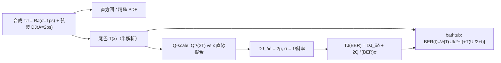

# DJ 與 dual-Dirac 模型：TJ@BER 的業界標準工具

> **先備**：[serdes_clocking_connection](/06_design_insights/serdes_clocking_connection)（RJ/DJ/TJ 初登場、eye 與 BER）、[lab_12](/04_simulation_labs/lab_12_serdes_eye_ber)（RJ-only bathtub）、[lab_08](/04_simulation_labs/lab_08_jitter_integration)（$\sigma_t$ 從 phase noise 積分而來）｜ **接下來**：[exercises](/06_design_insights/exercises)、[lab_13](/04_simulation_labs/lab_13_pll_cdr_transfer)

[serdes_clocking_connection](/06_design_insights/serdes_clocking_connection) 已經給出速記式
「TJ $=$ DJ $+\,2Q\cdot$RJ」。這一頁把這個式子**從頭嚴格建立起來**：什麼是 RJ、什麼是 DJ、
$Q$ 從哪個積分來、bathtub 曲線怎麼從 jitter 的 CDF（累積分布函數）推出來、
以及業界（Fibre Channel MJSQ 以降的 SerDes 規格）實際在用的 **dual-Dirac（雙 Dirac）模型**
——包含它最常被誤解、也最重要的誠實聲明：**模型參數 $\mathrm{DJ}_{\delta\delta}$ 天生
小於等於實際的 peak-to-peak DJ**，而且這個「低報」是**故意的**，正是它讓 TJ 外插準確。

> **物理直覺（先講結論）**：jitter 有兩種本質不同的成分。**RJ（random jitter，隨機抖動）**
> 是振盪器 phase noise 的時域化身——高斯、**無上界**，你等得越久（BER 目標越嚴）它就「長」得越大，
> 所以必須用 $\sigma$ 乘上一個隨 BER 變大的倍數來記帳。**DJ（deterministic jitter，確定性抖動）**
> 由確定的物理機制驅動（碼間干擾、佔空比失真、電源漣波），幅度**有物理上限**，
> 用 peak-to-peak 記帳、不隨 BER 放大。dual-Dirac 模型就是把「任意形狀的有界 DJ」
> 壓縮成**兩支 Dirac**、把 RJ 保留為高斯，換取一條可以外插到 $10^{-12}$ 的直線。
> 量測 $10^{-12}$ 的 BER 要等 $10^{12}$ 個位元——10 Gb/s 也要 100 秒才「平均看到一次錯」，
> 要有統計信心得等小時級；**外插不是偷懶，是工程必需**。

## 第 1 步：RJ——無界高斯，從 phase noise 一路走來（本站鏈）

RJ 就是本站前六章建立的整條鏈的終點，逐步回顧（每步有專頁）：

1. **device 白噪 → 1/f² phase noise**：[P1] Eq.(21), p.185 給
   $\mathcal{L}\{\Delta\omega\}=10\log_{10}\!\big(\tfrac{\Gamma_{rms}^2}{q_{max}^2}\cdot\tfrac{\overline{i_n^2}/\Delta f}{4\Delta\omega^2}\big)$
   （$\Gamma_{rms}$ 無因次、$q_{max}$ 單位 C、$\overline{i_n^2}/\Delta f$ 單位 A²/Hz）。
   詳見 [white_noise_to_phase_noise](/03_isf_core_theory/white_noise_to_phase_noise)。
2. **phase noise 積分 → rms jitter**：$\sigma_t=\frac{1}{2\pi f_0}\sqrt{\int_{f_1}^{f_2}S_\phi(f)\,df}$
   （單位 s；canonical 例 C：$f_0=5$ GHz、$\mathcal{L}(1\text{MHz})=-100$ dBc/Hz、1/f²、積 1→100 MHz
   → $\sigma_t=447.9$ fs）。詳見 [lab_08](/04_simulation_labs/lab_08_jitter_integration)。
3. **時域觀點——隨機漫步**：[P2] Eq.(8), p.792 給累積**相位** jitter
   $\sigma_{\Delta\phi}=\kappa\sqrt{\Delta t}$（$\kappa$ 單位 $1/\sqrt{\text{s}}$，由 [P2]
   Eq.(11)/(12), p.793 $\kappa=\tfrac{\Gamma_{rms}}{q_{max}}\sqrt{\tfrac12\overline{i_n^2}/\Delta f}$；
   注意式中**沒有** $\omega_0$——換成時間版要再除 $\omega_0$）。
4. **為什麼是高斯**：每個週期振盪器吃進大量**彼此獨立**的微小雜訊踢擊，總相位誤差是
   獨立增量之和 → 中央極限定理 → 高斯。[lab_11](/04_simulation_labs/lab_11_monte_carlo_jitter)
   用 Monte-Carlo 直接驗證了直方圖是高斯、$\sigma\propto\sqrt{\Delta N}$。

**RJ 的關鍵性質：無上界。** 高斯的尾巴永遠不為零——不存在「保證不越界」的 margin，
只能問「越界機率多小」。這就是為什麼 RJ 必須用 $\sigma$ 搭配目標 BER 記帳（第 3 步的 $Q$ 函數）。

## 第 2 步：DJ——有界，由確定機制驅動

DJ 是 ISF 理論「看不見」的那一半（它不來自振盪器的隨機雜訊），但 SerDes 量到的 TJ 裡它常常最大。
三個主要來源，各有明確物理與明確上限：

| DJ 種類 | 物理機制 | PDF 形狀 | 為何有界 |
|---|---|---|---|
| **ISI**（inter-symbol interference，碼間干擾） | 通道頻寬有限、有記憶：edge 位置依賴前面的位元 pattern | 多支離散尖峰（每種 pattern 一支） | 通道脈衝響應長度有限 |
| **DCD**（duty-cycle distortion，佔空比失真） | 上升/下降緣不對稱、threshold 偏移：上升緣系統性偏早、下降緣偏晚 | **恰好兩支 Dirac** | 不對稱量固定 |
| **PJ/SJ**（periodic/sinusoidal jitter；電源 spur、串擾） | 電源漣波經 supply pushing 調變 VCO（見 [varactor_tuning_supply_pushing](/06_design_insights/varactor_tuning_supply_pushing)）、鄰近時脈耦合 | arcsine（雙角）分布 | 弦波幅度固定 |

注意 **DCD 的 PDF 本來就是兩支 Dirac**——dual-Dirac 模型對它是**精確**的；
模型的名字與形狀正是從這種「最壞情況形狀」來的。

**弦波 DJ 的 PDF（arcsine 分布），逐步推導。** 這是 lab_31 用的 DJ，也是電源 spur 的標準模型。
設 edge 的時間偏移 $x=A\sin\theta$，$A$ 為幅度（單位 s），spur 與資料不同步，
所以取樣到的相位 $\theta$ 在 $[0,2\pi)$ 均勻分布，$p_\Theta(\theta)=\tfrac{1}{2\pi}$（單位 1/rad）。
變數變換：一個週期內每個 $x\in(-A,A)$ 對應**兩個** $\theta$ 分支，每支貢獻
$p_\Theta/\vert dx/d\theta\vert$，而 $\vert dx/d\theta\vert=A\vert\cos\theta\vert=\sqrt{A^2-x^2}$：

$$
p_{DJ}(x)=2\cdot\frac{1}{2\pi}\cdot\frac{1}{\sqrt{A^2-x^2}}=\frac{1}{\pi\sqrt{A^2-x^2}},\qquad \vert x\vert\lt A
$$

- **單位**：$1/\sqrt{[\text{s}^2]}=1/[\text{s}]$ ✓（PDF 對 $x$ 積分無因次）。
- **歸一化檢查**：$\int_{-A}^{A}\frac{dx}{\pi\sqrt{A^2-x^2}}=\frac{1}{\pi}\big[\arcsin\tfrac{x}{A}\big]_{-A}^{A}=\frac{1}{\pi}\big(\tfrac{\pi}{2}+\tfrac{\pi}{2}\big)=1$ ✓。
- **物理**：弦波在轉折點附近停留最久 → 機率密度在 $\pm A$ 兩端**發散**（可積的「雙角」）。
  lab_31 圖 (a) 的直方圖清楚可見這兩支角。
- **有界**：$\mathrm{DJ}_{pp}=2A$（peak-to-peak，單位 s）。**適用條件**：spur 與資料 asynchronous
  （相位均勻）；若 spur 與資料鎖定（synchronous），PDF 退化成離散尖峰，仍有界。

## 第 3 步：$Q$ 函數——高斯尾巴積分，$Q^{-1}(10^{-12})=7.03$ 從哪來

RJ 的記帳工具是高斯尾巴機率。標準常態 $X\sim\mathcal{N}(0,1)$（無因次）：

$$
Q(x)\equiv P(X\gt x)=\int_x^{\infty}\frac{1}{\sqrt{2\pi}}\,e^{-u^2/2}\,du
$$

**逐步化成 erfc**（這樣才接得上 `scipy` 與本站 `serdes_utils.Q`）。代換 $u=\sqrt2\,s$、$du=\sqrt2\,ds$，
積分下限變 $x/\sqrt2$：

$$
Q(x)=\frac{\sqrt2}{\sqrt{2\pi}}\int_{x/\sqrt2}^{\infty}e^{-s^2}\,ds=\frac{1}{\sqrt\pi}\int_{x/\sqrt2}^{\infty}e^{-s^2}\,ds=\frac12\,\mathrm{erfc}\!\Big(\frac{x}{\sqrt2}\Big)
$$

最後一步用了定義 $\mathrm{erfc}(z)=\tfrac{2}{\sqrt\pi}\int_z^\infty e^{-s^2}ds$。
一般高斯（平均 $\mu$、標準差 $\sigma$，單位皆 s）再代換一次 $u=(v-\mu)/\sigma$ 得
$P(V\gt v)=Q\!\big(\tfrac{v-\mu}{\sigma}\big)$——**$Q$ 的引數永遠是「離平均幾個 $\sigma$」，無因次** ✓。

**深尾漸近式（分部積分一次）**：

$$
Q(x)\approx\frac{e^{-x^2/2}}{x\sqrt{2\pi}}\quad(x\gg1,\ \text{相對誤差約}\ 1/x^2)
$$

用它口算 $Q(7.03)$：指數 $7.034^2/2=24.7$、$e^{-24.7}\approx1.8\times10^{-11}$、
除以 $7.03\times2.507\approx17.6$ → $\approx1.0\times10^{-12}$ ✓。這就是全站 jitter 章一直在用的
「BER $10^{-12}$ ↔ $7.03\sigma$」對照（與 [06 exercises](/06_design_insights/exercises) 的 $Q$ 表一致）：

| 目標 BER | $Q^{-1}(\text{BER})$ | RJ peak-to-peak $=2Q^{-1}\sigma$ |
|---|---|---|
| $10^{-9}$ | $5.998$ | $12.0\,\sigma$ |
| $10^{-12}$ | $7.034$（本站記 7.03） | $14.07\,\sigma$ |
| $10^{-15}$ | $7.941$（本站記 7.94） | $15.88\,\sigma$ |

一行 Python 驗證（引用本站真實 API；$Q^{-1}$ 用 `erfcinv` 反解上面的尾巴積分）：

```python
import numpy as np
from scipy.special import erfcinv
from simulations.common.serdes_utils import Q
q = np.sqrt(2) * erfcinv(2 * 1e-12)              # Q 的反函數（尾巴積分反解）
print("Qinv(1e-12) =", round(float(q), 3))       # -> 7.034
print("Q(7.034)    =", float(Q(7.034)))          # -> 1.0e-12
```

## 第 4 步：dual-Dirac 模型——定義與 PDF

模型做兩件事（外部文獻，非本站 5 篇 PDF；方法論出處見頁尾）：

1. **TJ 的 PDF 是 DJ 的 PDF 與高斯 RJ 的卷積**（RJ 與 DJ 統計獨立）：
   $p_{TJ}=p_{DJ}*g_\sigma$，其中 $g_\sigma(x)=\tfrac{1}{\sigma\sqrt{2\pi}}e^{-x^2/2\sigma^2}$（單位 1/s）。
2. **把任意形狀的有界 $p_{DJ}$ 壓縮成兩支等權 Dirac**，間距記作 $\mathrm{DJ}_{\delta\delta}$：

$$
p_{DJ}(x)\ \longrightarrow\ \frac12\,\delta(x-\mu_R)+\frac12\,\delta(x-\mu_L),\qquad \mathrm{DJ}_{\delta\delta}\equiv\mu_R-\mu_L
$$

卷積用 Dirac 的取樣性質 $\int\delta(v-\mu)g_\sigma(x-v)dv=g_\sigma(x-\mu)$，一步得模型 PDF：

$$
p_{\delta\delta}(x)=\frac12\,g_\sigma(x-\mu_R)+\frac12\,g_\sigma(x-\mu_L)
$$

——**兩顆同 $\sigma$ 的高斯，各佔一半機率**。對稱情形（本頁與 lab_31）$\mu_R=-\mu_L=\mu=\mathrm{DJ}_{\delta\delta}/2$。

**尾巴（tail）函數，逐步積分。** 定義 $T(x)\equiv P(\text{jitter}\gt x)=1-F(x)$（$F$ 為 CDF）。
對模型 PDF 逐項用第 3 步的結果 $\int_x^\infty g_\sigma(v-\mu)\,dv=Q\big(\tfrac{x-\mu}{\sigma}\big)$：

$$
T_{\delta\delta}(x)=\frac12\,Q\!\Big(\frac{x-\mu_R}{\sigma}\Big)+\frac12\,Q\!\Big(\frac{x-\mu_L}{\sigma}\Big)
$$

**深尾只剩一項。** 兩項之比（用漸近式，對稱情形）：

$$
\frac{Q\big(\tfrac{x+\mu}{\sigma}\big)}{Q\big(\tfrac{x-\mu}{\sigma}\big)}\approx\exp\!\Big(-\frac{(x+\mu)^2-(x-\mu)^2}{2\sigma^2}\Big)=\exp\!\Big(-\frac{2\mu x}{\sigma^2}\Big)=\exp\!\Big(-\frac{\mathrm{DJ}_{\delta\delta}\,x}{\sigma^2}\Big)
$$

以 lab_31 的數字（$\mathrm{DJ}_{\delta\delta}=3.16$ ps、$\sigma=1.03$ ps、關心的 $x\approx8.6$ ps）
這個比值 $\approx e^{-25.6}\approx8\times10^{-12}$——完全可忽略。所以**深尾就是單顆權重 ½ 的高斯**：

$$
T_{\delta\delta}(x)\approx\frac12\,Q\!\Big(\frac{x-\mu}{\sigma}\Big)\qquad(x\ \text{在右深尾})
$$

**Q-scale 直線——萃取 $(\mathrm{DJ}_{\delta\delta},\sigma)$ 的原理。** 把上式反解：

$$
Q^{-1}\big(2\,T(x)\big)=\frac{x-\mu}{\sigma}
$$

——在「Q-scale」上（縱軸畫 $Q^{-1}(2T)$、橫軸 $x$），深尾是**一條直線**：斜率 $1/\sigma$、
橫軸截距 $\mu=\mathrm{DJ}_{\delta\delta}/2$。儀器（BERT scan 或示波器的 TIE 直方圖）就是對量到的
尾巴做這條**直線擬合**。注意 $Q^{-1}$ 裡的 **factor 2**：它記帳的是「每支 Dirac 只佔一半機率」
——這是本頁第一個要盯住的 factor-of-2（第 7 步還有兩個）。

## 第 5 步：bathtub 曲線——從 jitter CDF 逐步導出

設 NRZ 資料、UI（unit interval）$=T_b$（單位 s）。eye 中心為時間原點，取樣時刻 offset 為 $t$；
左 data edge 名目在 $-UI/2$、右 edge 在 $+UI/2$，各自帶 jitter $x$（同分布，尾巴 $T$、CDF $F$）。

1. **錯誤事件一（左 edge 遲到）**：左 edge 實際落在 $-UI/2+x$；若它**晚於**取樣時刻，
   即 $-UI/2+x\gt t\Leftrightarrow x\gt UI/2+t$，取樣器讀到**前一個位元**。機率 $=T(UI/2+t)$。
2. **錯誤事件二（右 edge 早到）**：右 edge 實際落在 $+UI/2+x$；若它**早於**取樣時刻，
   即 $UI/2+x\lt t\Leftrightarrow x\lt-(UI/2-t)$，機率 $=F(-(UI/2-t))$，
   對稱分布下 $=T(UI/2-t)$。
3. **只有「有跳變」才會錯**：隨機資料相鄰位元不同的機率是 $\tfrac12$（transition density
   $\rho_T=\tfrac12$）。兩事件都是稀有事件，聯集機率 $\approx$ 相加（交集是二階小量）：

$$
\boxed{\ \mathrm{BER}(t)=\frac12\Big[T\!\Big(\frac{UI}{2}-t\Big)+T\!\Big(\frac{UI}{2}+t\Big)\Big]\ }
$$

**一致性檢查**：純 RJ 時 $T(x)=Q(x/\sigma_t)$，上式退化成
$\mathrm{BER}(t)=\tfrac12[Q(\tfrac{UI/2-t}{\sigma_t})+Q(\tfrac{UI/2+t}{\sigma_t})]$
——正是 [lab_12](/04_simulation_labs/lab_12_serdes_eye_ber) 與 `serdes_utils.ber_bathtub`
的公式 ✓。**bathtub 的兩面「壁」就是 jitter CDF 的左右尾巴**，只是橫軸從「jitter 大小」
換成「取樣位置」重畫。DJ 的效果一目了然：它把整條尾巴**平移** $\approx\mu$ → 兩壁往內推；
RJ 決定壁的**斜率**（在 log-BER 座標，斜率由 $\sigma$ 定）。

- **Dimension check**：$T$ 的引數 $[\text{s}]$、輸出是機率（無因次）；BER 無因次 ✓。
- **適用**：稀有事件（$\mathrm{BER}\ll1$）、edge jitter 平穩且與資料獨立（ISI 嚴格說**與資料相關**，
  見第 8 步失效條件）。

## 第 6 步：TJ(BER) 外插公式——推導與 factor 稽核

**推導。** 目標：在指定 BER 下，eye 被 jitter「吃掉」多寬。右壁位置 $x_R$ 定義為右深尾的
主導高斯掉到目標 BER 的位置（業界慣例直接用 per-Gaussian 尾巴 $=$ BER 記帳，稽核見下）：

$$
Q\!\Big(\frac{x_R-\mu}{\sigma}\Big)=\mathrm{BER}\ \Longrightarrow\ x_R=\mu+\sigma\,Q^{-1}(\mathrm{BER})
$$

對稱地左壁 $x_L=-\mu-\sigma Q^{-1}(\mathrm{BER})$。total jitter 定義為兩壁吃掉的總寬：

$$
\boxed{\ \mathrm{TJ}(\mathrm{BER})=x_R-x_L=\mathrm{DJ}_{\delta\delta}+2\,Q^{-1}(\mathrm{BER})\,\sigma\ }
$$

BER $=10^{-12}$ 時 $\mathrm{TJ}=\mathrm{DJ}_{\delta\delta}+14.07\,\sigma$。eye 水平開度
$=UI-\mathrm{TJ}(\mathrm{BER})$。

- **Dimension check**：$[\text{s}]+[\text{無因次}]\times[\text{s}]=[\text{s}]$ ✓。
- **物理意義**：DJ 部分**不隨 BER 變**（有界、一次吃掉）；RJ 部分隨 BER 變嚴而以
  $Q^{-1}$ 緩慢長大（$10^{-12}\to10^{-15}$ 只從 $14.07\sigma$ 到 $15.88\sigma$——高斯尾巴的
  對數增長）。

> **Factor-of-2 稽核（本站慣例：把每個 2 講清楚）**。上式用 $Q^{-1}(\mathrm{BER})=7.034$，
> 隱含「**每顆高斯的尾巴** $=$ BER」。嚴格照第 4、5 步的記帳還有兩個 ½：
> Dirac 權重 ½（per-side 尾巴 $T=\tfrac12Q$）與 transition density $\rho_T=\tfrac12$（bathtub 再乘 ½）。
> 全部算進去，壁的位置由 $Q=4\times\mathrm{BER}$ 決定：
>
> | 慣例 | 壁條件 | 倍數（BER $=10^{-12}$） | lab_31 實得 TJ |
> |---|---|---|---|
> | per-Gaussian（業界公式） | $Q=\mathrm{BER}$ | $7.034$ | $17.65$ ps |
> | per-side 尾巴 $T=\mathrm{BER}$ | $Q=2\,\mathrm{BER}$ | $6.937$ | $17.43$ ps |
> | bathtub（$\rho_T=\tfrac12$，本站 lab_12 慣例） | $Q=4\,\mathrm{BER}$ | $6.839$ | $17.23$ ps |
>
> 三者相差 $Q^{-1}(10^{-12})-Q^{-1}(4\times10^{-12})=0.196\,\sigma$/側——本例共 $0.40$ ps、
> 約 TJ 的 2%，業界公式**偏保守**。實務上這不構成問題，因為 $(\mathrm{DJ}_{\delta\delta},\sigma)$
> 是用**同一套慣例**從尾巴擬合出來再代回去外插的——慣例一致時誤差幾乎對消；
> 但**比較不同儀器的 DJ/RJ 報告時，必須先問它用哪個慣例**。（lab_31 把三個數字都印出來。）

## 第 7 步：誠實聲明——$\mathrm{DJ}_{\delta\delta}\le\mathrm{DJ}_{pp}$，而且低報是故意的

這是 dual-Dirac 最常被誤解的一點：**$\mathrm{DJ}_{\delta\delta}$ 是模型參數，不是實際的
peak-to-peak DJ**。lab_31 的數字：真實弦波 DJ 的 $\mathrm{DJ}_{pp}=4.0$ ps，擬合出的
$\mathrm{DJ}_{\delta\delta}=3.16$ ps。

**為什麼一定偏小（推導）。** 總 jitter 尾巴是 DJ 分布對高斯尾巴的平均
（把卷積的積分順序交換一次即得）：

$$
T(x)=P(u+n\gt x)=\int_{-A}^{A}p_{DJ}(u)\,Q\!\Big(\frac{x-u}{\sigma}\Big)\,du
$$

因為 $u\le A$ 且 $Q$ 嚴格遞減，被積函數逐點滿足 $Q\big(\tfrac{x-u}{\sigma}\big)\le Q\big(\tfrac{x-A}{\sigma}\big)$。
把積分拆成右半（$u\gt0$，總質量 ½）與左半（$u\le0$，深尾時貢獻再小 $e^{-Ax/\sigma^2}$ 倍）：

$$
T(x)\ \le\ \frac12\,Q\!\Big(\frac{x-A}{\sigma}\Big)+\underbrace{\frac12\,Q\!\Big(\frac{x}{\sigma}\Big)}_{\text{指數小}}
$$

等號只在右半質量全部集中在 $u=A$（即 DCD 那種兩點分布）時成立。翻到 Q-scale：
$Q^{-1}(2T(x))\ \ge\ \tfrac{x-A}{\sigma}$——**真實尾巴曲線永遠在「Dirac 放在真極值 $A$」
那條線的上方**（lab_31 圖 (b) 的藍線 vs 灰虛線）。對真實曲線做直線擬合，截距必然
$\mu\le A$，即：

$$
\mathrm{DJ}_{\delta\delta}=2\mu\ \le\ 2A=\mathrm{DJ}_{pp}
$$

**為什麼低報反而讓 TJ 準。** 外插要準，需要的是「在目標 BER 那幾個 decade，直線貼住
**真實的尾巴高度**」——擬合正是這樣錨定的（lab_31：dual-Dirac 外插的 eye opening
$82.76$ ps vs 精確複合的 $82.77$ ps，差 $0.01$ ps）。反過來，若把 Dirac 硬放在真極值
$\pm A$（把 $\mathrm{DJ}_{pp}=4.0$ ps 當 $\mathrm{DJ}_{\delta\delta}$ 用），光 DJ 項就多報
$4.0-3.16=0.84$ ps：代入公式（真 $\sigma=1.0$ ps）得 $\mathrm{TJ}=4.0+14.07\times1.0=18.07$ ps，
比精確 bathtub 的 $17.23$ ps **悲觀 $0.84$ ps**——白白丟掉 margin。
直覺：DJ 分布靠近極值處只有**有限的機率質量**（弦波雖有雙角、仍是可積奇點），
深尾實際上是「打了折的高斯」，等效中心自然縮進來。

**代價（也要誠實說）**：

- $\mathrm{DJ}_{\delta\delta}$ **依賴擬合深度**。lab_31 掃三個擬合窗：
  $T\in[10^{-8},10^{-4}]\to3.07$ ps、$[10^{-10},10^{-6}]\to3.16$ ps、
  $[10^{-14},10^{-10}]\to3.27$ ps——越深越靠近（但不超過）$\mathrm{DJ}_{pp}$。
  報告 DJ/RJ 分解時應註明擬合窗；規格文件（MJSQ 系）對此有明確方法論。
- **DJ 會「漏」進 $\sigma$**：擬合出 $\sigma=1.03$ ps，比真實 RJ 的 $1.00$ ps 略大——
  DJ 尾巴殘餘的曲率被直線吸收成斜率的一部分。所以**別把儀器報的 RJ 直接當
  振盪器 phase noise 的積分值**去對帳（差幾 % 屬正常）；對帳要用乾淨時脈 pattern 隔離 DJ。

## 第 8 步：lab_31 數值驗證

完整 script：`simulations/lab_31_dual_dirac.py`（相依：`simulations/common/serdes_utils.py`
的 `Q`、`simulations/common/plot_utils.py` 的 `savefig`；執行 `python scripts/run_all_sims.py`
會一併重跑）。合成 RJ（$\sigma=1$ ps 高斯）$+$ 弦波 DJ（$A=2$ ps → $\mathrm{DJ}_{pp}=4$ ps）
於 $UI=100$ ps（10 Gb/s，同 lab_12）。尾巴 $T(x)$ 用「對弦波相位取平均」半解析算到
$10^{-15}$ 深度（無 Monte-Carlo 雜訊），擬合按第 4 步的 Q-scale 直線。



| 參數 | 變數 | 值 | 單位 | 說明 |
|---|---|---|---|---|
| RJ rms | `sigma_rj` | $1\times10^{-12}$ | s | 高斯、無界（教學上放大；canonical 例 C 的時脈是 447.9 fs） |
| DJ 幅度 | `a_dj` | $2\times10^{-12}$ | s | 弦波（電源 spur 型），$\mathrm{DJ}_{pp}=2A=4$ ps |
| 單位間隔 | `ui` | $100\times10^{-12}$ | s | 10 Gb/s NRZ |
| 目標 BER | `ber_target` | $10^{-12}$ | — | 常見 SerDes 規格 |
| 擬合窗 | `t_deep, t_shallow` | $[10^{-10},10^{-6}]$ | —（尾巴機率） | Q-scale 直線擬合區 |
| MC 樣本數 | `n_mc` | $2\times10^6$ | — | 只用於直方圖 |

執行輸出（節錄，`# ->` 為可驗證標記）：

```text
extracted DJ_dd = 3.16 ps      # -> 3.16 (< DJ_pp = 4.0)
extracted sigma = 1.03 ps      # -> 1.03 (true RJ rms 1.0)
TJ@1e-12 (formula)  = 17.65 ps # -> 17.65
TJ@1e-12 (bathtub)  = 17.23 ps # -> 17.23
eye opening @1e-12: composite 82.77 ps vs dual-Dirac 82.76 ps
```


**怎麼讀這張圖**：

- **(a) PDF**：藍色（真實）有 arcsine 雙角被高斯抹圓；紅虛線（dual-Dirac）在**中段明顯
  不貼**——模型從不宣稱 PDF 貼合，它只對**深尾**負責。紅點虛線（Dirac 位置 $\pm\mu=\pm1.58$ ps）
  在灰點虛線（真極值 $\pm2$ ps）**內側**：這就是 $\mathrm{DJ}_{\delta\delta}\lt\mathrm{DJ}_{pp}$。
- **(b) Q-scale**：深尾區藍線筆直 → 高斯主導；紅虛線是擬合直線（斜率 $1/\sigma$、截距 $\mu$）；
  灰點線是「Dirac 硬放 $\pm A$」的悲觀預測，落在真實曲線**下方**（同一 $x$ 給更大的尾巴機率）。
- **(c) bathtub**：藍（精確）與紅虛（dual-Dirac 外插）在 $10^{-12}$ 幾乎重合（開口差 0.01 ps）
  ——模型的本職；綠點線（RJ-only、無 DJ）開口寬得多：**DJ 平移壁、RJ 定斜率**。

一行式驗證（引用 lab_31 的真實函式；跑一次約數秒）：

```python
from simulations.lab_31_dual_dirac import fit_dual_dirac, q_inv
dj_dd, sigma_fit, _ = fit_dual_dirac(a_dj=2e-12, sigma_rj=1e-12)
print("DJ_dd =", round(dj_dd * 1e12, 2), "ps")                    # -> 3.16
print("sigma =", round(sigma_fit * 1e12, 2), "ps")                # -> 1.03
tj = dj_dd + 2 * q_inv(1e-12) * sigma_fit
print("TJ@1e-12 =", round(float(tj) * 1e12, 2), "ps")             # -> 17.65
```

> 這是 **pedagogical 模型（非 transistor-level）**：DJ 只取單一弦波、RJ 取白噪積分後的
> 等效高斯；真實鏈路的 DJ 是 ISI+DCD+PJ 的疊加、且 ISI 與資料 pattern 相關。

## Worked examples 數值例題

> **例 1（TJ 預算：canonical 時脈 + 給定 DJ）**
> 10 Gb/s（$UI=100$ ps）。時脈 RJ 用 canonical 例 C：$\sigma_t=447.9$ fs
> （$f_0=5$ GHz、$\mathcal{L}(1\text{MHz})=-100$ dBc/Hz、1/f²、積 1→100 MHz）。
> 鏈路量得 $\mathrm{DJ}_{\delta\delta}=3$ ps。求 BER $=10^{-12}$ 的 TJ 與 eye 開度。

**逐步代入（帶單位）**：

$$
\begin{aligned}
\mathrm{TJ}&=\mathrm{DJ}_{\delta\delta}+2\,Q^{-1}(10^{-12})\,\sigma_t=3\ \text{ps}+14.07\times0.4479\ \text{ps}\\
&=3\ \text{ps}+6.30\ \text{ps}=9.30\ \text{ps},\\[4pt]
\text{eye 開度}&=UI-\mathrm{TJ}=100-9.30=90.7\ \text{ps}=0.907\ UI.
\end{aligned}
$$

RJ 項 $6.30$ ps 與 [serdes_clocking_connection](/06_design_insights/serdes_clocking_connection)
第 4 步「448 fs → RJ 吃掉 $6.3$ ps」一致 ✓。**Dimension check**：$[\text{s}]+[-]\times[\text{s}]=[\text{s}]$ ✓。

```python
sigma_t = 447.9e-15; dj_dd = 3e-12; ui = 100e-12
tj = dj_dd + 14.07 * sigma_t
print("TJ@1e-12 =", round(tj * 1e12, 2), "ps")            # -> 9.3
print("eye opening =", round((ui - tj) * 1e12, 1), "ps")  # -> 90.7
```

> **例 2（反推 RJ 規格 → phase noise 規格）**
> 同一鏈路，系統分給時脈路徑的 TJ 預算是 $30$ ps（$0.3\,UI$），鏈路 DJ 佔
> $\mathrm{DJ}_{\delta\delta}=20$ ps。問：時脈 RJ 最多多少？換算回 $\mathcal{L}(1\text{MHz})$
> 規格（假設同例 C 的 1/f² 形狀與 1→100 MHz 積分頻寬）多少？

**逐步代入（帶單位）**：

$$
\sigma_{t,max}=\frac{\mathrm{TJ}-\mathrm{DJ}_{\delta\delta}}{2\,Q^{-1}(10^{-12})}=\frac{30-20\ \text{ps}}{14.07}=0.7107\ \text{ps}=710.7\ \text{fs}
$$

1/f² 形狀固定時 $\sigma_t\propto10^{\mathcal{L}(1\text{MHz})/20}$（振幅正比），
而例 C 的錨點是 $-100$ dBc/Hz $\to447.9$ fs，所以容許放寬：

$$
\Delta\mathcal{L}=20\log_{10}\frac{710.7}{447.9}=+4.0\ \text{dB}\ \Longrightarrow\ \mathcal{L}(1\text{MHz})\le-96.0\ \text{dBc/Hz}
$$

**Dimension check**：$[\text{s}]/[-]=[\text{s}]$ ✓；dB 換算作用在無因次比值上 ✓。
**設計訊息**：DJ 吃掉預算的三分之二時，RJ 規格立刻掉到 sub-ps——這就是為什麼
SerDes 團隊要分開追 DJ（版圖/電源/等化）與 RJ（振盪器 phase noise，ISF 的地盤）。

```python
import numpy as np
ui, tj_budget, dj_dd = 100e-12, 30e-12, 20e-12
sigma_max = (tj_budget - dj_dd) / 14.07
print("sigma_max =", round(sigma_max * 1e15, 1), "fs")     # -> 710.7
dL = 20 * np.log10(sigma_max / 447.9e-15)
print("L(1MHz) max =", round(-100 + dL, 1), "dBc/Hz")      # -> -96.0
```

## 適用與失效條件

| 假設 | 成立時 | 失效時 |
|---|---|---|
| RJ 高斯且平穩 | 熱噪主導、free-running 或 loop 內測 | 深尾被 spur 汙染、非平穩（溫漂）時 Q-scale 不再直線 |
| DJ 有界且與 RJ 獨立 | 電源 spur、DCD、固定通道 ISI | DJ 幅度緩變（電源負載跳動）→ 分解隨時間漂 |
| 深尾單高斯主導 | 擬合窗夠深（$T\lesssim10^{-6}$） | 擬合窗太淺：DJ 曲率殘留 → $\sigma$ 高估、$\mathrm{DJ}_{\delta\delta}$ 低估更多 |
| edge jitter 與資料獨立 | 時脈 jitter、非同步 spur | **ISI 與 pattern 相關**：嚴格處理要按 pattern 分箱（CDF 條件化）再合成 |
| 稀有事件相加（union $\approx$ sum） | $\mathrm{BER}\ll1$ | 眼睛近乎閉合（BER 接近 0.5）時高階項不可忽略 |
| 慣例一致 | 同一儀器/同一套 $Q$ 慣例內比較 | 跨儀器比 DJ/RJ 數字：per-Gaussian vs $\rho_T$ 慣例差 $\approx0.2\sigma$/側（第 6 步稽核表） |

## 與 ISF / 本站鏈的關係、design knobs

- **ISF 管 RJ**：$\sigma_t$ 的所有旋鈕都在前面章節——降 $\Gamma_{rms}$（波形對稱、
  [symmetry](/06_design_insights/symmetry)）、加 $q_{max}$（[tank_swing](/06_design_insights/tank_swing)）、
  降 $S_i$、loop high-pass 截積分下限（[serdes_clocking_connection](/06_design_insights/serdes_clocking_connection) 第 6 步）。
- **ISF 看不見 DJ**：DJ 的旋鈕是電源完整性（LDO/去耦，對付 PJ）、等化（CTLE/DFE，對付 ISI）、
  duty-cycle 校正（對付 DCD）。spur 與隨機 phase noise 在頻譜上如何區分，見
  [measurement_and_spurs](/06_design_insights/measurement_and_spurs)。
- **速記式的精確化**：serdes 頁的 $\mathrm{TJ}=\mathrm{DJ}_{pp}+2Q\cdot\mathrm{RJ}_{rms}$
  是工程速記（偏保守）；嚴格版把 $\mathrm{DJ}_{pp}$ 換成擬合出的 $\mathrm{DJ}_{\delta\delta}$，
  本頁第 7 步量化了兩者的差（本例 4.0 vs 3.16 ps → TJ 多報 0.84 ps）。

## 重點回顧

- **RJ**：高斯、無界、來自 phase noise（[P1] Eq.(21) → 積分 → $\sigma_t$；[P2] Eq.(8) 隨機漫步）；
  用 $\sigma$ × $Q^{-1}(\mathrm{BER})$ 記帳。**DJ**：有界（ISI/DCD/PJ）；用 peak-to-peak 記帳。
- $Q(x)=\tfrac12\mathrm{erfc}(x/\sqrt2)$ 來自高斯尾巴積分；$Q^{-1}(10^{-12})=7.03$、
  $Q^{-1}(10^{-15})=7.94$。
- dual-Dirac：$p_{\delta\delta}=\tfrac12 g_\sigma(x-\mu)+\tfrac12 g_\sigma(x+\mu)$；
  深尾 $T\approx\tfrac12Q(\tfrac{x-\mu}{\sigma})$ → Q-scale 直線擬合取 $(\mathrm{DJ}_{\delta\delta},\sigma)$。
- bathtub $\mathrm{BER}(t)=\tfrac12[T(\tfrac{UI}{2}-t)+T(\tfrac{UI}{2}+t)]$ 就是 jitter CDF 的兩條尾巴重畫。
- $\mathrm{TJ}(\mathrm{BER})=\mathrm{DJ}_{\delta\delta}+2Q^{-1}(\mathrm{BER})\sigma$；
  慣例（per-Gaussian / per-side / $\rho_T$）差 $\approx0.2\sigma$/側，比對儀器數字前先對慣例。
- **$\mathrm{DJ}_{\delta\delta}\le\mathrm{DJ}_{pp}$ 且故意低報**：擬合錨定真實深尾 →
  外插準（lab_31：開口差 0.01 ps）；硬用 $\mathrm{DJ}_{pp}$ 反而悲觀、浪費 margin。
  lab_31：$\mathrm{DJ}_{pp}=4.0$ ps → $\mathrm{DJ}_{\delta\delta}=3.16$ ps、$\sigma=1.03$ ps、
  TJ@$10^{-12}=17.65$ ps。

> **方法論出處（外部文獻，非本站 5 篇 PDF）**：dual-Dirac 是業界標準方法，見
> INCITS T11.2, *Fibre Channel — Methodologies for Jitter and Signal Quality Specification
> (MJSQ)*, Technical Report Rev 14.0, June 2005；以及 R. Stephens, *"Jitter Analysis: The
> Dual-Dirac Model, RJ/DJ, and Q-Scale,"* Agilent Technologies Whitepaper, Dec. 2004。
> 現代 SerDes 規格（PCIe、OIF-CEI 系列）的 jitter 條款皆沿用此模型。
> phase noise / RJ 本身的理論來自 [P1]/[P2]。

## 延伸閱讀

- 整條 SerDes clocking 鏈與積分頻寬選擇：[serdes_clocking_connection](/06_design_insights/serdes_clocking_connection)
- RJ-only bathtub 與眼圖：[lab_12_serdes_eye_ber](/04_simulation_labs/lab_12_serdes_eye_ber)
- $\sigma_t$ 從 $\mathcal{L}(f)$ 積分：[lab_08_jitter_integration](/04_simulation_labs/lab_08_jitter_integration)
- RJ 為何高斯（Monte-Carlo）：[lab_11_monte_carlo_jitter](/04_simulation_labs/lab_11_monte_carlo_jitter)
- spur 與隨機 phase noise 的量測區分：[measurement_and_spurs](/06_design_insights/measurement_and_spurs)
- 端到端 capstone（LC → phase noise → jitter → BER）：[capstone_lc_end_to_end](/03_isf_core_theory/capstone_lc_end_to_end)
