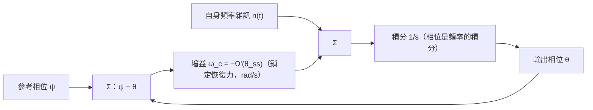

# 注入鎖定的雜訊整形與 injection pulling 頻譜

> **先備**：[paper_003](/05_paper_deep_dives/paper_003_injection_locking_part1)（[P3] 廣義 Adler、lock characteristic）、[white_noise_to_phase_noise](/03_isf_core_theory/white_noise_to_phase_noise)（白噪 → $1/f^2$ 的機器）、[lorentzian_linewidth](/03_isf_core_theory/lorentzian_linewidth)（自由跑振盪器近載波在做什麼）｜**接下來**：[quadrature_and_coupled_oscillators](/06_design_insights/quadrature_and_coupled_oscillators)（互注入＝兩條 Adler）、[pll_noise_budget](/06_design_insights/pll_noise_budget)（二階迴路怎麼記帳）。

[paper_003](/05_paper_deep_dives/paper_003_injection_locking_part1) 講完了「**鎖不鎖得住**」（lock range、穩定性）。
這一頁講 [P3] 那條方程剩下的兩份紅利：

> **這頁要回答什麼**：
> 1. 鎖定之後，振盪器**自己的 phase noise 去哪了**？被壓多少？壓到哪個頻率為止？（Part A）
> 2. 為什麼「還鎖著」不代表「還乾淨」——**鎖定邊緣的抑制消失**是怎麼回事？（Part A）
> 3. 鎖**不**住（$\lvert\Delta\omega\rvert \gt \omega_L$）時，頻譜長什麼樣？為什麼是**間距 $\omega_b$、
>    只長在一邊**的梳狀 sideband？那個 $\omega_b=\sqrt{\Delta\omega^2-\omega_L^2}$ 怎麼來的？（Part B）

> **物理直覺（先講結論）**：注入鎖定的振盪器就是一顆**一階 PLL**——注入提供一股把相位「拉回
> 鎖定點」的恢復力，恢復力的強度（單位 rad/s）就是迴路頻寬。於是：**自身**雜訊在恢復力管得到的
> 頻率以下被壓平（高通整形）、**參考**的雜訊在同一頻率以下被照單全收（低通）；恢復力
> $\omega_c=\omega_L\cos\theta_{ss}$ 在鎖定範圍**正中央最強、邊緣歸零**。鎖不住時，恢復力輸給失諧，
> 相位以「逗留—滑走」的鋸齒方式一圈圈滑掉，每滑一圈吐出一根 sideband——這就是 pulling 的梳狀頻譜。

> **本頁定位**：進階設計頁。相位方程本體（[P3] Eq.(26)/(28)–(30)/(33)–(35)/(38)–(40)）與拍頻
> （[P4] Eq.(31)–(34)）皆已對照原始 PDF 核實；**把雜訊放進 Adler 方程並讀出整形後 PSD** 這一步
> 是教科書級標準結果但**不在本站 5 篇 PDF 的推導內**（[P4] p.2130 明言 noise 分析放在其參考文獻
> [29, Ch. 7]，即 Hong 的博士論文；經典出處為 Kurokawa 1973，見文末外部文獻），本頁自行逐步推導並用模擬對數。

---

## Part A — 鎖定振盪器的雜訊整形（一階 PLL）

### 第 0 步：從 [P3] 廣義 Adler 退化到經典 Adler（符號對映講清楚）

出發點是本站已核實的 **time-averaged 廣義 Adler 方程**（[P3] Eq.(30), p.2113，平均項前為**加號**）：

$$
\frac{d\theta}{dt}=(\omega_0-\omega_{inj})+\underbrace{\frac{1}{T_{inj}}\int_{T_{inj}}\tilde\Gamma(\omega_{inj}t+\theta)\,i_{inj}(t)\,dt}_{\equiv\ \Omega(\theta)\ \text{（lock characteristic，[P3] Eq.(33), p.2114）}}
$$

各量單位：$\theta$ [rad]（振盪器相位相對注入的相位差）、$\omega_0,\omega_{inj}$ [rad/s]、
$\tilde\Gamma=\Gamma/q_{max}$ [rad/C]（有單位 ISF，[P3] Eq.(26), p.2113）、$i_{inj}$ [A]。
被積項 $\tilde\Gamma\cdot i_{inj}$：rad/C × C/s = rad/s ✓，$\Omega(\theta)$ 是「注入造成的平均頻率偏移」。

**代入正弦注入 + ideal-LC ISF**。取 $i_{inj}(t)=I_{inj}\cos(\omega_{inj}t)$、
$\tilde\Gamma(x)=-\sin(x)/q_{max}$（ideal LC 的嚴格 ISF，見 [isf_definition](/03_isf_core_theory/isf_definition)）。
一步一步算那個平均：

$$
\begin{aligned}
\Omega(\theta)&=\frac{1}{T_{inj}}\int_{T_{inj}}\Big[-\frac{\sin(\omega_{inj}t+\theta)}{q_{max}}\Big]\,I_{inj}\cos(\omega_{inj}t)\,dt\\[4pt]
&=-\frac{I_{inj}}{q_{max}}\cdot\frac{1}{T_{inj}}\int_{T_{inj}}\big[\sin(\omega_{inj}t)\cos\theta+\cos(\omega_{inj}t)\sin\theta\big]\cos(\omega_{inj}t)\,dt\\[4pt]
&=-\frac{I_{inj}}{q_{max}}\Big[\cos\theta\cdot\underbrace{\langle\sin\cos\rangle}_{=0}+\sin\theta\cdot\underbrace{\langle\cos^2\rangle}_{=1/2}\Big]
=-\frac{I_{inj}}{2q_{max}}\sin\theta .
\end{aligned}
$$

定義 $\Delta\omega\equiv\omega_0-\omega_{inj}$（失諧）與 $\omega_L\equiv\dfrac{I_{inj}}{2q_{max}}$（半 lock range），得**經典 Adler 形式**：

$$
\boxed{\ \frac{d\theta}{dt}=\Delta\omega-\omega_L\sin\theta\ }
$$

**符號/慣例對映（factor 與正負號記帳）**：

| 本頁 | [P3] | 說明 |
|---|---|---|
| $\Omega(\theta)=-\omega_L\sin\theta$ | Eq.(34)：$\Omega=\tfrac12 I_{inj}\lvert\tilde\Gamma_1\rvert\cos(\theta+\angle\tilde\Gamma_1)$ | $-\sin x=\cos(x+90^\circ)$，故 $\angle\tilde\Gamma_1=+90^\circ$、$\lvert\tilde\Gamma_1\rvert=1/q_{max}$ ✓ |
| $\omega_L=I_{inj}/(2q_{max})$ | Eq.(35)：$\omega_L=\tfrac12 I_{inj}\lvert\tilde\Gamma_1\rvert$ | 完全一致；**負號來自 ideal-LC ISF 自帶的 $-\sin$**，不是慣例翻轉 |
| $\Delta\omega=\omega_0-\omega_{inj}$ | Eq.(38) 用 $\Delta\omega_{[P3]}=\omega_{inj}-\omega_0$ | 差一個整體正負號；[P4] Eq.(34) 亦用 $\omega_{inj}/N-\omega_0$。本頁所有結果只依賴 $\Delta\omega^2$ 或明寫分支，不受影響 |

**單位/量級檢查**：$\omega_L=I_{inj}/(2q_{max})$：A/C = 1/s（rad/s）✓。用本站 canonical 數字
$f_0=5$ GHz、$q_{max}=1$ pC，若要 $f_L=\omega_L/2\pi=5$ MHz，需
$I_{inj}=2q_{max}\omega_L=2\times10^{-12}\times(2\pi\times5\times10^6)=62.8\ \mu$A。
弱注入線性化的適用檢查（[P3] Eq.(36)–(37), p.2115）：$I_{max}=\omega_0 q_{max}=2\pi\times5\times10^9\times10^{-12}=31.4$ mA，
$I_{inj}/I_{max}=0.002\ll1$ ✓——妥妥落在 [P3] 模型的線性區。

### 第 1 步：鎖定點與穩定分支

穩態 $d\theta/dt=0$ 要求 $\sin\theta_{ss}=\Delta\omega/\omega_L$，存在條件 $\lvert\Delta\omega\rvert\le\omega_L$（這就是 lock range）。解有兩個：

$$
\theta_{ss}=\arcsin\!\Big(\frac{\Delta\omega}{\omega_L}\Big)\quad\text{或}\quad\pi-\arcsin\!\Big(\frac{\Delta\omega}{\omega_L}\Big).
$$

哪個穩定？照 [P3] 的穩定性判準（Eq.(38)–(39), p.2115）：把 $\theta=\theta_0+\hat\theta$ 代入、
一階 Taylor 展開，得 $d\hat\theta/dt=\Omega'(\theta_0)\hat\theta$，穩定 ⟺ $\Omega'(\theta_0)\lt0$。
這裡 $\Omega'(\theta)=-\omega_L\cos\theta$，所以**穩定分支是 $\cos\theta_{ss}\gt0$**，即主值
$\theta_{ss}=\arcsin(\Delta\omega/\omega_L)\in(-\pi/2,\pi/2)$；另一解不穩定。

### 第 2 步：把雜訊放進來，線性化

振盪器自己的 device 雜訊電流 $i_n(t)$ 走的是**同一台 ISF 機器**（[P1] Eq.(11)；[P3] Eq.(28) 的
$\tilde\Gamma\cdot i$ 對雜訊電流一樣成立）。對白噪，經一週期的 ISF 加權平均後它等效成一個
**白色頻率雜訊（white FM）驅動** $n(t)$，加在 Adler 方程右邊：

$$
\frac{d\theta}{dt}=\Delta\omega-\omega_L\sin\theta+n(t),
$$

其中 $n(t)$ [rad/s] 的**單邊** PSD 記為 $S_n$，單位 rad²/s（＝(rad/s)²/Hz）。它就是讓**自由跑**
振盪器長出 $1/f^2$ skirt 的那個驅動：拿掉注入（$\omega_L=0$）時 $\phi=\int n\,dt$，轉移函數記帳
（單邊進、單邊出）給出

$$
S_{\phi,free}(\omega)=\frac{S_n}{\omega^2},\qquad
S_n=\frac{\Gamma_{rms}^2}{q_{max}^2}\,\frac{\overline{i_n^2}}{\Delta f}
$$

（與 [white_noise_to_phase_noise](/03_isf_core_theory/white_noise_to_phase_noise) 的時域推導
$S_\phi=\Gamma_{rms}^2 S_i/(q_{max}^2\omega^2)$ 同一條，時域 $/2$ 慣例那一支）。
Canonical 數字（true LC：$\Gamma_{rms}=1/\sqrt2$、$S_i=10^{-24}$ A²/Hz、$q_{max}=1$ pC）：
$S_n=0.5\times10^{-24}/10^{-24}=0.5$ rad²/s——這正是 lab_26 用的值（若用代表值 $\Gamma_{rms}=0.5$ 則 $S_n=0.25$ rad²/s）。
單位檢查：$\dfrac{(-)^2}{\text{C}^2}\cdot\dfrac{\text{A}^2}{\text{Hz}}=\dfrac{\text{A}^2\text{s}}{\text{C}^2}=\dfrac{1}{\text{s}}$（即 rad²/s）✓。

**線性化**。鎖得穩的時候 $\theta$ 只在 $\theta_{ss}$ 附近小幅抖動。令 $\theta=\theta_{ss}+\delta\theta$，
$\sin(\theta_{ss}+\delta\theta)\approx\sin\theta_{ss}+\cos\theta_{ss}\cdot\delta\theta$，
$\Delta\omega-\omega_L\sin\theta_{ss}=0$ 消掉常數項：

$$
\boxed{\ \frac{d(\delta\theta)}{dt}=-\omega_c\,\delta\theta+n(t),\qquad
\omega_c\equiv\omega_L\cos\theta_{ss}=\sqrt{\omega_L^2-\Delta\omega^2}\ }
$$

（第二個等號用 $\cos\theta_{ss}=\sqrt{1-(\Delta\omega/\omega_L)^2}$，穩定分支取正根。）

這個 $\omega_c$ **不是新東西**：它正是 [P3] Eq.(40), p.2115 定義的 **pull-in frequency**
$\omega_p:=-\Omega'(\theta_0)$（把 $\Omega'=-\omega_L\cos\theta$ 代入即得），也是 [P4] Eq.(32), p.2130
的 $\omega_p=N\sqrt{\omega_L^2-\Delta\omega^2}$ 取 $N=1$。**[P3] 用它描述「擾動衰減多快」
（$\hat\theta\propto e^{-t/\tau_p}$，$\tau_p=1/\omega_p$）；我們現在要說的是：同一個頻率，
就是雜訊整形的 corner。** 而且這個對應是一般的：任意注入波形、任意拓樸下，雜訊整形 corner
$=-\Omega'(\theta_{ss})$——lock characteristic 在鎖定點的斜率。

### 第 3 步：整形後的 PSD（一階 Lorentzian）

對線性化方程做 Fourier 轉換（$\delta\theta\to\Theta(\omega)$、$n\to N(\omega)$）：

$$
j\omega\,\Theta=-\omega_c\,\Theta+N
\quad\Longrightarrow\quad
\Theta(\omega)=\frac{N(\omega)}{\omega_c+j\omega}
\quad\Longrightarrow\quad
\boxed{\ S_\theta(\omega)=\frac{S_n}{\omega_c^2+\omega^2}\ }
$$

這就是 Ornstein–Uhlenbeck 過程的 Lorentzian PSD。**dimension check**：
$\dfrac{\text{rad}^2/\text{s}}{1/\text{s}^2}=\text{rad}^2\cdot\text{s}=\text{rad}^2/\text{Hz}$ ✓。

> **factor-of-2 紀律**：$S_\theta=S_n/(\omega_c^2+\omega^2)$ 是「同邊進、同邊出」的轉移函數記帳——
> $S_n$ 用單邊，$S_\theta$ 就是單邊（本頁與模擬全程單邊）；換成雙邊則兩邊同乘 $1/2$，公式形狀不變。
> 而**抑制比** $S_\theta/S_{\phi,free}=\omega^2/(\omega_c^2+\omega^2)$ 把 $S_n$ 整個約掉，
> **與任何單/雙邊、$/2$/$/4$ 慣例無關**——模擬就用這個比值量 corner，最乾淨。

三個極限，三句話：

- **$\omega\gg\omega_c$**：$S_\theta\to S_n/\omega^2=S_{\phi,free}$——**遠端跟自由跑一模一樣**。
  注入的恢復力（頻寬 $\omega_c$）追不上快的抖動，管不到。
- **$\omega\ll\omega_c$**：$S_\theta\to S_n/\omega_c^2$＝**有限平台**。自由跑的 $1/f^2$ 在
  $\omega\to0$ 的發散被鎖定「治好了」：相位不再 random walk，而是被錨在 $\theta_{ss}$ 的
  有限抖動。（對照 [lorentzian_linewidth](/03_isf_core_theory/lorentzian_linewidth)：自由跑靠
  「線寬」把發散變成有限 Lorentzian 峰，但方差仍隨時間長大；鎖定是真的把方差鎖成常數——
  這是兩種不同的「治法」。）
- **交界 $\omega=\omega_c$**：抑制比恰為 $1/2$（$-3$ dB）——**corner 的操作型定義**，模擬據此量測。

整段時間的相位方差（單邊積分）：

$$
\sigma_\theta^2=\int_0^\infty \frac{S_n}{\omega_c^2+(2\pi f)^2}\,df
=\frac{S_n}{2\pi}\cdot\frac{\pi}{2\omega_c}=\frac{S_n}{4\omega_c}.
$$

數值（lab_26 case A：$S_n=0.5$ rad²/s、$\omega_c=2\pi\times5\times10^6$ rad/s）：
$\sigma_\theta^2=0.5/(4\times3.14\times10^7)=3.98\times10^{-9}$ rad² → $\sigma_\theta=63.1\ \mu$rad；
換成時間 jitter（$f_0=5$ GHz）$\sigma_t=\sigma_\theta/(2\pi f_0)=2.0$ fs。
dimension check：rad²/s ÷ rad/s = rad² ✓；rad ÷ (rad/s) = s ✓。
**這就是拿乾淨參考鎖住一顆振盪器的威力：無界的累積 jitter 變成 2 fs 的有限抖動。**

### 第 4 步：參考的雜訊呢？（一階 PLL 的另一半）

若注入本身相位會動：$i_{inj}=I_{inj}\cos(\omega_{inj}t+\psi(t))$（$\psi$ 慢變），
重跑第 0 步的平均（積化和差，快項被平均掉）得 $\Omega=-\omega_L\sin(\theta-\psi)$，線性化：

$$
\frac{d(\delta\theta)}{dt}=-\omega_c(\delta\theta-\psi)+n
\quad\Longrightarrow\quad
\Theta(\omega)=\underbrace{\frac{\omega_c}{\omega_c+j\omega}}_{\text{低通}}\Psi(\omega)+\underbrace{\frac{1}{\omega_c+j\omega}}_{\text{自身 FM}\to\text{整形}}N(\omega)
$$

$$
S_{\theta,out}=\frac{\omega_c^2}{\omega_c^2+\omega^2}\,S_\psi+\frac{1}{\omega_c^2+\omega^2}\,S_n .
$$

- **參考相位雜訊被低通**（corner 同樣是 $\omega_c$）：低於 $\omega_c$ 全收（照單全抄參考），
  高於 $\omega_c$ 被拒收。
- **自身雜訊被高通**：相對自由跑 $N/(j\omega)$，比值是 $j\omega/(\omega_c+j\omega)$，
  $\lvert\cdot\rvert^2=\omega^2/(\omega_c^2+\omega^2)$。

這**正是一階（type-I）PLL 的 transfer 對**——和本站
[lab_13](/04_simulation_labs/lab_13_pll_cdr_transfer) 的二階 $\lvert H_{lp}\rvert^2/\lvert H_{hp}\rvert^2$
同一邏輯，只是迴路退化成一階、頻寬就是 $\omega_c$。方塊圖：



> **誠實標註**：$\omega_c$ 作為 pull-in frequency 是 [P3] Eq.(40) 的原生結果；把 $n(t)$、$\psi(t)$
> 掛上去讀出高通/低通 PSD 是標準的注入鎖定雜訊理論（**外部文獻，非本站 5 篇 PDF**：Kurokawa 1973；
> Razavi 2004 亦有易讀推導；[P4] p.2130 則把 noise 分析指向其參考文獻 [29, Ch. 7]）。

### 鎖定邊緣的退化（真正的設計洞見）

$\omega_c=\sqrt{\omega_L^2-\Delta\omega^2}$ 對 $\Delta\omega$ 的依賴是**圓弧**：中心最高、邊緣垂直墜地。

- $\Delta\omega=0$：$\omega_c=\omega_L$（corner ＝ 整個半 lock range，抑制頻寬最大）。
  這也解釋了 [P3] Eq.(35) 的另一層意義：**$\omega_L$ 不只是「鎖得住的範圍」，更是「雜訊抑制頻寬的上限」**（$\omega_c\le\omega_L$，等號在正中央）。
- $\Delta\omega=0.95\,\omega_L$：$\cos\theta_{ss}=\sqrt{1-0.95^2}=0.312$，$\omega_c$ 剩 31%，
  低頻平台抬高 $1/\cos^2\theta_{ss}=10.3$ 倍（$+10.1$ dB）——**還鎖著，但已經髒了**。
- $\Delta\omega\to\pm\omega_L$：$\cos\theta_{ss}\to0$，$\omega_c\to0$，**抑制完全消失**；
  且線性化本身失效（恢復力的位能井變淺，雜訊開始踢出 cycle slip，往 Part B 的 pulling 頻譜過渡）。

一句白話：**lock range 的邊緣不是牆，是斜坡**——你在失鎖之前很早就開始付 phase-noise 的代價。
PVT 讓 $\omega_0$ 漂移時，$\Delta\omega$ 會悄悄往邊緣走，phase noise 平台以 $1/\cos^2\theta_{ss}$
抬升，這常常比「失鎖」本身更早咬人。設計上要盯的是 $\Delta\omega/\omega_L$ 的**餘裕**，
例如 $\lvert\Delta\omega\rvert\le0.5\,\omega_L$ 保住 $\omega_c\ge0.87\,\omega_L$（平台代價只 $+1.2$ dB）。

### lab_26：SDE 模擬 vs 一階理論

模型：Euler–Maruyama 積分 $d\theta/dt=\Delta\omega-\omega_L\sin\theta+n(t)$（乾淨注入、
自身白噪 FM），同一條雜訊序列同時餵給自由跑（$\omega_L=0$）作對照，Welch 估單邊 PSD。

| 參數 | 值 | 單位 | 說明 |
|---|---|---|---|
| $f_L=\omega_L/2\pi$ | 5.0 | MHz | 半 lock range（$I_{inj}=62.8\ \mu$A @ $q_{max}=1$ pC） |
| $S_n$ | 0.5 | rad²/s | 單邊白噪 FM 驅動（true-LC $\Gamma_{rms}=1/\sqrt2$、$S_i=10^{-24}$ A²/Hz） |
| $\Delta\omega$ | 0 與 $0.95\,\omega_L$ | rad/s | case A（中心）／case B（鎖定邊緣） |
| $f_s$ | 400 | MHz | 相位 SDE 的取樣率（只積慢動態，不積 5 GHz 載波） |
| 長度 | $2^{22}$ 點 ≈ 10.5 ms | — | Welch $2^{15}$ 點/段，256 段平均 |

核心 code（完整 script：`simulations/lab_26_injlock_noise.py`）：

```python
n  = white_noise(2**22, S_n, fs)                  # 白噪 FM 驅動 [rad/s]，單邊 PSD = S_n
th = 0.0
for k in range(n.size):                           # Euler–Maruyama
    th += (dw - wL*np.sin(th) + n[k])*dt          # [P3] Eq.(30) 正弦退化 + 雜訊
    theta[k] = th
f, S_lock = estimate_psd(theta[trans:], fs)       # 單邊 PSD [rad^2/Hz]
ratio = S_lock / S_free                           # 抑制比（慣例無關）
```

跑出來的核對數字（`PYTHONPATH=. python3 simulations/lab_26_injlock_noise.py`）：

```python
print(mean_ratio_free)                # -> 1.004 自由跑 PSD / (S_n/ω²)，0.5–5 MHz 平均
print(theta_mean_B)                   # -> 1.2532 rad，＝asin(0.95) 的理論鎖定相位
print(plateau_A_ratio)               # -> 0.969 量測平台 / (S_n/ω_c²)，case A
print(plateau_B_ratio)               # -> 0.995 量測平台 / (S_n/ω_c²)，case B
print(edge_penalty)                  # -> 10.53 平台 B/平台 A（理論 1/cos²θ_ss = 10.26，+10.1 dB）
print(fc_meas_A, ratio_A)            # -> 4.816 MHz, 0.963 corner A（理論 5.000 MHz）
print(fc_meas_B, ratio_B)            # -> 1.543 MHz, 0.988 corner B（理論 1.561 MHz）
print(suppression_100kHz)            # -> -34.0 dB（理論 −34.2 dB）
```

corner 量測值比理論低約 3–4%，來自 Euler 離散化（$\omega_c\,dt\approx0.08$）與 Welch bin
平均，屬預期的數值偏差；平台、抑制量、鎖定相位全部對上。


**怎麼讀這張圖**：(a) 灰線是自由跑的 $1/f^2$；藍/橘是鎖定後的 $S_\theta$——高頻端三條線疊在
一起（注入管不到），低頻端被壓平成 $S_n/\omega_c^2$ 的平台；虛線是一階理論，整條吻合。
(b) 把兩條鎖定 PSD 除以自由跑，得到乾淨的一階高通 $\omega^2/(\omega_c^2+\omega^2)$；
$-3$ dB 交叉點就是 corner——case B（$\Delta\omega=0.95\,\omega_L$）的 corner 從 5 MHz
縮到 1.56 MHz、平台抬高 10 dB：**鎖定邊緣的退化肉眼可見**。

---

## Part B — 鎖不住的時候：injection pulling 的頻譜

### 第 1 步：沒有穩態，只有「逗留—滑走」

當 $\lvert\Delta\omega\rvert\gt\omega_L$（取 $\Delta\omega\gt\omega_L\gt0$ 討論），

$$
\frac{d\theta}{dt}=\Delta\omega-\omega_L\sin\theta\ \ge\ \Delta\omega-\omega_L\ \gt\ 0
$$

處處為正：$\theta$ **單調上升、永不停**——鎖定失敗，但上升得**很不均勻**：

- 在 $\theta=\pi/2$（$\sin\theta=1$）附近最慢：$d\theta/dt=\Delta\omega-\omega_L$。
  振盪器「幾乎要鎖上」，在最接近鎖定的相位**逗留**（quasi-lock）——[P3] Sec. V-G, p.2115–2116
  的描述：*spends a considerable amount of time "trying" to lock*。
- 在 $\theta=-\pi/2$ 附近最快：$d\theta/dt=\Delta\omega+\omega_L$——**快速滑走**（slip），
  一口氣補完一整圈。

所以 $\theta(t)$ 是「平台＋陡坡」的**鋸齒狀階梯**（見下方模擬圖 (a)），每一「拍」淨滑 $2\pi$。

### 第 2 步：拍頻 $\omega_b$——逐步推導

一拍的週期就是 $\theta$ 走完 $2\pi$ 所需時間。分離變數：

$$
T_b=\int_0^{T_b}dt=\int_{-\pi}^{\pi}\frac{d\theta}{\Delta\omega-\omega_L\sin\theta}.
$$

用 Weierstrass 半角代換 $u=\tan(\theta/2)$（$\theta:-\pi\to\pi$ 對應 $u:-\infty\to\infty$），
$\sin\theta=\dfrac{2u}{1+u^2}$、$d\theta=\dfrac{2\,du}{1+u^2}$：

$$
\begin{aligned}
T_b&=\int_{-\infty}^{\infty}\frac{1}{\Delta\omega-\omega_L\frac{2u}{1+u^2}}\cdot\frac{2\,du}{1+u^2}
=\int_{-\infty}^{\infty}\frac{2\,du}{\Delta\omega(1+u^2)-2\omega_L u}\\[4pt]
&=\int_{-\infty}^{\infty}\frac{2\,du}{\Delta\omega\,u^2-2\omega_L u+\Delta\omega}
\qquad\text{（分母配方）}\\[4pt]
&=\int_{-\infty}^{\infty}\frac{2\,du}{\Delta\omega\Big(u-\frac{\omega_L}{\Delta\omega}\Big)^2+\frac{\Delta\omega^2-\omega_L^2}{\Delta\omega}}
=\frac{2}{\sqrt{\Delta\omega^2-\omega_L^2}}\Big[\arctan\Big(\frac{\Delta\omega\,u-\omega_L}{\sqrt{\Delta\omega^2-\omega_L^2}}\Big)\Big]_{-\infty}^{\infty}\\[4pt]
&=\frac{2}{\sqrt{\Delta\omega^2-\omega_L^2}}\cdot\pi .
\end{aligned}
$$

（倒數第二步用 $\int\frac{du}{a(u-u_0)^2+c}=\frac{1}{\sqrt{ac}}\arctan\big(\sqrt{a/c}\,(u-u_0)\big)$，
$a=\Delta\omega\gt0$、$c=(\Delta\omega^2-\omega_L^2)/\Delta\omega\gt0$，$\arctan$ 全跨 $=\pi$。）

$$
\boxed{\ \omega_b\equiv\frac{2\pi}{T_b}=\sqrt{\Delta\omega^2-\omega_L^2}\ }
\qquad\text{（[P4] Eq.(34), p.2130，取 }N=1\text{）}
$$

同一套代換也給出未鎖定的閉式解（等價於 [P4] Eq.(33), p.2130 的 ideal-LC 特例）：

$$
\tan\frac{\theta(t)}{2}=\frac{\omega_L}{\Delta\omega}+\frac{\omega_b}{\Delta\omega}\tan\frac{\omega_b (t-t_0)}{2}.
$$

**單位**：rad/s ✓（$\Delta\omega,\omega_L$ 同單位取平方差開根號）。**兩個極限**：

- $\Delta\omega\gg\omega_L$：$\omega_b\to\Delta\omega$——sideband 間距趨近失諧本身，
  注入退化成一根小 spur，振盪器幾乎自由跑 ✓（自洽檢查）。
- $\Delta\omega\to\omega_L^+$：$\omega_b\to0$——**臨界慢化**：逗留段無限拉長、拍頻歸零、
  梳齒全部縮向注入頻率——這就是「鎖上」的瞬間。注意它和 Part A 的
  $\omega_c=\sqrt{\omega_L^2-\Delta\omega^2}$ 是同一個根號的兩側：**鎖內叫 pull-in
  frequency，鎖外叫 beat frequency**（[P4] Eq.(32) vs Eq.(34)——一對畢氏關係）。

**數值（lab_27 用 3–4–5 直角三角形，心算可驗）**：$\Delta f=100$ kHz、$f_L=60$ kHz →
$f_b=\sqrt{100^2-60^2}=80$ kHz。

### 第 3 步：頻譜結構——梳距 $\omega_b$、一端貼著注入

$\theta$ 每 $T_b$ 淨走 $2\pi$，故 $\theta(t)=\omega_b t+p(t)$，$p$ 是週期 $T_b$ 的週期函數。輸出電壓

$$
V(t)=\cos\big(\omega_{inj}t+\theta(t)\big)
$$

的解析訊號含 $e^{j\theta}=e^{j\omega_b t}e^{jp(t)}$，而 $e^{jp(t)}$ 的 Fourier 級數只有
$k\omega_b$ 的成分——所以**頻譜是間距 $\omega_b$ 的梳**，線位於

$$
\omega=\omega_{inj}+k\,\omega_b,\qquad k\in\mathbb{Z},
$$

其中 $k=0$ 那根**恰好落在注入頻率上**（[P4] Sec. V-B, p.2130：*the tone at one edge of the
spectrum always occurs right at the injection frequency*）。振盪器的**平均**頻率是
$\omega_{inj}+\omega_b$（$k=1$ 主線附近），它落在 $\omega_{inj}$ 與 $\omega_0$ **之間**：
被「拉」離自由跑 $\Delta\omega-\omega_b$（lab_27 數值：$100-80=20$ kHz）——**pulling
這個名字就是這麼來的**。細節提醒（[P3] 註 18, p.2116）：除非 $\omega_{inj}$ 恰為 $\omega_b$
的整數倍，$V(t)$ 本身**不是**週期訊號——pulling 從根本上破壞了振盪器的週期性。

### 第 4 步：為什麼「單邊」不對稱？

**物理論證**。瞬時頻率是

$$
\omega_{osc}(t)=\omega_{inj}+\frac{d\theta}{dt}\in[\,\omega_{inj}+\Delta\omega-\omega_L,\ \omega_{inj}+\Delta\omega+\omega_L\,],
$$

整個範圍都在注入的**同一側**（$\Delta\omega\gt\omega_L$ 保證下限為正）。而且時間權重極度偏斜：
$\theta$ 在逗留段（$\omega_{osc}\approx\omega_{inj}+\Delta\omega-\omega_L$，離注入最近處）
待最久，滑走段一閃而過——所以頻譜能量堆在「注入頻率往 $\omega_0$ 那一側」，緊貼注入、
往外遞減；注入的**另一側幾乎空白**。這跟對稱的 FM（正弦調相 → 對稱 Bessel sideband）
形成鮮明對比：**pulling 的調相波形是鋸齒，不是正弦**。

**嚴格論證（進階，一段講完）**。令 $z=e^{j\theta}$，Adler 方程變成 Riccati 方程
$\dot z=j\Delta\omega\,z-\tfrac{\omega_L}{2}(z^2-1)$；Riccati 的解是係數的 Möbius（分式線性）
變換，把週期解寫成 $z=\dfrac{c+d\,w}{1+b\,w}$（$w=e^{j\omega_b t}$、$\lvert b\rvert\lt1$），
幾何級數展開 $\dfrac{1}{1+bw}=\sum_k(-b)^k w^k$ 後**只有 $k\ge0$ 的冪次**——所以在這個
理想 Adler 模型裡梳**嚴格單邊**，且振幅**幾何遞減**，比值

$$
r=\frac{\omega_L}{\Delta\omega+\omega_b}
$$

（每根線功率降 $r^2$）。此閉式頻譜為標準結果（**外部文獻，非本站 5 篇 PDF**：Armand 1969，
見文末），本頁以下用模擬數值驗證。lab_27 的 3–4–5 參數：$r=60/(100+80)=1/3$，
每根線 $20\log_{10}3=9.54$ dB。

### lab_27：積分未鎖定 Adler ODE → FFT

模型：RK4 積分 $d\theta/dt=\Delta\omega-\omega_L\sin\theta$（決定論；關掉雜訊以分離
pulling 梳本身），建 $V(t)=\cos(\omega_{inj}t+\theta(t))$，Hann 窗 FFT。

| 參數 | 值 | 單位 | 說明 |
|---|---|---|---|
| $f_{inj}$ | 1.000 | MHz | 注入頻率（toy 尺度，Adler 方程本身已是平均後的慢動態） |
| $f_0$ | 1.100 | MHz | 自由跑頻率（$\Delta f=+100$ kHz） |
| $f_L$ | 60 | kHz | 半 lock range（$\Delta f\gt f_L$ → 鎖不住） |
| $f_b$（理論） | 80.000 | kHz | $\sqrt{100^2-60^2}$（3–4–5） |
| $f_s$、長度 | 16 MHz、$2^{21}$ 點 | — | 131 ms ≈ 10486 拍，FFT 解析度 7.6 Hz |

核心 code（完整 script：`simulations/lab_27_pulling_spectrum.py`）：

```python
def rhs(th):                                   # 未鎖定 Adler（[P3] Eq.(30) 正弦退化）
    return DW - OMEGA_L*np.sin(th)             # [rad/s]
# ... RK4 積分得 theta[k] ...
V    = np.cos(OMEGA_INJ*t + theta)             # 被拉扯的輸出電壓
spec = np.abs(np.fft.rfft(V*np.hanning(V.size)))**2
```

跑出來的核對數字（`PYTHONPATH=. python3 simulations/lab_27_pulling_spectrum.py`）：

```python
print(f_b_from_slope)                 # -> 79.999 kHz 由 ⟨dθ/dt⟩，理論 80.000 → ratio 1.0000
print(f_b_from_fft)                   # -> 80.000 kHz 由頻譜梳距 → ratio 1.0000
print(step_k1_k2, step_k2_k3)         # -> -9.54 dB, -9.54 dB 相鄰梳線功率步階（理論 20log10(3)=−9.54）
print(mirror_side)                    # -> -194.1 dB f_inj−f_b vs f_inj+f_b：鏡像側＝數值零（嚴格單邊）
print(edge_tone)                      # -> -8.52 dB 注入頻率上那根邊緣線相對 k=+1 主線
print(pulled_by)                      # -> 20.0 kHz 平均頻率 1.080 MHz，被拉離 f_0=1.100 MHz
```

頻譜主線（相對最強線）：1.080 MHz（0 dB，$k{=}1$）、1.000 MHz（$-8.2$ dB，$k{=}0$＝注入）、
1.160（$-10.5$）、1.240（$-19.2$）、1.320（$-28.3$）、1.400 MHz（$-38.1$ dB）——
$k\ge2$ 起每根正好降 9.54 dB，幾何比 $r^2=(1/3)^2$ 分毫不差。


**怎麼讀這張圖**：(a) $\theta/2\pi$ 每拍爬一格，平緩段就是 quasi-lock 逗留；(b) 瞬時頻率大部分
時間貼著 1.04 MHz（$f_{inj}+\Delta f-f_L$，離注入最近的「逗留頻率」），短暫掃到 1.16 MHz；
(c) 頻譜：紅虛線＝注入 1.000 MHz（梳的**邊緣**）、灰虛線＝自由跑 1.100 MHz（**已經沒有線在
那裡**——被拉走了）、綠 ▽＝理論位置 $f_{inj}+k\,f_b$；注入左側乾乾淨淨——**單邊梳**是
pulling 最好認的指紋。

---

## Design knobs（把兩部分收成可操作的清單）

1. **把 $\Delta\omega$ 壓到 lock range 正中央**：雜訊抑制頻寬 $\omega_c=\sqrt{\omega_L^2-\Delta\omega^2}$
   在 $\Delta\omega=0$ 才拿滿。校準／tuning 迴路的目標不只是「鎖住」，是「鎖在中間」。
2. **加大 $\omega_L$ 的兩條路**（[P3] Eq.(35)：$\omega_L=\tfrac12 I_{inj}\lvert\tilde\Gamma_1\rvert$）：
   加注入電流（付功耗與 spur），或**波形設計**讓注入諧波對齊 ISF 諧波（[P3] Sec. VI 的
   injection waveform design，等於免費放大 $\omega_L$ 與 $\omega_c$）。上限提醒：$I_{inj}\ll I_{max}=\omega_0 q_{max}$（[P3] Eq.(36)–(37)）。
3. **留邊緣餘裕**：平台代價 $=1/\cos^2\theta_{ss}$。$\lvert\Delta\omega\rvert/\omega_L=0.5$ 只付
   $+1.2$ dB；$0.95$ 付 $+10.1$ dB。PVT 漂移的 budget 要算在 $\Delta\omega/\omega_L$ 上。
4. **認得 pulling 的指紋**：載波旁出現**單邊**、等間距 $\omega_b$、一端恰在某個固定頻率的梳 →
   那個固定頻率就是侵擾源（aggressor）的頻率。對策依序：加隔離（layout、guard ring、
   supply/substrate 濾波）、挪頻率規劃（把 $\Delta\omega$ 拉大，梳距 $\omega_b\to\Delta\omega$ 變遠、
   幅度 $r\to0$ 變小）、或反過來**乾脆把它鎖上**（把 $\omega_L$ 做大超過 $\lvert\Delta\omega\rvert$，
   spur 梳收斂成乾淨的鎖定載波）。**最危險的是不遠不近**：$\Delta\omega$ 略大於 $\omega_L$ 時
   $\omega_b$ 很小，spur 貼著載波（in-band，濾不掉）且 $r\to1$（衰減慢、梳又密又高）。
5. **與 SerDes 的關聯**：injection-locked 時脈分配（forwarded-clock／multi-lane 的 ILO deskew）
   就是在用 $\omega_c$ 當 **jitter tracking bandwidth**——低於 $\omega_c$ 的參考 jitter 被複製
   （對 common jitter 的 lane 是好事：收發同源、相關抵消），高於 $\omega_c$ 靠本地振盪器自己乾淨
   （$q_{max}$、$\Gamma_{rms}$ 的老功課，[design_tradeoffs](/04_simulation_labs/lab_09_design_tradeoffs)）。
   取捨結構與 CDR 完全同構：見 [serdes_clocking_connection](/06_design_insights/serdes_clocking_connection)、
   [lab_13](/04_simulation_labs/lab_13_pll_cdr_transfer)。

## 適用與失效條件

| 條件 | 成立時 | 失效時會怎樣 |
|---|---|---|
| 弱注入 $I_{inj}\ll I_{max}=\omega_0q_{max}$（[P3] Eq.(36)–(37), p.2115） | 廣義 Adler／lock characteristic 線性於 $i_{inj}$ | 強注入：$\Omega(\theta)$ 預測偏差變大（[P3] Sec. V-H 模擬顯示 $I_{inj}\sim I_{max}$ 仍大致可用） |
| $\theta$ 慢變（一週期內近似常數） | time-synchronous 平均（Eq.(30)）成立 | 失諧太大或 $\omega_b$ 接近 $\omega_{inj}$：平均失效 |
| 正弦注入 + ideal-LC ISF | 本頁的 $-\omega_L\sin\theta$ 閉式 | 任意波形/拓樸：回到 $\Omega(\theta)$ 通式；**corner 一般化為 $\omega_c=-\Omega'(\theta_{ss})$（[P3] Eq.(40)），單邊梳的幾何比不再是簡單閉式** |
| 雜訊小、$\lvert\Delta\omega\rvert$ 離邊緣夠遠 | 線性化（OU）成立，$S_\theta=S_n/(\omega_c^2+\omega^2)$ | 邊緣：位能井變淺 → cycle slip → 頻譜長出 pulling 狀的殘餘 spur，OU 公式失效 |
| 忽略振幅動態 | 純相位模型（本頁全部） | 強注入 LC：要 [P4] 的 APF/AM 修正（[paper_004](/05_paper_deep_dives/paper_004_injection_locking_part2)；[P4] Fig. 14(c) 顯示加了 APF 後 pulled 頻譜準確度大增） |
| 雜訊整形推導本身 | 標準注入鎖定雜訊理論 | **不在 5 篇 PDF 內**（Kurokawa 1973；[P4] 指向 [29, Ch. 7]）；本頁已自行推導並模擬對數 |

## 重點回顧

- **注入鎖定＝一階 PLL**：線性化 [P3] 廣義 Adler 得 $d(\delta\theta)/dt=-\omega_c\delta\theta+n$，
  迴路頻寬 $\omega_c=\omega_L\cos\theta_{ss}=\sqrt{\omega_L^2-\Delta\omega^2}$——**就是 [P3]
  Eq.(40) 的 pull-in frequency**（一般拓樸：$\omega_c=-\Omega'(\theta_{ss})$）。
- **自身雜訊高通、參考雜訊低通**，corner 同為 $\omega_c\le\omega_L$；白噪 FM 驅動下
  $S_\theta=S_n/(\omega_c^2+\omega^2)$，低頻平台 $S_n/\omega_c^2$、總方差 $S_n/(4\omega_c)$ 有限
  （模擬：corner 與平台皆對到理論的 0.96–1.00 倍）。
- **鎖定邊緣抑制消失**：$\Delta\omega\to\omega_L$ 時 $\cos\theta_{ss}\to0$，平台以
  $1/\cos^2\theta_{ss}$ 抬升（$0.95\,\omega_L$ 時 $+10.1$ dB）——鎖著不等於乾淨，餘裕要算。
- **鎖不住時**：$\theta$ 鋸齒滑動（逗留＋滑走），拍頻 $\omega_b=\sqrt{\Delta\omega^2-\omega_L^2}$
  （逐步積分導出；[P4] Eq.(34)）；頻譜是**單邊**梳：線在 $\omega_{inj}+k\omega_b$、一端恰為注入
  頻率（[P4] Sec. V-B）、振幅幾何遞減 $r=\omega_L/(\Delta\omega+\omega_b)$（外部 Armand 1969；
  模擬 $-9.54$ dB/線分毫不差）。
- **同一個根號的兩面**：鎖內 $\sqrt{\omega_L^2-\Delta\omega^2}$＝雜訊抑制 corner；
  鎖外 $\sqrt{\Delta\omega^2-\omega_L^2}$＝spur 梳距。設計上一個要大（抑制寬）、
  一個要嘛大要嘛零（spur 遠 or 鎖掉）。

## 延伸閱讀

- 廣義 Adler 與 lock characteristic 的來源與核實：[paper_003](/05_paper_deep_dives/paper_003_injection_locking_part1)（[P3] Eq.(26)/(30)/(33)/(35)/(38)–(40)）
- 拍頻閉式解與 pulled 頻譜的原始出處（含 APF 修正）：[paper_004](/05_paper_deep_dives/paper_004_injection_locking_part2)（[P4] Eq.(31)–(34), p.2130；Fig. 14）
- 互注入＝兩條 Adler（QVCO 的 $90^\circ$ 與 3 dB 記帳）：[quadrature_and_coupled_oscillators](/06_design_insights/quadrature_and_coupled_oscillators)
- 二階迴路版的同一件事（ref 低通/VCO 高通、最佳頻寬）：[pll_noise_budget](/06_design_insights/pll_noise_budget)、[lab_13](/04_simulation_labs/lab_13_pll_cdr_transfer)
- 自由跑振盪器近載波的「另一種治法」（Lorentzian 線寬）：[lorentzian_linewidth](/03_isf_core_theory/lorentzian_linewidth)
- 白噪 FM 驅動 $S_n=\Gamma_{rms}^2S_i/q_{max}^2$ 的出處：[white_noise_to_phase_noise](/03_isf_core_theory/white_noise_to_phase_noise)

### 外部文獻（不在下載的 5 篇 PDF 內）

- **[E-Adler]** R. Adler, *"A Study of Locking Phenomena in Oscillators,"* Proc. IRE, vol. 34,
  no. 6, pp. 351–357, Jun. 1946.（經典 Adler 方程與拍現象的原始論文。）
- **[E-Kurokawa]** K. Kurokawa, *"Injection Locking of Microwave Solid-State Oscillators,"*
  Proc. IEEE, vol. 61, no. 10, pp. 1386–1410, Oct. 1973.（注入鎖定振盪器的雜訊整形
  ——本頁 Part A 高通/低通結果的經典出處。）
- **[E-Armand]** M. Armand, *"On the Output Spectrum of Unlocked Driven Oscillators,"*
  Proc. IEEE, vol. 57, no. 5, pp. 798–799, May 1969.（未鎖定被驅動振盪器的單邊幾何梳
  閉式頻譜——本頁 Part B 的 $r=\omega_L/(\Delta\omega+\omega_b)$。）
- **[E-Razavi04]** B. Razavi, *"A Study of Injection Locking and Pulling in Oscillators,"*
  IEEE J. Solid-State Circuits, vol. 39, no. 9, pp. 1415–1424, Sep. 2004.（易讀的現代推導
  與 pulled 頻譜圖像；與 [P3]/[P4] 的 ISF 一般化互補。）
- 另：[P4] p.2130 將鎖定/自由跑振盪器的 noise 分析指向其參考文獻 **[29, Ch. 7]**（B. Hong 博士論文）。
