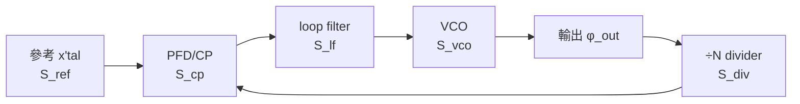

# PLL 完整相位雜訊預算與最佳 loop BW

> **先備**：[white_noise_to_phase_noise](/03_isf_core_theory/white_noise_to_phase_noise)（VCO 那一項 $S_{vco}\propto\Gamma_{rms}^2/q_{max}^2\cdot S_i/f^2$ 從哪來）、[serdes_clocking_connection](/06_design_insights/serdes_clocking_connection)（CDR/PLL 對 VCO 的 high-pass、jitter 積分頻寬）、[lc_vs_ring](/06_design_insights/lc_vs_ring)（為何 ring 的 $S_{vco}$ 高、LC 低）｜ **接下來**：[exercises](/06_design_insights/exercises)、[lab_13_pll_cdr_transfer](/04_simulation_labs/lab_13_pll_cdr_transfer)

這頁回答一個系統設計工程師每天都要面對的問題：**一顆鎖相環（PLL，phase-locked
loop，把振盪器相位鎖到參考時鐘的負回授環）的輸出相位雜訊，到底是由哪些源、各自貢獻
多少、在哪個 offset 頻段誰當家？而 loop bandwidth（環路頻寬，回授追得上的最高 offset）
應該選多寬，才能讓總抖動最小？** 我們要把五個雜訊源逐一寫出它們到輸出的轉移函數，加總成

$$
S_{out}=(S_{ref}N^2+S_{cp})\,\lvert H_{lp}\rvert^2+S_{vco}\,\lvert H_{hp}\rvert^2
$$

（規範第 11.2 節「PLL 輸出雜訊預算」），再對 $\int S_{out}\,df$（積分相位變異，正比於 rms
jitter 平方）求極小，得到那條**著名的 U 形曲線**與其最低點。

> **物理直覺（先講結論）**：PLL 是一個低通追蹤器。在 loop bandwidth $f_n$ 以內，回授來得及
> 反應，輸出**跟著參考**走——於是 reference 與環路前端（PFD、charge-pump、divider）的雜訊
> 被**放大且低通**地搬到輸出（而且 reference 還被 $\times N$ 倍頻，功率 $\times N^2$）；同時 VCO
> 自己的 close-in 漂移被回授**糾正掉**（VCO 高通）。在 $f_n$ 以外，回授來不及，輸出**跟著 VCO**
> 自由跑——VCO 的 $1/f^2$ 雜訊原樣漏出。所以 **in-band 跟 ref/CP、out-of-band 跟 VCO**，
> 交越就在 $f_n$。把 $f_n$ 開太窄→VCO 漏出太多（U 形左臂上揚）；開太寬→ref/CP 被搬出來太多
> （右臂上揚）。中間必有一個最佳 $f_n$。

本頁的 PLL 閉環轉移函數（loop transfer / 開環增益 / type-II 穩定性那些高階細節）屬於
**標準 PLL 文獻**（Gardner、Razavi、Best），**不在本站下載的 5 篇 PDF 之內**；我們只引用其
type-II 二階閉環結果（規範第 10.2 節已收錄），重心放在「ISF 決定 VCO 那一項 $S_{vco}$」
以及「預算如何加總、最佳 BW 如何取」。VCO 那一項的微觀來源（$\Gamma_{rms}^2/q_{max}^2$）正是
本站前面整套 ISF 理論的成果。

## 為什麼要做「雜訊預算」

phase noise 不是單一數字，它是一條隨 offset 變化的曲線；而曲線上每一段由不同的源主宰。
**做預算（budget）= 把每個源畫成一條，看誰在哪段冒頭、總和長什麼樣。** 這件事的價值：

- **找瓶頸**：close-in 太高？多半是 reference 或 charge-pump（被 $N^2$ 放大）。far-out 太高？
  是 VCO。對症下藥，不要盲目換零件。
- **選 loop BW**：交越點、總 jitter 都跟 $f_n$ 強相關，預算讓你**量化**這個取捨。
- **連到系統指標**：把 $S_{out}$ 積分得 rms jitter $\sigma_t$，直接餵進 SerDes 的 eye/BER（見
  [serdes_clocking_connection](/06_design_insights/serdes_clocking_connection)）。

## PLL 方塊圖與五個雜訊源

一顆整數-N PLL 的骨架：參考時鐘 → 鑑相器（PFD，phase-frequency detector）+ 電荷泵
（charge-pump，把相位差變成電流脈衝）→ loop filter（迴路濾波器，把電流積成控制電壓）→
VCO（壓控振盪器）→ 除頻器（÷N，把輸出拉回參考頻率比相）。五個雜訊注入點如圖：



每個源到輸出走的路徑不同，所以**整形（shaping）不同**：

| 源 | 符號 | 物理來源 | 到輸出的轉移 | 在輸出的整形 |
|---|---|---|---|---|
| reference | $S_{ref}$ | 晶體/參考的相位雜訊 | $\times N$ 再低通 | $N^2\lvert H_{lp}\rvert^2$（in-band，被 $N^2$ 放大） |
| PFD/charge-pump | $S_{cp}$ | CP 電流雜訊、PFD dead-zone、mismatch | 低通 | $\lvert H_{lp}\rvert^2$（in-band，平坦底） |
| divider | $S_{div}$ | ÷N 邏輯的 jitter | 低通（與 ref 同路徑） | $\lvert H_{lp}\rvert^2$（in-band；常併入 $S_{cp}$） |
| loop filter | $S_{lf}$ | 濾波電阻熱雜訊調 VCO | 帶通（峰在 $f_n$ 附近） | $\propto\lvert H_{lp}\rvert^2$（常較小，略） |
| VCO | $S_{vco}$ | tank/tail 熱雜訊經 ISF（本站主線） | 高通 | $\lvert H_{hp}\rvert^2$（out-of-band 主宰） |

**為什麼 reference 要乘 $N^2$。** divider 把輸出頻率 $f_{out}=N f_{ref}$ 拉回 $f_{ref}$ 比相，等於
要求**輸出相位 = $N\times$ 參考相位**（相位也被倍頻）。相位放大 $N$ 倍，功率譜密度就放大 $N^2$
倍。所以一顆乾淨晶體（$S_{ref}$ 很低）配上大 $N$（例如 $N=100$）後，等效到輸出的 in-band
雜訊地板會被抬高 $20\log_{10}N=40$ dB——這是為什麼 **整數-N PLL 的 in-band 雜訊往往由參考
$\times N^2$ 與 charge-pump 共同決定**，而不是 VCO。

> **設計訊息**：in-band 地板 $\approx(S_{ref}N^2+S_{cp})$；要壓它，要嘛降 $N$（用 fractional-N
> 或更高頻參考）、要嘛降 charge-pump 電流雜訊。VCO 對 in-band **沒有貢獻**（被高通糾正掉）。

## 第 1 步：每個源的轉移函數（type-II 二階）

採規範第 10.2 節「PLL（type-II 2nd order）」的閉環功率轉移。以自然頻率 $\omega_n=2\pi f_n$、
阻尼比 $\zeta$（本頁取臨界附近 $\zeta=0.707$）、$\omega=2\pi f$（$f$ 為 offset 頻率）表示：

$$
\lvert H_{lp}\rvert^2=\frac{(2\zeta\omega_n\omega)^2+\omega_n^4}{(\omega_n^2-\omega^2)^2+(2\zeta\omega_n\omega)^2},\qquad
\lvert H_{hp}\rvert^2=\frac{\omega^4}{(\omega_n^2-\omega^2)^2+(2\zeta\omega_n\omega)^2}.
$$

- **低頻極限 $\omega\to0$**：$\lvert H_{lp}\rvert^2\to\omega_n^4/\omega_n^4=1$（參考/CP 全傳）、
  $\lvert H_{hp}\rvert^2\to0$（VCO 被壓）。✓「in-band 跟 ref/CP」。
- **高頻極限 $\omega\to\infty$**：$\lvert H_{lp}\rvert^2\to(2\zeta\omega_n\omega)^2/\omega^4\to0$、
  $\lvert H_{hp}\rvert^2\to\omega^4/\omega^4=1$（VCO 全傳）。✓「out-of-band 跟 VCO」。
- **互補性**：標準式下 $H_{hp}(s)=1-H_{lp}(s)$，故輸出 = 兩路徑相加，無重複計。
- **Dimension check**：$\omega,\omega_n$ 同為 rad/s，分子分母同階（$\omega^4$ 或 $\omega_n^4$），
  $\lvert H\rvert^2$ 無因次 ✓。

這兩條轉移函數的詳細推導（從 PFD gain $K_d$、VCO gain $K_v$、loop filter $F(s)$ 寫開環
$G(s)=K_dK_vF(s)/s$ 再求閉環）見 [lab_13_pll_cdr_transfer](/04_simulation_labs/lab_13_pll_cdr_transfer)；
那條鏈路與 type-II 穩定性屬標準 PLL 文獻（不在 5 篇 PDF 內）。

## 第 2 步：加總成輸出預算

reference 與 charge-pump/divider 走同一條低通路徑（reference 先 $\times N$），VCO 走高通路徑，
三段不相關、功率相加（規範第 11.2 節）：

$$
S_{out}(f)=\big(S_{ref}(f)\,N^2+S_{cp}(f)\big)\,\lvert H_{lp}(f)\rvert^2+S_{vco}(f)\,\lvert H_{hp}(f)\rvert^2 .
$$

- **Dimension check**：$S_{ref},S_{cp},S_{vco},S_{out}$ 皆 $\text{rad}^2/\text{Hz}$，$N$ 與 $\lvert H\rvert^2$
  無因次，三項同單位相加 ✓。
- **divider 去哪了**：$S_{div}$ 與 charge-pump 走同一條低通路徑、在輸出同樣是 $\lvert H_{lp}\rvert^2$
  整形，故工程上常把 $S_{div}$ 併進 $S_{cp}$ 當作「環路前端等效 in-band 地板」。本頁的 $S_{cp}$
  就是「PFD + charge-pump + divider」的合計。
- **loop-filter 那一項**：$S_{lf}$（濾波電阻熱雜訊調制 VCO）的轉移在 $f_n$ 附近有個小峰，量級
  通常比 ref/CP 與 VCO 小，本頁的 toy 預算略去（標 illustrative）；真實設計要納入並做電阻雜訊
  最佳化。

### VCO 那一項就是本站的 ISF 結果

$S_{vco}$ 不是天上掉下來的——它**就是前面整套 ISF 理論的輸出**。對 $1/f^2$ 區（白噪上轉），

$$
S_{vco}(f)=\frac{\Gamma_{rms}^2}{q_{max}^2}\cdot\frac{\overline{i_n^2}/\Delta f}{(2\pi f)^2}\quad[\text{rad}^2/\text{Hz}]
$$

（時域乾淨版，見 [white_noise_to_phase_noise](/03_isf_core_theory/white_noise_to_phase_noise)；
對應 [P1] Eq.(21), p.185，差個 SSB factor-of-2）。所以「PLL 預算裡 VCO 為什麼是 $1/f^2$、為什麼
$\propto\Gamma_{rms}^2/q_{max}^2$」——答案全在 ISF。**ring VCO 的 $\Gamma_{rms}$ 大、$q_{max}$ 小，
$S_{vco}$ 就高**（見 [lc_vs_ring](/06_design_insights/lc_vs_ring)），這正是 ring-PLL 要把 $f_n$ 開大
去壓 VCO 的根本原因。

## 第 3 步：in-band vs out-of-band 的切換

把 $S_{out}$ 拆成三段讀：

1. **deep in-band（$f\ll f_n$）**：$\lvert H_{lp}\rvert^2\approx1$、$\lvert H_{hp}\rvert^2\approx0$。
   $S_{out}\approx S_{ref}N^2+S_{cp}$——一條由參考$\times N^2$與 charge-pump 撐起的**平坦地板**
   （若參考含 $1/f$，這段會微微往 close-in 翹）。
2. **out-of-band（$f\gg f_n$）**：$\lvert H_{lp}\rvert^2\approx0$、$\lvert H_{hp}\rvert^2\approx1$。
   $S_{out}\approx S_{vco}\propto1/f^2$——**VCO 的 $-20$ dB/decade 裙邊**原樣漏出。
3. **交越（$f\approx f_n$）**：兩段交會。$\zeta=0.707$ 下，在 $f_n$ 處
   $\lvert H_{lp}\rvert^2\approx1.5$（$+1.76$ dB）、$\lvert H_{hp}\rvert^2\approx0.5$（$-3$ dB），
   兩者之和 $\approx2$（$+3$ dB）——這就是輕微的**鼓包（peaking）**，也是 PLL 輸出常見的
   「在 loop BW 附近隆起一塊」的由來（兩條曲線真正相等發生在 $f\approx1.55\,f_n$，各約 $0.85$、$-0.7$ dB，
   並非在 $f_n$）。$\zeta$ 太小（欠阻尼）鼓包會很尖。

> **一眼判讀 PN 圖**：看到 close-in 平坦地板 → 量 in-band，反推 $S_{ref}N^2+S_{cp}$；看到地板
> 外緣某 offset 開始以 $-20$ dB/dec 下滑 → 那個轉折就是 $f_n$，外面是 VCO。中間若有尖峰 →
> 阻尼不足或 loop BW 設計過衝。

## 第 4 步：reference spur（簡述）

除了**隨機**相位雜訊（連續的裙邊），PLL 輸出還常有**離散的 spur（雜散，單一頻率的尖刺）**。
最常見的是 **reference spur**：charge-pump 在每個參考週期注入電流脈衝，這個週期性擾動以
$f_{ref}$ 的整數倍（即 offset $=\pm f_{ref},\pm2f_{ref},\dots$）出現在輸出。來源是 CP current
mismatch、leakage、PFD dead-zone，把控制電壓調出一個 $f_{ref}$ 的小漣波，再被 VCO 的 $K_v$
轉成相位調制邊帶。

- **spur vs 隨機 PN**：spur 是**確定性、窄**的線（在頻譜上是一根針），隨機 PN 是**連續**裙邊；
  量測上 spur 不隨解析頻寬 RBW 改變高度（功率集中在一根），隨機 PN 的 dBc/Hz 才是「per-Hz」。
- **與 loop BW 的關係**：reference spur 在 offset $f_{ref}$ 處，若 $f_{ref}>f_n$ 會被 $\lvert H_{lp}\rvert^2$
  低通衰減（loop BW 越窄、spur 越被壓）；這與「窄 BW 對隨機 in-band 有利」一致，但會犧牲 VCO
  抑制——又是同一個取捨。
- 本頁的預算只算**隨機**部分（連續 $S_{out}$）；spur 的定量分析屬標準 PLL 文獻（不在 5 篇 PDF
  內），這裡僅作概念連結。

## 第 5 步：最佳 loop BW——對 ∫S_out df 求極小

把輸出的**積分相位變異**寫出來（規範公式 18）：

$$
\sigma_\phi^2(f_n)=\int_{f_1}^{f_2}S_{out}(f;f_n)\,df,\qquad
\sigma_t(f_n)=\frac{1}{2\pi f_0}\sqrt{\sigma_\phi^2(f_n)} .
$$

$\sigma_\phi^2$ 是 $f_n$ 的函數，因為 $S_{out}$ 透過 $\lvert H_{lp}\rvert^2,\lvert H_{hp}\rvert^2$ 依賴 $f_n$。
把它拆成 in-band 與 out-of-band 兩塊看趨勢：

$$
\sigma_\phi^2(f_n)\approx\underbrace{\int (S_{ref}N^2+S_{cp})\,\lvert H_{lp}\rvert^2\,df}_{\text{隨 }f_n\,\uparrow\ \text{而 }\uparrow\ (\text{通帶變寬，搬出更多 ref/CP})}+\underbrace{\int S_{vco}\,\lvert H_{hp}\rvert^2\,df}_{\text{隨 }f_n\,\uparrow\ \text{而 }\downarrow\ (\text{壓掉更多 VCO close-in})} .
$$

- **第一塊（ref/CP）隨 $f_n$ 單調增**：$f_n$ 越大，低通通帶越寬，把越多 in-band 地板（含被 $N^2$
  放大的參考）搬到輸出。粗估 $\propto(S_{ref}N^2+S_{cp})\cdot f_n$（平坦地板乘以通帶寬度）。
- **第二塊（VCO）隨 $f_n$ 單調減**：$f_n$ 越大，高通把越多 VCO 的 $1/f^2$ close-in 糾正掉。對
  $S_{vco}=k/f^2$ 經高通，殘留積分 $\propto k/f_n$（BW 越寬、漏出越少）。

一增一減 → **U 形**。對 $f_n$ 求導令為零，存在唯一極小：

$$
\frac{d\,\sigma_\phi^2}{d f_n}=0\quad\Longrightarrow\quad
\text{（ref/CP 漏出的邊際增加）}=\text{（VCO 壓制的邊際減少）}.
$$

用上面兩個粗估（$a\,f_n+b/f_n$ 形式，$a\propto S_{ref}N^2+S_{cp}$、$b\propto S_{vco}$ 係數）求極小：

$$
\frac{d}{df_n}\!\left(a f_n+\frac{b}{f_n}\right)=a-\frac{b}{f_n^2}=0\ \Longrightarrow\ f_n^\*=\sqrt{\frac{b}{a}}\ \propto\ \sqrt{\frac{S_{vco}\text{ 係數}}{S_{ref}N^2+S_{cp}}} .
$$

- **物理意義**：**VCO 越吵（$b$ 大）→ 最佳 BW 越大**（要更寬的環去壓 VCO）；**ref/CP 越吵或
  $N$ 越大（$a$ 大）→ 最佳 BW 越小**（不能把太多 in-band 地板搬出來）。這條 $f_n^\*\propto\sqrt{b/a}$
  是 PLL 設計的核心直覺，雖然係數要靠數值積分定。
- **toy 註記**：上面 $af_n+b/f_n$ 是把整形近似成理想磚牆濾波的**啟發式估算**；真實積分要用完整
  $\lvert H\rvert^2$（含 $f_n$ 附近的 peaking），故下面用 lab_20 的數值積分給精確最低點。

## 對應模擬圖（lab_20）

**lab_20**（`simulations/lab_20_pll_budget.py`）用上面的 type-II 二階預算，左圖在固定 $f_n=1$ MHz
畫出三條（ref$\times N^2$+CP 低通、VCO 高通、總和），右圖掃 $f_n$ 把 $\sigma_t(f_n)$ 畫成 U 形並標出
最低點。


**參數表（lab_20，representative levels、非特定矽製程，illustrative）：**

| 量 | 值 | 說明 |
|---|---|---|
| $f_0$ | 5 GHz | VCO/輸出頻率 |
| $N$ | 100 | 除頻比（reference $\times N^2=40$ dB 放大） |
| $\zeta$ | 0.707 | 阻尼比（臨界附近，鼓包小） |
| $S_{ref}$ | $10^{-16}+10^{-18}(10^6/f)$ | 乾淨晶體：低平坦底 + 輕微 $1/f$ |
| $S_{cp}$ | $5\times10^{-13}$（平坦） | PFD/charge-pump/divider 合計 in-band 地板 |
| $S_{vco}$ | $2\times10^{-10}(10^6/f)^2$ | ring VCO，$-100$ dBc/Hz @ 1 MHz，$1/f^2$ |
| 積分區間 | $10^3$–$10^9$ Hz | 1 kHz 到 1 GHz |

**單位表：**

| 量 | 單位 |
|---|---|
| $f,f_0,f_n$ | Hz |
| $\omega,\omega_n$ | rad/s |
| $S_{ref},S_{cp},S_{vco},S_{out}$ | $\text{rad}^2/\text{Hz}$ |
| $\lvert H_{lp}\rvert^2,\lvert H_{hp}\rvert^2,N,\zeta$ | 無因次 |
| $\sigma_\phi$ | rad |
| $\sigma_t$ | s |

**如何解讀圖：**

- **左圖**：藍點線（ref$\times N^2$+CP）在 in-band 是一條 $\approx1.5\times10^{-12}\ \text{rad}^2/\text{Hz}$
  的平坦地板（$S_{ref}N^2+S_{cp}=10^{-16}\cdot100^2+5\times10^{-13}=1.5\times10^{-12}$），到 $f_n$
  之後被低通拉下去；紅點線（VCO 高通）在 in-band 被壓掉、在 out-of-band 沿 $1/f^2$ 漏出；黑線
  （總和）= close-in 平坦、far-out 走 VCO 的 $1/f^2$，交越在 $f_n$ 附近並有輕微鼓包。
- **右圖**：$\sigma_t$ 對 $f_n$ 是 U 形。$f_n$ 太窄（左臂）→ VCO close-in 漏出太多 → jitter 暴增；
  $f_n$ 太寬（右臂）→ ref$\times N^2$/CP 被搬出太多 → jitter 回升。**最低點落在 $f_n^\*\approx6.90$ MHz、
  $\sigma_t\approx259$ fs**（lab_20 實測列印值）。

**核心 Python（完整 script：`simulations/lab_20_pll_budget.py`）：**

```python
import numpy as np
from simulations.common.pll_utils import H_lowpass_mag2, H_highpass_mag2

def output_psd(f, fn, N, zeta=0.707):
    lp = H_lowpass_mag2(f, fn, zeta)
    hp = H_highpass_mag2(f, fn, zeta)
    S_ref = 1e-16 + 1e-18 * (1e6 / f)   # 乾淨晶體
    S_cp  = 5e-13 * np.ones_like(f)     # PFD/CP/divider 平坦底
    S_vco = 2e-10 * (1e6 / f) ** 2      # ring VCO -100 dBc/Hz @1MHz, 1/f^2
    return (S_ref * N**2 + S_cp) * lp + S_vco * hp   # 預算加總

f = np.logspace(3, 9, 3000); f0 = 5e9; N = 100
fns = np.logspace(4.5, 7.5, 60)
jit = [np.sqrt(np.trapezoid(output_psd(f, fn, N), f)) / (2*np.pi*f0) for fn in fns]
k = int(np.argmin(jit))
print(fns[k]/1e6, "MHz", jit[k]*1e15, "fs")   # -> ~6.90 MHz, ~259 fs
```

## Worked examples 數值例題

格式：**題目 → 逐步代入（帶單位）→ 結果 → dimension check → 一行 Python 驗證**。沿用
lab_20 的 representative 數值（$f_0=5$ GHz、$N=100$、$\zeta=0.707$、上表三個 $S$）。

> **例 1（in-band 地板 + reference $\times N^2$ 的代價）**：求 deep in-band（$f\ll f_n$）的輸出
> 相位雜訊地板，並換算成 dBc/Hz；比較「若 $N$ 從 100 降到 10」會差多少 dB。

**逐步代入：**

1. deep in-band 時 $\lvert H_{lp}\rvert^2\approx1$、$\lvert H_{hp}\rvert^2\approx0$，取平坦部分
   （忽略參考的 $1/f$）：
   

$$
S_{out,\,\text{in-band}}\approx S_{ref}N^2+S_{cp}=10^{-16}\times100^2+5\times10^{-13}.
$$

2. 算 reference 項：$10^{-16}\times10^{4}=10^{-12}\ \text{rad}^2/\text{Hz}$。
3. 加 CP 項：$10^{-12}+5\times10^{-13}=1.5\times10^{-12}\ \text{rad}^2/\text{Hz}$。
4. 換 dBc/Hz（$\mathcal{L}\approx\tfrac12 S_\phi$，規範 Eq.16）：
   $\mathcal{L}=10\log_{10}(\tfrac12\times1.5\times10^{-12})=10\log_{10}(7.5\times10^{-13})$。

**結果：** in-band 地板 $S_{out}\approx1.5\times10^{-12}\ \text{rad}^2/\text{Hz}$，即
$\mathcal{L}\approx-121.2$ dBc/Hz。其中 reference 貢獻 $10^{-12}$、CP 貢獻 $0.5\times10^{-12}$，
**reference$\times N^2$ 是 in-band 的主角**。若 $N$ 從 100 降到 10，reference 項由 $10^{-12}$ 降到
$10^{-16}\times100=10^{-14}$（降 $100\times=20$ dB），此時 in-band 改由 $S_{cp}=5\times10^{-13}$ 主宰，
總地板 $\approx5.1\times10^{-13}$，改善約 $10\log_{10}(1.5\times10^{-12}/5.1\times10^{-13})\approx4.7$ dB。

**Dimension check：** $S_{ref}\,[\text{rad}^2/\text{Hz}]\times N^2\,[\text{無因次}]+S_{cp}\,[\text{rad}^2/\text{Hz}]
=[\text{rad}^2/\text{Hz}]$ ✓；取 $10\log_{10}$ 後讀作 dBc/Hz ✓。

```python
import numpy as np
S_ref, N, S_cp = 1e-16, 100, 5e-13
S_in = S_ref*N**2 + S_cp
print(S_in, "rad^2/Hz", round(10*np.log10(0.5*S_in), 1), "dBc/Hz")  # 1.5e-12, -121.2
print("N=10:", round(10*np.log10(0.5*(S_ref*10**2 + S_cp)), 1), "dBc/Hz")  # -125.9
```

> **例 2（U 形與最佳 BW：窄、最佳、寬三點對照）**：用 lab_20 的完整預算，數值積分 $1$ kHz–$1$ GHz，
> 比較 $f_n=0.3$ MHz（太窄）、$f_n^\*\approx6.9$ MHz（最佳）、$f_n=30$ MHz（太寬）三點的 rms jitter，
> 驗證 U 形與最低點。

**逐步（概念 + 數值）：**

1. 對每個 $f_n$，逐頻算 $S_{out}(f;f_n)=(S_{ref}N^2+S_{cp})\lvert H_{lp}\rvert^2+S_{vco}\lvert H_{hp}\rvert^2$。
2. 積分得 $\sigma_\phi^2=\int_{10^3}^{10^9}S_{out}\,df$（梯形法），開根號得 $\sigma_\phi$。
3. 換算 $\sigma_t=\sigma_\phi/(2\pi f_0)$，$f_0=5$ GHz。

**結果（lab_20 數值）：**

| $f_n$ | $\sigma_t$ | 誰漏出 |
|---|---|---|
| 0.30 MHz（太窄） | $\approx867$ fs | VCO close-in 大量漏出（U 形左臂） |
| 6.90 MHz（最佳） | $\approx259$ fs | 兩邊平衡，最低點 |
| 30 MHz（太寬） | $\approx396$ fs | ref$\times N^2$/CP 被搬出（U 形右臂） |

從最佳點往窄走（$6.9\to0.3$ MHz）jitter 漲到 $3.3\times$；往寬走（$6.9\to30$ MHz）漲到 $1.5\times$。
**U 形左臂比右臂陡**——因為這顆是 ring VCO（$S_{vco}$ 大、$1/f^2$ 漏出對 BW 很敏感），所以
「寧可開稍寬、不可開太窄」。這正是 ring-PLL 偏好**大 loop BW** 的設計準則。

**Dimension check：** $\int S_{out}\,df$：$[\text{rad}^2/\text{Hz}]\times[\text{Hz}]=[\text{rad}^2]$ → $\sigma_\phi\,[\text{rad}]$；
$\sigma_\phi/(2\pi f_0)$：$\text{rad}/(\text{rad/s})=\text{s}$ ✓。

```python
import numpy as np
from simulations.common.pll_utils import H_lowpass_mag2, H_highpass_mag2
f = np.logspace(3, 9, 3000); f0 = 5e9; N = 100
def Sout(fn):
    lp, hp = H_lowpass_mag2(f, fn), H_highpass_mag2(f, fn)
    S_ref = 1e-16 + 1e-18*(1e6/f); S_cp = 5e-13; S_vco = 2e-10*(1e6/f)**2
    return (S_ref*N**2 + S_cp)*lp + S_vco*hp
for fn in [0.3e6, 6.9e6, 30e6]:
    st = np.sqrt(np.trapezoid(Sout(fn), f))/(2*np.pi*f0)
    print(f"fn={fn/1e6:5.2f} MHz -> sigma_t={st*1e15:.0f} fs")  # 867 / 259 / 396 fs
```

## design knobs 清單

| 旋鈕 | 影響 | 怎麼調 |
|---|---|---|
| loop BW $f_n$ | U 形最低點；in/out 交越 | $f_n^\*\propto\sqrt{S_{vco}\text{係數}/(S_{ref}N^2+S_{cp})}$；VCO 吵→開大 |
| 除頻比 $N$ | in-band 地板 $\times N^2$ | 降 $N$（高頻參考、fractional-N）壓 in-band；但分數雜散要管 |
| charge-pump 電流雜訊 | in-band 平坦底 $S_{cp}$ | 加大 CP 電流、降 mismatch；過大會耗功率 |
| 阻尼比 $\zeta$ | $f_n$ 附近 peaking | $\zeta\approx0.7$–$1$ 壓鼓包；太小欠阻尼尖峰 |
| VCO $\Gamma_{rms}/q_{max}$ | $S_{vco}$ 高低（ISF！） | 加大 swing $q_{max}$、壓 $\Gamma_{rms}$（LC 取代 ring）→ 可放鬆 $f_n$ |
| reference $1/f$ | close-in 翹起 | 選低 $1/f$ 晶體；窄 BW 也壓不掉被 $N^2$ 放大的 ref 1/f |
| CP 電流 mismatch | reference spur | trim/校準 charge-pump；窄 BW 衰 spur 但放 VCO |

## 與 SerDes 的關聯

PLL 輸出的 $\sigma_t$（本頁右圖最低點 $\approx259$ fs）就是餵給高速串列收發器
（SerDes）取樣時脈的**抖動預算**。在 [serdes_clocking_connection](/06_design_insights/serdes_clocking_connection)
裡，這個 $\sigma_t$ 直接決定眼圖（eye diagram）的水平閉合與 BER（bit error rate）：UI（unit
interval，單位間隔）越短（資料率越高），同樣的 $\sigma_t$ 吃掉的眼寬比例越大。所以**選對
loop BW 把 PLL jitter 壓到最低，是整條 SerDes link 預算的源頭**。CDR（時脈資料回復）本身也是
一個 PLL，它對輸入 jitter 的 jitter-tolerance（容忍）轉移就是這裡的 $\lvert H_{lp}\rvert^2$
（低頻 jitter 追得上→容忍、高頻→靠眼圖裕度），見 [lab_13_pll_cdr_transfer](/04_simulation_labs/lab_13_pll_cdr_transfer)。

## 適用與失效條件

| 條件 | 成立時 | 失效時 |
|---|---|---|
| 各源不相關 | 功率直接相加（本頁加總式） | 若 CP 與 divider 相關，需含交叉項 |
| 線性 PLL（小相位誤差） | type-II 二階閉環有效 | 大失鎖/slew → 非線性，轉移函數不成立 |
| VCO 為 $1/f^2$（白噪上轉） | $S_{vco}=k/f^2$，本頁 U 形 | 含 flicker（$1/f^3$ close-in）→ 最佳 BW 偏移、要重積分 |
| 忽略 loop-filter 與 spur | toy 預算夠用 | 精確設計要納 $S_{lf}$、reference spur、fractional 雜散 |
| 整數-N | reference $\times N^2$ | fractional-N：量化雜訊另計、$\Delta\Sigma$ 整形 |

## 重點回顧

- PLL 輸出預算：$S_{out}=(S_{ref}N^2+S_{cp})\lvert H_{lp}\rvert^2+S_{vco}\lvert H_{hp}\rvert^2$（規範 11.2）。
- **in-band 跟 ref/CP**（被 $N^2$ 放大、低通）、**out-of-band 跟 VCO**（高通、$1/f^2$ 漏出），交越在 $f_n$。
- VCO 那一項就是本站 ISF 結果 $S_{vco}\propto\Gamma_{rms}^2/q_{max}^2\cdot S_i/f^2$。
- reference spur 是離散尖刺（CP mismatch/leakage 的 $f_{ref}$ 漣波），窄 BW 可壓但犧牲 VCO 抑制。
- **最佳 loop BW**：對 $\int S_{out}df$ 求極小，$f_n^\*\propto\sqrt{S_{vco}/(S_{ref}N^2+S_{cp})}$；
  太窄 VCO 漏出、太寬 ref/CP 漏出。lab_20 數值：$f_n^\*\approx6.90$ MHz、$\sigma_t\approx259$ fs。
- 這顆 ring-PLL U 形左臂比右臂陡 → 偏好稍大的 loop BW。

## 延伸閱讀

- 兩條轉移函數的推導與 jitter transfer：[lab_13_pll_cdr_transfer](/04_simulation_labs/lab_13_pll_cdr_transfer)
- VCO 那一項從哪來（ISF→$1/f^2$）：[white_noise_to_phase_noise](/03_isf_core_theory/white_noise_to_phase_noise)
- 為什麼 ring 的 $S_{vco}$ 高、LC 低：[lc_vs_ring](/06_design_insights/lc_vs_ring)
- 把 $\sigma_t$ 餵進 eye/BER：[serdes_clocking_connection](/06_design_insights/serdes_clocking_connection)
- 預算的模擬腳本：`simulations/lab_20_pll_budget.py`
