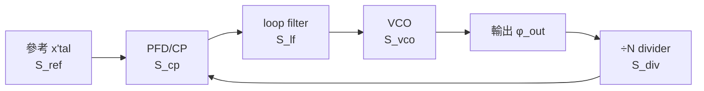

# PLL 完整相位雜訊預算與最佳 loop BW

> **先備**：[white_noise_to_phase_noise](/03_isf_core_theory/white_noise_to_phase_noise)（VCO 那一項 $S_{vco}\propto\Gamma_{rms}^2/q_{max}^2\cdot S_i/f^2$ 從哪來）、[serdes_clocking_connection](/06_design_insights/serdes_clocking_connection)（CDR/PLL 對 VCO 的 high-pass、jitter 積分頻寬）、[lc_vs_ring](/06_design_insights/lc_vs_ring)（為何 ring 的 $S_{vco}$ 高、LC 低）｜ **接下來**：[exercises](/06_design_insights/exercises)、[lab_13_pll_cdr_transfer](/04_simulation_labs/lab_13_pll_cdr_transfer)

這頁回答一個系統設計工程師每天都要面對的問題：**一顆鎖相環（PLL，phase-locked
loop，把振盪器相位鎖到參考時鐘的負回授環）的輸出相位雜訊，到底是由哪些源、各自貢獻
多少、在哪個 offset 頻段誰當家？而 loop bandwidth（環路頻寬，回授追得上的最高 offset）
應該選多寬，才能讓總抖動最小？** 我們要把五個雜訊源逐一寫出它們到輸出的轉移函數，加總成

$$
S_{out}=(S_{ref}N^2+S_{cp})\,\lvert H_{lp}\rvert^2+S_{vco}\,\lvert H_{hp}\rvert^2
$$

（規範第 11.2 節「PLL 輸出雜訊預算」；若是 **fractional-N**，還要加上第三項 ΔΣ 量化雜訊
$S_{\Delta\Sigma}\,\lvert H_{lp}\rvert^2$——見本頁「fractional-N 的第三項」一節，integer-N 時該項為零），
再對 $\int S_{out}\,df$（積分相位變異，正比於 rms
jitter 平方）求極小，得到那條**著名的 U 形曲線**與其最低點。

> **物理直覺（先講結論）**：PLL 是一個低通追蹤器。在 loop bandwidth $f_n$ 以內，回授來得及
> 反應，輸出**跟著參考**走——於是 reference 與環路前端（PFD、charge-pump、divider）的雜訊
> 被**放大且低通**地搬到輸出（而且 reference 還被 $\times N$ 倍頻，功率 $\times N^2$）；同時 VCO
> 自己的 close-in 漂移被回授**糾正掉**（VCO 高通）。在 $f_n$ 以外，回授來不及，輸出**跟著 VCO**
> 自由跑——VCO 的 $1/f^2$ 雜訊原樣漏出。所以 **in-band 跟 ref/CP、out-of-band 跟 VCO**，
> 交越就在 $f_n$。把 $f_n$ 開太窄→VCO 漏出太多（U 形左臂上揚）；開太寬→ref/CP 被搬出來太多
> （右臂上揚）。中間必有一個最佳 $f_n$。

本頁的 PLL 閉環轉移函數（loop transfer / 開環增益 / type-II 穩定性那些高階細節）屬於
**標準 PLL 文獻**（Gardner、Razavi、Best），**不在本站下載的 5 篇 PDF 之內**；我們只引用其
type-II 二階閉環結果（規範第 10.2 節已收錄），重心放在「ISF 決定 VCO 那一項 $S_{vco}$」
以及「預算如何加總、最佳 BW 如何取」。VCO 那一項的微觀來源（$\Gamma_{rms}^2/q_{max}^2$）正是
本站前面整套 ISF 理論的成果。

## 為什麼要做「雜訊預算」

phase noise 不是單一數字，它是一條隨 offset 變化的曲線；而曲線上每一段由不同的源主宰。
**做預算（budget）= 把每個源畫成一條，看誰在哪段冒頭、總和長什麼樣。** 這件事的價值：

- **找瓶頸**：close-in 太高？多半是 reference 或 charge-pump（被 $N^2$ 放大）。far-out 太高？
  是 VCO。對症下藥，不要盲目換零件。
- **選 loop BW**：交越點、總 jitter 都跟 $f_n$ 強相關，預算讓你**量化**這個取捨。
- **連到系統指標**：把 $S_{out}$ 積分得 rms jitter $\sigma_t$，直接餵進 SerDes 的 eye/BER（見
  [serdes_clocking_connection](/06_design_insights/serdes_clocking_connection)）。

## PLL 方塊圖與五個雜訊源

一顆整數-N PLL 的骨架：參考時鐘 → 鑑相器（PFD，phase-frequency detector）+ 電荷泵
（charge-pump，把相位差變成電流脈衝）→ loop filter（迴路濾波器，把電流積成控制電壓）→
VCO（壓控振盪器）→ 除頻器（÷N，把輸出拉回參考頻率比相）。五個雜訊注入點如圖：


```mermaid
flowchart LR
  REF["參考 x'tal<br/>S_ref"] --> PFD["PFD/CP<br/>S_cp"]
  PFD --> LF["loop filter<br/>S_lf"]
  LF --> VCO["VCO<br/>S_vco"]
  VCO --> OUT["輸出 φ_out"]
  OUT --> DIV["÷N divider<br/>S_div"]
  DIV --> PFD
```

每個源到輸出走的路徑不同，所以**整形（shaping）不同**：

| 源 | 符號 | 物理來源 | 到輸出的轉移 | 在輸出的整形 |
|---|---|---|---|---|
| reference | $S_{ref}$ | 晶體/參考的相位雜訊 | $\times N$ 再低通 | $N^2\lvert H_{lp}\rvert^2$（in-band，被 $N^2$ 放大） |
| PFD/charge-pump | $S_{cp}$ | CP 電流雜訊、PFD dead-zone、mismatch | 低通 | $\lvert H_{lp}\rvert^2$（in-band，平坦底） |
| divider | $S_{div}$ | ÷N 邏輯的 jitter | 低通（與 ref 同路徑） | $\lvert H_{lp}\rvert^2$（in-band；常併入 $S_{cp}$） |
| loop filter | $S_{lf}$ | 濾波電阻熱雜訊調 VCO | 帶通（峰在 $f_n$ 附近） | $\propto\lvert H_{lp}\rvert^2$（常較小，略） |
| VCO | $S_{vco}$ | tank/tail 熱雜訊經 ISF（本站主線） | 高通 | $\lvert H_{hp}\rvert^2$（out-of-band 主宰） |

**為什麼 reference 要乘 $N^2$。** divider 把輸出頻率 $f_{out}=N f_{ref}$ 拉回 $f_{ref}$ 比相，等於
要求**輸出相位 = $N\times$ 參考相位**（相位也被倍頻）。相位放大 $N$ 倍，功率譜密度就放大 $N^2$
倍。所以一顆乾淨晶體（$S_{ref}$ 很低）配上大 $N$（例如 $N=100$）後，等效到輸出的 in-band
雜訊地板會被抬高 $20\log_{10}N=40$ dB——這是為什麼 **整數-N PLL 的 in-band 雜訊往往由參考
$\times N^2$ 與 charge-pump 共同決定**，而不是 VCO。

> **設計訊息**：in-band 地板 $\approx(S_{ref}N^2+S_{cp})$；要壓它，要嘛降 $N$（用 fractional-N
> 或更高頻參考）、要嘛降 charge-pump 電流雜訊。VCO 對 in-band **沒有貢獻**（被高通糾正掉）。

## 第 1 步：每個源的轉移函數（type-II 二階）

採規範第 10.2 節「PLL（type-II 2nd order）」的閉環功率轉移。以自然頻率 $\omega_n=2\pi f_n$、
阻尼比 $\zeta$（本頁取臨界附近 $\zeta=0.707$）、$\omega=2\pi f$（$f$ 為 offset 頻率）表示：

$$
\lvert H_{lp}\rvert^2=\frac{(2\zeta\omega_n\omega)^2+\omega_n^4}{(\omega_n^2-\omega^2)^2+(2\zeta\omega_n\omega)^2},\qquad
\lvert H_{hp}\rvert^2=\frac{\omega^4}{(\omega_n^2-\omega^2)^2+(2\zeta\omega_n\omega)^2}.
$$

- **低頻極限 $\omega\to0$**：$\lvert H_{lp}\rvert^2\to\omega_n^4/\omega_n^4=1$（參考/CP 全傳）、
  $\lvert H_{hp}\rvert^2\to0$（VCO 被壓）。✓「in-band 跟 ref/CP」。
- **高頻極限 $\omega\to\infty$**：$\lvert H_{lp}\rvert^2\to(2\zeta\omega_n\omega)^2/\omega^4\to0$、
  $\lvert H_{hp}\rvert^2\to\omega^4/\omega^4=1$（VCO 全傳）。✓「out-of-band 跟 VCO」。
- **互補性**：標準式下 $H_{hp}(s)=1-H_{lp}(s)$，故輸出 = 兩路徑相加，無重複計。
- **Dimension check**：$\omega,\omega_n$ 同為 rad/s，分子分母同階（$\omega^4$ 或 $\omega_n^4$），
  $\lvert H\rvert^2$ 無因次 ✓。

這兩條轉移函數的詳細推導（從 PFD gain $K_d$、VCO gain $K_v$、loop filter $F(s)$ 寫開環
$G(s)=K_dK_vF(s)/s$ 再求閉環）見 [lab_13_pll_cdr_transfer](/04_simulation_labs/lab_13_pll_cdr_transfer)；
那條鏈路與 type-II 穩定性屬標準 PLL 文獻（不在 5 篇 PDF 內）。

## 第 2 步：加總成輸出預算

reference 與 charge-pump/divider 走同一條低通路徑（reference 先 $\times N$），VCO 走高通路徑，
三段不相關、功率相加（規範第 11.2 節）：

$$
S_{out}(f)=\big(S_{ref}(f)\,N^2+S_{cp}(f)\big)\,\lvert H_{lp}(f)\rvert^2+S_{vco}(f)\,\lvert H_{hp}(f)\rvert^2 .
$$

- **Dimension check**：$S_{ref},S_{cp},S_{vco},S_{out}$ 皆 $\text{rad}^2/\text{Hz}$，$N$ 與 $\lvert H\rvert^2$
  無因次，三項同單位相加 ✓。
- **divider 去哪了**：$S_{div}$ 與 charge-pump 走同一條低通路徑、在輸出同樣是 $\lvert H_{lp}\rvert^2$
  整形，故工程上常把 $S_{div}$ 併進 $S_{cp}$ 當作「環路前端等效 in-band 地板」。本頁的 $S_{cp}$
  就是「PFD + charge-pump + divider」的合計。
- **loop-filter 那一項**：$S_{lf}$（濾波電阻熱雜訊調制 VCO）的轉移在 $f_n$ 附近有個小峰，量級
  通常比 ref/CP 與 VCO 小，本頁的 toy 預算略去（標 illustrative）；真實設計要納入並做電阻雜訊
  最佳化。
- **fractional-N 的第三項**：若除數由 ΔΣ 調變器抖動（fractional-N），量化雜訊以
  $S_{\Delta\Sigma}(f)\,\lvert H_{lp}\rvert^2$ 進預算——與 CP 同路徑低通，但**不乘 $N^2$**、
  形狀是 $+20(m-1)$ dB/dec 的上升斜坡。完整推導與 worked example 見本頁
  「fractional-N 的第三項：ΔΣ 量化雜訊」一節。integer-N（本頁 lab_20 的設定）此項為零。

### VCO 那一項就是本站的 ISF 結果

$S_{vco}$ 不是天上掉下來的——它**就是前面整套 ISF 理論的輸出**。對 $1/f^2$ 區（白噪上轉），

$$
S_{vco}(f)=\frac{\Gamma_{rms}^2}{q_{max}^2}\cdot\frac{\overline{i_n^2}/\Delta f}{(2\pi f)^2}\quad[\text{rad}^2/\text{Hz}]
$$

（時域乾淨版，見 [white_noise_to_phase_noise](/03_isf_core_theory/white_noise_to_phase_noise)；
對應 [P1] Eq.(21), p.185，差個 SSB factor-of-2）。所以「PLL 預算裡 VCO 為什麼是 $1/f^2$、為什麼
$\propto\Gamma_{rms}^2/q_{max}^2$」——答案全在 ISF。**ring VCO 的 $\Gamma_{rms}$ 大、$q_{max}$ 小，
$S_{vco}$ 就高**（見 [lc_vs_ring](/06_design_insights/lc_vs_ring)），這正是 ring-PLL 要把 $f_n$ 開大
去壓 VCO 的根本原因。

## 第 3 步：in-band vs out-of-band 的切換

把 $S_{out}$ 拆成三段讀：

1. **deep in-band（$f\ll f_n$）**：$\lvert H_{lp}\rvert^2\approx1$、$\lvert H_{hp}\rvert^2\approx0$。
   $S_{out}\approx S_{ref}N^2+S_{cp}$——一條由參考$\times N^2$與 charge-pump 撐起的**平坦地板**
   （若參考含 $1/f$，這段會微微往 close-in 翹）。
2. **out-of-band（$f\gg f_n$）**：$\lvert H_{lp}\rvert^2\approx0$、$\lvert H_{hp}\rvert^2\approx1$。
   $S_{out}\approx S_{vco}\propto1/f^2$——**VCO 的 $-20$ dB/decade 裙邊**原樣漏出。
3. **交越（$f\approx f_n$）**：兩段交會。$\zeta=0.707$ 下，在 $f_n$ 處
   $\lvert H_{lp}\rvert^2\approx1.5$（$+1.76$ dB）、$\lvert H_{hp}\rvert^2\approx0.5$（$-3$ dB），
   兩者之和 $\approx2$（$+3$ dB）——這就是輕微的**鼓包（peaking）**，也是 PLL 輸出常見的
   「在 loop BW 附近隆起一塊」的由來（兩條曲線真正相等發生在 $f\approx1.55\,f_n$，各約 $0.85$、$-0.7$ dB，
   並非在 $f_n$）。$\zeta$ 太小（欠阻尼）鼓包會很尖。峰值的**精確**位置與高度其實有閉式解——
   見下一節。

> **一眼判讀 PN 圖**：看到 close-in 平坦地板 → 量 in-band，反推 $S_{ref}N^2+S_{cp}$；看到地板
> 外緣某 offset 開始以 $-20$ dB/dec 下滑 → 那個轉折就是 $f_n$，外面是 VCO。中間若有尖峰 →
> 阻尼不足或 loop BW 設計過衝。

## 補充推導：peaking 的閉式解——type-II 帶零點注定隆起

第 3 步在 $f=f_n$ 處量到 $\lvert H_{lp}\rvert^2\approx1.5$（$+1.76$ dB），但那**不是最高點**。
這一節把 type-II 二階 $\lvert H_{lp}\rvert^2$（規範 10.2 原式）的**峰值頻率與峰值大小**
解析地解出來。推導本身是純代數（自含）；「$\zeta\leftrightarrow$ phase margin 對應」與
「級聯 0.1 dB 法則」屬標準控制／電信文獻，逐一標明（外部文獻，非本站 5 篇 PDF）。

### 無因次化

令 $x=\omega/\omega_n=f/f_n$（無因次；rad/s ÷ rad/s ✓）。把規範 10.2 的 $\lvert H_{lp}\rvert^2$
分子分母同除 $\omega_n^4$：

$$
\lvert H_{lp}\rvert^2=\frac{(2\zeta\omega_n\omega)^2+\omega_n^4}{(\omega_n^2-\omega^2)^2+(2\zeta\omega_n\omega)^2}
=\frac{1+4\zeta^2x^2}{(1-x^2)^2+4\zeta^2x^2}\equiv g(x) .
$$

### 求極值：一條漂亮的二次式

令 $u=x^2$（$u\ge0$）。分子 $N(u)=1+4\zeta^2u$、分母
$D(u)=(1-u)^2+4\zeta^2u=u^2+(4\zeta^2-2)u+1$，導數 $N'=4\zeta^2$、$D'=2u+4\zeta^2-2$。
商的極值條件是 $N'D-ND'=0$，逐項展開：

$$
\begin{aligned}
N'D-ND'&=4\zeta^2\big[u^2+(4\zeta^2-2)u+1\big]-(1+4\zeta^2u)\big[2u+4\zeta^2-2\big]\\
&=\big[4\zeta^2u^2+(16\zeta^4-8\zeta^2)u+4\zeta^2\big]-\big[8\zeta^2u^2+(16\zeta^4-8\zeta^2)u+2u+4\zeta^2-2\big]\\
&=-4\zeta^2u^2-2u+2\;=\;-2\big(2\zeta^2u^2+u-1\big).
\end{aligned}
$$

（兩個 $16\zeta^4$ 交叉項**恰好對消**，剩下的二次式不含 $\zeta^4$。）令它為零、取正根：

$$
2\zeta^2u^2+u-1=0\quad\Longrightarrow\quad
u^\*=\frac{\sqrt{1+8\zeta^2}-1}{4\zeta^2}=\frac{2}{\sqrt{1+8\zeta^2}+1},\qquad
f_{pk}=f_n\sqrt{u^\*}.
$$

（兩個寫法相等：分子分母同乘 $\sqrt{1+8\zeta^2}+1$，用 $8\zeta^2=(\sqrt{1+8\zeta^2})^2-1$。）

### 為什麼「一定」隆起

在 $u=0$（DC）處，$N'D-ND'=4\zeta^2-(4\zeta^2-2)=+2$——**與 $\zeta$ 無關、恆為正**。
DC 增益是 1、斜率往上，所以對任何有限 $\zeta$，$u^\*>0$ 恆成立、峰值必高於 0 dB。物理原因：
type-II 有兩個積分器（開環相位從 $-180^\circ$ 起跳），必須靠 loop filter 的 zero
（$f_z=f_n/(2\zeta)$）提前把相位拉回來才穩得住；這個 zero 先把閉環增益**抬**過 1、
雙極點才把它壓下去——**peaking 是 type-II 穩定性的代價**，不是設計失誤。對照：沒有零點的
普通二階低通，$\zeta\ge1/\sqrt2$ 時就沒有共振峰；帶零點的 type-II 則**永遠**有峰，
只是 $\zeta$ 越大峰越矮、位置越往低頻縮。

### 峰值大小：代回化簡

令 $s=\sqrt{1+8\zeta^2}$（無因次）。三個中間量逐步化簡（反覆用 $8\zeta^2=s^2-1$）：

$$
\begin{aligned}
N(u^\*)&=1+4\zeta^2u^\*=1+(s-1)=s,\\
1-u^\*&=1-\frac{2}{s+1}=\frac{s-1}{s+1},\\
D(u^\*)&=\Big(\frac{s-1}{s+1}\Big)^2+(s-1)
=\frac{(s-1)\big[(s-1)+(s+1)^2\big]}{(s+1)^2}
=\frac{s\,(s-1)(s+3)}{(s+1)^2}.
\end{aligned}
$$

（最後一步用 $(s-1)+(s+1)^2=s^2+3s=s(s+3)$。）所以

$$
\lvert H_{lp}\rvert^2_{max}=\frac{N(u^\*)}{D(u^\*)}=\frac{(s+1)^2}{(s-1)(s+3)},\qquad
f_{pk}=f_n\sqrt{\frac{2}{s+1}},\qquad s=\sqrt{1+8\zeta^2}.
$$

peaking（dB）$=10\log_{10}\lvert H_{lp}\rvert^2_{max}$。**dB 記帳註**：這是功率轉移的
$10\log_{10}$，數值上等於幅度轉移的 $20\log_{10}$——同一個數字；此處**沒有** SSB 的 /2、/4
記帳問題（那是把 $S_\phi$ 換 $\mathcal{L}$ 才有的事，見規範 Eq.16 與 [P1] Eq.(21) 的討論）。

**Dimension check**：$x,u,\zeta,s$ 全無因次；$f_{pk}=f_n\times$（無因次）$=$ Hz ✓；
$\lvert H_{lp}\rvert^2_{max}$ 為無因次功率比 ✓。

> **黃金比例彩蛋**：$\zeta=1/\sqrt2$（$\zeta^2=\tfrac12$）時 $s=\sqrt5$，
> $u^\*=2/(\sqrt5+1)=(\sqrt5-1)/2=1/\varphi=0.618$，而
> $\lvert H_{lp}\rvert^2_{max}=(\sqrt5+1)/2=\varphi=1.618$——**峰值恰是黃金比例**，
> peaking $=10\log_{10}1.618=2.09$ dB，位置 $f_{pk}=0.786\,f_n$。第 3 步在 $f_n$ 讀到的
> $+1.76$ dB 只是這座峰的右肩。

### ζ → peaking 對照表（含 phase margin）

| $\zeta$ | $f_{pk}/f_n$ | peaking（dB） | phase margin |
|---|---|---|---|
| 0.5 | 0.856 | 3.33 | 51.8° |
| 0.707 | 0.786 | **2.09** | 65.5° |
| 1.0 | 0.707 | 1.25 | 76.3° |
| 1.5 | 0.611 | 0.65 | 83.7° |
| 4.32 | 0.388 | 0.10 | 89.2° |

$\zeta\leftrightarrow$PM 的來源：由 $H_{lp}$ 反解開環
$G(s)=H_{lp}/(1-H_{lp})=(2\zeta\omega_n s+\omega_n^2)/s^2$，令 $\lvert G(j\omega_c)\rvert=1$ 得
交越頻率 $\omega_c=\omega_n\sqrt{2\zeta^2+\sqrt{4\zeta^4+1}}$；而
$\angle G=-180^\circ+\arctan(2\zeta\omega_c/\omega_n)$，故

$$
\mathrm{PM}=\arctan\!\Big(2\zeta\sqrt{2\zeta^2+\sqrt{4\zeta^4+1}}\Big).
$$

這條式子與教科書「標準二階系統（無零點原型）」的 $\zeta\leftrightarrow$PM 映射**完全同式**
（代數恆等式 $(\sqrt{4\zeta^4+1}-2\zeta^2)(\sqrt{4\zeta^4+1}+2\zeta^2)=1$ 使兩者的 $\arctan$
引數相等），所以常用經驗式 $\mathrm{PM}\approx100\,\zeta$ 度（$\zeta\lesssim0.7$ 適用）也照搬
（$\zeta\leftrightarrow$PM 標準映射與 $100\zeta$ 經驗式屬外部文獻，非本站 5 篇 PDF：
F. M. Gardner, *Phaselock Techniques*, 3rd ed., Wiley, 2005；B. Razavi,
*Design of CMOS Phase-Locked Loops*, Cambridge Univ. Press, 2020）。

### 級聯法則：為什麼電信規格盯著 0.1 dB

$M$ 顆 transfer 相同的環串接（長途鏈路上一串 repeater/CDR，每顆都重生時脈再轉發），
總 jitter transfer 是 $H_{lp}^M$——**dB 直接相加**：峰值變成 $M\times P$ dB。

- 每級 2.09 dB（$\zeta=0.707$）$\times$ 20 級 $=$ **41.8 dB**：$f_{pk}$ 附近的 jitter 被放大
  百倍以上，鏈路直接報廢。
- 每級 0.1 dB $\times$ 20 級 $=$ 2 dB：可控。

這就是 SONET/SDH 世代把 regenerator 的 jitter-transfer peaking 規格壓在 **0.1 dB** 量級的
原因（外部標準文獻：Telcordia GR-253-CORE 與 ITU-T G.783/G.958 系列電信規範；本站未逐條
核對條號，引用其量級與精神）。由閉式反解，0.1 dB 需要 $\zeta\approx4.32$
（PM $\approx89.2^\circ$，重阻尼）——與單顆 PLL 積分 jitter 最省的 $\zeta\approx0.7$–$1$
**完全不同**：**單顆最佳不等於級聯最佳**，CDR 的 $\zeta$ 是由「你在鏈路的第幾級」決定的
系統規格。

嚴格註：dB 相加假設每級 $f_n,\zeta$ 相同（峰對齊，最壞情況）；實務上各級 $f_n$ 略錯開，
疊加會比 $M\times P$ 輕，但規格以最壞情況立。

### 數值互驗（repo `pll_utils`）

閉式 vs `simulations/common/pll_utils.py` 的 `H_lowpass_mag2`（400 萬點細掃）：

```python
import numpy as np
from simulations.common.pll_utils import H_lowpass_mag2

def peak_closed(zeta):                      # 閉式：f_pk/f_n 與 |H_lp|^2_max
    s = np.sqrt(1 + 8*zeta**2)
    return np.sqrt((s - 1)/(4*zeta**2)), (s + 1)**2/((s - 1)*(s + 3))

x = np.linspace(0.001, 5, 4_000_001)        # x = f/f_n（取 f_n = 1 Hz）
for z in (0.5, 0.707, 1.0, 1.5):
    xpk, g = peak_closed(z)
    m2 = H_lowpass_mag2(x, 1.0, z)
    k = int(np.argmax(m2))
    print(f"{z}: closed {xpk:.4f}/{10*np.log10(g):.4f} dB, "
          f"numeric {x[k]:.4f}/{10*np.log10(m2[k]):.4f} dB")
# -> 0.707: closed 0.7862/2.0903 dB, numeric 0.7862/2.0903 dB（其餘 ζ=0.5→3.3339、1.0→1.2494、1.5→0.6514，閉式＝數值到小數 4 位）

zg = np.linspace(2, 8, 600001)              # 掃 ζ 反解 0.1 dB peaking
pk = 10*np.log10(peak_closed(zg)[1])
z01 = zg[int(np.argmin(np.abs(pk - 0.1)))]
print(round(z01, 3))                        # -> 4.319（0.1 dB 所需的 ζ）
```

**適用與失效（本節閉式）：**

- 只適用於規範 10.2 的**理想 type-II 二階**閉環（charge-pump PLL 線性化、無額外極點）。
  真實迴路的 loop filter 多半再加 1–2 個高頻極點（三階／四階環），峰值位置與高度會偏移，
  要數值算。
- PM 映射假設交越發生在理想 $G(s)$ 上；額外極點會吃掉 PM，$\mathrm{PM}\approx100\zeta$
  隨之失準。
- 這裡的峰是**轉移函數**的隆起；輸出 PN 在 $f_n$ 附近的實際鼓包還要乘上各源 PSD
  （見第 3 步）。

## 第 4 步：reference spur（簡述）

除了**隨機**相位雜訊（連續的裙邊），PLL 輸出還常有**離散的 spur（雜散，單一頻率的尖刺）**。
最常見的是 **reference spur**：charge-pump 在每個參考週期注入電流脈衝，這個週期性擾動以
$f_{ref}$ 的整數倍（即 offset $=\pm f_{ref},\pm2f_{ref},\dots$）出現在輸出。來源是 CP current
mismatch、leakage、PFD dead-zone，把控制電壓調出一個 $f_{ref}$ 的小漣波，再被 VCO 的 $K_v$
轉成相位調制邊帶。

- **spur vs 隨機 PN**：spur 是**確定性、窄**的線（在頻譜上是一根針），隨機 PN 是**連續**裙邊；
  量測上 spur 不隨解析頻寬 RBW 改變高度（功率集中在一根），隨機 PN 的 dBc/Hz 才是「per-Hz」。
- **與 loop BW 的關係**：reference spur 在 offset $f_{ref}$ 處，若 $f_{ref}>f_n$ 會被 $\lvert H_{lp}\rvert^2$
  低通衰減（loop BW 越窄、spur 越被壓）；這與「窄 BW 對隨機 in-band 有利」一致，但會犧牲 VCO
  抑制——又是同一個取捨。
- 本頁的預算只算**隨機**部分（連續 $S_{out}$）；spur 的定量分析屬標準 PLL 文獻（不在 5 篇 PDF
  內），這裡僅作概念連結。

## 第 5 步：最佳 loop BW——對 ∫S_out df 求極小

把輸出的**積分相位變異**寫出來（規範公式 18）：

$$
\sigma_\phi^2(f_n)=\int_{f_1}^{f_2}S_{out}(f;f_n)\,df,\qquad
\sigma_t(f_n)=\frac{1}{2\pi f_0}\sqrt{\sigma_\phi^2(f_n)} .
$$

$\sigma_\phi^2$ 是 $f_n$ 的函數，因為 $S_{out}$ 透過 $\lvert H_{lp}\rvert^2,\lvert H_{hp}\rvert^2$ 依賴 $f_n$。
把它拆成 in-band 與 out-of-band 兩塊看趨勢：

$$
\sigma_\phi^2(f_n)\approx\underbrace{\int (S_{ref}N^2+S_{cp})\,\lvert H_{lp}\rvert^2\,df}_{\text{隨 }f_n\,\uparrow\ \text{而 }\uparrow\ (\text{通帶變寬，搬出更多 ref/CP})}+\underbrace{\int S_{vco}\,\lvert H_{hp}\rvert^2\,df}_{\text{隨 }f_n\,\uparrow\ \text{而 }\downarrow\ (\text{壓掉更多 VCO close-in})} .
$$

- **第一塊（ref/CP）隨 $f_n$ 單調增**：$f_n$ 越大，低通通帶越寬，把越多 in-band 地板（含被 $N^2$
  放大的參考）搬到輸出。粗估 $\propto(S_{ref}N^2+S_{cp})\cdot f_n$（平坦地板乘以通帶寬度）。
- **第二塊（VCO）隨 $f_n$ 單調減**：$f_n$ 越大，高通把越多 VCO 的 $1/f^2$ close-in 糾正掉。對
  $S_{vco}=k/f^2$ 經高通，殘留積分 $\propto k/f_n$（BW 越寬、漏出越少）。

一增一減 → **U 形**。對 $f_n$ 求導令為零，存在唯一極小：

$$
\frac{d\,\sigma_\phi^2}{d f_n}=0\quad\Longrightarrow\quad
\text{（ref/CP 漏出的邊際增加）}=\text{（VCO 壓制的邊際減少）}.
$$

用上面兩個粗估（$a\,f_n+b/f_n$ 形式，$a\propto S_{ref}N^2+S_{cp}$、$b\propto S_{vco}$ 係數）求極小：

$$
\frac{d}{df_n}\!\left(a f_n+\frac{b}{f_n}\right)=a-\frac{b}{f_n^2}=0\ \Longrightarrow\ f_n^\*=\sqrt{\frac{b}{a}}\ \propto\ \sqrt{\frac{S_{vco}\text{ 係數}}{S_{ref}N^2+S_{cp}}} .
$$

- **物理意義**：**VCO 越吵（$b$ 大）→ 最佳 BW 越大**（要更寬的環去壓 VCO）；**ref/CP 越吵或
  $N$ 越大（$a$ 大）→ 最佳 BW 越小**（不能把太多 in-band 地板搬出來）。這條 $f_n^\*\propto\sqrt{b/a}$
  是 PLL 設計的核心直覺，雖然係數要靠數值積分定。
- **toy 註記**：上面 $af_n+b/f_n$ 是把整形近似成理想磚牆濾波的**啟發式估算**；真實積分要用完整
  $\lvert H\rvert^2$（含 $f_n$ 附近的 peaking），故下面用 lab_20 的數值積分給精確最低點。

## 對應模擬圖（lab_20）

**lab_20**（`simulations/lab_20_pll_budget.py`）用上面的 type-II 二階預算，左圖在固定 $f_n=1$ MHz
畫出三條（ref$\times N^2$+CP 低通、VCO 高通、總和），右圖掃 $f_n$ 把 $\sigma_t(f_n)$ 畫成 U 形並標出
最低點。


**參數表（lab_20，representative levels、非特定矽製程，illustrative）：**

| 量 | 值 | 說明 |
|---|---|---|
| $f_0$ | 5 GHz | VCO/輸出頻率 |
| $N$ | 100 | 除頻比（reference $\times N^2=40$ dB 放大） |
| $\zeta$ | 0.707 | 阻尼比（臨界附近，鼓包小） |
| $S_{ref}$ | $10^{-16}+10^{-18}(10^6/f)$ | 乾淨晶體：低平坦底 + 輕微 $1/f$ |
| $S_{cp}$ | $5\times10^{-13}$（平坦） | PFD/charge-pump/divider 合計 in-band 地板 |
| $S_{vco}$ | $2\times10^{-10}(10^6/f)^2$ | ring VCO，$-100$ dBc/Hz @ 1 MHz，$1/f^2$ |
| 積分區間 | $10^3$–$10^9$ Hz | 1 kHz 到 1 GHz |

**單位表：**

| 量 | 單位 |
|---|---|
| $f,f_0,f_n$ | Hz |
| $\omega,\omega_n$ | rad/s |
| $S_{ref},S_{cp},S_{vco},S_{out}$ | $\text{rad}^2/\text{Hz}$ |
| $\lvert H_{lp}\rvert^2,\lvert H_{hp}\rvert^2,N,\zeta$ | 無因次 |
| $\sigma_\phi$ | rad |
| $\sigma_t$ | s |

**如何解讀圖：**

- **左圖**：藍點線（ref$\times N^2$+CP）在 in-band 是一條 $\approx1.5\times10^{-12}\ \text{rad}^2/\text{Hz}$
  的平坦地板（$S_{ref}N^2+S_{cp}=10^{-16}\cdot100^2+5\times10^{-13}=1.5\times10^{-12}$），到 $f_n$
  之後被低通拉下去；紅點線（VCO 高通）在 in-band 被壓掉、在 out-of-band 沿 $1/f^2$ 漏出；黑線
  （總和）= close-in 平坦、far-out 走 VCO 的 $1/f^2$，交越在 $f_n$ 附近並有輕微鼓包。
- **右圖**：$\sigma_t$ 對 $f_n$ 是 U 形。$f_n$ 太窄（左臂）→ VCO close-in 漏出太多 → jitter 暴增；
  $f_n$ 太寬（右臂）→ ref$\times N^2$/CP 被搬出太多 → jitter 回升。**最低點落在 $f_n^\*\approx6.90$ MHz、
  $\sigma_t\approx259$ fs**（lab_20 實測列印值）。

**核心 Python（完整 script：`simulations/lab_20_pll_budget.py`）：**

```python
import numpy as np
from simulations.common.pll_utils import H_lowpass_mag2, H_highpass_mag2

def output_psd(f, fn, N, zeta=0.707):
    lp = H_lowpass_mag2(f, fn, zeta)
    hp = H_highpass_mag2(f, fn, zeta)
    S_ref = 1e-16 + 1e-18 * (1e6 / f)   # 乾淨晶體
    S_cp  = 5e-13 * np.ones_like(f)     # PFD/CP/divider 平坦底
    S_vco = 2e-10 * (1e6 / f) ** 2      # ring VCO -100 dBc/Hz @1MHz, 1/f^2
    return (S_ref * N**2 + S_cp) * lp + S_vco * hp   # 預算加總

f = np.logspace(3, 9, 3000); f0 = 5e9; N = 100
fns = np.logspace(4.5, 7.5, 60)
jit = [np.sqrt(np.trapezoid(output_psd(f, fn, N), f)) / (2*np.pi*f0) for fn in fns]
k = int(np.argmin(jit))
print(fns[k]/1e6, "MHz", jit[k]*1e15, "fs")   # -> ~6.90 MHz, ~259 fs
```

## Worked examples 數值例題

格式：**題目 → 逐步代入（帶單位）→ 結果 → dimension check → 一行 Python 驗證**。沿用
lab_20 的 representative 數值（$f_0=5$ GHz、$N=100$、$\zeta=0.707$、上表三個 $S$）。

> **例 1（in-band 地板 + reference $\times N^2$ 的代價）**：求 deep in-band（$f\ll f_n$）的輸出
> 相位雜訊地板，並換算成 dBc/Hz；比較「若 $N$ 從 100 降到 10」會差多少 dB。

**逐步代入：**

1. deep in-band 時 $\lvert H_{lp}\rvert^2\approx1$、$\lvert H_{hp}\rvert^2\approx0$，取平坦部分
   （忽略參考的 $1/f$）：
   

$$
S_{out,\,\text{in-band}}\approx S_{ref}N^2+S_{cp}=10^{-16}\times100^2+5\times10^{-13}.
$$

2. 算 reference 項：$10^{-16}\times10^{4}=10^{-12}\ \text{rad}^2/\text{Hz}$。
3. 加 CP 項：$10^{-12}+5\times10^{-13}=1.5\times10^{-12}\ \text{rad}^2/\text{Hz}$。
4. 換 dBc/Hz（$\mathcal{L}\approx\tfrac12 S_\phi$，規範 Eq.16）：
   $\mathcal{L}=10\log_{10}(\tfrac12\times1.5\times10^{-12})=10\log_{10}(7.5\times10^{-13})$。

**結果：** in-band 地板 $S_{out}\approx1.5\times10^{-12}\ \text{rad}^2/\text{Hz}$，即
$\mathcal{L}\approx-121.2$ dBc/Hz。其中 reference 貢獻 $10^{-12}$、CP 貢獻 $0.5\times10^{-12}$，
**reference$\times N^2$ 是 in-band 的主角**。若 $N$ 從 100 降到 10，reference 項由 $10^{-12}$ 降到
$10^{-16}\times100=10^{-14}$（降 $100\times=20$ dB），此時 in-band 改由 $S_{cp}=5\times10^{-13}$ 主宰，
總地板 $\approx5.1\times10^{-13}$，改善約 $10\log_{10}(1.5\times10^{-12}/5.1\times10^{-13})\approx4.7$ dB。

**Dimension check：** $S_{ref}\,[\text{rad}^2/\text{Hz}]\times N^2\,[\text{無因次}]+S_{cp}\,[\text{rad}^2/\text{Hz}]
=[\text{rad}^2/\text{Hz}]$ ✓；取 $10\log_{10}$ 後讀作 dBc/Hz ✓。

```python
import numpy as np
S_ref, N, S_cp = 1e-16, 100, 5e-13
S_in = S_ref*N**2 + S_cp
print(S_in, "rad^2/Hz", round(10*np.log10(0.5*S_in), 1), "dBc/Hz")  # 1.5e-12, -121.2
print("N=10:", round(10*np.log10(0.5*(S_ref*10**2 + S_cp)), 1), "dBc/Hz")  # -125.9
```

> **例 2（U 形與最佳 BW：窄、最佳、寬三點對照）**：用 lab_20 的完整預算，數值積分 $1$ kHz–$1$ GHz，
> 比較 $f_n=0.3$ MHz（太窄）、$f_n^\*\approx6.9$ MHz（最佳）、$f_n=30$ MHz（太寬）三點的 rms jitter，
> 驗證 U 形與最低點。

**逐步（概念 + 數值）：**

1. 對每個 $f_n$，逐頻算 $S_{out}(f;f_n)=(S_{ref}N^2+S_{cp})\lvert H_{lp}\rvert^2+S_{vco}\lvert H_{hp}\rvert^2$。
2. 積分得 $\sigma_\phi^2=\int_{10^3}^{10^9}S_{out}\,df$（梯形法），開根號得 $\sigma_\phi$。
3. 換算 $\sigma_t=\sigma_\phi/(2\pi f_0)$，$f_0=5$ GHz。

**結果（lab_20 數值）：**

| $f_n$ | $\sigma_t$ | 誰漏出 |
|---|---|---|
| 0.30 MHz（太窄） | $\approx867$ fs | VCO close-in 大量漏出（U 形左臂） |
| 6.90 MHz（最佳） | $\approx259$ fs | 兩邊平衡，最低點 |
| 30 MHz（太寬） | $\approx396$ fs | ref$\times N^2$/CP 被搬出（U 形右臂） |

從最佳點往窄走（$6.9\to0.3$ MHz）jitter 漲到 $3.3\times$；往寬走（$6.9\to30$ MHz）漲到 $1.5\times$。
**U 形左臂比右臂陡**——因為這顆是 ring VCO（$S_{vco}$ 大、$1/f^2$ 漏出對 BW 很敏感），所以
「寧可開稍寬、不可開太窄」。這正是 ring-PLL 偏好**大 loop BW** 的設計準則。

**Dimension check：** $\int S_{out}\,df$：$[\text{rad}^2/\text{Hz}]\times[\text{Hz}]=[\text{rad}^2]$ → $\sigma_\phi\,[\text{rad}]$；
$\sigma_\phi/(2\pi f_0)$：$\text{rad}/(\text{rad/s})=\text{s}$ ✓。

```python
import numpy as np
from simulations.common.pll_utils import H_lowpass_mag2, H_highpass_mag2
f = np.logspace(3, 9, 3000); f0 = 5e9; N = 100
def Sout(fn):
    lp, hp = H_lowpass_mag2(f, fn), H_highpass_mag2(f, fn)
    S_ref = 1e-16 + 1e-18*(1e6/f); S_cp = 5e-13; S_vco = 2e-10*(1e6/f)**2
    return (S_ref*N**2 + S_cp)*lp + S_vco*hp
for fn in [0.3e6, 6.9e6, 30e6]:
    st = np.sqrt(np.trapezoid(Sout(fn), f))/(2*np.pi*f0)
    print(f"fn={fn/1e6:5.2f} MHz -> sigma_t={st*1e15:.0f} fs")  # 867 / 259 / 396 fs
```

## fractional-N 的第三項：ΔΣ 量化雜訊

到目前為止的預算是 **integer-N**：$f_{out}=Nf_{ref}$，頻率步進只能是 $f_{ref}$ 的整數倍。
要細步進（例如通訊頻道間距 200 kHz）而不犧牲 $f_{ref}$，就得用 **fractional-N**（分數除頻）：
讓除數在整數之間抖動（這個參考週期 ÷$N$、下一個 ÷$(N{+}1)$……），使**平均**除數為
$N+\alpha$（$0\le\alpha<1$）。這帶來雙重紅利——$f_{ref}$ 可以開高、$N$ 變小，in-band 的
$S_{ref}N^2$ 地板直接下降——但除數抖動本身是**量化誤差**，會變成一個新雜訊源。用
ΔΣ 調變器（delta-sigma modulator，把量化誤差整形推向高頻的回授量化器）產生除數序列，
就能把誤差功率推到高 offset、讓環路低通濾掉。這一節把它寫成預算的**第三項**。

本節整形結果屬標準 ΔΣ frequency-synthesis 理論（外部文獻，非本站 5 篇 PDF）；經典出處：
T. A. D. Riley, M. A. Copeland, and T. A. Kwasniewski, "Delta-Sigma Modulation in
Fractional-N Frequency Synthesis," *IEEE J. Solid-State Circuits*, vol. 28, no. 5,
pp. 553–559, May 1993。以下推導自含、逐步。

### 從除數抖動到相位雜訊（四步）

**（i）MASH-m 的輸出。** $m$ 階 MASH（MASH-1-1-1 即 $m=3$：三個一階 accumulator 級聯）的
除數控制序列可寫成

$$
y[k]=\alpha+(1-z^{-1})^m\,e[k],
$$

$e[k]$ 是最後一級的量化誤差，白噪模型：均勻分布於 $\pm\Delta/2$、方差
$\sigma_e^2=\Delta^2/12$，$\Delta=1$ LSB（注意：這裡的 $\Delta$ 是量化步階＝每參考週期
1 個 VCO cycle，**不是** offset 的 $\Delta f$）。$(1-z^{-1})^m$ 就是 ΔΣ 的**雜訊整形**：
把誤差功率推向高頻。

**（ii）誤差累積成相位（積分一次）。** 第 $k$ 個參考週期除數多吞了 $y[k]-\alpha$ 個
VCO cycle；每個 cycle 是輸出相位 $2\pi$ rad，而相位是頻率誤差的**累積**：

$$
\phi_{\Delta\Sigma}[k]=2\pi\sum_{j\le k}\big(y[j]-\alpha\big)=2\pi\,(1-z^{-1})^{m-1}e[k]\quad[\text{rad}] .
$$

（累加在 $z$ 域是 $1/(1-z^{-1})$，恰好吃掉一階整形：$m$ 階**頻率**整形 → $m-1$ 階
**相位**整形。）

**（iii）白噪序列的 PSD。** 取樣率 $f_{ref}$ 的白序列，功率 $\sigma_e^2$ 平鋪在
$\pm f_{ref}/2$（雙邊記帳）→ 每 Hz 密度 $\sigma_e^2/f_{ref}=\Delta^2/(12f_{ref})$；離散差分的
頻率響應大小 $\lvert1-e^{-j2\pi f/f_{ref}}\rvert=2\lvert\sin(\pi f/f_{ref})\rvert$。合起來
（referred to 輸出相位、尚未經環路）：

$$
\mathcal{L}_{\Delta\Sigma}(f)=\frac{(2\pi\Delta)^2}{12\,f_{ref}}\Big[2\sin\Big(\frac{\pi f}{f_{ref}}\Big)\Big]^{2(m-1)},\qquad
S_{\Delta\Sigma}(f)=2\,\mathcal{L}_{\Delta\Sigma}(f)=\frac{(2\pi\Delta)^2}{6\,f_{ref}}\Big[2\sin\Big(\frac{\pi f}{f_{ref}}\Big)\Big]^{2(m-1)}
$$

（$S_{\Delta\Sigma}$ 單位 $\text{rad}^2/\text{Hz}$，單邊）。**factor-of-2 記帳 flag（每次都標）**：
文獻慣用的 $1/12$ 版本是**雙邊**記帳，數值上剛好等於 SSB 的 $\mathcal{L}$（因為
$\mathcal{L}\approx\tfrac12S_\phi$ 的 $\tfrac12$ 抵銷單邊化的 $\times2$）；嚴格的本站**單邊**
$S_\phi$ 慣例要 $\times2$（變 $1/6$）。兩種寫法文獻都有，引用時務必說明你讀的是哪一種——
這與 [P1] Eq.(21) 的 /4（SSB 記帳）vs 時域乾淨版 /2 是同一類 factor-of-2 問題。

**（iv）沒有 $\times N^2$！** 這一項與 $S_{ref}$ 同樣從 PFD 端進環、同樣被
$\lvert H_{lp}\rvert^2$ 低通，但**不乘 $N^2$**：誤差本來就以「VCO cycle」計數，$2\pi$ 已是
輸出相位的 rad。若你堅持 referred to divider 輸出（每 cycle 只算 $2\pi/N$ rad），到輸出
還要 $\times N$、功率 $\times N^2$，$N^2$ 恰好對消。新手預算表最常見的錯就是替它多乘
$N^2$。

**Dimension check**：$(2\pi\Delta)^2$ [rad²]（$\Delta$ 是無因次的 cycle 數）$\times$
$1/(12f_{ref})$ [1/Hz] $\times$ 整形因子 [無因次] $=\text{rad}^2/\text{Hz}$ ✓。

### 進預算：第三項

$$
S_{out}(f)=\big(S_{ref}N^2+S_{cp}\big)\lvert H_{lp}\rvert^2+S_{vco}\lvert H_{hp}\rvert^2+S_{\Delta\Sigma}(f)\,\lvert H_{lp}\rvert^2 .
$$

它與 CP 雜訊同路徑（低通），但形狀完全不同：$f\ll f_{ref}$ 時
$2\sin(\pi f/f_{ref})\approx2\pi f/f_{ref}$，所以

$$
S_{\Delta\Sigma}\propto f^{\,2(m-1)}
$$

——**上升 $20(m-1)$ dB/dec 的斜坡**（MASH-1-1-1：$+40$ dB/dec），到 $f_{ref}/2$ 封頂
（整形因子最大 $2^{2(m-1)}=16$，即 $+12.0$ dB）。它不是地板、是從低頻爬上來的牆；
環路要在牆爬到礙事之前用 $\lvert H_{lp}\rvert^2$ 把它砍掉。

**兩個壓制旋鈕（為什麼高 $f_{ref}$、窄 BW 有效）：**

- **$f_{ref}$ 開高**：固定 $f\ll f_{ref}$ 下
  $\mathcal{L}_{\Delta\Sigma}\propto f^{2(m-1)}/f_{ref}^{\,2m-1}$——$f_{ref}$ 加倍就降
  $(2m-1)\times3.01\approx15.05$ dB（$m=3$）。直觀：總量化功率 $\Delta^2/12$ 固定，攤到
  更寬的 Nyquist 頻寬，且整形分母的 $f_{ref}$ 變大。
- **loop BW 收窄**：in-band spot 值不變（$\lvert H_{lp}\rvert^2\approx1$），但低通提早攔截
  斜坡——第三項的峰落在 $\sim f_n$ 附近、量級 $\propto f_n^{2(m-1)}$（$m=3$：$f_n$ 減半、
  峰降 12 dB）；磚牆估計其積分功率 $\propto f_n^{2m-1}$（$f_n^5$，對 BW 極度敏感）。
  這與 U 形右臂「窄 BW 壓 in-band」同方向，但**與 ring VCO 要寬 BW 直接衝突**——
  fractional-N + 吵 VCO 是預算上最難的組合，也是低雜訊 fractional-N 合成器偏好 LC VCO
  的原因之一。

> **toy-model 誠實警告（重要）**：本頁的 type-II 二階 $\lvert H_{lp}\rvert^2$ 在 $f_n$ 外只掉
> $-20$ dB/dec，追不上 $m=3$ 的 $+40$ dB/dec 上升——所以在這個 toy 模型裡第三項過了 $f_n$
> 仍以淨 $+20$ dB/dec 續爬，直到 $\sin$ 封頂：$f_n=100$ kHz 時峰值 $-103.6$ dBc/Hz 落在
> $\approx18.6$ MHz，比同 offset 的 VCO 項（$-125.4$ dBc/Hz）還高約 22 dB。真實 fractional-N
> 迴路因此**必加 loop-filter 高頻極點**（三階／四階環），讓 out-of-band 滾降快過
> $20(m-1)$ dB/dec（外部標準做法，見 Gardner、Razavi 教材；非本站 5 篇 PDF）。這正是
> 「紙上第三項看似無害、silicon 上高頻 hump 冒出來」的經典事故來源。

### Worked example（例 3：MASH-1-1-1 的 spot 貢獻）

> **例 3**：MASH-1-1-1（$m=3$）、$f_{ref}=50$ MHz、$\Delta=1$、$\zeta=0.707$。求 $f=1$ MHz
> 處的 $\mathcal{L}_{\Delta\Sigma}$（先不含環路，再分別以 $f_n=1$ MHz 與 100 kHz 過
> $\lvert H_{lp}\rvert^2$），與本頁 in-band 地板 $-121.2$ dBc/Hz 相比。

**逐步代入：**

1. 前置因子：$\dfrac{(2\pi\times1)^2}{12\times50\times10^6}=\dfrac{39.478}{6\times10^8}=6.580\times10^{-8}\ \text{rad}^2/\text{Hz}$。
2. 整形因子：$2\sin\big(\pi\times10^6/(5\times10^7)\big)=2\sin(0.06283\ \text{rad})=0.12558$；
   取 $2(m-1)=4$ 次方 → $2.487\times10^{-4}$（無因次）。
3. 未經環路：$6.580\times10^{-8}\times2.487\times10^{-4}=1.636\times10^{-11}$ →
   $\mathcal{L}_{\Delta\Sigma}(1\text{ MHz})=-107.9$ dBc/Hz。
4. $f_n=1$ MHz：$\lvert H_{lp}(1\text{ MHz})\rvert^2=1.50$（$+1.76$ dB）→ $-106.1$ dBc/Hz——
   比地板 $-121.2$ dBc/Hz **高 15 dB**，in-band 預算全毀：BW 開太寬，斜坡在 1 MHz 已爬到頂
   還被 peaking 加持。
5. $f_n=100$ kHz：$\lvert H_{lp}\rvert^2=0.0201$（$-17.0$ dB）→ $-124.8$ dBc/Hz——壓到地板下
   3.6 dB，spot 上安全（但高頻 hump 要另檢查，見上面的 toy-model 警告）。
6. 或者不動 BW、把 $f_{ref}$ 開到 100 MHz：未經環路變 $-122.9$ dBc/Hz，改善 15.04 dB
   （理論漸近 $15.05$ dB ✓）。

**Dimension check**：$\text{rad}^2/\text{Hz}\times$ 無因次 $=\text{rad}^2/\text{Hz}$；
$10\log_{10}$ 後讀 dBc/Hz ✓。

```python
import numpy as np
from simulations.common.pll_utils import H_lowpass_mag2

fref, m, Delta, f = 50e6, 3, 1.0, 1e6
P = (2*np.pi*Delta)**2/(12*fref)
shape = (2*np.sin(np.pi*f/fref))**(2*(m - 1))
raw = P*shape
print(f"{P:.4e}", f"{shape:.4e}", round(10*np.log10(raw), 2))
# -> 6.5797e-08 2.4871e-04 -107.86（前置因子 rad^2/Hz、整形因子、未經環路 dBc/Hz）
for fn in (1e6, 1e5):
    lp = H_lowpass_mag2(np.array([f]), fn, 0.707)[0]
    print(round(fn/1e3), round(10*np.log10(raw*lp), 2))
# -> 1000 -106.1, 100 -124.83（fn=1 MHz vs 100 kHz 的 L_ΔΣ(1 MHz)，dBc/Hz）
raw2 = (2*np.pi*Delta)**2/(12*100e6)*(2*np.sin(np.pi*f/100e6))**(2*(m - 1))
print(round(10*np.log10(raw/raw2), 2))
# -> 15.04（f_ref 50→100 MHz 的改善 dB；漸近 (2m-1)x3.01=15.05）

fs = np.logspace(3, np.log10(25e6), 200_000)
LdS = P*(2*np.sin(np.pi*fs/fref))**(2*(m - 1))*H_lowpass_mag2(fs, 1e5, 0.707)
k = int(np.argmax(LdS))
print(round(10*np.log10(LdS[k]), 2), round(fs[k]/1e6, 2))
# -> -103.6 18.55（toy 二階環下第三項的高頻 hump：dBc/Hz、MHz）
```

### 適用與失效（ΔΣ 白噪模型）

| 條件 | 成立時 | 失效時 |
|---|---|---|
| $e[k]$ 白噪、均勻 | $\alpha$「忙碌」（無短週期 limit cycle）或有 dither | $\alpha$ 為簡單分數（如 $1/8$）→ 週期 pattern → **fractional spur**（離散尖刺，不是連續譜） |
| PFD/CP 線性 | 高頻整形雜訊被環路濾掉 | CP up/down mismatch、非線性 → 高頻雜訊**摺回** in-band（noise folding），實測比公式差 |
| 環路滾降快過斜坡 | 積分受控、hump 不出現 | 二階環 $-20$ dB/dec 對 $m=3$ 不夠（本節 toy 已示範 $-103.6$ dBc/Hz 的 hump） |
| 量化誤差主導 | 上式即第三項 | DTC 輔助、digital PLL 等其他 fractional 技巧的殘差另計（外部文獻） |

## design knobs 清單

| 旋鈕 | 影響 | 怎麼調 |
|---|---|---|
| loop BW $f_n$ | U 形最低點；in/out 交越 | $f_n^\*\propto\sqrt{S_{vco}\text{係數}/(S_{ref}N^2+S_{cp})}$；VCO 吵→開大 |
| 除頻比 $N$ | in-band 地板 $\times N^2$ | 降 $N$（高頻參考、fractional-N）壓 in-band；但分數雜散要管 |
| charge-pump 電流雜訊 | in-band 平坦底 $S_{cp}$ | 加大 CP 電流、降 mismatch；過大會耗功率 |
| 阻尼比 $\zeta$ | $f_n$ 附近 peaking | $\zeta\approx0.7$–$1$ 壓鼓包；太小欠阻尼尖峰 |
| VCO $\Gamma_{rms}/q_{max}$ | $S_{vco}$ 高低（ISF！） | 加大 swing $q_{max}$、壓 $\Gamma_{rms}$（LC 取代 ring）→ 可放鬆 $f_n$ |
| reference $1/f$ | close-in 翹起 | 選低 $1/f$ 晶體；窄 BW 也壓不掉被 $N^2$ 放大的 ref 1/f |
| CP 電流 mismatch | reference spur | trim/校準 charge-pump；窄 BW 衰 spur 但放 VCO |
| ΔΣ 階數 $m$、$f_{ref}$（fractional-N） | 第三項斜坡 $+20(m-1)$ dB/dec、量級 $\propto1/f_{ref}^{2m-1}$ | $f_{ref}$ 加倍 $-15$ dB（$m=3$）；收窄 $f_n$ 砍斜坡；loop filter 加極點壓高頻 hump |

## 與 SerDes 的關聯

PLL 輸出的 $\sigma_t$（本頁右圖最低點 $\approx259$ fs）就是餵給高速串列收發器
（SerDes）取樣時脈的**抖動預算**。在 [serdes_clocking_connection](/06_design_insights/serdes_clocking_connection)
裡，這個 $\sigma_t$ 直接決定眼圖（eye diagram）的水平閉合與 BER（bit error rate）：UI（unit
interval，單位間隔）越短（資料率越高），同樣的 $\sigma_t$ 吃掉的眼寬比例越大。所以**選對
loop BW 把 PLL jitter 壓到最低，是整條 SerDes link 預算的源頭**。CDR（時脈資料回復）本身也是
一個 PLL，它對輸入 jitter 的 jitter-tolerance（容忍）轉移就是這裡的 $\lvert H_{lp}\rvert^2$
（低頻 jitter 追得上→容忍、高頻→靠眼圖裕度），見 [lab_13_pll_cdr_transfer](/04_simulation_labs/lab_13_pll_cdr_transfer)。

## 適用與失效條件

| 條件 | 成立時 | 失效時 |
|---|---|---|
| 各源不相關 | 功率直接相加（本頁加總式） | 若 CP 與 divider 相關，需含交叉項 |
| 線性 PLL（小相位誤差） | type-II 二階閉環有效 | 大失鎖/slew → 非線性，轉移函數不成立 |
| VCO 為 $1/f^2$（白噪上轉） | $S_{vco}=k/f^2$，本頁 U 形 | 含 flicker（$1/f^3$ close-in）→ 最佳 BW 偏移、要重積分 |
| 忽略 loop-filter 與 spur | toy 預算夠用 | 精確設計要納 $S_{lf}$、reference spur、fractional 雜散 |
| 整數-N | reference $\times N^2$ | fractional-N：ΔΣ 量化雜訊第三項（本頁「fractional-N 的第三項」節已補） |

## 重點回顧

- PLL 輸出預算：$S_{out}=(S_{ref}N^2+S_{cp})\lvert H_{lp}\rvert^2+S_{vco}\lvert H_{hp}\rvert^2$（規範 11.2）。
- **in-band 跟 ref/CP**（被 $N^2$ 放大、低通）、**out-of-band 跟 VCO**（高通、$1/f^2$ 漏出），交越在 $f_n$。
- VCO 那一項就是本站 ISF 結果 $S_{vco}\propto\Gamma_{rms}^2/q_{max}^2\cdot S_i/f^2$。
- reference spur 是離散尖刺（CP mismatch/leakage 的 $f_{ref}$ 漣波），窄 BW 可壓但犧牲 VCO 抑制。
- **最佳 loop BW**：對 $\int S_{out}df$ 求極小，$f_n^\*\propto\sqrt{S_{vco}/(S_{ref}N^2+S_{cp})}$；
  太窄 VCO 漏出、太寬 ref/CP 漏出。lab_20 數值：$f_n^\*\approx6.90$ MHz、$\sigma_t\approx259$ fs。
- 這顆 ring-PLL U 形左臂比右臂陡 → 偏好稍大的 loop BW。
- type-II 帶零點**必有 peaking**：$f_{pk}=f_n\sqrt{2/(s+1)}$、
  $\lvert H_{lp}\rvert^2_{max}=(s+1)^2/[(s-1)(s+3)]$，$s=\sqrt{1+8\zeta^2}$；
  $\zeta=0.707\to2.09$ dB @ $0.786f_n$（峰值恰為黃金比例 $\varphi$）。級聯時峰值 dB 相加 →
  電信規格 0.1 dB（需 $\zeta\approx4.3$）：單顆最佳 $\ne$ 級聯最佳。
- fractional-N 第三項：
  $\mathcal{L}_{\Delta\Sigma}=\frac{(2\pi\Delta)^2}{12f_{ref}}[2\sin(\pi f/f_{ref})]^{2(m-1)}\lvert H_{lp}\rvert^2$
  （SSB 讀法；本站單邊 $S_\phi$ 要 $\times2$），**無 $\times N^2$**、$+40$ dB/dec（$m=3$）上爬；
  $f_{ref}$ 加倍 $-15$ dB、窄 BW 砍斜坡；二階環壓不住 $m=3$ 的高頻 hump（要加濾波極點）。

## 延伸閱讀

- 兩條轉移函數的推導與 jitter transfer：[lab_13_pll_cdr_transfer](/04_simulation_labs/lab_13_pll_cdr_transfer)
- VCO 那一項從哪來（ISF→$1/f^2$）：[white_noise_to_phase_noise](/03_isf_core_theory/white_noise_to_phase_noise)
- 為什麼 ring 的 $S_{vco}$ 高、LC 低：[lc_vs_ring](/06_design_insights/lc_vs_ring)
- 把 $\sigma_t$ 餵進 eye/BER：[serdes_clocking_connection](/06_design_insights/serdes_clocking_connection)
- 預算的模擬腳本：`simulations/lab_20_pll_budget.py`
- fractional-N ΔΣ 整形的經典出處：T. A. D. Riley, M. A. Copeland, and T. A. Kwasniewski,
  "Delta-Sigma Modulation in Fractional-N Frequency Synthesis," IEEE J. Solid-State Circuits,
  vol. 28, no. 5, pp. 553–559, May 1993（外部文獻，非本站 5 篇 PDF）
- type-II 環路、PM 映射與 jitter-peaking 規格的標準教材：F. M. Gardner, *Phaselock
  Techniques*, 3rd ed., Wiley, 2005；B. Razavi, *Design of CMOS Phase-Locked Loops*,
  Cambridge Univ. Press, 2020（外部文獻，非本站 5 篇 PDF）
