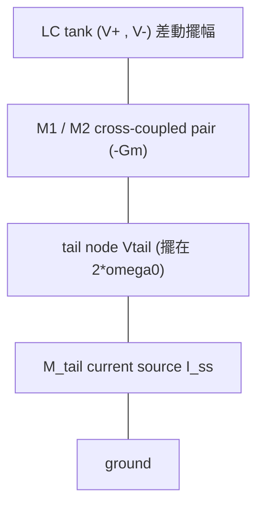

# 真實拓樸的 ISF：cross-coupled LC VCO、Colpitts、CMOS ring stage

> **先備**：[effective_isf](/03_isf_core_theory/effective_isf)（cyclostationary 有效 ISF $\Gamma_{eff}=\Gamma\cdot\alpha$，本頁三拓樸的共同骨架）、[symmetry](/06_design_insights/symmetry)（$c_0$ 決定 $1/f^3$、為何 tail 的 $c_0$ 才是麻煩）、[waveform_slope](/06_design_insights/waveform_slope)（由 switching slope 推 ring stage 的 ISF）｜ **接下來**：[lc_vs_ring](/06_design_insights/lc_vs_ring)、[measurement_and_spurs](/06_design_insights/measurement_and_spurs)

前面幾頁我們都用「理想 LC 的 $\Gamma(\theta)=-\sin\theta$」當主角，把白噪 → $1/f^2$、flicker → $1/f^3$
的機制講清楚。但真實晶片上的振盪器**不是一個乾淨的 LC 加一個白噪源**——它是好幾顆電晶體、一個
tail（尾電流）源、一個 tank、再加上 switching（換流）動作。**不同 device 在不同節點、不同相位窗
注入它的噪聲**，所以每一個噪聲源「看到」的有效 ISF 都不一樣。這頁要回答：

> **這頁要回答什麼**：在三種最常見的拓樸——**cross-coupled LC VCO（交叉耦合 LC 壓控振盪器）**、
> **Colpitts**、**CMOS inverter ring stage（CMOS 反相器環級）**——裡，每個 device noise 源**實際看到
> 的 ISF 長什麼樣**？它的傅立葉諧波（$c_0,c_1,c_2,\dots$）落在哪？這些諧波又怎麼決定 close-in
> phase noise 的 $1/f^3$、$1/f^2$？我們全部用**手算 + 量級估計**走一遍（非 Spectre / 非 transistor-level
> netlist 萃取），每個拓樸都把 **device noise → ISF 諧波 → close-in PN** 串成一條完整鏈。

> **物理直覺（先講結論）**：ISF 是「相位對某節點電荷注入的敏感度形狀」。但**噪聲源不是均勻地
> 在整個週期注入**——tail 電晶體只在 switching 瞬間導通、Colpitts 的電晶體只在一個窄電流脈衝裡
> 導通、ring 的 inverter 只在 transition（過渡）時有大電流。把「device 在哪個相位窗注入多少噪聲」
> （即 cyclostationary 的 noise modulating function $\alpha(\theta)$）乘上「該節點的 ISF $\Gamma(\theta)$」，
> 得到**有效 ISF** $\Gamma_{eff}(\theta)=\Gamma(\theta)\,\alpha(\theta)$。這個乘積的傅立葉諧波——尤其是
> **$c_0$（決定 flicker 上轉成 $1/f^3$）與 $c_2$（把 $2\omega_0$ 處的噪聲折回載波）**——才是真實
> close-in phase noise 的元兇。

本頁用到的兩條 close-in 招牌公式（[P1]，逐字）：

flicker 上轉成 $1/f^3$（[P1] Eq.(23), p.185）：

$$
\mathcal{L}\{\Delta\omega\}=10\log_{10}\!\left(\frac{c_0^2}{q_{max}^2}\cdot\frac{\overline{i_n^2}/\Delta f}{8\,\Delta\omega^2}\cdot\frac{\omega_{1/f}}{\Delta\omega}\right)
$$

$1/f^3$ corner（[P1] Eq.(24), p.185）：

$$
\Delta\omega_{1/f^3}=\omega_{1/f}\cdot\frac{c_0^2}{2\,\Gamma_{rms}^2}\approx\omega_{1/f}\left(\frac{c_0}{c_1}\right)^2
$$

白噪 $1/f^2$ 招牌結果（[P1] Eq.(21), p.185），用來算 floor：

$$
\mathcal{L}\{\Delta\omega\}=10\log_{10}\!\left(\frac{\Gamma_{rms}^2}{q_{max}^2}\cdot\frac{\overline{i_n^2}/\Delta f}{4\,\Delta\omega^2}\right)
$$

cyclostationary 的有效 ISF（[P1] Eq.(27), p.186，把 $\Gamma$ 換成 $\Gamma_{eff}=\Gamma\cdot\alpha$，
$\alpha$ 是 noise modulating function，振幅調制函數）：

$$
\Gamma_{eff}(x)=\Gamma(x)\,\alpha(x),\qquad \alpha(x)\in[0,1]
$$

> 所有「$c_n$ 的數值」凡標 *illustrative* 者皆為**教學用建構模型**（不是從 transistor netlist 萃取），
> 目的在於把**已知機制**的量級走通；理想 LC 的 $\Gamma=-\sin$ 是嚴格的。tail 有效 ISF 的具體機制
> 出自 Hajimiri–Lee cyclostationary 分析（[P1] §IV.D）與 Andreani 等人的 tail-noise 分析（**外部文獻，
> 不在下載的 5 篇 PDF 內**，見頁末）。

---

## (a) Cross-coupled LC VCO：tank 乾淨、tail 才是麻煩

### 電路與兩個關鍵噪聲源

cross-coupled LC VCO 的骨架：一個 LC tank 接在差動兩節點 $V^+,V^-$ 上，下面一對交叉耦合的
NMOS（$M_1,M_2$，閘極接對方汲極）提供 $-G_m$（負電導）補償 tank 損耗；最下面一個 **tail current
source** $M_{tail}$ 設定偏壓電流 $I_{ss}$。



兩個本質不同的噪聲注入點：

1. **差動 tank 節點**（$M_1,M_2$ 的 channel thermal noise 直接打在 tank 上）→ 看到的是
   **tank 的 ISF**。
2. **tail 節點**（$M_{tail}$ 的 thermal + flicker 噪聲）→ 看到的是 **tail 的有效 ISF**，因為 tail
   電流要先被 switching pair「換流（commutate）」才進到 tank。

### tank ISF：純 $c_1$ 的 $-\sin\theta$

差動 tank 是一個近乎理想的 LC 諧振器，兩端電壓近似 $V^\pm=\pm A\cos\omega_0 t$。把電荷注入差動節點，
相位敏感度就是理想 LC 的結果（見 [impulse_to_phase_shift](/03_isf_core_theory/impulse_to_phase_shift)）：

$$
\Gamma_{tank}(\theta)=-\sin\theta .
$$

它的傅立葉級數**只有一個 $c_1=1$**，其餘 $c_0=c_2=\dots=0$。$\Gamma_{rms}=1/\sqrt2\approx0.707$。

- **物理意義**：$-\sin\theta$ 在過零點（$\theta=0,\pi$）最敏感、在波峰（$\theta=\pi/2$）為零——典型的
  「在斜率大的地方踢最有效」。
- **關鍵好處**：$c_0=0$。對照 [P1] Eq.(23)，$1/f^3$ 的強度正比 $c_0^2$；$c_0=0$ 表示**差動 tank 噪聲
  幾乎不上轉 flicker**。這就是為什麼差動 LC VCO 的 close-in 比 ring 乾淨——只要波形對稱、$c_0$ 趨近 0。

### tail 有效 ISF：富含 $c_0$ 與 $c_2$

tail 噪聲的故事完全不同，因為 **tail 節點電壓擺在 $2\omega_0$**，而且 switching pair 對 tail 電流做
**全波整流式換流**。直覺地說：

- 在每半個週期，$M_1$ 或 $M_2$ 輪流把整條 $I_{ss}$（含其噪聲）導到 tank 的一邊；一個完整 RF 週期裡
  tail 電流被「翻」兩次 → tail 看到的調制是 $2\omega_0$ 週期 → 自然產生 **$c_2$（第二諧波）**。
- tail 電流的**低頻/DC 噪聲**（尤其 flicker）會被 switching 平均成一個 common-mode 的擺動，留下一個
  **非零的 $c_0$**（DC 項），這就是 flicker 上轉的門。

我們用一個 *illustrative* 模型把這形狀寫下來（取自 `lab_21_topology_isf.py`，標明為建構模型）：

$$
\Gamma_{tail}(\theta)=\frac{c_0}{2}+c_{1,res}\cos\theta+c_2\cos 2\theta,\qquad c_0=0.30,\ c_{1,res}=0.10,\ c_2=0.55 .
$$

- $c_0=0.30$：DC 項——**flicker 上轉的元兇**（[P1] Eq.(23) 正比 $c_0^2$）。
- $c_2=0.55$：第二諧波——把 **$2\omega_0$ 附近的 tail thermal noise 折回（fold）到載波** $\Delta\omega$ 處。
- $c_{1,res}=0.10$：殘留基波（理想對稱下應為 0；不對稱會漏一點）。
- 這支 ISF 的 $\Gamma_{rms}=\sqrt{(c_0/2)^2+\tfrac12(c_{1,res}^2+c_2^2)}=\sqrt{0.0225+\tfrac12(0.01+0.3025)}\approx0.42$（Parseval；見圖標）。

> **$2\omega_0$ 折回的機制（手算直覺）**：tail thermal noise 在 $2\omega_0\pm\Delta\omega$ 有功率
> $\overline{i_n^2}/\Delta f$。ISF 的 $c_2\cos2\theta$ 項就是一個「在 $2\omega_0$ 做 down-conversion 的
> mixer」（見 [white_noise_to_phase_noise](/03_isf_core_theory/white_noise_to_phase_noise) 第 3a 步）：
> 它把 $2\omega_0$ 處的噪聲搬到 $\Delta\omega$ 處的相位。這就是為什麼**設計者要把 tail 電流源的
> $2f_0$ 阻抗做高（tail filter）**：在 $2f_0$ 放一個 LC trap 或大電容，讓 tail 節點在 $2\omega_0$ 變成
> 高阻抗（理想上開路），tail 噪聲在 $2\omega_0$ 的電流就無法注入 tank → $c_2$ 折回被掐死。

### 圖：tank vs tail 的 ISF 與諧波


（完整 script：`simulations/lab_21_topology_isf.py`，**標明 illustrative**——tank 的 $-\sin$ 是嚴格的，
tail 的 $c_0,c_2$ 數值是建構的教學模型，用以示範已知機制。）

| 項目 | tank ISF | tail 有效 ISF |
|---|---|---|
| 公式 | $\Gamma=-\sin\theta$ | $\Gamma=\tfrac{c_0}{2}+c_{1,res}\cos\theta+c_2\cos2\theta$ |
| 主要諧波 | $c_1=1$（純基波） | $c_0=0.30$、$c_2=0.55$、$c_{1,res}=0.10$ |
| $\Gamma_{rms}$ | $0.707$ | $\approx0.42$（illustrative） |
| close-in 風險 | 幾乎無 $1/f^3$（$c_0\approx0$） | $c_0$ 大 → 強 $1/f^3$；$c_2$ 大 → $2\omega_0$ 折回 |
| 對策 | 維持波形對稱 | 波形對稱降 $c_0$ + **tail filter 調 $2f_0$** 降 $c_2$ |
| 模型 | 嚴格（ideal LC） | illustrative（建構） |

### device noise → ISF 諧波 → close-in PN：tail 的完整鏈（worked example 1）

> **例 1（tail flicker 上轉 → $1/f^3$ corner，手算）**：cross-coupled LC VCO，$f_0=5$ GHz、
> $q_{max}=1$ pC。tail 的有效 ISF 用上面 illustrative 模型（$c_0=0.30$、$\Gamma_{rms}\approx0.42$）。
> tail 電晶體白噪 $S_i=\overline{i_n^2}/\Delta f=2\times10^{-23}\ \text{A}^2/\text{Hz}$、flicker corner
> $f_{1/f}=1$ MHz（$\omega_{1/f}=2\pi\times10^6$ rad/s）。求 $1/f^3$ corner $\Delta\omega_{1/f^3}$、
> 並算 $\mathcal{L}$ 在 $\Delta f=10$ kHz（$1/f^3$ 區）的值。

**鏈條第 1 環（device noise → ISF 諧波）**：tail 噪聲看到的是含 $c_0=0.30$ 的有效 ISF。

**鏈條第 2 環（$1/f^3$ corner，[P1] Eq.(24)）**：

$$
\Delta\omega_{1/f^3}=\omega_{1/f}\cdot\frac{c_0^2}{2\,\Gamma_{rms}^2}=2\pi\times10^6\times\frac{0.30^2}{2\times0.42^2}=2\pi\times10^6\times\frac{0.09}{0.353}=2\pi\times10^6\times0.255 .
$$

$$
\Delta\omega_{1/f^3}=1.603\times10^6\ \text{rad/s}\quad\Rightarrow\quad \Delta f_{1/f^3}=\frac{\Delta\omega_{1/f^3}}{2\pi}=2.55\times10^5\ \text{Hz}=255\ \text{kHz}.
$$

- **意義**：$1/f^3$ 區延伸到約 **255 kHz** offset；比 device flicker corner（1 MHz）小了 $c_0^2/(2\Gamma_{rms}^2)=0.255$ 倍。
  這正是 [P1] 的重要設計訊息——**$1/f^3$ corner 不等於 device $1/f$ corner，可被波形對稱性（壓 $c_0$）大幅縮小**。

**鏈條第 3 環（close-in $\mathcal{L}$，[P1] Eq.(23)）**：在 $\Delta f=10$ kHz：

1. $\Delta\omega=2\pi\times10^4=6.283\times10^4$ rad/s，$\Delta\omega^2=3.948\times10^9$。
2. $\dfrac{c_0^2}{q_{max}^2}=\dfrac{0.09}{(10^{-12})^2}=9\times10^{22}\ \text{C}^{-2}$。
3. $\dfrac{S_i}{8\Delta\omega^2}=\dfrac{2\times10^{-23}}{8\times3.948\times10^9}=\dfrac{2\times10^{-23}}{3.158\times10^{10}}=6.333\times10^{-34}$。
4. $\dfrac{\omega_{1/f}}{\Delta\omega}=\dfrac{2\pi\times10^6}{2\pi\times10^4}=100$。
5. 括號內 linear $=9\times10^{22}\times6.333\times10^{-34}\times100=5.70\times10^{-9}$。
6. $\mathcal{L}=10\log_{10}(5.70\times10^{-9})=-82.4\ \text{dBc/Hz}$。

**結果**：$\Delta f_{1/f^3}\approx255$ kHz；$\mathcal{L}(10\,\text{kHz})\approx-82.4$ dBc/Hz（$1/f^3$ 區）。

**Dimension check（[P1] Eq.(23) 括號內要無因次）**：$\dfrac{c_0^2}{q_{max}^2}$ 帶 $\text{C}^{-2}$；
$\dfrac{S_i}{8\Delta\omega^2}$ 帶 $\dfrac{\text{A}^2/\text{Hz}}{(\text{rad/s})^2}=\text{A}^2\text{s}^3=\text{C}^2\text{s}$；
$\omega_{1/f}/\Delta\omega$ 無因次。乘起來 $\text{C}^{-2}\cdot\text{C}^2\text{s}=\text{s}$ → per-Hz ✓。

```python
import numpy as np
c0, qmax, Si = 0.30, 1e-12, 2e-23
gamma_rms = 0.42
w1f = 2*np.pi*1e6
# 1/f^3 corner (Eq.24)
dw_corner = w1f * c0**2 / (2*gamma_rms**2)
print(round(dw_corner/(2*np.pi)/1e3, 1), "kHz")     # -> 255.1 kHz
# L at 10 kHz (Eq.23)
dw = 2*np.pi*1e4
L = 10*np.log10((c0**2/qmax**2) * (Si/(8*dw**2)) * (w1f/dw))
print(round(L, 1), "dBc/Hz")                          # -> -82.4 dBc/Hz
```

> **設計旋鈕（cross-coupled LC VCO）**：
> 1. **波形對稱**（上升/下降沿對稱）→ 壓 $c_0$ → 直接縮小 $1/f^3$ corner（Eq.(24) 正比 $c_0^2$）。
> 2. **tail filter 調 $2f_0$**（在 tail 節點放 $2f_0$ trap / 大電容）→ tail 節點在 $2\omega_0$ 高阻抗
>    → 壓 $c_2$ 折回。
> 3. **加大 $q_{max}$（tank swing）**→ 同時壓 $1/f^2$（Eq.(21)）與 $1/f^3$（Eq.(23)），分母 $q_{max}^2$。
> 4. **降 tail flicker**（大尺寸 tail device、PMOS tail）→ 降 $S_i$ 的 flicker 部分。

---

## (b) Colpitts：為何 ISF 集中在窄相位窗

### 電路與電流脈衝

Colpitts 振盪器用一個電晶體 + 電容分壓器（$C_1,C_2$）+ tank 電感形成正回授。它的招牌特徵是：
**電晶體的集極（汲極）電流不是正弦，而是一連串很窄、很大的電流脈衝，後面跟著一大段「安靜區」**。
這正是 [P1] Fig. 13 畫的——Colpitts oscillator of Fig. 5(a) 的 collector voltage 與 collector current：
電流「a short period of large current followed by a quiet interval」（[P1] §IV.D, p.186）。


### 關鍵：脈衝注入時刻 vs ISF 形狀

這裡有兩個獨立的週期函數要相乘：

1. **tank 自己的 ISF** $\Gamma(\theta)\approx-\sin\theta$（Colpitts 的 tank 也近正弦），全週分佈。
2. **noise modulating function** $\alpha(\theta)$：device 只在電流脈衝那段才導通、才有噪聲注入——
   所以 $\alpha(\theta)$ 是一個**窄脈衝**，集中在某個相位 $\theta_p$。

有效 ISF 是兩者的乘積（[P1] Eq.(27)）：

$$
\Gamma_{eff}(\theta)=\Gamma(\theta)\,\alpha(\theta).
$$

因為 $\alpha(\theta)$ 是窄脈衝，**$\Gamma_{eff}$ 也被「開窗」成集中在 $\theta_p$ 附近的窄相位窗**——
這就是「Colpitts 的 ISF 集中在窄相位窗（電流脈衝注入時刻）」的數學寫法，對應 [P1] Fig. 14（畫出
$\Gamma$、$\Gamma_{eff}$、$\alpha$ 三條線）。

### 為什麼這對 Colpitts 是好事

[P1] §IV.D 的關鍵觀察（逐字大意）：**「The surge of current occurs at the minimum of the voltage
across the tank where the ISF is small.」** 也就是電流脈衝剛好落在 tank 電壓的**最低點**——而
$\Gamma=-\sin\theta$ 在波谷附近（對應過零之外的低敏感區）相對小。設計良好的 Colpitts 把噪聲注入
**對準 ISF 小的相位窗**，所以即使 device 在那一瞬間噪聲很大，乘上小的 $\Gamma$ 後 $\Gamma_{eff}$ 仍小、
$\Gamma_{eff,rms}$ 仍低 → close-in phase noise 低。

> **這是 Colpitts 相位雜訊優異的核心原因之一**：不是它的 device 比較安靜，而是它**把噪聲注入的時刻
> 對準了相位最不敏感的窗**。對照 [P1] §IV.D：ring oscillator 的不幸是「device 在 transition 時電流
> 最大（ISF 也最大）」，兩個峰**重疊**，所以 $\Gamma_{eff}\approx\Gamma$、cyclostationary 幫不上忙——
> 這是 ring phase noise 較差的原因之一。

### device noise → ISF 諧波 → close-in PN：Colpitts 的完整鏈（worked example 2）

> **例 2（窄窗如何壓 $\Gamma_{eff,rms}$，手算量級）**：Colpitts，tank ISF $\Gamma(\theta)=-\sin\theta$。
> device 電流脈衝寬度約佔週期的 $\delta=10\%$（導通角約 $36^\circ$），中心對準 ISF 較小處
> （取脈衝窗內 $\Gamma$ 的代表值 $\lvert\Gamma\rvert_{win}\approx0.3$）。比較「噪聲均勻全週注入」與
> 「噪聲只在窄窗注入」兩種情形的 $\Gamma_{eff,rms}^2$。

**情形 A（stationary，均勻全週）**：$\Gamma_{eff}=\Gamma$，

$$
\Gamma_{eff,rms}^2=\frac{1}{2\pi}\int_0^{2\pi}\sin^2\theta\,d\theta=\frac12=0.5 .
$$

**情形 B（cyclostationary，窄窗）**：把 $\alpha(\theta)$ 模型成一個寬度 $2\pi\delta$、高度 $1/\delta$
（歸一化使窗內平均噪聲功率不變）的窗，落在 $\lvert\Gamma\rvert_{win}\approx0.3$ 處。窗內 $\Gamma_{eff}=\Gamma\cdot\alpha$，
其均方：

$$
\Gamma_{eff,rms}^2\approx\frac{1}{2\pi}\int_{window}\big(\Gamma(\theta)\,\alpha(\theta)\big)^2 d\theta\approx \lvert\Gamma\rvert_{win}^2\cdot\frac{1}{\delta}\approx 0.3^2\times\frac{1}{0.1}\times\delta=0.09\times1=0.09 .
$$

（這裡做了量級近似：窗高 $1/\delta$、窗寬 $\delta\cdot2\pi$，歸一化後窗內平均 $\Gamma^2$ 約為窗中心值
$\lvert\Gamma\rvert_{win}^2=0.09$；嚴格值需數值積分，這裡只取量級。）

**比較**：$\Gamma_{eff,rms}^2$ 從 $0.5$ 降到 $\approx0.09$，**約降 $7.4$ dB**（$10\log_{10}(0.5/0.09)=7.4$ dB）。

**鏈條收尾（→ close-in PN）**：$\mathcal{L}\propto\Gamma_{eff,rms}^2/q_{max}^2$（[P1] Eq.(21) 把 $\Gamma_{rms}$
換成 $\Gamma_{eff,rms}$），所以**把噪聲對準 ISF 小的窗 → close-in PN 直接降約 7 dB**——這就是 Colpitts
的優勢量級。

- **Dimension check**：$\Gamma_{eff,rms}^2$ 無因次（$\Gamma$、$\alpha$ 皆無因次）✓。
- **誠實標註**：$\delta=10\%$、$\lvert\Gamma\rvert_{win}=0.3$ 是**量級估計**（不是從 netlist 萃取的精確值）；
  目的在示範「窄窗 + 對準 ISF 小處」如何壓 $\Gamma_{eff,rms}$。精確曲線見 [P1] Fig. 14。

```python
import numpy as np
theta = np.linspace(0, 2*np.pi, 20000, endpoint=False)
gamma = -np.sin(theta)
# 情形 A: stationary
g2_A = np.mean(gamma**2)                       # ~0.5
# 情形 B: 窄窗 alpha 對準 ISF 小處 (中心 theta_p ~ 1.5*pi 附近, |Gamma|~0.3 區)
alpha = np.zeros_like(theta)
mask = (theta > 1.40*np.pi) & (theta < 1.50*np.pi)   # ~10% 窗
alpha[mask] = 1.0/0.05                          # 歸一化高度
g2_B = np.mean((gamma*alpha)**2) * 0.05         # 量級
print(round(g2_A,3), round(g2_B,3))             # ~0.5  vs  ~0.09 量級
print(round(10*np.log10(g2_A/0.09),1), "dB")    # ~7.4 dB 改善
```

> **設計旋鈕（Colpitts）**：
> 1. **把電流脈衝對準 tank 電壓波谷（ISF 小處）**——減小導通角、調整偏壓使脈衝落在 $\Gamma$ 小的相位窗。
> 2. **窄脈衝（小導通角）**——窗越窄，越能避開 ISF 大的過零點。
> 3. 與 cross-coupled 不同：Colpitts 是單端、單 device，沒有 tail switching 的 $c_2$ 折回問題，
>    但波形不對稱會讓 $c_0\neq0$（仍要注意 flicker 上轉）。

---

## (c) CMOS inverter ring stage：由 switching slope 推 ISF

### 從 transition slope 推 ISF 形狀

ring oscillator（環形振盪器）由 $N$ 級 CMOS inverter 串成環。每一級的輸出在大部分時間「卡在」rail
（$V_{DD}$ 或 GND），只有在 **switching transition（切換過渡）**那一小段才快速翻轉。問：這級的 ISF
$\Gamma(\theta)$ 長什麼樣？

**手算推理（slope → sensitivity）**：相位敏感度 $\Gamma$ 本質上量「在這個相位踢一下、相位被推多少」。
對一個門限觸發（threshold-crossing）的數位級，**相位 = edge（邊緣）何時穿過門限**。一個小電荷
$\Delta q$ 在節點造成電壓跳變 $\Delta V=\Delta q/C$；它讓 edge 的穿越時刻平移

$$
\Delta t=\frac{\Delta V}{\lvert dV/dt\rvert}=\frac{\Delta q}{C\,\lvert dV/dt\rvert},
$$

換成相位 $\Delta\phi=\omega_0\Delta t$。對照操作型 ISF 定義 $\Delta\phi=\Gamma\,\Delta q/q_{max}$，可得

$$
\Gamma(\theta)\ \propto\ \frac{1}{\lvert dV/dt\rvert}\bigg|_{\theta}\quad\text{(在 edge 穿越門限的相位)}.
$$

- **直覺**：$dV/dt$ 大（陡 transition）→ edge 時刻被推得少 → 局部 $\Gamma$ 小；但**只有在 transition
  期間 edge 才存在**，rail 上（$dV/dt\approx0$）踢電荷只會被下一級門限「整形」掉、幾乎不改 edge 時刻
  → rail 上 $\Gamma\approx0$。
- **結論**：ring stage 的 ISF **集中在 transition 那一小段相位窗**，在 rail 上幾乎為零。把它理想化成
  一個**三角形（triangular）toy** 形狀——峰值落在 transition、寬度約等於 transition 佔週期的比例。

這與 [lc_vs_ring](/06_design_insights/lc_vs_ring) 的三角 toy 一致（`gamma_triangular(theta, n_stages)`，
見 `simulations/common/isf_utils.py`）：

$$
\Gamma_{ring}(\theta)\approx\text{三角脈衝，峰值}\sim\frac{1}{\sqrt N},\ \text{寬度}\sim\frac{1}{N},\ \text{集中在 transition}.
$$

對照圖（LC 的 $-\sin$ vs ring 的三角形）：


### 為什麼 transition 時最敏感（也最吵）

把 (b) 的觀察反過來用：ring 的 device 在 transition 時電流最大（要快速充放電節點電容），所以
**noise modulating function $\alpha(\theta)$ 的峰也落在 transition**。而 ISF $\Gamma(\theta)$ 的峰**也**
落在 transition（剛剛推導）。兩個峰**重疊** → $\Gamma_{eff}=\Gamma\cdot\alpha$ 幾乎不被開窗削弱
（[P1] §IV.D：ring 的 $\Gamma$ 與 $\Gamma_{eff}$「almost identical」）→ cyclostationary 救不了 ring。

> **這是 ring phase noise 較差的兩大原因之一**（[P1] 明言）：(1) noise 峰與 ISF 峰重疊，
> cyclostationary 無法把噪聲移到不敏感窗；(2) ring 每週期把儲能全耗掉（無高 $Q$ tank 蓄能）。
> 對照 Colpitts：脈衝對準 ISF **小**處，兩峰**錯開**，所以 Colpitts 乾淨。

### device noise → ISF 諧波 → close-in PN：ring stage 的完整鏈（worked example 3）

> **例 3（ring stage 的 $\Gamma_{rms}$ 與 $1/f^2$ floor，手算量級）**：5 級 CMOS ring，$f_0=5$ GHz、
> $q_{max}=1$ pC、每級 inverter 等效白噪 $S_i=4\times10^{-23}\ \text{A}^2/\text{Hz}$。用三角 toy
> 估 $\Gamma_{rms}$，再算 $1/f^2$ 區的 $\mathcal{L}(\Delta f=1\text{MHz})$（單級貢獻量級）。

**鏈條第 1 環（slope → ISF）**：三角 toy，$N=5$。由 [P2] Eq.(16) 的 scaling（見規範第 3 節）
$\Gamma_{rms}\propto N^{-3/4}$；對 $N=5$ 的三角 toy，數值上取 $\Gamma_{rms}\approx0.30$（toy 量級；
`gamma_rms(theta, gamma_triangular(theta, 5))` 實算約 $0.26$，本例取 $0.30$ 做整數量級估計）。

**鏈條第 2 環（ISF → close-in PN，[P1] Eq.(21)）**：在 $\Delta f=1$ MHz：

1. $\Delta\omega=2\pi\times10^6=6.283\times10^6$ rad/s，$\Delta\omega^2=3.948\times10^{13}$。
2. $\dfrac{\Gamma_{rms}^2}{q_{max}^2}=\dfrac{0.30^2}{(10^{-12})^2}=\dfrac{0.09}{10^{-24}}=9\times10^{22}\ \text{C}^{-2}$。
3. $\dfrac{S_i}{4\Delta\omega^2}=\dfrac{4\times10^{-23}}{4\times3.948\times10^{13}}=\dfrac{10^{-23}}{3.948\times10^{13}}=2.533\times10^{-37}$。
4. 括號內 linear $=9\times10^{22}\times2.533\times10^{-37}=2.28\times10^{-14}$。
5. $\mathcal{L}=10\log_{10}(2.28\times10^{-14})=-136.4\ \text{dBc/Hz}$（單級量級）。

**鏈條第 3 環（多級疊加）**：$N=5$ 級各貢獻一份（不相關），總功率 $\times5$ → $+10\log_{10}5=+7$ dB：

$$
\mathcal{L}_{total}(1\,\text{MHz})\approx-136.4+7.0=-129.4\ \text{dBc/Hz}.
$$

**結果**：單級 $\approx-136$ dBc/Hz、5 級總和 $\approx-129$ dBc/Hz @ 1 MHz（量級）。

- **手感**：比 (a) 的 LC VCO（$\Gamma_{rms}=0.707$、單源 $\sim-148$ dBc/Hz）差很多——但注意 ring 的
  $\Gamma_{rms}$ 已被 $N^{-3/4}$ 壓低了，**真正吃虧的是多級疊加 + 無 tank 蓄能**（這裡只示範了多級疊加的
  $+7$ dB）。
- **Dimension check**：同 [P1] Eq.(21)，括號內化簡為 $\text{s}$（per-Hz）✓。

```python
import numpy as np
import sys, os
sys.path.insert(0, "simulations/common")
from simulations.common.isf_utils import gamma_triangular, gamma_rms
theta = np.linspace(0, 2*np.pi, 4000, endpoint=False)
g_rms = gamma_rms(theta, gamma_triangular(theta, 5))   # 實算 ~0.26（手算取整數量級 0.30）
qmax, Si = 1e-12, 4e-23
dw = 2*np.pi*1e6
L1 = 10*np.log10((g_rms**2/qmax**2) * (Si/(4*dw**2)))   # 單級
L5 = L1 + 10*np.log10(5)                                 # 5 級疊加
print(round(L1,1), round(L5,1), "dBc/Hz")               # 實算 ~ -137.7 / -130.7（手算取 0.30 → -136 / -129）
```

> **設計旋鈕（CMOS ring stage）**：
> 1. **陡 transition（大 slew rate）**→ 局部 $\Gamma$ 小、transition 窗窄 → 降 $\Gamma_{rms}$。
> 2. **加級數 $N$**→ $\Gamma_{rms}\propto N^{-3/4}$ 降（但功耗、面積、每級疊加 noise 上升，需權衡）。
> 3. **對稱上升/下降沿**（NMOS/PMOS 對稱）→ 壓 $c_0$、抑制 flicker 上轉（見 [symmetry](/06_design_insights/symmetry)）。
> 4. ring 沒有 tank 蓄能、cyclostationary 又幫不上忙 → 同 $q_{max}$ 下 close-in 天生比 LC 差。

---

## 三拓樸對照總表

| 維度 | cross-coupled LC VCO | Colpitts | CMOS ring stage |
|---|---|---|---|
| tank ISF | $-\sin\theta$（差動，純 $c_1$） | $\approx-\sin\theta$（近正弦） | 三角形，集中 transition |
| 主要噪聲源 | $M_{1,2}$（tank）、$M_{tail}$（tail） | 單 device（窄電流脈衝） | 每級 inverter（transition 時大電流） |
| 有效 ISF $\Gamma_{eff}$ | tank 乾淨；tail 富 $c_0,c_2$ | 窄窗（脈衝對準 ISF **小**處） | $\approx\Gamma$（峰與 noise 峰**重疊**） |
| flicker 上轉（$c_0$） | tank $c_0\approx0$；tail $c_0$ 大 | 取決於對稱性 | 取決於上升/下降對稱 |
| $2\omega_0$ 折回（$c_2$） | tail 有（需 tail filter） | 弱 | 弱 |
| cyclostationary 是否幫忙 | tail 不幫（$c_0,c_2$ 是麻煩） | **幫**（兩峰錯開） | **不幫**（兩峰重疊） |
| close-in 量級（手算 worked example） | tail $1/f^3$ corner $\approx255$ kHz | $\Gamma_{eff,rms}^2$ 降約 7 dB | 5 級 $\approx-129$ dBc/Hz @1MHz |
| 關鍵設計旋鈕 | 對稱 + **tail filter @ $2f_0$** + 大 $q_{max}$ | 脈衝對準 ISF 谷 + 窄導通角 | 陡 transition + 級數 + 對稱沿 |
| 模型誠實標註 | tank 嚴格 / tail illustrative | $\alpha$ 窄窗量級估計 | 三角 toy + 量級 |

---

## 適用與失效條件

| 條件 | 成立時 | 失效時會怎樣 |
|---|---|---|
| 小擾動、相位線性 | $\Gamma_{eff}=\Gamma\alpha$、Eq.(21)/(23) 成立 | 大注入 → AM–PM、ISF 本身被改 |
| 有效 ISF 用對的 $\alpha(\theta)$ | close-in 預測準（含 cyclostationary） | 用 stationary $\Gamma$ 會低估/高估 close-in |
| tail filter 在 $2f_0$ 確實高阻抗 | $c_2$ 折回被掐死 | 失諧或 $Q$ 不足 → 殘留 $2\omega_0$ 折回 |
| 波形對稱（$c_0\to0$） | $1/f^3$ corner 小 | 不對稱 → $c_0$ 大 → close-in 抬高 |
| 本頁 $c_n$ 數值為 illustrative | 示範機制與量級 | 精確設計需 transistor-level / PSS+PNOISE（Spectre） |

---

## 重點回顧

- 真實拓樸的關鍵：**每個 device noise 源看到的有效 ISF $\Gamma_{eff}=\Gamma\cdot\alpha$ 都不一樣**；
  決定 close-in 的是 $\Gamma_{eff}$ 的諧波 $c_0$（$1/f^3$）、$c_2$（$2\omega_0$ 折回）。
- **cross-coupled LC VCO**：差動 tank ISF $=-\sin\theta$（純 $c_1$、$c_0\approx0$，乾淨）；**tail** 有效
  ISF 富含 $c_0$（flicker 上轉）與 $c_2$（tail 擺 $2\omega_0$、switching 換流而折回）→ 對策是
  **波形對稱 + tail filter 調 $2f_0$**（[P1] §IV.D；Andreani tail-noise，外部文獻）。
- **Colpitts**：device 電流是窄脈衝，$\alpha$ 把 $\Gamma_{eff}$ 開窗成窄相位窗；脈衝對準 tank 電壓
  波谷（ISF **小**處）→ $\Gamma_{eff,rms}$ 低 → close-in 乾淨（[P1] Fig. 13/14、Eq.(27)）。
- **CMOS ring stage**：由 transition slope 推 $\Gamma\propto1/\lvert dV/dt\rvert$、集中在 transition（三角 toy）；
  ISF 峰與 noise 峰**重疊** → cyclostationary 幫不上忙 + 無蓄能 → close-in 天生較差。
- 三個 worked example 各走完整鏈（device noise → ISF 諧波 → close-in PN）：tail $1/f^3$ corner $\approx255$ kHz、
  Colpitts 窄窗壓 $\Gamma_{eff,rms}^2$ 約 7 dB、5 級 ring $\approx-129$ dBc/Hz @1MHz（皆手算量級）。
- 來源：[P1] Eq.(21),(23),(24) p.185、Eq.(27) p.186、Fig. 5/13/14；圖 `cross_coupled_vco_isf.png`
  （lab_21，illustrative）、`lc_vs_ring_isf_comparison.png`（lab_03）。

## 延伸閱讀

- 有效 ISF 與 cyclostationary：[effective_isf](/03_isf_core_theory/effective_isf)
- flicker 上轉成 $1/f^3$：[flicker_noise_upconversion](/03_isf_core_theory/flicker_noise_upconversion)
- 對稱性如何壓 $c_0$：[symmetry](/06_design_insights/symmetry)
- LC vs ring 全面比較：[lc_vs_ring](/06_design_insights/lc_vs_ring)
- 波形斜率與敏感度：[waveform_slope](/06_design_insights/waveform_slope)
- tank swing 與 $q_{max}$：[tank_swing](/06_design_insights/tank_swing)
- device noise 映射到 ISF：[device_noise_mapping](/06_design_insights/device_noise_mapping)

## 外部文獻（不在下載的 5 篇 PDF 內）

- **[E-Andreani]** P. Andreani, X. Wang, L. Vandi, and A. Fard, *"A Study of Phase Noise in Colpitts
  and LC-Tank CMOS Oscillators,"* IEEE J. Solid-State Circuits, vol. 40, no. 5, pp. 1107–1118, May 2005.
  （tail-noise 與 cross-coupled vs Colpitts phase noise 的權威分析；本頁 tail $c_2$ 折回與 tail filter
  論點之依據。卷期/頁碼已查證（DOI 10.1109/JSSC.2005.845991）。）
- tail filter @ $2f_0$ 的經典出處亦見 E. Hegazi, H. Sjöland, A. A. Abidi, *"A Filtering Technique to
  Lower LC Oscillator Phase Noise,"* IEEE JSSC, vol. 36, no. 12, pp. 1921–1930, Dec. 2001.
  （**不在 5 篇 PDF 內**；卷期/頁碼已查證。）
