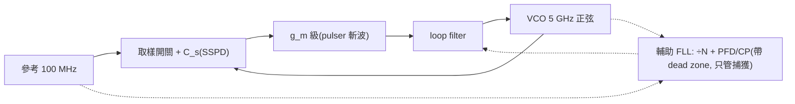

import SubSamplingPllExplorer from "@site/src/components/SubSamplingPllExplorer";

# Sampling / sub-sampling PLL：把 divider 踢出迴路

> **先備**：[pll_noise_budget](/06_design_insights/pll_noise_budget)（五源預算、in-band 地板 $S_{ref}N^2+S_{cp}$ 從哪來）、[clock_chain_budget](/06_design_insights/clock_chain_budget)（×N 的 $+20\log_{10}N$ 記帳、$\phi_{out}=N\phi_{in}$）、[adc_aperture_jitter](/06_design_insights/adc_aperture_jitter)（取樣誤差＝斜率×時間誤差的 aperture 數學）｜ **接下來**：[serdes_clocking_connection](/06_design_insights/serdes_clocking_connection)、[exercises](/06_design_insights/exercises)

[pll_noise_budget](/06_design_insights/pll_noise_budget) 的結論是：經典 charge-pump PLL
（電荷泵鎖相環）的 **in-band 地板由 reference$\times N^2$ 與 PFD/charge-pump/divider 共同決定，
VCO 再乾淨也幫不上忙**。這頁問下一個問題：**環路前端（PFD、charge-pump、divider）那一塊，
是物理極限還是架構選擇？** 答案是後者——**sub-sampling PLL（次取樣鎖相環，用低速參考
直接對高速 VCO 正弦波取樣的 PLL）** 把 divider 從相位偵測路徑整個移除，讓鑑相器增益
（phase-detector gain，$K_{PD}$）從「$I_{cp}/2\pi$ 再除 $N$」暴增到「$g_m\cdot A$」，
於是 **divider 雜訊項消失、CP 雜訊不再被 $\times N^2$ 放大**——in-band 地板一路掉到只剩
reference 那一項。這是近十五年 PLL 設計最重要的架構性突破之一。

> **外部文獻聲明**：sub-sampling PLL 的架構與「divider noise eliminated、PD/CP noise not
> multiplied by $N^2$」這個標準結果**不在本站下載的 5 篇 PDF 之內**（外部文獻，非本站 5 篇
> PDF）。經典出處：X. Gao, E. A. M. Klumperink, M. Bohsali, and B. Nauta, *"A Low Noise
> Sub-Sampling PLL in Which Divider Noise Is Eliminated and PD/CP Noise Is Not Multiplied
> by N²,"* IEEE J. Solid-State Circuits, vol. 44, no. 12, pp. 3253–3263, Dec. 2009。
> 本頁的推導自含、數值全部標「示意（illustrative）」；本站 5 篇 PDF 提供的是
> 「取樣點的敏感度」那一半物理（[P1] 的 ISF）。

> **物理直覺（先講結論）**：經典 PLL 的鑑相是「把 5 GHz 除到 100 MHz 再比相」——除頻把
> 相位縮小 $N$ 倍（訊號變弱 $N$ 倍），而 PFD/CP 的雜訊照原樣進來，訊雜比先天吃虧 $N$ 倍；
> divider 自己還要再加一份雜訊。sub-sampling 反過來：「**不動 VCO，直接用 100 MHz 的
> 參考邊緣去取樣 5 GHz 正弦**」。鎖定時取樣點落在正弦的**過零點**——那裡斜率最陡
> （$A\omega_0$，V/s），VCO 相位差一點點，取樣到的電壓就差很多——鑑相增益是「伏特級」
> 的 $A$（V/rad），比 charge-pump 的「微安級」大了幾個數量級。同樣一份電子雜訊
> （以 A/√Hz 或 V/√Hz 計），除以大 $K_{PD}$ 之後換算成的相位雜訊就小了幾個數量級。
> 代價：取樣器直接掛在 VCO 上（reference spur、kT/C 摺疊），而且正弦每個過零點長得
> 都一樣（鎖不出 $N$，要輔助迴路）。

## 第 1 步：經典 CP-PLL 的 in-band 天花板——雜訊除以 $K_{PD}$、再乘 $N^2$

先把「前端雜訊怎麼變成輸出相位雜訊」寫成一條可以檢查單位的鏈。經典整數-N PLL 的
PFD（phase-frequency detector）比較 $\phi_{ref}$ 與 $\phi_{out}/N$（divider 把輸出相位除
$N$，見 [clock_chain_budget](/06_design_insights/clock_chain_budget) 規則 2），charge-pump
把相位差變成平均電流：

$$
\bar i_{cp}=K_{cp}\Big(\phi_{ref}-\frac{\phi_{out}}{N}\Big)+i_n,
\qquad K_{cp}=\frac{I_{cp}}{2\pi}\ \ \Big[\frac{\text{A}}{\text{rad}}\Big]
$$

$K_{cp}=I_{cp}/2\pi$ 的由來：相位差 $\Delta\phi$ 讓 CP 在每個參考週期導通
$\Delta\phi/2\pi$ 的比例時間，平均電流 $=I_{cp}\cdot\Delta\phi/2\pi$。
**Dimension check**：A × 無因次 = A ✓；$K_{cp}$ 是 A/rad ✓。

**雜訊怎麼被放大。** 鎖定時迴路把平均電流驅到零，於是雜訊電流 $i_n$ 被「等效成」一個
相位誤差，再被輸出吸收：

$$
0=K_{cp}\Big(\phi_{ref}-\frac{\phi_{out}}{N}\Big)+i_n
\quad\Longrightarrow\quad
\phi_{out}=N\phi_{ref}+\frac{N}{K_{cp}}\,i_n .
$$

換成 PSD（in-band，$\lvert H_{lp}\rvert^2\approx1$）：

$$
S_{\phi,out}\Big|_{\text{in-band}}=N^2 S_{ref}+N^2 S_{div}+\frac{N^2}{K_{cp}^2}\,S_{i,cp}
\qquad[\text{rad}^2/\text{Hz}]
$$

- **Dimension check**：$S_{i,cp}$ [A²/Hz] ÷ $K_{cp}^2$ [A²/rad²] = rad²/Hz ✓；$N^2$ 無因次 ✓。
- **兩個放大機制疊在一起**：(1) CP 雜訊先除以**小小的** $K_{cp}$（示意：$I_{cp}=1$ mA →
  $K_{cp}=159.2\ \mu$A/rad；對**輸出**相位的等效增益還要再除 $N$，只剩 $3.183\ \mu$A/rad）；
  (2) 換算回輸出相位再乘 $N^2$（$N=50$ 即 $+33.98$ dB）。divider 的雜訊 $S_{div}$ 注入在
  PFD 輸入，同樣吃 $\times N^2$。
- 這正是 [pll_noise_budget](/06_design_insights/pll_noise_budget) 那條
  $S_{out}=(S_{ref}N^2+S_{cp})\lvert H_{lp}\rvert^2+\cdots$ 裡 $S_{cp}$（該頁把 CP＋divider
  合計、已換到輸出）的微觀來源。**要壓 in-band，只有三條路：降 $N$、降前端雜訊、
  或——本頁主角——把 $K_{PD}$ 做大。**

## 第 2 步：sub-sampling 的點子——用參考邊緣直接取樣 VCO 正弦



**sub-sampling phase detector（SSPD，次取樣鑑相器）**就是一個 track-and-hold：參考的
每個上升緣把 VCO 的正弦電壓取樣到電容 $C_s$ 上。「sub-sampling（次取樣）」指取樣率
$f_{ref}\ll f_0$——對 5 GHz 正弦以 100 MHz 取樣是嚴重的 undersampling，但我們**只關心
相位誤差**，而相位誤差正好被 alias 到 DC 附近，這正是我們要的。（用取樣鑑相器做微波
合成的想法本身歷史悠久——step-recovery-diode sampler 是微波儀器的標準配備（外部文獻，
不另列引用）；把它變成整合 CMOS PLL 並完成雜訊分析的，是上面引用的 Gao et al. 2009。）

**推導 $K_{PD}$。** 鎖定時 $\omega_0 T_{ref}=2\pi N$（每個參考週期 VCO 走整數圈）。設參考
第 $k$ 個邊緣落在 $t_k=kT_{ref}+\delta t_k$（$\delta t_k$ 是參考自己的 timing 誤差，s），
VCO 輸出 $V(t)=A\sin(\omega_0 t+\phi_{out})$。取樣到的電壓：

$$
V_k=A\sin\big(\omega_0 kT_{ref}+\omega_0\,\delta t_k+\phi_{out}\big)
=A\sin\big(\underbrace{2\pi Nk}_{\text{整數圈,丟掉}}+\ \phi_{out}+\omega_0\,\delta t_k\big)
\approx A\big(\phi_{out}+\omega_0\,\delta t_k\big)
$$

最後一步用小角近似（鎖定點在 $\sin$ 的零點附近）。從這一條式子一次讀出三件事：

1. **鑑相增益**：$K_{PD}=\partial V_k/\partial\phi_{out}=A$ [V/rad]——**對 5 GHz 的輸出相位
   直接鑑相，沒有除 $N$**。它就是過零點斜率換算來的：斜率 $A\omega_0$ [V/s] 除以
   $\omega_0$ [rad/s] 得 $A$ [V/rad]。**Dimension check**：(V/s)÷(rad/s)=V/rad ✓。
   示意數字：$A=0.5$ V、$f_0=5$ GHz → 斜率 $A\omega_0=15.71$ mV/ps、$K_{PD}=0.5$ V/rad。
2. **後級**：取樣電壓經一個 $g_m$ 級（transconductor，取代 charge-pump）變成電流，
   合計增益（對輸出相位）$K_{SS}=g_m A$。**Dimension check**：
   $[\text{A/V}]\times[\text{V/rad}]=[\text{A/rad}]$ ✓。
   示意：$g_m=5$ mS → $K_{SS}=2.5$ mA/rad——比經典的 $3.183\ \mu$A/rad **大 785 倍**。
   （實作中 $g_m$ 級用 pulser 斬波（duty cycle）以控制迴路增益與穩定性；本頁示意取
   連續 $g_m$，細節見原論文。）
3. **參考雜訊照樣 $\times N$**：$\delta t_k$ 進來的是
   $\omega_0\delta t_k=N\cdot\omega_{ref}\delta t_k=N\cdot\phi_{ref,k}$
   ——參考的相位誤差被**斜率本身**乘了 $N$。示意：1 ps 的參考邊緣誤差
   → $15.71$ mV → $31.42$ mrad $=50\times0.628$ mrad。這印證
   [clock_chain_budget](/06_design_insights/clock_chain_budget) 規則 1/3：$\phi_{out}=N\phi_{ref}$
   是「頻率乘 $N$」這件事本身的性質，**跟有沒有 divider 無關**——sub-sampling 移除的是
   divider 的「雜訊」，不是 reference 的 $\times N^2$。

## 第 3 步：in-band 優勢的推導——divider 項消失、CP 雜訊不再 $\times N^2$

把第 1、2 步並排。同一份雜訊電流 PSD $S_{i}$（A²/Hz），換到輸出相位：

$$
S_{\phi,out}^{\text{classic}}=\frac{N^2}{K_{cp}^2}\,S_i=\Big(\frac{2\pi N}{I_{cp}}\Big)^2 S_i,
\qquad
S_{\phi,out}^{\text{SS}}=\frac{S_i}{(g_m A)^2},
$$

兩者相除得 sub-sampling 對前端電流雜訊的**抑制比**：

$$
\frac{S_{\phi,out}^{\text{classic}}}{S_{\phi,out}^{\text{SS}}}
=\Big(\frac{2\pi N\,g_m A}{I_{cp}}\Big)^2
\quad\Longrightarrow\quad
\underbrace{20\log_{10}N}_{\text{divider 倍乘的移除}}
+\underbrace{20\log_{10}\!\frac{2\pi g_m A}{I_{cp}}}_{K_{PD}\text{ 增益紅利}}\ \ [\text{dB}]
$$

- **Dimension check**：$2\pi N g_m A/I_{cp}$ = 無因次×(A/rad)/(A)——rad 無因次，整個比值
  無因次 ✓，可以取 log。
- 示意數字（$N=50$、$g_m A=2.5$ mA/rad、$I_{cp}=1$ mA）：$33.98+23.92=57.9$ dB。
- **第一項就是題目說的「$\sim20\log_{10}N$ 的 divider 倍乘移除」**：CP/PD 雜訊在 sub-sampling
  裡不再被 $\times N^2$ 放大（外部標準結果，Gao et al. 2009，前引）。第二項是 $K_{PD}$ 從
  $I_{cp}/2\pi$ 換成 $g_m A$ 的額外紅利，隨設計而異。
- **divider 雜訊項 $N^2S_{div}$ 則是整個消失**——迴路裡根本沒有 divider。（晶片上還是有
  一顆 divider，但只在**輔助 FLL** 裡管頻率捕獲，鎖定後被 dead zone 靜默，不在相位雜訊
  路徑上；見第 5 步。）
- 剩下的 in-band 地板 $\approx N^2S_{ref}$＋取樣器自身雜訊——**變成 reference-limited**。
  要再往下，只能換更乾淨的參考或提高 $f_{ref}$ 降 $N$
  （[clock_chain_budget](/06_design_insights/clock_chain_budget) 的規則 1 沒有免費午餐）。

> **ILCM 對照（同一個「踢出 divider/CP」目標，機制完全不同）**：injection-locked clock
> multiplier（ILCM，注入鎖定倍頻器）也把 in-band 地板做到 reference-limited，但走的是
> 另一條路——sub-sampling PLL 是**連續時間閉環**（divider 只剩輔助 FLL、取樣過零點當鑑相器）；
> ILCM 是**離散時間、開環注入**（沒有 PFD/CP/divider 這回事，脈衝產生器直接把相位「拉」向
> 參考）。兩者的 in-band 記帳殊途同歸：sub-sampling 是 $N^2S_{ref}\vert H_{lp}\vert^2$（divider
> 項消失、CP 不再 $\times N^2$）；ILCM 則是 $N^2S_{ref}\vert H_{ref}\vert^2$，$H_{ref}=\beta/(1-(1-\beta)z^{-1})$
> 為一階離散低通（$\beta$=realignment factor）——**同一個 $\times N^2$，兩種完全不同的「怎麼把 divider
> 踢出去」**。完整推導（lock range、$\beta$、離散時間雜訊整形）見
> [subharmonic_injection](/06_design_insights/subharmonic_injection)。

## 第 4 步：ISF 連結——取樣過零點＝取樣 $\lvert\Gamma\rvert$ 最大的地方

這一步是本站主線與 sub-sampling 的漂亮交會。理想 LC 振盪器輸出 $V=A\cos(\omega_0 t)$ 的
ISF 是 $\Gamma(\omega_0\tau)=-\sin(\omega_0\tau)$（[lab_02](/04_simulation_labs/lab_02_lc_oscillator_toy_model)，
對應 [P1] 的 LC 範例）——$\lvert\Gamma\rvert$ 在**過零點最大（=1）、在波峰為零**。
SSPD 恰好就在過零點動作，於是同一個位置有**兩面性**：

**（a）讀相位的效率最高、且天然抗 AM。** 在過零點，$V=A\sin(\phi_{err})\approx A\phi_{err}$：
電壓「一比一地」攜帶相位資訊（增益 $A$ V/rad 是整條正弦上的最大值）；而振幅誤差
$\delta A$ 進來的是 $\delta A\sin(\phi_{err})\approx\delta A\cdot\phi_{err}$——二階小量，
**一階不進來**。反過來若取樣在波峰：$\partial V/\partial\phi=0$（讀不到相位），
$\delta A$ 卻全額進來。這與
[phase_vs_amplitude_noise](/02_foundations/phase_vs_amplitude_noise) 的分解完全一致：
過零點是「純相位」的窗口。**取樣的幾何，跟 aperture 數學是同一條**：
[adc_aperture_jitter](/06_design_insights/adc_aperture_jitter) 第 1 步的
「取樣誤差＝斜率×時間誤差」在 ADC 那頁是**雜訊**（時脈 jitter 弄髒取樣），在這頁被反過來
**當訊號用**（參考邊緣的時間差經斜率 $A\omega_0$ 變成可量的電壓）——同一條式子，
一邊是帳單、一邊是鑑相器。

**（b）打相位的效率也最高——kickback 變 spur。** 取樣開關每次閉合都跟 VCO 節點交換一小包
電荷 $\Delta q$（charge sharing / 開關饋通）。用 [P1] 的操作型 ISF 定義（規範公式 5）：

$$
\Delta\phi=\frac{\Gamma(\omega_0\tau)}{q_{max}}\,\Delta q
$$

打在過零點 → $\lvert\Gamma\rvert=1$（最大）→ **每一下都打好打滿**。示意（沿 canonical
例 A 的量級，取 $\lvert\Gamma\rvert=1$）：$\Delta q=1$ fC、$q_{max}=1$ pC → 每個參考週期
$\Delta\phi=1$ mrad。這個擾動是**確定性、以 $f_{ref}$ 週期**的，所以不是連續譜、而是
**reference spur**（規範 10.2 的小角 PM：殘留相位漣波基頻幅度 $\phi_p$ 的邊帶
$=20\log_{10}(\phi_p/2)$ dBc；$\phi_p=1$ mrad → $-66.0$ dBc、迴路若壓到 0.5 mrad →
$-72.0$ dBc，示意）。**同一個 $\lvert\Gamma\rvert_{max}$，給了你最大的鑑相增益，也給了你
最大的 kickback 傷害**——這就是 sub-sampling 的核心交易，下一步展開。
（spur 與隨機 PN 的分辨見 [measurement_and_spurs](/06_design_insights/measurement_and_spurs)。）

## 第 5 步：代價——aliasing、reference spur、鎖定範圍

**（1）aliasing：寬頻雜訊摺進 $\pm f_{ref}/2$。** SSPD 是一個以 $f_{ref}$ 取樣的系統
（跟 [adc_aperture_jitter](/06_design_insights/adc_aperture_jitter) 的 ADC 同款數學）。
取樣器輸入端的**寬頻**電壓雜訊（VCO buffer 的熱雜訊，PSD $S_v$ V²/Hz、頻寬 $B_n\gg f_{ref}$）
功率守恆地摺回單邊 $f_{ref}/2$：

$$
S_{v,fold}=\frac{S_v\,B_n}{f_{ref}/2}=\frac{2S_v B_n}{f_{ref}}
\qquad\Longrightarrow\qquad
S_{\phi,fold}=\frac{S_{v,fold}}{A^2}\ \ [\text{rad}^2/\text{Hz}]
$$

**Dimension check**：$[\text{V}^2/\text{Hz}]\times[\text{Hz}]\div[\text{Hz}]=[\text{V}^2/\text{Hz}]$ ✓；
再除 $A^2$ [V²/rad²] 得 rad²/Hz ✓。

（除以 $A^2$：過零點的電壓→相位增益是 $A$ V/rad。）對取樣電容本身，總雜訊功率是
著名的 $kT/C_s$（與頻寬無關），摺開後 $S_v=2kT/(C_s f_{ref})$。示意：$C_s=100$ fF →
$\sqrt{kT/C_s}=204\ \mu$V rms → $\mathcal{L}=-147.8$ dBc/Hz——比 $-126$ 的 reference 地板
低很多（好消息），但**買寬頻 buffer 前要先算摺疊**：$B_n$ 每大一倍，這一項多 3 dB。

**（2）reference spur 蹺蹺板。** 第 4 步（b）的 kickback 打在 $\lvert\Gamma\rvert$ 最大處，
spur 天生比經典 PLL 兇。對策全是交易：加**隔離 buffer**（spur ↓，但 buffer 自己的雜訊
經 (1) 摺疊、又耗功率）；縮小 $C_s$（$\Delta q$ ↓ → spur ↓，但 $kT/C_s$ ↑——雜訊與 spur
坐在同一個蹺蹺板兩端）；dummy sampler 對消。同團隊的後續論文專門處理 spur：
X. Gao, E. A. M. Klumperink, G. Socci, M. Bohsali, and B. Nauta, *"Spur Reduction Techniques
for Phase-Locked Loops Exploiting a Sub-Sampling Phase Detector,"* IEEE J. Solid-State
Circuits, vol. 45, no. 9, pp. 1809–1821, Sep. 2010（外部文獻，非本站 5 篇 PDF；
TODO: manual verification needed——卷/期/頁碼請人工核對後再引用於正式文件）。

**（3）鎖定範圍：$\sin$ 認不出你要第幾圈。** $\sin$ 是 $2\pi$ 週期的——VCO 的**每一個**
過零點對 SSPD 都長一樣，所以 SSPD 對「頻率誤差」毫無鑑別力，也**沒有任何硬體定義 $N$**：
$f_0=k\,f_{ref}$ 的任何整數 $k$ 都是合法鎖點（harmonic lock，鎖錯諧波）。所以 SSPLL 一律
配一個**輔助 FLL**（frequency-locked loop：傳統 ÷N＋PFD/CP），負責把頻率拉到正確的
$N f_{ref}$ 附近；它帶 **dead zone**（死區）——鎖定後相位誤差很小，輔助迴路完全靜默，
divider 的雜訊就不進主迴路。$N$ 這個數字，在 SSPLL 裡是由**輔助迴路**定義的。

**（4）對最佳 loop BW 的影響（連回預算頁）。** 用
[pll_noise_budget](/06_design_insights/pll_noise_budget) 的 $af_n+b/f_n$ 玩具模型：in-band
地板 $a$ 掉 7.1 dB（功率 $\times1/5.12$，下面 worked example 的示意數字）→ 最佳
$f_n^\*\propto\sqrt{b/a}$ **變寬 $\sqrt{5.12}=2.26$ 倍**、最小積分 jitter
$\propto(ab)^{1/4}$ 改善 $5.12^{1/4}=1.5$ 倍——**地板變低不只是地板變低，它還允許你把
迴路開寬、多壓一段 VCO**，總 jitter 的紅利比地板 dB 數看起來更大。

## Worked example（示意）：×50 經典 CP-PLL vs sub-sampling 的 in-band 地板

格式：**題目 → 逐步代入（帶單位）→ 結果 → dimension check → Python 驗證**。所有元件數值
為 representative／**示意**（非特定矽製程）；記帳慣例與
[clock_chain_budget](/06_design_insights/clock_chain_budget) 相同（SSB，$\mathcal{L}=\tfrac12S_\phi$；
本頁比較全是**比值**，/2-vs-/4 慣例對消）。

> **題目**：$f_{ref}=100$ MHz、$N=50$（$f_0=5$ GHz）。參考床 $\mathcal{L}_{ref}=-160$ dBc/Hz、
> divider 自身床 $-160$ dBc/Hz（在其輸出）、CP 與 $g_m$ 級的等效雜訊電流同為
> $i_n=4$ pA/√Hz、$I_{cp}=1$ mA、$g_m=5$ mS、$A=0.5$ V、$C_s=100$ fF（300 K）。
> 求兩種架構 deep in-band 的輸出相位雜訊地板，並把 in-band 部分（brick-wall，
> 10 kHz–1 MHz，$f_n=1$ MHz）換成 rms jitter。

**逐步（經典 CP-PLL）：**

1. reference：$-160+20\log_{10}50=-160+33.98=-126.02$ dBc/Hz。
2. charge-pump：$K_{cp}=I_{cp}/2\pi=1\ \text{mA}/2\pi=159.2\ \mu$A/rad。輸入參考相位處
   $S=(4\times10^{-12})^2/(1.592\times10^{-4})^2=6.32\times10^{-16}$ rad²/Hz；$\times N^2=2500$
   → $1.58\times10^{-12}$ rad²/Hz → $\mathcal{L}=10\log_{10}(\tfrac12\times1.58\times10^{-12})=-121.03$ dBc/Hz。
3. divider：$-160+33.98=-126.02$ dBc/Hz。
4. 功率相加（[clock_chain_budget](/06_design_insights/clock_chain_budget) 規則 4）：
   $\mathcal{L}_{classic}=-118.9$ dBc/Hz——**CP 當家**。

**逐步（sub-sampling）：**

5. reference：**不變**，$-126.02$ dBc/Hz（第 2 步第 3 點：$\times N$ 藏在斜率裡）。
6. $g_m$ 級：$K_{SS}=g_mA=2.5$ mA/rad →
   $S=(4\times10^{-12})^2/(2.5\times10^{-3})^2=2.56\times10^{-18}$ rad²/Hz →
   $\mathcal{L}=-178.93$ dBc/Hz。
   對照第 2 步：$-121.03-57.9=-178.93$ ✓（$57.9=33.98+23.92$）。
7. sampler（kT/C 摺疊）：$S_\phi=2kT/(C_sf_{ref})/A^2=3.31\times10^{-15}$ rad²/Hz →
   $\mathcal{L}=-147.81$ dBc/Hz。
8. 功率相加：$\mathcal{L}_{SS}=-125.99$ dBc/Hz——**reference-limited**，改善 **7.1 dB**。

| in-band 貢獻（@ 5 GHz 輸出） | 經典 ×50 CP-PLL | sub-sampling |
|---|---|---|
| reference $\times N^2$ | $-126.02$ | $-126.02$（不變） |
| PFD/CP（SS 為 $g_m$ 級） | $-121.03$ | $-178.93$（÷$K_{PD}^2$，$-57.9$ dB） |
| divider $\times N^2$ | $-126.02$ | —（已移出迴路） |
| sampler $kT/C$ 摺疊 | — | $-147.81$ |
| **總和 [dBc/Hz]** | $\mathbf{-118.9}$ | $\mathbf{-125.99}$ |

**換成 jitter（brick-wall，10 kHz–1 MHz）**：$\sigma_\phi^2=2\times10^{\mathcal{L}/10}\times(10^6-10^4)$、
$\sigma_t=\sigma_\phi/(2\pi f_0)$（規範公式 18/19）→ 經典 $50.9$ fs、sub-sampling $22.5$ fs
（in-band 部分省 $2.26\times$）。

**Dimension check（總覽）**：A²/Hz ÷ (A/rad)² = rad²/Hz ✓；rad²/Hz × Hz = rad² ✓；
rad ÷ (rad/s) = s ✓；所有 dB 運算的引數皆無因次 ✓。

**Python 驗證（整塊可直接執行；`# ->` 為實跑輸出）：**

```python
import numpy as np
N, f_ref = 50, 100e6
f0 = N*f_ref                                        # 5 GHz
padd = lambda *L: 10*np.log10(sum(10**(x/10) for x in L))
# --- (a) 經典 charge-pump PLL 的 in-band 三項（示意） ---
L_ref_out = -160.0 + 20*np.log10(N)
print(round(L_ref_out, 2))                          # -> -126.02（ref ×N²）
K_cp = 1e-3/(2*np.pi)                               # I_cp=1 mA -> 159.2 uA/rad
Si = (4e-12)**2                                     # (4 pA/√Hz)²
L_cp = 10*np.log10(0.5*Si/K_cp**2*N**2)
print(round(L_cp, 2))                               # -> -121.03（CP，÷K_cp² 再 ×N²）
L_div_out = -160.0 + 20*np.log10(N)
print(round(L_div_out, 2))                          # -> -126.02（divider ×N²）
L_classic = padd(L_ref_out, L_cp, L_div_out)
print(round(L_classic, 1))                          # -> -118.9（CP 當家）
# --- (b) sub-sampling PLL（示意） ---
K_ss = 5e-3*0.5                                     # g_m·A = 2.5 mA/rad（對輸出相位）
print(round(20*np.log10(K_ss/(K_cp/N)), 1))         # -> 57.9（= 33.98 + 23.92 dB）
L_gm = 10*np.log10(0.5*Si/K_ss**2)
print(round(L_gm, 2))                               # -> -178.93（同一份 i_n，÷K_SS²）
L_smp = 10*np.log10(0.5*(2*1.380649e-23*300/(100e-15*f_ref))/0.5**2)
print(round(L_smp, 2))                              # -> -147.81（kT/C 摺進 f_ref/2）
L_ss = padd(L_ref_out, L_gm, L_smp)
print(round(L_ss, 2))                               # -> -125.99（reference-limited）
print(round(L_classic - L_ss, 1))                   # -> 7.1（in-band 改善 dB）
# --- (c) in-band 部分換成 jitter（brick-wall 10 kHz–1 MHz） ---
for L in (L_classic, L_ss):
    st = np.sqrt(2*10**(L/10)*(1e6-1e4))/(2*np.pi*f0)
    print(round(st*1e15, 1))                        # -> 50.9 / 22.5（fs）
```

**誠實註記**：這組示意數字讓經典架構「CP 當家」、sub-sampling「reference 當家」——這是
教學上刻意選的典型情境；真實設計中 $i_n$、$I_{cp}$、duty-cycle、輔助迴路殘餘等都會挪動
各項的相對位置，但「divider 項消失＋CP 項不再 $\times N^2$」的**結構**不變（Gao et al.
2009 的量測正是 in-band 地板逼近 reference-limited）。

## 互動探索：把每一項拉來拉去

<SubSamplingPllExplorer />

試試看：(1) 把 $N$ 拉大——兩邊的 reference 項一起漲（$\times N^2$ 逃不掉），但經典的 CP 項
也跟著漲、SS 的 $g_m$ 項**不動**；(2) 把 $g_m$ 或 $A$ 拉大——只有 SS 的前端項往下掉；
(3) 把 $C_s$ 縮小——sampler 項上來（kT/C 蹺蹺板的雜訊端）。

## Design knobs 清單

| 旋鈕 | 作用 | 交易 |
|---|---|---|
| $K_{PD}=g_mA$ | 前端雜訊 ÷$K_{PD}^2$ | $A$ 由 VCO swing 決定（與 [tank_swing](/06_design_insights/tank_swing) 同一個旋鈕：swing 大→ISF 相位雜訊低**且**鑑相增益高，雙重紅利）；$g_m$ 大→功耗 |
| $N$ / $f_{ref}$ | reference $\times N^2$（SS 唯一剩的地板） | SSPLL 地板 reference-limited → 換高頻低噪參考才有感；divider/CP 項已不擋路 |
| $C_s$ | kT/C 摺疊 vs kickback spur | 小 $C_s$：spur ↓、雜訊 ↑；大 $C_s$：反之——蹺蹺板 |
| 隔離 buffer | spur ↓ | buffer 雜訊被 aliasing 摺疊（$\propto B_n/f_{ref}$）、功耗 ↑ |
| pulser duty cycle | 迴路增益/穩定性 | 斬波比例同時調 $K$ 與雜訊 duty，需一起記帳 |
| loop BW $f_n$ | 地板低 → $f_n^\*\propto\sqrt{b/a}$ 變寬 | 示意：地板 $-7.1$ dB → $f_n^\*\times2.26$、$\sigma_{t,min}\times1/1.5$（[pll_noise_budget](/06_design_insights/pll_noise_budget) 的 U 形） |
| 輔助 FLL dead zone | 鎖定後 divider 靜默 | dead zone 太窄→FLL 亂入打相位；太寬→頻率漂移沒人管 |

## 與 SerDes 的關聯

SerDes 取樣時脈的 jitter 預算裡，in-band 地板往往是大頭
（[clock_chain_budget](/06_design_insights/clock_chain_budget) 的 worked chain：65.9% 來自
被 $\times N^2$ 抬高的 in-band 床）。本頁示意數字把 in-band 部分從 50.9 fs 壓到 22.5 fs
（$2.26\times$），再加上最佳 loop BW 可以開寬 $2.26\times$ 去多壓 VCO——對
[serdes_clocking_connection](/06_design_insights/serdes_clocking_connection) 的 eye/BER
記帳（RJ 開銷 $=2Q^{-1}\sigma_t$）這是直接進帳。代價端：reference spur 是**確定性** jitter
（DJ，見 [dj_dual_dirac](/06_design_insights/dj_dual_dirac)），在眼圖上是雙峰而非高斯尾
——sub-sampling 換來的「RJ 變小、DJ 風險變大」正是系統層要盯的取捨。

## 適用與失效條件

| 條件 | 成立時 | 失效時 |
|---|---|---|
| 小角線性化（取樣點在過零附近） | $K_{PD}=A$、AM 一階不進來 | 相位誤差大（捕獲階段）→ $\sin$ 飽和、增益掉；靠輔助 FLL 拉回 |
| 取樣點恰在過零 | 增益最大、AM rejection 最好 | DC offset／delay 讓取樣點偏離 → $K_{PD}=A\cos\phi_{dc}$ 下降、AM 開始漏入 |
| 各源不相關、白 | 功率相加、摺疊公式成立 | 共 supply 的相關雜訊、$g_m$ 級 flicker（close-in 另計） |
| divider 只在輔助 FLL、dead zone 靜默 | divider 雜訊不進主迴路 | dead zone 設計不當 → FLL 間歇介入，divider/CP 雜訊回鍋 |
| 示意數值 | 結構性結論（誰消失、誰不變）可信 | 絕對 dB 值**不可**拿去對標任何實際製程/論文量測 |
| $f_0=Nf_{ref}$ 整數關係 | SSPD 每次都取到同一相位點 | fractional-N 需求 → 要 DTC/內插等額外技巧（外部文獻，超出本頁） |

## 重點回顧

- 經典 CP-PLL 前端雜訊換到輸出：$S_{\phi,out}=N^2S_i/K_{cp}^2$，$K_{cp}=I_{cp}/2\pi$——
  **小增益 ÷、再 $\times N^2$**，這就是 in-band 卡在 CP＋divider 的原因
  （[pll_noise_budget](/06_design_insights/pll_noise_budget) 的微觀版）。
- sub-sampling：參考邊緣直接取樣 VCO 正弦的**過零點**，$K_{PD}=A$ V/rad（斜率
  $A\omega_0$ ÷ $\omega_0$）、配 $g_m$ 級成 $K_{SS}=g_mA$ A/rad——對**輸出**相位鑑相，
  沒有 ÷N。
- 優勢＝$20\log_{10}N$（divider 倍乘移除）＋$20\log_{10}(2\pi g_mA/I_{cp})$（增益紅利）；
  示意 $33.98+23.92=57.9$ dB；divider 雜訊項整個消失（外部標準結果，Gao et al. JSSC 2009）。
- **reference $\times N^2$ 兩邊都在**——$\times N$ 藏在取樣斜率裡（$\omega_0\delta t=N\omega_{ref}\delta t$），
  是頻率乘法的本質，不是 divider 的錯。SSPLL 的地板因此是 reference-limited。
- ISF 對偶：取樣過零點＝$\lvert\Gamma\rvert$ 最大處——讀相位增益最大（$A$ V/rad、抗 AM），
  kickback 打相位也最狠（$\Delta\phi=\Gamma\Delta q/q_{max}$，[P1] 操作型定義）→
  reference spur 天生較兇；雜訊（kT/C ↑）與 spur（$\Delta q$ ↓）共用 $C_s$ 蹺蹺板。
- aliasing：取樣器輸入的寬頻雜訊摺進 $\pm f_{ref}/2$（$S_{fold}=2S_vB_n/f_{ref}$）；
  kT/C 版本示意 $-147.8$ dBc/Hz。
- SSPD 認不出第幾圈（harmonic lock）→ 需輔助 FLL（÷N＋PFD/CP＋dead zone）定義 $N$、管捕獲。
- Worked example（示意）：in-band 地板 $-118.9\to-125.99$ dBc/Hz（$+7.1$ dB）、in-band
  jitter $50.9\to22.5$ fs；地板變低還讓最佳 loop BW 開寬 $2.26\times$、總 jitter 再賺
  $1.5\times$。

## 延伸閱讀

- in-band 地板與最佳 loop BW 的完整預算：[pll_noise_budget](/06_design_insights/pll_noise_budget)
- ×N/÷N/PLL/buffer 四條記帳規則（reference $\times N^2$ 的出處）：[clock_chain_budget](/06_design_insights/clock_chain_budget)
- 取樣誤差＝斜率×時間誤差的 aperture 數學：[adc_aperture_jitter](/06_design_insights/adc_aperture_jitter)
- 過零點敏感度的 ISF 出處：[isf_definition](/03_isf_core_theory/isf_definition)、[lab_02](/04_simulation_labs/lab_02_lc_oscillator_toy_model)
- spur vs 隨機 PN 的分辨與量測：[measurement_and_spurs](/06_design_insights/measurement_and_spurs)
- swing 這個旋鈕的另一半（ISF 端）：[tank_swing](/06_design_insights/tank_swing)、[waveform_slope](/06_design_insights/waveform_slope)
- 另一條把 divider/CP 踢出迴路的路——離散時間注入鎖定倍頻（ILCM）：[subharmonic_injection](/06_design_insights/subharmonic_injection)

## 外部文獻（不在下載的 5 篇 PDF 內）

- X. Gao, E. A. M. Klumperink, M. Bohsali, and B. Nauta, *"A Low Noise Sub-Sampling PLL
  in Which Divider Noise Is Eliminated and PD/CP Noise Is Not Multiplied by N²,"*
  IEEE J. Solid-State Circuits, vol. 44, no. 12, pp. 3253–3263, Dec. 2009.（sub-sampling
  PLL 經典論文；本頁「divider 消失＋PD/CP 不乘 $N^2$」的出處）
- X. Gao, E. A. M. Klumperink, G. Socci, M. Bohsali, and B. Nauta, *"Spur Reduction
  Techniques for Phase-Locked Loops Exploiting a Sub-Sampling Phase Detector,"*
  IEEE J. Solid-State Circuits, vol. 45, no. 9, pp. 1809–1821, Sep. 2010.
  （TODO: manual verification needed——卷/期/頁碼請人工核對）
- 經典 CP-PLL 的 $K_{cp}=I_{cp}/2\pi$ 與迴路雜訊記帳：標準 PLL 文獻（Gardner, *Phaselock
  Techniques*；B. Razavi, *RF Microelectronics*, 2nd ed., 2012），與
  [pll_noise_budget](/06_design_insights/pll_noise_budget) 所引相同。
- 本站 5 篇 PDF 提供的部分：[P1]（ISF 操作型定義 $\Delta\phi=\Gamma\Delta q/q_{max}$、
  LC 的 $\Gamma=-\sin$、過零點最敏感——本頁第 4 步的全部物理）。
