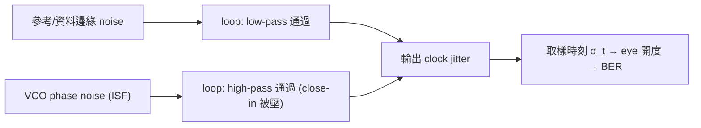

# 從 ISF 到 SerDes clocking

> **先備**：[psd_phase_noise_jitter](/02_foundations/psd_phase_noise_jitter)（$S_\phi$、$\mathcal{L}$、四種 jitter 方言與 phase↔time 換算）、[tank_swing](/06_design_insights/tank_swing)（$\mathcal{L}\propto\Gamma_{rms}^2/q_{max}^2$ 決定 VCO 自身 noise）、[lc_vs_ring](/06_design_insights/lc_vs_ring)（累積 jitter $\sigma_{\Delta t}=\kappa\sqrt{\Delta t}$ 與 LC/ring 取捨）｜ **接下來**：[pll_noise_budget](/06_design_insights/pll_noise_budget)、[exercises](/06_design_insights/exercises)

這是整個 06 章的**收束頁**：把前面講的 ISF / phase noise 一路接到 **SerDes（serializer/deserializer，
高速串列收發）**設計師每天在看的東西——**clock jitter（時脈抖動）、eye opening（眼圖開度）、
BER（bit error rate，位元錯誤率）**。我們會逐步推導 phase→time 的兩條換算，講清楚積分頻寬怎麼選、
RJ/DJ 的差別，以及為什麼 CDR/PLL 會像一個 high-pass filter（高通濾波器）把 VCO 的 close-in
noise 濾掉——這解釋了為什麼「同一顆 VCO 在不同 loop 下表現天差地遠」。

> **物理直覺（先講結論）**：oscillator 的 phase noise 是「相位在抖」；SerDes 在意的是「**邊緣
> 在時間軸上抖多少**」與「**取樣時刻落在眼睛中央的機率**」。相位抖 → 時間抖（$\Delta t=\Delta\phi/2\pi f_0$）
> → 取樣點偏離眼中央 → 眼變窄 → BER 變差。但不是所有頻率的 phase noise 都有害：CDR/PLL 會**追隨**
> 慢的相位漂移（low-frequency noise 被 loop 吃掉），只剩**快的、loop 追不上的** noise 變成 jitter。
> 所以「積分頻寬」與「loop bandwidth」是 SerDes clocking 的兩個核心旋鈕。

## 第 1 步：phase → time（單一相位誤差）

oscillator 的 excess phase $\Delta\phi$ 怎麼變成 edge 的時間誤差？一個週期 $T=1/f_0$ 對應
$2\pi$ rad 的相位，所以相位與時間成正比（[notation](/00_overview/notation) 對應公式 17）：

$$
\boxed{\ \Delta t=\frac{\Delta\phi}{2\pi f_0}\ }
$$

**逐步推導**：訊號 $V=A\cos(2\pi f_0 t+\phi)$。把 $\phi$ 的擾動 $\Delta\phi$ 看成時間平移 $\Delta t$：
要讓 $2\pi f_0(t+\Delta t)=2\pi f_0 t+\Delta\phi$，解出 $2\pi f_0\,\Delta t=\Delta\phi$，即

$$
\Delta t=\frac{\Delta\phi}{2\pi f_0}.
$$

- **Dimension check**：$[\text{rad}]/[\text{rad/s}]=[\text{s}]$ ✓（$2\pi f_0$ 單位是 rad/s，不是 Hz）。
- **手感（5 GHz）**：1 mrad → 31.8 fs；1 rad → 31.8 ps（= 約 $T/6.28$，合理）。

## 第 2 步：phase PSD → rms jitter（要積分）

單一 $\Delta\phi$ 沒用——jitter 是**所有頻率的相位 noise 的總和**。先把 phase variance 從
phase PSD 積出來（公式 18）：

$$
\sigma_\phi^2=\int_{f_1}^{f_2}S_\phi(f)\,df
$$

再用第 1 步把 rms phase 換成 rms time（公式 19）：

$$
\boxed{\ \sigma_t=\frac{\sigma_\phi}{2\pi f_0}=\frac{1}{2\pi f_0}\sqrt{\int_{f_1}^{f_2}S_\phi(f)\,df}\ }
$$

**逐步說明每一步**：

1. **為何積分**：$S_\phi(f)$ 是「每 Hz 的相位功率」(rad²/Hz)。各 offset 頻率的相位抖動是**獨立**的，
   功率相加 → 對 $f$ 積分得總相位變異 $\sigma_\phi^2$（rad²）。
2. **dimension check**：$[\text{rad}^2/\text{Hz}]\cdot[\text{Hz}]=[\text{rad}^2]$ ✓ → 開根號得 rad。
3. **換成時間**：除以 $2\pi f_0$（rad/s）→ s。
4. **與量測接軌**：相位雜訊儀給的是 $\mathcal{L}(f)$（dBc/Hz），用小角近似 $S_\phi=2\cdot10^{\mathcal{L}/10}$
   （單邊 → 雙邊的 factor 2，公式 16），把 $\mathcal{L}$ 換成 $S_\phi$ 再積。

下圖示範由 $\mathcal{L}(f)$ 積分得 rms jitter（5 GHz、$-100$ dBc/Hz @ 1 MHz、1/f²、積 1→100 MHz）：


> 此圖**非 toy model**（是標準 SerDes jitter 積分流程）。完整 script：`simulations/lab_08_jitter_integration.py`。
> 數值積分與解析閉式完全一致。

## 第 3 步：數值例子（canonical 例 C）

> $f_0=5$ GHz、$\mathcal{L}(1\text{MHz})=-100$ dBc/Hz、1/f² 斜率、積分 1→100 MHz。

- **dBc/Hz→$S_\phi$**：$\mathcal{L}=-100$ dBc/Hz $\Rightarrow10^{-10}$；$S_\phi(1\text{MHz})=2\times10^{-10}$ rad²/Hz。
- **1/f² 形狀**：$S_\phi(f)=2\times10^{-10}(10^6/f)^2$。
- **積分**：$\sigma_\phi^2=2\times10^{-10}(10^6)^2\int_{10^6}^{10^8}f^{-2}df=200(10^{-6}-10^{-8})=1.98\times10^{-4}$ rad²
  → $\sigma_\phi=14.07$ mrad。
- **換成 jitter**：$\sigma_t=\dfrac{14.07\times10^{-3}}{2\pi\cdot5\times10^9}=447.9$ fs。

**手感重點**：1/f² 的積分由**下限 $f_1$ 主導**（$1/f_1$ 項最大）——所以「從哪裡開始積」極關鍵，
這正是下面要講的「積分頻寬」與「CDR high-pass」的意義。完整口算見 [numerical_feeling](/04_simulation_labs/numerical_feeling) 例 3。

## 第 4 步：jitter 怎麼吃掉 eye opening 與 BER

SerDes 接收端在每個 bit 中央取樣（sample）。設 bit 週期（UI，unit interval，單位區間）為 $T_b$。
取樣時刻的 timing 抖動 $\sigma_t$ 直接從兩側「吃進」眼睛的水平開度。對只有 **RJ（高斯）** 的情形，
在離 eye 中央偏移 $t$ 處取樣的 BER 是一條 **bathtub（浴缸曲線）**（規範 §10.2，標準 SerDes 模型）：

$$
\text{BER}(t)=\frac{1}{2}\left[Q\!\left(\frac{\text{UI}/2-t}{\sigma_t}\right)+Q\!\left(\frac{\text{UI}/2+t}{\sigma_t}\right)\right],\qquad
Q(x)=\frac{1}{2}\,\mathrm{erfc}\!\left(\frac{x}{\sqrt2}\right)
$$

- **怎麼讀**：兩個 $Q$ 項分別是「左邊緣（在 $-\text{UI}/2$）抖到取樣點右側」與「右邊緣（在 $+\text{UI}/2$）
  抖到取樣點左側」造成錯誤的機率。在 eye 正中央 $t=0$ 兩項相等，BER 最低（浴缸底部）。
- **由 BER 反解 eye 開度**：要達到目標 BER（例 $10^{-12}$），在底部 $t=0$ 附近單側 margin 需
  $\text{UI}/2-Q^{-1}(\text{BER})\cdot\sigma_t > 0$。記 $Q^{-1}(10^{-12})\approx7.03$，所以：

- **eye 水平開度**（單側）$\approx0.5\,\text{UI}-(\text{對側 ISI})-Q^{-1}(\text{BER})\cdot\sigma_t$，其中 $Q^{-1}(\text{BER})$ 是
  目標 BER 對應的高斯 Q 反函數值（例 BER $=10^{-12}$ → $Q^{-1}\approx7.03$，total RJ 約 $14\sigma_t$ peak-to-peak）。
- **直覺**：RJ 是高斯、無上界，所以越嚴的 BER（越小機率）要留越多 margin（$Q$ 越大）。
  $\sigma_t$ 每增加，眼睛兩側各被啃掉 $\sim Q\sigma_t$。
- **數量級**：上例 $\sigma_t=448$ fs；在 $f_0=5$ GHz、若資料率 10 Gb/s（$T_b=100$ ps），
  BER $10^{-12}$ 的 RJ 開銷 $\approx14\times448\,\text{fs}=6.3$ ps $=0.063$ UI——**單從 clock RJ 就吃掉 6.3% 的眼**。
  這就是為什麼高速鏈路對 VCO phase noise 如此敏感。

> ⚠️ eye/BER 的 $Q$ 值、$0.5$ UI 開度模型是 **標準 SerDes / 通訊知識（不在下載的 5 篇 PDF 內，
> 以標準文獻補充，如 dual-Dirac jitter model、OIF-CEI、Razavi）**。[P1]/[P2] 給的是 phase noise/jitter
> 本身，不展開 link budget。

## 第 5 步：RJ / DJ / accumulated jitter 的差別

SerDes 量到的「jitter」其實是好幾種疊起來的，**處理方式完全不同**（見 [notation](/00_overview/notation) 的「四種方言」）：

| 種類 | 來源 | 統計 | 怎麼算進 BER |
|---|---|---|---|
| **RJ（random jitter）** | oscillator phase noise、thermal | 高斯、無上界，用 $\sigma$ | peak-to-peak $\approx2Q\sigma_t$；BER 越嚴 margin 越大 |
| **DJ（deterministic jitter）** | ISI、duty-cycle distortion、串擾、PSIJ | 有上界，用 peak-to-peak | 直接相加（bounded），不隨 BER 放大 |
| **period jitter** | 單週期長度偏差 $T_k-T$ | — | clock 內部規格 |
| **cycle-to-cycle** | 相鄰週期差 $T_{k+1}-T_k$ | — | 對 PLL 穩定性敏感 |
| **accumulated / long-term** | free-running 漂移，$\sigma_{\Delta t}=\kappa\sqrt{\Delta t}$ | random walk | open-loop 才有；CDR/PLL 鎖定後被抑制 |

- **total jitter（TJ）@ BER**：$\text{TJ}=\text{DJ}_{pp}+2Q(\text{BER})\cdot\text{RJ}_{rms}$（dual-Dirac 近似）。
- **ISF 直接管的是 RJ 與 accumulated jitter**（它們源自 phase noise）；DJ 多半是 link/pattern 問題，ISF 看不見。

## 第 6 步：CDR / PLL 對 VCO phase noise 的 high-pass filtering（關鍵）

這是整頁最重要的觀念，也是「為什麼 free-running 的 $\sigma_{\Delta t}=\kappa\sqrt{\Delta t}$
在實務上不會無限長大」的答案。

- 把 VCO 放進 PLL（鎖到乾淨參考）或 CDR（鎖到資料邊緣），loop 會**追隨**VCO 的慢相位漂移：
  只要漂移夠慢（offset 頻率低於 loop bandwidth $f_{BW}$），loop 就把它修掉。
- 結果是 **VCO 自身的 phase noise 經歷一個 high-pass 轉移函數**：

$$
\big|H_{VCO\to out}(f)\big|^2\approx\frac{f^2}{f^2+f_{BW}^2}\quad\Rightarrow\quad\begin{cases}\text{低於}f_{BW}:\text{被壓掉（loop 追上）}\\ \text{高於}f_{BW}:\text{原樣通過}\end{cases}
$$

- 相對地，**參考時脈（或 CDR 的輸入資料邊緣）的 noise 經歷 low-pass**：低頻原樣通過、高頻被濾掉。
- **設計後果**：
  - **積分下限 $f_1$ 應取 loop bandwidth 附近**（不是 DC）——因為低於 $f_{BW}$ 的 VCO noise 已被 loop 吃掉。
    這直接回答「積分頻寬怎麼選」：closed-loop jitter 積分由 $f_{BW}$ 積到 $f_2$（Nyquist 或資料率半）。
  - **accumulated jitter 被截斷**：free-running 的 random walk（$\propto\sqrt{\Delta t}$，能量在極低頻）
    正好落在 high-pass 的阻帶 → 被抑制成有界的 tracking error。所以鎖定後不再無限漂。
  - **loop bandwidth 是取捨**：$f_{BW}$ 拉高→濾掉更多 VCO close-in noise（好），但讓更多參考/輸入 noise
    與 loop 自身 noise 通過（壞）。最佳 $f_{BW}$ 在 VCO noise 與 reference noise 兩條曲線的交點附近。



> ⚠️ PLL/CDR 的 high-pass/low-pass 轉移函數是 **標準 PLL 理論（不在下載的 5 篇 PDF 內，以標準文獻補充，
> 如 Gardner, Razavi, Best）**。[P1]/[P2] 是 open-loop oscillator 的 phase noise 理論；本段是把它接到
> closed-loop clocking 的橋。TODO: manual verification needed，若要精確的 loop transfer function（含 charge-pump、
> loop filter 階數）請查 PLL 標準文獻。

## 第 7 步：TX PLL / RX PLL / LC-VCO / ring-VCO 實務直覺

| 場景 | 直覺 | 選 LC 還是 ring？ |
|---|---|---|
| **TX PLL**（產生發送 clock） | 直接決定發送 jitter；通常窄 loop BW（吃掉 ref noise），所以 **VCO close-in noise 重要** | 高速 lane 用 **LC-VCO**（低 phase noise）；對 jitter 要求嚴 |
| **RX CDR**（從資料恢復 clock） | loop BW 由資料/jitter tolerance 決定；high-pass 掉 VCO close-in | 常用 **ring-VCO**（寬調諧、多相位、面積小，且 close-in 被 CDR 濾掉，較不致命） |
| **LC-VCO** | 低 $\Gamma_{rms}/q_{max}$、低 phase noise、慢漂移；面積大、調諧窄 | TX、reference、高效能 |
| **ring-VCO** | phase noise 較差、jitter 快累積；但寬調諧、天生多相位、小面積；放進快 loop 後 close-in 被抑制 | RX CDR、低功耗/面積敏感、多相位需求 |

- **核心取捨**：ring 的弱點（close-in 1/f³、快 random walk）正好落在 loop 的 high-pass 阻帶——
  **如果 loop bandwidth 夠寬，ring-VCO 的 close-in 缺點被大量補償**。這就是為什麼許多 RX CDR 用 ring 而不用 LC。
- 反之 TX PLL 為了濾掉 reference 的 spur 常用窄 loop，VCO close-in 直接出現在輸出 → 偏好 LC。

## 規範要求的 10 個 design 問題 — 總表（含跨頁連結）

| # | 問題 | 一句話答案 | 詳見 |
|---|---|---|---|
| 1 | symmetry 為何影響 flicker upconversion？ | 只有 ISF 的 $c_0$ 上轉 flicker；對稱波形 $c_0\to0$ | [symmetry](/06_design_insights/symmetry) |
| 2 | swing 為何降 phase sensitivity？ | $\mathcal{L}\propto1/q_{max}^2$，$q_{max}=CV_{max}$；swing 加倍 → −6 dB | [tank_swing](/06_design_insights/tank_swing) |
| 3 | slope 小的地方注入為何危險？ | $\Gamma\propto1/\dot V$；斜率小→$\vert \Gamma\vert $ 大→相位敏感 | [waveform_slope](/06_design_insights/waveform_slope) |
| 4 | LC vs ring 怎麼比？ | LC 高 $Q$/大 $q_{max}$/低 noise；ring 多 device/ISF 集中 transition；固定 $f_0$/P 下 ring ~與 $N$ 無關 | [lc_vs_ring](/06_design_insights/lc_vs_ring) |
| 5 | ISF 與 jitter 的關聯？ | $\Gamma_{rms}^2/q_{max}^2$ 同時定 phase noise 與 $\kappa$（$\sigma_{\Delta t}=\kappa\sqrt{\Delta t}$） | [lc_vs_ring](/06_design_insights/lc_vs_ring)、本頁 §2 |
| 6 | phase noise 怎麼積分換 jitter？ | $\sigma_t=\frac{1}{2\pi f_0}\sqrt{\int_{f_1}^{f_2}S_\phi df}$；1/f² 由下限主導 | 本頁 §2–3、[numerical_feeling](/04_simulation_labs/numerical_feeling) |
| 7 | 改 $\Gamma_{rms}$ 的 knobs？ | 波形對稱、快邊緣、差動、cyclostationary $\alpha$ 對齊、ring $N\uparrow$ | [device_noise_mapping](/06_design_insights/device_noise_mapping) |
| 8 | 改 $q_{max}$ 的 knobs？ | 加 swing $V_{max}$、提高 tank $Q$/$R_p$、differential、推到 headroom | [tank_swing](/06_design_insights/tank_swing) |
| 9 | 怎麼降 white-noise（1/f²）phase noise？ | 降 $\Gamma_{rms}$、加 $q_{max}$、降 $S_i$（[P1] Eq.21） | [tank_swing](/06_design_insights/tank_swing)、[device_noise_mapping](/06_design_insights/device_noise_mapping) |
| 10 | 怎麼降 flicker close-in（1/f³）？ | 降 $c_0$（對稱/差動/duty 50%/$\alpha$ 對齊）、降 device $\omega_{1/f}$、靠 loop high-pass | [symmetry](/06_design_insights/symmetry)、本頁 §6 |

## 適用與失效條件

| 條件 | 成立時 | 失效時 |
|---|---|---|
| 小角近似 $\mathcal{L}\approx\frac12 S_\phi$ | $\sigma_\phi\ll1$ rad | 大相位抖動（接近 1 rad）時 SSB↔PSD 偏離 |
| RJ 高斯、與 DJ 獨立 | dual-Dirac TJ 模型有效 | RJ 非高斯、jitter 相關時要 jitter decomposition |
| loop transfer 為一階 high-pass | 直覺估積分下限 $\approx f_{BW}$ | 高階 loop、peaking 時要完整 transfer function |
| open-loop ISF 理論 | 算 VCO 自身 phase noise | closed-loop 要把 loop filtering 疊上去 |

## Worked examples 數值例題

以下兩題把本頁兩個核心動作算清楚：(1) 由 $\sigma_t$ 用 Q 函數算 **BER bathtub 開口**（UI=100 ps）；
(2) **積分頻寬選擇**——下限取 DC vs 取 loop bandwidth，jitter 差多少。沿用 canonical：
$f_0=5$ GHz、$\mathcal{L}(1\text{MHz})=-100$ dBc/Hz、1/f² 斜率、例 C 得 $\sigma_t=447.9$ fs。

> **例 1（由 $\sigma_t$ 算 BER bathtub 開口，UI=100 ps）**
> 資料率 10 Gb/s → UI $=100$ ps。clock RJ $\sigma_t=448$ fs（例 C，假設無 ISI/DJ）。求：
> (a) eye 正中央 $t=0$ 的 BER；(b) 要保證 BER $\le10^{-12}$，bathtub 的水平開口（eye opening）多寬。

**逐步代入（帶單位）**。先算「中央到邊緣」相對 $\sigma_t$ 有幾個 $\sigma$：

$$
\begin{aligned}
\frac{\text{UI}/2}{\sigma_t}&=\frac{100\ \text{ps}/2}{0.448\ \text{ps}}=\frac{50}{0.448}=111.6, \\[4pt]
\text{(a)}\quad\text{BER}(0)&=\frac12\big[Q(111.6)+Q(111.6)\big]=Q(111.6)\;\approx\;0
\;(\ll10^{-300},\ \text{遠超浮點下限}).
\end{aligned}
$$

(b) 開口由「離中央多遠時 BER 升到 $10^{-12}$」決定。$Q^{-1}(10^{-12})\approx7.03$，所以單側可容忍偏移
$t_{edge}$ 滿足 $(\text{UI}/2-t_{edge})/\sigma_t=7.03$：

$$
\begin{aligned}
t_{edge}&=\frac{\text{UI}}{2}-7.03\,\sigma_t=50\ \text{ps}-7.03\times0.448\ \text{ps}=50-3.15=46.85\ \text{ps}, \\[4pt]
\text{eye 水平開口}&=2\,t_{edge}=2\times46.85\ \text{ps}=93.7\ \text{ps}=0.937\ \text{UI}.
\end{aligned}
$$

- **結果**：(a) 中央 BER 天文數字地小（$\sigma_t$ 只佔半 UI 的 $1/112$）；(b) BER $10^{-12}$ 的
  bathtub 開口 $\approx93.7$ ps $=0.937$ UI——亦即 **clock RJ 從兩側各啃掉 $7.03\sigma_t\approx3.15$ ps、
  合計 $\approx6.3$ ps $=0.063$ UI**。與第 4 步「448 fs RJ ≈ 0.063 UI」一致。
- **Dimension check**：$Q$ 的引數 $\dfrac{[\text{s}]}{[\text{s}]}$ 無因次 ✓；開口 $[\text{s}]$、除以 UI $[\text{s}]$ 得 UI 數（無因次）✓。
- **一行 Python 驗證**（引用 `simulations/common/serdes_utils.py` 的真實 `Q`、`ber_bathtub`）：

```python
import numpy as np
from simulations.common.serdes_utils import Q, ber_bathtub
ui, sigma_t = 100e-12, 447.9e-15
print("BER(0) =", ber_bathtub(0.0, sigma_t, ui))          # -> ~0 (1e-300 floor)
t_edge = ui/2 - 7.03*sigma_t
print("opening =", 2*t_edge*1e12, "ps =", 2*t_edge/ui, "UI")  # -> 93.7 ps = 0.937 UI
```

> **例 2（積分頻寬選擇：下限取 DC vs 取 loop bandwidth）**
> 同一顆 VCO（例 C 的 1/f² skirt，$S_\phi(f)=2\times10^{-10}(10^6/f)^2$ rad²/Hz），上限 $f_2=100$ MHz。
> 比較「open-loop 從 $f_1=10$ kHz 積」與「closed-loop 從 loop bandwidth $f_1=1$ MHz 積」的 rms jitter。
> 這正是「為什麼 CDR/PLL 的 high-pass 讓 jitter 變小」的數值版。

**逐步代入（帶單位）**。1/f² 的 phase variance 積分有閉式
$\sigma_\phi^2=S_\phi(f_{ref})f_{ref}^2\big(\tfrac{1}{f_1}-\tfrac{1}{f_2}\big)$，這裡 $S_\phi(f_{ref})f_{ref}^2=2\times10^{-10}\times(10^6)^2=2\times10^{2}$：

$$
\begin{aligned}
\text{(open-loop, }f_1=10\ \text{kHz)}:\quad
\sigma_\phi^2&=2\times10^{2}\left(\frac{1}{10^4}-\frac{1}{10^8}\right)=200\times(10^{-4}-10^{-8})\approx2.0\times10^{-2}\ \text{rad}^2 \\[2pt]
&\Rightarrow\ \sigma_\phi=0.1413\ \text{rad},\quad
\sigma_t=\frac{0.1413}{2\pi\times5\times10^9}=4.50\times10^{-12}\ \text{s}=4.50\ \text{ps}, \\[6pt]
\text{(closed-loop, }f_1=1\ \text{MHz)}:\quad
\sigma_\phi^2&=2\times10^{2}\left(\frac{1}{10^6}-\frac{1}{10^8}\right)=200\times9.9\times10^{-7}=1.98\times10^{-4}\ \text{rad}^2 \\[2pt]
&\Rightarrow\ \sigma_\phi=14.07\ \text{mrad},\quad
\sigma_t=447.9\ \text{fs}\quad(\text{即例 C}).
\end{aligned}
$$

- **結果**：把積分下限從 10 kHz（open-loop）提到 1 MHz（loop BW）→ rms jitter 從 **4.50 ps 降到 448 fs**
  （降約 $10\times$）。因為 1/f² 的 jitter 由**下限 $1/f_1$ 主導**，loop 的 high-pass 砍掉 $f < f_{BW}$ 的
  VCO close-in noise，等效於把積分下限抬到 $f_{BW}$——這就是「積分頻寬怎麼選」的量化答案：
  **closed-loop jitter 由 $f_{BW}$ 積到 $f_2$**。
- **Dimension check**：$[\text{rad}^2/\text{Hz}]\cdot[\text{Hz}^2]\cdot[\text{1/Hz}]=[\text{rad}^2]$ ✓；
  $[\text{rad}]/[\text{rad/s}]=[\text{s}]$ ✓。
- **一行 Python 驗證**（引用 `simulations/common/noise_utils.py`）：

```python
import numpy as np
from simulations.common.noise_utils import leeson_one_over_f2, integrate_rms_jitter
for f1 in (1e4, 1e6):
    f = np.logspace(np.log10(f1), 8, 6000)
    L = leeson_one_over_f2(f, L_ref_dbc=-100, f_ref=1e6)
    st, sp = integrate_rms_jitter(f, L, f0=5e9, fmin=f1, fmax=100e6)
    print(f"f1={f1:.0e}: sigma_t = {st*1e15:.1f} fs")
# f1=1e+04: sigma_t = ~4500 fs ; f1=1e+06: sigma_t = 447.9 fs
```

> 例 1 的 BER/Q 模型是 **標準 SerDes 知識（不在 5 篇 PDF 內，以標準文獻補充，如 dual-Dirac、OIF-CEI）**；
> 例 2 的 loop high-pass 截斷是 **標準 PLL 理論（不在 5 篇 PDF 內）**。phase noise/jitter 本身來自 [P1]/[P2]。

## 重點回顧

- $\Delta t=\Delta\phi/(2\pi f_0)$；$\sigma_t=\frac{1}{2\pi f_0}\sqrt{\int_{f_1}^{f_2}S_\phi df}$（1/f² 由積分下限主導）。
- 例 C：$-100$ dBc/Hz @ 1 MHz、5 GHz、1/f²、1→100 MHz → $\sigma_\phi=14.07$ mrad、$\sigma_t=447.9$ fs。
- jitter 從兩側吃 eye：$\sim Q\sigma_t$/側；10 Gb/s、BER $10^{-12}$ 時 448 fs RJ ≈ 0.063 UI。
- RJ（高斯，源自 phase noise，ISF 管）vs DJ（有界，ISI/串擾，ISF 看不見）；TJ $=$ DJ$_{pp}+2Q\cdot$RJ$_{rms}$。
- CDR/PLL 對 VCO noise 是 **high-pass**：close-in/accumulated jitter 被壓 → 積分下限取 $\approx f_{BW}$。
- 實務：TX PLL 偏好 LC-VCO（close-in 重要）；RX CDR 常用 ring-VCO（close-in 被 loop 濾掉）。

## 延伸閱讀

- jitter 種類與 PSD：[psd_phase_noise_jitter](/02_foundations/psd_phase_noise_jitter)
- 口算練習：[numerical_feeling](/04_simulation_labs/numerical_feeling)
- LC vs ring 與累積 jitter：[lc_vs_ring](/06_design_insights/lc_vs_ring)
- 各 design 旋鈕：[symmetry](/06_design_insights/symmetry)、[waveform_slope](/06_design_insights/waveform_slope)、[tank_swing](/06_design_insights/tank_swing)、[device_noise_mapping](/06_design_insights/device_noise_mapping)
- 符號與單位：[notation](/00_overview/notation)
