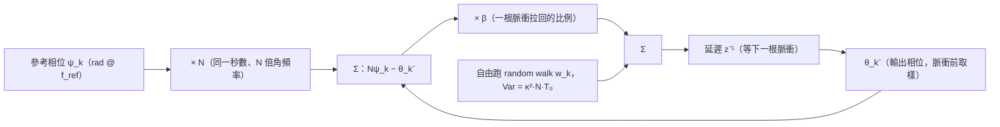

import NumericQuiz from "@site/src/components/NumericQuiz";
import SubharmonicInjectionExplorer from "@site/src/components/SubharmonicInjectionExplorer";

# Subharmonic injection：從 impulse-train 到 ×N 倍頻（ILCM／ILFM）

> **先備**：[paper_003](/05_paper_deep_dives/paper_003_injection_locking_part1)（[P3] Sec. IV 脈衝列 Eq.(19)–(23)、廣義 Adler）、[paper_004](/05_paper_deep_dives/paper_004_injection_locking_part2)（[P4] Eq.(28)–(30) 的 M:N 時間同步平均）、[injection_locked_division](/06_design_insights/injection_locked_division)（對偶的另一半：除頻靠 ISF 第 $N$ 諧波）、[injection_locking_noise](/06_design_insights/injection_locking_noise)（鎖定振盪器＝一階 PLL，corner $=-\Omega'(\theta_{ss})$）｜**接下來**：[lab_40_subharmonic_injection](/04_simulation_labs/lab_40_subharmonic_injection)（獨立模擬）、[sampling_pll](/06_design_insights/sampling_pll)、[clock_chain_budget](/06_design_insights/clock_chain_budget)

> **這頁要回答什麼**：
> 1. 把 $f_{ref}$ 的脈衝打進一顆跑在 $f_0=N f_{ref}$ 的振盪器，為什麼能鎖？靠**誰**的諧波？為什麼**純正弦**的 $f_0/N$ 鎖不住？
> 2. lock range 為什麼 $\propto 1/N$？[P4] 的 Fourier 平均與 [P3] 的脈衝列算術這兩條路怎麼**逐項對上**？
> 3. 每一根脈衝把相位「拉回」多少——realignment factor $\beta$ 是什麼、由什麼決定、多大才穩、幾根脈衝才收斂？
> 4. 鎖定後的相位雜訊怎麼記帳：參考 $\times N^2$、自身雜訊被一階**離散時間**迴路整形、輸出 jitter 的閉式、reference spur 從哪來？
> 5. 設計旋鈕：脈衝寬度、ring vs LC、$N$、$\beta$；ILCM 跟經典 PLL、sub-sampling PLL 怎麼比？

> **物理直覺（先講結論）**：injection-locked clock multiplier（ILCM，注入鎖定時脈倍頻器）不是「乘法電路」，
> 是一顆本來就跑在 $f_0\approx N f_{ref}$ 的振盪器，**每 $N$ 個自己的週期被參考脈衝踢一下**。踢一下＝吃一個
> ISF kick $\Delta\phi=\tilde\Gamma(\theta)\,q_{inj}$；兩根脈衝之間振盪器自由跑、相位隨失諧漂移、隨雜訊
> random walk。鎖定＝每根脈衝的 kick 剛好吃掉這 $N$ 個週期欠的相位；雜訊抑制＝每根脈衝把累積的
> 隨機相位「拉回」一個比例 $\beta$。**鎖得住靠的是注入波形自己的第 $N$ 諧波**（因為振盪器 ISF 的基頻
> 只聽得到 $f_0$ 附近的東西）——這正是除頻器（ILFD）的鏡像：除頻靠 ISF 的諧波、倍頻靠注入的諧波。

> **本頁定位**：進階設計頁。[P3] Sec. IV（p.2112）與 [P4] Sec. IV（p.2129）的原文、方程、註腳已重新放大 PDF
> 逐字核對（第 0 節）。**[P4] 只把 superharmonic（$M=1$，正弦注入在 $N\omega_{osc}$）的閉式 Eq.(30) 寫出來；
> subharmonic（倍頻）那一側論文只給一般敘述與 footnote 10**——本頁從 Eq.(29) 自行逐步推出倍頻版閉式、
> 從 [P3] Sec. IV 的離散算術推出 $1/N$ 與 realignment factor，並把兩條路對帳。第 4 節「把雜訊放進離散迴路」
> 是教科書級的 ILCM／realignment 標準結果（**外部文獻，非本站 5 篇 PDF**；文末列出已查證的兩篇經典），
> 本頁自行推導、用本頁腳本的 Monte-Carlo 逐項驗證。所有模型皆為 **phase-only、弱注入的 pedagogical toy**。

---

## 0. 論文原文說了什麼、沒說什麼（逐字核對 [P3] p.2112、[P4] p.2129）

### 0.1 [P3] Sec. IV「Locking to an Impulse Train」（p.2112）

[paper_003](/05_paper_deep_dives/paper_003_injection_locking_part1) 已把這一節逐步教過：理想並聯 LC 吃一列
週期 $T_{inj}\equiv2\pi/\omega_{inj}$、每根倒入固定電荷 $q_{inj}$ 的電流脈衝（Fig. 3(a)；論文約定 $q_{inj}\ge0$，
正負號分別對應 Fig. 3(b) 加速、Fig. 3(c) 減速；圖中 state-space 的脈衝箭頭刻意放大、不按比例）。四條核心式：

$$
\Delta\phi=\pm\frac{q_{inj}}{q_{max}}\ \ (19),\qquad
\frac{\Delta\phi}{2\pi}=-\frac{\Delta T}{T_0}=\frac{\Delta\omega}{\omega_{inj}}\ \ (20),\qquad
\Delta\omega=\frac{\Delta\phi}{T_{inj}}=\pm\frac{1}{T_{inj}}\frac{q_{inj}}{q_{max}}\ \ (21),\qquad
I_{inj}=\frac{2q_{inj}}{T_{inj}}\ \ (23)
$$

正文說：對每個 $q_{inj}$ 都存在一個注入週期 $T_{inj}$，使下一根脈衝永遠落在波形的同一個位置，於是週期被
持續拉長或縮短而振幅永不改變。**這一句話掛著兩個註腳**，都與本頁直接相關：

- **footnote 7**（逐字核對）：注入也可以「every $M$ periods（$M$ 為正整數）……corresponding to subharmonic
  locking」——**這就是本頁的起點**：把「每個週期打一根」改成「每 $N$ 個週期打一根」，論文只給了這一句，
  算術由本頁第 2 節補完。
- **footnote 8**：不再保持振幅的注入（脈衝不打在零交越）留給姊妹論文 [P4] Sec. III-B 處理——即 [P4] 的
  APF／amplitude modulation（[paper_004](/05_paper_deep_dives/paper_004_injection_locking_part2)）。本頁的
  phase-only 模型忽略它，第 3 節會指出它在哪裡咬人。

### 0.2 [P4] Sec. IV「Superharmonic and Subharmonic Injections」（p.2129）

[P4] 把相對相位重新定義為（Eq.(28)，$M,N$ 為互質正整數）

$$
\varphi(t)\equiv\frac{M}{N}\,\omega_{inj}t+\theta(t)
$$

得到廣義 pulling 方程（Eq.(29)）

$$
\frac{d\theta}{dt}=\omega_0-\frac{M}{N}\omega_{inj}+\frac{1}{NT_{inj}}\int_{NT_{inj}}\tilde\Gamma\!\left(\frac{M}{N}\omega_{inj}t+\theta\right)i_{inj}(t)\,dt .
$$

正文接著說這個 $M{:}N$ 框架涵蓋鎖定時 $M\omega_{inj}=N\omega_{osc}$ 的任意有理數比，且用 Fourier 級數
一眼可見鎖定「requires the $M$th-multiple harmonics of the injection to interact with the $N$th-multiple
harmonics of the oscillator's ISF」；並指出相差 $2\pi/N$ 的相對相位不可分辨，故 $\Omega(\theta)$ 的週期為 $2\pi/N$。
然後——**只對 superharmonic 正弦注入**（在第 $N$ 個 superharmonic、振幅 $I_{inj}$）寫出閉式（Eq.(30)）：

$$
\Omega(\theta)=\frac{1}{2}I_{inj}\vert\tilde\Gamma_N\vert\cos\!\big(N\theta+\angle\tilde\Gamma_N\big).
$$

**論文沒有寫出的**：subharmonic（$M\neq1$，倍頻器）的正弦或脈衝閉式。footnote 10 誠實交代原因：$M\neq1$ 時
注入所需的高次諧波常常是振盪器**內部混頻**生出來的，這個非線性現象「not explicitly captured by our
framework」，部分由其參考文獻 [25] 的模型處理（該模型被用來設計 subharmonic injection-locked frequency
multiplier）。所以本頁的做法是：**假設注入波形自己帶足夠的第 $N$ 諧波**（脈衝產生器就是幹這件事的），
這樣 Eq.(29) 的一階平均直接適用，不必依賴框架外的內部混頻。

### 0.3 符號對映（本頁 vs [P4]）

| 量 | [P4] 記法 | 本頁（倍頻 $\times N$） | 說明 |
|---|---|---|---|
| 鎖定關係 | $M\omega_{inj}=N\omega_{osc}$ | $\omega_{osc}=N\omega_{inj}$，即 $M_{[P4]}=N$、$N_{[P4]}=1$ | 本頁的 $N$ 是**倍頻比**（與 [clock_chain_budget](/06_design_insights/clock_chain_budget) 一致） |
| 平均窗 | $N_{[P4]}T_{inj}$ | $T_{inj}=NT_0$ | 一個參考週期＝$N$ 個振盪週期 |
| 相對相位 | $\theta=\varphi-\tfrac{M}{N}\omega_{inj}t$ | $\theta=\varphi-N\omega_{inj}t$ | [rad]，慢變 |
| 失諧 | $\omega_0-\tfrac{M}{N}\omega_{inj}$ | $\Delta\omega_0\equiv\omega_0-N\omega_{inj}$ | 以**輸出**頻率軸計 [rad/s] |
| 有單位 ISF | $\tilde\Gamma$ | $\tilde\Gamma(\theta)=\Gamma(\theta)/q_{max}$ | [rad/C]；$\vert\tilde\Gamma_m\vert=c_m/q_{max}$（[P1] Eq.(12) 的 $c_m$） |
| ISF 對照 | ÷$N$：$\vert\tilde\Gamma_N\vert$ 扛鎖定 | ×$N$：$\vert\tilde\Gamma_1\vert$ 扛鎖定，注入的 $\vert I_N\vert$ 供諧波 | 第 1 節的對偶 |

---

## 1. 路線一：從 [P4] Eq.(29) 推出「倍頻靠注入的第 $N$ 諧波」

**第 1 步（代入 $M_{[P4]}=N$、$N_{[P4]}=1$）**。平均窗變成 $T_{inj}$：

$$
\frac{d\theta}{dt}=\Delta\omega_0+\underbrace{\frac{1}{T_{inj}}\int_{T_{inj}}\tilde\Gamma\big(N\omega_{inj}t+\theta\big)\,i_{inj}(t)\,dt}_{\equiv\ \Omega(\theta)}
$$

單位：$\tilde\Gamma\,i_{inj}$ ＝ rad/C × C/s ＝ rad/s ✓。窗內 ISF 的引數前進 $N\omega_{inj}T_{inj}=2\pi N$（走 $N$ 整圈）、
注入走 1 整圈——[P4] p.2129 的要求「只需各走整數圈」滿足。

**第 2 步（Fourier 展開、逐項平均）**。把兩個週期函數都展開（與 [P1] Eq.(12) 同一展開；注入含 DC）：

$$
\tilde\Gamma(\varphi)=\tilde\Gamma_{dc}+\sum_{m\ge1}\vert\tilde\Gamma_m\vert\cos\!\big(m\varphi+\angle\tilde\Gamma_m\big),\qquad
i_{inj}(t)=I_0+\sum_{k\ge1}\vert I_k\vert\cos\!\big(k\omega_{inj}t+\angle I_k\big)
$$

第 $(m,k)$ 項相乘、積化和差（$\cos A\cos B=\tfrac12[\cos(A-B)+\cos(A+B)]$）：

$$
\begin{aligned}
&\vert\tilde\Gamma_m\vert\vert I_k\vert\cos\!\big(mN\omega_{inj}t+m\theta+\angle\tilde\Gamma_m\big)\cos\!\big(k\omega_{inj}t+\angle I_k\big)\\
&=\frac{\vert\tilde\Gamma_m\vert\vert I_k\vert}{2}\Big[\cos\!\big((mN-k)\omega_{inj}t+m\theta+\angle\tilde\Gamma_m-\angle I_k\big)+\cos\!\big((mN+k)\omega_{inj}t+m\theta+\angle\tilde\Gamma_m+\angle I_k\big)\Big]
\end{aligned}
$$

在一個 $T_{inj}$ 窗上，差頻項走 $(mN-k)$ 整圈、和頻項走 $(mN+k)$ 整圈——**除了 $k=mN$ 的差頻項之外全部精確歸零**
（恆等式，不是近似）。DC×DC 那一項另外存活。於是

$$
\boxed{\ \Omega(\theta)=I_0\,\tilde\Gamma_{dc}+\frac12\sum_{m\ge1}\vert\tilde\Gamma_m\vert\,\vert I_{mN}\vert\cos\!\big(m\theta+\angle\tilde\Gamma_m-\angle I_{mN}\big)\ }
$$

**選擇法則 $k=mN$**：ISF 的第 $m$ 諧波只跟注入的第 $mN$ 諧波配對。這正是 [P4] 那句話在 $M_{[P4]}=N$、$N_{[P4]}=1$
的具體形式——注入的「$N$ 的倍數」諧波 ↔ ISF 的「1 的倍數」（全部）諧波。

**第 3 步（基頻主導 → lock range）**。ISF 的能量多半在 $m=1$（ideal LC 的 $-\sin\theta$ **只有** $m=1$），取 $m=1$：

$$
\boxed{\ \Omega(\theta)\approx\frac12\vert I_N\vert\vert\tilde\Gamma_1\vert\cos\!\big(\theta+\angle\tilde\Gamma_1-\angle I_N\big),\qquad
\omega_L=\frac12\vert I_N\vert\,\vert\tilde\Gamma_1\vert\ }
$$

dimension check：A × rad/C ＝ rad/s ✓。跟 [P4] Eq.(30) 的 $\omega_L=\tfrac12 I_{inj}\vert\tilde\Gamma_N\vert$ 並排看，
**下標交換了位置**：

| | 除頻 ÷$N$（[P4] Eq.(30)，已核實） | 倍頻 ×$N$（本頁由 Eq.(29) 推出） |
|---|---|---|
| 誰供諧波 | 振盪器 ISF 的 $\vert\tilde\Gamma_N\vert$ | 注入波形的 $\vert I_N\vert$ |
| 誰只要基頻 | 注入：$I_{inj}\cos(\omega_{inj}t)$ 即可 | ISF：只用到 $\vert\tilde\Gamma_1\vert$ |
| lock range | $\tfrac12 I_{inj}\vert\tilde\Gamma_N\vert$ | $\tfrac12\vert I_N\vert\vert\tilde\Gamma_1\vert$ |
| 鎖定相位簡併 | $N$ 個相距 $2\pi/N$ 的相位不可分辨 | $\Omega(\theta)$ 週期 $2\pi$：**鎖定相位唯一** |
| 純正弦注入 | 可以（諧波由 ISF 出） | **一階內鎖不住**（$\vert I_N\vert=0$，$N\ge2$） |

**第 4 步（純正弦鎖不住——這一頁最重要的一句）**。$i_{inj}=I_{inj}\cos(\omega_{inj}t)$ 只有 $k=1$；$N\ge2$ 時
$\vert I_N\vert=0$ ⟹ $\Omega(\theta)\equiv0$（一階）⟹ **沒有恢復力、沒有 lock range**。實際電路裡若把純正弦
$f_0/N$ 打進去仍偶爾鎖得住，那是振盪器自己的非線性把 $f_{ref}$ 混出 $N$ 次諧波（[P4] footnote 10 明說這在框架外）。
設計上的正解是**別指望振盪器替你生諧波**：用 pulse generator（或邊緣觸發的窄脈衝）把 $\vert I_N\vert$ 做出來，
讓一階理論直接適用——第 5.1 節算脈衝寬度怎麼決定 $\vert I_N\vert$。

**第 5 步（本站推論：DC 項是誰）**。單極性脈衝列有 DC：$I_0=q_{inj}/T_{inj}\neq0$。若 ISF 不對稱（$\tilde\Gamma_{dc}=(c_0/2)/q_{max}\neq0$，
就是 [P1] Eq.(23)–(24) 把 $1/f$ 上轉成 $1/f^3$ 的同一個 $c_0$），$\Omega(\theta)$ 多一個**與 $\theta$ 無關的常數頻移**
$I_0\tilde\Gamma_{dc}$——它不幫鎖定，只把 lock range 的中心搬走。toy 數字：$q_{inj}=50$ fC、$T_{inj}=4$ ns ⟹ $I_0=12.5\ \mu$A；
site 不對稱 toy $\Gamma=\cos\theta+0.3$ 的 $c_0/2=0.3$、$q_{max}=1$ pC ⟹ $I_0\tilde\Gamma_{dc}=12.5\times10^{-6}\times0.3/10^{-12}=3.75\times10^{6}$ rad/s
＝ **597 kHz** 的靜態頻移（單位：A × rad/C ＝ rad/s ✓）。推論：脈衝**幅度**若慢慢飄（$q_{inj}$ 的低頻雜訊），
會經 $c_0$ 變成頻率雜訊——跟 $1/f$ 上轉是同一扇門。ideal LC 的 $c_0=0$，這一項為零。

---

## 2. 路線二：impulse train 每 $N$ 個週期打一根（[P3] Sec. IV ＋ footnote 7）

**Setup**：$i_{inj}(t)=q_{inj}\sum_k\delta(t-kT_{inj})$，$T_{inj}=NT_0$。令 $\theta_k$ ＝ 第 $k$ 根脈衝抵達瞬間的相對相位。

**第 1 步（一根脈衝的 kick）**：[P1] 操作型定義 $\Delta\phi=\Gamma(\theta)\Delta q/q_{max}=\tilde\Gamma(\theta)\,q_{inj}$ [rad]。
（[P3] Eq.(19) 是 $\Gamma=-\sin$、打在零交越 $\vert\Gamma\vert=1$ 的特例。）

**第 2 步（兩根脈衝之間的漂移）**：自由跑 $d\theta/dt=\Delta\omega_0$，累積 $N$ 個週期：$\Delta\omega_0\,T_{inj}=\Delta\omega_0\,NT_0$ [rad]。
這是與 [P3] Sec. IV（$N=1$）唯一的差別——**欠的相位乘了 $N$，補的 kick 沒變**。

**第 3 步（per-pulse map 與固定點）**：

$$
\boxed{\ \theta_{k+1}=\theta_k+\Delta\omega_0\,NT_0+q_{inj}\,\tilde\Gamma(\theta_k)\ }
$$

鎖定＝固定點 $\theta_{k+1}=\theta_k=\theta_{ss}$：

$$
q_{inj}\,\tilde\Gamma(\theta_{ss})=-\Delta\omega_0\,NT_0
$$

左邊是「一根脈衝補的相位」、右邊是「$N$ 個週期欠的相位」。固定點存在 ⟺ 右邊在左邊的值域內：

$$
\boxed{\ \vert\Delta\omega_0\vert\le\Delta\omega_L=\frac{q_{inj}\,\vert\tilde\Gamma\vert_{max}}{NT_0}\ \xrightarrow{\ \Gamma=-\sin\ }\ \frac{q_{inj}}{q_{max}}\cdot\frac{1}{NT_0}=\frac{q_{inj}}{q_{max}}\cdot\frac{f_0}{N}\ }
$$

dimension check：rad/C × C ÷ s ＝ rad/s ✓；$N=1$ 退回 [P3] Eq.(21) ✓。**$\Delta\omega_L\propto1/N$**：同一根脈衝要替 $N$ 倍長的
時間買單。分數 lock range 是 $\Delta f_L/f_0=(q_{inj}/q_{max})/(2\pi N)$。

> **例 1（canonical）**：$f_0=5$ GHz（$T_0=200$ ps）、$q_{max}=1$ pC、$N=20$（$f_{ref}=250$ MHz、$T_{inj}=4$ ns）、$q_{inj}=50$ fC。
> 1. kick 預算：$q_{inj}/q_{max}=0.05$ rad（弱注入 $\ll1$ ✓；精確式 $2\sin^{-1}(0.025)=0.05003$，差 $5\times10^{-5}$）。
> 2. $\Delta\omega_L=0.05/(4\times10^{-9}\ \text{s})=1.25\times10^{7}$ rad/s ⟹ $\Delta f_L=1.989$ MHz。
> 3. 分數 lock range $=0.05/(2\pi\times20)=3.98\times10^{-4}$ ＝ **398 ppm**——比 PVT 造成的自由跑頻率不確定度（百分級）
>    小兩個數量級。這就是為什麼真實 ILCM 幾乎都配一個頻率追蹤迴路（FLL），第 5.4 節回來談。
> 4. 一行 Python：`50e-15/1e-12/(20*200e-12)/(2*3.141592653589793)/1e6` → $1.989$。

**第 4 步（兩條路線對帳——必須恰好相等）**。δ 列的 Fourier 級數是 $\frac{q_{inj}}{T_{inj}}\big[1+2\sum_{k\ge1}\cos(k\omega_{inj}t)\big]$：
$I_0=q_{inj}/T_{inj}$、**所有** $k\ge1$ 的 $\vert I_k\vert=2q_{inj}/T_{inj}$（$k=1$ 即 [P3] Eq.(23)）、$\angle I_k=0$。代進第 1 節的通式：

$$
\Omega(\theta)=\frac{q_{inj}}{T_{inj}}\Big[\tilde\Gamma_{dc}+\sum_{m\ge1}\vert\tilde\Gamma_m\vert\cos\!\big(m\theta+\angle\tilde\Gamma_m\big)\Big]=\frac{q_{inj}}{T_{inj}}\,\tilde\Gamma(\theta)
$$

——Fourier 求和把 ISF **原樣**拼回來，正是 map 的「每單位時間的 kick」$q_{inj}\tilde\Gamma(\theta)/T_{inj}$。對 $\Gamma=-\sin$：
路線一給 $\tfrac12\cdot\frac{2q_{inj}}{T_{inj}}\cdot\frac{1}{q_{max}}=\frac{q_{inj}}{q_{max}T_{inj}}$ ＝ 路線二 ✓。**兩條路是同一個恆等式的兩種寫法**：
δ 列所有諧波等重，所以「注入第 $N$ 諧波 × ISF 基頻」與「一根 kick ÷ $NT_0$」是同一個數。

**第 5 步（有限脈寬）**。寬 $\tau_p$、面積 $q_{inj}$ 的矩形脈衝，$\vert I_k\vert=\frac{2q_{inj}}{T_{inj}}\big\vert\mathrm{sinc}(k f_{ref}\tau_p)\big\vert$
（$\mathrm{sinc}(x)=\sin(\pi x)/(\pi x)$）。鎖定用的是 $k=N$，引數是 $Nf_{ref}\tau_p=f_0\tau_p$——**脈寬要跟振盪週期比，不是跟參考週期比**。
時域同一件事：脈衝期間 ISF 引數走 $2\pi f_0\tau_p$，kick 是 $\tilde\Gamma$ 在這段的平均，對 $-\sin$ 正好也是 $\times\mathrm{sinc}(f_0\tau_p)$。
$\tau_p=10$ ps：$\mathrm{sinc}(0.05)=0.99589$，$\vert I_{20}\vert=25.00\times0.99589=24.90\ \mu$A，
$\omega_L=\tfrac12\times24.90\times10^{-6}\times10^{12}=1.245\times10^{7}$ rad/s ⟹ $1.981$ MHz（比 δ 列少 0.4%）。

**數值驗證（本頁腳本 `simulations/fig_subharmonic_injection.py`）**：直接迭代 map、掃 $\Delta f_0$ 找最大仍收斂的失諧，
$N=5,10,20,40$ 的量測／理論比值皆 $0.997$（差的 0.3% 來自邊緣的臨界慢化與掃頻格點），log-log 斜率 $-1.000$（圖 (b)）。

<NumericQuiz
  prompt="同一顆 LC（f₀ = 5 GHz、q_max = 1 pC）、同一根脈衝 q_inj = 50 fC：N = 20 時半 lock range f_L = 1.989 MHz。若改用 f_ref = 125 MHz 的參考（N = 40），f_L 變成多少 MHz？"
  answer={0.995}
  unit="MHz"
  hint="Δω_L = q_inj·|Γ̃|max/(N·T₀) ∝ 1/N：N 加倍、lock range 減半。"
  solutionNote="f_L = (q_inj/q_max)/(2π·N·T₀) = 0.05/(2π×40×200 ps) = 0.995 MHz；同一根 kick 要替 40 個週期買單。"
/>

---

## 3. Realignment factor $\beta$：一根脈衝拉回多少相位

**線性化 per-pulse map**。令 $\theta_k=\theta_{ss}+\delta\theta_k$，$\tilde\Gamma(\theta_{ss}+\delta\theta)\approx\tilde\Gamma(\theta_{ss})+\tilde\Gamma'(\theta_{ss})\delta\theta$，
固定點條件消掉常數項：

$$
\delta\theta_{k+1}=\delta\theta_k+q_{inj}\tilde\Gamma'(\theta_{ss})\,\delta\theta_k=(1-\beta)\,\delta\theta_k,\qquad
\boxed{\ \beta\equiv-q_{inj}\,\tilde\Gamma'(\theta_{ss})\ }
$$

$\beta$ ＝ 注入電荷 × ISF 在鎖定點的斜率，無因次（C × rad/C/rad ✓）。它就是「一根脈衝把當下的相位誤差拉回幾成」：
$\beta=1$ 一步對齊（MDLL 式的硬重置）、$\beta\ll1$ 每次只拉一點。

- **穩定**：$\vert1-\beta\vert\lt1\iff0\lt\beta\lt2$。$\beta\gt1$ 是「拉過頭再擺回來」（交替收斂）；$\beta\ge2$ 發散。
  弱注入下 $\beta\ll1$，條件退化成 $\tilde\Gamma'(\theta_{ss})\lt0$——與 [paper_003](/05_paper_deep_dives/paper_003_injection_locking_part1)
  離散穩定性、[P3] Eq.(38)–(39) 連續版「$\Omega'(\theta_0)\lt0$」同一句話。
- **設定時間**：誤差 $\propto(1-\beta)^k=e^{k\ln(1-\beta)}$，$1/e$ 需 $k_e=-1/\ln(1-\beta)\approx1/\beta$ 次注入（$\beta\ll1$）。
- **與連續版 corner 的關係**：每 $T_{inj}$ 拉回 $\beta$ ⟺ 恢復力 $\omega_c=\beta/T_{inj}$。對照 map 的連續極限
  $\Omega(\theta)=q_{inj}\tilde\Gamma(\theta)/T_{inj}$：$-\Omega'(\theta_{ss})=-q_{inj}\tilde\Gamma'(\theta_{ss})/T_{inj}=\beta/T_{inj}$ ✓——
  **$\beta/T_{inj}$ 就是 [injection_locking_noise](/06_design_insights/injection_locking_noise) 的 $\omega_c=-\Omega'(\theta_{ss})$、
  也是 [P3] Eq.(40) 的 pull-in frequency**，只是換成離散時間的說法。

**LC toy 的 $\beta$**（$\tilde\Gamma=-\sin\theta/q_{max}$、$\tilde\Gamma'=-\cos\theta/q_{max}$）：

$$
\beta=\frac{q_{inj}}{q_{max}}\cos\theta_{ss}=\frac{q_{inj}}{q_{max}}\sqrt{1-\Big(\frac{\Delta\omega_0}{\Delta\omega_L}\Big)^2}
$$

（鎖定條件 $\sin\theta_{ss}=-\Delta\omega_0/\Delta\omega_L$，穩定分支 $\cos\theta_{ss}\gt0$。）零失諧時 $\theta_{ss}=0$、$\beta=q_{inj}/q_{max}$；
往 lock range 邊緣 $\beta$ 沿**圓弧**歸零——與 injection_locking_noise 的 $\omega_c=\sqrt{\omega_L^2-\Delta\omega^2}$ 是同一條圓弧。
順帶一個漂亮的恆等式：LC 在中心時 $\beta/T_{inj}=(q_{inj}/q_{max})/T_{inj}=\Delta\omega_L$——**迴路頻寬（rad/s）恰等於半 lock range**，
一階 PLL／Adler 的老規矩，因為 $-\sin$ 的「斜率最大值」和「幅度最大值」都是 1。

> **例 2（$\beta$ 與設定）**：$q_{inj}=50$ fC、$q_{max}=1$ pC、$\Delta\omega_0=0$ ⟹ $\beta=0.0500$（10 ps 脈衝乘 sinc 得 $0.0498$）。
> $k_e=-1/\ln(0.95)=19.5$ 次注入 ＝ $19.5\times4$ ns ＝ **78 ns**；$1/\beta=20$ ✓。失諧 $0.5\,\Delta\omega_L$ 時 $\beta=0.0433$、
> $0.95\,\Delta\omega_L$ 時只剩 $0.0156$——鎖著但快沒有恢復力了。$\beta/T_{inj}=0.05/4\ \text{ns}=1.25\times10^{7}$ rad/s ＝ $\Delta\omega_L$ ✓。

**鎖定點在波形的哪裡？（APF 的提醒）** LC 的 $\Gamma=-\sin\theta$ 在 $\theta=0$（電壓**波峰**）為零、斜率最大。所以零失諧時脈衝
恰好打在波峰——相位不動、$\beta$ 最大，但那裡正是 [P4] APF $\vert\tilde\Lambda\vert$ 最大的地方（ISF/APF quadrature，
[paper_004](/05_paper_deep_dives/paper_004_injection_locking_part2)）：每根脈衝會**踢振幅**，再以 $\tau_0=2Q/\omega_0$ 鬆弛回去。
phase-only 模型看不見這件事；$q_{inj}\ll q_{max}$ 時它是二階小量，強注入時要回 [P4] 修正。反過來，lock range 邊緣的
脈衝打在零交越（$\vert\Gamma\vert=1$、$\tilde\Lambda\approx0$）——這正是 [P3] Fig. 3 的畫法：**Fig. 3 畫的是 lock range 的邊緣，不是中心**。

### ring vs LC：誰的 $\beta$ 大？（誠實算一次）

用 [P2] App. B 的三角 ISF 構造（與 lab_39 相同：兩個反號三角脈衝、高 $1/f'$、半寬 $1/f'$ rad、$f'=\eta N_{st}/\pi$；$N_{st}=17$、$\eta=0.75$）：

| | LC toy $\Gamma=-\sin\theta$ | ring toy（[P2] App. B，$N_{st}=17$） |
|---|---|---|
| $\vert\Gamma\vert_{max}$ | 1 | $1/f'=0.246$ |
| 鎖定點 $\vert\Gamma'\vert$ [1/rad] | 1（中心）、沿圓弧下降 | **1.000**（三角斜率 $h/w=1$，整個 flank 恆定） |
| $\beta$，同 $q_{inj}$、同 $q_{max}=1$ pC | $q_{inj}/q_{max}$ | $q_{inj}/q_{max}$（**打平**） |
| $\beta$，同 $q_{inj}=1$ fC、各自 $q_{max}$ | $10^{-3}$（1 pC） | $0.100$（lab_32 的 $q_{max}=C_LV_{DD}=10$ fC） |
| 零失諧點 | 波峰，斜率最大 | 三角脈衝之間的**死區**（$\Gamma\equiv0$、$\Gamma'=0$）：$\beta=0$ |

結論要說清楚：**在這個三角構造裡 ring 並沒有靠「ISF 更陡」贏**——$h/w=(1/f')/(1/f')=1$，跟 $-\sin$ 的峰斜率一樣，且
$\vert\Gamma\vert_{max}$ 還比 LC 小（lock range per $q_{inj}$ 小 4 倍）。ring 在實務上 realign 容易，靠的是 **$q_{max}$ 小兩個數量級**
（10 fF × 1 V ＝ 10 fC vs LC 的 pC 級）：同樣 1 fC 的脈衝，$\beta$ 差 100 倍；$\beta\sim0.5$–$1$ 對 ring 是家常便飯、對 LC 幾乎不可能
（50 fC 打進 10 fC 的節點是 $q_{inj}/q_{max}=5$，已在線性模型之外）。ring 的另兩個特點：(i) $\beta$ 在整個 flank 上**恆定**，
沒有 LC 那種靠邊緣就掉的圓弧（但一過三角尖端就直接翻號）；(ii) 脈衝落在死區＝白打——所以 ring ILCM 的脈衝一定要對準切換邊緣。

下面這個互動元件把第 2–3 節的公式（脈衝諧波 $I_k$、lock range $\Delta\omega_L$、realignment factor $\beta$）跟第 4 節的離散時間
雜訊整形（$H_{ref},H_{osc},S_{out}$）與輸出 jitter 閉式接在一起：拉 $N$、脈衝寬度、$q_{inj}/q_{max}$、假設的參考雜訊底，即時看
注入諧波梳（$k=N$ 那一根被鎖定用到）跟 $S_{out}(f)$ 頻譜怎麼變；預設值就是本頁開場的 worked example（$N=20$、10 ps 脈衝、
$q_{inj}=50$ fC、$-160$ dBc/Hz 假設參考）：

<SubharmonicInjectionExplorer />

---

## 4. 雜訊：一階離散時間迴路（每 $T_{inj}=NT_0$ 更新一次）

### 4.1 模型與轉移函數

兩個雜訊源：振盪器自己的白色頻率雜訊（每個 $T_{inj}$ 之間相位 random walk，方差成長率 $\kappa^2$ [rad²/s]，
canonical $\kappa^2=0.125$ rad²/s，見 [diffusion_dictionary](/03_isf_core_theory/diffusion_dictionary)），與參考邊緣的相位誤差
$\psi_k$（以 $f_{ref}$ 的 rad 計）。參考的一個 rad 對輸出是 $N$ 個 rad（同一秒數、$N$ 倍的角頻率——
[clock_chain_budget](/06_design_insights/clock_chain_budget) 規則 1），所以脈衝把振盪器拉向 $N\psi_k$。以**每根脈衝之前**的相位
$\theta_k^-$ 為狀態：

$$
\theta_k^+=\theta_k^--\beta\big(\theta_k^--N\psi_k\big),\qquad
\theta_{k+1}^-=\theta_k^++w_{k+1},\qquad
\mathrm{Var}[w]=\sigma_w^2=\kappa^2T_{inj}=\kappa^2NT_0
$$

合起來 $\theta_{k+1}^-=(1-\beta)\theta_k^-+\beta N\psi_k+w_{k+1}$。取 $z$ 轉換（$z=e^{j2\pi fT_{inj}}$）：

$$
\Theta^-(z)\big[1-(1-\beta)z^{-1}\big]=\beta N z^{-1}\Psi(z)+W(z)
$$

把 $w$ 寫成自由跑 random walk $\phi_{osc}$ 的一階差分 $W=(1-z^{-1})\Phi_{osc}$，得

$$
\boxed{\ H_{ref}(z)=\frac{\beta}{1-(1-\beta)z^{-1}},\qquad H_{osc}(z)=\frac{1-z^{-1}}{1-(1-\beta)z^{-1}},\qquad
S_{out}(f)=\vert H_{ref}\vert^2N^2S_{ref}(f)+\vert H_{osc}\vert^2S_{osc}(f)\ }
$$

（參考路徑多一個純延遲 $z^{-1}$，不改 $\vert H_{ref}\vert$；$S_{osc}=2\kappa^2/\omega^2$ 是自由跑的單邊 $1/f^2$ skirt，
$S_{ref}$ 為參考在 $f_{ref}$ 的單邊相位 PSD [rad²/Hz]。）



### 4.2 三個頻段（$f\ll f_{ref}/2$ 才有意義）

低頻 $x\equiv2\pi fT_{inj}\ll1$ 時 $z^{-1}\approx1-jx$，$1-(1-\beta)z^{-1}\approx\beta+j(1-\beta)x$、$1-z^{-1}\approx jx$：

- **in-band（$f\ll f_c$）**：$\vert H_{ref}\vert\to1$ ⟹ $S_{out}\to N^2S_{ref}$——參考被**原封不動乘 $N^2$**（$+20\log_{10}N$，$N=20$ 即 $+26.0$ dB）。
  自身雜訊：$\vert H_{osc}\vert^2S_{osc}\to\dfrac{x^2}{\beta^2}\cdot\dfrac{2\kappa^2}{\omega^2}=\dfrac{2\kappa^2T_{inj}^2}{\beta^2}$——**平台**（white PM），
  random walk 被鎖死。
- **corner**：$\vert\beta+j(1-\beta)x\vert$ 的轉折在 $(1-\beta)x=\beta$：
  $$
  f_c=\frac{\beta}{1-\beta}\cdot\frac{f_{ref}}{2\pi}\approx\frac{\beta f_{ref}}{2\pi}=\frac{\omega_c}{2\pi}
  $$
  ——就是第 3 節的 $\omega_c=\beta/T_{inj}$ 換成 Hz；LC 中心時 $f_c=\Delta f_L$。（corner 的**定義**差 $O(\beta)$：本頁取相對高頻漸近
  $1/(1-\beta)^2$ 的 $-3$ dB 點；若改以「相對自由跑 $\vert H_{osc}\vert^2=1/2$」定義，離散精確閉式是
  $f_c'=\frac{f_{ref}}{2\pi}\arccos\!\big(1-\frac{\beta^2}{2(1+\beta)}\big)\approx\frac{\beta f_{ref}}{2\pi}(1-\beta/2)$——
  [lab_40](/04_simulation_labs/lab_40_subharmonic_injection) 用這個定義量到 1.934 MHz。小 $\beta$ 下兩者都是 $\beta f_{ref}/2\pi$。）
- **out-of-band（$f_c\ll f\ll f_{ref}/2$）**：$\vert H_{osc}\vert^2\to1/(1-\beta)^2$——自由跑雜訊照單全收，還多 $1/(1-\beta)^2$
  （$\beta=0.05$：$+0.45$ dB；這是離散更新的摺疊，$\beta\to0$ 消失）；參考被 $\vert H_{ref}\vert^2\approx\beta^2/((1-\beta)^2x^2)$ 壓掉。

跟 [injection_locking_noise](/06_design_insights/injection_locking_noise) 的連續版 $S_\theta=S_n/(\omega_c^2+\omega^2)$（$S_n=2\kappa^2$）
比：低頻平台 $S_n/\omega_c^2=2\kappa^2T_{inj}^2/\beta^2$ 相同、corner 相同——**離散迴路在 $f\ll f_{ref}$ 就是那顆一階 PLL**，
差別只在 $f$ 接近 $f_{ref}/2$ 時的取樣效應。

> **例 3（canonical 數字）**：$\beta=0.05$、$f_{ref}=250$ MHz、$\kappa^2=0.125$ rad²/s。
> 1. $f_c=\dfrac{0.05}{0.95}\cdot\dfrac{250\ \text{MHz}}{2\pi}=2.094$ MHz（小 $\beta$ 近似 $1.989$ MHz ＝ $\Delta f_L$ ✓）。
> 2. 平台 $2\kappa^2T_{inj}^2/\beta^2=2\times0.125\times(4\times10^{-9})^2/0.0025=1.60\times10^{-15}$ rad²/Hz ⟹ $\mathcal{L}=10\log_{10}(\tfrac12\times1.6\times10^{-15})=-151.0$ dBc/Hz
>    （單位：rad²/s × s² ＝ rad²·s ＝ rad²/Hz ✓；$\mathcal{L}\approx\tfrac12S_\phi$ 是本站小角慣例）。
> 3. 參考若是白色 $-160$ dBc/Hz（**假設值**，用來示範記帳）：$S_{ref}=2\times10^{-16}$ rad²/Hz，in-band 輸出 $N^2S_{ref}=8\times10^{-14}$ ⟹ $-134.0$ dBc/Hz。
>    **參考地板比振盪器平台高 17 dB**——這顆 LC 好到 in-band 完全被參考決定；$\beta$ 該調小（第 5.4 節）。

### 4.3 輸出 jitter 的閉式（由 map 逐步推）

只看自身雜訊，$\theta_{k+1}^-=(1-\beta)\theta_k^-+w_{k+1}$ 展開成幾何級數 $\theta_k^-=\sum_{j\ge0}(1-\beta)^jw_{k-j}$，
$w$ 彼此獨立：

$$
\sigma_-^2=\sigma_w^2\sum_{j\ge0}(1-\beta)^{2j}=\frac{\sigma_w^2}{1-(1-\beta)^2}=\frac{\kappa^2NT_0}{\beta(2-\beta)}
$$

脈衝之後 $\theta^+=(1-\beta)\theta^-$：$\sigma_+^2=(1-\beta)^2\sigma_-^2$。兩根脈衝之間相位又在 random walk，$t$ 秒後多 $\kappa^2t$，
對整個區間平均多 $\kappa^2T_{inj}/2=\sigma_w^2/2$。**時間平均的輸出相位方差**：

$$
\boxed{\ \sigma_{out}^2=\sigma_w^2\Big[\frac{(1-\beta)^2}{\beta(2-\beta)}+\frac12\Big]=\kappa^2NT_0\cdot\frac{1-\beta+\beta^2/2}{\beta(2-\beta)}\ }
$$

極限檢查：$\beta\to1$：$\sigma_w^2/2$（每根脈衝完全對齊，只剩區間內的 random walk）✓；$\beta\to0$：$\sigma_w^2/(2\beta)=\kappa^2T_{inj}/(2\beta)$
＝ 連續版 $S_n/(4\omega_c)$ 代 $S_n=2\kappa^2$、$\omega_c=\beta/T_{inj}$ ✓。參考那一路（白色 $\psi$、方差 $\sigma_\psi^2$）：
$\sigma_{ref,out}^2=\beta^2N^2\sigma_\psi^2\sum(1-\beta)^{2j}\cdot[\cdots]=\dfrac{\beta N^2\sigma_\psi^2}{2-\beta}$（脈衝後取樣；區間內不再長）。

**Monte-Carlo 驗證**（`fig_subharmonic_injection.py`，$2^{20}$ 根脈衝，$\sigma_w^2=\kappa^2T_{inj}=5.0\times10^{-10}$ rad²、
$\sigma_\psi^2=S_{ref}f_{ref}/2=2.5\times10^{-8}$ rad² 對應假設的 $-160$ dBc/Hz）：

| 量 | 閉式 | MC／閉式 | 數值（$\beta=0.05$、$N=20$） |
|---|---|---|---|
| $\sigma_-^2$（脈衝前） | $\sigma_w^2/(\beta(2-\beta))$ | 0.999 | $5.13\times10^{-9}$ rad² → 71.6 μrad → **2.28 fs** |
| $\sigma_+^2$（脈衝後） | $(1-\beta)^2\sigma_-^2$ | 0.999 | $4.63\times10^{-9}$ rad² → **2.17 fs** |
| $\sigma_{out}^2$（時間平均） | $\sigma_w^2(1-\beta+\beta^2/2)/(\beta(2-\beta))$ | 0.999 | $4.88\times10^{-9}$ rad² → 69.8 μrad → **2.22 fs** |
| 連續版對照 | $S_n/(4\omega_c)$ | — | $5.00\times10^{-9}$ rad²（差 2.4%，$O(\beta)$） |
| 參考路徑 $\sigma_{ref,out}^2$ | $\beta N^2\sigma_\psi^2/(2-\beta)$ | 1.008 | $2.56\times10^{-7}$ rad² → 506 μrad → **16.1 fs** |
| 平台 $S_\theta(f\to0)$ | $2\kappa^2T_{inj}^2/\beta^2$ | 0.997 | $1.60\times10^{-15}$ rad²/Hz |
| corner $f_c$ | $\beta f_{ref}/(2\pi(1-\beta))$ | 2.075／2.094 MHz | — |

（rad → fs 用 $\sigma_t=\sigma_\phi/(2\pi f_0)$，$f_0=5$ GHz。）**本頁閉式驗證的精確形式是**：脈衝前 $\kappa^2NT_0/(\beta(2-\beta))$、
脈衝後乘 $(1-\beta)^2$、時間平均 $\kappa^2NT_0(1-\beta+\beta^2/2)/(\beta(2-\beta))$——三個都對到 0.1%。
[lab_40_subharmonic_injection](/04_simulation_labs/lab_40_subharmonic_injection) 用**未平均的時間同步 ODE**＋map 獨立重做同一組數字
（$\beta=0.0498$，含 10 ps 脈寬）：脈衝前 $\sigma_\theta=71.57\ \mu$rad ＝ 2.278 fs（本頁 2.28）、全部邊緣的 $\sigma_t=2.226$ fs
（本頁時間平均閉式 2.228 fs）、平台 $1.613\times10^{-15}$ rad²/Hz、固定 $\beta$ 下 $\sigma_t$ 對 $N$ 的斜率 $0.497$（$\sqrt N$ ✓）、
spur $-67.96$ dBc——兩套腳本、同一組閉式。lab_40 還量到 $\beta$ 的二階修正：未平均 ODE 的步階響應給
$\beta_{ODE}\approx1-e^{-\beta}\approx\beta(1-\beta/2)$（$0.0486$ vs 一階 $0.0498$），因為脈衝期間相位已經在動——一階 map 的精度就是 $O(q_{inj}/q_{max})$。

> **factor-of-2 紀律**：$\kappa^2$ 是「方差每秒長多少」（$\mathrm{Var}[\Delta\phi]=\kappa^2t$，慣例甲），自由跑單邊 $S_\phi=2\kappa^2/\omega^2$、
> $S_n=2\kappa^2$；本頁的 $\sigma_w^2=\kappa^2T_{inj}$ 不帶 2。$\mathcal{L}\approx\tfrac12S_\phi$ 只在報 dBc/Hz 時出現。
> 所有比值（MC／閉式、$\vert H\vert^2$）與慣例無關。

### 4.4 Reference spur（週期性 realignment 的指紋，一階估計）

鎖定但有失諧 $\Delta\omega_0\neq0$ 時，穩態相位是**鋸齒**：兩根脈衝間線性漂移 $\Delta\omega_0T_{inj}$，脈衝瞬間跳回。峰對峰
$\Delta\theta_{pp}=\vert\Delta\omega_0\vert T_{inj}$。鋸齒的第 $k$ 諧波幅度是 $\Delta\theta_{pp}/(\pi k)$，小角 PM 的單邊 sideband
功率是（幅度/2）²，所以

$$
\boxed{\ \text{spur}_k\approx20\log_{10}\!\Big(\frac{\Delta\theta_{pp}}{2\pi k}\Big)\ \text{dBc},\qquad
\text{spur}_1=20\log_{10}\!\Big(\frac{\vert\Delta f_0\vert}{f_{ref}}\Big)\ }
$$

第二個等號用 $\Delta\theta_{pp}=2\pi\Delta f_0T_{inj}$。用線性化寫成任務常見的形式：固定點條件線性化給
$\beta\,\vert\theta_{ss}-\theta_0\vert=\vert\Delta\omega_0\vert T_{inj}$（$\theta_0$ 是零 kick 相位），所以 $\Delta\theta_{pp}=\beta\vert\Delta\theta\vert$——
**每根脈衝的跳階 ＝ $\beta$ × 鎖定點離零 kick 點的偏移**。

> **例 4**：$\Delta f_0=100$ kHz、$f_{ref}=250$ MHz ⟹ $\Delta\theta_{pp}=2\pi\times10^{5}\times4\times10^{-9}=2.51$ mrad，
> $\text{spur}_1=20\log_{10}(4\times10^{-4})=-68.0$ dBc（腳本對鋸齒 PM 做 FFT：$-67.95$ dBc，$2f_{ref}$ 處 $-73.97$ vs 理論 $-73.98$ ✓）。
> $\Delta f_0=10$ kHz → $-88$ dBc；1 MHz → $-48$ dBc。以 $\beta=0.05$ 計，100 kHz 失諧對應鎖定點偏離零 kick 點 $50.3$ mrad。

誠實標註：這是**一階**估計——假設相位在區間內線性漂移、忽略脈衝本身的直接耦合（feedthrough）、APF 造成的 AM、脈寬效應與
非線性 kick。它說的是：**spur 由殘餘失諧決定，跟 $\beta$ 無關**（固定失諧下 kick 必須等於漂移）；$\beta$ 進來的方式是透過
FLL／校準把 $\Delta f_0$ 壓多低、以及固定**相位**偏移（例如路徑延遲不匹配）時 spur $\propto\beta$。

### 圖：四塊拼起來


**怎麼讀這張圖**：(a) 三條 sinc 包絡的橫軸是諧波序號 $k$，黑虛線 $k=N=20$ 是鎖定真正用到的那一根：10 ps 脈衝在那裡還有 0.996、
100 ps（半個 $T_0$）只剩 0.64，200 ps（一整個 $T_0$）歸零；紅星是純正弦——只有 $k=1$，$k=20$ 什麼都沒有。(b) 四個 map 掃頻點
壓在 $1/N$ 直線上。(c) 灰線是自由跑 $2\kappa^2/\omega^2$，藍線是 MC 的鎖定後 PSD，黑虛線是 $\vert H_{osc}\vert^2S_{free}$：低頻被壓成
$-151$ dBc/Hz 的平台、$2.09$ MHz 轉折、高頻回到自由跑；紅點線是假設 $-160$ dBc/Hz 參考的 $N^2\vert H_{ref}\vert^2S_{ref}$——in-band
高出振盪器平台 17 dB。(d) $(1-\beta)^k$：$\beta=0.05$ 要 20 根脈衝才到 $1/e$，$\beta=0.5$ 只要 1.4 根，$\beta=1$ 一步到位。

| 參數 | 值 | 單位 | 說明 |
|---|---|---|---|
| $f_0$、$T_0$ | 5 GHz、200 ps | Hz、s | canonical LC |
| $q_{max}$ | 1 pC | C | canonical |
| $\Gamma$ | $-\sin\theta$ | — | ideal-LC ISF，$\vert\tilde\Gamma_1\vert=1/q_{max}$ |
| $N$、$f_{ref}$、$T_{inj}$ | 20、250 MHz、4 ns | —、Hz、s | 倍頻比 |
| $q_{inj}$、$\tau_p$ | 50 fC、10 ps | C、s | 每根脈衝的電荷與寬度 |
| $\kappa^2$ | 0.125 | rad²/s | canonical（diffusion_dictionary） |
| $\mathcal{L}_{ref}$ | $-160$ | dBc/Hz | **假設**的白色參考地板（僅示範記帳） |
| MC 長度 | $2^{20}$ 根脈衝、Welch $2^{14}$ | — | 約 4.2 ms |

完整腳本：`simulations/fig_subharmonic_injection.py`（`PYTHONPATH=. python3 simulations/fig_subharmonic_injection.py`，約 2 s）。
pedagogical toy model：phase-only、弱注入、無 transistor。

---

## 5. 設計要點

### 5.1 脈衝寬度 vs 諧波內容

固定**面積** $q_{inj}$：$\vert I_N\vert=\dfrac{2q_{inj}}{T_{inj}}\big\vert\mathrm{sinc}(f_0\tau_p)\big\vert$。

| $\tau_p$ | $f_0\tau_p$ | $\mathrm{sinc}$ | $\vert I_{20}\vert$（$q_{inj}=50$ fC） |
|---|---|---|---|
| 10 ps | 0.05 | 0.996 | 24.90 μA |
| 50 ps | 0.25 | 0.900 | 22.51 μA |
| 100 ps（$T_0/2$） | 0.5 | 0.637 | 15.92 μA |
| 200 ps（$T_0$） | 1 | **0** | 0 |

$\tau_p=T_0$ 的 null 有物理意義：脈衝橫跨整個振盪週期，ISF 的正負半週互相抵消，**鎖定力歸零**——不是「脈衝變寬效率差一點」，
是懸崖。設計法則：$\tau_p\ll T_0$（跟**輸出**週期比，$N$ 越大 $T_0$ 越短、脈衝越難做——這是 ILCM 往高頻走的硬限制之一）。
固定**高度** $I_p$（電流受限的驅動器）另一種看法：$q_{inj}=I_p\tau_p$、$\vert I_N\vert=\frac{2I_p}{\pi N}\sin(\pi f_0\tau_p)$，
在 $\tau_p=T_0/2$ 達最大 $2I_p/(\pi N)$（$I_p=5$ mA、$N=20$：159 μA）——此時 kick 效率打 0.64 折，但總電荷多 10 倍。
兩種看法都說：**脈衝要窄到 $T_0$ 的一小部分，但沒必要窄到極限**——10 ps 已拿到 99.6%。

**ring 的但書（lab_40 (b)）**：上面的單一 sinc 只對「ISF 只有基頻」成立。一般而言 kick 是 ISF 在脈衝窗上的**盒平均**，第 $m$ 個 ISF 諧波各乘
$\mathrm{sinc}(mf_0\tau_p)$。ring 型 ISF 的能量集中在寬約 $1/f'$ rad 的三角脈衝裡（$N_{st}=17$ toy：$0.246$ rad ＝ $0.246/(2\pi)\times200$ ps $\approx7.8$ ps），
所以脈衝還得比**這個寬度**窄：同樣 10 ps，LC 只損 0.4%，該 ring toy 的 lock range 只剩 0.68 倍（lab_40 未平均 ODE 與盒平均預測一致）。
ring ILCM 的脈衝要比 LC 的窄得多——這與「ring 靠 $q_{max}$ 小」是同一個節點特性的兩面。

### 5.2 ring vs LC

第 3 節的結論：$\beta=(q_{inj}/q_{max})\,\vert\Gamma'(\theta_{ss})\vert$。三角 ISF 的斜率打平 $-\sin$，ring 的優勢全在 $q_{max}$
（$\times100$）。實務含意：ring ILCM 可以做到 $\beta\sim0.5$–$1$（接近每根脈衝硬對齊、in-band 幾乎純參考），LC 只能做 $\beta\sim10^{-2}$
（要保持弱注入，也因為大 $q_{inj}$ 會踢振幅）。LC ILCM 靠的是振盪器本身乾淨（$\kappa^2$ 小），ring ILCM 靠的是頻繁且有力的 realign。
第 5.4 節的數字把這件事量化。

### 5.3 選 $N$（固定 $f_0$）

把第 4 節的兩項寫在一起（時間平均、小 $\beta$ 用完整式）：

$$
\sigma_{out}^2(N,\beta)=\underbrace{\kappa^2NT_0\cdot\frac{1-\beta+\beta^2/2}{\beta(2-\beta)}}_{\text{自身：兩根脈衝間 random walk}\ \propto N}
+\underbrace{N^2\sigma_\psi^2\cdot\frac{\beta}{2-\beta}}_{\text{參考}\times N^2}
$$

- **自身項 $\propto N$**（$\sigma\propto\sqrt N$）：脈衝隔得越久，random walk 走得越遠。
- **參考項**：相位域是 $\times N^2$；但換成秒數，$N\sigma_\psi/(2\pi f_0)=\sigma_\psi/(2\pi f_{ref})=\sigma_{t,ref}$——**參考的時間 jitter 1:1 傳到輸出、與 $N$ 無關**
  （規則 1 的另一種說法：$\times N$ 相位 ＝ 同一秒數）。
- 所以在固定 $f_0$、參考時間 jitter固定的模型裡**沒有內部最佳 $N$**：$N$ 越小越好。腳本把 $\beta$ 對每個 $N$ 重新最佳化後：
  $N=5,10,20,40,80$ 的 $\sigma_{t,min}=5.99,7.12,8.46,10.07,11.97$ fs，log-log 斜率 $+0.250$——**$\sigma_{t,min}\propto N^{1/4}$**
  （小 $\beta$ 閉式：$\sigma_{min}^2\approx\sigma_w N\sigma_\psi$、$\sigma_w\propto\sqrt N$、$N\sigma_\psi$ 固定 ⟹ $\propto N^{1/2}$ 開根號）。
  $N$ 加倍只多 19% jitter——**$N$ 對雜訊的懲罰很溫和**。
- 真正限制 $N$ 的是別的：(i) **lock range $\propto1/N$**（398 ppm @ $N=20$）遠小於 PVT 漂移 ⟹ 必須配 FLL；(ii) 脈衝要 $\ll T_0$；
  (iii) 乾淨、高 $f_{ref}$ 的參考本身要錢（若參考是從晶體倍頻上來的，$S_{ref}\propto f_{ref}^2$，$N^2S_{ref}$ 與 $N$ 無關，結論不變）。
  「最佳 $N$」若存在，是系統層的成本／功耗最佳，不是這條雜訊式的極值。

### 5.4 $\beta$ 的取捨：雜訊最佳點 vs lock range vs spur

對 $\beta$ 求極值（小 $\beta$：$\sigma_w^2/(2\beta)+N^2\sigma_\psi^2\beta/2$）：

$$
\beta_{opt}\approx\sqrt{\frac{\sigma_w^2}{N^2\sigma_\psi^2}}=\frac{\sigma_w}{N\sigma_\psi},\qquad
\sigma_{out,min}^2\approx\sigma_wN\sigma_\psi
$$

——和 [pll_noise_budget](/06_design_insights/pll_noise_budget) 的「最佳迴路頻寬」同構：VCO 雜訊要頻寬大、參考雜訊要頻寬小。

> **例 5（$\beta_{opt}$，假設參考 $-160$ dBc/Hz）**：LC：$\sigma_w=22.4$ μrad、$N\sigma_\psi=20\times158$ μrad ⟹ $\beta_{opt}=0.0071$（數值極小化 $0.0070$），
> $\sigma_{out,min}=8.46$ fs（$\beta=0.05$ 時 16.3 fs）；對應 $q_{inj,opt}=7.07$ fC、$\Delta f_L=280$ kHz——**lock range 小到不能靠它抓頻率**，
> 這就是「雜訊最佳的 $\beta$ 逼你加 FLL」。ring（$\mathcal{L}(1\text{ MHz})=-100$ dBc/Hz ⟹ $\kappa^2=S_\phi\omega^2/2=3948$ rad²/s、
> $\sigma_w=3.97$ mrad ＝ 126 fs per $T_{inj}$）：$\beta_{opt}=0.695$、$\sigma_{out,min}=123$ fs；$\beta=0.05$ 時 395 fs、$\beta=1$ 時 135 fs——
> **ring 要大 $\beta$**，而它的小 $q_{max}$ 正好給得起。

spur 那一邊（4.4 節）：固定失諧下 spur 與 $\beta$ 無關，$\beta$ 大不會讓 spur 變差，反而 $\beta$ 大＝lock range 大＝FLL 更容易把 $\Delta f_0$
壓小。真正跟 $\beta$ 一起長的是脈衝的直接耦合／AM 擾動（$q_{inj}$ 越大越明顯）——這是一階 phase-only 模型外的東西，誠實留白。

### 5.5 ILCM vs 經典 PLL vs sub-sampling PLL

| | ILCM（本頁） | 經典 charge-pump PLL | sub-sampling PLL（[sampling_pll](/06_design_insights/sampling_pll)） |
|---|---|---|---|
| 迴路 | 一階、**離散**（每 $T_{ref}$ 一次 kick） | type-II 二階連續近似 | type-II（＋輔助 FLL） |
| in-band 參考 | $N^2S_{ref}$（規則 1） | $N^2S_{ref}$ | $N^2S_{ref}$（一樣） |
| divider／CP 雜訊 | **無 divider、無 CP**；脈衝產生器的 timing 雜訊以秒數 1:1 進來 | $N^2S_{div}+N^2S_{cp}/K_{cp}^2$ | divider 項消失、CP 不再 $\times N^2$ |
| VCO 抑制頻寬 | $f_c\approx\beta f_{ref}/2\pi$，$\beta\to1$ 可到 $f_{ref}$ 的一大部分 | 受穩定性限制在 $f_{ref}$ 的一小部分（標準教材經驗法則，見 pll_noise_budget） | 同 PLL，但 $K_{PD}$ 高 |
| 頻率捕獲 | **窄**：$\Delta f_L\propto1/N$（398 ppm 例）⟹ 需 FLL | 寬（PFD 自帶頻率偵測） | 需 FLL、有 harmonic lock 風險 |
| reference spur | 失諧鋸齒 $20\log_{10}(\Delta f_0/f_{ref})$、脈衝耦合 | CP 不匹配／漏電 | sampler 回踢、BW |
| 鎖定相位 | 唯一（$\Omega$ 週期 $2\pi$） | 唯一 | 對 $N$ 個 VCO 過零點簡併（harmonic lock） |
| 適合 | 乾淨參考＋窄脈衝可得；ring VCO 大 $\beta$ | 通用 | 低 in-band、有 FLL 預算 |

### 5.6 與 SerDes 的關聯

forwarded-clock 架構常把低速轉發時脈（例如 $f_0/4$ 或 $f_0/8$）在接收端用 ILO／ILCM 倍回全速率：本頁的 $f_c$ 就是 jitter tracking
bandwidth——低於 $f_c$ 的參考（轉發時脈）jitter 被複製到本地時脈（對 common jitter 是好事，收發相關抵消），高於 $f_c$ 靠本地振盪器自己
（$\kappa^2$、也就是 $\Gamma_{rms}/q_{max}$ 的老功課）。取捨結構與 [injection_locking_noise](/06_design_insights/injection_locking_noise)
第 5 條、[serdes_clocking_connection](/06_design_insights/serdes_clocking_connection) 同構，只是這裡 $N\gt1$、更新是離散的。

---

## 6. Worked numbers：一段 Python 全算完（canonical 值）

```python
import numpy as np
f0, qmax, kappa2 = 5e9, 1e-12, 0.125          # Hz, C, rad^2/s（canonical）
N, qinj, tau_p = 20, 50e-15, 10e-12           # 倍頻比、注入電荷 [C]、脈衝寬 [s]
fref = f0/N; Tinj = 1/fref                    # 250 MHz, 4 ns
I_N = 2*qinj/Tinj*abs(np.sinc(N*fref*tau_p))  # 注入第 N 諧波振幅 [A]（sinc 引數 = f0*tau_p）
wL  = 0.5*I_N*(1/qmax)                        # 路線一：½|I_N||Γ̃_1| [rad/s]
beta = qinj/qmax*abs(np.sinc(f0*tau_p))       # realignment factor（鎖定中心、含脈寬）
fc  = beta*fref/(2*np.pi*(1-beta))            # corner [Hz]
sw2 = kappa2*Tinj                             # 每個 T_inj 累積的相位方差 [rad^2]
var_avg = sw2*(1-beta+beta**2/2)/(beta*(2-beta))
S_ref = 2*10**(-160/10); sig_psi2 = S_ref*fref/2   # 假設 -160 dBc/Hz 白色參考
var_ref = beta*N**2*sig_psi2/(2-beta)
b_opt = np.sqrt(sw2/(N**2*sig_psi2))
print(I_N*1e6)                                # -> 24.90 μA
print(wL, wL/2/np.pi/1e6)                     # -> 1.245e7 rad/s, 1.981 MHz
print(qinj/(qmax*Tinj)/2/np.pi/1e6)           # -> 1.989 MHz（impulse 路線，差 sinc=0.996）
print(beta, -1/np.log(1-beta))                # -> 0.0498, 19.58 次注入到 1/e
print(fc/1e6)                                 # -> 2.085 MHz
print(np.sqrt(var_avg)*1e6, np.sqrt(var_avg)/(2*np.pi*f0)*1e15)  # -> 69.99 μrad, 2.228 fs
print(10*np.log10(2*kappa2*Tinj**2/beta**2/2))                    # -> -150.9 dBc/Hz 自身平台
print(np.sqrt(var_ref)/(2*np.pi*f0)*1e15, 10*np.log10(N**2*S_ref/2))  # -> 16.08 fs, -134.0 dBc/Hz 參考 in-band
print(b_opt, b_opt*qmax*1e15)                 # -> 0.00707, 7.07 fC
print(20*np.log10(100e3/fref))                # -> -67.96 dBc（100 kHz 失諧的 f_ref spur）
```

（$\beta=0.0498$ 含 10 ps 脈寬的 sinc；第 4 節表格用 $\beta=0.05$ 的 δ 列，差 0.4%。）

---

## 適用與失效條件

| 條件 | 成立時 | 失效時會怎樣 |
|---|---|---|
| 弱注入 $q_{inj}\ll q_{max}$（$\beta\ll1$） | kick 線性、$\Delta\phi=\tilde\Gamma q_{inj}$、[P4] Eq.(29) 一階平均成立 | 大 kick：用 [P3] footnote 9 的 $2\sin^{-1}$、lock range 不對稱；$\beta\to1$ 的硬 realign（ring／MDLL）仍可用 map 描述，但線性 $\Omega(\theta)$ 失準 |
| 注入自帶第 $N$ 諧波（脈衝） | $\omega_L=\tfrac12\vert I_N\vert\vert\tilde\Gamma_1\vert$ | 純正弦：$\vert I_N\vert=0$，一階鎖不住；靠內部混頻的鎖定在 [P4] footnote 10 明說的框架外 |
| $\theta$ 在一個 $T_{inj}$ 內慢變 | 時間同步平均／map 的離散記帳成立 | 失諧太大（接近 $\Delta\omega_L$ 之外）：cycle slip、pulling 梳（[injection_locking_noise](/06_design_insights/injection_locking_noise) Part B） |
| phase-only | 本頁全部 | 零失諧的 LC 鎖定點在波峰，脈衝踢振幅（[P4] APF）；大 $q_{inj}$ 要 AM 修正 |
| 白色頻率雜訊（$\kappa^2$） | $\sigma_w^2=\kappa^2T_{inj}$、閉式方差 | flicker FM：區間內方差不再 $\propto t$，閉式要換核；in-band 由參考主導時影響小 |
| $f\ll f_{ref}/2$ | 離散 $\vert H\vert^2$ ＝ 連續一階 PLL | 接近 $f_{ref}/2$：取樣效應、$\vert1-z^{-1}\vert^2\to4$，本頁只在 $f\lt f_{ref}/8$ 對數（MC/理論 1.03） |
| spur 一階鋸齒 | $20\log_{10}(\Delta f_0/f_{ref})$ | 脈衝 feedthrough、AM、脈寬、非線性 kick 未計；實測 spur 常由這些主導 |
| 三角 ring ISF toy | 斜率 $=1$、死區 | 真實 ring ISF 的 flank 非嚴格三角、死區非嚴格零；$q_{max}$ 的量級結論（$\times100$）不變 |

## 重點回顧

- **[P4] 只寫了 superharmonic 的 Eq.(30)**；subharmonic（倍頻）閉式由 Eq.(29) 推出：選擇法則 $k=mN$，
  $\Omega(\theta)=I_0\tilde\Gamma_{dc}+\tfrac12\sum_m\vert\tilde\Gamma_m\vert\vert I_{mN}\vert\cos(m\theta+\cdots)$，
  基頻主導 $\omega_L=\tfrac12\vert I_N\vert\vert\tilde\Gamma_1\vert$。**除頻靠 ISF 諧波、倍頻靠注入諧波**；純正弦 $f_0/N$ 一階鎖不住。
- **[P3] footnote 7 的算術**：每 $N$ 週期一根 kick，$\Delta\omega_L=q_{inj}\vert\tilde\Gamma\vert_{max}/(NT_0)\propto1/N$；δ 列諧波等重
  ⟹ 與 Fourier 路線恰好相等（$\Omega=q_{inj}\tilde\Gamma(\theta)/T_{inj}$）。有限脈寬乘 $\mathrm{sinc}(f_0\tau_p)$——跟 $T_0$ 比，不是跟 $T_{inj}$ 比。
- **$\beta=-q_{inj}\tilde\Gamma'(\theta_{ss})$**：一根脈衝拉回的比例；$0\lt\beta\lt2$ 穩定、$\approx1/\beta$ 次注入收斂；
  $\beta/T_{inj}=\omega_c=-\Omega'(\theta_{ss})$（[P3] Eq.(40) 的 pull-in frequency），LC 中心時 $=\Delta\omega_L$。
  ring 不靠斜率贏（三角 toy 斜率 $=1$ 打平），靠 $q_{max}$ 小 100 倍。
- **雜訊**：$H_{ref}=\beta/(1-(1-\beta)z^{-1})$、$H_{osc}=(1-z^{-1})/(1-(1-\beta)z^{-1})$；in-band 參考 $\times N^2$（$+26$ dB @ $N=20$）、
  自身平台 $2\kappa^2T_{inj}^2/\beta^2$、corner $\approx\beta f_{ref}/2\pi$、out-of-band 回到自由跑（$\times1/(1-\beta)^2$）。
  輸出方差閉式 $\kappa^2NT_0(1-\beta+\beta^2/2)/(\beta(2-\beta))$（MC 比值 0.999；canonical 2.22 fs）。
- **spur**：失諧鋸齒 $20\log_{10}(\Delta f_0/f_{ref})$（100 kHz → $-68$ dBc），一階、與 $\beta$ 無關。
- **設計**：脈寬 $\ll T_0$；$\beta_{opt}=\sigma_w/(N\sigma_\psi)$ 常小到 lock range 撐不住 PVT ⟹ 配 FLL；$N$ 對雜訊的懲罰只有 $N^{1/4}$，
  限制 $N$ 的是 $1/N$ lock range、脈衝速度與參考成本。

## 延伸閱讀

- 脈衝列思想實驗與 Eq.(19)–(23) 的逐步版：[paper_003](/05_paper_deep_dives/paper_003_injection_locking_part1)（[P3] Sec. IV, p.2112；footnote 7、9）
- M:N 平均方程的原始出處與 superharmonic 閉式：[paper_004](/05_paper_deep_dives/paper_004_injection_locking_part2)（[P4] Eq.(28)–(30), p.2129；footnote 10）
- 對偶的另一半——除頻靠 ISF 第 $N$ 諧波、半波對稱鎖不住 ÷2：[injection_locked_division](/06_design_insights/injection_locked_division)
- 鎖定振盪器＝一階 PLL、corner $=-\Omega'(\theta_{ss})$、pulling 梳：[injection_locking_noise](/06_design_insights/injection_locking_noise)
- ×$N$ 的 $+20\log_{10}N$ 與 PLL 的 $N^2S_{ref}$：[clock_chain_budget](/06_design_insights/clock_chain_budget) 規則 1、3
- 把 divider 踢出迴路的另一條路：[sampling_pll](/06_design_insights/sampling_pll)；最佳迴路頻寬的二階版：[pll_noise_budget](/06_design_insights/pll_noise_budget)
- ÷2 ILFD 生 quadrature 與 ILFD／倍頻的對偶第一次登場：[quadrature_and_coupled_oscillators](/06_design_insights/quadrature_and_coupled_oscillators)
- $\kappa^2$ 的五件衣服（本頁 $\sigma_w^2=\kappa^2T_{inj}$ 的出處）：[diffusion_dictionary](/03_isf_core_theory/diffusion_dictionary)
- 獨立模擬：[lab_40_subharmonic_injection](/04_simulation_labs/lab_40_subharmonic_injection)

### 外部文獻（不在下載的 5 篇 PDF 內；作者、卷期、頁碼已另行查證）

- **[E-Ye02]** S. Ye, L. Jansson, and I. Galton, *"A Multiple-Crystal Interface PLL With VCO Realignment to Reduce Phase Noise,"*
  IEEE J. Solid-State Circuits, vol. 37, no. 12, pp. 1795–1803, Dec. 2002.（VCO realignment 的經典：把 PLL 的 VCO 週期性
  注入鎖到緩衝後的參考，等效加寬迴路頻寬；本頁 $\beta$、一階離散雜訊整形的標準出處之一。）
- **[E-Lee09]** J. Lee and H. Wang, *"Study of Subharmonically Injection-Locked PLLs,"* IEEE J. Solid-State Circuits, vol. 44, no. 5,
  pp. 1539–1553, May 2009.（subharmonic 注入鎖定 PLL 的完整分析：雜訊整形、lock range、PVT 容忍度與 pseudo-locking——
  本頁 5.4 節「雜訊最佳 $\beta$ 逼你加 FLL」的實務背景。）
- **[E-Gao09]** X. Gao, E. A. M. Klumperink, M. Bohsali, and B. Nauta, *"A Low Noise Sub-Sampling PLL in Which Divider Noise Is
  Eliminated and PD/CP Noise Is Not Multiplied by N²,"* IEEE J. Solid-State Circuits, vol. 44, no. 12, pp. 3253–3263, Dec. 2009.
  （5.5 節對照表的 sub-sampling 欄；本站 [sampling_pll](/06_design_insights/sampling_pll) 已引用。）
