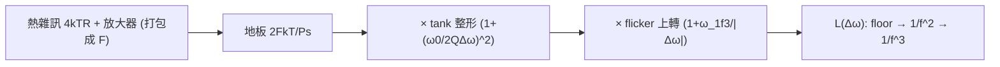

# Leeson 模型推導與 ISF 對照

> **先備／See also**：[tank_Q_and_energy_restoration](/02_foundations/tank_Q_and_energy_restoration)（$Q$ 的能量定義、tank 為何整形 $1/f^2$）、[psd_phase_noise_jitter](/02_foundations/psd_phase_noise_jitter)（$4kTR$ 熱雜訊與 PSD 基礎）、[white_noise_to_phase_noise](/03_isf_core_theory/white_noise_to_phase_noise)（ISF 版 $1/f^2$ 推導）｜**接下來**：[symmetry](/06_design_insights/symmetry)（用 $c_0$ 對稱性壓 $1/f^3$ corner）、[references](/99_appendix/references)（外部文獻 [E1]）

在 Hajimiri–Lee 的 ISF 理論（[P1], 1998）出現之前，工程師估振盪器相位雜訊靠的是 **Leeson 模型**（1966）。它是一條**半經驗（semi-empirical）**公式：物理骨架（tank 濾波 + 回授）是對的，但裡面塞了一個「不知道從哪來、要靠量測 fit」的雜訊因子 $F$。這頁把 Leeson 從頭推一遍，然後**逐項**對回 ISF 的封閉式——你會看到 ISF 理論「解釋了 Leeson 為什麼長那樣，並把那個神祕的 $F$ 換成可計算的物理量」。

> **誠實聲明（請先讀）**：**Leeson 模型來自 [E1] D. B. Leeson, "A Simple Model of Feedback Oscillator Noise Spectrum," Proc. IEEE, vol. 54, no. 2, pp. 329–330, Feb. 1966**，**不在本站下載的 5 篇 PDF 內**。本頁只憑標準文獻知識做背景與對照；卷期/頁碼/DOI **已用網路查證**（DOI 10.1109/PROC.1966.4682）；$F$（noise figure）本就是 Leeson 模型的**經驗擬合參數**（依實作而異），非固定常數。相對地，本頁右半的 ISF 公式（[P1] Eqs.(21),(23),(24)）是 5 篇 PDF 內、已核的權威式。

這頁要回答：

1. Leeson 式的每一項（floor、$1/f^2$、$1/f^3$）物理上從哪來？
2. 為什麼斜率是 $1/f^2$ 與 $1/f^3$，corner 在哪？
3. Leeson 的 $Q$、$F$、$\omega_{1/f^3}$ 對應 ISF 的哪些量？哪些是 ISF 講得更清楚的？

> **物理直覺（先講結論）**：Leeson 把振盪器想成「一個被熱雜訊持續餵食、又被高 $Q$ tank 窄帶濾波的回授系統」。三件事疊起來：(1) 放大器/tank 注入一塊**白色雜訊地板**（$2FkT/P_s$）；(2) 因為是**自治振盪器**，載波附近的相位擾動沒有恢復力，閉迴路把雜訊乘上 $(\omega_0/2Q\Delta\omega)^2$ 的「相位積分」轉移函數，生出 $1/f^2$ 裙帶；(3) device 的 $1/f$ flicker 雜訊再被往上搬一階，生出最靠近載波的 $1/f^3$。ISF 理論講的是**同三段**，只是把 $1/2Q$ 換成 $\Gamma_{rms}/q_{max}$、把 $F$ 換成可由 $\Gamma_{eff}$ 算出的物理量。

## 完整公式（先擺出，再逐步推）

Leeson 模型（規範 10.2，**外部文獻、非 5 篇 PDF**）：

$$
\mathcal{L}(\Delta\omega)=10\log_{10}\!\left[\frac{2FkT}{P_s}\left(1+\Big(\frac{\omega_0}{2Q\,\Delta\omega}\Big)^2\right)\left(1+\frac{\omega_{1/f^3}}{\lvert\Delta\omega\rvert}\right)\right]
$$

符號：$F$＝放大器**雜訊因子**（noise figure，經驗量、無因次）；$k$＝Boltzmann 常數（J/K）；$T$＝溫度（K）；$P_s$＝振盪訊號功率（W）；$Q$＝tank 品質因數（quality factor，無因次）；$\omega_0$＝載波角頻率（rad/s）；$\Delta\omega$＝offset 角頻率（rad/s）；$\omega_{1/f^3}$＝flicker corner（rad/s）。

下面把方括號裡的三個因子一個一個推出來。

## 第 1 步：tank 熱雜訊 — 雜訊地板 $2FkT/P_s$

把振盪器看成「放大器 + 諧振 tank 的回授環」。環裡的熱雜訊源頭是 tank 的損耗電阻 $R$（並聯等效），它的單邊熱雜訊電壓 PSD（Johnson–Nyquist）：

$$
\frac{\overline{v_n^2}}{\Delta f}=4kTR.
$$

- **用到的物理**：電阻熱雜訊 $4kTR$（標準結果，見 [psd_phase_noise_jitter](/02_foundations/psd_phase_noise_jitter)）。
- **單位檢查**：$[kT]=\text{J}=\text{V·C}$，$[kTR]=\text{V·C·}\Omega=\text{V}^2\text{·s}=\text{V}^2/\text{Hz}$ ✓。

放大器自己也加雜訊，整體用一個**雜訊因子 $F$**（noise figure，把「實際總雜訊」對「只有輸入熱雜訊」的倍率打包成一個數）概括。把雜訊功率對載波功率 $P_s$ 正規化，得到**載波附近的相位雜訊地板**：

$$
\mathcal{L}_{\text{floor}}=\frac{2FkT}{P_s}.
$$

- **$F$ 是 Leeson 的「經驗逃生口」**：它把所有沒被顯式建模的雜訊（放大器、轉換損耗、cyclostationary 效應…）塞進一個量測 fit 的數字。**這正是 ISF 後來要取代的對象**（見第 5 步對照）。
- **那個 2 哪來**：屬 Leeson 模型的記帳慣例（並非唯一寫法，依文獻而異）。物理上其實有**兩步、方向相反**的因子：(1) **AM/PM 等分**——熱雜訊同時擾動振幅與相位，相位只分到一半功率（$\times\tfrac12$）；(2) **單邊帶（SSB）記帳**把雙邊功率折算成單邊（$\times2$）。兩者相抵後，最「乾淨」的地板寫法其實是 $FkT/P_s$；本式寫成 $2FkT/P_s$，是把 SSB 慣例**顯式留在前置常數**、而未把 AM/PM 的 $\tfrac12$ 併進 $F$ 的版本。這與 [P1] Eq.(21) 的 $4\Delta\omega^2$ vs 時域 $2\Delta\omega^2$ 同屬 SSB／雙邊記帳差異（見 [white_noise_to_phase_noise](/03_isf_core_theory/white_noise_to_phase_noise) 的 factor-of-2 討論）。（$F$ 為經驗擬合參數，前置常數依文獻略異——這正是 ISF 後來用 $\Gamma_{rms}/q_{max}$ 取代的對象。）
- **單位檢查**：$[2FkT/P_s]=\text{J}/\text{W}=\text{J}/(\text{J/s})=\text{s}=1/\text{Hz}$ ✓（$\mathcal{L}$ 是每赫茲的相對功率，dBc/**Hz**）。

## 第 2 步：高 $Q$ tank 的窄帶濾波 → $1/f^2$ 裙帶

tank 是一個窄帶濾波器。在載波附近 offset $\Delta\omega$ 處，並聯 RLC 的相位/振幅響應斜率由 $Q$ 決定。標準結果：tank 對 offset $\Delta\omega$ 的（半功率）轉移可寫成

$$
\left|H(\Delta\omega)\right|^2\;\propto\;\left(\frac{\omega_0}{2Q\,\Delta\omega}\right)^2\qquad(\Delta\omega\ll\omega_0/2Q).
$$

- **$Q$ 的物理**：$Q=\omega_0/\Delta\omega_{3dB}$＝「諧振多尖」＝每週期儲能/耗能比 $\times2\pi$。$Q$ 越高，tank 帶寬越窄、相位斜率越陡，對 offset 雜訊抑制越強。
- **為何是 $1/\Delta\omega^2$（即 $-20$ dB/dec）**：自治振盪器的相位是**中性方向**（無恢復力，呼應 [derivation_floquet_ppv](/99_appendix/derivation_floquet_ppv) 的 $\lambda_1=0$）。閉迴路相當於對相位擾動做了一次**積分**，頻域上是 $\times 1/\Delta\omega$；功率再平方就是 $1/\Delta\omega^2$。這就是相位雜訊在中頻段必為 $1/f^2$、斜率 $-20$ dB/dec 的根本原因——**與 ISF 給的 $1/\Delta\omega^2$ 同源**（[P1] Eq.(21)）。
- **單位檢查**：$\omega_0/(2Q\Delta\omega)$ 無因次（rad/s ÷ rad/s）✓，整個轉移無因次。

把第 1、2 步相乘（地板 × tank 整形），方括號出現前兩項：

$$
\mathcal{L}_{1/f^2+\text{floor}}=\frac{2FkT}{P_s}\left(1+\Big(\frac{\omega_0}{2Q\,\Delta\omega}\Big)^2\right).
$$

- 「$1+$」裡的 $1$ 是**白雜訊地板**（遠 offset 主導，平坦）；$(\omega_0/2Q\Delta\omega)^2$ 是 **$1/f^2$ 裙帶**（近 offset 主導）。兩者相等處就是 $1/f^2\to$ floor 的轉角，$\Delta\omega\approx\omega_0/2Q$。

## 第 3 步：device flicker → $1/f^3$ 最近載波段

device 的低頻 $1/f$（flicker）雜訊會被振盪器的非線性「上轉（upconvert）」到載波附近，再經第 2 步的相位積分，變成比 $1/f^2$ 更陡的 $1/f^3$。Leeson 用一個乘性因子把它接上：

$$
\left(1+\frac{\omega_{1/f^3}}{\lvert\Delta\omega\rvert}\right).
$$

- 當 $\Delta\omega\gg\omega_{1/f^3}$：此因子 $\approx1$，看不到 flicker，剩 $1/f^2$ 與 floor。
- 當 $\Delta\omega\ll\omega_{1/f^3}$：此因子 $\approx\omega_{1/f^3}/\lvert\Delta\omega\rvert\propto1/\Delta\omega$，**再乘上**第 2 步的 $1/\Delta\omega^2$ → 總共 $1/\Delta\omega^3$，即 **$1/f^3$、$-30$ dB/dec**。
- **$\omega_{1/f^3}$ 是「相位雜訊的 flicker corner」**，**不是** device 自己的 $1/f$ corner。Leeson 沒說清楚它由什麼決定——**這正是 ISF 補上的關鍵物理**（第 5 步、[P1] Eq.(24)）。
- **單位檢查**：$\omega_{1/f^3}/\lvert\Delta\omega\rvert$ 無因次 ✓。

三項乘起來，就是開頭那條完整 Leeson 式。三段斜率：**floor（平）→ $1/f^2$（$-20$ dB/dec）→ $1/f^3$（$-30$ dB/dec）**，由遠到近。



## 第 4 步：Leeson vs ISF 疊圖

把 Leeson 式與 ISF 結果（[P1] Eqs.(21),(23),(24)）畫在同一張 log–log 上，三段（$1/f^3$、$1/f^2$、floor）會**重疊**——兩個模型描述同一條曲線，只是參數的物理意義不同：


- **對應公式**：左半 Leeson 開頭那條（外部文獻）；右半 [P1] Eq.(21)（$1/f^2$）、Eq.(23)（$1/f^3$）、Eq.(24)（$1/f^3$ corner）。
- **script / function**：`simulations/lab_16_leeson_vs_isf.py`（`main`），對應規範 10.1 表的 `leeson_vs_isf_overlay.png`（lab_16）。**這是 pedagogical toy model，非 transistor-level**；Leeson 曲線用 `simulations/common/noise_utils.py` 的 `leeson_one_over_f2` 等函式繪示意 1/f² 段，三段拼接的常數為教學示意值。
- **怎麼讀**：兩條線在中頻段 $1/f^2$ 完全平行（斜率都 $-20$ dB/dec，因為都來自「相位積分 $1/\Delta\omega^2$」）；近載波都翻成 $1/f^3$；遠端都壓到 floor。差異只在「corner 落在哪、絕對位準多高」——而那由參數對應決定，見下節。
- **註**：疊圖中 Leeson 段的 $F,Q,\omega_{1/f^3}$ 與 ISF 段的 $\Gamma_{rms},q_{max},c_0,\omega_{1/f}$ 為**教學示意值**（lab_16 參數），用來展示三段斜率重疊，非特定電路量測。

## 第 5 步：逐項對照（Leeson ↔ ISF）

這是本頁的重點。把兩個模型的對應項擺在一起：

| 段 | Leeson（經驗，[E1] 1966，非 5 篇 PDF） | ISF（[P1] 1998，5 篇 PDF 內） | 對應關係與「ISF 講得更清楚」之處 |
|---|---|---|---|
| **$1/f^2$ 整形** | $\Big(\dfrac{\omega_0}{2Q\,\Delta\omega}\Big)^2$ | $\dfrac{\Gamma_{rms}^2}{q_{max}^2}\cdot\dfrac{1}{\Delta\omega^2}$（[P1] Eq.(21)） | 都給 $1/\Delta\omega^2$。Leeson 的 $\dfrac{1}{2Q}$ ↔ ISF 的 $\dfrac{\Gamma_{rms}}{q_{max}}\times$（含載波/雜訊功率正規化）。**$Q$↔$\Gamma_{rms}/q_{max}$**：高 $Q$＝低 $\Gamma_{rms}/q_{max}$＝低相位雜訊。 |
| **雜訊源/位準** | $\dfrac{2FkT}{P_s}$，$F$ 經驗 fit | $\dfrac{\overline{i_n^2}/\Delta f}{4}$ 配 $\Gamma_{eff}$（含 cyclostationary） | **$F$ 經驗 vs ISF 物理**：Leeson 的 $F$ 是「量了才知道」；ISF 把它拆成可算的 device 雜訊 PSD × $\Gamma_{eff}$，連 cyclostationary 閘控都進得來（見 [effective_isf](/03_isf_core_theory/effective_isf)）。 |
| **$1/f^3$ corner** | $\omega_{1/f^3}$（Leeson 沒說它由什麼定） | $\Delta\omega_{1/f^3}=\omega_{1/f}\dfrac{c_0^2}{2\Gamma_{rms}^2}\approx\omega_{1/f}\Big(\dfrac{c_0}{c_1}\Big)^2$（[P1] Eq.(24)） | **ISF 的招牌洞見**：$1/f^3$ corner **不等於** device 的 $1/f$ corner $\omega_{1/f}$，而被 $(c_0/\Gamma_{rms})^2$ 縮放。**波形對稱 → $c_0\to0$ → corner 被推到遠低於 $\omega_{1/f}$**。Leeson 完全看不到這條設計槓桿。 |

關鍵對照展開：

**(a) $Q\leftrightarrow\Gamma_{rms}/q_{max}$。** 兩者都是「把雜訊轉成相位裙帶的效率」。Leeson 說「$Q$ 越高越好」；ISF 說「$\Gamma_{rms}/q_{max}$ 越小越好」。但 ISF 更一般：它對**沒有高 $Q$ tank 的 ring oscillator** 也成立（ring 沒有 $Q$ 可言，但有 $\Gamma_{rms},q_{max}$，見 [lab_03](/04_simulation_labs/lab_03_ring_oscillator_toy_model)）。這是 ISF 超越 Leeson 的第一點。

**(b) $F$ 經驗 vs ISF 物理。** Leeson 的 $F$ 是黑盒：你得先做出振盪器、量了相位雜訊、反推 $F$，才能用模型「預測」——這其實是事後配適，不是預測。ISF 把同一塊位準寫成 $\dfrac{\overline{i_n^2}/\Delta f}{4q_{max}^2}\Gamma_{rms}^2$（[P1] Eq.(21)），每個量都能從 device 模型與波形**事前算出**，還能透過 $\Gamma_{eff}=\Gamma\cdot\alpha$ 把 cyclostationary（device 在某些相位才漏雜訊）算進去——這正是為什麼 Colpitts 的「實效 $F$」比 Leeson 樸素估計低很多（見 [effective_isf](/03_isf_core_theory/effective_isf)）。

**(c) $1/f^3$ corner。** Leeson 直接把 $\omega_{1/f^3}$ 當輸入參數，等於承認「我不知道它從哪來」。早期工程界甚至誤以為它就等於 device 的 $1/f$ corner。ISF 的 [P1] Eq.(24) 一錘定音：$\Delta\omega_{1/f^3}=\omega_{1/f}\cdot c_0^2/(2\Gamma_{rms}^2)$——它由 **ISF 的 DC 係數 $c_0$**（波形對稱性）決定。**讓波形上升/下降對稱 → $c_0\to0$ → $1/f^3$ corner 大幅下移 → 近載波相位雜訊大降**。這是 Leeson 完全給不出的設計法則，也是 [P2] 用對稱性壓 ring 相位雜訊的理論依據（見 [symmetry](/06_design_insights/symmetry)、[flicker_noise_upconversion](/03_isf_core_theory/flicker_noise_upconversion)）。

## 數值例子（建立手感）

> **例（$1/f^3$ corner 對照）**：取 device $1/f$ corner $f_{1/f}=1$ MHz（$\omega_{1/f}=2\pi\times10^6$ rad/s）。比較「對稱」與「不對稱」波形的相位雜訊 $1/f^3$ corner。

ISF 的 [P1] Eq.(24)：$\Delta\omega_{1/f^3}=\omega_{1/f}\cdot c_0^2/(2\Gamma_{rms}^2)$，取 $\Gamma_{rms}=0.5$。

- **不對稱波形**（大 $c_0$，設 $c_0=0.4$）：
  

$$
\Delta\omega_{1/f^3}=\omega_{1/f}\cdot\frac{(0.4)^2}{2(0.5)^2}=\omega_{1/f}\cdot\frac{0.16}{0.5}=0.32\,\omega_{1/f}.
$$

  即 $f_{1/f^3}\approx0.32\times1\ \text{MHz}=320$ kHz——$1/f^3$ 裙帶延伸到離載波很遠。
- **對稱波形**（小 $c_0$，設 $c_0=0.04$，小 10 倍）：
  

$$
\Delta\omega_{1/f^3}=\omega_{1/f}\cdot\frac{(0.04)^2}{2(0.5)^2}=\omega_{1/f}\cdot\frac{0.0016}{0.5}=3.2\times10^{-3}\,\omega_{1/f}.
$$

  即 $f_{1/f^3}\approx3.2$ kHz——corner 下移 **100 倍**（因為 $c_0$ 平方、降 10 倍 → corner 降 100 倍）。

- **Dimension check**：$c_0^2/\Gamma_{rms}^2$ 無因次，$\omega_{1/f}\times$無因次 $=$ rad/s ✓。
- **手感**：Leeson 把 $\omega_{1/f^3}$ 當「天生固定」；ISF 告訴你它是**設計者能用對稱性壓兩個數量級**的旋鈕。這就是 ISF 的實戰價值。

一行 Python 驗證（corner 比值）：

```python
import numpy as np
from simulations.common.isf_utils import gamma_rms
# 對稱 vs 不對稱波形的 1/f^3 corner 比值 = (c0_asym/c0_sym)^2
c0_asym, c0_sym, Gamma_rms = 0.4, 0.04, 0.5
w1f = 2*np.pi*1e6
corner_asym = w1f * c0_asym**2 / (2*Gamma_rms**2)
corner_sym  = w1f * c0_sym**2  / (2*Gamma_rms**2)
print(corner_asym/(2*np.pi)/1e3, "kHz ;", corner_sym/(2*np.pi)/1e3, "kHz")
# -> ~320.0 kHz ; ~3.2 kHz   (對稱波形把 1/f^3 corner 壓低 100 倍)
```

（`gamma_rms` 等函式庫見 `simulations/common/isf_utils.py`；本例直接用 [P1] Eq.(24) 手算 corner。）

## 適用與失效條件

| 條件 | Leeson 成立時 | 失效時會怎樣 |
|---|---|---|
| 有高 $Q$ 諧振 tank | $(\omega_0/2Q\Delta\omega)^2$ 整形準 | ring 等無 $Q$ 拓樸不適用 → 改用 ISF 的 $\Gamma_{rms}/q_{max}$ |
| $F$ 可由量測 fit | 可事後配適曲線 | 想**事前預測**或拆解物理 → 必須用 ISF（$F$ 是黑盒） |
| $\omega_{1/f^3}$ 已知 | $1/f^3$ 段對得上 | 想知道 corner 由什麼決定/如何壓 → ISF Eq.(24)（$c_0$、對稱性） |
| 線性/弱非線性、加性雜訊 | 三段模型夠用 | 強 cyclostationary → ISF 的 $\Gamma_{eff}=\Gamma\alpha$ 才算得準 |

## 與哪些 paper／公式對應

- **Leeson 模型本身**：[E1] D. B. Leeson, Proc. IEEE 54(2):329–330, Feb. 1966 —— **不在下載的 5 篇 PDF 內**；卷期/DOI 已查證（10.1109/PROC.1966.4682，見 [references](/99_appendix/references) 的 [E1]）；本式為標準 Leeson 形式（$F$ 為經驗 noise factor，前置常數依文獻略異）。
- **ISF 對照式（5 篇 PDF 內、已核）**：$1/f^2$ [P1] Eq.(21), p.185；$1/f^3$ [P1] Eq.(23), p.185；$1/f^3$ corner [P1] Eq.(24), p.185；device flicker [P1] Eq.(22), p.185。
- **cyclostationary（解釋「實效 $F$」）**：[P1] Eqs.(25)–(27), p.186（見 [effective_isf](/03_isf_core_theory/effective_isf)）。
- **疊圖**：`/figures/leeson_vs_isf_overlay.png`，`simulations/lab_16_leeson_vs_isf.py`（規範 10.1，lab_16）。

## 重點回顧

- Leeson（1966，**外部、非 5 篇 PDF**）＝半經驗三段式：$\mathcal{L}=10\log_{10}\!\big[\tfrac{2FkT}{P_s}(1+(\tfrac{\omega_0}{2Q\Delta\omega})^2)(1+\tfrac{\omega_{1/f^3}}{\lvert\Delta\omega\rvert})\big]$。
- 三段：白雜訊 **floor**（$2FkT/P_s$）→ tank 整形的 **$1/f^2$**（$-20$ dB/dec，源自相位積分 $1/\Delta\omega^2$）→ flicker 上轉的 **$1/f^3$**（$-30$ dB/dec）。
- **逐項對照**：$Q\leftrightarrow\Gamma_{rms}/q_{max}$（高 $Q$＝低 $\Gamma_{rms}/q_{max}$）；$F$ 經驗黑盒 ↔ ISF 可算的 $\overline{i_n^2}\cdot\Gamma_{eff}$（含 cyclostationary）；$\omega_{1/f^3}$ 神祕參數 ↔ [P1] Eq.(24) 由 $c_0$（對稱性）決定。
- **ISF 的三大超越**：(1) 對無 $Q$ 的 ring 也成立；(2) 事前可算、不靠 fit；(3) 把 $1/f^3$ corner 變成可用對稱性壓兩個數量級的設計旋鈕。
- 兩模型在 log–log 疊圖上三段重疊（`leeson_vs_isf_overlay.png`）——同一條曲線、不同物理語言。

## 延伸閱讀

- $1/f^2$ 白噪推導（ISF 版）：[white_noise_to_phase_noise](/03_isf_core_theory/white_noise_to_phase_noise)
- $1/f^3$ flicker 上轉與 corner：[flicker_noise_upconversion](/03_isf_core_theory/flicker_noise_upconversion)
- 對稱性如何壓 $c_0$：[symmetry](/06_design_insights/symmetry)
- 「實效 $F$」與 cyclostationary：[effective_isf](/03_isf_core_theory/effective_isf)
- PSD / phase noise / jitter 基礎：[psd_phase_noise_jitter](/02_foundations/psd_phase_noise_jitter)
- 嚴格基礎（PPV/Floquet）：[derivation_floquet_ppv](/99_appendix/derivation_floquet_ppv)
- 完整文獻與外部 citation（[E1]）：[references](/99_appendix/references)
