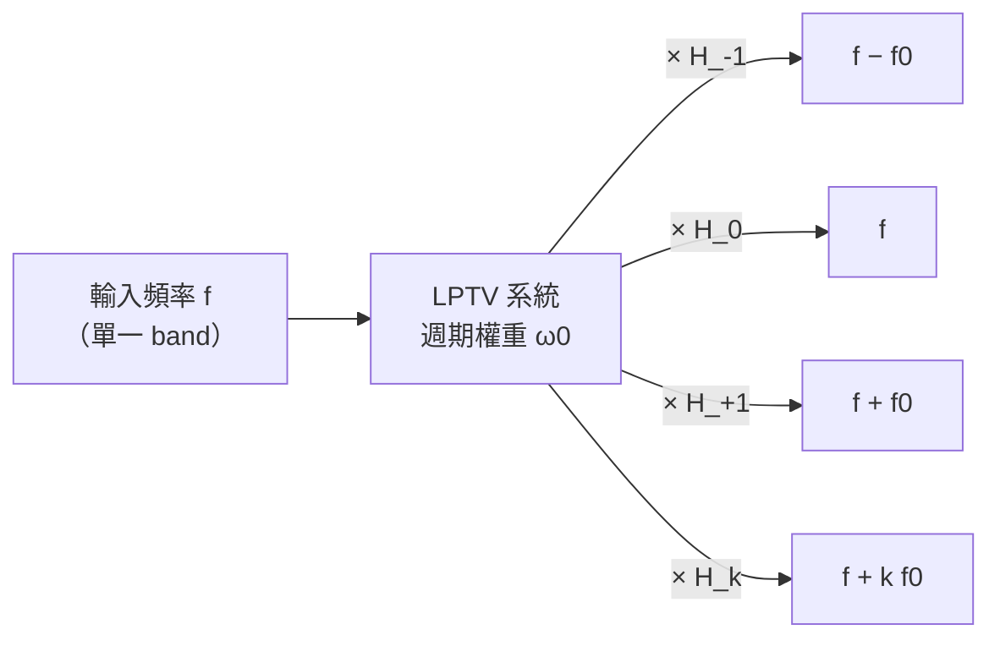

# 嚴格 LTV 框架：Zadeh 時變傳函與 harmonic transfer matrix

> **先備**：[lti_vs_ltv](/02_foundations/lti_vs_ltv)（LTV vs LTI 的直覺）、[convolution_derivation](/03_isf_core_theory/convolution_derivation)（[P1] Eq.(11) 的 LTV 卷積）、[fourier_series_of_isf](/03_isf_core_theory/fourier_series_of_isf)（ISF 傅立葉係數 $c_n$）｜**接下來**：[derivation_floquet_ppv](/99_appendix/derivation_floquet_ppv)（同一個 ISF 的 PPV/Floquet 面孔）

本站主線（[P1]）用「物理直覺 + impulse 模擬」把 ISF 引出來，並在
[convolution_derivation](/03_isf_core_theory/convolution_derivation) 用疊加把單一 impulse 推廣到任意 noise。
那條路非常好走，但有一塊缺口：我們一直說「振盪器對 noise 是 **LTV（linear time-varying，線性時變）**」、
「它像一台**時變混頻器（mixer）**、會把 $n\omega_0$ 附近的 noise 搬到 carrier」——但這些話在
**訊號與系統（signals and systems）** 的語言裡，到底對應哪一個嚴格物件？「頻率被搬移、增益是 $c_k$」
能不能寫成一個乾淨的傳函？

這頁就是補上這塊**系統理論的地基**。我們用讀者熟悉的卷積/LTI 當起點，一路推到 **Zadeh 的時變傳函
$H(f,t)$**（time-varying transfer function）與 **harmonic transfer matrix（HTM，諧波轉移矩陣）**，
然後證明一句話：

> **ISF（連同 $1/q_{max}$）就是「相位輸出對各輸入諧波 band 的轉換向量」——它的第 $k$ 個分量正是 ISF
> 的第 $k$ 個傅立葉係數 $c_k$。** 換句話說 ISF 的傅立葉級數 $\{c_k\}$ 不只是一組數字，它就是這個 LTV
> 系統的 HTM 在「相位輸出列」上的一整列。

> **誠實聲明（請先讀）**：本頁的 **Zadeh 時變傳函 $H(f,t)$、bi-frequency function、harmonic transfer
> matrix（HTM）** 屬於更廣的**線性時變系統理論**，**不在本站下載的 5 篇 PDF 內**。原始概念來自
> **[E5] L. A. Zadeh, "Frequency Analysis of Variable Networks," Proc. IRE, vol. 38, no. 3,
> pp. 291–299, Mar. 1950（DOI 10.1109/JRPROC.1950.231083）**；HTM 形式則在週期時變/RF 電路文獻
> （如 cyclostationary、LPTV 系統分析）中標準化。**這些是外部數學框架；正式 [E5] citation（Zadeh 1950, Proc. IRE 38(3):291–299, DOI 10.1109/JRPROC.1950.231083）已收於 [references](/99_appendix/references)。** 本頁只用它們「重講 ISF」，所有與 ISF 的對應都會收斂回
> [P1] Eq.(13)（在 5 篇 PDF 內、已核實）。

這頁要回答四個問題：

1. LTI 的卷積，推廣到 LTV 長什麼樣？（先把讀者的訊號與系統背景接上）
2. Zadeh 怎麼把「LTV 對每個輸入頻率 $f$ 的響應」寫成一個時變傳函 $H(f,t)$？
3. 當這個 LTV 是**週期**的（振盪器就是），$H(f,t)$ 的結構塌縮成什麼——為什麼輸入頻率 $f$ 只會被搬到
   離散的 $f+kf_0$、增益是 $c_k$？這就是 HTM。
4. 把它窄化到「相位輸出」，怎麼證 ISF 就是那條轉換向量？

---

## 第 0 步：先複習 LTI——卷積與單一傳函（讀者的起點）

訊號與系統課教的 **LTI（linear time-invariant，線性非時變）** 系統，由單一 impulse response $h(\tau)$
完全決定。對輸入 $x(t)$，輸出是**卷積**：

$$
y(t)=\int_{-\infty}^{\infty}h(t-\tau)\,x(\tau)\,d\tau .
$$

- **關鍵特徵**：核 $h$ 只依賴**時間差** $t-\tau$，不在乎絕對時刻。「現在踢」和「等一拍再踢」效果一樣，
  只是輸出平移。
- **頻域是對角的**：LTI 的招牌性質是「複指數是本徵函數」。把 $x(t)=e^{j2\pi f t}$ 代入，

$$
y(t)=\int h(t-\tau)\,e^{j2\pi f\tau}\,d\tau
=e^{j2\pi f t}\underbrace{\int h(\sigma)\,e^{-j2\pi f\sigma}\,d\sigma}_{=\,H(f)},
$$

  （換變數 $\sigma=t-\tau$）。輸出是**同一個頻率** $f$ 乘上一個複數增益 $H(f)$。
- **這就是 LTI 的本質**：**輸入頻率 $f$ 進去、只有頻率 $f$ 出來**，不生新頻率。所以單一傳函 $H(f)$
  足以描述一切——頻域裡 LTI 是**對角**的（不同頻率互不耦合）。
- **單位檢查**：$[h]=[y]/([x]\cdot\text{s})$（卷積帶一個 $d\tau$）；$H(f)=\int h\,e^{-j2\pi f\sigma}d\sigma$
  與 $h$ 差一個 $\text{s}$，故 $[H]=[y]/[x]$（純增益）✓。

> 為什麼振盪器**不是** LTI？因為「在波峰踢」與「在零交越踢」效果天差地遠——核**依賴絕對注入時刻**
> （透過 $\Gamma(\omega_0\tau)$），不是只依賴 $t-\tau$。這正是 [lti_vs_ltv](/02_foundations/lti_vs_ltv)
> 與 [impulse_to_phase_shift](/03_isf_core_theory/impulse_to_phase_shift) 第 4 步「$h_\phi(t,\tau)$ 依賴
> $\tau$」講的事。下面我們把這件事系統化。

---

## 第 1 步：LTV——核變成雙變數 $h(t,\tau)$

把 LTI 的「只依賴時間差」放寬：**LTV** 系統的 impulse response 依賴**兩個**時刻——「何時施加 impulse
（$\tau$）」與「何時觀測（$t$）」。輸出寫成（規範 11.2）：

$$
\boxed{\ y(t)=\int_{-\infty}^{\infty}h(t,\tau)\,x(\tau)\,d\tau\ }
$$

- $h(t,\tau)$ 讀作「在 $\tau$ 時刻打一發單位 impulse，在 $t$ 時刻量到的響應」。
- **LTI 是特例**：若系統時不變，$h(t,\tau)=h(t-\tau)$，上式塌回卷積。LTV 把「$t-\tau$」鬆綁成「獨立的
  $(t,\tau)$」——多出來的那個自由度，就是「**何時**踢很重要」這件物理事實的數學容器。
- **對應 ISF**：[P1] Eq.(10), p.182 的 excess-phase impulse response
  $h_\phi(t,\tau)=\dfrac{\Gamma(\omega_0\tau)}{q_{max}}\,u(t-\tau)$ 正是一個 $h(t,\tau)$——它對 $\tau$ 的依賴
  全藏在 $\Gamma(\omega_0\tau)$ 裡，對 $t-\tau$ 的依賴只有一個 unit step（相位步階永久保留）。代進上式就是
  [P1] Eq.(11) 的 $\phi(t)=\frac{1}{q_{max}}\int_{-\infty}^{t}\Gamma(\omega_0\tau)\,i_n(\tau)\,d\tau$
  （見 [convolution_derivation](/03_isf_core_theory/convolution_derivation)）。**所以 ISF 理論本來就是一個
  LTV 卷積**，只是核特別簡單。
- **單位檢查**：與 LTI 同，$[h(t,\tau)]=[y]/([x]\cdot\text{s})$ ✓。

---

## 第 2 步：Zadeh 時變傳函 $H(f,t)$——「對每個頻率即時的響應」

LTI 只要一個 $H(f)$。LTV 對「每個輸入頻率」的響應會**隨觀測時刻 $t$ 變化**，所以 Zadeh（1950）定義一個
**時變傳函（time-varying transfer function）** $H(f,t)$：把純正弦 $x(\tau)=e^{j2\pi f\tau}$ 餵進系統，
輸出寫成「$e^{j2\pi f t}$ 乘上一個會隨 $t$ 變的增益」：

$$
y(t)\big|_{x=e^{j2\pi f\tau}}=H(f,t)\,e^{j2\pi f t}.
$$

把第 1 步的 LTV 卷積代進去，並換變數 $\sigma=t-\tau$（即 $\tau=t-\sigma$）：

$$
y(t)=\int h(t,\tau)\,e^{j2\pi f\tau}\,d\tau
=\int h(t,\,t-\sigma)\,e^{j2\pi f(t-\sigma)}\,d\sigma
=e^{j2\pi f t}\underbrace{\int h(t,\,t-\sigma)\,e^{-j2\pi f\sigma}\,d\sigma}_{\equiv\,H(f,t)} .
$$

於是得到 **Zadeh 時變傳函**（規範 11.2）：

$$
\boxed{\ H(f,t)=\int_{-\infty}^{\infty}h(t,\,t-\sigma)\,e^{-j2\pi f\sigma}\,d\sigma\ }
$$

- **怎麼讀**：$H(f,t)$ 是「**此刻 $t$**、對輸入頻率 $f$ 的瞬時複增益」。它對 $f$ 的依賴像 LTI 的 $H(f)$；
  多出來的 $t$ 依賴，正是 time-varying 的全部內容。
- **退化檢查**：時不變時 $h(t,t-\sigma)=h(\sigma)$ 與 $t$ 無關，$H(f,t)\to H(f)$ 回到 LTI ✓。
- **單位檢查**：與 $H(f)$ 同，$[H(f,t)]=[y]/[x]$（純增益）✓。
- **為什麼這還不夠「漂亮」**：$H(f,t)$ 是 $t$ 的任意函數，資訊量等於整個 $h(t,\tau)$，沒有壓縮。真正的
  魔法在下一步——當系統是**週期**的，$H(f,t)$ 對 $t$ 只剩離散傅立葉成分，整個 LTV 塌縮成一個
  **矩陣**（HTM）。

---

## 第 3 步：週期 LTV → $H(f,t)$ 的傅立葉展開 → harmonic transfer matrix

振盪器在週期穩態下，其 LTV 核是 $T$-週期的：$h(t+T,\tau+T)=h(t,\tau)$（在 $\tau$ 與 $t$ 同步平移一個週期下
不變）。這類系統叫 **LPTV（linear periodically time-varying，線性週期時變）**。週期性讓 $H(f,t)$ 對 $t$
變成 $T$-週期，於是可以對 $t$ 做傅立葉級數展開：

$$
H(f,t)=\sum_{k=-\infty}^{\infty}H_k(f)\,e^{j2\pi k f_0 t},\qquad f_0=\frac1T,
$$

其中 $H_k(f)=\dfrac1T\displaystyle\int_0^T H(f,t)\,e^{-j2\pi k f_0 t}\,dt$ 是第 $k$ 個**諧波傳函**。

- **物理意義（關鍵）**：把純正弦 $x=e^{j2\pi f\tau}$ 餵進去，輸出是

$$
y(t)=H(f,t)\,e^{j2\pi f t}=\sum_{k}H_k(f)\,e^{j2\pi (f+kf_0) t}.
$$

  **一個輸入頻率 $f$，輸出散到一整排離散頻率 $f+kf_0$**（$k=0,\pm1,\pm2,\dots$），第 $k$ 條的複增益是
  $H_k(f)$。這正是「振盪器是時變 mixer」「頻率被搬移」的嚴格陳述：LPTV 在頻域**不再對角**，而是把輸入
  band 耦合到所有「相距整數倍 $f_0$」的 band。

- **harmonic transfer matrix（HTM）**：把輸入/輸出都用「以 $f_0$ 為間隔的諧波 band」做索引，整個 LPTV
  系統就被一個矩陣 $\mathbf{H}$ 描述，其元素

$$
[\mathbf{H}]_{m,k}=H_{m-k}\!\left(f\right)
$$

  把「輸入第 $k$ band」映到「輸出第 $m$ band」。它是 **Toeplitz 結構**（元素只依賴 band 差 $m-k$），因為
  搬移量只看「差幾個 $f_0$」。這就是 **harmonic transfer matrix**——LPTV 的「傳函」不是一個數，而是這個
  把各諧波 band 互相耦合的矩陣。

- **退化檢查**：若系統時不變，只有 $H_0(f)=H(f)$ 非零，矩陣變對角（$k=0$ 那條），回到 LTI 的「不生新頻率」 ✓。
- **單位檢查**：每個 $H_k(f)$ 都是純增益（與 $H(f,t)$ 同量綱）✓。



> **與 [fourier_series_of_isf](/03_isf_core_theory/fourier_series_of_isf) 的圖一模一樣**：那頁的 mermaid
> 圖把「$n\omega_0$ 附近的 noise 經 $c_n$ 折回 carrier」畫成一排箭頭；這裡的 $H_k$ 就是那些箭頭的嚴格名字。
> 下一步我們把 $H_k$ 算出來，會發現它**正是** ISF 的傅立葉係數。

把上面這個 boxed 結果畫成圖：左圖是頻率軸上的**頻帶折疊**——單一輸入 noise band 落在 $f$，被 LPTV 系統折到一整排
$f+kf_0$（$k=-2..2$），每根箭頭的高度與標籤就是折疊增益 $|\tilde c_k|$（DC $=c_0/2$、$\pm1=c_1/2$、…）；右圖是
$[\mathbf H]_{m,k}=H_{m-k}$ 的 **Toeplitz 熱圖**，沿對角線為常數（搬移量只看「相差幾個 $f_0$」）。增益由
`simulations/common/isf_utils.compute_fourier_coefficients` 從一條 pedagogical ISF（同 lab_05、含非零 $c_0$）算出。


*（圖：`simulations/fig_htm_bandfold.py`。這是 illustrative 教學圖，非 transistor-level 萃取。左圖箭頭增益
$|\tilde c_0|=c_0/2$、$|\tilde c_{\pm1}|=c_1/2$、$|\tilde c_{\pm2}|=c_2/2$，正對應第 4 步將證的
$H_k^{(\Gamma)}=\tilde c_k$；折疊增益的模平方和 $\sum_k|\tilde c_k|^2=\Gamma_{rms}^2$ 即第 5 步的 Parseval。）*

---

## 第 4 步：把振盪器的 ISF 核代進去——$H_k$ 就是 $c_k$

現在把抽象的 HTM 窄化到 [P1] 的相位通道。相位輸出的 LTV 核（對 noise 電流而言）來自 [P1] Eq.(11)，
寫成第 1 步的 $h(t,\tau)$ 形式（相位是 noise 的**累積積分**，核帶 unit step）：

$$
h_\phi(t,\tau)=\frac{\Gamma(\omega_0\tau)}{q_{max}}\,u(t-\tau)\qquad[\text{P1] Eq.(10), p.182}.
$$

把 ISF 的傅立葉級數（[P1] Eq.(12), p.183）代入 $\Gamma$：

$$
\Gamma(\omega_0\tau)=\frac{c_0}{2}+\sum_{n=1}^{\infty}c_n\cos(n\omega_0\tau+\theta_n)
=\sum_{k=-\infty}^{\infty}\tilde c_k\,e^{jk\omega_0\tau},
$$

其中右邊把實數 cos 級數寫成複數指數級數（$\tilde c_0=c_0/2$、$\tilde c_{\pm k}=\tfrac12 c_k e^{\pm j\theta_k}$，
$k\ge1$；這是標準的實↔複傅立葉互換，見 [math_identities](/99_appendix/math_identities)）。

**核心代數**：相位通道是「ISF 加權後再積分」。先看「ISF 加權」這個瞬時乘法部分（積分器留到下一步單獨處理，
因為它對所有 band 一律乘 $1/(j2\pi f)$，不耦合 band）。把純正弦 noise $i_n(\tau)=e^{j2\pi f\tau}$ 經 ISF 加權：

$$
\Gamma(\omega_0\tau)\,e^{j2\pi f\tau}
=\sum_{k}\tilde c_k\,e^{jk\omega_0\tau}\,e^{j2\pi f\tau}
=\sum_{k}\tilde c_k\,e^{j2\pi (f+kf_0)\tau}.
$$

（用了 $k\omega_0\tau=2\pi(kf_0)\tau$。）對照第 3 步的 $y=\sum_k H_k(f)e^{j2\pi(f+kf_0)t}$，**逐項比對**就讀出
ISF 加權級的諧波傳函：

$$
\boxed{\ H_k^{(\Gamma)}=\tilde c_k\ }\qquad\Longleftrightarrow\qquad
H_0^{(\Gamma)}=\frac{c_0}{2},\quad H_{\pm k}^{(\Gamma)}=\tfrac12 c_k\,e^{\pm j\theta_k}\ (k\ge1).
$$

- **這就是本頁的招牌結果的一半**：**ISF 加權級的 HTM 諧波增益，就是 ISF 的傅立葉係數**。「把輸入頻率 $f$
  搬到 $f+kf_0$、增益是 $c_k$」這句話，現在是逐字成立的定理，不是比喻。
- $H_0=c_0/2$（DC band，把 $f$ 原封搬到 $f$ 自己）——這正是 $c_0$ 把 baseband flicker 上轉的 band；
  $H_{\pm1}\propto c_1$ 把 $\omega_0$ 附近的 band 折下來……與 [fourier_series_of_isf](/03_isf_core_theory/fourier_series_of_isf)
  第 4、5 步**完全吻合**。
- **單位檢查**：$c_k$ 無因次、$1/q_{max}$ 帶 $\text{C}^{-1}$；ISF 通道把電流（A）變成相位變化率，量綱由
  $1/q_{max}$ 與後面積分器共同調成 rad（見下一步）✓。

### 動手驗證：$H_k=c_k$ 不是比喻，是可量的數字

下面這段可直接跑（依賴本站 `simulations/common/isf_utils`）。它把 $H_k=\tilde c_k$ 的主張**逐字測一遍**：
分別在 $1\omega_0$、$2\omega_0$、$3\omega_0$ 附近（各偏 $\Delta f$）注入**等幅**單音 noise，積分成相位 $\phi(t)$、
對 $\phi(t)$ 做 FFT，量「被降頻搬到 baseband $\Delta f$ 的 sideband」幅度。**若 $H_n\propto c_n$，這些 sideband
的比值必須等於 ISF 傅立葉係數的比值** $c_1:c_2:c_3$。

```python
import numpy as np
from simulations.common.isf_utils import (
    compute_fourier_coefficients, integrate_phase_from_noise)

f0, qmax = 5e9, 1e-12                 # 5 GHz carrier, q_max = 1 pC
w0 = 2 * np.pi * f0
fs = 8 * f0                           # 可解析到 ~3 w0 而不混疊
df = 5e6                              # 每個諧波旁的注入單音偏移 [Hz]
N  = 1 << 21                          # 大 N -> 把 baseband df sideband 解析清楚
t  = np.arange(N) / fs

# 同本頁圖 / lab_05 的 pedagogical ISF（含非零 c0、數個諧波非平凡）：
def gamma(theta):
    return (-np.sin(theta) + 0.35*np.sin(2*theta)
            + 0.18*np.cos(3*theta) + 0.25)

g_traj = gamma(w0 * t)                # Gamma(w0 t)，沿軌跡取樣
th = np.linspace(0, 2*np.pi, 4000, True)
_, _, _, c, _ = compute_fourier_coefficients(th, gamma(th), 4)
print(np.round(c[:4], 3))             # -> [0.5  1.    0.35 0.18]  (c0, c1, c2, c3)

I0 = 1e-6
def phi_sideband(n):                  # 注入 I0 cos((n w0 + df) t)，量 phi 在 df 的 sideband
    i_n = I0 * np.cos((n*w0 + 2*np.pi*df) * t)
    phi = integrate_phase_from_noise(t, i_n, g_traj, qmax)
    P = np.abs(np.fft.rfft((phi - phi.mean()) * np.hanning(N))) / N
    f = np.fft.rfftfreq(N, 1/fs)
    k = int(np.argmin(np.abs(f - df)))
    return P[k-5:k+6].max()

a1, a2, a3 = (phi_sideband(n) for n in (1, 2, 3))
print(f"a1/a2 = {a1/a2:.3f}   c1/c2 = {c[1]/c[2]:.3f}")  # -> a1/a2 = 2.857   c1/c2 = 2.857
print(f"a1/a3 = {a1/a3:.3f}   c1/c3 = {c[1]/c[3]:.3f}")  # -> a1/a3 = 5.556   c1/c3 = 5.556
```

兩組比值**逐位吻合**：$\phi$ 對「$n\omega_0$ 附近注入」的響應強度正比於 $c_n$，這就是 $H_n^{(\Gamma)}=\tilde c_n$
的數值見證——HTM 的折疊增益**就是** ISF 的傅立葉係數，不是比喻。（這也對應上面那張頻帶折疊圖左側的箭頭高度
$|\tilde c_{\pm1}|=c_1/2$、$|\tilde c_{\pm2}|=c_2/2$。）

---

## 第 5 步：加回積分器與 $1/q_{max}$——相位通道的完整 HTM 列

相位通道完整是「ISF 加權 $\to$ 乘 $1/q_{max}$ $\to$ 積分」（見
[white_noise_to_phase_noise](/03_isf_core_theory/white_noise_to_phase_noise) 的 block diagram）。積分器在頻域
對「**搬移後**的頻率 $f+kf_0$」乘 $\dfrac{1}{j2\pi(f+kf_0)}$。但我們關心的是 **carrier 附近的 phase noise**：
落在 $f=-kf_0+\Delta f$（即「$k$ 次諧波 band 偏 $\Delta f$」）的 noise，被 $H_{k}$ 搬到 baseband 的 $\Delta f$（依 Step 3 的 HTM 慣例 $y=\sum_m H_m\,x(f-mf_0)$，把輸入 $-kf_0+\Delta f$ 搬到 $\Delta f$ 需 $m=k$），
積分器在那裡乘 $\dfrac{1}{j2\pi\Delta f}$。於是「第 $k$ band 的 noise → carrier 旁 $\Delta f$ 的相位」整條鏈的增益是

$$
\frac{1}{q_{max}}\cdot \underbrace{\tilde c_{k}}_{\text{ISF 搬移}}\cdot\underbrace{\frac{1}{j2\pi\Delta f}}_{\text{積分器}}
\;\xrightarrow{\ |\cdot|\ }\;
\frac{|c_k|}{2\,q_{max}}\cdot\frac{1}{2\pi\Delta f}\quad(k\ge1).
$$

這正是 [P1] Eq.(16/17), p.183 的單音 sideband 結果
$\phi_p=\dfrac{I_0\,c_k}{2q_{max}\,\Delta\omega}$（$\Delta\omega=2\pi\Delta f$）——我們**從 HTM 重新推出來了**，
而且把每一塊（ISF 搬移＝$c_k$、積分器＝$1/(j2\pi\Delta f)$、normalization＝$1/q_{max}$）拆得清清楚楚。

把「各輸入諧波 band → 相位輸出」的這一整排增益收成一個**向量**（這就是 HTM 中對應「相位輸出列」的那一列）：

$$
\boxed{\ \mathbf{g}_\phi=\frac{1}{q_{max}}\big[\dots,\ \tilde c_{-2},\ \tilde c_{-1},\ \tfrac{c_0}{2},\ \tilde c_{1},\ \tilde c_{2},\ \dots\big]\ }
$$

- **第 $k$ 個分量 $=\tilde c_k/q_{max}$**：把「離 carrier $kf_0$ 的那個 noise band」映到相位。模平方求和
  $\sum_k|\tilde c_k|^2=(c_0/2)^2+\tfrac12\sum_{n\ge1}c_n^2=\Gamma_{rms}^2$（DC 項以 $(c_0/2)^2$ 計入，與 lab_05 Parseval 修正、[P1] Eq.(20) 一致）——這就是
  [white_noise_to_phase_noise](/03_isf_core_theory/white_noise_to_phase_noise) 用 Parseval 把 $\sum c_n^2$
  換成 $\Gamma_{rms}^2$ 的 HTM 版本：**phase noise 的總權重 = 這條轉換向量的能量**。
- **單位檢查**：每個分量 $\tilde c_k/q_{max}$ 帶 $\text{C}^{-1}$；乘上 noise band 的電荷量（A·s/...）與
  積分器後得 rad ✓。

---

## 第 6 步：結論——「ISF 就是相位輸出對各諧波的轉換向量」

把第 4、5 步合起來，本頁的招牌定理成立：

> **定理（ISF = 相位輸出的 HTM 列）**：把週期時變的振盪器相位通道視為一個 LPTV 系統，用以 $f_0$ 為間隔的
> 諧波 band 索引輸入/輸出。則「**輸入各諧波 band → 相位輸出**」的轉換向量 $\mathbf{g}_\phi$ 的第 $k$ 個分量，
> 恰是（複數）ISF 傅立葉係數除以 $q_{max}$：$[\mathbf{g}_\phi]_k=\tilde c_k/q_{max}$。等價地，**ISF 的傅立葉
> 級數 $\{c_k\}$ 就是相位輸出在 HTM 中那一列的內容**。

這把三句一直被當「直覺/比喻」的話，升級成 LTV 系統理論的定理：

| 本站一直講的（直覺） | HTM 嚴格陳述 | 對應 |
|---|---|---|
| 振盪器是「時變 mixer」 | LPTV 系統，$H(f,t)=\sum_k H_k(f)e^{jk\omega_0 t}$ 非對角 | 輸入 $f$ → 輸出 $f+kf_0$ |
| 「$n\omega_0$ 附近 noise 被搬到 carrier」 | $H_{\pm k}^{(\Gamma)}=\tfrac12 c_k e^{\pm j\theta_k}$ | 搬移增益 $=c_k$ |
| 「ISF 的傅立葉係數 $c_k$ 是 mixer 增益」 | $[\mathbf{g}_\phi]_k=\tilde c_k/q_{max}$ | ISF $=$ 相位輸出的 HTM 列 |
| 「總權重 $\sum c_n^2=2\Gamma_{rms}^2$」 | 轉換向量能量 $\sum_k\vert \tilde c_k\vert ^2=\Gamma_{rms}^2$ | Parseval = 向量範數 |

- **與 [P1] Eq.(13) 的關係（在 5 篇 PDF 內）**：[P1] Eq.(13), p.183 把相位寫成「$c_0$ 項積分 + 各諧波
  $c_n\cos(n\omega_0\tau+\theta_n)$ 加權積分之和」。那正是把上面的轉換向量 $\mathbf{g}_\phi$ **作用在 noise
  上、再積分**的時域寫法——HTM 是它的頻域對應。兩者是同一件事的兩種語言（時域級數 vs 頻域 band 矩陣）。
- **與 PPV/Floquet 的關係**：[derivation_floquet_ppv](/99_appendix/derivation_floquet_ppv) 證明 ISF $=$ PPV
  在注入節點的分量（$\Gamma/q_{max}=v_1^T\mathbf b$）。HTM 是「同一個 ISF」的**頻域/系統理論**面孔；PPV 是它的
  **狀態空間/微分幾何**面孔。三者（[P1] 直覺、PPV、HTM）描述同一個物件 $\Gamma$，只是抽象層級不同。

---

## 與訊號與系統三大物件的對照表

把這頁的 LTV 物件並排在讀者熟悉的 LTI 物件旁邊，地圖就完整了：

| 概念 | LTI（訊號與系統課） | LTV（本頁） | 週期 LTV / 振盪器 |
|---|---|---|---|
| impulse response | $h(t-\tau)$ | $h(t,\tau)$ | $h(t,\tau)=\frac{\Gamma(\omega_0\tau)}{q_{max}}u(t-\tau)$ |
| 輸出 | 卷積 $\int h(t-\tau)x\,d\tau$ | $\int h(t,\tau)x\,d\tau$ | [P1] Eq.(11) |
| 傳函 | 一個 $H(f)$ | $H(f,t)$（Zadeh） | $H(f,t)=\sum_k H_k(f)e^{jk\omega_0 t}$ |
| 頻域結構 | 對角（不生新頻率） | 一般 | **Toeplitz HTM**（搬移 $kf_0$） |
| 「傳函」是什麼 | 純量 $H(f)$ | 函數 $H(f,t)$ | 矩陣 $\mathbf H$（HTM） |
| 相位通道增益 | — | — | 轉換向量 $\mathbf g_\phi$，$[\mathbf g_\phi]_k=\tilde c_k/q_{max}$ |

---

## 適用與失效條件

| 條件 | 成立時 | 失效時會怎樣 |
|---|---|---|
| 系統線性（小擾動） | 卷積/Zadeh/HTM 全套成立 | 大注入 → 非線性，諧波交互、HTM 不再單一線性映射 |
| 週期穩態（LPTV） | $H(f,t)$ 對 $t$ 為 $T$-週期，可展 $\sum_k H_k$ | 啟動暫態/被 injection 拉動 → 非純週期，HTM 失效 |
| noise 為加性 | 轉換向量 $\mathbf g_\phi$ 線性作用 | 強乘性/cyclostationary 要先吸進 $\Gamma_{eff}=\Gamma\alpha$（見 [effective_isf](/03_isf_core_theory/effective_isf)） |
| 只取相位輸出列 | $\mathbf g_\phi$ 即 ISF | 要同時追振幅 → 需 HTM 的「振幅輸出列」（對應 APF [P4]） |
| band 截斷有限 $k$ | 低階 $c_k$ 主宰，數值收斂快 | ISF 高階諧波強時要保留更多 band |

---

## 與哪些 paper／公式對應

- **本站主線（5 篇 PDF 內）**：LTV 卷積 [P1] Eq.(11)、ISF 傅立葉級數 [P1] Eq.(12)、分諧波相位響應
  [P1] Eq.(13)，p.182–183（見 [convolution_derivation](/03_isf_core_theory/convolution_derivation)、
  [fourier_series_of_isf](/03_isf_core_theory/fourier_series_of_isf)）。本頁的 HTM 是 Eq.(13) 的頻域重述。
- **單音 sideband 的 HTM 重推**：對回 [P1] Eq.(16/17), p.183（第 5 步）。
- **嚴格基礎的另一面孔**：PPV/Floquet（ISF $=v_1^T\mathbf b$）見
  [derivation_floquet_ppv](/99_appendix/derivation_floquet_ppv)（外部 [E2] Demir 2000）。
- **本頁的 LTV 系統框架（Zadeh $H(f,t)$、HTM）屬外部文獻、不在 5 篇 PDF 內**：[E5] L. A. Zadeh,
  "Frequency Analysis of Variable Networks," Proc. IRE 38(3):291–299, Mar. 1950；HTM 為 LPTV/RF 文獻標準形式。
  （[E5] Zadeh 1950 正式 citation 已收於 [references](/99_appendix/references)，DOI 10.1109/JRPROC.1950.231083。）

## 重點回顧

- LTI 由單一 $h(t-\tau)$／$H(f)$ 描述，頻域對角、不生新頻率；**LTV 的核變成 $h(t,\tau)$**，輸出
  $y=\int h(t,\tau)x\,d\tau$，振盪器的 $h_\phi(t,\tau)=\frac{\Gamma(\omega_0\tau)}{q_{max}}u(t-\tau)$ 正是一例。
- **Zadeh 時變傳函** $H(f,t)=\int h(t,t-\sigma)e^{-j2\pi f\sigma}d\sigma$ 描述「此刻對頻率 $f$ 的瞬時增益」；
  時不變時退化回 $H(f)$。
- **週期 LTV（LPTV）**：$H(f,t)=\sum_k H_k(f)e^{jk\omega_0 t}$，輸入頻率 $f$ 被搬到一整排 $f+kf_0$、增益 $H_k$。
  這組諧波增益排成 **Toeplitz 的 harmonic transfer matrix（HTM）**。
- 把 ISF 核代入 → **$H_k^{(\Gamma)}=\tilde c_k$（ISF 的傅立葉係數）**；加回 $1/q_{max}$ 與積分器，重推出
  [P1] Eq.(16/17) 的單音 sideband。
- **招牌定理**：相位輸出的轉換向量 $[\mathbf g_\phi]_k=\tilde c_k/q_{max}$——**ISF 就是相位輸出對各諧波 band
  的轉換向量**（HTM 的相位輸出列）；其能量 $\sum_k|\tilde c_k|^2=\Gamma_{rms}^2$ 即 Parseval。
- 全套 Zadeh/HTM 屬**外部 LTV 系統理論、不在 5 篇 PDF 內**（[E5] Zadeh 1950）；與 [P1] Eq.(13)、PPV 是
  同一個 ISF 的三種語言。

## 延伸閱讀

- LTV vs LTI 的本質差異（直覺版）：[lti_vs_ltv](/02_foundations/lti_vs_ltv)
- ISF 的傅立葉係數與 mixer 圖（HTM 的時域臉孔）：[fourier_series_of_isf](/03_isf_core_theory/fourier_series_of_isf)
- LTV 卷積的逐步推導：[convolution_derivation](/03_isf_core_theory/convolution_derivation)
- 嚴格基礎的另一面孔（PPV/Floquet/adjoint）：[derivation_floquet_ppv](/99_appendix/derivation_floquet_ppv)
- phase noise 的 DSP 視角（頻率搬移 + 積分器）：[dsp_view_of_phase_noise](/02_foundations/dsp_view_of_phase_noise)
- cyclostationary 與 $\Gamma_{eff}$（HTM 之前先吸收的調制）：[effective_isf](/03_isf_core_theory/effective_isf)
- 完整文獻與外部 citation：[references](/99_appendix/references)
