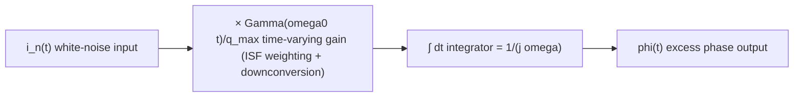

> **β**: This English translation is in beta — the Traditional-Chinese original is the authoritative version.

# The DSP View of Phase Noise

> Prerequisites: [stochastic_noise_basics](/02_foundations/stochastic_noise_basics) · [white_noise_to_phase_noise](/03_isf_core_theory/white_noise_to_phase_noise) ｜ Next: [psd_phase_noise_jitter](/02_foundations/psd_phase_noise_jitter)

The previous two pages computed phase noise from the circuit and from the frequency domain; this page puts on a different pair of glasses — **re-examining the same thing from a signal-processing (DSP) viewpoint**: treat the excess phase $\phi(t)$ as the **output of a linear system** whose input is the noise current, passing through two blocks: (1) a **time-varying gain** $\Gamma(\omega_0 t)/q_{max}$ (ISF weighting), and (2) an **ideal integrator** $\int dt$.

The payoff of this viewpoint is large: once you draw it as a block diagram, you immediately see that the $-20$ dB/dec (1/f²) slope of phase noise **is no coincidence at all — it is simply the frequency response of the integrator**. At the same time, this is the bridge that translates the continuous-time integral of [P1] Eq.(11) into the "discrete-time simulation code" (lab_06).

> **Physical intuition (big picture first)**: an integrator turns "something white" into "something that grows toward low frequency". Feed white noise
> through an integrator and the output PSD carries a $1/\omega^2$ — that is 1/f² phase noise. The ISF merely
> "phase-weights and downconverts" the input before the integration. **Phase noise = ISF-weighted white noise, shaped by the integrator.**

## 1. Reading [P1] Eq.(11) as a signal-processing chain

The central equation of [P1] (spec §3, formula 4):

$$
\phi(t)=\frac{1}{q_{max}}\int_{-\infty}^{t}\Gamma(\omega_0\tau)\,i_n(\tau)\,d\tau .
$$

The DSP decomposition: first define the "ISF-weighted equivalent noise current"

$$
y(\tau)\equiv\frac{\Gamma(\omega_0\tau)}{q_{max}}\,i_n(\tau),
$$

so that $\phi(t)=\int_{-\infty}^{t}y(\tau)\,d\tau$ — **$\phi$ is the running integral of $y$**.
As a block diagram:



- **Block B (ISF weighting) is LTV (linear time-varying)**: the gain varies periodically in time (period $T$) — this is
  the mathematical embodiment of [P1]'s emphasis that "an oscillator is time-variant, not time-invariant, toward noise" (claim C1).
  Its role is **frequency translation**: it "downconverts" noise near $n\omega_0$ to baseband ([P1] Eq.(13), Fig. 8).
- **Block C (the integrator) is LTI (linear time-invariant)**: its frequency response is exactly $1/(j\omega)$.

## 2. Why the integrator 1/(jω) turns white noise into 1/f² (origin of the signature slope)

An ideal integrator $\phi(t)=\int y\,dt$ divides by $j\omega$ in the frequency domain:

$$
\Phi(j\omega)=\frac{1}{j\omega}\,Y(j\omega)\quad\Longrightarrow\quad
|H_{\text{int}}(j\omega)|^2=\frac{1}{\omega^2}.
$$

The rule for PSDs through a linear system is **$S_{\text{out}}=|H|^2\,S_{\text{in}}$**. If the ISF-weighted equivalent input
$y$ is approximately white in the offset band we care about (power $\propto\Gamma_{rms}^2 S_i/q_{max}^2$), then:

$$
\boxed{\ S_\phi(\Delta\omega)=|H_{\text{int}}|^2\,S_y=\frac{1}{\Delta\omega^2}\cdot\frac{\Gamma_{rms}^2}{q_{max}^2}\,S_i\ }
$$

- **dimension check**: $[1/(\text{rad/s})^2]\times[(\text{rad}^2)\cdot\text{A}^2/\text{Hz}/\text{C}^2]$.
  $\Gamma$ is dimensionless, $q_{max}$ is C, $S_i$ is $\text{A}^2/\text{Hz}=\text{C}^2/(\text{s}^2\cdot\text{Hz})$;
  collecting terms gives $\text{rad}^2/\text{Hz}$ (treating the rad² in $1/(\text{rad/s})^2$ as phase rad²), consistent with the units of $S_\phi$ ✓.
- **This is the 1/f²**: $S_\phi\propto1/\Delta\omega^2$, i.e. $-20$ dB/dec on a log-log plot.
  Expressed in dBc/Hz ($\mathcal{L}\approx\frac12 S_\phi$), the skirt is still $-20$ dB/dec.
- **Comparison with [P1] Eq.(21) (including the famous factor-of-2)**: the clean time-domain derivation "white noise × ISF → integrate"
  gives $\mathcal{L}=\Gamma_{rms}^2 S_i/(2q_{max}^2\Delta\omega^2)$, whereas [P1] Eq.(21) is written with
  $/(4\Delta\omega^2)$. The factor of 2 comes purely from the SSB bookkeeping convention ($\mathcal{L}\approx\frac12 S_\phi$),
  and **does not affect** the $\Gamma_{rms}^2/q_{max}^2$ scaling or the $-20$ dB/dec slope. Full discussion in
  [white_noise_to_phase_noise](/03_isf_core_theory/white_noise_to_phase_noise).
- **Extension to flicker**: if the input is not white but 1/f ([P1] Eq.(22)), the same $1/\omega^2$
  integrator produces $1/\omega^3$ at the output — the close-in 1/f³ phase noise ([P1] Eq.(23)).
  The DSP view unifies "1/f² and 1/f³" as "the same integrator acting on inputs of different colors".

> **This also explains "why phase accumulates but amplitude does not"**: the integrator has **infinite DC gain** ($1/\omega\to\infty$
> when $\omega\to0$), so phase is infinitely sensitive to very-low-frequency perturbations and random-walks away (no restoring force);
> the amplitude path instead has a decaying (restoring) pole — high-pass / finite gain — so perturbations get pulled back. Compare
> [phase_vs_amplitude_noise](/02_foundations/phase_vs_amplitude_noise) (claim C2).

## 3. From continuous time to discrete simulation: turning the formula into code (lab_06)

To verify the theory on a computer, the continuous integral must be replaced by a discrete accumulation. With sampling frequency $f_s$ and interval
$\Delta t_s=1/f_s$, the discrete version of [P1] Eq.(11) is a **cumulative sum**:

$$
\phi[k]=\frac{\Delta t_s}{q_{max}}\sum_{m=0}^{k}\Gamma(\omega_0\,m\,\Delta t_s)\,i_n[m].
$$

- **The role of $\Delta t_s$**: it calibrates the "discrete sum" back to the physical dimensions of an "integral". Dropping $\Delta t_s$ is the most common
  discretization mistake (the units end up off by a factor of $f_s$).
- **PSD of discrete white noise**: to generate a white sequence with single-sided PSD $S_i$, the variance of each sample must be set to
  $\sigma^2=S_i\cdot f_s/2$ (the single-to-double-sided factor of 2 and the sampling bandwidth $f_s/2$). This constant
  must match the analytic expression, or the numerics will not lie on the theory line.
- **`cumsum` = the integrator**: `numpy.cumsum` is the discrete integrator; its frequency response approaches $1/\omega$ at low frequency —
  exactly the source of our 1/f².

The corresponding core code (using the real functions of spec §5):

```python
import numpy as np
from simulations.common.noise_utils import white_noise, estimate_psd
from simulations.common.isf_utils import apply_isf_weighting, gamma_lc_ideal

# 0) time axis
t = np.arange(N) / fs

# 1) generate the white noise-current sequence i_n[m], single-sided PSD = S_i
i_n = white_noise(n=N, psd=1e-24, fs=fs, rng=rng)          # A, white

# 2a) ISF weighting (time-varying multiply only, with NO integration): y[m] = Gamma(w0 t)/qmax * i_n
y = apply_isf_weighting(t, i_n, gamma_func=gamma_lc_ideal, qmax=1e-12, omega0=2*np.pi*5e9)

# 2b) integrator: phi[k] = dt * cumsum(y) — cumsum×dt is the true discrete integral
dt = 1.0 / fs
phi = np.cumsum(y) * dt

# 3) Welch PSD estimate, verify S_phi ∝ 1/f^2
f, S_phi = estimate_psd(phi, fs=fs, nperseg=4096)
```

Full script: `simulations/lab_06_white_noise_phase_noise.py` (see
[lab_06](/04_simulation_labs/lab_06_white_noise_phase_noise)). This is a
**pedagogical toy model** (ideal-LC $\Gamma=-\sin\theta$, a single white-noise source), not transistor-level.

## 4. Welch PSD estimation: how to "measure" S_φ(f)

You have simulated a time series $\phi[k]$; how do you recover its PSD $S_\phi(f)$ to compare against the theoretical 1/f²?
A single FFT with the squared magnitude (the periodogram) has an estimator variance that **does not decrease as the record gets longer** —
the estimate stays wildly noisy. **Welch's method** solves this:

1. Split the long sequence into segments (each `nperseg` points long), optionally overlapping (typically 50%).
2. Multiply each segment by a window (a window function, e.g. Hann, to suppress spectral leakage).
3. Take the periodogram of each segment, then **average**. Averaging $K$ segments lowers the estimator variance by about $1/K$.

- **trade-off**: shorter segments → more segments to average, smoother, but **worse frequency resolution** ($\Delta f\approx f_s/\text{nperseg}$) —
  the close-in 1/f² details get smeared out. Longer segments → better resolution but noisier. Seeing the close-in 1/f² requires
  long segments + long records.
- **This site uses `estimate_psd(x, fs, nperseg)`** (spec §5, `noise_utils`) for this; the lab_06
  figure overlays the Welch estimate (dots) on the analytic 1/f² line (solid), and the two agree.


The figure above (`simulations/lab_06_white_noise_phase_noise.py`, corresponding to spec §4
`white_noise_phase_noise_psd.png`) is the "seeing is believing" of this DSP chain: white-noise input → ISF weighting →
`cumsum` integrator → Welch estimate, giving an $S_\phi$ that is a clean $-20$ dB/dec on log-log,
coinciding with the analytic $1/\Delta\omega^2$ of Section 2.

## 5. Sampling and aliasing: the easiest traps to step into from the DSP viewpoint

When moving a continuous system into a discrete simulation, **aliasing (frequencies above Nyquist folding back to low frequency and masquerading as others)**
is the number-one pitfall, and ISF simulations require particular care:

- **The Nyquist iron law**: $f_s$ must be $\ge2\times$ the highest signal frequency. The ISF weighting contains $\Gamma(\omega_0 t)$ and
  its harmonics $n\omega_0$, so your $f_s$ must be not merely $>2f_0$ but ideally $\gg f_0$ (covering the few ISF
  harmonics $n\omega_0$ you care about); otherwise the downconversion of higher harmonics gets contaminated by aliasing, and the 1/f² line kicks up at high offsets.
- **White noise is inherently aliased**: ideal white noise has infinite bandwidth, and discrete sampling inevitably folds all frequencies into $[0,f_s/2]$.
  That is fine — as long as $f_s$ is high enough and we only interpret the offset band $\ll f_s/2$. When reporting a PSD,
  trust only the band far below Nyquist.
- **The integrator's DC singularity**: $1/\omega$ diverges as $\omega\to0$; a discrete `cumsum` manifests as a
  random walk (unbounded drift). In simulation, either look only at a finite offset band or detrend $\phi$;
  otherwise the lowest few PSD bins are dominated by drift — this is exactly the numerical version of
  "$\phi$ is not stationary; do statistics on phase differences/frequency" mentioned in Section 5 of
  [stochastic_noise_basics](/02_foundations/stochastic_noise_basics).

## 6. Continuous ↔ discrete correspondence table

| Continuous time ([P1]) | Discrete simulation (lab_06) | Caveats |
|---|---|---|
| $\int_{-\infty}^{t}(\cdot)\,d\tau$ | `numpy.cumsum(...) * dt` | do not drop $\Delta t_s=1/f_s$ |
| $\Gamma(\omega_0\tau)$ time-varying gain | `gamma_func(omega0 * t)` pointwise multiply | LTV: a different gain per sample |
| white PSD $S_i$ ($\text{A}^2/\text{Hz}$) | sample variance $\sigma^2=S_i f_s/2$ | single↔double-sided factor of 2 |
| $1/(j\omega)$ integrator → 1/f² | low-frequency response of `cumsum` | DC singularity → drift; detrend |
| theoretical $S_\phi(f)$ curve | `estimate_psd` (Welch) | segment length vs resolution trade-off |
| continuous frequency $\Delta\omega$ | bin frequency $f<f_s/2$ | trust only bands far below Nyquist |

## Applicability and failure conditions

| Condition | When it holds | When it fails |
|---|---|---|
| Linear superposition (small perturbations) | $S_{\text{out}}=\lvert H\rvert^2 S_{\text{in}}$ applies | large injection is nonlinear, AM–PM; must remodel |
| $f_s\gg f_0$ and covers the harmonics of interest | clean 1/f² line | aliasing folds high harmonics back; high offsets kick up |
| Interpret only offsets $\ll f_s/2$ | PSD trustworthy | bins near Nyquist untrustworthy |
| Welch segment length matched to the band of interest | close-in 1/f² resolved | segments too short smear low offsets; too long, too noisy |
| Detrend $\phi$ / use phase differences | avoids the random-walk drift | FFT of raw $\phi$: lowest bins dominated by drift |

## Corresponding papers / formulas

- The phase integral (decomposed by DSP into "ISF weighting + integrator"): [P1] Eq.(11), p.182 (spec formula 4).
- LTV / frequency translation (ISF harmonic downconversion): [P1] Eq.(13), Fig. 8, p.183 (claim C1).
- The signature white noise → 1/f² result: [P1] Eq.(21), p.185; factor-of-2 note in spec §3.
- flicker → 1/f³ (the same integrator acting on a 1/f input): [P1] Eqs.(22),(23), p.185.
- Figure: `white_noise_phase_noise_psd.png` (lab_06), corresponding to spec §4.
- The DSP tools (Welch / aliasing / windowing) are standard signal processing, **not among the five source PDFs**; supplied from standard
  references.

## Key takeaways

- The DSP model of phase noise: **white noise $\to$ ISF time-varying weighting (LTV, frequency translation) $\to$ integrator
  $1/(j\omega)$ (LTI) $\to\phi$**.
- The integrator's $|H|^2=1/\omega^2$ **is** the source of the 1/f² ($-20$ dB/dec) slope; a 1/f input → 1/f³.
- Discretization: integral = `cumsum × dt`; white-noise variance $=S_i f_s/2$; do not drop $\Delta t_s$.
- Welch PSD: segment + window + average to lower the estimator variance; trade segment length against resolution.
- Aliasing: $f_s\gg f_0$ and cover the harmonics of interest; trust only offsets $\ll f_s/2$; detrend $\phi$ to avoid drift domination.
- Matches the analytic result (lab_06 figure); the factor of 2 is just SSB bookkeeping and changes neither the scaling nor the slope.

## Further reading

- The analytic white noise → 1/f² (with the factor-of-2 discussion): [white_noise_to_phase_noise](/03_isf_core_theory/white_noise_to_phase_noise)
- Stochastic-process prerequisites (PSD / Parseval / cyclostationary): [stochastic_noise_basics](/02_foundations/stochastic_noise_basics)
- Converting phase noise into jitter: [psd_phase_noise_jitter](/02_foundations/psd_phase_noise_jitter)
- Simulation lab: [lab_06](/04_simulation_labs/lab_06_white_noise_phase_noise)
- Why phase integrates while amplitude decays: [phase_vs_amplitude_noise](/02_foundations/phase_vs_amplitude_noise)
