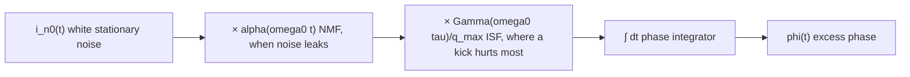

> **β**: This English translation is in beta — the Traditional-Chinese original is the authoritative version.

# Stochastic Noise Basics

> Prerequisites: [lti_vs_ltv](/02_foundations/lti_vs_ltv) · [Notation](/00_overview/notation) | Next: [white_noise_to_phase_noise](/03_isf_core_theory/white_noise_to_phase_noise)

This page answers a prerequisite question: **before we can talk about the ISF, we have to pin down "noise" as a stochastic process.**
Phase jitter in an oscillator originates from the random currents $i_n(t)$ of transistors and resistors. Before feeding it into
the phase integral of [P1] Eq.(11), we need to know: how to quantify the "strength" of this random current (PSD),
how to recover time-domain power from the PSD (Parseval), whether it is correlated across time instants (autocorrelation),
whether a single measurement can represent the whole ensemble (ergodicity), and — most critical for oscillators —
**whether the noise intensity itself varies periodically with the oscillation phase (cyclostationary)**.

That last point is the core of [effective_isf](/03_isf_core_theory/effective_isf) later on: the transistor leaks noise only
during the short window when it conducts, and where that window falls in the waveform's phase determines which segment of the ISF weights it.

> **Physical intuition (big picture first)**: think of noise as "an invisible hand randomly kicking the oscillator at every instant."
> We need two independent pieces of information: (1) **how hard the hand kicks on average** (intensity, measured by the PSD); (2) **when
> the hand kicks hardest** (time modulation, described by cyclostationarity / the NMF). The ISF is the third item:
> "**at which phase of the waveform a kick changes the phase the most**." Multiply the three together and integrate — that is phase noise.

## 1. White noise

**White noise (a stochastic process whose power spectrum is flat at all frequencies).** The name comes from white light —
all frequency components with equal strength. Its single-sided PSD (power spectral density) is constant:

$$
S_i(f)=\frac{\overline{i_n^2}}{\Delta f}=\text{const}.
$$

- **Units**: current-noise PSD is in $\text{A}^2/\text{Hz}$ (mean-square current per Hz of bandwidth).
  Typical thermal-noise expressions: $\overline{i_n^2}/\Delta f=4kT/R$ (resistor) or $4kT\gamma g_m$ (MOS channel).
- **Dimension check**: $\overline{i_n^2}$ is $\text{A}^2$; dividing by the bandwidth $\Delta f$ (Hz) gives $\text{A}^2/\text{Hz}$ ✓.
- **Physical origin**: thermal noise (random thermal motion of carriers) and shot noise (discreteness of
  carriers crossing a barrier) can both be treated as white over the frequency range we care about.
- **Canonical value**: this site's white-noise source uses $S_i=10^{-24}\ \text{A}^2/\text{Hz}$ (see canonical example B).
  This corresponds to a current-noise density of $\sqrt{S_i}=10^{-12}\ \text{A}/\sqrt{\text{Hz}}=1\ \text{pA}/\sqrt{\text{Hz}}$.

> **Why oscillators care about white noise**: white noise has equal-strength components near every $n\omega_0$; each ISF harmonic
> $c_n$ "downconverts" the white noise of the corresponding band to near the carrier, forming the 1/f² ($-20$ dB/dec)
> phase-noise skirt. This is exactly the content of [P1] Eq.(21) — see
> [white_noise_to_phase_noise](/03_isf_core_theory/white_noise_to_phase_noise).

## 2. Flicker (1/f) noise

**Flicker noise (also called 1/f noise: low-frequency noise whose power rises inversely with frequency).** In
MOS devices it mainly comes from carriers being randomly captured/released by interface traps. Its PSD is not flat:

$$
S_{i,1/f}(f)=\overline{i_n^2}\cdot\frac{\omega_{1/f}}{\Delta\omega}\qquad(\Delta\omega < \omega_{1/f}),
$$

which is exactly the device flicker model of [P1] Eq.(22), p.185 (site spec Section 3, formula 13).

- **Units**: still $\text{A}^2/\text{Hz}$. $\omega_{1/f}$ is the device's **1/f corner** (angular frequency,
  rad/s) — the frequency at which the 1/f component's strength equals the white-noise floor.
- **Dimension check**: $\overline{i_n^2}$ ($\text{A}^2/\text{Hz}$) $\times\ \omega_{1/f}/\Delta\omega$
  (dimensionless ratio) $=\text{A}^2/\text{Hz}$ ✓.
- **Key pitfall**: the device 1/f corner $\omega_{1/f}$ is **not equal to** the phase-noise 1/f³ corner.
  The latter is $\Delta\omega_{1/f^3}=\omega_{1/f}\cdot c_0^2/(2\Gamma_{rms}^2)$ ([P1] Eq.(24)),
  upconverted only through the ISF's DC coefficient $c_0$. A symmetric waveform (small $c_0$) can push the 1/f³ corner far below
  the device corner — see [symmetry](/06_design_insights/symmetry) (claim C5).

| Noise type | PSD shape | Physical origin | Becomes, in phase noise |
|---|---|---|---|
| white | flat (const $\text{A}^2/\text{Hz}$) | thermal / shot | 1/f² ($-20$ dB/dec) |
| flicker (1/f) | $\propto 1/f$ | trap capture/release | 1/f³ ($-30$ dB/dec), via $c_0$ only |

## 3. PSD and Parseval: frequency-domain intensity ↔ time-domain power

The **PSD (power spectral density)** tells you "how much power per unit bandwidth." Integrating it over frequency gives the
total time-domain power (variance). This is **Parseval's theorem (time-domain energy = frequency-domain energy)** in its stochastic-process form:

$$
\overline{i_n^2}=\int_0^{\infty}S_i(f)\,df\qquad(\text{單邊 PSD}).
$$

- **Units**: left side $\text{A}^2$; right side $(\text{A}^2/\text{Hz})\times\text{Hz}=\text{A}^2$ ✓.
- **Intuition**: the PSD is a "density of power," and integrating means "multiply density by bandwidth and add it up." For white noise
  this integral diverges — so any real system has a finite bandwidth, and white noise is only an in-band approximation.
- **Why it matters**: phase noise plays the same trick — integrate the phase PSD $S_\phi(f)$ over offset frequency
  to get the phase variance $\sigma_\phi^2$, then convert to rms jitter. Full derivation in
  [psd_phase_noise_jitter](/02_foundations/psd_phase_noise_jitter).

> **Convention**: this site uses the **single-sided PSD** (positive frequencies only, $0\le f<\infty$).
> If you switch to the double-sided ($-\infty<f<\infty$) PSD, the value at each frequency is divided by 2. This factor-of-2 convention
> is the same class of bookkeeping issue as the SSB phase-noise relation $\mathcal{L}\approx\frac12 S_\phi$,
> discussed in detail in [white_noise_to_phase_noise](/03_isf_core_theory/white_noise_to_phase_noise).

## 4. Autocorrelation and the real definition of "white"

**Autocorrelation (how correlated one stochastic process is between two time instants)**:

$$
R_i(\tau)=\overline{i_n(t)\,i_n(t+\tau)}.
$$

- **Units**: $\text{A}^2$ (the expectation of a product of two currents).
- **Wiener–Khinchin theorem**: autocorrelation and PSD are a Fourier pair. White noise has a flat PSD,
  corresponding to a delta-function autocorrelation: $R_i(\tau)=\dfrac{\overline{i_n^2}}{\Delta f}\,\delta(\tau)$.
- **Intuition**: white noise's "value now" is **completely uncorrelated** with its "value the next instant" (zero memory). This is exactly why,
  in the phase integral of [P1] Eq.(11), noise contributions at different instants can be superposed independently — it turns
  the phase-variance calculation into "square and add term by term" with no cross-correlation terms to handle.
- **Flicker counterexample**: 1/f noise has a long autocorrelation tail (long memory, strong correlation),
  which is also why it is hard to integrate and hard to simulate (see the aliasing caveats on the DSP page).

## 5. Ergodicity

**Ergodicity (the property that "time average = ensemble average").**

- **Plain language**: you have only one oscillator and measure one long waveform (time average); the theory speaks of the statistics of
  infinitely many identical oscillators at the same instant (ensemble average). Ergodicity guarantees the two are equal —
  otherwise "measuring one device" could never validate "the ensemble statistics predicted by theory."
- **Applicability**: the process must be stationary (statistics do not drift with time) before ergodicity is even on the table. Thermal noise qualifies.
- **Failure warning**: the oscillator's **excess phase $\phi(t)$ itself is not stationary** — it is a random walk
  (variance grows linearly with time; see accumulated jitter $\sigma_{\Delta t}=\kappa\sqrt{\Delta t}$,
  [P2] Eq.(8)). So we do statistics on "the time derivative of phase (frequency)" or on "phase differences," not on
  the absolute value of $\phi$. This subtlety is retold in [dsp_view_of_phase_noise](/02_foundations/dsp_view_of_phase_noise)
  from the "1/(jω) integrator turns white noise into 1/f²" viewpoint.

## 6. Cyclostationary noise — this page's focus, straight into the effective ISF

**Cyclostationary noise (a stochastic process whose statistics vary "periodically" with time).**
[P1] Sec. III-D, p.186 says it plainly:

> "the channel noise of a MOS device in an oscillator is cyclostationary because the
> noise power is modulated by the gate-source overdrive which varies with time
> periodically." ([P1], p.186, cyclostationary paragraph)

In other words: **the transistor does not leak the same amount of noise at every instant.** It is noisy only during the short window
when it conducts (large current, large overdrive); the rest of the time it is nearly silent. And "conducting" is locked to the
oscillation waveform — repeating once per period $T$. That is "cyclostationarity."

[P1] decomposes a white cyclostationary current as ([P1] Eq.(25), p.186):

$$
i_n(t)=i_{n0}(t)\cdot\alpha(\omega_0 t),
$$

where $i_{n0}(t)$ is a white **stationary** process (fixed intensity) and $\alpha(\omega_0 t)$ is a
**deterministic, periodic, normalized (max = 1)** function describing "when the noise amplitude
gets turned up or down." This site calls it the **NMF — noise-modulating function**,
symbol $\alpha(\omega_0 t)$, $0\le\alpha\le1$, dimensionless (see the notation page).

- **Units**: $\alpha$ is dimensionless (it is a normalized envelope); $i_{n0}$ and $i_n$ are both in A.
- **Dimension check**: $\text{A}=\text{A}\times(\text{無因次})$ ✓.
- **Meaning of $\alpha^2$**: because the PSD deals in power ($i^2$), the noise's **instantaneous mean-square power**
  is proportional to $\alpha^2(\omega_0 t)$. The maximum instantaneous PSD $=\overline{i_n^2}/\Delta f$;
  at all other times it is suppressed by $\alpha^2\le1$.

### Why this leads straight to the ISF: the effective ISF

Substitute the cyclostationary decomposition into the phase integral [P1] Eq.(11): the noise contribution at instant $\tau$
is weighted by $\Gamma(\omega_0\tau)$, while its own intensity is modulated by $\alpha(\omega_0\tau)$. The **product** of the two
periodic functions can be packaged into a single **effective ISF** ([P1] Eq.(27), p.186):

$$
\boxed{\ \Gamma_{eff}(\omega_0\tau)=\Gamma(\omega_0\tau)\cdot\alpha(\omega_0\tau)\ }
$$

In [P1]'s own words:

> "the cyclostationary noise can be treated as a stationary noise applied to a system
> with an effective ISF." ([P1], p.186)

Meaning: **just replace $\Gamma$ with $\Gamma_{eff}=\Gamma\cdot\alpha$, and every downstream formula ($c_n$,
$\Gamma_{rms}$, Eq.(21), Eq.(23)) carries over unchanged.** Cyclostationarity does not need a new theory;
it only changes which curve you take the Fourier coefficients of.

- **Units**: $\Gamma_{eff}$ is still dimensionless (dimensionless $\Gamma$ × dimensionless $\alpha$) ✓.
- **Teaching point**: when computing $c_n$ and $\Gamma_{rms}$, use $\Gamma_{eff}$ (i.e., as [P1] puts it, "the effective ISF
  should be used in all subsequent calculations"), not the bare $\Gamma$.

### LC vs ring: the cyclostationary impact differs enormously ([P1]'s beautiful conclusion)

[P1], p.186 gives two contrasting examples of great pedagogical value:

| Oscillator | Large current (large $\alpha$) occurs at | $\Gamma$ there | Cyclostationary impact |
|---|---|---|---|
| **Colpitts LC** | tank-voltage minimum (trough) | **small** (ISF is small at peaks/troughs) | $\Gamma_{eff}$ differs **a lot** from $\Gamma$; cannot be ignored |
| **ring (single-ended)** | transitions (zero crossings, max slope) | **large** (ISF is large at transitions) | $\Gamma_{eff}\approx\Gamma$; small impact |

[P1]'s reading: the Colpitts transistor "turns on only where the ISF is small" — nature effectively injects its noise at
insensitive phases, so cyclostationarity **helps the LC**. The ring is unlucky: the maximum current occurs exactly at the
most sensitive transitions, so noise and sensitivity peak simultaneously. [P1] calls it out directly:

> "This unfortunate coincidence is one of the reasons why ring oscillators in general
> have inferior phase noise performance compared to a Colpitts LC oscillator." ([P1], p.186)

This is one of the two big reasons "LC is cleaner than ring" (the other: a ring burns all of its stored energy every period).
Quantitative discussion in [P2] and [lc_vs_ring](/06_design_insights/lc_vs_ring).

> **Toy-model reminder**: later pages use toy shapes for $\alpha(\omega_0 t)$ (e.g., setting the NMF to a conduction window)
> to demonstrate how $\Gamma_{eff}=\Gamma\cdot\alpha$ changes $c_0$ and $\Gamma_{rms}$; these are
> pedagogical toy models, not transistor-level. The real $\alpha$ must be extracted from the device noise model
> and operating point ([P1] states "$\alpha$ can be derived easily from device noise
> characteristics and operating point").

## Connecting this page to the ISF in one sentence

The full phase-noise recipe is the product of three periodic/stochastic quantities, then integrated:

The two "×" signs in the middle are the origin of the effective ISF $\Gamma_{eff}=\Gamma\cdot\alpha$; the final integrator
is what turns white noise into 1/f² (see the DSP viewpoint linked in the next section).

## Applicability and failure conditions

| Condition | When it holds | When it fails |
|---|---|---|
| stationary (thermal noise) | ergodicity holds; measuring one device represents the ensemble | drift/aging → re-measure |
| white approximation | flat PSD, delta autocorrelation, contributions superpose independently | inside the 1/f region, switch to the flicker model |
| cyclostationarity packaged as $\Gamma_{eff}=\Gamma\cdot\alpha$ | small perturbation; $\alpha$ periodic and normalized | strong nonlinearity coupling $\alpha$ to the signal calls for more care |
| phase described as a random walk | do statistics on phase differences/frequency | time-averaging the absolute value of $\phi$ directly diverges |

## Key takeaways

- **White noise**: flat PSD ($\text{A}^2/\text{Hz}$), delta autocorrelation, memoryless; becomes 1/f² under the ISF.
- **Flicker (1/f) noise**: $S\propto1/f$ ([P1] Eq.(22)); upconverts to 1/f³ only via $c_0$;
  device corner $\neq$ 1/f³ corner.
- **PSD ↔ Parseval**: integrating the PSD gives time-domain power (variance); units self-consistent $\text{A}^2/\text{Hz}\times\text{Hz}=\text{A}^2$.
- **Autocorrelation**: white = delta (memoryless); 1/f = long tail (strongly correlated).
- **Ergodicity**: time average = ensemble average; but $\phi$ is a random walk, non-stationary —
  do statistics on phase differences/frequency.
- **Cyclostationary (this page's protagonist)**: noise intensity varies periodically with the oscillation phase (the transistor leaks noise only while conducting);
  described by the NMF $\alpha(\omega_0 t)$ and packaged as $\Gamma_{eff}=\Gamma\cdot\alpha$ ([P1] Eq.(25)–(27));
  LC benefits, ring suffers.
- Sources: [P1] Sec. III-D (cyclostationary) Eqs.(25)–(27), p.186; device flicker Eq.(22), p.185; claims C9.

## Further reading

- How the phase PSD integrates into jitter: [psd_phase_noise_jitter](/02_foundations/psd_phase_noise_jitter)
- The DSP view of phase = a stochastic process weighted by the ISF and processed by an integrator: [dsp_view_of_phase_noise](/02_foundations/dsp_view_of_phase_noise)
- Full derivation and extraction of the effective ISF: [effective_isf](/03_isf_core_theory/effective_isf)
- How white noise becomes 1/f² phase noise: [white_noise_to_phase_noise](/03_isf_core_theory/white_noise_to_phase_noise)
- ISF Fourier coefficients $c_n$, $c_0$, and symmetry: [fourier_series_of_isf](/03_isf_core_theory/fourier_series_of_isf), [symmetry](/06_design_insights/symmetry)
