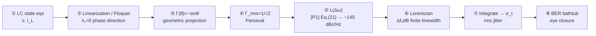

> **β**: This English translation is in beta — the Traditional-Chinese original is the authoritative version.

# Capstone — One Ideal LC from State Equations to BER (Fully Rigorous, End to End)

This page is the site's **main spine**: take **one ideal lossless parallel LC oscillator**, start from the lowest-level
**state equations**, skip nothing, keep every step rigorous and numerical, and push all the way to the
**BER (bit error rate) bathtub curve** that a communications engineer ultimately reads. Finish this page and you
hold the entire ISF phase-noise theory as one unbroken chain — every other page on the site is a zoomed-in view
of some segment of this spine.

> **Physical intuition (the whole chain up front)**: the LC's energy sloshes losslessly back and forth between the
> inductor and the capacitor → it traces a **limit cycle** in the 2-D state plane. A noise current pokes it; the
> resulting displacement decomposes into "tangential along the cycle = phase" and "radial perpendicular to the cycle = amplitude";
> amplitude has a restoring force and gets pulled back, phase has no restoring force and **accumulates permanently** —
> the weight "how much permanent phase per unit injected charge" is the **ISF $\Gamma(\theta)$**, and for the ideal LC
> it comes out exactly $-\sin\theta$. Weight the white noise by $\Gamma$ and **integrate** (the integrator
> gives $1/\omega^2$) and you get the $1/f^2$ phase noise $\mathcal{L}(\Delta\omega)$. This $1/f^2$ appears to diverge as $\Delta\omega\to0$,
> but near the carrier it actually flattens into a **Lorentzian** with a finite linewidth $\Delta f_{3\mathrm{dB}}$. Integrate
> $\mathcal{L}$ over offset frequency, take the square root, divide by $2\pi f_0$ to get the **rms jitter $\sigma_t$**; finally $\sigma_t$
> eats the eye from both sides and sets the **BER**. **One sentence: state geometry → ISF → integration → spectrum → linewidth → jitter → BER.**

The spine has 8 stations, each of which corresponds to the in-depth version on some page of the site; this page welds
them into an unbroken chain and walks the **same set of canonical numbers**
($q_{max}=1$ pC, $\Gamma_{rms}=1/\sqrt2$, $f_0=5$ GHz, $S_i=10^{-24}$ A²/Hz) all the way through.



---

## Station ①: LC state equations ($\dot v,\ \dot i_L$)

Take an **ideal lossless parallel LC**: inductor $L$ and capacitor $C$ in parallel, no resistive loss of any kind.
Describe it with two state variables — the capacitor voltage $v$ (V) and the inductor current $i_L$ (A). KCL at the
parallel node: current into the capacitor $=$ current out of the inductor; the inductor's $v$–$i$ relation is
$v=L\,di_L/dt$. Rearranged into a first-order state-equation system:

$$
\begin{aligned}
\dot v(t)&=\frac{dv}{dt}=-\frac{1}{C}\,i_L(t),\\
\dot i_L(t)&=\frac{di_L}{dt}=+\frac{1}{L}\,v(t).
\end{aligned}
$$

- **Physics used**: capacitor $i_C=C\,\dot v$, inductor $v_L=L\,\dot i_L$, plus the parallel-node KCL ($i_C=-i_L$; the current the capacitor releases flows into the inductor).
- **Unit check**: $[\dot v]=[\text{A}]/[\text{F}]=[\text{A}]/[\text{C/V}]=\text{V/s}$ ✓; $[\dot i_L]=[\text{V}]/[\text{H}]=[\text{V}]/[\text{Wb/A}]=\text{A/s}$ ✓
  (both right-hand sides are "time rate of change of a state").
- **As a vector field**: let the state be $\mathbf{x}=(v,\ i_L)^T$; then $\dot{\mathbf x}=A_0\mathbf x$, where


$$
A_0=\begin{pmatrix}0 & -1/C\\[2pt] 1/L & 0\end{pmatrix}.
$$

**Solving it (confirming it really oscillates)**: the eigenvalues $\lambda$ of $A_0$ satisfy $\lambda^2=-\dfrac{1}{LC}$, i.e.
$\lambda=\pm j\omega_0$, $\omega_0=\dfrac{1}{\sqrt{LC}}$ (rad/s). Purely imaginary eigenvalues → the solution is an **undamped sinusoid**:

$$
v(t)=V_{max}\cos(\omega_0 t),\qquad i_L(t)=\frac{V_{max}}{\omega_0 L}\sin(\omega_0 t).
$$

- **Unit check (frequency)**: $\omega_0=1/\sqrt{LC}$, $[\sqrt{\text{H}\cdot\text{F}}]=\sqrt{(\text{V s/A})(\text{A s/V})}=\sqrt{\text{s}^2}=\text{s}$,
  so $\omega_0$ is $1/\text{s}=\text{rad/s}$ ✓.
- **This is the marginally stable ideal limit**: no loss → the eigenvalues sit on the imaginary axis → the amplitude is set by the initial energy, neither growing nor decaying.
  A real LC has finite $Q$; an active circuit (cross-coupled pair) replenishes the loss to sustain constant amplitude — but the essence of the phase dynamics (Station ② onward) is the same.
- **Site cross-reference**: full 2-D state geometry in [isf_definition](/03_isf_core_theory/isf_definition) Step 2,
  numerical model in [lab_02](/04_simulation_labs/lab_02_lc_oscillator_toy_model).

**Injecting noise**: drive a noise current $i_n(t)$ into the **capacitor node** (it changes the current flowing into the capacitor, so it only touches $\dot v$):

$$
\dot v=-\frac{1}{C}\,i_L+\frac{1}{C}\,i_n(t),\qquad \dot i_L=\frac{1}{L}\,v.
$$

Write it in the standard perturbation form $\dot{\mathbf x}=A_0\mathbf x+B\,i_n$, where the **injection vector** $B=(1/C,\ 0)^T$ —
the mathematical ID card of "a current through the capacitor becomes $\dot v$" (the differential version of [P1] Eq.(9), p.182, $\Delta V=\Delta q/C$).

- **Unit check (B)**: $[B\,i_n]=[\text{A}]/[\text{F}]=\text{V/s}$, same units as $\dot v$ ✓.

> **This station delivers**: a clean set of linear state equations + an explicit noise-injection vector $B=(1/C,0)^T$.
> Every later station grows out of here.

---

## Station ②: Linearization / Floquet — why there is a phase direction that "never decays"

For the ideal LC, $A_0$ is a constant matrix (a linear circuit), so the "linearization" step is trivial — it is linear to begin with.
But the rigorous basis for **permanent phase accumulation** is **Floquet theory** (the solution structure of linear systems with periodic coefficients).
Here we take only the conclusion and map it onto the LC; the full proof is in [derivation_floquet_ppv](/99_appendix/derivation_floquet_ppv)
(that page explicitly marks Floquet/adjoint/PPV as **external literature, not among the 5 source PDFs**; primary source [E2] Demir 2000).

**Key theorem ([derivation_floquet_ppv](/99_appendix/derivation_floquet_ppv) Step 3)**: differentiate the steady-state solution
$\mathbf x_s(t)$ with respect to time; $\dot{\mathbf x}_s$ itself is **automatically a solution of the homogeneous perturbation equation**, and it is
**periodic, with no exponential factor** — corresponding to **Floquet exponent $\lambda_1=0$**. Physically, $\dot{\mathbf x}_s$ is
the tangential "walk along the trajectory" direction = the phase direction; $\lambda_1=0$ mathematically guarantees that a phase perturbation **neither grows nor decays — it is retained forever**.

Concrete verification for the LC: $\mathbf x_s(t)=V_{max}\big(\cos\omega_0 t,\ \tfrac{1}{\omega_0 L}\sin\omega_0 t\big)$,

$$
\dot{\mathbf x}_s(t)=V_{max}\,\omega_0\Big(-\sin\omega_0 t,\ \tfrac{1}{\omega_0 L}\cos\omega_0 t\Big).
$$

Substituting back into $\dot{(\,\cdot\,)}=A_0(\cdot)$ holds directly (that is exactly "it is itself a solution"), and it is purely periodic, $\lambda_1=0$ ✓.
The other direction (the amplitude direction) corresponds to $\lambda_2$: for the ideal lossless LC, $\lambda_2$ is also on the imaginary axis ($\mathrm{Re}\,\lambda_2=0$),
meaning the ideal LC does not even damp its amplitude; only **real loss + amplitude restoring** makes the amplitude direction
$\mathrm{Re}\,\lambda_2<0$ (decaying), so that "only phase persists forever" holds rigorously (see
[phase_vs_amplitude_noise](/02_foundations/phase_vs_amplitude_noise)).

- **Why this station is needed**: Station ③ will "project the perturbation onto the phase direction". Floquet tells us **what that direction is** (the $\dot{\mathbf x}_s$ with $\lambda_1=0$)
  and **why the projected phase accumulates permanently** (a neutral direction, no restoring force). Without this station, Station ③'s "projection" would be mere intuition.
- **Unit check**: the Floquet exponent $\lambda$ has units $1/\text{s}$, $\lambda_1=0$ (rad persists forever); $\lambda T$ is dimensionless ✓.
- **Rigorous correspondence**: [derivation_floquet_ppv](/99_appendix/derivation_floquet_ppv) proves that the ISF is **the component of the PPV (perturbation
  projection vector) at the injection node**: $\Gamma(\omega_0\tau)/q_{max}=v_1^T(\tau)\,\mathbf b$,
  where $\mathbf b=B$ is Station ①'s injection vector. Station ③ of this page computes this projection **by hand** using geometry, consistent with the PPV result.

> **This station delivers**: the phase direction $=\dot{\mathbf x}_s$ ($\lambda_1=0$, never decays). The next station projects the noise onto it.

---

## Station ③: Geometric projection yields $\Gamma(\theta)=-\sin\theta$

Now execute Station ②'s "project onto the phase direction" concretely for the LC. Normalize the state (take $V_{max}=1$ and rescale the $i_L$ axis to equal radius);
the limit cycle is the unit circle $\mathbf z(\theta)=(\cos\theta,\ \sin\theta)$, $\theta=\omega_0 t$, and the first component $v=\cos\theta$ is the tank voltage.

**Step A — state displacement caused by injection**: Station ①'s noise current only moves the capacitor voltage, $\Delta v=\Delta q/C$, so the displacement is along the $+v$ axis:

$$
\Delta\mathbf z=(\Delta v,\ 0)=\big(\tfrac{\Delta q}{C},\ 0\big).
$$

**Step B — tangential projection**. The tangent vector along the cycle is $\dfrac{\partial\mathbf z}{\partial\theta}=(-\sin\theta,\ \cos\theta)$, with norm
$\left|\partial\mathbf z/\partial\theta\right|=1$. Phase increment $=$ "tangential displacement" ÷ "arc length per unit $\theta$ along the cycle":

$$
\Delta\phi=\frac{\Delta\mathbf z\cdot(\partial\mathbf z/\partial\theta)}{\lvert\partial\mathbf z/\partial\theta\rvert^2}
=\frac{(\Delta v,0)\cdot(-\sin\theta,\cos\theta)}{\sin^2\theta+\cos^2\theta}
=\frac{-\sin\theta\,\Delta v}{1}=-\sin\theta\,\Delta v.
$$

**Step C — substitute $\Delta v=\Delta q/C$ and use $q_{max}=C\cdot V_{max}=C$ (normalized $V_{max}=1$)**:

$$
\boxed{\ \Delta\phi=-\sin\theta\,\frac{\Delta q}{C}=\frac{-\sin\theta}{q_{max}}\,\Delta q=\frac{\Gamma(\theta)}{q_{max}}\,\Delta q,\qquad \Gamma(\theta)=-\sin\theta.\ }
$$

- **Dimension check**: $\Delta\phi$ in rad (dimensionless); $\Delta q/q_{max}=\text{C}/\text{C}$ dimensionless; hence $\Gamma$ is dimensionless ✓
  (this is exactly why [P1] normalizes by $q_{max}$: it turns $\Gamma$ into a pure shape describing "where the waveform is sensitive").
- **Physics check**: $\theta=0$ (peak, $v=1$) → $\Gamma=0$; the kick becomes all amplitude (which gets pulled back).
  $\theta=\pi/2$ (rising zero crossing, $v=0$) → $\Gamma=-1$; the kick becomes all phase ($\vert\Gamma\vert$ maximal). Exactly as intuition demands.
- **Site cross-reference**: this expression is verbatim identical to the hands-on derivation in [isf_definition](/03_isf_core_theory/isf_definition),
  the numerical verification in [lab_02](/04_simulation_labs/lab_02_lc_oscillator_toy_model) (error $\sim$0.001),
  and the operational definition [impulse_to_phase_shift](/03_isf_core_theory/impulse_to_phase_shift).
- **Rigorous correspondence**: comparing with Station ②, $\Gamma(\theta)/q_{max}=v_1^T(\theta)\,B$ — the $-\sin\theta/q_{max}$ computed here by geometric projection
  is precisely the component of the PPV $v_1$ at the capacitor node ([derivation_floquet_ppv](/99_appendix/derivation_floquet_ppv) Step 6).


> **This station delivers**: the ideal LC's ISF $\Gamma(\theta)=-\sin\theta$ (analytic, dimensionless, $2\pi$-periodic).
> Note it has **only one harmonic** ($c_1=1$, all other $c_n=0$, $c_0=0$) — this cleanness lets every later step be done in your head.

---

## Station ④: $\Gamma_{rms}=1/\sqrt2$ (Parseval)

The phase-noise formula consumes only the ISF's **rms value** (no need for the individual $c_n$). $\Gamma_{rms}$ is defined as the root mean square over one period
(see [rms_isf](/03_isf_core_theory/rms_isf)):

$$
\Gamma_{rms}=\sqrt{\frac{1}{2\pi}\int_0^{2\pi}\lvert\Gamma(x)\rvert^2\,dx}.
$$

Substitute $\Gamma(x)=-\sin x$, use the half-angle identity $\sin^2 x=\tfrac12(1-\cos 2x)$, and the fact that $\cos 2x$ integrates to 0 over a full period:

$$
\begin{aligned}
\Gamma_{rms}^2&=\frac{1}{2\pi}\int_0^{2\pi}\sin^2 x\,dx
=\frac{1}{2\pi}\int_0^{2\pi}\frac{1-\cos 2x}{2}\,dx
=\frac{1}{2\pi}\cdot\frac{2\pi}{2}=\frac12,\\
\Gamma_{rms}&=\frac{1}{\sqrt2}\approx0.707.
\end{aligned}
$$

**Cross-check with Parseval** ([P1] Eq.(20), p.185; $\sum c_n^2=2\Gamma_{rms}^2$): the ideal LC has only $c_1=1$, all others 0, so

$$
\sum_{n=0}^{\infty}c_n^2=c_1^2=1=2\Gamma_{rms}^2\ \Longrightarrow\ \Gamma_{rms}^2=\tfrac12,\quad\Gamma_{rms}=\tfrac{1}{\sqrt2}.
$$

The two methods agree ✓.

- **Dimension check**: $\Gamma$ dimensionless → $\Gamma_{rms}$ dimensionless ✓.
- **Physical meaning**: the smaller $\Gamma_{rms}$, the lower the oscillator's "average efficiency" at converting noise into phase → the better the phase noise.
  $-\sin$'s $\Gamma_{rms}=0.707$ is the LC's signature value; a ring concentrates its sensitivity at the transitions, and with $\Gamma_{rms}\propto N^{-3/2}$
  ([P2] Eq.(16), p.794; the radical covers only the constant, confirmed by the text's 4/N^{1.5}@η=0.75) the stage count can push it down, but the LC's high $Q$ usually still wins (see [lc_vs_ring](/06_design_insights/lc_vs_ring)).

> **This station delivers**: $\Gamma_{rms}=1/\sqrt2$. It is the only ISF input to Station ⑤'s formula.

---

## Station ⑤: Plug into [P1] Eq.(21) to get $S_\phi/\mathcal{L}(\Delta\omega)$ (true-LC $-145$ dBc/Hz; spec example B $-148$, a 3 dB gap)

The complete derivation chain Eq.(19)→(20)→(21) — white noise $\times\Gamma$, then integrate (integrator $=1/(j\omega)$, giving $1/\omega^2$ → $-20$ dB/dec) —
is in [white_noise_to_phase_noise](/03_isf_core_theory/white_noise_to_phase_noise).
Here we use the signature result directly ([P1] Eq.(21), p.185):

$$
\mathcal{L}\{\Delta\omega\}=10\log_{10}\!\left(\frac{\Gamma_{rms}^2}{q_{max}^2}\cdot\frac{\overline{i_n^2}/\Delta f}{4\,\Delta\omega^2}\right)
$$

**Plug in canonical example B** ($f_0=5$ GHz, $\Delta f=1$ MHz, $q_{max}=1$ pC, $\Gamma_{rms}=1/\sqrt2$, $S_i=\overline{i_n^2}/\Delta f=10^{-24}$ A²/Hz).
Note that Station ④ of this page computed the LC's $\Gamma_{rms}=0.707$, whose square is $\Gamma_{rms}^2=0.5$ (spec example B uses the representative value $0.5$, i.e. $\Gamma_{rms}^2=0.25$;
this page uses the **true-LC** $\Gamma_{rms}^2=0.5$, which comes out 3 dB above spec example B — flagged clearly below).

**Step 1: offset angular frequency.**

$$
\Delta\omega=2\pi\Delta f=2\pi\times10^{6}=6.283\times10^{6}\ \text{rad/s},\qquad
\Delta\omega^2=3.948\times10^{13}\ \text{rad}^2/\text{s}^2.
$$

**Step 2: $\Gamma_{rms}^2/q_{max}^2$ (using the LC's $\Gamma_{rms}^2=0.5$).**

$$
\frac{\Gamma_{rms}^2}{q_{max}^2}=\frac{0.5}{(10^{-12}\,\text{C})^2}=\frac{0.5}{10^{-24}}=5.0\times10^{23}\ \text{C}^{-2}.
$$

**Step 3: $S_i/(4\Delta\omega^2)$.**

$$
\frac{S_i}{4\Delta\omega^2}=\frac{10^{-24}}{4\times3.948\times10^{13}}=6.332\times10^{-39}.
$$

**Step 4: multiply (the parenthesized term, linear).**

$$
\frac{\Gamma_{rms}^2}{q_{max}^2}\cdot\frac{S_i}{4\Delta\omega^2}=5.0\times10^{23}\times6.332\times10^{-39}=3.166\times10^{-15}.
$$

**Step 5: take $10\log_{10}$.**

$$
\mathcal{L}(1\,\text{MHz})=10\log_{10}(3.166\times10^{-15})=-145.0\ \text{dBc/Hz}.
$$

- **Alignment with spec example B's $-148$ dBc/Hz**: spec example B uses $\Gamma_{rms}=0.5$ ($\Gamma_{rms}^2=0.25$) and gets $-148.0$ dBc/Hz;
  this page uses the **true-LC** $\Gamma_{rms}=0.707$ ($\Gamma_{rms}^2=0.5$, exactly double) and gets $-145.0$ dBc/Hz, **exactly 3 dB higher**
  ($10\log_{10}2=3.01$). Both numbers are correct; the only difference is whether $\Gamma_{rms}$ takes the "representative value" or the "ideal $-\sin$ value".
  This page's spine sticks with $-\sin$'s $\Gamma_{rms}=1/\sqrt2$ throughout, so Stations ⑤–⑦ carry this value forward, marking the 3 dB gap to $-148$ at each point.
- **Dimension check**: inside the parentheses, $\text{C}^{-2}\cdot\dfrac{\text{A}^2/\text{Hz}}{(\text{rad/s})^2}$. With $\text{C}=\text{A}\cdot\text{s}$,
  $\text{C}^{-2}=\text{A}^{-2}\text{s}^{-2}$, $\dfrac{\text{A}^2\cdot\text{s}}{\text{s}^{-2}}=\text{A}^2\text{s}^3$; the product $=\text{s}=1/\text{Hz}$,
  and after $10\log_{10}$ it reads as dBc/Hz ✓.
- **Factor-of-2 note**: [P1] Eq.(21) uses the SSB $/4$ convention; this site's lab_06 clean time-domain version uses $/2$, which comes out another 3 dB higher.
  This does not affect the $\Gamma_{rms}^2/q_{max}^2$ scaling or the $-20$ dB/dec slope (see
  the factor-of-2 section of [white_noise_to_phase_noise](/03_isf_core_theory/white_noise_to_phase_noise)).

**Written as a phase PSD** (needed by Stations ⑥ and ⑦; small-angle $\mathcal{L}\approx\tfrac12 S_\phi$, clean time-domain version):

$$
S_\phi(f)=\frac{\Gamma_{rms}^2}{q_{max}^2}\cdot\frac{S_i}{(2\pi f)^2}\quad[\text{rad}^2/\text{Hz}].
$$

> **This station delivers**: $\mathcal{L}(1\text{MHz})=-145$ dBc/Hz (true LC value; spec representative value $-148$, a 3 dB gap),
> plus the closed-form $1/f^2$ $S_\phi(f)$. The next station resolves the "divergence as $\Delta\omega\to0$" paradox.

> **(v8 toolbox)** The $S_\phi$ here is the product of a single "white noise, single-sided, $\int_0^\infty$" convention;
> for how that convention rigorously yields the TIE / period / cycle-to-cycle jitter kernels, see
> [jitter_kernels](/02_foundations/jitter_kernels); for converting $\Gamma_{rms}^2/q_{max}^2$ into the diffusion
> constant $D$, linewidth, ADEV, and the other numbers different communities use, see [diffusion_dictionary](/03_isf_core_theory/diffusion_dictionary).

---

## Station ⑥: Lorentzian linewidth $\Delta f_{3\mathrm{dB}}$ (resolving the $1/f^2$ divergence paradox)

Station ⑤'s $S_\phi\propto1/\Delta\omega^2$ **diverges** as $\Delta\omega\to0$ — yet the total phase power cannot be infinite (carrier power is conserved).
The contradiction comes from "linearization treating phase as a random walk that can accumulate without bound". The rigorous treatment (phase diffusion →
carrier autocorrelation → Wiener–Khinchin) yields a **Lorentzian with a finite linewidth**. Full derivation in
[lorentzian_linewidth](/03_isf_core_theory/lorentzian_linewidth) (with **[E2] Demir 2000, not among the 5 source PDFs**);
here we take the result of spec sec. 11.2 and plug in the numbers.

**The phase diffusion coefficient $D$ (rad²/s)** is fixed by the coefficient of the $1/f^2$ skirt. Match the **single-sided** $S_\phi=4D/\Delta\omega^2$
(double-sided $2D/\Delta\omega^2$; spec sec. 11.2, v5 correction) against Station ⑤'s
$S_\phi=\dfrac{\Gamma_{rms}^2}{q_{max}^2}\dfrac{S_i}{\Delta\omega^2}$ (single-sided):

$$
D=\frac{\Gamma_{rms}^2}{4\,q_{max}^2}\,\frac{\overline{i_n^2}}{\Delta f}=\frac{\kappa^2}{2}.
$$

**Lorentzian spectrum and 3-dB linewidth (FWHM, full width at half maximum)** (spec sec. 11.2, v5 correction):

$$
S(\Delta\omega)\propto\frac{D}{D^2+\Delta\omega^2},\qquad
\boxed{\ \Delta f_{3\mathrm{dB}}=\frac{D}{\pi}=\frac{\Gamma_{rms}^2}{4\pi\,q_{max}^2}\,\frac{\overline{i_n^2}}{\Delta f}=\frac{\kappa^2}{2\pi}\ }
$$

**Plug in the canonical numbers** ($\Gamma_{rms}^2=0.5$, $q_{max}=10^{-12}$ C, $S_i=10^{-24}$ A²/Hz):

**Step 1: compute $D$.**

$$
D=\frac{0.5}{4\times(10^{-12})^2}\times10^{-24}
=\frac{0.5}{4\times10^{-24}}\times10^{-24}
=\frac{0.5}{4}=0.125\ \text{rad}^2/\text{s}.
$$

**Step 2: compute the linewidth.**

$$
\Delta f_{3\mathrm{dB}}=\frac{D}{\pi}=\frac{0.125}{3.1416}=0.0398\ \text{Hz}\approx40\ \text{mHz}.
$$

- **Dimension check ($D$)**: $\dfrac{(\text{dimensionless})}{\text{C}^2}\cdot\dfrac{\text{A}^2}{\text{Hz}}
  =\dfrac{\text{A}^2\cdot\text{s}}{\text{A}^2\text{s}^2}=\dfrac{1}{\text{s}}$ — and $D$ is rad²/s; rad is dimensionless, so $=1/\text{s}$ ✓.
  $\Delta f_{3\mathrm{dB}}=D/\pi$: $[1/\text{s}]/(\text{dimensionless})=\text{Hz}$ ✓.
- **Physical meaning (resolving the paradox)**: $1/f^2$ is only the **far-out asymptote**; for $\Delta\omega\lesssim D$ (here $\lesssim0.125$ rad/s) the spectrum **flattens into the
  Lorentzian top** and no longer diverges. Integrating the Lorentzian over all frequencies $=$ the carrier power (conserved). So the divergence in [P1] Eq.(21) is a "linearization artifact";
  the real spectrum near the carrier is a Lorentzian of finite height.
- **Do not confuse HWHM with FWHM (the 20/40 pair is not a contradiction)**: the corner where the spectrum flattens — the **half-width at half maximum (HWHM)** — occurs at
  $\Delta\omega=D$, i.e. a single-sided offset $f_{\mathrm{HWHM}}=D/2\pi=0.125/6.283\approx20$ mHz; whereas the boxed **linewidth is the full width at half maximum
  (FWHM)** $\Delta f_{3\mathrm{dB}}=D/\pi\approx40$ mHz, exactly twice the HWHM ($\text{FWHM}=2\times\text{HWHM}$).
  So "flattening starts around a 20 mHz offset" refers to the **single-sided half-width**, and "linewidth 40 mHz" refers to the **full width** — same Lorentzian, same $D$,
  merely half-width vs full width; both are correct and they do not conflict.
- **Intuition**: a 40 mHz linewidth against a 5 GHz carrier is $\Delta f_{3\mathrm{dB}}/f_0\approx8.0\times10^{-12}$ — extremely narrow,
  the numerical face of the high-$Q$ LC's "spectral purity". (This is the floor for a single ideal white-noise source; real circuits are wider.)
- **Alignment with the 20 mHz of [lorentzian_linewidth](/03_isf_core_theory/lorentzian_linewidth) (the 2× is $\Gamma_{rms}^2$ bookkeeping, not an error)**:
  this page uses the **true-LC** $\Gamma_{rms}=1/\sqrt2$ ($\Gamma_{rms}^2=0.5$), giving $D=0.125$ rad²/s and $\Delta f_{3\mathrm{dB}}=D/\pi\approx40$ mHz;
  the example in [lorentzian_linewidth](/03_isf_core_theory/lorentzian_linewidth) uses the **spec representative value** $\Gamma_{rms}=0.5$ ($\Gamma_{rms}^2=0.25$), giving
  $D=0.0625$ rad²/s and $\approx20$ mHz. The two pages differ by **exactly 2×**, entirely because $\Gamma_{rms}^2$ is taken as $0.5$ vs $0.25$ ($D\propto\Gamma_{rms}^2$, so the linewidth also $\times2$) —
  the very same origin as Station ⑤'s $-145$ vs $-148$ dBc/Hz 3 dB gap ($10\log_{10}2$). Both numbers are correct; the only difference is whether $\Gamma_{rms}$ takes the "ideal $-\sin$ value" or the "representative value" — **not an error**.

> **This station delivers**: a finite linewidth $\Delta f_{3\mathrm{dB}}\approx40$ mHz (v5, with the corrected mapping $D=\Gamma_{rms}^2S_i/(4q_{max}^2)$), and the $\Delta\omega\to0$ divergence paradox resolved.
> Station ⑦'s jitter integration **starts from $f_1\gg\Delta f_{3\mathrm{dB}}$**, so the $1/f^2$ skirt remains safe to use.

> **(v8 toolbox)** This station's Lorentzian rests on the assumption that "the noise driving the phase is white"; for
> where that assumption breaks down (how flicker FM distorts the lineshape away from Lorentzian, and what an instrument
> actually measures), see [beyond_lorentzian](/03_isf_core_theory/beyond_lorentzian).

---

## Station ⑦: Integrate to get $\sigma_t$ (rms jitter)

Jitter is the **phase noise summed over all offset frequencies**. The flow (see
[lab_08](/04_simulation_labs/lab_08_jitter_integration), [serdes_clocking_connection](/06_design_insights/serdes_clocking_connection)):
$\mathcal{L}\to S_\phi\to$ integrate to get $\sigma_\phi^2\to$ take the square root, divide by $2\pi f_0$ to get $\sigma_t$:

$$
\sigma_\phi^2=\int_{f_1}^{f_2}S_\phi(f)\,df,\qquad
\boxed{\ \sigma_t=\frac{\sigma_\phi}{2\pi f_0}=\frac{1}{2\pi f_0}\sqrt{\int_{f_1}^{f_2}S_\phi(f)\,df}\ }
$$

To align with the site-wide canonical example C, we walk a "datasheet-style anchor" here: take
$\mathcal{L}(1\text{MHz})=-100$ dBc/Hz, a $1/f^2$ slope, integrate $f_1=1$ MHz→$f_2=100$ MHz, $f_0=5$ GHz.
(This is far **worse** than Station ⑤'s $-145$ dBc/Hz — because Station ⑤ is the theoretical floor of "a single ideal white-noise source",
while $-100$ dBc/Hz is a "real datasheet level" that includes multiple sources/cyclostationary/flicker; both sit on the spine,
representing the "physical floor" and the "practical value" respectively. Jitter only carries engineering meaning with the practical value.)

**Step 1: $\mathcal{L}\to S_\phi$ (small angle, $\times2$ to restore both sidebands).**

$$
S_\phi(1\text{MHz})=2\times10^{-100/10}=2\times10^{-10}\ \text{rad}^2/\text{Hz}.
$$

**Step 2: $1/f^2$ shape + closed-form integral** ($\int f^{-2}df=-1/f$, lower limit dominates).

$$
\sigma_\phi^2=S_\phi(f_{ref})\,f_{ref}^2\Big(\frac{1}{f_1}-\frac{1}{f_2}\Big)
=2\times10^{-10}\,(10^6)^2\,(10^{-6}-10^{-8})
=200\times9.9\times10^{-7}=1.98\times10^{-4}\ \text{rad}^2.
$$

**Step 3: take the square root to get the rms phase.**

$$
\sigma_\phi=\sqrt{1.98\times10^{-4}}=1.407\times10^{-2}\ \text{rad}=14.07\ \text{mrad}.
$$

**Step 4: divide by $2\pi f_0$ to get the rms jitter.**

$$
\sigma_t=\frac{1.407\times10^{-2}}{2\pi\times5\times10^{9}}=4.479\times10^{-13}\ \text{s}=447.9\ \text{fs}.
$$

- **Dimension check**: $[\text{rad}^2/\text{Hz}]\cdot[\text{Hz}]=\text{rad}^2$ (√ gives rad); $[\text{rad}]/[\text{rad/s}]=\text{s}$ ✓.
- **Lower limit dominates**: $\big(\tfrac1{f_1}-\tfrac1{f_2}\big)=10^{-6}-10^{-8}$; $1/f_1$ accounts for 99% — "where you start integrating" decides everything,
  which is exactly the physics of why the CDR/PLL high-pass in Station ⑧ (pushing $f_1$ upward) improves jitter.
- **Site cross-reference**: $447.9$ fs matches [lab_08](/04_simulation_labs/lab_08_jitter_integration) and
  example C of [numerical_feeling](/04_simulation_labs/numerical_feeling) digit for digit (numerics = analytics).

> **(v8 toolbox)** The $\sigma_t$ here is the "continuous-time" jitter obtained by integrating $S_\phi$; for the
> closed-form kernels behind **discretely sampled** jitter definitions such as TIE / period / cycle-to-cycle, see
> [jitter_kernels](/02_foundations/jitter_kernels).

> **This station delivers**: $\sigma_t=447.9$ fs (rms timing jitter). It is the only noise input to the BER formula.

---

## Station ⑧: $\sigma_t\to$ BER bathtub (eye closure)

The last station: connect $\sigma_t$ to the communications engineer's **BER bathtub curve**. The receiver samples at the center of each bit;
the bit period is denoted UI (unit interval). For **RJ (random jitter — Gaussian, unbounded)** only,
the BER when sampling at an offset $t$ from the eye center is (spec sec. 10.2, standard SerDes model, **not among the 5 source PDFs**):

$$
\text{BER}(t)=\frac{1}{2}\left[Q\!\left(\frac{\text{UI}/2-t}{\sigma_t}\right)+Q\!\left(\frac{\text{UI}/2+t}{\sigma_t}\right)\right],\qquad
Q(x)=\frac{1}{2}\,\mathrm{erfc}\!\left(\frac{x}{\sqrt2}\right).
$$

- **How to read it**: the two $Q$ terms are the probabilities that the left/right edge jitters past the sampling point and causes an error. At the eye center $t=0$ the two terms are equal and the BER is lowest (the bathtub floor).
- Full eye/CDR high-pass discussion in [serdes_clocking_connection](/06_design_insights/serdes_clocking_connection);
  figure in [lab_12](/04_simulation_labs/lab_12_serdes_eye_ber).

**Plug in numbers to estimate the eye budget.** Take a data rate of 10 Gb/s ($\text{UI}=100$ ps), $\sigma_t=447.9$ fs (Station ⑦).
To reach BER $=10^{-12}$, the Gaussian Q inverse is $Q^{-1}(10^{-12})\approx7.03$, total RJ peak-to-peak $\approx2\times7.03\,\sigma_t=14.06\,\sigma_t$:

**Step 1: compute the RJ budget (peak-to-peak).**

$$
\text{RJ}_{pp}=14.06\times447.9\ \text{fs}=6.30\times10^{3}\ \text{fs}=6.30\ \text{ps}.
$$

**Step 2: convert to a fraction of UI.**

$$
\frac{\text{RJ}_{pp}}{\text{UI}}=\frac{6.30\ \text{ps}}{100\ \text{ps}}=0.063=6.3\%.
$$

- **Dimension check**: $Q^{-1}$ dimensionless $\times\sigma_t$(s) $=$ s; ÷ UI(s) $=$ dimensionless (a ratio) ✓.
- **Engineering conclusion**: **the clock's RJ alone eats 6.3% of the eye**. The remaining $\approx93.7\%$ UI is all the horizontal opening left for ISI/DJ/noise margin.
  This is "why high-speed links are so sensitive to VCO phase noise" — the noise of Station ①'s LC, after seven stations, ends up as
  a **percentage** bitten out of the eye diagram.
- **Effect of a 20 dB improvement**: with phase noise 20 dB better ($\mathcal{L}=-120$ dBc/Hz @ 1 MHz), the power is 100× smaller,
  $\sigma_t$ is 10× smaller $\to44.8$ fs $\to$ the RJ budget is only 0.63% UI. **$-20$ dBc/Hz $\Rightarrow$ jitter ÷10 $\Rightarrow$ eye budget ÷10** —
  this conversion connects the $\Gamma_{rms}^2/q_{max}^2$ design knob of Stations ④–⑤ all the way to the final BER margin.


> **This station delivers**: $\sigma_t=448$ fs at 10 Gb/s and BER $10^{-12}$ $=6.3\%$ UI of eye budget. **End of the spine.**

> **(v8 toolbox)** This station only computes the pure-RJ bathtub; a real eye also has bounded DJ (ISI, duty-cycle
> distortion, power-supply spurs) to superimpose. For the industry-standard dual-Dirac synthesis
> TJ$=$DJ$+2Q\cdot$RJ, see [dj_dual_dirac](/06_design_insights/dj_dual_dirac).

---

## The complete map (one-page master table)

Collect all eight stations' "equation → number → source page/equation → dimension check" into one table. **Read it top to bottom and you have walked the whole chain.**

| Station | Object | Key expression | Canonical value | Units / dim check | Source page + equation |
|---|---|---|---|---|---|
| ① | LC state eqs | $\dot v=-i_L/C,\ \dot i_L=v/L$ | $\omega_0=1/\sqrt{LC}$ | $[\dot v]=\text{V/s}$, $[\dot i_L]=\text{A/s}$ ✓ | This page, Station ①; [lab_02](/04_simulation_labs/lab_02_lc_oscillator_toy_model) |
| ① | noise injection | $\dot{\mathbf x}=A_0\mathbf x+B\,i_n,\ B=(1/C,0)^T$ | — | $[B i_n]=\text{V/s}$ ✓ | [P1] Eq.(9) p.182 |
| ② | Floquet phase direction | $\dot{\mathbf x}_s$ is a homogeneous solution, $\lambda_1=0$ | $\lambda_1=0$ (never decays) | $[\lambda]=1/\text{s}$ ✓ | [derivation_floquet_ppv](/99_appendix/derivation_floquet_ppv) ([E2] external) |
| ③ | ISF | $\Gamma(\theta)=-\sin\theta$ | $\vert\Gamma\vert_{\max}=1$ @ zero crossing | $\Gamma$ dimensionless ✓ | [P1] Eq.(10)(11) p.182; [isf_definition](/03_isf_core_theory/isf_definition) |
| ④ | $\Gamma_{rms}$ | $\Gamma_{rms}=\sqrt{\tfrac1{2\pi}\int\vert\Gamma\vert^2dx}$; $\;2\Gamma_{rms}^2=\sum c_n^2$ | $\Gamma_{rms}=1/\sqrt2=0.707$ | dimensionless ✓ | [P1] Eq.(20) p.185; [rms_isf](/03_isf_core_theory/rms_isf) |
| ⑤ | phase noise | $\mathcal{L}=10\log_{10}\!\big(\tfrac{\Gamma_{rms}^2}{q_{max}^2}\tfrac{S_i}{4\Delta\omega^2}\big)$ | $-145$ dBc/Hz @ 1 MHz (spec $-148$, 3 dB gap) | parenthesized term $=\text{s}=1/\text{Hz}$ ✓ | [P1] Eq.(21) p.185; [white_noise_to_phase_noise](/03_isf_core_theory/white_noise_to_phase_noise) |
| ⑥ | Lorentzian linewidth | $\Delta f_{3\mathrm{dB}}=\tfrac{\Gamma_{rms}^2}{4\pi q_{max}^2}\tfrac{\overline{i_n^2}}{\Delta f}=\tfrac{\kappa^2}{2\pi}$ | $D=0.125$ rad²/s, $\Delta f_{3\mathrm{dB}}=40$ mHz | $D=1/\text{s}$, $\Delta f=\text{Hz}$ ✓ | spec sec. 11.2 v5 ([E2] external); [lorentzian_linewidth](/03_isf_core_theory/lorentzian_linewidth) |
| ⑦ | rms jitter | $\sigma_t=\tfrac{1}{2\pi f_0}\sqrt{\int_{f_1}^{f_2}S_\phi df}$ | $\sigma_\phi=14.07$ mrad, $\sigma_t=447.9$ fs | $\text{rad}/(\text{rad/s})=\text{s}$ ✓ | spec Eqs. 18–19; [lab_08](/04_simulation_labs/lab_08_jitter_integration) |
| ⑧ | BER bathtub | $\text{BER}(t)=\tfrac12[Q(\tfrac{\text{UI}/2-t}{\sigma_t})+Q(\tfrac{\text{UI}/2+t}{\sigma_t})]$ | RJ budget $6.3\%$ UI @ 10 Gb/s, BER $10^{-12}$ | ratio dimensionless ✓ | spec sec. 10.2 (standard SerDes, external); [serdes_clocking_connection](/06_design_insights/serdes_clocking_connection) |

**One-sentence spine summary (memorize it)**:

$$
\underbrace{\dot v,\dot i_L}_{\text{① state}}
\ \xrightarrow{\text{② Floquet }\lambda_1=0}\ 
\underbrace{\Gamma=-\sin\theta}_{\text{③ ISF}}
\ \xrightarrow{\text{④ Parseval}}\ 
\underbrace{\Gamma_{rms}=\tfrac1{\sqrt2}}_{}
\ \xrightarrow{\text{⑤ Eq.(21)}}\ 
\underbrace{\mathcal{L}(\Delta\omega)}_{1/f^2}
\ \xrightarrow{\text{⑥ linewidth}}\ 
\underbrace{\Delta f_{3\mathrm{dB}}}_{\text{Lorentzian}}
\ \xrightarrow{\text{⑦ integrate}}\ 
\underbrace{\sigma_t}_{\text{jitter}}
\ \xrightarrow{\text{⑧ }Q}\ 
\underbrace{\text{BER}}_{\text{eye}}.
$$

## The roles of the three sets of numbers (do not mix them up)

Three phase-noise numbers of "different grades" appear along the spine, each with its own purpose. Listed explicitly to avoid confusion:

| Number | Station | What it represents | Use |
|---|---|---|---|
| $\mathcal{L}=-145$ dBc/Hz @ 1 MHz | Station ⑤ | Theoretical floor of a **single ideal white-noise source** (LC $\Gamma_{rms}=0.707$) | Shows "how good physics allows" |
| $\mathcal{L}=-148$ dBc/Hz @ 1 MHz | spec example B | Same, but with the representative value $\Gamma_{rms}=0.5$ (3 dB lower) | Site-wide canonical alignment |
| $\mathcal{L}=-100$ dBc/Hz @ 1 MHz | Station ⑦ | **Real datasheet level** (with multiple sources/cyclostationary/flicker) | Computing actual jitter/BER |

- $-145$ vs $-148$ differ only in whether $\Gamma_{rms}^2$ is taken as $0.5$ or $0.25$ (a factor of 2 $=3$ dB); both are "theoretical floors".
- $-100$ is **45 dB worse** than the floor — those 45 dB are the entirety of a real circuit's "imperfections" relative to the ideal single source (multiple superposed sources,
  cyclostationary gated amplification, flicker upconverted into $1/f^3$, finite $Q$, etc.); for each mechanism see
  [effective_isf](/03_isf_core_theory/effective_isf), [flicker_noise_upconversion](/03_isf_core_theory/flicker_noise_upconversion).

## Validity and failure conditions (the whole spine)

| Station | Assumption | When it holds | When it fails |
|---|---|---|---|
| ① | ideal lossless LC, single-node current injection | state eqs linear, $B=(1/C,0)^T$ | lossy/multi-node requires the full $A(t),B(t)$ |
| ② | a stable limit cycle exists | $\lambda_1=0$ is the unique neutral direction | chaos/multiple cycles — PPV not unique |
| ③ | small signal $\Delta q\ll q_{max}$, purely sinusoidal waveform | $\Gamma=-\sin\theta$ holds analytically | large signal/hard switching → $\Gamma$ deforms ([lab_15](/04_simulation_labs/lab_15_nonlinear_isf)) |
| ④ | full ISF known | one number $\Gamma_{rms}$ suffices | cyclostationary requires $\Gamma_{eff}$ |
| ⑤ | white noise, stationary, single source | clean $1/f^2$ | flicker→$1/f^3$; multiple sources need superposition |
| ⑥ | phase random walk | Lorentzian, finite linewidth | strong memory/bounded phase departs from Lorentzian |
| ⑦ | small angle $\mathcal{L}\approx\tfrac12 S_\phi$, $f_1\gg\Delta f_{3\mathrm{dB}}$ | integration valid | small-angle breaks once $\sigma_\phi\gtrsim1$ rad |
| ⑧ | pure RJ, Gaussian, no ISI | bathtub symmetric | DJ/ISI require dual-Dirac superposition |

## Key takeaways

- **Eight stations, one chain**: LC state eqs → Floquet ($\lambda_1=0$ phase direction) → $\Gamma=-\sin\theta$ → $\Gamma_{rms}=1/\sqrt2$
  → [P1] Eq.(21) gives $\mathcal{L}$ → Lorentzian linewidth → integrate to $\sigma_t$ → BER bathtub.
- **Every step rigorous + numerical**: $\omega_0=1/\sqrt{LC}$; $\Gamma_{rms}^2=0.5$; $\mathcal{L}=-145$ dBc/Hz (true LC value, 3 dB above the spec's $-148$);
  $D=0.125$ rad²/s, $\Delta f_{3\mathrm{dB}}=40$ mHz (v5-corrected mapping $D=\kappa^2/2$); $\sigma_t=447.9$ fs; at BER $10^{-12}$ RJ eats 6.3% UI.
- **Do not mix the three phase-noise numbers**: $-145$/$-148$ are the ideal single-source floor; $-100$ is the real datasheet level (45 dB gap = all the imperfections).
- **The design knob runs end to end**: $\mathcal{L}\propto\Gamma_{rms}^2/q_{max}^2$ (Stations ④⑤) propagates through to jitter (Station ⑦) and the eye budget (Station ⑧);
  20 dB better phase noise $\Rightarrow$ jitter ÷10 $\Rightarrow$ eye budget ÷10.
- **The divergence paradox is resolved**: Station ⑤'s $1/\Delta\omega^2$ divergence is a linearization artifact; Station ⑥'s Lorentzian gives a finite linewidth with total power conserved.
- **External literature honestly flagged**: Floquet/PPV (Station ②), Lorentzian (Station ⑥), BER/eye (Station ⑧) are **not among the 5 source PDFs**
  and are supplemented from standard references ([E2] Demir 2000, standard SerDes/communications); the ISF core (Stations ③④⑤) comes from [P1].

## End-to-end numerics (lab_22)

The eight stations above are the "rigorous hand derivation"; this section wires the **same chain** into **a single executable script built from the existing common utilities**
(`simulations/lab_22_capstone_lc_end_to_end.py`), running $\Gamma\to\Gamma_{rms}\to S_\phi\to$
Lorentzian linewidth $\to\sigma_t\to$ BER in one pass, printing every intermediate value with its `# ->` expected value, so that
`scripts/verify_examples.py` can **automatically verify the entire spine** (not just a single station).

> **Why this script exists**: a hand derivation can copy a constant wrong at some step without anyone noticing; running it through **the same set of
> `isf_utils`/`noise_utils`/`serdes_utils` functions used by Stations ①–③** and matching the numbers proves that the "formula chain" and the "code chain" agree.
> This is also why every line carries `# ->`: without it, a silently broken call (wrong kwargs, missing argument) would slip past the check.

The script **reuses** real functions (no re-implementing the physics): `isf_utils.gamma_lc_ideal` ($\Gamma=-\sin\theta$),
`isf_utils.gamma_rms` (Parseval rms), `noise_utils.leeson_one_over_f2` + `noise_utils.integrate_rms_jitter`
($\mathcal{L}\to S_\phi\to$ integrate to $\sigma_t$), `serdes_utils.ber_bathtub` (RJ bathtub).

**Convention alignment (factor-of-2)**: Station ⑤'s boxed phase PSD
$S_\phi=\dfrac{\Gamma_{rms}^2}{q_{max}^2}\dfrac{S_i}{(2\pi f)^2}$ is the **clean time-domain version** ($\mathcal{L}\approx\tfrac12 S_\phi$);
it sits 3 dB above [P1] Eq.(21)'s SSB $/4$ version. Hence the `L(1MHz) clean = -141.98` dBc/Hz printed in this section
is exactly Station ⑤'s $-145$ dBc/Hz ($/4$ convention) $+3$ dB — two bookkeepings of the same number; both are correct, differing only in
SSB $/4$ vs time-domain $/2$ (see the factor-of-2 section of [white_noise_to_phase_noise](/03_isf_core_theory/white_noise_to_phase_noise)).
Station ⑦'s $\sigma_t$ still follows canonical example C's datasheet anchor $\mathcal{L}(1\text{MHz})=-100$ dBc/Hz, giving $447.9$ fs.

```python
import numpy as np
from simulations.common.isf_utils import gamma_lc_ideal, gamma_rms
from simulations.common.noise_utils import integrate_rms_jitter, leeson_one_over_f2
from simulations.common.serdes_utils import ber_bathtub

# --- canonical inputs (spec sec. 8 / 11.2) ---
q_max, S_i, f0 = 1e-12, 1e-24, 5e9            # 1 pC, A^2/Hz, 5 GHz

# --- station 3+4: Gamma = -sin(theta) -> Gamma_rms (Parseval) ---
theta = np.linspace(0.0, 2 * np.pi, 4001, endpoint=True)
Grms = gamma_rms(theta, gamma_lc_ideal(theta))     # = 1/sqrt(2)
Grms2 = Grms ** 2
print("Gamma_rms   =", round(float(Grms), 4))      # -> 0.7071
print("Gamma_rms^2 =", round(float(Grms2), 4))     # -> 0.5

# --- station 5: phase PSD S_phi(f) = Grms^2/q_max^2 * S_i/(2 pi f)^2 ---
df = 1e6
S_phi = Grms2 / q_max ** 2 * S_i / (2 * np.pi * df) ** 2
print("S_phi(1MHz) =", "{:.4e}".format(S_phi))     # -> 1.2665e-14
L_clean = 10 * np.log10(0.5 * S_phi)               # time-domain /2 convention
print("L(1MHz)     =", round(float(L_clean), 2))   # -> -141.98

# --- station 6: Lorentzian D = Grms^2/(4 q_max^2)*S_i ; Df_3dB = D/pi ---
D = Grms2 / (4 * q_max ** 2) * S_i
print("D           =", round(float(D), 4))         # -> 0.125
print("Df_3dB [Hz] =", round(float(D / np.pi), 4)) # -> 0.0398

# --- station 7: integrate L(f) over 1..100 MHz (datasheet anchor) -> sigma_t ---
f = np.logspace(6, 8, 20001)
L_band = leeson_one_over_f2(f, L_ref_dbc=-100.0, f_ref=1e6)
sigma_t, sigma_phi = integrate_rms_jitter(f, L_band, f0=f0, fmin=1e6, fmax=100e6)
print("sigma_phi   =", "{:.4e}".format(sigma_phi)) # -> 1.407e-02
print("sigma_t[fs] =", round(float(sigma_t * 1e15), 1))  # -> 447.9

# --- station 8: sigma_t -> BER bathtub (10 Gb/s, UI = 100 ps) ---
ui = 100e-12
print("UI/2/sig_t  =", round(float((ui / 2) / sigma_t), 1))   # -> 111.6
rj_pp = 2 * 7.03 * sigma_t                          # Q^-1(1e-12) ~ 7.03
print("RJ_pp [ps]  =", round(float(rj_pp * 1e12), 3))         # -> 6.297
print("eye [% UI]  =", round(float(rj_pp / ui * 100), 2))     # -> 6.3
ber0 = float(ber_bathtub(np.array([0.0]), sigma_t, ui)[0])
print("BER(center) =", "{:.1e}".format(ber0))      # -> 1.0e-300
```

How to run (from the repo root):

```bash
PYTHONPATH=. python3 simulations/lab_22_capstone_lc_end_to_end.py
```

Printed output (line-by-line aligned with the `# ->` expected values above):

```
Gamma_rms      = 0.7071    # -> 0.7071
Gamma_rms^2    = 0.5    # -> 0.5
S_phi(1MHz)    = 1.2665e-14 rad^2/Hz   # -> 1.2665e-14
L(1MHz) clean  = -141.98 dBc/Hz   # -> -141.98
D (diffusion)  = 0.125 rad^2/s   # -> 0.125
Df_3dB (FWHM)  = 0.0398 Hz   # -> 0.0398
sigma_phi      = 1.4071e-02 rad   # -> 1.407e-02
sigma_t        = 4.4790e-13 s   # -> 4.479e-13
sigma_t [fs]   = 447.9 fs   # -> 447.9
UI/2 / sigma_t = 111.6    # -> 111.6
RJ_pp [ps]     = 6.297 ps   # -> 6.297
eye closure    = 6.3 % UI   # -> 6.3
BER(center)    = 1.0e-300    # -> 1.0e-300
```

- **How to read these numbers**: lines 1–2 are Stations ③④ ($\Gamma_{rms}=1/\sqrt2$, $\Gamma_{rms}^2=0.5$); lines 3–4 Station ⑤
  ($S_\phi=1.27\times10^{-14}$ rad²/Hz; time-domain $/2$ version $\mathcal{L}=-142$ dBc/Hz); lines 5–6 Station ⑥
  ($D=0.125$ rad²/s, linewidth $40$ mHz); lines 7–9 Station ⑦ ($\sigma_\phi=14.07$ mrad, $\sigma_t=447.9$ fs);
  the last four lines Station ⑧ (center sampling puts $\text{UI}/2$ at $111.6\,\sigma_t$, so the center BER $\to0$; at BER $10^{-12}$ RJ eats $6.3\%$ UI).
- **Digit-for-digit agreement with the hand derivation**: $0.5$, $0.125$, $40$ mHz, $447.9$ fs, $6.3\%$ all match Stations ④–⑧'s hand-computed values,
  proving "formula chain = code chain". The only deliberate difference is $\mathcal{L}$: this section prints the time-domain $/2$ version $-142$, Station ⑤ prints the SSB $/4$ version $-145$;
  the 3 dB gap is $10\log_{10}2$, rooted in the same factor-of-2 convention, flagged clearly above.
- **This is a toy / ideal model**: $\Gamma=-\sin\theta$ is the analytic ISF of the lossless ideal LC, single white-noise source, pure RJ; real circuits are
  worse (see the $-100$ dBc/Hz and the 45 dB gap in "The roles of the three sets of numbers" table). BER/eye and the Lorentzian are **external literature,
  not among the 5 source PDFs** (standard SerDes, [E2] Demir 2000); the ISF core (Stations ③④⑤) comes from [P1].

---

## Further reading (the in-depth version of each station)

- Station ① state geometry: [lab_02](/04_simulation_labs/lab_02_lc_oscillator_toy_model), [oscillator_phase](/02_foundations/oscillator_phase)
- Station ② Floquet/PPV rigor: [derivation_floquet_ppv](/99_appendix/derivation_floquet_ppv)
- Station ③ ISF definition: [isf_definition](/03_isf_core_theory/isf_definition), [impulse_to_phase_shift](/03_isf_core_theory/impulse_to_phase_shift)
- Station ④ $\Gamma_{rms}$ / Parseval: [rms_isf](/03_isf_core_theory/rms_isf), [fourier_series_of_isf](/03_isf_core_theory/fourier_series_of_isf)
- Station ⑤ white noise→$1/f^2$ full derivation: [white_noise_to_phase_noise](/03_isf_core_theory/white_noise_to_phase_noise)
- Station ⑥ Lorentzian linewidth: [lorentzian_linewidth](/03_isf_core_theory/lorentzian_linewidth)
- Station ⑦ jitter integration: [lab_08](/04_simulation_labs/lab_08_jitter_integration), [numerical_feeling](/04_simulation_labs/numerical_feeling)
- Station ⑧ SerDes/BER: [serdes_clocking_connection](/06_design_insights/serdes_clocking_connection), [lab_12](/04_simulation_labs/lab_12_serdes_eye_ber)
- Why real circuits are worse (45 dB): [effective_isf](/03_isf_core_theory/effective_isf), [flicker_noise_upconversion](/03_isf_core_theory/flicker_noise_upconversion)

> **Final exam**: made it through the whole chain? Head to the [final exam](/04_simulation_labs/final_exam) — 10 cross-chapter questions to certify yourself.
